# 지속형 질문 공간

이 문서는 정확한 온톨로지 릴리스에서 유한한 질문 사례를 만들고, 이를 영어와 한국어
문장으로 표현하고, 검증된 의미 쿼리 경로로 실행한 뒤 대화 보증과 인식론적 범위를
연결하는 제한된 파이프라인을 정의합니다. 이 파이프라인은 읽기 전용이며 `shadow` 모드로
유지됩니다. 작업, 승인, 변경 또는 실행 권한을 부여하지 않습니다.

> **범위 경계:** 유한한 질문 집합은 읽을 수 있는 모든 선언에 허용된 관점이나 형식화된
> 제외 사유가 있는지 측정합니다. 공급자, 앵커, 보존 릴리스 또는 근거 소스를 사용할 수
> 없을 때 모든 사례에 답할 수 있다고 보장하지 않습니다.
>
> **운영 경계:** 로컬 집중 검사는 구현 근거입니다. 소스 리비전
> `4dc5365aaf8d2f6d8c6e0e9aaac4b6374a54f766`은 새로운 strict v2 및 seeded 라이브
> 아티팩트로 인증됐습니다. 이후 소스 리비전은 새로운 정확한 소스 인증이 필요합니다.

## 설계 개요

질문 집합이 분모를 결정합니다. 모델은 문장만 제안할 수 있습니다. Core는 읽기 전에
정확한 릴리스, 매니페스트, 역할, 목적, 제한, 등록된 처리기를 기준으로 의미 계획을 다시
구성하고 검증합니다.

## 구현 상태

### 구현 범위

| 영역 | 상태 | 근거 | 참고 |
|------|------|------|------|
| 의미 기능 연결 | implemented | `core/ontology_platform/{declaration,release_diff,evidence_health,inventory_impact}_queries.py`; 집중 기능 및 구성 검사 | `query.ontology_declaration`은 운영 구성에 연결됩니다. 릴리스 차이, 근거 상태, 인벤토리 영향은 정확한 공급자 또는 서버 소유 앵커가 연결될 때까지 `runtime_binding_unavailable`로 유지됩니다. |
| 7개 관점 질문 집합 | implemented | `core/conversation/question_perspectives.py`, `question_universe.py`, `question_selection.py`; 집중 질문 집합 및 선택 검사 | 적용 규칙은 카테시안 곱이 아닙니다. 사례 식별자는 로캘, 사례 종류, 관점, 기능, 근거 상태, 앵커, 종료 처리, 작업 자세, Rule 상태, 깊이, 결과 제한을 포함합니다. 활성 Rule과 수집된 Rule 사례는 분리됩니다. |
| 구조화된 조사 보증 | implemented | `semantic_{investigation,investigation_planning,planning_cascade}.py`, `semantic_turn_presentation.py`, Azure activity 및 metric 신원 adapter, 조사, shipped catalog, query-node 및 이중 언어 표현 테스트 | 대상 결속 diagnostic 인과 사례는 정확한 entity 해석, 정렬된 근거 window, 온톨로지로 순위를 정한 관계 경로, 증상 방향, Activity Log 근거, 경쟁하는 지지 및 반증을 요구합니다. 타입이 지정된 `cause` facet은 후보 primary intent가 `query.resource_current_state`여도 current-state 빠른 경로를 차단합니다. 사용할 수 없는 causal framing은 비인과 답변으로 낮아지지 않고 사용할 수 없는 상태로 유지됩니다. T1이 정확한 Resource 대상과 causal frame을 유지했지만 중첩 조사만 누락하면 Core는 부정되지 않고 대상 identifier 밖에 있는 검토된 인과, 증상, 시작 span, 경쟁 change event 및 명시적 가설 부재, Resource-to-service path와 지연 시간, 종속성, 요청량 metric concept가 모두 검증될 때만 일반 slowness 조사를 완성합니다. 누락된 outer `Resource` type은 스키마로 검증된 semantic target이 하나이고 `kind=resource`이며 exact target 값과 일치하고 충돌하는 canonical type이 없을 때만 복원합니다. Dependency-latency와 traffic-load 경쟁 가설의 cause metric은 모두 검증된 path에 의존하며 T2를 호출하지 않습니다. 최종 artifact와 상세 활동 13개는 대상, 증상, window, 측정된 변화, 각 query 결과, 가설 근거, limitation, evidence reference, confidence basis, `execution_authority=false`를 보존합니다. Container Apps service latency는 exact-resource `ResponseTime`을 사용합니다. Request 및 dependency span은 표준 `cloud.resource_id` 속성이 있어야 하며, 없으면 명시적인 provider gap으로 유지됩니다. Console UI 기본 설정이 영어여도 한국어 prompt는 해당 turn의 한국어 응답을 선택합니다. |
| 정확한 대상 영향 계획 | implemented | `semantic_impact_planning.py`, `semantic_planning_cascade.py`, 집중 tier-routing 검사(`81 passed`) | T1이 `select`, exact 대상 하나, 명시적 impact cue, 유일한 검토 service path 하나를 보존하면 Core는 T2 없이 impact frame을 완성하고 incoming `workload_runs_on` 및 `implemented_by`를 통해 `Resource -> Workload -> BusinessService`를 컴파일합니다. Service edge가 없으면 빈 근거 결과를 반환하며 `contains`, `attached_to`, classification edge로 service blast radius를 추론하지 않습니다. Plan은 `execution_authority=false`인 읽기 전용입니다. |
| 정확한 대상 bounded activity 계획 | implemented | `semantic_activity_planning.py`, `resource_activity_queries.py`, Operator presentation planner 및 artifact, 집중 tier-routing 및 presentation 검사(`86 + 41 passed`) | Exact target 하나와 1분 이상 24시간 이하 lookback 하나가 있는 명시적인 revision-status 또는 restart 질문은 generic listing, evidence-validation scan, causal diagnosis가 아니라 bounded activity read입니다. T1이 read-only frame에서 해당 exact 사실을 보존하면 Core는 이를 `select/temporal_comparison`으로 완성하고 exact Resource ObjectSet과 `query.resource_change_activity`를 컴파일합니다. `why` 또는 root-cause 표현, action 또는 aggregation operation, 누락되거나 중복된 window, 모호한 target, 누락된 function binding은 완성하지 않습니다. 검증되고 완전한 0-row 결과는 neutral typed empty state로 표시하며 불완전하거나 사용할 수 없는 evidence는 warning으로 유지합니다. Plan은 `execution_authority=false`인 읽기 전용입니다. |
| 정확한 대상 current-state 계획 | implemented | `semantic_current_state_planning.py`, `resource_current_state_queries.py`, Azure current-state normalizer, Operator presentation rows, 집중 Core 및 Operator 검사(`105 + 42 passed`) | Exact target 하나와 current, revision, ready cue가 있는 요청은 Resource ObjectSet과 `query.resource_current_state`를 컴파일합니다. Causal completion과 같이 유일한 3-segment 이상 runtime identifier span은 잘못된 model subject constraint보다 우선합니다. 정확한 span이 있는데 모델이 `resource_identity` 명확화만 남기면 Core는 계획을 만들기 전에 오래된 명확화 요구를 제거합니다. Exact identity가 0개 또는 여러 개이면 plan proposal 전에 typed subject clarification을 반환하며 더 짧은 이름은 verified hyphenated subject가 필요합니다. 한국어 조사가 뒤따르는 English cue를 인식하고 문장 끝 punctuation은 마지막 identifier를 숨기지 않습니다. Azure normalizer는 ready를 만들지 않고 revision name 두 개를 보존합니다. Provider observation time이 없으면 completeness를 낮춥니다. Causal, action, aggregate 요청은 그대로 유지합니다. |
| 구독 범위 리소스 상태 계획 | validated | `semantic_resource_state_planning.py`, `resource_state_queries.py`, PostgreSQL 온톨로지 완전성 경계, 집중 검사, 인증된 표준 포트 Console 근거 | 검토된 리소스 하위 유형, 구독 범위, 일반 상태 확인 요청이 명시되면 구독 Service Health 또는 정확한 대상 명확화 대신 컬렉션 상태 함수를 사용합니다. 쿼리는 범위 안에서 인식할 수 있고 최신인 관측 상태를 모두 반환합니다. 알 수 없거나 불완전한 상태 근거는 완전성을 낮춥니다. 플랫폼 인시던트, 상태 이력, 진단 및 정확한 리소스 식별자는 기존 기능 계열을 유지합니다. |
| 정확한 대상 메트릭 시각화 | validated | `semantic_resource_metric_planning.py`, `resource_metric_queries.py`, 의미 frame prompt v37, Operator v2 presentation compiler, 집중 검사, 인증된 current-source Browser 근거 | 정확한 시각화 요청은 T2 없이 별도의 읽기 전용 FunctionType을 선택하고 source 표본 1085개에서 양 끝점 및 구간별 최솟값/최댓값 20/20개를 표시 잘림 없이 반환했으며, 검증된 차트와 exact-values 대체 표 20행을 렌더링했습니다. 집계 경로는 분리된 상태를 유지하고 sampling metadata가 일치하지 않으면 artifact를 계속 거부하며 실행 권한을 추가하지 않습니다. |
| 정확한 대상이 없는 하위 유형 질문 커버리지 | validated | `semantic_target_candidate_planning.py`, `inventory-query-language.yaml`, `eval/sre-agent-container-apps.yaml`, 집중 플래너 검사 204개 통과, 인증된 한국어 Console 행렬 | 컬렉션 표현은 하위 유형 컬렉션 경로를 유지합니다. 정확한 신원이 하나로 정해지지 않은 단수 하위 유형 질문은 모델을 사용할 수 없거나 frame이 유효하지 않아도 범위가 제한된 검증 후보와 정확한 대상 선택 다음 단계를 반환합니다. Current-source SRE 예시 8개 행렬은 첫 턴 전체가 검증된 결과로 완료됐으며 context-required, unsupported, held, unverified, 의미 대체 카운터는 모두 0이었습니다. 이 행은 별도의 정확한 대상 후속 기능을 인증하지 않습니다. |
| 공유 의미 판단 경계 | implemented | `core/conversation/semantic_judgment.py`, `fdai_service_contracts/semantic_judgment.py`, Azure 모델 adapter 및 집중 경계 보증 | 범위가 제한된 context와 capability descriptor가 스키마로 검증된 intent, target, facet, confidence, ambiguity, discourse mode, action posture를 생성합니다. Unbound, unavailable, malformed, ambiguous, low-confidence 결과는 명시적으로 유지되고 exact-source, knowledge-status, reference-context 또는 phrase classifier로 fallback하지 않습니다. Exact capability availability, query verification, policy, authorization, execution은 결정론적으로 유지됩니다. |
| 2026-08-21 | implemented | Exact-source, knowledge-status, reference-context, investigation-completion phrase classifier를 공유 구조화 의미 판단 경계로 교체했습니다. 결정론적 capability 및 evidence 검증은 유지되고 모델 실패에는 lexical fallback이 없습니다. | `current change`; 의미 경계, 고정 35/280 기반 edge assurance, 저장소 routing guard 집중 검사. | 실제 exact-source 인증은 exact committed revision을 위한 별도 근거로 유지됩니다. |
| 후보 생성 및 검증 | implemented | `core/conversation/question_candidates.py`; `delivery/azure/llm/question_generation.py`; `scripts/automation/question_space_copilot.py`; 집중 생성기 및 검증기 검사 | 로컬 Copilot은 명시적으로만 실행되고 도구가 비활성화됩니다. 예약 생성은 분리된 `t1.question.generator`와 `t1.question.reviewer` 기능을 사용합니다. 불변 필드, 로캘, 식별자, 포함된 자격 증명, 실행 가능한 텍스트, 프롬프트 주입, 중복, 초안 자세, 독립 동등성은 안전하게 차단됩니다. |
| 캠페인 근거 체인 | implemented | `core/conversation/question_campaign*.py`; `delivery/persistence/postgres_question_campaign.py`; Core service migration `core_question_campaign_20260819`; legacy compatibility revision `0086`; 집중 캠페인, 영속성, 마이그레이션 검사 | Core service branch만 캠페인, 시도, 불변 완료, 만료형 사례 claim table을 만들고 권한을 부여합니다. 레코드는 다이제스트, 형식화된 처리 결과, 증적 연결, 사용량, hard-zero 카운터를 보존합니다. Claim은 동시 의미 실행 중복을 막습니다. 어떤 레코드도 질문, 답변, 공급자 페이로드, 엔드포인트, 결합된 리소스 식별자를 복제하지 않습니다. |
| Golden 및 생성형 릴리스 보증 | implemented | `core/conversation/question_{golden,novelty,adequacy,review_artifact,governance,release_assurance}.py`; `delivery/persistence/postgres_question_assurance.py`; Core 서비스 마이그레이션 `20260820_core_question_assurance`; 집중 검사 296개 | 불변 이중 언어 golden corpus를 생성 캠페인보다 먼저 실행합니다. Exact 및 semantic novelty, 결정론적 적정성 게이트 6개, 독립 모델 계열 검토, 근거 상태 5개, 캠페인 결속 metamorphic group, 다이제스트 전용 실패 검토, 사람이 승인한 corpus 승격, 최종 릴리스 축약은 content-addressed 읽기 전용으로 유지됩니다. Raw 검토 텍스트는 범위가 제한된 로컬 mode-0600 artifact에만 남습니다. |
| Cloud-operations golden dataset | in-progress | `eval/golden-dataset/`, `delivery/golden_question_dataset.py`, `delivery/golden_question_certification.py`, `console/tests/live-e2e/golden-semantic-campaign*`, 집중 서비스 간 및 Console 검사 | 논리적 expectation 35개가 표현 방식 8개에 걸쳐 영어와 한국어 280쌍을 생성합니다. Loader는 로캘 사례 560개를 구체화합니다. 인증된 Console port는 `golden_campaign_no_t2`를 요청하고 재시도하지 않으며 답변 텍스트를 저장하지 않습니다. 1-3 turn 준비 상태 probe에서 429, timeout, `semantic_planner_unavailable`, 잘못된 타입 기반 관측이 하나도 없어야 전체 실행을 시작합니다. Gate 통과와 560 turn 완료 전에는 실제 캠페인 또는 답변 인증을 주장하지 않습니다. |
| 공유 one-shot 패키지 | implemented | `core/conversation/question_schedule.py`; `delivery/ontology_question_campaign.py`; `ontology_question_campaign_cli.py`; 집중 기한 판정 및 공유 실행기 검사 | 수동 및 예약 트리거는 주입된 실행기 패키지 하나를 사용합니다. 비활성, 실행 시점 아님, 근거 없음, 모델 없음, Reader 증명 없음, 예약 예산 소진, claim 충돌은 해당 모델 또는 의미 호출 전에 중단됩니다. |
| 환경 구성 및 배포 Job | deferred | 형식화된 workload principal 증적과 기한 판정 보류, 배포 산출물 없음 | 권위 있는 workload principal mapper, 의미 제출 포트, 정확한 모델 연결, 준비 상태 probe가 생길 때까지 공유 패키지에는 독립 환경 구성과 배포 Job을 추가하지 않습니다. 계획의 인증 전 중단 조건을 보존합니다. |
| Strict v2 릴리스 게이트 | implemented | `console/tests/live-e2e/ontology-query-assurance.ts`; `scripts/automation/run_ontology_assurance.py`; 집중 Console 및 감독기 검사 | 고정 100개 사례는 영어와 한국어 각각 50개를 유지합니다. Strict v2는 기존 14개와 선언, 릴리스/근거, 인벤토리 영향, Rule 상태를 두 로캘로 추가한 22개를 선택합니다. 릴리스 근거는 정확한 전송 22/22를 요구합니다. |
| 현재 라이브 인증 | validated | [Issue #233](https://github.com/dotnetpower/fdai/issues/233); 실행 `question-space-final-4dc5365aa-20260820-r15`; [`ontology-query-randomized-assurance-2026-08-20.json`](../../baselines/ontology-query-randomized-assurance-2026-08-20.json) | 중앙 검증된 정확한 소스가 요청 및 변환 결과 전송 22/22, 형식화된 판단 22/22, 완전한 근거 답변 16/16으로 strict v2를 통과했습니다. Seeded 보증은 완전한 근거 답변 73/73, 재시도 및 기능 불일치 0건, 모든 hard-zero 카운터 0으로 live 판단과 정확한 전송 100/100을 통과했습니다. |
| 예약 workload 인증 | in-progress | `fdai_service_contracts/operator.py`, `fdai_operator_service/{auth,family_authorization}.py`, 집중 shared 계약 및 Operator bridge 검사 | 검증된 앱 전용 Entra 토큰은 불투명한 대상 다이제스트와 정확히 Reader App Role로 축소됩니다. Workload principal은 `chat.stream`만 제출할 수 있으며 사람 경로와 상위 역할을 물려받지 않습니다. Browser Entra campaign port는 구현됐고 서버 소유 workload 범위 및 인증 증적 mapper는 열린 상태입니다. |

### 구현 이력

| 날짜 | 상태 | 변경 | 근거 | 남은 작업 |
|------|------|------|------|-----------|
| 2026-08-31 | implemented | 타입이 지정된 인과 요청이 구조화된 frame 계획 전에 current-state 판단 빠른 경로를 사용하는 문제를 막았습니다. 이 수정은 스키마로 검증된 `requested_facets` 필드만 사용하며 구문, 정규식, 별칭 또는 공급자별 라우팅을 추가하지 않습니다. | `current change`, 집중 current-state 및 구조화된 조사 계획 검사 88개 통과 | Issue #244에서 커밋된 리비전의 인증된 정확한 대상 인과 답변 또는 타입이 지정된 보류를 하나 보존합니다. |
| 2026-08-31 | implemented | 누락된 exact-Resource slowness 조사를 부정되지 않고 대상 identifier 밖에 있는 검토된 source span, 검증된 Resource-to-service path, path 범위 dependency-latency 및 traffic-load metric으로 완성했습니다. 입력이 누락되거나 모호하거나 감소, 부정, 겹침, 경쟁 사건 또는 명시적 가설을 포함하면 계속 fail-closed합니다. 질문별 경로, 정규식, 별칭 또는 공급자 identity를 추가하지 않습니다. | `current change`, 집중 구조화된 조사 계획 및 inventory-language 검사 | Issue #244에서 커밋된 리비전의 인증된 정확한 대상 인과 답변 또는 타입이 지정된 보류를 하나 보존합니다. |
| 2026-08-31 | implemented | 실제 운영 검증에서 어떤 결정론적 precondition이 normalization을 보류했는지 식별할 수 없어 입력 없는 slowness-recovery 진단을 추가했습니다. | `current change`, 진단 테스트는 실패한 precondition 이름과 개수만 기록하며 운영자 text, target, source-span text, model payload 또는 provider data를 남기지 않습니다. | 다음 단일 인증 replay로 남은 실패 precondition을 확인합니다. |
| 2026-08-31 | implemented | 누락된 outer `Resource` type을 exact frame target 값과 일치하는 스키마 검증 `resource` target 하나에서만 복원합니다. Type이 없거나 일치하지 않거나 여러 개이거나 canonical type이 충돌하면 계속 unsupported로 유지합니다. | `current change`, 집중 복원 및 거부 검사 14개 통과 | 인증된 exact slowdown 질문을 다시 실행하고 구조화된 frame 또는 다음 typed failure를 보존합니다. |
| 2026-08-29 | validated | 모델이 구독 Service Health 또는 정확한 대상 명확화로 보낼 수 있던 유형 지정 구독 상태 질문을 교정했습니다. Core는 검토된 리소스 하위 유형과 컬렉션 상태 함수를 사용합니다. 링크가 없는 다중 객체 ObjectSet은 관련 없는 관계 불완전성을 더 이상 상속하지 않습니다. 기존 텍스트 표현기는 완전한 0행과 불완전한 0행 근거를 구분하고, Console은 모션 감소 설정을 지원하는 진행 표시줄로 계획이 계속 진행 중임을 보여 줍니다. | `current change`, 집중 의미 계획, 리소스 상태, 인벤토리 언어, PostgreSQL 온톨로지, 표현 및 Console 검사, 인증된 표준 포트 Console에서 `query.resource_state_inventory`를 통해 현재 PostgreSQL 상태 2행을 반환했고 0행, 후보 전용, 오버플로 대체 경로는 없었습니다. | 이 질문 사례를 닫힌 상태로 유지하면서 동일한 exact-source 근거 기준을 구독 범위의 다른 리소스 하위 유형으로 확장합니다. |
| 2026-08-26 | implemented | 같은 current-state 발화에 결정론적으로 검증된 runtime identifier가 정확히 하나 있는데도 모델이 남긴 오래된 `resource_identity` 명확화 요구를 해소했습니다. 다른 미해결 항목과 신원이 없거나 여러 개인 경우는 계속 명확화를 반환하며 phrase route 또는 실행 권한을 추가하지 않습니다. | `current change`, `semantic_current_state_planning.py`, 집중 exact-target 회귀 검사 2개 통과 | Core 재시작 뒤 인증된 exact-source Console 증적을 보존합니다. 이 결함에 남은 추가 구현 작업은 없습니다. |
| 2026-08-26 | implemented | 구문 라우팅이나 추론을 추가하지 않고 쿼리에 표시되는 Kubernetes Ingress, IngressClass, EndpointSlice 및 정확한 프로바이더 아이덴티티 연결 어휘를 추가했습니다. 현재 인스턴스 탐색은 저장된 런타임, 스케줄링, 소유권, 선택, 엔드포인트 및 연결 LinkType을 반환할 수 있으며 `unavailable` 출처 근거는 후보 부재를 미해결로 유지합니다. | `current change`, 집중 카탈로그, 인벤토리, Operator 및 Console 검사입니다. | 런타임 역량 주장을 승격하기 전에 완전한 실제 운영 Kubernetes 근거를 보존합니다. |
| 2026-08-22 | implemented | 인증된 표준 port golden 실행 port를 추가하고 no-T2 정책을 interactive Console 대체 경로와 분리했습니다. Port는 oracle ID를 제출하지 않고 재시도하지 않으며 답변 문구를 읽지 않고 첫 준비 상태 압력 신호에서 전체 집합 전에 중단합니다. | `current change`, 집중 서비스 간 검사 302개, tier-routing 검사 114개, Console 요청 및 runner 검사 20개, Console typecheck 통과 | 1-3 turn 준비 상태 probe를 실행하고 통과한 경우에만 560 turn을 실행합니다. |
| 2026-08-22 | validated | 남은 비인과 T1 frame 변형을 닫은 뒤 인증된 정확한 대상 Container Apps 메모리 시각화를 보존했습니다. | `current change`, 집계/시계열 격리 집중 검사 4개와 Ruff 및 strict mypy 통과, Core가 `server_target_resource_metric_series` 사용, Browser가 desktop, constrained desktop, mobile에서 비어 있지 않은 막대 20개, exact-values disclosure, 키보드 focus, 문서 및 Deck overflow 0을 확인 | 이 차트 cell은 닫힌 상태로 유지하면서 타입 기반 활동과 남은 정확한 대상 후속 행렬 근거를 완료합니다. |
| 2026-08-22 | implemented | 정확한 대상 Container Apps 메모리 시각화 사례의 결정론적 구현 공백을 닫았습니다. Candidate prompt v37은 집계와 추세 output family를 구분하고 Core는 exact series 함수를 컴파일하며 Operator는 검증된 series shape만 렌더링합니다. | `current change`, 집중 메트릭, 계획, 조립, prompt, 표현 검사 43개 통과 | 더 넓은 정확한 대상 후속 행렬의 한 cell로 인증된 series 답변을 보존합니다. 타입이 지정된 activity와 나머지 행렬 근거는 열린 상태입니다. |
| 2026-08-22 | implemented | 저장소 golden-dataset loader와 결정론적 result adapter를 추가했습니다. Loader는 exact expectation, coverage, localized artifact를 ontology path 또는 answer oracle을 text로 축소하지 않고 이중 언어 280쌍과 로캘 사례 560개로 결합합니다. Adapter는 답변 prose를 parse하지 않으며 typed frame, ontology, capability, fact, limitation, evidence, transport, no-authority observation 중 하나라도 없으면 사례를 실패로 표시합니다. | `current change`, 집중 Core, delivery, integration cohort 20개와 Ruff, strict mypy 통과 | 필요한 typed observation을 모두 내보내는 인증된 semantic execution port를 추가한 다음 범위가 제한된 Browser Entra 또는 workload-principal transport에서 560개 turn을 실행합니다. 현재 public semantic receipt는 인증에 충분하지 않습니다. |
| 2026-08-22 | validated | Azure SRE Agent Container Apps 예시 8개에서 정확한 대상이 없는 하위 유형 답변 공백을 닫았습니다. 버전이 지정된 대상 수 어휘를 사용해 Core가 단수 대상 선택과 컬렉션 요청을 구분하고 서버 소유 후보 대체 경로만 제한합니다. 요청된 운영 기능은 선택하지 않습니다. | `current change`, 집중 플래너 검사 204개와 정적 검사 통과, current-source 인증 Console에서 첫 턴 8/8이 검증된 결과를 반환했고 context-required, unsupported, held, unverified, 의미 대체 답변은 모두 0건, 실제 리소스 신원은 저장소에 보존하지 않음 | 타입이 지정된 인그레스, 7일 활동, `MemoryPercentage`, 결정론적 인과 조사를 위한 별도 정확한 대상 행렬 7/7을 완료하고 보존합니다. |
| 2026-08-21 | implemented | Metric, 네트워크 경로, 프라이빗 연결, 분류, 상태, 의존성 질문에 Application Gateway, AKS, Pod의 공식 리소스 종류 어휘를 추가했습니다. Corpus는 일반 약어 `AppGW`를 `Application Gateway`와 함께 사용하고 Pod를 AKS 워크로드를 통해 도달하는 Resource로 유지하며 모든 실제 인스턴스 식별자를 계속 제외합니다. | `current change`, canonical source 재생성으로 영어 280개와 한국어 280개 질문 생성, 집중 dataset 검사 9개 통과 | 리소스 어휘 사례를 golden-first 의미 캠페인으로 실행하고 대상 명확화 또는 근거 조회 전에 약어가 정확한 catalog 기반 리소스 종류로만 해석되는지 확인합니다. |
| 2026-08-21 | implemented | 지원되지 않는 선택 객체 표현을 명시적인 runtime-context 분류로 교체했습니다. Corpus는 읽기 전용으로 정제한 인벤토리 검토에서 일반화한 네트워크, 컴퓨팅, Container Apps, PostgreSQL, Storage, Key Vault, Event Hubs, 관측성 시나리오를 사용하며 실제 식별자나 공급자 페이로드는 보존하지 않습니다. 장애 질문은 구현된 대화 결속만 사용하고 결속되지 않은 리소스, 서비스, 변경, 의사 결정, 복구 계획, 워크로드 질문은 대상 명확화를 요구합니다. | `current change`, `eval/golden-dataset/`, 생성기 및 집중 dataset 검사 9개 통과 | 수정된 corpus를 golden-first 의미 캠페인으로 실행하고 모든 `explicit_target_required` 사례가 운영 조회 전에 명확화를 반환하는지 확인합니다. |
| 2026-08-21 | implemented | 결정론적 생성, 정확한 artifact drift 탐지, 균형 잡힌 관점 7개, 모든 검토된 보증 축, expectation당 표현 방식 8개, 문서에서 확인한 historical topology, release health, cost, recurrence, unsafe-action, resource-evidence, agent-authority surface를 사용해 저장소 corpus를 이중 언어 280쌍으로 확장했습니다. | `current change`, `eval/golden-dataset/`, `build_golden_dataset.py`, 집중 dataset 검사 7개 통과 | 런타임 인증을 바꾸기 전에 확장된 corpus를 기존 golden-first 의미 캠페인으로 실행합니다. |
| 2026-08-21 | in-progress | 로캘별 문구와 의미, 온톨로지 탐색, 근거, 한계, 권한 기대치를 분리한 저장소 소유 이중 언어 cloud-operations corpus를 추가했습니다. | `current change`, `eval/golden-dataset/`, `tests/integration/evaluation/test_golden_dataset.py` 4개 통과 | 고정 답변 텍스트 없이 기존 의미 캠페인으로 corpus를 제출하고 형식화된 답변 증적을 평가하는 loader와 result adapter를 추가합니다. |
| 2026-08-21 | implemented | 재시작 뒤 요청 1회가 plan verification 전에 unsupported를 반환한 뒤 exact-impact frame variant 두 개를 추가로 닫았습니다. 이제 명시적 impact 요청은 읽기 전용 `compare` frame을 정규화할 수 있고 model이 subject constraint에서 target을 누락해도 발화에 3개 이상의 segment를 가진 runtime identifier가 정확히 하나이면 복구합니다. Identifier가 여러 개이거나 Resource declaration이 없거나 service path가 모호하면 completion을 중단합니다. | `current change`, 범위가 제한된 인증 terminal 재현 1회, T2 없는 focused variant 4개, tier-routing 및 typed-rendering 검사 101개, Ruff, strict mypy | 이번 세션에서는 같은 요청을 반복하지 않습니다. 이후 exact-source 재생에서 2-node plan, 검증된 증적, typed impact 답변, `execution_authority=false`를 기록할 때까지 현재 상태를 implemented로 유지합니다. |
| 2026-08-21 | implemented | Retained SRE thread에 접근할 수 없게 된 뒤 독립 citation-bound runbook stage probe를 추가했습니다. `Recommend the runbook with exact citations.`는 query 또는 false citation 없이 8.1초 뒤 generic unsupported를 반환했지만 incident/target 또는 approved source scope를 묻지 않았습니다. 이제 Core는 manifest 또는 model 작업 전에 둘을 묻습니다. | `current change`, event 2/2 및 reference, check, query 0개의 인증된 unsupported probe, English, Korean, paraphrase, prior-context, citation-free control, semantic cohort 216개와 strict mypy 및 Ruff 통과 | Core를 reload하고 exact clarification 증적 하나를 보존합니다. 이 probe를 retained SRE answer evidence로 표현하지 않습니다. |
| 2026-08-21 | validated | Retained recovery-criteria 질문은 이제 1.2초에 exact mitigation, target, criteria clarification을 반환합니다. 이전 broad Resource query는 사라졌습니다. Turn은 target 또는 function을 선택하지 않고 query를 0회 실행하며 read-only authority를 보존합니다. | 인증된 Console, `semantic_clarification`, event 2/2, evidence reference 및 check 0개, Plan 및 Collaboration 미관측, `execution_authority=false` | Retained citation-bound runbook 질문으로 계속합니다. |
| 2026-08-21 | implemented | Retained recovery-criteria comparison `Verify the mitigation outcome against explicit recovery criteria.`를 추가했습니다. SRE는 8월 1일 snapshot으로 platform health와 traffic 아래 application recovery를 분리했지만 FDAI에는 retained target 또는 criterion이 없었고 무관한 Resource 586개 중 20개를 반환했습니다. 이제 Core는 manifest 또는 model 작업 전에 mitigation, exact target, criteria를 묻습니다. | `current change`, 인증된 broad-query 재현, bilingual 및 paraphrased first-turn control, prior-context bypass, nonmatching control 2개, semantic cohort 211개와 strict mypy 및 Ruff 통과 | Core를 reload하고 pre-fix broad query를 반복하지 않은 채 exact clarification 증적 하나를 보존합니다. |
| 2026-08-21 | validated | Retained failed-source 질문은 이제 1.2초에 exact Korean event/request-and-source clarification을 반환합니다. `semantic_clarification`으로 종료되고 Plan 및 Collaboration은 관측되지 않으며 provider trace는 off입니다. 실패한 source, operational fact, limitation을 만들지 않습니다. | 인증된 Console clarification, event 2/2, evidence reference 및 check 0개, `execution_authority=false` | 다른 질문 형태로 retained comparison campaign을 계속하고 남은 production capability와 통제된 telemetry 작업을 열린 상태로 유지합니다. |
| 2026-08-21 | implemented | Retained evidence-completeness comparison `한 데이터 원본이 실패해도 확인된 사실과 한계를 구분해줘.`를 추가했습니다. Retained SRE thread는 실제 failed source 없이 behavior preference를 저장했습니다. FDAI는 source나 operational fact를 만들지 않았지만 context를 묻지 않고 generic evidence hold를 반환했습니다. 이제 Core는 manifest, model, evidence 작업 전에 어떤 event/request와 source를 검사할지 묻습니다. | `current change`, 인증된 pre-fix safe hold는 query 0개와 reference 0개였고 bilingual first-turn, prior-context, partial-axis control과 semantic cohort 204개, strict mypy, Ruff가 통과했습니다. | Core를 reload하고 한국어 event/source clarification 증적을 보존합니다. |
| 2026-08-21 | validated | Cancellation 요청은 이제 1.2초에 exact investigation-ID clarification을 반환합니다. Investigation을 선택하지 않고 query, tool, action, model-plan, cancellation, state transition, broad-data 작업을 0회 수행합니다. | 인증된 Console clarification, event 2/2, evidence reference 및 check 0개, `execution_authority=false` | Retained failed-source evidence-completeness comparison을 계속합니다. |
| 2026-08-21 | implemented | Retained cancellation-authority comparison `진행 중인 조사를 취소하고 중단된 범위를 알려줘.`를 추가했습니다. Retained SRE thread는 visible cancel tool 없이 task cancellation을 주장했습니다. FDAI는 false transition을 만들지 않았지만 invalid frame과 T2 429 뒤 generic evidence hold를 반환했습니다. 이제 Core는 manifest, model, query, cancellation 작업 전에 exact investigation ID를 요구합니다. | `current change`, 인증된 pre-fix replay는 query/action 0개와 false transition 없음 상태였지만 clarification이 없었고 bilingual first-turn, prior-context, exact-ID control과 semantic cohort 200개, strict mypy, Ruff가 통과했습니다. | Core를 reload하고 한국어 no-action clarification 증적을 보존합니다. |
| 2026-08-21 | validated | Knowledge Sources status 질문은 이제 1.7초에 exact capability unavailable을 반환합니다. Query, tool, model-plan, Resource, Azure 작업을 0회 수행하고 configured source count가 0이라고 주장하지 않음을 명시합니다. | 인증된 Console held result, `semantic_knowledge_source_status_unavailable`, event 2/2, evidence reference 및 check 0개, `execution_authority=false` | Retained cancellation-authority comparison을 계속합니다. |
| 2026-08-21 | implemented | Retained SRE comparison `Which knowledge sources are connected, authorized, and fresh?`를 추가했습니다. SRE는 오래된 snapshot에서 external connector 0개를 보고하면서 다른 source category를 구분했습니다. FDAI는 per-source connection, authorization, freshness evidence 없이 무관한 Resource 586개 중 20개를 반환했습니다. Unified status FunctionType이 bound되지 않았으므로 이제 Core는 model 또는 Resource planning 전에 exact capability unavailable을 반환합니다. | `current change`, 인증된 pre-fix replay는 generic ObjectSet 하나와 reference 2개를 사용했고 runtime 검사는 pgvector backend configuration과 collection ACL은 찾았지만 unified status receipt는 찾지 못했으며 unbound, bound-function, partial-axis, terminal projection control과 semantic 196개, strict mypy, Ruff가 통과했습니다. | Core를 reload하고 exact unavailable 증적 하나를 보존합니다. Future status FunctionType은 external connector, internal knowledge backend, document collection, authorization scope, observation time, freshness를 별도로 보고해야 합니다. |
| 2026-08-21 | validated | Retained approval-context 질문은 이제 1.2초에 exact Korean change-ID 또는 target clarification을 반환합니다. Query, tool, model-plan, manifest, policy, approver, provider 작업을 0회 수행하고 read-only authority를 보존합니다. | 인증된 Console, event 2/2, check 및 evidence reference 0개, broad manifest 없음, deterministic first-turn preflight | Retained Knowledge Sources status comparison을 계속합니다. |
| 2026-08-21 | implemented | Retained SRE Agent thread `이 변경에 사람 승인이 필요한 이유와 승인자를 알려줘.`에서 authority-context comparison을 추가했습니다. SRE는 Review-mode 일반론과 검증되지 않은 approver 부재로 답했습니다. FDAI는 approver를 만들지는 않았지만 first-turn change referent가 unresolved인 상태에서 전체 action manifest를 조회했습니다. 이제 Core는 manifest, T1, T2, policy, provider 작업 전에 bounded change-identity clarification 하나를 반환합니다. | `current change`, 인증된 pre-fix FDAI replay는 무관한 action 246개 중 20개를 반환했고 bilingual first-turn, prior-context, generic-changes control과 planning 및 processor cohort 193개, strict mypy, Ruff가 통과했습니다. | Core를 reload하고 한국어 no-query clarification 증적을 보존합니다. |
| 2026-08-21 | implemented | 첫 blocked replay에서 exact-source identity bug가 드러났습니다. 같은 filename이 search target과 required citation으로 각각 한 번씩 나타나 occurrence counting이 source 하나를 multi-file request로 잘못 분류하고 무관한 Resource ObjectSet을 허용했습니다. 이제 preflight는 case-insensitive unique filename을 셉니다. 서로 다른 filename은 multi-file로 유지되어 one-source hold를 우회합니다. | `current change`, 인증된 replay는 proposed `Resource` filter를 기록하고 blocked를 표시하지 않았으며 repeated-filename retained question은 이제 pre-model hold control을 통과하고 semantic 검사 162개와 strict static gate가 모두 통과합니다. | Core를 reload합니다. 같은 live exact-source hypothesis는 반복하지 않으며 production document search는 계속 unbound입니다. |
| 2026-08-21 | implemented | Retained SRE Agent thread의 exact-source document-grounding comparison을 추가했습니다. Retained answer는 과거 DOCX 하나만 사용하고 Azure tool을 호출하지 않았지만 local FDAI `document_version` 및 `knowledge_chunk` index에는 exact filename match가 0개입니다. FDAI는 처음에 T1 plan failure와 T2 429 뒤 generic unsupported를 반환했습니다. 이제 exact document search가 unbound이면 model 또는 tool call 전에 operator가 요청한 blocked state를 반환합니다. | `current change`, read-only local PostgreSQL exact filename count 0/0, 인증된 pre-fix FDAI run은 query node 0개이며 blocked 미표시, exact, bound-search, multi-file, punctuation, terminal-projection control, semantic 검사 162개와 strict mypy 및 Ruff 통과 | Core를 reload하고 exact English blocked 증적 하나를 보존합니다. Future bound document-search FunctionType은 이 preflight가 yield하기 전에 collection 및 access scope를 보존해야 합니다. |
| 2026-08-21 | validated | Ambiguous Korean current-state 질문은 이제 exact resource-name clarification을 반환하고 plan proposal 전에 종료됩니다. Target을 선택하지 않고 query를 실행하지 않으며 T2 plan retry를 호출하지 않고 `execution_authority=false`를 보존합니다. | 인증된 Console은 4.6초에 event 2/2와 evidence reference 0개로 완료했고 Core는 manifest, frame proposal, frame build만 기록했습니다. | 반복된 new-thread 생성이 terminal unavailable이므로 보존된 SRE Agent 질문으로 campaign을 계속합니다. |
| 2026-08-21 | implemented | Ambiguous current-state 질문에 deterministic identity clarification을 추가했습니다. FDAI는 guess나 broad read를 피했지만 valid frame, invalid T1 plan, T2 plan escalation, terminal 429 뒤 generic unsupported를 반환했습니다. 이제 Core는 identity cardinality가 0개 또는 2개 이상이면 plan proposal 전에 exact resource name을 묻습니다. ASCII cue boundary는 `revision과`를 보존하고 terminal punctuation은 마지막 identifier를 숨기지 않습니다. | `current change`, 인증된 ambiguous replay는 query 0개와 guessed target 없음, exact, bad-subject, zero-target Korean, multi-target English, missing-cue, causal control, focused cohort 105개와 strict mypy 및 Ruff 통과 | Core를 reload하고 query call 0개와 T2 없음 상태의 한국어 clarification 증적 하나를 보존합니다. |
| 2026-08-21 | implemented | Renderer 실행 전 presentation-validation replay가 또 다른 T1 variant를 드러냈습니다. Frame은 "ready state"를 subject로 유지하고 `name contains`를 제안해 검증된 0-row Resource query를 반환했습니다. 이제 current-state completion은 causal completion이 사용하는 것과 같은 유일한 runtime identifier span을 복구합니다. Runtime identifier가 여러 개이면 완성하지 않으며 provider lookup으로 추측하지 않습니다. | `current change`, 인증된 replay의 `plan_source=proposed`, `object_set[Resource;type exists,name contains]` 로그, bad-subject 및 multi-target control, 집중 current-state cohort 104개와 strict mypy 및 Ruff 통과 | Core를 reload합니다. 이 live current-state hypothesis는 반복하지 않고 ready-revision renderer는 집중 Operator evidence로 보존합니다. |
| 2026-08-21 | implemented | 인증된 current-state replay는 exact 2-node plan을 실행하고 revision name 두 개, status, read cutoff, 누락된 source observation time을 보존했습니다. 기본 6-column presentation이 `ready_revision_name`을 생략했으므로 질문을 parsing하지 않고 요청된 revision 및 observation evidence를 우선하도록 semantic field ordering을 수정했습니다. Bound에 도달하면 provisioning status는 technical detail에 남습니다. | `current change`, live Core의 `plan_source=server_target_current_state` 로그, Console은 4.5초에 event 7개, evidence 8/8, check 2/2를 완료했고 Operator presentation cohort 42개와 strict mypy 및 Ruff가 통과했습니다. | Operator를 재시작하고 `ready_revision_name`이 포함된 default-table 증적 하나를 보존합니다. Source-time limitation을 유지하고 ready boolean을 추론하지 않습니다. |
| 2026-08-21 | implemented | Exact current revision 및 ready-state 질문에 대한 세 번째 comparison 수정을 추가했습니다. Resource declaration이 open provider bag만 노출하고 typed current-state function이 없어 FDAI는 valid frame 뒤 plan을 만들지 못했습니다. Local exact row에는 `latestRevisionName`, `latestReadyRevisionName`, provisioning state, running status가 있지만 source observation timestamp는 없습니다. 새 deterministic FunctionType은 ready를 추론하지 않고 해당 값을 projection하며 source time이 없으면 result를 incomplete로 표시합니다. | `current change`, SRE Agent 제출은 new-thread 생성 단계에서 terminal inconclusive, 인증된 FDAI pre-fix run은 query 0개와 target evidence 0개, read-only local PostgreSQL 검사, routing, delivery, composition, operational-catalog cohort 102개와 strict mypy 및 Ruff 통과 | Core를 재시작하고 exact 2-node current-state 증적과 source-time limitation을 보존합니다. |
| 2026-08-21 | implemented | 수정된 activity plan은 T2 또는 무관한 row 없이 exact Resource `name equals`, `query.resource_change_activity`, 1,800초 lookback을 실행했습니다. Function source는 complete이고 0개 row를 반환했지만 Operator presentation planner가 모든 empty record set을 unavailable evidence와 합쳤습니다. 이제 complete verified zero-row result는 neutral "query completed and returned 0 rows" 상태로 표시하고 incomplete 및 unavailable result는 warning path를 유지합니다. | `current change`, 인증된 activity 증적은 `source_complete=true`로 4.4초에 event 7개, evidence 8/8, check 2/2를 완료했고 Core는 `plan_source=server_target_activity`를 기록했으며 Operator presentation cohort 41개와 strict mypy 및 Ruff가 통과했습니다. | Operator를 재시작하고 수정된 한국어 zero-result presentation을 보존합니다. Core planning hypothesis는 다시 실행하지 않습니다. |
| 2026-08-21 | implemented | 첫 post-restart activity replay에서 두 번째 T1 형태가 드러났습니다. "근거를 보여줘"가 `validate/evidence_validation`이 되었고 principal-scope fallback이 predicate 없는 Resource ObjectSet을 실행해 무관한 resource 519개 중 20개를 반환했습니다. 이제 Core는 보존된 `select`, `validate`, `explain_change` read-only frame에 같은 exact activity completion을 적용합니다. Action, aggregate, causal 표현, 불완전한 identity 또는 window gate는 계속 닫혀 있습니다. | `current change`, 인증된 replay의 `plan_source=principal_scope_evidence`, `output_shape=evidence_validation`, `object_set[Resource;no-predicate]` 로그, live-shaped regression 및 전체 tier-routing 86개와 strict mypy 및 Ruff 통과 | Core를 재시작하고 2-node `server_target_activity` 증적을 보존합니다. 같은 질문이 generic resource list를 반환하면 안 됩니다. |
| 2026-08-21 | implemented | Exact 30-minute revision-status 또는 restart 질문에 대한 두 번째 comparison 수정을 추가했습니다. SRE Agent new-thread control은 질문 제출 전에 timeout되어 terminal inconclusive로 유지됐습니다. FDAI는 change가 없다고 주장하지 않고 안전하게 abstain했지만 T1이 activity 요청을 불완전한 causal evidence로 분류해 plan이 실행되지 않았습니다. 이제 Core는 exact bounded non-causal 형태만 인식하고 server-owned 2-node plan으로 기존 resource activity FunctionType을 호출합니다. | `current change`, 인증된 pre-fix FDAI 답변은 event 2개, query 0개, evidence reference 0개, verified plan 없음, bilingual success 및 causal/unbounded negative control, 전체 tier-routing 86개와 strict mypy 및 Ruff 통과 | Core를 재시작하고 exact 30-minute activity 증적을 보존합니다. Provider evidence 부재를 "event 없음"으로 바꾸면 안 됩니다. |
| 2026-08-21 | validated | Deterministic frame completion 뒤 인증된 exact PostgreSQL impact 답변을 보존했습니다. Core는 `server_target_impact`를 사용해 ObjectSet과 relationship traversal만 실행하고 영향받는 service row가 0개임을 검증했으며 service 이름을 만들지 않았습니다. Console은 read-only authority를 보존하면서 4.5초에 observed event 7개, evidence 8/8, check 2/2를 완료했습니다. | 인증된 local Console 증적, Core `semantic_impact_completed_from_t1_frame` 및 `plan_source=server_target_impact` 로그, 범위가 제한된 요청에서 T2 escalation과 HTTP 429 없음 | 검토된 instance edge가 누락된 Workload 및 BusinessService path를 공급할 때까지 빈 결과를 보존하고 다른 질문 형태로 비교 campaign을 계속합니다. |
| 2026-08-21 | implemented | 첫 수정 live replay에서 T1 topology frame은 거부됐지만 T2 후보가 HTTP 429를 반환한 뒤 exact target impact path의 T2 의존을 제거했습니다. Core는 보존된 모호하지 않은 T1 사실과 유일한 manifest path만 완성하고 같은 검증된 impact plan을 구성합니다. Target이 없거나 path가 모호한 요청은 계속 거부 또는 보류됩니다. | `current change`, live T1 거부와 최종 T2 429, exact target, target 없음, non-impact control, 전체 tier-routing 81개와 strict mypy 및 Ruff 통과 | Core를 재시작하고 현재 missing-service-edge limitation을 포함하는 T2 없는 인증 impact 답변을 보존합니다. |
| 2026-08-21 | implemented | Slowdown 형태 밖에서 첫 SRE Agent 비교 수정을 추가했습니다. FDAI는 exact PostgreSQL failure-impact 질문에 `topology_graph -> topology_at`을 수락하고 일반 unavailable 근거를 반환했습니다. 이제 Core는 해당 frame 불일치를 거부하고 유효한 impact frame 뒤에 2-node exact 대상 service traversal을 컴파일합니다. | `current change`, SRE Agent 보존 thread는 DB가 없을 때 후보 명확화를 증명하고, 인증된 FDAI 재현은 `topology_at`만 실행했으며, local graph 검사는 `contains`, `attached_to`, classification만 찾고 service-impact edge는 찾지 못했습니다. 전체 tier-routing 파일 81개와 strict mypy 및 Ruff가 통과했습니다. | Core를 재시작하고 수정된 인증 답변을 보존합니다. 검토된 service edge가 생기기 전에는 영향받는 service가 없다고 보고하고 resource-group 또는 private-endpoint 인접성으로 service를 만들지 않아야 합니다. |
| 2026-08-21 | implemented | 인증된 replay에서 dependency duration metric node가 빈 relationship traversal을 물려받아 provider 요청 없이 0 ms에 완료된 사실을 확인한 뒤 범위를 수정했습니다. 이제 이 node는 exact affected-target ObjectSet에 의존하며 traversal 단계, 13-node 순서, 타입이 지정된 evidence join, `execution_authority=false`는 그대로 유지됩니다. | `current change`, 인증된 한국어 replay가 6.6초에 node 13/13 및 evidence reference 19/19를 완료했고 native `ResponseTime`은 두 구간 모두 HTTP 200과 sample 없음으로 끝났으며 수정 뒤 집중 compiler 회귀 검사가 통과했습니다. | Dependency provider 요청 또는 exact 대상 telemetry gap을 증명하는 post-correction 통제 증적을 하나 보존합니다. 이번 세션에서는 Browser replay를 반복하지 않습니다. |
| 2026-08-21 | implemented | `service.latency`를 native `ResponseTime`으로 exact Container Apps ARM 대상에 결속하고, 표준 OpenTelemetry `cloud.resource_id`만 수락하는 Application Insights request 및 dependency duration query를 추가했습니다. Application Insights component `_ResourceId`로 대체하지 않으며 대상 속성이 없으면 sample 없이 타입이 지정된 provider gap을 유지합니다. Console은 UI 설정이 영어 기본값이어도 한국어 prompt를 해당 turn의 `ko` locale로 보냅니다. | `current change`, `metrics_api_queries.py`, `demo_queries.py`, `backend-context.ts`, 집중 Azure catalog 검사 3개 통과, 집중 Console request-context 파일 17개 통과 | 관련 회귀 cohort를 실행하고 누락 값을 추론하지 않은 채 실제 대상 telemetry를 확인한 뒤 이슈 #244에 인증된 한국어 13단계 답변과 통제된 viewport 근거를 보존합니다. |
| 2026-08-20 | implemented | 대상 결속 13-step 인과 답변의 end-to-end 계약을 완성했습니다. 보안 적용 relationship traversal을 검증기와 실행기가 모두 사용할 수 있고, Core와 Console은 16-goal 상한을 공유하며, exact 대상은 동등 비교를 사용합니다. 부분 실행은 검증된 결과를 보존하고 Container Apps native CPU 읽기는 지원되는 Azure Metrics API 요청과 exact-window bucket filtering을 사용합니다. | `current change`, 집중 semantic, composition, Azure delivery, Operator, 공유 계약 및 projection cohort 347개 통과 및 의도적 선택 제외 2개, Console typecheck 및 운영 build 통과 | Exact 대상 request 및 dependency duration telemetry correlation을 추가한 뒤 인증된 no-T2 13-step 답변을 이슈 #244의 통제된 근거로 보존합니다. |
| 2026-08-20 | implemented | 반복된 대상 결속 T2 escalation을 결정론적 경계에서 닫았습니다. 정확한 대상을 가진 T1 causal frame은 고유한 source span, shipped ontology 선언, 검토된 metric registry만 사용해 누락된 중첩 조사를 보완할 수 있습니다. 13번째 Activity Log 단계, exact logical-to-ARM 신원 결속, Container Apps native CPU saturation, 단계별 Operator 명령과 결과 projection도 추가했습니다. | `current change`, 집중 T1 no-escalation, shipped catalog path, 13-node receipt, Azure 신원, Activity Log, causal answer 및 Operator timeline 테스트 | Exact 대상 request 및 dependency duration telemetry correlation을 추가한 뒤 T2 없이 13개 단계를 모두 보여주고 남은 gap을 보고하는 인증된 답변 1개를 보존합니다. |
| 2026-08-20 | implemented | Schema DDL을 Core service branch로 옮긴 뒤 legacy revision `0086`을 실행 가능한 raw-SQL no-op marker로 유지했습니다. 이 marker는 question-campaign table을 생성, 삭제 또는 grant하지 않고 legacy version history만 전진하거나 되돌립니다. | `current change`; migration-file 계약 검사 181개 통과; service migration inventory 검사 51개 통과; 일회용 PostgreSQL에서 두 migration 순서 통과. | 동일한 protected Core 적용을 다시 실행하고 성공한 migration 및 post-apply 상태 증적을 보존합니다. |
| 2026-08-20 | implemented | Question-campaign schema 생성을 legacy revision `0086`에서 Core 소유 forward migration으로 옮기고 `0086`은 no-op compatibility head로 유지했습니다. Legacy `0085`에서 이미 cutover한 환경은 service branch에서 schema를 받고 initial-cutover 환경도 같은 single writer를 유지합니다. | `current change`; 보호된 run `32363836352`가 Terraform apply 전에 누락 table을 드러냄; 일회용 PostgreSQL에서 service-first 및 legacy-first 순서가 table 4개와 index 3개로 모두 통과함; 측정된 Core fingerprint로 service 5개의 fresh adoption 통과. | 동일한 protected Core 적용을 다시 실행하고 성공한 migration 및 post-apply 상태 증적을 보존합니다. |
| 2026-08-20 | implemented | 질문 문구 map을 추가하지 않고 실제 운영 대상 결속 T1 거부와 전송 지연의 소유 경로를 닫았습니다. Prompt v30은 null이 아닌 구조화된 조사를 대상 결속 diagnosis의 첫 audit로 만들고, 정확한 span text는 검증 전에 모호하지 않은 offset 하나를 복구할 수 있으며, 429는 sleep 및 같은 후보 재시도 없이 즉시 해당 후보를 벗어납니다. 안전한 로그는 허용 목록 validation reason 또는 validation location만 유지합니다. | [이슈 #244](https://github.com/dotnetpower/fdai/issues/244), `current change`, 수정 전 인증 replay 1회는 `target-bound causal evidence requires structured investigation intent`와 T2 후보 하나의 429 응답 3회 뒤 69.9초에 hold로 끝났고 수정 뒤 집중 조사, routing, adapter, prompt 및 일반 causal 검사 103개 통과 | 대상, 증상 방향, 시간 범위, 근거로 평가한 가설 2개 이상, 제한, `execution_authority=false`를 포함한 post-commit 인증 slowdown 답변 1개를 보존합니다. |
| 2026-08-20 | implemented | 질문 생성이나 assurance Issue #242를 변경하지 않고 결정론적 diagnosis 회귀 matrix와 최종 projection을 완성했습니다. 한국어와 영어 대상 intent, ambiguous 대상 clarification, 일반 visible-scope causal evidence, 불완전하거나 충돌하는 가설 근거, 제한 fallback, 0개/1개/다수 결과 표현을 focused test로 검증합니다. | `current change`, [이슈 #244](https://github.com/dotnetpower/fdai/issues/244), Python matrix 39개 및 Console matrix 37개 통과, 이중 언어 causal artifact test는 target, symptom, 정렬된 window, `supported`/`refuted`/`unresolved`, evidence, limitation, `execution_authority=false`를 보존 | Post-commit 인증 slowdown 답변과 viewport 근거 1개를 보존합니다. 해당 근거 전에는 Issue #244를 닫지 않습니다. |
| 2026-08-20 | 진행 중 | 아래 인과 통합 이력의 tracking owner를 정정했습니다. 이슈 #242는 golden 및 generative question assurance를 소유하고, 인증된 SRE Agent 비교, resource-filter 증명, 인과 runtime blocker는 이슈 #244가 소유합니다. Append-only 규칙에 따라 과거 행은 변경하지 않습니다. | [이슈 #244](https://github.com/dotnetpower/fdai/issues/244), 인증된 표준 포트 Console 근거 | 이슈 #244에서 대상 결속 diagnosis 및 보존된 viewport 근거를 완료합니다. |
| 2026-08-20 | 구현됨 | 인증된 재실행에서 fragment를 누락해 의도한 FDAI 관련 부분집합 대신 resource group 42개 전체로 검증된 답변이 넓어진 뒤 prompt v29가 운영자가 작성한 name fragment와 선언된 resource type을 함께 보존하도록 했습니다. Core는 발화에 fragment가 있는지 확인하고 좁히는 predicate만 추가하는 권한 경계를 유지합니다. | `current change`, [이슈 #242](https://github.com/dotnetpower/fdai/issues/242), 집중 prompt 및 이중 언어 grounding 검사 | 수정된 resource-filter 근거를 보존한 뒤 대상 결속 slowdown 질문을 실행합니다. |
| 2026-08-20 | 구현됨 | 일반 선언 범위 causal evidence가 인증된 의미 경로와 계속 호환되고, 공급된 선언 이름 밖의 정확한 대상만 structured investigation intent를 요구하도록 v28 경계를 수정했습니다. 비인과 frame은 investigation payload를 계속 차단합니다. | `current change`, [이슈 #242](https://github.com/dotnetpower/fdai/issues/242), 집중 호환성, 대상 결속, prompt 및 service-suite 검사 37개 통과 | 정확히 수정된 소스에서 인증된 Console 답변 두 개를 보존합니다. |
| 2026-08-20 | 구현됨 | 정확한 릴리스 식별자에 golden-first 릴리스 인증과 생성형 보증을 추가했습니다. 최종 증적은 실행 권한을 부여하지 않으면서 golden corpus, 온톨로지 릴리스, 생성 캠페인, 최종 사례 적정성, metamorphic 차원 6개, 인식론적 증명 완전성, hard-zero 카운터, 사람이 통제하는 실패 승격을 결속합니다. | `current change`; [Issue #242](https://github.com/dotnetpower/fdai/issues/242); 집중 검사 296개, Ruff, strict mypy, 문서 게이트, Core 서비스 마이그레이션 검증 통과. 비평 16회 뒤 검증된 미해결 심각도는 Low 이하입니다. | 이 범위가 제한된 보증 계층의 구현 작업은 남지 않았습니다. 런타임 승격에는 아래의 기존 exact-source 및 인증된 예약 근거가 계속 필요합니다. |
| 2026-08-20 | 구현됨 | 현재 v27 frame 동작과 구조화된 조사 intent를 prompt v28로 통합했습니다. 이제 인과 frame은 source에 근거한 entity, 증상, 시간 단서, 순서가 있는 관계 side 및 경쟁 가설을 전달하고, Core가 intent를 검증한 뒤 읽기 plan을 서버에서 컴파일합니다. | `current change`, [이슈 #242](https://github.com/dotnetpower/fdai/issues/242), 집중 조사, tier-routing, query-node, 표현 및 prompt 검사 | 정확히 커밋된 소스에서 인증된 resource filter 및 slowdown 답변을 보존합니다. 기존 strict-v2 22/22 및 seeded 100/100 인증은 이전 소스의 근거로만 유지됩니다. |
| 2026-08-20 | validated | Aggregate 및 listing 대칭 수정 뒤 정확한 소스 라이브 인증을 완료했습니다. 감독기는 strict v2가 통과한 뒤에만 seeded 실행을 허용했고 두 단계는 소스, 깨끗한 작업 공간, Browser Entra, 세대 및 정확한 전송 증명을 보존했습니다. | [Issue #233](https://github.com/dotnetpower/fdai/issues/233); 실행 `question-space-final-4dc5365aa-20260820-r15`; `4dc5365aaf8d2f6d8c6e0e9aaac4b6374a54f766` 중앙 검증 증적; 리포지토리에 안전한 2026-08-20 기준선; strict 22/22 및 seeded 100/100 승인 | 라이브 릴리스 인증은 완료했습니다. 서버 소유 예약 principal 매핑과 배포된 shadow 예약 실행은 아래에서 별도 근거 게이트를 유지합니다. |
| 2026-08-20 | implemented | 유효한 plan을 수락하는 verifier로 정확한 라이브 형태를 재현한 뒤 Round 66의 진단을 바로잡았습니다. 발화와 frame 사이의 guard는 이미 닫혀 있었지만, frame-plan alignment가 정방향 조건만 강제했으므로 유효한 listing frame이 aggregate plan을 수락할 수 있었습니다. 이제 aggregate node 존재 여부와 검증된 `aggregate` operation이 양방향으로 일치합니다. | `current change`; 집중 tier-routing 파일 73개 통과, 정확한 한국어 fixture는 수정 전 실패하고 수정 후 plan 단계만 재시도, 작업 범위 Ruff와 strict mypy 통과 | 수정된 소스를 중앙 검증한 뒤 새로운 strict-v2 및 seeded artifact를 보존합니다. |
| 2026-08-20 | implemented | 예약 의미 인증 경계의 workload 측을 추가했습니다. Operator 인증은 앱 전용 토큰을 구분하고 Reader 이외의 모든 workload 역할 집합을 차단하며 안정적인 대상 다이제스트만 저장합니다. Workload 종류는 additive semantic 계약을 통과하고 principal은 `chat.stream`으로 제한됩니다. 기존 사람 principal 묶음은 새 필드를 생략해 wire 호환성을 유지합니다. | `current change`; 집중 shared 계약, conversation family, semantic bridge, workload 인증 테스트 93개, 작업 범위 Ruff, strict mypy 통과 | 환경 구성이나 배포 전에 서버 소유 범위 및 인증 증적 mapper를 만들고 실제 캠페인 작업 및 실행 포트를 연결합니다. |
| 2026-08-19 | implemented | 결정론적 질문 집합, 7개 관점, 활성/수집 Rule 분리, 후보 생성과 검증, 4개 의미 기능 계약, 캠페인 실행기와 PostgreSQL 원장, 예약 기한 판정, 공유 one-shot Job, strict v2 분류 체계를 추가했습니다. 이전 이력은 재구성하지 않았습니다. | `current change`; 문서 작성 전 Python 집중 테스트 266개, Console 보증 테스트 99개, 작업 범위 Ruff, strict mypy, 모델 카탈로그 검사, 마이그레이션 검사가 통과했습니다. | 정확한 소스 통합 검증을 확보한 뒤 strict v2와 seeded 라이브 보증을 실행합니다. 배포 Job 인프라를 추가하기 전에 서버 측 예약 principal 매핑을 구현합니다. |
| 2026-08-19 | implemented | 가변 관점 사전 계산, 종료 처리 검증, 완전한 모델 사용량과 예약, 절대 무진척 기한, 불변 캠페인 완료, 프로세스 손실 재개, 동시 사례 lease, 후보 정보 제거, 형식화된 workload principal 증명, strict-v2 기능 일치를 하드닝했습니다. 독립 비평 12회를 완료했고 Low보다 높은 미해결 항목은 없습니다. | [Issue #233](https://github.com/dotnetpower/fdai/issues/233); `current change`; Python 집중 테스트 122개와 Console 집중 테스트 100개 통과, 작업 범위 Ruff 통과, 소스 파일 20개 strict mypy 통과, 이 ledger 갱신 전 설계 경로, roadmap ledger, 번역, 문장 부호, 읽기 쉬운 한글 게이트 통과. | 정확한 소스 라이브 인증과 인증된 예약 배포는 아래의 근거 게이트를 계속 적용합니다. |
| 2026-08-19 | implemented | 인증된 strict-v2 실행에서 정확한 선언 및 Rule 상태 질문이 manifest 또는 object-set 계획으로 라우팅되는 회귀를 기록했습니다. 정확한 `ontology_declaration` frame 출력, 배타적인 `query.ontology_declaration` 계획 매핑, 정확한 subject 검증, 프롬프트 지침, Round 13 회귀 테스트를 추가했습니다. | [Issue #233](https://github.com/dotnetpower/fdai/issues/233); `current change`; 의미 계획, 구성, 선언 쿼리, 프로세서, 왕복 집중 테스트 157개 통과, 작업 범위 Ruff 및 형식 검사 통과, 변경된 소스 파일 2개 strict mypy 통과. | 새로운 정확한 소스 검증 증적을 확보하고 strict v2를 다시 실행합니다. Strict가 통과한 뒤에만 seeded 100을 시작합니다. |
| 2026-08-20 | implemented | 선언 detail, dependents, Rule 상태 intent를 정확한 frame measure로 보존했습니다. 결정론적 검증기는 실행 전에 principal 매니페스트를 기준으로 누락된 intent, section drift, 선언 이름 drift, kind drift를 차단합니다. | `current change`; 의미 계획, 구성, 선언 쿼리, 프로세서, 왕복 집중 테스트 160개 통과, 커밋 전에 작업 범위 Ruff와 strict mypy를 실행해야 합니다. | 새로운 정확한 소스 검증 증적을 확보하고 strict v2를 다시 실행합니다. Strict가 통과한 뒤에만 seeded 100을 시작합니다. |
| 2026-08-20 | implemented | 선언 계획 실행과 출력 형식을 닫았습니다. 모든 선언 node는 요청된 output이어야 하고, 관련 없는 숨은 node는 차단되며, 선언 frame은 읽기 전용 `select`이고 각 output은 `query.table`을 유지해야 합니다. | `current change`; 의미 계획, 구성, 선언 쿼리, 프로세서, 왕복 집중 테스트 164개 통과, 작업 범위 Ruff 통과. | Strict mypy와 diff 범위 검증을 실행한 뒤 새로운 정확한 소스 검증 증적을 확보하고 strict v2를 다시 실행합니다. |
| 2026-08-20 | implemented | 중복 비교나 독립 검토 전에 포함된 자격 증명 할당, URI 사용자 정보, Unicode 제어 문자 난독화를 차단했습니다. 릴리스 식별자, strict 및 seeded 게이트, 질문 집합과 캠페인 동작, 자격 증명 우회, 오탐, 정규식 제한, 사용량, 권한, 문서를 검토하는 10개 관점의 적대적 라운드를 4회 실행했고, 검증된 Medium 이상 항목을 수정하거나 담당 코드로 반증했습니다. | [Issue #233](https://github.com/dotnetpower/fdai/issues/233); `current change`; 후보 검사 8개 통과, 정확한 변경 테스트 12,187개 통과 및 12개 건너뜀, 작업 범위 Ruff 통과, strict mypy 통과. | Low보다 높은 미해결 항목은 없습니다. 현재 인증을 `validated`로 바꾸기 전에 정확한 소스 통합 검증과 라이브 strict v2 및 seeded 근거를 확보합니다. |
| 2026-08-20 | implemented | Browser 보증 추출기의 중복 기능 허용 목록을 checkpoint 검증기의 공유 레지스트리로 교체했습니다. 첫 번째 정확한 소스 재실행은 strict turn 22개를 모두 완료했지만 검증된 선언 답변 2개에서 `query.ontology_declaration`을 버려 drift를 드러냈습니다. 레지스트리는 이제 `metric_scope_series`도 보존합니다. | [Issue #233](https://github.com/dotnetpower/fdai/issues/233); `current change`; 라이브 실행 `question-space-final-9fb7cb213-20260820-r6`은 정확한 22-turn 전송과 추출기 불일치 2건만 기록했고, 수정 뒤 집중 보증 테스트 100개와 Console typecheck가 통과했습니다. | 수정된 소스를 중앙 검증하고 strict v2를 다시 실행합니다. Strict가 통과한 뒤에만 seeded 100을 시작합니다. |
| 2026-08-20 | implemented | 수정된 strict-v2 추출기가 relationship-type count 질문 2개를 모두 unsupported로 드러낸 뒤 semantic frame prompt v23으로 version을 올렸습니다. 이제 schema aggregation subject는 canonical manifest kind를 사용해야 하며 relationship 또는 relationship type에는 `link`를 사용하므로 alias가 두 plan tier 재시도에 고정될 수 없습니다. | [Issue #233](https://github.com/dotnetpower/fdai/issues/233); `current change`; 라이브 실행 `question-space-final-2333d7b69-20260820-r7`, 집중 prompt 레지스트리 계약 통과 | Frame v23을 중앙 검증하고 strict v2를 다시 실행합니다. Answer-required cell 16개가 모두 완전한 근거로 답한 뒤에만 seeded 100을 시작합니다. |
| 2026-08-20 | implemented | Strict-v2 실행 r8에서 unavailable extension 함수가 일반 topology 또는 object-set 답변으로 대체된 뒤 전용 `ontology_release_evidence_health`와 `inventory_impact` frame 출력을 추가했습니다. 이제 결정론적 alignment는 정확한 인벤토리 함수 또는 릴리스 차이와 근거 상태 함수의 완전한 집합을 요구하고, prompt v24와 v17은 서버 소유 대상을 발명하지 않으면서 해당 계열을 보존합니다. | [Issue #233](https://github.com/dotnetpower/fdai/issues/233); `current change`; 정확한 소스 실행 `question-space-final-a50812c49-20260820-r8`; 의미 계획 및 prompt registry 집중 테스트 61개 통과; 작업 범위 Ruff와 strict mypy 통과. | 새로운 정확한 소스 검증 증적을 확보하고 strict v2를 다시 실행합니다. Strict가 통과한 뒤에만 seeded 100을 시작합니다. |
| 2026-08-20 | implemented | Strict-v2 실행 r9가 immutable 답변 최소값에 미달한 뒤 이미 검증된 frame의 정확한 plan 축 두 개를 결속했습니다. Schema aggregation은 `query.manifest` kind를 canonical declaration subject로 다시 쓰고, 비어 있는 property-filter plan에는 frame이 이름 붙인 exact descriptor property만 추가합니다. Prompt v25와 v18은 relationship count와 declared resource type 모양을 닫습니다. | [Issue #233](https://github.com/dotnetpower/fdai/issues/233); `current change`; 정확한 소스 실행 `question-space-final-709603208-20260820-r9`은 22/22 전송과 판단 및 hard-zero 카운터 0을 기록했지만 답변은 15개였습니다. 의미 계획 및 prompt registry 집중 테스트 62개, 작업 범위 Ruff와 strict mypy가 통과했습니다. | 새로운 정확한 소스 검증 증적을 확보하고 strict v2를 다시 실행합니다. Strict가 통과한 뒤에만 seeded 100을 시작합니다. |
| 2026-08-20 | implemented | 14개 관점의 적대적 검토에서 일반 missing predicate가 값이 있는 의미를 existence로 약화할 수 있음을 발견한 뒤 앞선 property-filter 결속을 좁혔습니다. 닫힌 `Resource` subject와 단일 `type` measure만 `Resource.type exists`를 추가할 수 있으며 다른 단일 또는 혼합 measure는 unsupported로 유지됩니다. | `current change`; 집중 positive 및 negative 의미 계획 control, 작업 범위 Ruff, format, strict mypy가 통과했습니다. | 좁혀진 정확한 소스에서 strict-v2와 seeded 보증 통과 기록을 보존합니다. |
| 2026-08-20 | implemented | Seeded release oracle의 불가능한 균일 operation 개수 조건을 결정론적으로 생성된 cohort와의 exact 비교로 교체했습니다. Extension operation 계열 4개가 추가된 뒤 기존 `operation당 10개` 규칙은 고정 100개 cohort에서 140개 결과를 요구했습니다. 누락되거나 대체된 operation 결과는 exact histogram 검사에서 계속 실패합니다. | [Issue #233](https://github.com/dotnetpower/fdai/issues/233); `current change`; 정확한 소스 실행 `question-space-final-b4604e07b-20260820-r11`은 strict 22/22를 통과했고 seeded 100/100을 판단했으며 완전한 근거 답변 81/81, required-answer coverage 완료, 모든 hard-zero 카운터 0을 기록했습니다. 집중 Console 보증 테스트 101개가 통과했습니다. | 수정된 소스를 중앙 검증한 뒤 새로운 strict-v2 및 seeded artifact를 보존합니다. |
| 2026-08-20 | implemented | 실행 r12에서 한국어 grouping 요청 하나가 filtered ObjectSet 답변으로 나타난 뒤 canonical `aggregate` semantic operation과 fail-closed 발화-to-frame 일치 검사를 추가했습니다. 명시적인 영어 또는 한국어 count와 grouping operator는 nonaggregation frame을 거부하고 제한된 frame 재시도를 유발할 뿐 기능을 선택하거나 구성하지 않습니다. Aggregate operation과 output shape는 양방향으로 일치해야 하며 frame prompt v26도 둘을 요구합니다. | [Issue #233](https://github.com/dotnetpower/fdai/issues/233); `current change`; 정확한 소스 실행 `question-space-final-b997de285-20260820-r12`는 seeded 100/100을 완료하고 `semantic_plan_operation_mismatch` 1개를 기록했습니다. 집중 shared contract, 의미 계획, prompt 테스트 79개와 작업 범위 Ruff, format, strict mypy가 통과했습니다. | 수정된 소스를 중앙 검증한 뒤 새로운 strict-v2 및 seeded artifact를 보존합니다. |
| 2026-08-20 | implemented | 중앙 downstream 테스트에서 bare `group`이 `network security group`의 domain noun과도 일치함을 확인한 뒤 영어 explicit-grouping guard를 좁혔습니다. 이제 명령형 grouping은 범위가 제한된 `group ... by` 구문을 요구하며 `grouped`와 `grouping`은 명시적 operator로 유지됩니다. Manifest aggregate fixture도 canonical operation을 사용합니다. | `current change`; 이전에 실패한 composition consumer 2개와 positive, negative, 이중 언어, domain noun, false-positive control 7개가 통과했고 전체 집중 slice 82개와 Ruff, format, strict mypy가 통과했습니다. | 수정된 소스를 중앙 검증한 뒤 새로운 strict-v2 및 seeded artifact를 보존합니다. |
| 2026-08-20 | implemented | 적대적 검토에서 기존 exact 집합 밖의 일반적인 한국어 operator 두 개를 발견한 뒤 rejection-only 한국어 aggregation 어휘를 확장했습니다. `그루핑`과 `합계`는 이제 기능을 선택하거나 구성하지 않고 nonaggregation frame을 거부합니다. | `current change`; positive, negative, 이중 언어, 한국어 recall, domain noun, false-positive control 9개가 통과했고 전체 집중 slice 84개와 Ruff, format, strict mypy가 통과했습니다. | 수정된 소스를 중앙 검증한 뒤 새로운 strict-v2 및 seeded artifact를 보존합니다. |
| 2026-08-20 | implemented | 실행 r13에서 한국어 inventory listing 하나가 aggregate 답변으로 나타난 뒤 대칭적인 explicit-listing 일치 검사를 추가했습니다. 영어와 한국어 list, show, find operator는 명시적 count, total 또는 grouping operator가 없을 때만 `aggregation_table`을 거부합니다. 검사는 rejection-only를 유지하고 prompt v27도 같은 요청 모양에 `select`를 요구합니다. | [Issue #233](https://github.com/dotnetpower/fdai/issues/233); `current change`; 실행 `question-space-final-f7fff0f9e-20260820-r13`은 strict 22/22를 통과하고 seeded 100/100을 완료했으며 capability mismatch 1개를 기록했습니다. Aggregate/listing 대칭, 이중 언어, 우선순위, domain noun, false-positive control 13개가 통과했습니다. | 수정된 소스를 중앙 검증한 뒤 새로운 strict-v2 및 seeded artifact를 보존합니다. |
| 2026-08-20 | implemented | Aggregate-plan fixture 2개를 명시적 aggregation 발화로 마이그레이션하고 편집 과정에서 바뀐 unrelated test 발화 2개를 복원한 뒤 round 66 집중 검증을 확장했습니다. | `current change`; 전체 contract, 의미, prompt, composition 집중 slice 88개가 Ruff, format, strict mypy와 함께 통과했습니다. | 수정된 소스를 중앙 검증한 뒤 새로운 strict-v2 및 seeded artifact를 보존합니다. |

### 남은 작업

- [ ] Container Apps 예시의 정확한 대상 후속 행렬 7/7을 완료합니다. 인증되고 범위가 제한된
  `MemoryPercentage` 차트는 보존했습니다. 타입이 지정된 인그레스 출력, 범위가 제한된 7일 변경
  활동, 일반 Resource 행으로 대체하지 않는 결정론적 인과 조사를 추가해야 합니다.
- [ ] No-T2 profile과 재시도 0회로 인증된 표준 port의 1-3 turn 준비 상태 probe를 실행합니다.
  429, timeout, `semantic_planner_unavailable` 결과 또는 잘못된 타입 기반 관측이 없으면 로드한
  `eval/golden-dataset/` 560 turn 전체를 실행하고, 고정 답변 문자열을 비교하지 않으면서 typed
  frame, 기능, 온톨로지 경로, 근거, 한계, `execution_authority=false`를 평가하는 exact-source
  인증을 보존합니다.
- [x] 정확히 커밋된 소스 리비전에 대한 통합 검증 증적을 확보한 뒤, 요청 및 변환 결과
  전송 22/22, 모든 형식화된 판단 통과, 모든 답변의 완전한 근거, 모든 hard-zero 카운터
  0을 보존한 새로운 strict v2 증적을 남깁니다.
- [x] strict v2가 통과한 뒤에만 감독기가 seeded 100개 실행을 시작하도록 유지하고, 정확한
  전송 100/100과 안전 회귀 0을 보존한 저장소 안전 소스 결합 증적을 남깁니다.
- [ ] 정확히 통합된 소스에서 인증된 resource filter 및 구조화된 slowdown 답변을 보존합니다.
  13개 활동 전체, 실제 service 및 dependency telemetry 처리 결과, 검증된 query 근거,
  명시적 limitation, `execution_authority=false`를 포함해야 합니다. 보존된 replay는 한국어
  service-latency gap 처리를 증명하며 post-correction 증적은 dependency read를 추가로 증명해야 합니다.
  검증된 조회 근거, 명시적인 한계 및 `execution_authority=false`를 포함해야 합니다.
- [ ] 서버 소유 범위 다이제스트, 역할 소스, `operations-review` 목적, 인증 근거, 만료를
  포함하도록 인증된 workload principal Reader 매핑을 완성합니다. 매핑이 없으면 모델 작업 전에
  `scheduled_principal_unavailable` 또는
  `scheduled_principal_reader_mapping_unavailable`을 계속 반환해야 합니다.
- [ ] principal 계약이 집중 검토를 통과한 뒤 비활성 예약 프로필을 one-shot 배포에
  사용할 독립 환경 구성과 one-shot 배포에 연결하고, 측정된 토큰, 비용, 전체 시간,
  무진척 예산 안에서 예약 `shadow` 실행 1회를 보존합니다.
- [ ] 명시적으로 검토된 연속 `shadow` 실행 2회가 정확한 전송과 모든 hard-zero 카운터
  0을 보존한 뒤에만 제한된 주간 변경 캠페인을 활성화합니다. 비용과 안정성을 명시적으로
  승인하기 전에는 주간 100개 실행을 비활성으로 유지합니다.

## 의미 기능 연결

| FunctionType | 연결 규칙 | 결과 권한 |
|--------------|-----------|-----------|
| `query.ontology_declaration` | 정확히 로드된 카탈로그 릴리스에 항상 연결합니다. Object 속성은 호출 역할과 목적으로 필터링합니다. | 정확한 선언 또는 결정론적 종속 항목이며 권한은 없습니다. |
| `query.ontology_release_diff` | 보존된 정확한 릴리스 레지스트리가 있을 때만 연결합니다. | 선언 참조의 추가, 변경, 제거, 호환성입니다. 과거 필드 스키마를 재구성하지 않습니다. |
| `query.ontology_evidence_health` | 정제된 상태 reader가 있을 때만 연결합니다. | 가용성, 최신성, 완전성, 충돌, 합성 상태, nullable 개수, 근거 참조입니다. 검증된 0과 unavailable을 구분합니다. |
| `query.inventory_impact` | 인증된 서버 소유 리소스 앵커와 활성 인벤토리 reader가 있을 때만 연결합니다. | 저장 방향 도달 범위, 깊이 `1..5`, 최대 LinkType 16개, 최대 edge 1,000개, 명시적 잘림, `unverified` edge입니다. |

인벤토리 영향 입력 스키마에는 대상 필드가 없습니다. 모델은 대상을 제공하거나 바꿀 수
없습니다. 요청 범위 리소스 앵커가 운영 구성에 추가되기 전까지 이 기능은 일반 언어
플래너에서 unavailable로 유지됩니다.

## 유한 질문 집합

7개 관점은 `resource`, `service`, `operation`, `policy`, `business`, `causal`, `action`입니다.
적용 가능성은 선언 종류, 정확한 선언 이름, LinkType 의미, 필요한 기능에 따라 결정됩니다.
알 수 없는 객체 선언은 모든 관점이 아니라 `operation` 기본값을 받습니다.

각 생성 사례는 다음 필드를 결합합니다.

- principal 매니페스트 및 선언 다이제스트
- 관점 및 필요한 기능 계열
- 영어 또는 한국어 로캘과 동작 사례 종류
- fresh, stale, incomplete, conflicting 또는 unavailable 근거 상태
- 앵커 없음, 선택한 객체, 선택한 인시던트 또는 서버 범위
- 결속 없음, 구현된 장애 결속, 서버 범위 또는 정확한 대상 필요 중 하나인 runtime context
- answer, clarification, hold, unsupported 또는 action-draft 처리
- `active`, `collected` 또는 `not_applicable` Rule 상태
- 제한된 깊이와 결과 수

ActionType 사례는 항상 `draft_only`입니다. 수집된 Rule 사례는 참조 전용이며 정책 판정이
될 수 없습니다. 사전 계산 수가 10,000을 넘으면 생성 전에 실패합니다.

Anchor 종류는 개념적 범위 차원으로 유지합니다. 의미 턴 전송에 선택 객체가 있다고
주장하지 않습니다. 현재 서비스 간 계약은 장애만 결속합니다. 다른 정확한 객체가 필요한
질문은 `explicit_target_required`를 사용하고 운영 조회 전에 리소스, 서비스, 변경, 의사
결정 사례, 복구 계획 또는 워크로드를 명확히 해야 합니다. 생성 문구는 지원되지 않는 UI
상태를 암시하는 `selected` 또는 `선택한` 표현을 사용할 수 없습니다.

선택은 변경된 선언, 변경된 기능 가용성, 인벤토리 변경, 실패 또는 보류 사례, 가장 오래
검증되지 않은 셀, 안정적인 감시 사례 순으로 우선합니다. 사례 id의 seeded 해시가 사례
식별자를 바꾸지 않고 동률을 해소합니다. 한 캠페인은 최대 100개를 선택할 수 있습니다.

## 후보 경계

후보 검증 순서는 다음과 같습니다.

1. 정확한 스키마와 불변 사례 필드를 요구합니다.
2. 로캘과 8자에서 400자 제한을 적용합니다.
3. UUID, 공급자 리소스 id, 엔드포인트, 자격 증명, bearer 형태 토큰을 차단합니다.
4. 서버 소유 리소스 질문에서 Pantheon 이름을 차단합니다.
5. 정확한 중복과 토큰 근접 중복을 차단합니다.
6. 기능, 앵커, Rule 상태, 종료 처리, 초안 자세의 일치를 요구합니다.
7. 프롬프트 주입과 실행 가능한 SQL, CLI, shell, 공급자 쿼리 텍스트를 차단합니다.
8. 신뢰도 `>= 0.85`인 독립 의미 동등성 검토를 연결합니다.
9. 보존 질문과의 임베딩 유사도가 `>= 0.92`이면 차단합니다.

잘못된 출력은 수정해서 사용하지 않습니다. 실행기는 최대 3회 재시도한 뒤 실패한 공급자
응답을 보존하지 않고 형식화된 보류를 기록합니다.

## 캠페인 및 원장

캠페인 식별자는 소스 리비전, 온톨로지 릴리스, principal 매니페스트, 질문 집합, 생성
프로필, 모델 집합, 범위, 시작 시각, 트리거, 모든 예산을 포함합니다. 예약 캠페인은 양수
토큰 및 비용 예산이 필요합니다. 모든 캠페인은 `shadow`로 유지됩니다.

hard-zero 카운터는 다음과 같습니다.

- 근거 없는 주장
- 권한 없는 실행
- 숨겨진 범위 누출
- 안전하지 않은 변경 생존
- 로캘 차이
- 활성/수집 Rule 혼동
- 검증되지 않은 영향을 인과 또는 비즈니스 영향으로 승격
- 잘린 결과를 완전한 결과로 보고

카운터가 하나라도 양수이면 릴리스 근거가 차단됩니다. 완료된 부분 집합은 진행 근거를
만듭니다. 선택 id가 정확한 전체 집합과 같고 모든 최신 사례에 인식론적 증명이 있을 때만
전체 집합 종료가 참입니다.

## 예약 및 출시

예약 프로필은 배포 이름이 아니라 생성 및 모델 프로필 id를 참조합니다. 엄격한 5필드
cron, IANA 표준 시간대, 로캘, 관점, 질문 수, 토큰, 비용, 전체 시간, 무진척 제한을
검증합니다. 프로필은 기본 비활성이며 `shadow` 전용입니다.

기한 판정은 준비 상태보다 먼저 활성 상태와 cron 구간을 검사합니다. 그다음 이전 캠페인
종료, 정확한 온톨로지와 매니페스트 가용성, 의미 전송, 인증된 Reader 매핑, 모델 가용성,
근거 준비 상태, 예산, 캠페인 잠금을 요구합니다. 실패한 게이트는 생성기를 호출할 수
없습니다.

## 하드닝 기록

| 라운드 | 관점 | 검증된 최고 심각도 | 근거 및 처리 결과 |
|--------|------|--------------------|-------------------|
| 1 | 질문 집합 분모와 식별자 | Low | 확장 전에 가변 관점 수를 포함합니다. 이중 언어 7개 관점과 Rule 상태 고유성 검사를 통과했고 제외 항목은 분모 레코드로 유지됩니다. |
| 2 | 후보 정보 누출과 주입 | High, resolved | 공급자 예외 연결을 제거하고 Bearer 콜론, SAS 서명, GitHub 토큰, 일반 프롬프트 주입 변형 차단 검사를 추가했습니다. |
| 3 | 의미 릴리스와 권한 | Low | 정확한 릴리스, 역할, 목적, 형식화된 unavailable 구성 검사를 통과했고 온톨로지 결과에는 권한이 없습니다. |
| 4 | 인벤토리 영향 | Low | 서버 소유 대상, 저장 방향, endpoint closure, 제한, 잘림, 미검증 edge, planner unavailable을 확인했습니다. 남은 항목은 추가 음수 테스트 깊이뿐입니다. |
| 5 | 예산, 재시도, 기한 | Medium, resolved | 보수적인 예약 호출 예산, 생성/검토/보증 전체 사용량, 절대 재시도 기한, 증명 필수 릴리스 자격을 추가했습니다. |
| 6 | 영속성과 프로세스 손실 | Medium, resolved | 불변 완료 레코드와 만료형 사례 claim을 추가했습니다. 경쟁 실행기는 생성기를 호출하지 않고 충돌 완료 레코드도 쓰지 않습니다. |
| 7 | 예약 실행 식별자 | Medium, resolved | 위조 가능한 준비 boolean을 형식화된 workload 증적으로 교체했습니다. human 종류, 증명 없음, 만료, Reader가 아닌 역할, 잘못된 목적은 작업 전에 실패합니다. |
| 8 | Strict v2 oracle | Low | 정확한 22개 분류, 로캘 11/11, 답변 시 기능, 근거 완전성, 전송 식별자, strict 선행 seeded 게이트를 확인했습니다. |
| 9 | 개인정보와 일반 범위 | Low | 영속 레코드와 CLI 변환 결과는 제한된 식별자, 다이제스트, 개수, 사용량만 보존합니다. 임시 질문과 답변 텍스트는 보증 처리에만 사용합니다. |
| 10 | Roadmap 진실성 | High, resolved | 오래된 검증 수를 교체하고 패키지 구현과 환경 구성을 분리했으며 라이브 결과 주장 없이 terminal 소스 결합 보류를 기록했습니다. |
| 11 | 서비스와 배포 경계 | Low | Core는 공급자 중립을 유지하고 delivery가 어댑터와 영속성을 소유합니다. 두 트리거는 패키지 하나를 공유하며 배포는 문서화된 인증 중단 조건으로 차단됩니다. |
| 12 | 최종 적대적 종료 | Low | 수정 후 앞선 모든 관점을 다시 검사했습니다. 구성 검사는 unavailable 영향 함수가 planner 함수 이름에 없음을 증명합니다. 미해결 Medium, High, Critical 항목은 없습니다. |
| 13 | 라이브 의미 기능 라우팅 | Medium, resolved | 인증된 strict-v2 실행이 22개 셀을 실행해 정확한 선언 또는 Rule 상태 질문 4개가 `query.manifest`나 `object_set`으로 계획되는 문제를 발견했습니다. 배타적인 `ontology_declaration` 출력 계열, 정확한 선언 이름 검증, 프롬프트 규칙, T1/T2 라우팅 회귀 테스트를 추가했습니다. 의미 집중 테스트 157개가 통과했고 라이브 재인증은 위의 열린 작업으로 유지됩니다. |
| 14 | 선언 intent 보존 | Medium, resolved | 계획 모델은 원래 발화를 받지 않으므로 기능과 subject만으로 detail과 dependents를 구분할 수 없었습니다. Detail, dependents, Rule 상태를 위한 정확한 frame measure를 추가하고 함수 section, name, kind를 해당 measure와 principal 매니페스트에 결속했습니다. 누락되거나 달라진 축은 제한된 T1/T2 cascade에서 재시도하며 의미 집중 테스트 160개가 통과했습니다. |
| 15 | 요청 output closure | Medium, resolved | 선언 frame에 읽기 전용 `select`를 요구하고 요청된 모든 detail 또는 dependents node가 최종 output에 나타나도록 했습니다. 요청된 section을 숨기면 제한된 계획 재시도가 발생합니다. |
| 16 | 숨은 실행 범위 | Medium, resolved | 선언 계획에서 선언 output이 아닌 모든 node를 차단했습니다. 모델은 정확한 선언 결과 뒤에 관련 없는 숨은 읽기를 추가할 수 없습니다. |
| 17 | 함수 output 형식 | Medium, resolved | 일반 함수 검증기는 input schema를 검증하지만 JSON Schema에서 node output kind를 유도하지 않으므로 모든 `query.ontology_declaration` node를 결정론적으로 `query.table`에 결속했습니다. Output kind 위장은 제한된 계획 재시도를 발생시킵니다. 의미 집중 테스트 164개가 통과했고 Low보다 높은 미해결 항목은 없습니다. |
| 18-27 | 계약 간 적대적 검토 | High, resolved | 재현 가능한 후보 경계 누출 1건을 찾았습니다. 구조화된 연결 문자열이 독립 검토로 전달될 수 있었습니다. 할당 및 URI 사용자 정보 차단을 추가했습니다. 누락된 timeout, 만료된 principal, strict/seeded 게이트, 릴리스 식별자 관련 주장은 실행되는 담당 경로로 반증했습니다. |
| 28-37 | 자격 증명 우회 및 오탐 검토 | Medium, resolved | 앰퍼샌드 및 zero-width 난독화를 재현한 뒤 일반 secret 및 token 할당 경계와 범용 Unicode `Cc` 및 `Cf` 차단을 추가했습니다. 근거 없는 오탐을 피하기 위해 광범위한 bare-key 및 유사 문자 차단은 수락하지 않았습니다. |
| 38-47 | URI 및 문장 부호 종료 검토 | Medium, resolved | 문장 부호에 안전한 할당 탐지와 공급자 중립 URI 사용자 정보 차단으로 일반화했습니다. 기존 URL 차단과 검토 전 안전성 검사 순서가 반복된 두 항목을 반증했습니다. |
| 48-57 | 최종 종료 검토 | Low | 문장 부호, 일반 URI 스킴, 영어 및 한국어 오탐, 제어 문자, 정규식 복잡도, 검증 순서, 캠페인 사용량, 공급자 중립성, 문서를 다시 검사했습니다. 남은 관찰은 명시적 테스트 사례 확장뿐이며 미해결 Medium, High, Critical 항목은 없습니다. |
| 58 | 라이브 보증 기능 추출 | Medium, resolved | 정확한 소스 strict v2가 Browser 추출기의 로컬 기능 허용 목록과 타입이 지정된 보증 레지스트리 사이 drift를 증명했습니다. 이제 하나의 exported 레지스트리가 Browser 추출과 checkpoint 검증을 함께 구동하며 모든 strict-v2 함수와 `metric_scope_series`를 포함합니다. |
| 59 | Strict aggregation frame 식별자 | Medium, resolved | 두 planning tier가 수락된 frame 하나에서 비표준 relationship kind subject를 상속해 exact manifest kind와 비교하는 plan을 거부했습니다. Frame v23은 schema aggregation에 canonical `object`, `interface`, `link`, `action`, `function` subject를 요구하고 relationship type을 `link`로 매핑합니다. 라이브 재인증은 위의 열린 근거 항목으로 유지됩니다. |
| 60 | 정확한 extension 기능 대체 | Medium, resolved | 실행 r8은 답변 필수 셀을 모두 증명했지만 정확한 특수 함수가 unavailable인 상태에서 선택 extension 답변 4개가 일반 `topology_at` 또는 `object_set` 계획으로 생성되는 문제를 드러냈습니다. 전용 frame 계열과 결정론적 함수 집합 alignment는 이제 정확한 기능이 있을 때만 답변하고 그렇지 않으면 형식화된 보류를 강제합니다. Positive 및 negative 라우팅 검사가 통과합니다. |
| 61 | 필수 답변 plan 축 drift | Medium, resolved | 실행 r9는 정확한 전송, 판단, 근거 및 hard-zero 안전성을 보존했지만 15개 셀만 답변했습니다. Frame이 해당 축을 이미 고정한 뒤에도 두 tier가 canonical schema aggregate kind를 다시 해석하거나 property predicate를 생략할 수 있었습니다. 이제 Core는 검증 전에 해당 exact frame 및 manifest 사실만 다시 적용하며 모호한 measure와 기존 predicate는 건드리지 않습니다. |
| 62 | Frame 결속 predicate 과잉 범위 | Medium, resolved | 14개 관점의 적대적 검토에서 일반 missing-predicate 결속이 값이 있는 property filter를 넓은 existence 검사로 약화할 수 있음을 발견했습니다. 이제 결속은 닫힌 `Resource` subject와 `type` measure 하나로 제한되며 단일 또는 혼합 nonclosed measure는 두 planning tier에서 계속 unsupported로 유지됩니다. 나머지 지적은 deep-copy, principal manifest, grounding, verifier 경계로 반증했거나 Low 수준 관측성 및 테스트 깊이 항목으로 유지했습니다. |
| 63 | Seeded operation coverage 산술 | High, resolved | 실행 r11은 judgment, 근거, 기능, 전송, 권한 또는 안전 실패 없이 seeded turn 100개를 모두 완료했지만 gate가 base 및 extension operation마다 10개를 요구해 `production_ready`가 false로 남았습니다. 이제 exact result-to-cohort histogram equality가 결정론적 generator에서 분모를 도출하며 개수를 복제하지 않고 누락 또는 대체 operation을 거부합니다. |
| 64 | Aggregation intent 식별자 | High, resolved | 실행 r12는 seeded turn 100개를 모두 완료하고 한국어 grouping 요청 하나의 frame과 plan이 일관되게 property filter를 주장한 문제를 격리했습니다. 기존 `SemanticOperation`에는 aggregation token이 없어 결정론적 alignment가 요청된 결과 operator를 검증할 수 없었습니다. Additive `aggregate` token, 양방향 operation-output invariant, 보수적인 explicit-operator mismatch 거부, v26 prompt가 이 공백을 닫습니다. Positive, negative, 이중 언어, domain noun, false-positive control 7개가 통과했고 Low보다 높은 미해결 항목은 없습니다. |
| 65 | 한국어 aggregation operator recall | Medium, resolved | 14개 관점의 후속 검토에서 일반적인 한국어 `그루핑`과 `합계` 요청을 rejection-only 일치 guard가 인식하지 못함을 발견했습니다. 이제 둘 다 범위가 제한된 frame 재시도를 유발하며 80자 영어 `group ... by` 제한, 현재 turn 전용 입력, domain noun 제외, wire 호환성, 권한, 개인정보 경계는 바뀌지 않습니다. Low보다 높은 미해결 항목은 없습니다. |
| 66 | Listing 결과 operator 식별자 | High, resolved | 실행 r13은 strict v2를 통과하고 seeded 100/100을 완료한 뒤 한국어 listing 요청 하나의 frame과 plan이 일관되게 aggregation을 주장한 문제를 격리했습니다. 대칭적인 rejection-only guard는 aggregation operator가 없을 때 명시적 listing intent를 보존하고 명시적 count 또는 grouping은 우선합니다. Prompt v27과 control 13개가 EN/KO, 우선순위, false-positive 경계를 닫았으며 Low보다 높은 미해결 항목은 없습니다. |
| 67 | Listing frame-plan operation 종결 | High, resolved | 운영과 같은 verifier가 수락된 frame 자체가 aggregate였다는 Round 66의 가정을 반증했습니다. Listing frame은 유효했지만 frame-plan alignment가 aggregate frame에 node가 있는지만 검사해 aggregate node를 허용했습니다. 이제 aggregate node 존재 여부는 검증된 `aggregate` frame operation과 같아야 하므로 listing frame은 plan 단계를 재시도하고 aggregate 결과를 실행할 수 없습니다. |
| 68-83 | Golden 및 생성형 보증 종결 | High, resolved | 비평 16회에서 불변 corpus 식별자, 정확한 릴리스 및 캠페인 결속, novelty, 5개 근거 상태 metamorphic coverage, 적정성 보관 체계, 인식론적 증명, content-addressed 증적, 로컬 raw-text 보관, 사람 승격, PostgreSQL replay, 서비스 마이그레이션 제약을 하드닝했습니다. 서비스 소유 테이블 6개가 없다는 반복 지적은 Core 서비스 마이그레이션과 통과한 마이그레이션 inventory 검사로 기각했습니다. 검증된 미해결 심각도는 Low 이하입니다. |

남은 Low 항목은 인벤토리 탐색 edge case 추가 음수 테스트, 캠페인 간 중복 corpus 보존 근거,
과거 릴리스 차이 회귀 테스트 이름, 추가 URI 스킴, 정상 자격 증명 어휘, 한국어 안전 변형입니다.
범위, 권한, 변경, 릴리스 자격, 배포 준비 상태를 확장하지 않습니다.

## 관련 문서

| 알아볼 내용 | 문서 |
|-------------|------|
| 검증된 의미 쿼리 계약 | [온톨로지 쿼리 범위 구현 계획](ontology-query-coverage-implementation-plan-ko.md) |
| 현재 관리형 라이브 기준선 | [온톨로지 쿼리 무작위 보증](ontology-query-randomized-assurance-ko.md) |
| 온톨로지 선언과 형식화된 함수 | [FDAI 온톨로지 안전 인프라](../architecture/operating-ontology-platform-ko.md) |
| 응답 경로 밖 답변 평가 | [대화 보증](../decisioning/conversation-assurance-ko.md) |
