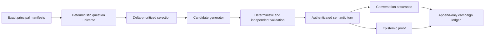

# Continuous Question Space

This document owns the bounded pipeline that derives finite question cases from an exact ontology
release, turns them into English and Korean wording, runs them through the verified semantic path,
and joins conversation assurance with epistemic coverage. The pipeline is read-only and stays in
shadow mode. It never grants action, approval, mutation, or execution authority.

> **Coverage boundary:** A finite universe measures whether every readable declaration has an
> allowed perspective or a typed exclusion. It does not promise that every case can be answered
> when a provider, anchor, retained release, or evidence source is unavailable.
>
> **Operational boundary:** Local focused checks are implementation evidence. A fresh strict v2
> and seeded live artifact are required before the current source revision becomes release evidence.

## Design at a glance

The universe is the denominator. A model can propose wording only. Core still rebuilds and verifies
the semantic plan against the exact release, manifest, role, purpose, bounds, and registered
handlers before any read.

## Implementation status

### Implementation scope

| Area | State | Evidence | Notes |
|------|-------|----------|-------|
| Semantic capability bridge | implemented | `core/ontology_platform/{declaration,release_diff,evidence_health,inventory_impact}_queries.py`; focused capability and composition checks | `query.ontology_declaration` is bound in production composition. Release diff, evidence health, and inventory impact remain visible as `runtime_binding_unavailable` until their exact providers or server-owned anchor are bound. |
| Seven-perspective universe | implemented | `core/conversation/question_perspectives.py`, `question_universe.py`, `question_selection.py`; focused universe and selection checks | Applicability is non-Cartesian. Case identity includes locale, case class, perspective, capability, evidence posture, anchor, terminal posture, action posture, Rule state, depth, and result bound. Active and collected Rule cases are distinct. |
| Candidate generation and validation | implemented | `core/conversation/question_candidates.py`; `delivery/azure/llm/question_generation.py`; `scripts/automation/question_space_copilot.py`; focused generator and validator checks | Local Copilot is explicit and tool-disabled. Scheduled generation uses separate resolved `t1.question.generator` and `t1.question.reviewer` capabilities. Immutable fields, locale, identifiers, embedded credentials, executable text, prompt injection, duplicates, draft posture, and independent equivalence are fail-closed. |
| Campaign evidence chain | implemented | `core/conversation/question_campaign*.py`; `delivery/persistence/postgres_question_campaign.py`; Alembic `0086`; focused campaign, persistence, and migration checks | Campaign, attempt, immutable completion, and expiring case-claim records retain digests, typed dispositions, receipt links, metering, and hard-zero counters. Claims prevent concurrent duplicate semantic execution. No record copies questions, answers, provider payloads, endpoints, or bound resource identities. |
| Shared one-shot package | implemented | `core/conversation/question_schedule.py`; `delivery/ontology_question_campaign.py`; `ontology_question_campaign_cli.py`; focused due-gate and shared-runner checks | Manual and scheduled triggers use one injected runner package. Disabled, not-due, missing evidence, missing model, missing Reader proof, reserved budget exhaustion, and claim contention stop before the affected model or semantic call. |
| Environment composition and deployed Job | deferred | Typed workload-principal receipt and due-gate holds; no deployment artifact | The shared package deliberately has no standalone environment composition or deployed Job until an authoritative workload-principal mapper, semantic submission port, exact model bindings, and readiness probes exist. This preserves the plan's pre-authentication stop condition. |
| Strict v2 release gate | implemented | `console/tests/live-e2e/ontology-query-assurance.ts`; `scripts/automation/run_ontology_assurance.py`; focused Console and supervisor checks | The fixed 100-case cohort remains 50/50 bilingual. Strict v2 selects 22 cells: the retained 14 plus declaration, release/evidence, inventory-impact, and Rule-state cells in both locales. Release evidence requires exact 22/22 transport. |
| Current live certification | in-progress | [Issue #233](https://github.com/dotnetpower/fdai/issues/233); exact-source run `question-space-final-f7fff0f9e-20260820-r13`; `current change`; focused semantic planning and prompt tests | Run r13 passed strict v2 with 22/22 transport, 16/16 complete-evidence answers, and every hard-zero counter at zero. Seeded assurance completed all 100 turns and isolated one Korean listing request answered through `query.manifest` plus `aggregate`. Explicit listing now rejects both an aggregation frame and an aggregate plan behind a valid listing frame, while explicit aggregation keeps precedence. Fresh exact-source strict and seeded evidence is still required for validation. |
| Scheduled workload authentication | in-progress | `fdai_service_contracts/operator.py`; `fdai_operator_service/{auth,family_authorization}.py`; focused shared-contract and Operator bridge checks | Verified app-only Entra tokens are reduced to an opaque subject digest and exactly the Reader App Role. Workload principals may submit only `chat.stream`; human routes and higher roles are not inherited. The server-owned scope and authentication receipt mapper and campaign execution port remain open. |

### Implementation history

| Date | State | Change | Evidence | Remaining |
|------|-------|--------|----------|-----------|
| 2026-08-20 | implemented | Corrected the Round 66 diagnosis after reproducing the exact live shape with a verifier that accepts the otherwise valid plan. The utterance-to-frame guard was already closed, but a valid listing frame could still accept an aggregate plan because frame-plan alignment enforced only the forward implication. Aggregate node presence and the verified `aggregate` operation now match in both directions. | `current change`; the focused tier-routing file passes 73 cases; the exact Korean fixture fails before the fix and retries only the plan stage after it; task-scoped Ruff and strict mypy pass. | Centrally validate the corrected source and retain fresh strict-v2 plus seeded artifacts. |
| 2026-08-20 | implemented | Added the workload side of the scheduled semantic authentication boundary. Operator authentication distinguishes app-only tokens, rejects every workload role set except Reader, persists only a stable subject digest, carries the workload kind through the additive semantic contract, and limits the principal to `chat.stream`. Legacy human envelopes omit the new field and remain wire-compatible. | `current change`; 93 focused shared-contract, conversation-family, semantic-bridge, and workload-auth tests passed; task-scoped Ruff and strict mypy passed. | Build the server-owned scope and authentication receipt mapper, then bind the real campaign work and execution ports before environment composition or deployment. |
| 2026-08-19 | implemented | Added the deterministic universe, seven perspectives, active/collected Rule split, candidate generation and validation, four semantic capability contracts, campaign runner and PostgreSQL ledger, schedule due gate, shared one-shot job, and strict v2 taxonomy. Earlier provenance was not reconstructed. | `current change`; 266 focused Python tests, 99 Console assurance tests, task-scoped Ruff, strict mypy, model-catalog checks, and migration checks passed before documentation. | Obtain exact-source integration validation, then run strict v2 and seeded live assurance. Implement server-side scheduled-principal mapping before adding deployed Job infrastructure. |
| 2026-08-19 | implemented | Hardened variable-perspective preflight accounting, terminal-posture verification, complete model metering and reservations, absolute no-progress deadlines, immutable campaign completion, process-loss resume, concurrent case leases, candidate redaction, typed workload-principal proof, and strict-v2 capability matching. Completed twelve independent critique rounds with no unresolved finding above Low. | [Issue #233](https://github.com/dotnetpower/fdai/issues/233); `current change`; 122 focused Python tests and 100 focused Console tests passed; task-scoped Ruff passed; strict mypy passed on 20 source files; design-route, roadmap-ledger, translation, punctuation, and readable-Hangul gates passed before this ledger refresh. | Exact-source live certification and authenticated scheduled deployment remain evidence-gated below. |
| 2026-08-19 | implemented | Recorded the authenticated strict-v2 regression that routed exact declaration and Rule-state questions to manifest or object-set plans. Added the exact `ontology_declaration` frame output, exclusive `query.ontology_declaration` plan mapping, exact subject verification, prompt guidance, and Round 13 regressions. | [Issue #233](https://github.com/dotnetpower/fdai/issues/233); `current change`; 157 focused semantic planning, composition, declaration query, processor, and round-trip tests passed; task-scoped Ruff and format checks passed; strict mypy passed on the two changed source files. | Obtain a new exact-source validation receipt and rerun strict v2. Start seeded 100 only after strict passes. |
| 2026-08-20 | implemented | Preserved declaration detail, dependents, and Rule-state intent as exact frame measures. The deterministic verifier now rejects missing intent, section drift, declaration-name drift, and kind drift against the principal manifest before execution. | `current change`; 160 focused semantic planning, composition, declaration query, processor, and round-trip tests passed; task-scoped Ruff and strict mypy are required before commit. | Obtain a new exact-source validation receipt and rerun strict v2. Start seeded 100 only after strict passes. |
| 2026-08-20 | implemented | Closed declaration plan execution and output typing. Every declaration node must be a requested output, unrelated hidden nodes are rejected, declaration frames are read-only `select`, and each output must retain `query.table`. | `current change`; 164 focused semantic planning, composition, declaration query, processor, and round-trip tests passed; task-scoped Ruff passed. | Run strict mypy and diff-scoped validation, then obtain a new exact-source validation receipt and rerun strict v2. |
| 2026-08-20 | implemented | Rejected embedded credential assignments, URI user information, and Unicode control-character obfuscation before duplicate comparison or independent review. Four adversarial ten-round cycles reviewed release identity, strict and seeded gates, universe and campaign behavior, credential bypasses, false positives, regex bounds, metering, authority, and documentation; verified Medium-or-higher findings were fixed or rejected against the owning code. | [Issue #233](https://github.com/dotnetpower/fdai/issues/233); `current change`; candidate checks passed 8 cases, exact changed tests passed 12,187 cases with 12 skips, task-scoped Ruff passed, and strict mypy passed. | No unresolved finding above Low remains. Obtain exact-source integration and live strict v2 plus seeded evidence before changing current certification to `validated`. |
| 2026-08-20 | implemented | Replaced the Browser assurance extractor's duplicated capability allowlist with the checkpoint validator's shared registry. The first exact-source rerun completed all 22 strict turns but discarded `query.ontology_declaration` from the two verified declaration answers and exposed the drift. The registry also now retains `metric_scope_series`. | [Issue #233](https://github.com/dotnetpower/fdai/issues/233); `current change`; live run `question-space-final-9fb7cb213-20260820-r6` recorded exact 22-turn transport and only the two extractor mismatches; 100 focused assurance tests and Console typecheck passed after the fix. | Centrally validate the corrected source and rerun strict v2. Start seeded 100 only after strict passes. |
| 2026-08-20 | implemented | Versioned semantic frame prompt v23 after the corrected strict-v2 extractor exposed both relationship-type count questions as unsupported. Schema aggregation subjects must now use the canonical manifest kinds, including `link` for relationship or relationship type, so an alias cannot remain fixed across both plan-tier retries. | [Issue #233](https://github.com/dotnetpower/fdai/issues/233); `current change`; live run `question-space-final-2333d7b69-20260820-r7`; focused prompt registry contract passed. | Centrally validate frame v23 and rerun strict v2. Start seeded 100 only after all 16 answer-required cells answer with complete evidence. |
| 2026-08-20 | implemented | Added dedicated `ontology_release_evidence_health` and `inventory_impact` frame outputs after strict-v2 run r8 showed unavailable extension functions being replaced by generic topology or object-set answers. Deterministic alignment now requires the exact inventory function or the complete release-diff plus evidence-health function set, and prompt versions v24 and v17 preserve those families without inventing a server-owned target. | [Issue #233](https://github.com/dotnetpower/fdai/issues/233); `current change`; exact-source run `question-space-final-a50812c49-20260820-r8`; 61 focused semantic planning and prompt registry tests passed; task-scoped Ruff and strict mypy passed. | Obtain a new exact-source validation receipt and rerun strict v2. Start seeded 100 only after strict passes. |
| 2026-08-20 | implemented | Bound two exact plan axes from the already verified frame after strict-v2 run r9 fell below the immutable answer minimum. Schema aggregation rewrites `query.manifest` kinds to the canonical declaration subjects, and an empty property-filter plan gains only exact descriptor properties named by the frame. Prompt versions v25 and v18 close the relationship-count and declared-resource-type shapes. | [Issue #233](https://github.com/dotnetpower/fdai/issues/233); `current change`; exact-source run `question-space-final-709603208-20260820-r9` transported and judged 22/22 with hard-zero counters at zero but answered 15; 62 focused semantic planning and prompt registry tests passed; task-scoped Ruff and strict mypy passed. | Obtain a new exact-source validation receipt and rerun strict v2. Start seeded 100 only after strict passes. |
| 2026-08-20 | implemented | Narrowed the preceding property-filter binding after a 14-lens adversarial review found that a generic missing predicate could weaken value-bearing semantics to existence. Only the closed `Resource` subject with the sole `type` measure can add `Resource.type exists`; other single or mixed measures remain unsupported. | `current change`; focused positive and negative semantic planning controls passed; task-scoped Ruff, format, and strict mypy passed. | Retain passing strict-v2 and seeded assurance records for the narrowed exact source. |
| 2026-08-20 | implemented | Replaced the seeded release oracle's impossible uniform operation count with exact comparison against the deterministic generated cohort. Adding four extension operation families made the old `10 per operation` rule demand 140 results from a fixed 100-case cohort even when every turn passed. Missing or substituted operation results still fail the exact histogram check. | [Issue #233](https://github.com/dotnetpower/fdai/issues/233); `current change`; exact-source run `question-space-final-b4604e07b-20260820-r11` passed strict 22/22 and judged seeded 100/100 with 81/81 complete-evidence answers, required-answer coverage complete, and every hard-zero counter at zero; focused Console assurance tests passed 101 cases. | Centrally validate the corrected source, then retain fresh strict-v2 and seeded artifacts. |
| 2026-08-20 | implemented | Added the canonical `aggregate` semantic operation and a fail-closed utterance-to-frame consistency check after run r12 exposed one Korean grouping request as a filtered ObjectSet answer. Explicit English or Korean count and grouping operators can only reject a nonaggregation frame and trigger the bounded frame retry; they never select or build a capability. Aggregate operation and output shape must match in both directions, and frame prompt v26 requires both. | [Issue #233](https://github.com/dotnetpower/fdai/issues/233); `current change`; exact-source run `question-space-final-b997de285-20260820-r12` completed seeded 100/100 with one `semantic_plan_operation_mismatch`; 79 focused shared-contract, semantic planning, and prompt tests passed; task-scoped Ruff, format, and strict mypy passed. | Centrally validate the corrected source, then retain fresh strict-v2 and seeded artifacts. |
| 2026-08-20 | implemented | Narrowed the English explicit-grouping guard after central downstream tests showed that bare `group` also matched the domain noun in `network security group`. Imperative grouping now requires bounded `group ... by` syntax, while `grouped` and `grouping` remain explicit operators. The manifest aggregate fixture also uses the canonical operation. | `current change`; the two previously failing composition consumers plus seven positive, negative, bilingual, domain-noun, and false-positive controls passed; the complete focused slice passed 82 cases with Ruff, format, and strict mypy. | Centrally validate the corrected source, then retain fresh strict-v2 and seeded artifacts. |
| 2026-08-20 | implemented | Extended the rejection-only Korean aggregation vocabulary after adversarial review found two common operators outside the prior exact set. `그루핑` and `합계` now reject a nonaggregation frame without selecting or building a capability. | `current change`; nine positive, negative, bilingual, Korean-recall, domain-noun, and false-positive controls passed; the complete focused slice passed 84 cases with Ruff, format, and strict mypy. | Centrally validate the corrected source, then retain fresh strict-v2 and seeded artifacts. |
| 2026-08-20 | implemented | Added the symmetric explicit-listing consistency check after run r13 exposed one Korean inventory listing as an aggregate answer. English and Korean list, show, and find operators reject `aggregation_table` only when no explicit count, total, or grouping operator is present. The check remains rejection-only, and prompt v27 requires `select` for the same request shape. | [Issue #233](https://github.com/dotnetpower/fdai/issues/233); `current change`; run `question-space-final-f7fff0f9e-20260820-r13` passed strict 22/22 and completed seeded 100/100 with one capability mismatch; thirteen aggregate/listing symmetry, bilingual, precedence, domain-noun, and false-positive controls passed. | Centrally validate the corrected source, then retain fresh strict-v2 and seeded artifacts. |
| 2026-08-20 | implemented | Expanded the round 66 focused validation after migrating the two aggregate-plan fixtures to explicit aggregation utterances and restoring two unrelated test utterances changed during the edit loop. | `current change`; the complete 88-case contract, semantic, prompt, and composition slice passed with Ruff, format, and strict mypy. | Centrally validate the corrected source, then retain fresh strict-v2 and seeded artifacts. |

### Remaining work

- [ ] Obtain a passing integration-validation receipt for the exact committed source revision, then
  retain one fresh strict v2 artifact with 22/22 request and projection transport, every typed
  judgment passing, every answered turn evidence-complete, and every hard-zero counter at zero.
- [ ] Allow the supervisor to start the seeded 100-case run only after strict v2 passes, and retain
  one repository-safe source-bound artifact with exact 100/100 transport and no safety regression.
- [ ] Complete the authenticated workload-principal Reader mapping with a server-owned scope
  digest, role source, `operations-review` purpose, authentication evidence, and expiry. A missing
  mapping must continue to produce `scheduled_principal_unavailable` or
  `scheduled_principal_reader_mapping_unavailable` before model work.
- [ ] After the principal contract passes focused review, bind the disabled schedule profile to a
  standalone environment composition and one-shot deployment, then retain one governed scheduled
  shadow run within measured token, cost, time, and no-progress budgets.
- [ ] Enable a bounded weekly delta profile only after two explicitly reviewed consecutive shadow
  runs retain exact transport and all hard-zero counters at zero. Keep weekly 100-case execution
  disabled until cost and stability are explicitly approved.

## Semantic capability bridge

| FunctionType | Binding rule | Result authority |
|--------------|--------------|------------------|
| `query.ontology_declaration` | Always bound to the exact loaded catalog release. Object properties are filtered by invocation role and purpose. | Exact declaration or deterministic dependents, no authority. |
| `query.ontology_release_diff` | Bound only with a retained exact-release registry. | Declaration-reference additions, changes, removals, and compatibility. Historical field schemas are never reconstructed. |
| `query.ontology_evidence_health` | Bound only with a sanitized health reader. | Availability, freshness, completeness, conflicts, synthetic state, nullable counts, and evidence refs. Verified zero stays distinct from unavailable. |
| `query.inventory_impact` | Bound only with an authenticated server-owned resource anchor and active inventory reader. | Stored-direction reachability with depth `1..5`, at most 16 LinkTypes, at most 1,000 edges, explicit truncation, and `unverified` edges. |

The inventory-impact input schema has no target field. A model cannot supply or replace the target.
Until request-scoped resource anchoring exists in production composition, the capability remains
unavailable to ordinary-language planning.

## Finite question universe

The seven perspectives are `resource`, `service`, `operation`, `policy`, `business`, `causal`, and
`action`. Applicability depends on declaration kind, exact declaration name, LinkType semantics,
and required capability. Unknown object declarations receive an `operation` fallback rather than
every perspective.

Each generated case binds these fields:

- principal manifest and declaration digests;
- perspective and required capability family;
- English or Korean locale and behavioral case class;
- fresh, stale, incomplete, conflicting, or unavailable evidence posture;
- no anchor, selected object, selected incident, or server scope;
- answer, clarification, hold, unsupported, or action-draft posture;
- `active`, `collected`, or `not_applicable` Rule state;
- bounded depth and result count.

ActionType cases are always `draft_only`. Collected Rule cases are reference-only and cannot become
policy verdicts. The generator fails before expansion when the preflight count exceeds 10,000.

Selection prioritizes changed declarations, changed capability availability, inventory deltas,
failed or held cases, oldest unverified cells, and stable sentinels. A seeded hash of the case id
breaks ties without changing case identity. One campaign can select at most 100 cases.

## Candidate boundary

Candidate validation runs in this order:

1. Require the exact schema and immutable case fields.
2. Enforce locale and the 8 to 400 character bound.
3. Reject UUIDs, provider resource ids, endpoints, credentials, and bearer-like tokens.
4. Reject Pantheon names on server-owned resource questions.
5. Reject exact and token-near duplicates.
6. Require capability, anchor, Rule state, terminal posture, and draft posture consistency.
7. Reject prompt injection and executable SQL, CLI, shell, or provider query text.
8. Join an independently bound semantic-equivalence review at confidence `>= 0.85`.
9. Reject embedding similarity `>= 0.92` against the retained corpus.

Invalid output is never repaired in place. The runner retries at most three times and then records a
typed hold without retaining the failed provider response.

## Campaign and ledgers

Campaign identity includes the source revision, ontology release, principal manifests, universe,
generation profile, model set, scope, start time, trigger, and all budgets. Scheduled campaigns
require positive token and cost budgets. Every campaign remains `shadow`.

The hard-zero counters are:

- unsupported claims;
- unauthorized execution;
- hidden-scope leaks;
- unsafe mutation survivors;
- locale divergence;
- active/collected Rule confusion;
- unverified impact promoted to causal or business impact;
- truncated output reported as complete.

Any positive counter blocks release evidence. A completed subset creates progress evidence. Full
universe closure is true only when the selected ids equal the exact universe and every latest case
has epistemic proof.

## Scheduling and rollout

Schedule profiles reference generation and model profile ids, never deployment names. They validate
a strict five-field cron, IANA timezone, locales, perspectives, question count, token, cost, total
time, and no-progress ceilings. Profiles default disabled and remain shadow-only.

The due gate checks enabled state and cron bucket before readiness. It then requires the previous
campaign to be terminal, exact ontology and manifest availability, semantic transport, authenticated
Reader mapping, model availability, evidence readiness, budget, and an available campaign lock.
No failed gate can invoke the generator.

## Hardening record

| Round | Lens | Highest verified severity | Evidence and disposition |
|-------|------|---------------------------|--------------------------|
| 1 | Universe denominator and identity | Low | Variable perspective multiplicity is included before expansion; bilingual seven-perspective and Rule-state uniqueness checks pass. Exclusions remain denominator records. |
| 2 | Candidate leakage and injection | High, resolved | Removed provider exception chaining and added Bearer-colon, SAS signature, GitHub token, and common prompt-injection rejection tests. |
| 3 | Semantic release and authority | Low | Exact release, role, purpose, and typed-unavailable composition checks pass; ontology results carry no authority. |
| 4 | Inventory impact | Low | Server-owned target, stored direction, endpoint closure, bounds, truncation, unverified edges, and planner unavailability were confirmed. Residual gaps are negative-test depth only. |
| 5 | Budgets, retries, and deadlines | Medium, resolved | Added conservative scheduled call reservations, complete generation/review/assurance metering, absolute retry deadlines, and proof-required release eligibility. |
| 6 | Persistence and process loss | Medium, resolved | Added immutable completion records and expiring per-case claims; a contending runner performs zero generator calls and writes no conflicting completion. |
| 7 | Scheduled identity | Medium, resolved | Replaced forgeable readiness booleans with a typed workload receipt; human kind, missing proof, expired proof, non-Reader role, and wrong purpose fail before work. |
| 8 | Strict v2 oracle | Low | Exact 22-cell taxonomy, 11/11 locales, answer-if-produced capabilities, evidence completeness, transport identity, and strict-before-seeded gates were confirmed. |
| 9 | Privacy and generic scope | Low | Persistent records and CLI projections retain only bounded identities, digests, counts, and metering; transient question and answer text remains assurance-only. |
| 10 | Roadmap truthfulness | High, resolved | Replaced stale validation counts, distinguished package implementation from environment composition, and recorded the terminal source-binding hold without a live-result claim. |
| 11 | Service and deployment boundaries | Low | Core stays provider-neutral, delivery owns adapters and persistence, both triggers share one package, and deployment remains blocked by the documented authentication stop condition. |
| 12 | Final adversarial closure | Low | Rechecked all preceding lenses after fixes. Composition tests prove unavailable impact functions are absent from planner function names. No unresolved Medium, High, or Critical finding remains. |
| 13 | Live semantic capability routing | Medium, resolved | An authenticated strict-v2 run executed 22 cells and exposed four exact declaration or Rule-state questions planned as `query.manifest` or `object_set`. Added the exclusive `ontology_declaration` output family, exact declaration-name verification, prompt rules, and T1/T2 routing regressions. The focused semantic slice passes 157 tests; live recertification remains open above. |
| 14 | Declaration intent preservation | Medium, resolved | The plan model does not receive the original utterance, so capability and subject alone could not distinguish detail from dependents. Added exact frame measures for detail, dependents, and Rule state, then bound function section, name, and kind to those measures and the principal manifest. Missing or drifted axes now retry through the bounded T1/T2 cascade; the focused semantic slice passes 160 tests. |
| 15 | Requested output closure | Medium, resolved | Required declaration frames to use read-only `select` and required every requested detail or dependents node to appear in the final outputs. A hidden requested section now causes bounded plan retry. |
| 16 | Hidden execution scope | Medium, resolved | Rejected every non-declaration or non-output node in a declaration plan. A model cannot add an unrelated hidden read behind the exact declaration result. |
| 17 | Function output typing | Medium, resolved | Bound every `query.ontology_declaration` node to `query.table` in deterministic alignment because the generic function verifier validates input schema but does not derive node output kinds from JSON Schema. Output-kind spoofing now causes bounded plan retry. The focused semantic slice passes 164 tests, and no unresolved finding above Low remains. |
| 18-27 | Cross-contract adversarial review | High, resolved | Found one reproducible candidate-boundary leak: structured connection strings could pass into independent review. Added assignment and URI-user-info rejection. Claims about missing timeouts, expired principals, strict/seeded gates, and release identity were rejected against the executed owning paths. |
| 28-37 | Credential bypass and false-positive review | Medium, resolved | Added generic secret and token assignment boundaries plus universal Unicode `Cc` and `Cf` rejection after reproducing ampersand and zero-width obfuscation. Broad bare-key and confusable rejection was rejected to avoid unsupported false positives. |
| 38-47 | URI and punctuation closure review | Medium, resolved | Generalized punctuation-safe assignment detection and provider-neutral URI user-information rejection. Existing URL rejection and safety-before-review ordering disproved two repeated findings. |
| 48-57 | Final closure review | Low | Rechecked punctuation, generic URI schemes, English and Korean false positives, control characters, regex complexity, validation ordering, campaign metering, provider neutrality, and documentation. Remaining observations are explicit test-case expansion only; no unresolved Medium, High, or Critical finding remains. |
| 58 | Live assurance capability extraction | Medium, resolved | Exact-source strict v2 proved the Browser extractor's local capability allowlist had drifted from the typed assurance registry. A single exported registry now drives Browser extraction and checkpoint validation, including every strict-v2 function and `metric_scope_series`. |
| 59 | Strict aggregation frame identity | Medium, resolved | Both planning tiers inherited a noncanonical relationship-kind subject from one accepted frame and rejected their plans against the exact manifest kinds. Frame v23 requires canonical `object`, `interface`, `link`, `action`, or `function` subjects for schema aggregation and maps relationship type to `link`. Live recertification remains the open evidence item above. |
| 60 | Exact extension capability substitution | Medium, resolved | Run r8 proved all answer-required cells but exposed four optional extension answers through generic `topology_at` or `object_set` plans while the exact specialized functions were unavailable. Dedicated frame families and deterministic function-set alignment now force a typed hold unless the exact capability is present. Positive and negative routing controls pass. |
| 61 | Required-answer plan-axis drift | Medium, resolved | Run r9 preserved exact transport, judgments, evidence, and hard-zero safety but answered only 15 cells. Both tiers could reinterpret canonical schema-aggregate kinds or omit a property predicate after the frame had already fixed those axes. Core now reapplies only those exact frame and manifest facts before verification; ambiguous measures and existing predicates remain untouched. |
| 62 | Frame-bound predicate overreach | Medium, resolved | A 14-lens adversarial review found that generic missing-predicate binding could weaken a value-bearing property filter into a broad existence check. Binding is now limited to the one closed `Resource` subject and `type` measure; single or mixed nonclosed measures remain unsupported across both planning tiers. The remaining findings were rejected against deep-copy, principal-manifest, grounding, and verifier boundaries or retained as Low observability and test-depth items. |
| 63 | Seeded operation coverage arithmetic | High, resolved | Run r11 completed all 100 seeded turns with no judgment, evidence, capability, transport, authority, or safety failure, but `production_ready` remained false because the gate required ten cases for every base and extension operation. Exact result-to-cohort histogram equality now derives the denominator from the deterministic generator and rejects missing or substituted operations without duplicating counts. |
| 64 | Aggregation intent identity | High, resolved | Run r12 completed all 100 seeded turns and isolated one Korean grouping request whose frame and plan consistently claimed a property filter. `SemanticOperation` previously had no aggregation token, so deterministic alignment had no requested-result operator to verify. The additive `aggregate` token, bidirectional operation-output invariant, conservative explicit-operator mismatch rejection, and v26 prompt close that gap. Seven positive, negative, bilingual, domain-noun, and false-positive controls pass; no unresolved finding above Low remains. |
| 65 | Korean aggregation operator recall | Medium, resolved | A 14-lens follow-up found that common Korean `그루핑` and `합계` requests were not recognized by the rejection-only consistency guard. Both now trigger bounded frame retry, while the 80-character English `group ... by` bound, current-turn-only input, domain-noun exclusions, wire compatibility, authority, and privacy boundaries remain unchanged. No unresolved finding above Low remains. |
| 66 | Listing result-operator identity | High, resolved | Run r13 passed strict v2 and completed seeded 100/100, then isolated one Korean listing request whose frame and plan consistently claimed aggregation. A symmetric rejection-only guard now preserves explicit listing intent when no aggregation operator is present, while explicit count or grouping takes precedence. Prompt v27 and thirteen controls close the EN/KO, precedence, and false-positive boundaries; no unresolved finding above Low remains. |
| 67 | Listing frame-plan operation closure | High, resolved | A production-equivalent verifier disproved Round 66's assumption that the accepted frame itself was aggregate. The listing frame was valid, but frame-plan alignment allowed an aggregate node because it checked only that aggregate frames contained one. Aggregate node presence now equals the verified `aggregate` frame operation, so a listing frame retries the plan stage and cannot execute the aggregate result. |

The residual Low items are additional negative tests for inventory traversal edge cases, retained
cross-campaign duplicate corpus evidence, historical release-diff regression naming, additional
URI schemes, legitimate credential vocabulary, and Korean safety variants. They do not widen
scope, authority, mutation, release eligibility, or deployment readiness.

## Related docs

| To learn about | Read |
|----------------|------|
| Verified semantic query contracts | [Ontology Query Coverage Implementation Plan](ontology-query-coverage-implementation-plan.md) |
| Current governed live baseline | [Ontology Query Randomized Assurance](ontology-query-randomized-assurance.md) |
| Ontology declarations and typed functions | [FDAI Ontology Safety Infrastructure](../architecture/operating-ontology-platform.md) |
| Off-path answer evaluation | [Conversation Assurance](../decisioning/conversation-assurance.md) |
