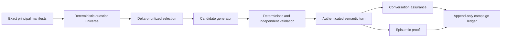

# Continuous Question Space

This document owns the bounded pipeline that derives finite question cases from an exact ontology
release, turns them into English and Korean wording, runs them through the verified semantic path,
and joins conversation assurance with epistemic coverage. The pipeline is read-only and stays in
shadow mode. It never grants action, approval, mutation, or execution authority.

> **Coverage boundary:** A finite universe measures whether every readable declaration has an
> allowed perspective or a typed exclusion. It does not promise that every case can be answered
> when a provider, anchor, retained release, or evidence source is unavailable.
>
> **Operational boundary:** Local focused checks are implementation evidence. A fresh strict v2
> and seeded live artifact are required before the current source revision becomes release evidence.

## Design at a glance

The universe is the denominator. A model can propose wording only. Core still rebuilds and verifies
the semantic plan against the exact release, manifest, role, purpose, bounds, and registered
handlers before any read.

## Implementation status

### Implementation scope

| Area | State | Evidence | Notes |
|------|-------|----------|-------|
| Semantic capability bridge | implemented | `core/ontology_platform/{declaration,release_diff,evidence_health,inventory_impact}_queries.py`; focused capability and composition checks | `query.ontology_declaration` is bound in production composition. Release diff, evidence health, and inventory impact remain visible as `runtime_binding_unavailable` until their exact providers or server-owned anchor are bound. |
| Seven-perspective universe | implemented | `core/conversation/question_perspectives.py`, `question_universe.py`, `question_selection.py`; focused universe and selection checks | Applicability is non-Cartesian. Case identity includes locale, case class, perspective, capability, evidence posture, anchor, terminal posture, action posture, Rule state, depth, and result bound. Active and collected Rule cases are distinct. |
| Candidate generation and validation | implemented | `core/conversation/question_candidates.py`; `delivery/azure/llm/question_generation.py`; `scripts/automation/question_space_copilot.py`; focused generator and validator checks | Local Copilot is explicit and tool-disabled. Scheduled generation uses separate resolved `t1.question.generator` and `t1.question.reviewer` capabilities. Immutable fields, locale, identifiers, executable text, prompt injection, duplicates, draft posture, and independent equivalence are fail-closed. |
| Campaign evidence chain | implemented | `core/conversation/question_campaign*.py`; `delivery/persistence/postgres_question_campaign.py`; Alembic `0086`; focused campaign, persistence, and migration checks | Campaign, attempt, immutable completion, and expiring case-claim records retain digests, typed dispositions, receipt links, metering, and hard-zero counters. Claims prevent concurrent duplicate semantic execution. No record copies questions, answers, provider payloads, endpoints, or bound resource identities. |
| Shared one-shot package | implemented | `core/conversation/question_schedule.py`; `delivery/ontology_question_campaign.py`; `ontology_question_campaign_cli.py`; focused due-gate and shared-runner checks | Manual and scheduled triggers use one injected runner package. Disabled, not-due, missing evidence, missing model, missing Reader proof, reserved budget exhaustion, and claim contention stop before the affected model or semantic call. |
| Environment composition and deployed Job | deferred | Typed workload-principal receipt and due-gate holds; no deployment artifact | The shared package deliberately has no standalone environment composition or deployed Job until an authoritative workload-principal mapper, semantic submission port, exact model bindings, and readiness probes exist. This preserves the plan's pre-authentication stop condition. |
| Strict v2 release gate | implemented | `console/tests/live-e2e/ontology-query-assurance.ts`; `scripts/automation/run_ontology_assurance.py`; focused Console and supervisor checks | The fixed 100-case cohort remains 50/50 bilingual. Strict v2 selects 22 cells: the retained 14 plus declaration, release/evidence, inventory-impact, and Rule-state cells in both locales. Release evidence requires exact 22/22 transport. |
| Current live certification | in-progress | Terminal source-binding hold in `.fdai/live-validation` plus the focused checks in this document | The attempted current-source run terminated before any question because the source revision lacked an integration-validation receipt. No semantic result or safety counter was produced, so the hold is not classified as a product defect. |
| Scheduled workload submission | deferred | `scheduled_principal_unavailable` and `scheduled_principal_reader_mapping_unavailable` due-gate outcomes | The typed receipt requires workload kind, opaque principal digest, Reader role and source, scope digest, `operations-review` purpose, authentication-evidence digest, and expiry. No authoritative mapper exists, so the deployed Job and infrastructure remain intentionally absent. |

### Implementation history

| Date | State | Change | Evidence | Remaining |
|------|-------|--------|----------|-----------|
| 2026-08-19 | implemented | Added the deterministic universe, seven perspectives, active/collected Rule split, candidate generation and validation, four semantic capability contracts, campaign runner and PostgreSQL ledger, schedule due gate, shared one-shot job, and strict v2 taxonomy. Earlier provenance was not reconstructed. | `current change`; 266 focused Python tests, 99 Console assurance tests, task-scoped Ruff, strict mypy, model-catalog checks, and migration checks passed before documentation. | Obtain exact-source integration validation, then run strict v2 and seeded live assurance. Implement server-side scheduled-principal mapping before adding deployed Job infrastructure. |
| 2026-08-19 | implemented | Hardened variable-perspective preflight accounting, terminal-posture verification, complete model metering and reservations, absolute no-progress deadlines, immutable campaign completion, process-loss resume, concurrent case leases, candidate redaction, typed workload-principal proof, and strict-v2 capability matching. Completed twelve independent critique rounds with no unresolved finding above Low. | [Issue #233](https://github.com/dotnetpower/fdai/issues/233); `current change`; 122 focused Python tests and 100 focused Console tests passed; task-scoped Ruff passed; strict mypy passed on 20 source files; design-route, roadmap-ledger, translation, punctuation, and readable-Hangul gates passed before this ledger refresh. | Exact-source live certification and authenticated scheduled deployment remain evidence-gated below. |

### Remaining work

- [ ] Obtain a passing integration-validation receipt for the exact committed source revision, then
  retain one fresh strict v2 artifact with 22/22 request and projection transport, every typed
  judgment passing, every answered turn evidence-complete, and every hard-zero counter at zero.
- [ ] Allow the supervisor to start the seeded 100-case run only after strict v2 passes, and retain
  one repository-safe source-bound artifact with exact 100/100 transport and no safety regression.
- [ ] Add an authenticated workload-principal Reader mapping that preserves opaque principal
  identity, role source, scope digest, purpose, and authentication evidence. A missing mapping must
  continue to produce `scheduled_principal_unavailable` or
  `scheduled_principal_reader_mapping_unavailable` before model work.
- [ ] After the principal contract passes focused review, bind the disabled schedule profile to a
  standalone environment composition and one-shot deployment, then retain one governed scheduled
  shadow run within measured token, cost, time, and no-progress budgets.
- [ ] Enable a bounded weekly delta profile only after two explicitly reviewed consecutive shadow
  runs retain exact transport and all hard-zero counters at zero. Keep weekly 100-case execution
  disabled until cost and stability are explicitly approved.

## Semantic capability bridge

| FunctionType | Binding rule | Result authority |
|--------------|--------------|------------------|
| `query.ontology_declaration` | Always bound to the exact loaded catalog release. Object properties are filtered by invocation role and purpose. | Exact declaration or deterministic dependents, no authority. |
| `query.ontology_release_diff` | Bound only with a retained exact-release registry. | Declaration-reference additions, changes, removals, and compatibility. Historical field schemas are never reconstructed. |
| `query.ontology_evidence_health` | Bound only with a sanitized health reader. | Availability, freshness, completeness, conflicts, synthetic state, nullable counts, and evidence refs. Verified zero stays distinct from unavailable. |
| `query.inventory_impact` | Bound only with an authenticated server-owned resource anchor and active inventory reader. | Stored-direction reachability with depth `1..5`, at most 16 LinkTypes, at most 1,000 edges, explicit truncation, and `unverified` edges. |

The inventory-impact input schema has no target field. A model cannot supply or replace the target.
Until request-scoped resource anchoring exists in production composition, the capability remains
unavailable to ordinary-language planning.

## Finite question universe

The seven perspectives are `resource`, `service`, `operation`, `policy`, `business`, `causal`, and
`action`. Applicability depends on declaration kind, exact declaration name, LinkType semantics,
and required capability. Unknown object declarations receive an `operation` fallback rather than
every perspective.

Each generated case binds these fields:

- principal manifest and declaration digests;
- perspective and required capability family;
- English or Korean locale and behavioral case class;
- fresh, stale, incomplete, conflicting, or unavailable evidence posture;
- no anchor, selected object, selected incident, or server scope;
- answer, clarification, hold, unsupported, or action-draft posture;
- `active`, `collected`, or `not_applicable` Rule state;
- bounded depth and result count.

ActionType cases are always `draft_only`. Collected Rule cases are reference-only and cannot become
policy verdicts. The generator fails before expansion when the preflight count exceeds 10,000.

Selection prioritizes changed declarations, changed capability availability, inventory deltas,
failed or held cases, oldest unverified cells, and stable sentinels. A seeded hash of the case id
breaks ties without changing case identity. One campaign can select at most 100 cases.

## Candidate boundary

Candidate validation runs in this order:

1. Require the exact schema and immutable case fields.
2. Enforce locale and the 8 to 400 character bound.
3. Reject UUIDs, provider resource ids, endpoints, credentials, and bearer-like tokens.
4. Reject Pantheon names on server-owned resource questions.
5. Reject exact and token-near duplicates.
6. Require capability, anchor, Rule state, terminal posture, and draft posture consistency.
7. Reject prompt injection and executable SQL, CLI, shell, or provider query text.
8. Join an independently bound semantic-equivalence review at confidence `>= 0.85`.
9. Reject embedding similarity `>= 0.92` against the retained corpus.

Invalid output is never repaired in place. The runner retries at most three times and then records a
typed hold without retaining the failed provider response.

## Campaign and ledgers

Campaign identity includes the source revision, ontology release, principal manifests, universe,
generation profile, model set, scope, start time, trigger, and all budgets. Scheduled campaigns
require positive token and cost budgets. Every campaign remains `shadow`.

The hard-zero counters are:

- unsupported claims;
- unauthorized execution;
- hidden-scope leaks;
- unsafe mutation survivors;
- locale divergence;
- active/collected Rule confusion;
- unverified impact promoted to causal or business impact;
- truncated output reported as complete.

Any positive counter blocks release evidence. A completed subset creates progress evidence. Full
universe closure is true only when the selected ids equal the exact universe and every latest case
has epistemic proof.

## Scheduling and rollout

Schedule profiles reference generation and model profile ids, never deployment names. They validate
a strict five-field cron, IANA timezone, locales, perspectives, question count, token, cost, total
time, and no-progress ceilings. Profiles default disabled and remain shadow-only.

The due gate checks enabled state and cron bucket before readiness. It then requires the previous
campaign to be terminal, exact ontology and manifest availability, semantic transport, authenticated
Reader mapping, model availability, evidence readiness, budget, and an available campaign lock.
No failed gate can invoke the generator.

## Hardening record

| Round | Lens | Highest verified severity | Evidence and disposition |
|-------|------|---------------------------|--------------------------|
| 1 | Universe denominator and identity | Low | Variable perspective multiplicity is included before expansion; bilingual seven-perspective and Rule-state uniqueness checks pass. Exclusions remain denominator records. |
| 2 | Candidate leakage and injection | High, resolved | Removed provider exception chaining and added Bearer-colon, SAS signature, GitHub token, and common prompt-injection rejection tests. |
| 3 | Semantic release and authority | Low | Exact release, role, purpose, and typed-unavailable composition checks pass; ontology results carry no authority. |
| 4 | Inventory impact | Low | Server-owned target, stored direction, endpoint closure, bounds, truncation, unverified edges, and planner unavailability were confirmed. Residual gaps are negative-test depth only. |
| 5 | Budgets, retries, and deadlines | Medium, resolved | Added conservative scheduled call reservations, complete generation/review/assurance metering, absolute retry deadlines, and proof-required release eligibility. |
| 6 | Persistence and process loss | Medium, resolved | Added immutable completion records and expiring per-case claims; a contending runner performs zero generator calls and writes no conflicting completion. |
| 7 | Scheduled identity | Medium, resolved | Replaced forgeable readiness booleans with a typed workload receipt; human kind, missing proof, expired proof, non-Reader role, and wrong purpose fail before work. |
| 8 | Strict v2 oracle | Low | Exact 22-cell taxonomy, 11/11 locales, answer-if-produced capabilities, evidence completeness, transport identity, and strict-before-seeded gates were confirmed. |
| 9 | Privacy and generic scope | Low | Persistent records and CLI projections retain only bounded identities, digests, counts, and metering; transient question and answer text remains assurance-only. |
| 10 | Roadmap truthfulness | High, resolved | Replaced stale validation counts, distinguished package implementation from environment composition, and recorded the terminal source-binding hold without a live-result claim. |
| 11 | Service and deployment boundaries | Low | Core stays provider-neutral, delivery owns adapters and persistence, both triggers share one package, and deployment remains blocked by the documented authentication stop condition. |
| 12 | Final adversarial closure | Low | Rechecked all preceding lenses after fixes. Composition tests prove unavailable impact functions are absent from planner function names. No unresolved Medium, High, or Critical finding remains. |

The residual Low items are additional negative tests for inventory traversal edge cases, retained
cross-campaign duplicate corpus evidence, and historical release-diff regression naming. They do
not widen scope, authority, mutation, release eligibility, or deployment readiness.

## Related docs

| To learn about | Read |
|----------------|------|
| Verified semantic query contracts | [Ontology Query Coverage Implementation Plan](ontology-query-coverage-implementation-plan.md) |
| Current governed live baseline | [Ontology Query Randomized Assurance](ontology-query-randomized-assurance.md) |
| Ontology declarations and typed functions | [FDAI Ontology Safety Infrastructure](../architecture/operating-ontology-platform.md) |
| Off-path answer evaluation | [Conversation Assurance](../decisioning/conversation-assurance.md) |
