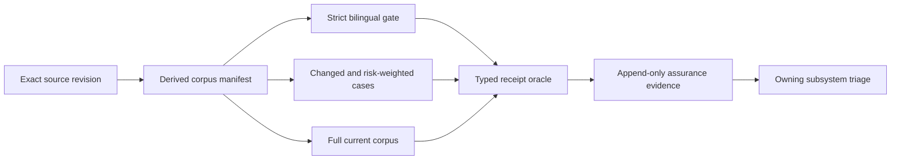

# 지속형 의미 보증

이 문서는 FDAI의 전체 의미 질문 corpus를 지속해서 검증하는 책임을 소유합니다. 고정된 질문
개수를 사용하지 않고 정확한 소스 리비전에서 측정 분모를 도출하며, 릴리스, 예약 실행, 변경
중심 근거를 로드맵 패키지 완료와 분리합니다.

> **권한 경계:** 캠페인 통과는 하나의 정확한 소스 리비전에 대한 타입 지정 해석, 근거 처리,
> 권한 없음 동작을 입증합니다. 승인, 변경, 승격 또는 실행 권한을 부여하지 않습니다.
>
> **소유권 경계:** [지속형 질문 공간](continuous-question-space-ko.md)은 질문 도출과 corpus
> 신원을 소유합니다. 이 문서는 해당 질문을 실행하고 인증하는 시점과 방법을 소유합니다.
> [온톨로지 쿼리 무작위 보증](ontology-query-randomized-assurance-ko.md)은 과거 점수 및 통제
> 기준선을 보존합니다.

## 설계 개요

Corpus 크기는 소스 리비전의 관측 속성입니다. 논리 기대치, 언어, 표현 방식, 근거 상태, 기능
또는 metamorphic case를 추가하면 분모가 자동으로 바뀝니다. 개수가 늘었다는 이유만으로 문서나
로드맵 항목을 수정할 필요는 없습니다.

## 보증 입력

| 입력 | 현재 측정 모양 | 계약 |
|------|----------------|------|
| 리포지토리 golden corpus | 논리 기대치 35개, 표현 방식 8개, 로캘 2개, 로캘 case 560개 | 매니페스트에서 도출한 합계가 권위 있습니다. 현재 숫자는 근거이며 영구 gate가 아닙니다. |
| Strict 이중 언어 gate | 고정된 고신호 cell 22개 | 필요한 모든 operation 및 locale cell이 정확한 전송과 타입 지정 terminal 결과를 보존해야 합니다. |
| Seeded 보증 | 균형 잡힌 live case 100개 | Seed, 소스 리비전, 생성기 구성 및 정확한 결과 histogram을 함께 보존합니다. |
| 생성된 질문 우주 | 정확한 ontology release, manifest, perspective 및 evidence posture에 따라 가변 | 읽을 수 있는 모든 declaration에는 타입이 지정된 case 또는 제외 사유가 필요합니다. 표본 추출은 구조 범위를 대체할 수 없습니다. |
| 집중 회귀 overlay | 의미 판단과 incident 또는 target-bound edge case를 포함해 가변 | 재현된 결함은 소유 수정이 수락되기 전에 durable typed 회귀를 추가합니다. |

현재 corpus 개수는 구조화된 소스 artifact에서 다시 계산합니다. 로드맵 종료 조건에 복사하거나
안정적인 제품 상수로 취급하지 않습니다.

## 실행 프로필

### 변경 중심 검증

변경이 의미 계획, prompt, ontology declaration, principal manifest, capability binding, typed
oracle, 질문 생성 또는 evidence projection을 수정하면 strict 이중 언어 gate와 영향을 받는 모든
case family를 실행합니다. 선택 기록은 변경된 소스 경로와 각 case가 cohort에 들어온 결정론적
사유를 보존합니다.

### 릴리스 인증

의미 릴리스를 인증하기 전에 정확한 소스 리비전에서 도출한 전체 corpus를 실행합니다. 범위가
제한된 readiness가 통과한 뒤에만 실행을 시작합니다. 부분, 재개 또는 suffix 실행은 진단에는
유용하지만 전체 corpus 인증으로 합칠 수 없습니다.

### 예약 보증

일상적인 shadow 검증에는 범위가 제한된 delta-first 프로필을 사용합니다. 새 case, 변경된 기능,
이전 실패, 오래된 evidence posture, 대표성이 부족한 operation-locale pair를 우선합니다. 주기적인
전체 실행이 완전한 분모를 다시 확립합니다. 일정, 비용, workload identity는 명시적 입력이며
사용할 수 없으면 model 작업 전에 중단합니다.

### 장애 중심 재생

Production 또는 통제된 test finding은 먼저 가장 작은 재현 typed cohort를 실행합니다. 집중
회귀가 통과한 뒤 다음 예약 또는 릴리스 프로필이 더 넓은 corpus를 검증합니다. 하나의 실패도
phrase routing, answer template 또는 완화된 근거 요구 사항을 허용하지 않습니다.

## 타입 지정 수락 계약

실행한 모든 case는 다음을 기록합니다.

- 정확한 소스, corpus, ontology release, principal manifest 및 configuration digest
- 로캘, case family, 필요한 operation, subject type, temporal scope 및 terminal posture
- Raw prompt 또는 공급자 payload가 없는 정확한 request 및 projection transport identity
- 필요한 capability, ontology path, fact, limitation 및 evidence posture 관측
- 타입 지정 clarification, hold, unsupported, action-draft 또는 answered disposition
- 공급자 압력, timeout, retry, process loss 및 resume 상태
- Semantic receipt와 assurance observation 경계의 `execution_authority=false`

답변된 case에는 완전하고 관련 있는 근거가 필요합니다. 답변이 아닌 disposition은 oracle이 해당
타입 지정 terminal 결과를 허용할 때만 통과합니다. 문장 유사도와 고정 answer string은 수락
입력으로 사용하지 않습니다.

## 실패 소유권

실패한 case는 재현된 동작을 제어하는 문서와 구현 소유자에게 전달합니다. 예를 들어 action-draft
분류 실패는 계층형 대화 계획에 속하고, 오래된 topology 답변은 운영 그래프와 근거 공급자에
속합니다.

캠페인 상태는 지속적인 제품 근거입니다. 관련 없는 로드맵 패키지의 숨겨진 선행조건이 아닙니다.
로드맵 항목은 자체 종료 조건을 입증하는 집중 subset을 인용할 수 있지만, 소유자가 해당 의존성을
명시적으로 정의하지 않는 한 현재와 미래의 모든 corpus case를 기다리지 않습니다.

## 근거 보존

Raw local artifact는 소유자만 접근할 수 있고 범위가 제한됩니다. Repository-safe projection은
digest, typed outcome, count, pressure 및 safety counter, exact source binding을 보존합니다.
Credential, endpoint, environment identifier, raw provider payload, screenshot 및 complete model
response는 제외합니다.

Evidence ledger는 append-only입니다. 이후 통과한 실행이 중단되거나 실패한 시도를 삭제하지 않으며,
한 소스 리비전의 기준선은 다른 리비전을 인증하지 않습니다.

## 관련 문서

| 알아볼 내용 | 참고 문서 |
|-------------|-----------|
| 질문 도출과 corpus 신원 | [지속형 질문 공간](continuous-question-space-ko.md) |
| 과거 무작위 기준선 | [온톨로지 쿼리 무작위 보증](ontology-query-randomized-assurance-ko.md) |
| 전체 turn 의미 계획 | [계층형 대화 계획](hierarchical-conversation-planning-ko.md) |
| 운영 그래프 역량 | [지속형 운영 인스턴스 그래프](../architecture/continuous-operational-instance-graph-ko.md) |
| 전달 상태와 남은 작업 | [Continuous Semantic Assurance implementation ledger](../../roadmap-implementation/interfaces/continuous-semantic-assurance.md) |
