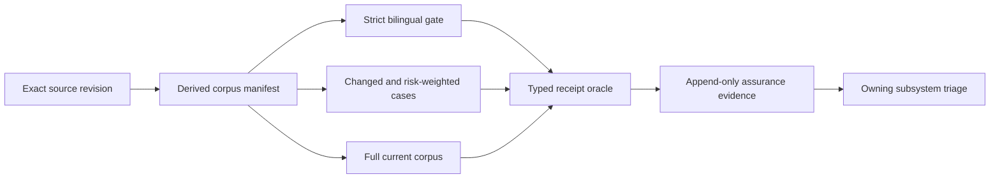

# Continuous Semantic Assurance

This document owns ongoing validation of FDAI's complete semantic question corpus. It derives the
measured denominator from the exact source revision instead of using a fixed question count, and it
keeps release, scheduled, and change-focused evidence separate from roadmap package completion.

> **Authority boundary:** A passing campaign proves typed interpretation, evidence handling, and
> no-authority behavior for one exact source revision. It never grants approval, mutation,
> promotion, or execution authority.
>
> **Ownership boundary:** [Continuous Question Space](continuous-question-space.md) owns question
> derivation and corpus identity. This document owns when and how those questions are executed and
> certified. [Ontology Query Randomized Assurance](ontology-query-randomized-assurance.md) retains
> historical scored and governed baselines.

## Design at a glance

The corpus size is an observed property of a source revision. Adding a logical expectation,
language, wording style, evidence posture, capability, or metamorphic case changes the denominator
automatically. A document or roadmap item does not need to be edited merely because the count grew.

## Assurance inputs

| Input | Current measured shape | Contract |
|-------|------------------------|----------|
| Repository golden corpus | 35 logical expectations, 8 wording styles, 2 locales, 560 locale cases | The manifest-derived total is authoritative. The current number is evidence, not a permanent gate. |
| Strict bilingual gate | 22 fixed high-signal cells | Every required operation and locale cell must retain exact transport and its typed terminal result. |
| Seeded assurance | 100 balanced live cases | The seed, source revision, generator configuration, and exact result histogram are retained together. |
| Generated question universe | Variable by exact ontology release, manifest, perspective, and evidence posture | Every readable declaration receives a typed case or exclusion. Sampling cannot replace structural coverage. |
| Focused regression overlays | Variable, including semantic-judgment and incident or target-bound edge cases | A reproduced defect adds a durable typed regression before the owning fix is accepted. |

Current corpus counts are recomputed from structured source artifacts. They are never copied into a
roadmap exit criterion or treated as a stable product constant.

## Execution profiles

### Change-focused validation

Run the strict bilingual gate and every affected case family when a change modifies semantic
planning, prompts, ontology declarations, principal manifests, capability bindings, typed oracles,
question generation, or evidence projection. Selection records the changed source paths and the
deterministic reason each case entered the cohort.

### Release certification

Run the full corpus derived from the exact source revision before a semantic release is certified.
The run starts only after bounded readiness succeeds. Partial, resumed, or suffix runs are useful
diagnostics but cannot be combined into a full-corpus certification.

### Scheduled assurance

Use a bounded delta-first profile for routine shadow validation. It prioritizes new cases, changed
capabilities, prior failures, stale evidence postures, and underrepresented operation-locale pairs.
A periodic full run re-establishes the complete denominator. Schedule, cost, and workload identity
remain explicit inputs and stop before model work when unavailable.

### Incident-driven replay

A production or governed test finding triggers the smallest reproducing typed cohort first. After
the focused regression passes, the next scheduled or release profile verifies the wider corpus.
One failure never authorizes phrase routing, answer templates, or weakened evidence requirements.

## Typed acceptance contract

Every executed case records:

- exact source, corpus, ontology release, principal manifest, and configuration digests;
- locale, case family, required operation, subject types, temporal scope, and terminal posture;
- exact request and projection transport identities without raw prompts or provider payloads;
- required capability, ontology path, fact, limitation, and evidence posture observations;
- typed clarification, hold, unsupported, action-draft, or answered disposition;
- provider pressure, timeout, retry, process-loss, and resume state;
- `execution_authority=false` at the semantic receipt and assurance observation boundaries.

Answered cases require complete relevant evidence. Non-answer dispositions pass only when the
oracle permits that typed terminal result. Prose similarity and fixed answer strings are never
acceptance inputs.

## Failure ownership

A failed case is routed to the document and implementation owner that controls the reproduced
behavior. For example, an action-draft classification failure belongs to hierarchical conversation
planning, while a stale topology answer belongs to the operational graph and evidence providers.

Campaign health is continuous product evidence. It is not a hidden prerequisite for unrelated
roadmap packages. A roadmap item may cite a focused subset that proves its own exit criteria, but it
does not wait for every current and future corpus case unless its owner explicitly defines that
dependency.

## Evidence retention

Raw local artifacts remain owner-only and bounded. Repository-safe projections retain digests,
typed outcomes, counts, pressure and safety counters, and exact source binding. They exclude
credentials, endpoints, environment identifiers, raw provider payloads, screenshots, and complete
model responses.

The evidence ledger is append-only. A later passing run does not erase an interrupted or failed
attempt, and a baseline for one source revision never certifies another revision.

## Related docs

| To learn about | Read |
|----------------|------|
| Question derivation and corpus identity | [Continuous Question Space](continuous-question-space.md) |
| Historical randomized baselines | [Ontology Query Randomized Assurance](ontology-query-randomized-assurance.md) |
| Whole-turn semantic planning | [Hierarchical Conversation Planning](hierarchical-conversation-planning.md) |
| Operational graph competency | [Continuous Operational Instance Graph](../architecture/continuous-operational-instance-graph.md) |
| Delivery state and remaining work | [Continuous Semantic Assurance implementation ledger](../../roadmap-implementation/interfaces/continuous-semantic-assurance.md) |
