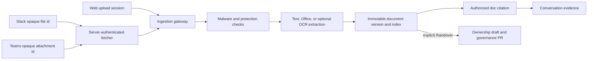

# 대화 첨부파일

이 문서는 Slack, Teams 및 web chat에서 document와 image를 FDAI conversation에 첨부하면서
document safety, authorization, grounding 및 ownership-handover governance를 우회하지 않는
방법을 정의합니다.

> Conversation channel은 payload가 제공한 download URL을 신뢰하지 않으며 file byte를 model
> prompt에 넣지 않습니다. 모든 source는 먼저 governed document-ingestion pipeline에 들어갑니다.
> Conversation에는 immutable `doc:<document_id>:<version_id>` citation만 전달됩니다.

## 설계 개요

모든 channel type은 동일한 document lifecycle로 수렴합니다.



File source는 channel마다 다릅니다. Safety, storage, purpose, citation, retention 및 audit는
동일합니다.

## 구현 상태

| Capability | 상태 | 구현 |
|------------|------|------|
| Slack attachment metadata | Adapter 구현됨, deployment binding 대기 | Signed Events API adapter는 opaque file id, filename, size 및 media type만 유지합니다. |
| Slack private download | Adapter 구현됨, deployment binding 대기 | `SlackPrivateFileFetcher`는 server-authenticated `files.info`로 id를 resolve하고 HTTPS host allowlist를 validate한 뒤 byte cap 안에서 stream합니다. |
| Teams attachment metadata | Adapter 구현됨, deployment binding 대기 | Authenticated Bot Framework adapter는 opaque attachment id 및 bounded metadata만 유지합니다. |
| Teams private download | Adapter 구현됨, deployment binding 대기 | `TeamsServerAttachmentFetcher`는 server-owned endpoint resolver와 audience-scoped workload identity token을 사용합니다. |
| Protected channel ingestion | Composition 구현됨, deployment binding 대기 | `ProtectedChannelAttachmentIngestor`는 모든 byte를 기존 scan, protection, extraction, indexing 및 access lifecycle로 전달합니다. |
| Explicit ownership handover | Contract 구현됨, Slack/Teams deployment binding 대기 | Leading `/handover`, `/attach handover` 또는 `인수인계 문서:` directive가 `handover_bootstrap`을 선택합니다. Content와 filename은 purpose를 선택하지 않습니다. |
| Web chat document references | Backend contract 구현됨 | JSON 및 SSE chat은 immutable document/version id를 최대 8개 받습니다. Production resolver는 현재 principal이 upload한 ready version만 허용합니다. SPA file picker는 product UI 후속 작업입니다. |
| Web chat inline vision evidence | 구현됨 | Web chat `attachments` field는 bounded inline base64 image를 받습니다(raster allowlist png/jpeg/gif/webp, `data:` URL만, 선언된 media type이 magic byte와 일치해야 함, per-image size cap 및 per-turn count cap). 검증된 image는 read-only evidence로서 해당 turn을 vision 지원 narrator로 escalate하며, 실행 자격을 부여하지 않습니다. Payload file byte를 신뢰하지 않는 channel document-ingestion 경로와는 구분됩니다. |
| Image OCR | 구현됨, opt-in | `ImageOcrProvider`를 standard extractor에 inject합니다. Azure production은 managed identity로 Document Intelligence `prebuilt-read`를 bind할 수 있습니다. |

## Purpose 및 authorization

### 기본 evidence

Directive가 없는 attachment는 `knowledge_base`를 사용합니다. Attachment-only message도 valid하며
citation과 함께 deterministic protected-ingestion acknowledgement를 반환합니다. 일반 prose에서
handover를 언급해도 purpose는 바뀌지 않습니다.

### Ownership handover

Ownership handover에는 정확한 leading directive가 필요합니다.

```text
/handover
/handover transfer Thor and Heimdall ownership
/attach handover
인수인계 문서: Thor 담당자 변경
```

Handover role floor는 Contributor입니다. Role check는 vendor download 전에 실행되므로 Reader가
fetch, scan, OCR, embedding 또는 GitOps capacity를 사용할 수 없습니다. Successful handover는
narrator를 호출하지 않습니다. 기존 handover consumer가 grounded draft와, enabled인 경우 governance
pull request를 만든 뒤 deterministic review acknowledgement를 반환합니다.

Uploader는 upload했다는 이유로 owner가 되지 않습니다. Candidate는 additive이므로 existing
ownership이 유지됩니다. Deployment가 새 값을 load하기 전에 사람이 Git change를 review하고
merge해야 합니다.

## Slack download contract

Slack event payload URL은 untrusted이므로 폐기합니다. Fetcher는 다음을 수행합니다.

1. Normalized opaque file id만 받습니다.
2. Injected secret provider에서 bot token을 읽습니다.
3. Credential, query, fragment 또는 redirect 없이 server-configured HTTPS Slack API
  `files.info` endpoint를 호출하고 HTTP 200을 요구하며 configured byte cap을 넘는 즉시 metadata
  읽기를 중단합니다. API origin은 fixed metadata-host allowlist와 일치하고 default HTTPS port를
  사용해야 합니다.
4. 반환된 Slack file id가 요청한 opaque id와 exact match하도록 요구합니다.
5. Configured allowlist와 host가 정확히 일치하고 default HTTPS port를 사용하는 private download
  URL만 허용합니다.
6. Validated host에만 bot token을 전송합니다.
7. Redirect를 비활성화하고 invalid 또는 negative `Content-Length`를 거부하며 decoded content에
  streamed-byte limit을 적용합니다.
8. Protected ingestion에 byte를 반환하며 ingestion은 SHA-256을 다시 계산하고 metadata size를
   확인합니다.

Slack app에는 선택한 Slack API가 요구하는 narrow file-read permission만 부여하는 것이 좋습니다.
Token value는 Key Vault 또는 다른 `SecretProvider`에 유지하며 config, audit, error에 기록하지
않습니다.

## Teams download contract

Teams payload의 `contentUrl` 및 `serviceUrl`은 폐기합니다. Deployment는 opaque id를 server-owned
Bot 또는 Graph state를 통해 URL 및 token audience가 포함된 `AttachmentDownloadLocation`으로
매핑하는 `TeamsAttachmentEndpointResolver`를 제공합니다.

Fetcher는 다음을 수행합니다.

- HTTPS 및 exact configured host를 요구합니다.
- Token을 요청하기 전에 server-resolved token audience가
  `FDAI_TEAMS_ATTACHMENT_AUDIENCES`와 exact match하도록 요구합니다.
- URL credential과 redirect를 거부합니다.
- Injected workload identity에서 audience-scoped token을 요청합니다.
- Slack과 동일한 byte cap 안에서 stream합니다.
- Executor identity를 전송하지 않으며 caller-selected audience를 받지 않습니다.

이 resolver seam은 untrusted payload가 network destination을 선택하지 못하게 하면서 Bot
Framework, Microsoft Graph 및 sovereign-cloud deployment를 지원합니다.

## Web chat contract

Read API는 multipart file, raw byte, storage URL 또는 channel attachment id를 받지 않습니다.
향후 SPA flow는 다음과 같습니다.

1. Authenticated ingestion upload session을 만듭니다.
2. Ingestion gateway를 통해 file을 upload하고 complete합니다.
3. Version이 `ready` 또는 `ready_with_warnings`가 될 때까지 poll합니다.
4. Chat turn에 `document_refs`를 보냅니다.

```json
{
  "prompt": "Summarize the attached evidence",
  "document_refs": [
    {
      "document_id": "<document-uuid>",
      "version_id": "<version-uuid>"
    }
  ]
}
```

JSON 및 SSE route는 unique reference를 최대 8개 허용합니다. Production은 PostgreSQL metadata를
다시 읽고 현재 authenticated principal이 upload한 version만 허용합니다. 이 baseline은 chat
authorize seam이 stable principal id는 제공하지만 complete collection group claim은 제공하지
않으므로 collection sharing보다 의도적으로 좁습니다. 향후 resolver는 document access policy를
재사용한다는 조건으로 wire contract 변경 없이 collection reader를 추가할 수 있습니다.

Resolver는 요청된 각 citation을 동일한 순서와 exact canonical form인
`doc:<document_id>:<version_id>`로 반환해야 합니다. Substituted, reordered, duplicate 또는 malformed
provider result는 view context나 verification에 들어가기 전에 fail closed됩니다.

Resolved ref는 server-owned view context와 terminal verification에 들어갑니다. Invalid UUID
syntax는 400, resolver가 없는 deployment는 501을 반환합니다. Missing, unavailable, held, failed,
deleted 또는 다른 principal의 version은 document 존재 여부를 노출하지 않도록 동일한 access
denial을 반환합니다.

## Image OCR

Standard extractor는 OCR 전에 image signature를 인식합니다. OCR provider가 없으면 기존
metadata-only image version을 유지합니다. `FDAI_OCR_ENDPOINT`를 설정하면 production이
`AzureDocumentIntelligenceOcr`을 bind합니다.

1. Configured Cognitive Services audience용 managed-identity token을 얻습니다.
2. HTTPS로 image를 `prebuilt-read`에 제출합니다.
3. Implicit HTTPS port와 explicit `:443`을 동등하게 취급하면서 `Operation-Location`이 exact
  configured origin인지 validate합니다.
4. Configured attempt 및 time limit 안에서 poll합니다.
5. 각 poll response를 streaming하는 동안 `FDAI_OCR_MAX_RESPONSE_BYTES`를 적용하고 later chunk를
  읽기 전에 중단한 다음 parsed result에 line 및 character limit을 적용합니다.
6. Bounded page line을 `page:1:line:2` 같은 locator를 가진 `StructuralUnit`으로 변환합니다.
7. Redirect를 거부하고 identity, transport, malformed, failed, unknown, cross-origin 또는
  over-budget failure를 OCR provider error로 정규화합니다.

Configured OCR failure는 extraction stage를 실패시키며 searchable 또는 handover evidence를 만들지
않습니다. OCR text는 untrusted evidence로 유지되며 instruction 또는 tool authority를 재정의할 수
없습니다.

Terraform은 `document_ocr_endpoint`와 matching `document_ocr_resource_id`, enabled document
ingestion을 함께 요구합니다. Ingestion managed identity에 해당 resource scope의 `Cognitive
Services User`만 부여합니다. Empty endpoint는 metadata-only behavior를 유지하고 OCR role을 만들지
않습니다.

## Production composition

`ProductionAttachmentConfig`는 channel evidence collection, access descriptor, reader group,
retention policy, vendor host allowlist 및 timeout을 소유합니다.
`FDAI_CHANNEL_ATTACHMENTS_ENABLED=1`일 때만 활성화됩니다. Invalid boolean, partial configuration
또는 production attachment ingestor가 주입되지 않은 enabled runtime은 startup을 실패시킵니다.

Fetch timeout은 300초 이하의 positive finite number여야 합니다. Terminal processing wait는 600초
이하여야 하며 polling interval은 0.1초 이상 10초 이하여야 합니다. `NaN`, infinity 및 범위 밖의
값은 startup을 실패시킵니다. `FDAI_CHANNEL_ATTACHMENT_PROCESSING_MAX_POLLS`는 1 이상 1000 이하의
독립적인 ceiling을 추가하며 기본값은 480입니다. Vendor attachment name은 path separator,
dot-only name 또는 control/formatting character가 없는 leaf name이어야 합니다.

`build_production_attachment_ingestor()`는 enabled channel의 fetcher만 만듭니다. Teams에는 identity,
resolver, host allowlist 및 token audience allowlist가 필요합니다. `ProductionChannelRuntime`은 Slack
또는 Teams consumer를 시작하기 전에 생성된 ingestor를 attachment-aware
`ConversationChannelGateway`에 bind합니다. Attachment가 설정됐지만 gateway가 이를 bind할 수
없으면 startup이 실패합니다.

Repository는 현재 이 composition component를 library boundary로 제공합니다. 아직
`ProductionChannelRuntime`을 instantiate하는 standalone channel ASGI factory 또는 Terraform
channel workload는 제공하지 않으며 read API와 headless core는 channel ingress route를 mount하지
않습니다. 별도 process가 gateway, persistence, Teams resolver, identity, attachment ingestor 및
lifecycle callback을 모두 제공할 때까지 deployment는 대기 상태입니다. Complete composition이
없는 deployed workload에서는 attachment 또는 Slack/Teams channel enable flag를 설정하지 않습니다.

Channel bridge는 각 upload를 seal하고 `document.received`를 publish하며
`DocumentIngestionWorker.process()`를 직접 호출하지 않습니다.
`MetadataDocumentTerminalResolver`는 agent-owned event pipeline이 만든 terminal version만
기다립니다. Positive finite bound는 `FDAI_CHANNEL_ATTACHMENT_PROCESSING_TIMEOUT_SECONDS`, bounded
observation interval은 `FDAI_CHANNEL_ATTACHMENT_PROCESSING_POLL_SECONDS`로 설정합니다. Timeout은
citation 없이 반환하며 inline worker fallback을 실행하지 않습니다.

Attachment가 여러 개인 message는 file마다 governed `UploadSession` 하나를 만듭니다. File은
독립적인 lifecycle, retention, audit record를 유지하며 channel message는 storage transaction이
아닙니다. File 하나가 held 또는 failed 상태가 되면 turn은 citation을 반환하지 않습니다. Pipeline이
이미 수락한 sibling은 조용히 삭제되지 않고 document-ingestion operations에서 계속 확인할 수
있습니다. 모든 file을 seal한 뒤 terminal metadata wait는 8-file message cap 안에서 concurrent하게
실행되고 반환 citation에서 input order를 유지합니다. Typed waiter failure가 발생하면 turn 반환 전에
sibling waiter를 cancel하고 await하므로 background poll이 남지 않습니다.

## Failure behavior

| Failure | 동작 |
|---------|------|
| Missing vendor fetcher | Ingestion 전에 attachment 거부 |
| Reader가 `/handover` 제출 | Vendor download 전에 거부 |
| Attachment metadata 하나라도 byte cap 초과 | 첫 fetch 전에 전체 turn 거부 |
| Vendor metadata size mismatch | 거부하고 citation 미생성 |
| Redirect 또는 host mismatch | Token disclosure 또는 download 전에 거부 |
| Byte cap 초과 | Stream 중단 및 거부 |
| Malware 또는 protected-content hold | Citation 없이 반환하고 narrator 미호출 |
| Agent pipeline이 terminal wait bound 초과 | Turn 거부, inline worker 미실행 |
| Attachment completion 전 unexpected failure | Message claim release, sanitized processing transition emit, 다음 queued turn 계속 처리 |
| Attachment completion 후 session/tool failure | Message claim 유지, generic error 한 번 반환, 동일 vendor message 재인제스트 방지 |
| OCR configured 상태에서 unavailable 또는 malformed | Extraction 실패, searchable evidence 미생성 |
| Web reference malformed | 400 반환 |
| Web resolver absent | 501 반환 |
| Web version이 다른 principal 소유 또는 unavailable | Access 거부 |
| Duplicate channel message | 기존 channel ledger가 repeated processing 방지 |

Channel gateway는 unavailable, rejected 및 ready outcome에 대해 `attachment.ingestion`
transition을 emit합니다. Filename, source reference, document content 또는 provider error는 포함하지
않습니다. Unexpected turn failure는 해당 turn으로 격리되며 Slack 또는 Teams receive loop를
종료하지 않습니다.

## Verification

Focused verification은 다음과 같습니다.

```bash
uv run pytest -q --no-cov \
  tests/core/conversation/test_attachment_directive.py \
  tests/conversation/test_channel_gateway.py \
  tests/delivery/channels \
  tests/delivery/azure/test_document_ocr.py \
  tests/delivery/ingestion_gateway/test_chat_evidence.py \
  tests/delivery/read_api/test_chat_route.py
terraform -chdir=infra validate
```

Security regression은 payload URL discard, exact host allowlist, redirect refusal, streamed byte
cap, pre-fetch role check, explicit-purpose parsing, attachment-only message, OCR
operation-location validation, OCR output bound, uploader-only web ref 및 missing-resolver
fail-closed behavior를 포함합니다.

## 관련 문서

| 알아볼 내용 | 문서 |
|-------------|------|
| Document safety 및 storage | [document-ingestion-ko.md](document-ingestion-ko.md) |
| Conversational channel authority | [operator-console-ko.md](operator-console-ko.md) |
| Ownership draft 및 merge lifecycle | [agent-stewardship-operations-ko.md](agent-stewardship-operations-ko.md) |
| Durable channel delivery | [durable-conversation-delivery-ko.md](durable-conversation-delivery-ko.md) |
