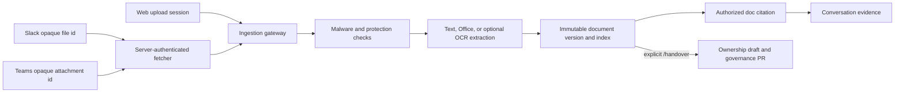

# 대화 첨부파일

이 문서는 Slack, Teams 및 web 채팅에서 문서와 이미지를 FDAI 대화에 첨부하면서
문서 안전성, 권한 확인, grounding 및 ownership-handover 거버넌스를 우회하지 않는
방법을 정의합니다.

> 대화 채널은 페이로드가 제공한 download URL을 신뢰하지 않으며 파일 바이트를 모델
> 프롬프트에 넣지 않습니다. 모든 출처는 먼저 통제된 document-ingestion 파이프라인에 들어갑니다.
> 대화에는 변경할 수 없는 `doc:<document_id>:<version_id>` 인용만 전달됩니다.

## 설계 개요

모든 채널 타입은 동일한 문서 수명 주기로 수렴합니다.


```mermaid
flowchart LR
    S[Slack opaque file id] --> F[Server-authenticated fetcher]
    T[Teams opaque attachment id] --> F
    W[Web upload session] --> I[Ingestion gateway]
    F --> I
    I --> M[Malware and protection checks]
    M --> X[Text, Office, or optional OCR extraction]
    X --> D[Immutable document version and index]
    D --> C[Authorized doc citation]
    C --> Q[Conversation evidence]
    D -->|explicit /handover| H[Ownership draft and governance PR]
```

파일 출처는 채널마다 다릅니다. 안전성, 저장소, 용도, 인용, 보존 및 감사는
동일합니다.

## 구현 상태

| 기능 | 상태 | 구현 |
|------------|------|------|
| Slack 첨부 메타데이터 | 어댑터 구현됨, 배포 연결 대기 | Signed 이벤트 API 어댑터는 opaque 파일 id, 파일 이름, 크기 및 매체 타입만 유지합니다. |
| Slack 비공개 download | 어댑터 구현됨, 배포 연결 대기 | `SlackPrivateFileFetcher`는 server-authenticated `files.info`로 id를 해석하고 HTTPS 호스트 허용 목록을 validate한 뒤 바이트 상한 안에서 스트림합니다. |
| Teams 첨부 메타데이터 | 어댑터 구현됨, 배포 연결 대기 | 인증된 Bot Framework 어댑터는 opaque 첨부 id 및 범위가 제한된 메타데이터만 유지합니다. |
| Teams 비공개 download | 어댑터 구현됨, 배포 연결 대기 | `TeamsServerAttachmentFetcher`는 서버가 소유한 엔드포인트 해석기와 audience-scoped 워크로드 신원 토큰을 사용합니다. |
| Protected 채널 인제스트 | 조립 구현됨, 배포 연결 대기 | `ProtectedChannelAttachmentIngestor`는 모든 바이트를 기존 검사, protection, 추출, 인덱싱 및 접근 수명 주기로 전달합니다. |
| 명시적 소유권 인계 | 계약 구현됨, Slack/Teams 배포 연결 대기 | Leading `/handover`, `/attach handover` 또는 `인수인계 문서:` directive가 `handover_bootstrap`을 선택합니다. 내용과 파일 이름은 용도를 선택하지 않습니다. |
| Web 채팅 문서 references | 백엔드 계약 구현됨 | JSON 및 SSE 채팅은 변경할 수 없는 문서/버전 id를 최대 8개 받습니다. 운영 해석기는 현재 principal이 업로드한 준비된 버전만 허용합니다. SPA 파일 picker는 product UI 후속 작업입니다. |
| Web 채팅 inline vision 근거 | 구현됨 | Web 채팅 `attachments` 필드는 범위가 제한된 inline base64 이미지를 받습니다(raster 허용 목록 png/jpeg/gif/webp, `data:` URL만, 선언된 매체 타입이 magic 바이트와 일치해야 함, decode 전 브라우저 출처 32 MiB 상한, 서버 간선 2048 pixel 상한, per-image 출력 상한 및 턴별 개수 상한). 검증된 이미지는 읽기 전용 근거로서 해당 턴을 vision 지원 서술기로 escalate하며, 실행 자격을 부여하지 않습니다. 최종 검증은 해당 해석을 screen-verified로 취급하지 않고 현재 `conversation-image` 참조가 있는 검증되지 않은 답변으로 보존합니다. Operator API는 검증된 바이트를 principal 범위 `conversation_image` 저장소에 저장하고 내용이 없는 서술자만 턴 이력에 남겨 Console에서 복원할 수 있게 합니다. |
| 이미지 OCR | 구현됨, 명시적 선택 | `ImageOcrProvider`를 standard 추출기에 inject합니다. Azure 운영은 managed 신원으로 문서 Intelligence `prebuilt-read`를 연결할 수 있습니다. |

## 용도 및 권한 확인

### 기본 근거

Directive가 없는 첨부는 `knowledge_base`를 사용합니다. Attachment-only 메시지도 valid하며
인용과 함께 결정론적 protected-ingestion 확인 응답을 반환합니다. 일반 산문에서
인계를 언급해도 용도는 바뀌지 않습니다.

### 소유권 인계

소유권 인계에는 정확한 leading directive가 필요합니다.

```text
/handover
/handover transfer Thor and Heimdall ownership
/attach handover
인수인계 문서: Thor 담당자 변경
```

인계 역할 하한은 기여자입니다. 역할 검사는 벤더 download 전에 실행되므로 읽기 담당이
fetch, 검사, OCR, 임베딩 또는 GitOps 용량을 사용할 수 없습니다. Successful 인계는
서술기를 호출하지 않습니다. 기존 인계 소비자가 근거에 기반한 초안과, 활성화된인 경우 거버넌스
pull 요청을 만든 뒤 결정론적 검토 확인 응답을 반환합니다.

업로더는 업로드했다는 이유로 소유자가 되지 않습니다. 후보는 가산이므로 기존
소유권이 유지됩니다. 배포가 새 값을 부하하기 전에 사람이 Git 변경을 검토하고
병합해야 합니다.

## Slack download 계약

Slack 이벤트 페이로드 URL은 신뢰할 수 없는이므로 폐기합니다. 가져오기 도구는 다음을 수행합니다.

1. 정규화된 opaque 파일 id만 받습니다.
2. Injected 시크릿 프로바이더에서 bot 토큰을 읽습니다.
3. 자격 증명, 조회, 조각 또는 redirect 없이 server-configured HTTPS Slack API
  `files.info` 엔드포인트를 호출하고 HTTP 200을 요구하며 구성된 바이트 상한을 넘는 즉시 메타데이터
  읽기를 중단합니다. API 출처는 fixed metadata-host 허용 목록과 일치하고 기본값 HTTPS 포트를
  사용해야 합니다.
4. 반환된 Slack 파일 id가 요청한 opaque id와 exact 일치하도록 요구합니다.
5. 구성된 허용 목록과 호스트가 정확히 일치하고 기본값 HTTPS 포트를 사용하는 비공개 download
  URL만 허용합니다.
6. 검증된 호스트에만 bot 토큰을 전송합니다.
7. Redirect를 비활성화하고 잘못된 또는 부정 `Content-Length`를 거부하며 decoded 내용에
  streamed-byte 한도를 적용합니다.
8. Protected 인제스트에 바이트를 반환하며 인제스트는 SHA-256을 다시 계산하고 메타데이터 크기를
   확인합니다.

Slack 앱에는 선택한 Slack API가 요구하는 narrow file-read 권한만 부여하는 것이 좋습니다.
토큰 값은 Key Vault 또는 다른 `SecretProvider`에 유지하며 구성, 감사, 오류에 기록하지
않습니다.

## Teams download 계약

Teams 페이로드의 `contentUrl` 및 `serviceUrl`은 폐기합니다. 배포는 opaque id를 서버가 소유한
Bot 또는 Graph 상태를 통해 URL 및 토큰 대상이 포함된 `AttachmentDownloadLocation`으로
매핑하는 `TeamsAttachmentEndpointResolver`를 제공합니다.

가져오기 도구는 다음을 수행합니다.

- HTTPS 및 exact 구성된 호스트를 요구합니다.
- 토큰을 요청하기 전에 server-resolved 토큰 대상이
  `FDAI_TEAMS_ATTACHMENT_AUDIENCES`와 exact 일치하도록 요구합니다.
- URL 자격 증명과 redirect를 거부합니다.
- Injected 워크로드 신원에서 audience-scoped 토큰을 요청합니다.
- Slack과 동일한 바이트 상한 안에서 스트림합니다.
- 실행기 신원을 전송하지 않으며 caller-selected 대상을 받지 않습니다.

이 해석기 경계는 신뢰할 수 없는 페이로드가 네트워크 대상을 선택하지 못하게 하면서 Bot
Framework, Microsoft Graph 및 sovereign-cloud 배포를 지원합니다.

## Web 채팅 계약

Operator API는 multipart 파일, raw 바이트, 저장소 URL 또는 채널 첨부 id를 받지 않습니다.
향후 SPA 흐름은 다음과 같습니다.

1. 인증된 인제스트 업로드 세션을 만듭니다.
2. 인제스트 게이트웨이를 통해 파일을 업로드하고 완전한합니다.
3. 버전이 `ready` 또는 `ready_with_warnings`가 될 때까지 poll합니다.
4. Chat 턴에 `document_refs`를 보냅니다.

```json
{
  "prompt": "Summarize the attached evidence",
  "document_refs": [
    {
      "document_id": "<document-uuid>",
      "version_id": "<version-uuid>"
    }
  ]
}
```

JSON 및 SSE 경로는 unique 참조를 최대 8개 허용합니다. 운영은 PostgreSQL 메타데이터를
다시 읽고 현재 인증된 principal이 업로드한 버전만 허용합니다. 이 기준선은 채팅
authorize 경계가 고정된 principal id는 제공하지만 완전한 수집 그룹 점유는 제공하지
않으므로 수집 sharing보다 의도적으로 좁습니다. 향후 해석기는 문서 접근 정책을
재사용한다는 조건으로 wire 계약 변경 없이 수집 읽기 담당을 추가할 수 있습니다.

해석기는 요청된 각 인용을 동일한 순서와 exact 정본 양식인
`doc:<document_id>:<version_id>`로 반환해야 합니다. Substituted, reordered, 중복 또는 malformed
프로바이더 결과는 화면 맥락나 검증에 들어가기 전에 실패 시 차단됩니다.

Resolved 참조는 서버가 소유한 화면 맥락과 최종 검증에 들어갑니다. 잘못된 UUID
구문은 400, 해석기가 없는 배포는 501을 반환합니다. 누락된, 사용 불가, held, 실패한,
deleted 또는 다른 principal의 버전은 문서 존재 여부를 노출하지 않도록 동일한 접근
denial을 반환합니다.

Inline vision 이미지는 문서 인제스트와 분리된 범위가 제한된 저장소를 사용합니다. 저장된 이미지는
인증된 principal, 대화 및 opaque 이미지 id로 키를 구성합니다. Operator 턴에는 id,
display 이름 및 검증된 매체 타입만 저장하고 base64 본문은 저장하지 않습니다. Console은 인증된
`GET /me/conversations/{conversation_id}/images/{image_id}`를 통해 이력 이미지를 읽고 표시용 브라우저
객체 URL을 만듭니다. 다른 principal, 대화 또는 알 수 없는 id는 모두 같은 `404` 응답을
반환합니다. Owning 대화를 삭제하면 해당 이미지 행도 cascade로 삭제됩니다.
대화가 활성 상태를 유지해도 각 이미지는 90일 후 만료되며, scheduled user-context
보존 작업이 만료된 이미지 바이트를 독립적으로 삭제합니다. principal은 대화 이미지를 최대
1,000개 또는 256 MiB 중 먼저 도달하는 한도까지만 보관할 수 있습니다. Exact 재시도는 할당량을 중복
소비하지 않으며, 할당량 거절은 턴 메타데이터 저장 전에 `429`를 반환합니다. 이미지는 운영자
턴이 영속해질 때까지 15분 pending 만료를 유지한 뒤 90일 만료로 전환됩니다. Immediate
보상도 실패하면 다음 업로드 또는 보존 통과가 이 짧은 간격 이후 pending 바이트를
삭제합니다.

작성기는 staged 이미지를 파일 이름, 바이트 크기 또는 준비된 라벨을 반복하지 않는 fixed thumbnail로
표시합니다. 포인터 hover, keyboard focus 또는 touch는 shared 툴팁 계층을 통해 뷰포트 범위의 큰
미리 보기를 엽니다. 정규화가 진행 중이면 tile은 shared neutral top-edge shimmer를 사용하며,
reduced-motion 선호 설정은 이 animation을 비활성화합니다. Non-image 파일과 rejected 첨부는
간결한 메타데이터 및 actionable 사유를 유지합니다.

## 이미지 OCR

Standard 추출기는 OCR 전에 이미지 서명을 인식합니다. OCR 프로바이더가 없으면 기존
metadata-only 이미지 버전을 유지합니다. `FDAI_OCR_ENDPOINT`를 설정하면 운영이
`AzureDocumentIntelligenceOcr`을 연결합니다.

1. 구성된 Cognitive Services 대상용 managed-identity 토큰을 얻습니다.
2. HTTPS로 이미지를 `prebuilt-read`에 제출합니다.
3. 암묵적 HTTPS 포트와 명시적 `:443`을 동등하게 취급하면서 `Operation-Location`이 exact
  구성된 출처인지 validate합니다.
4. 구성된 시도 및 시간 한도 안에서 poll합니다.
5. 각 poll 응답을 스트리밍하는 동안 `FDAI_OCR_MAX_RESPONSE_BYTES`를 적용하고 later 조각을
  읽기 전에 중단한 다음 parsed 결과에 줄 및 character 한도를 적용합니다.
6. 범위가 제한된 페이지 줄을 `page:1:line:2` 같은 위치 지정자를 가진 `StructuralUnit`으로 변환합니다.
7. Redirect를 거부하고 신원, 전송 계층, malformed, 실패한, 알 수 없음, cross-origin 또는
  over-budget 실패를 OCR 프로바이더 오류로 정규화합니다.

구성된 OCR 실패는 추출 단계를 실패시키며 searchable 또는 인계 근거를 만들지
않습니다. OCR 텍스트는 신뢰할 수 없는 근거로 유지되며 instruction 또는 도구 권한을 재정의할 수
없습니다.

Terraform은 `document_ocr_endpoint`와 matching `document_ocr_resource_id`, 활성화된 문서
인제스트를 함께 요구합니다. 인제스트 managed 신원에 해당 리소스 범위의 `Cognitive
Services User`만 부여합니다. 빈 엔드포인트는 metadata-only 행동을 유지하고 OCR 역할을 만들지
않습니다.

## 운영 조립

`ProductionAttachmentConfig`는 채널 근거 수집, 접근 서술자, 읽기 담당 그룹,
보존 정책, 벤더 호스트 허용 목록 및 시간 초과를 소유합니다.
`FDAI_CHANNEL_ATTACHMENTS_ENABLED=1`일 때만 활성화됩니다. 잘못된 boolean, 부분 구성
또는 운영 첨부 인제스트기가 주입되지 않은 활성화된 런타임은 시작을 실패시킵니다.

Fetch 시간 초과는 300초 이하의 긍정 finite number여야 합니다. 최종 처리 wait는 600초
이하여야 하며 polling 간격은 0.1초 이상 10초 이하여야 합니다. `NaN`, infinity 및 범위 밖의
값은 시작을 실패시킵니다. `FDAI_CHANNEL_ATTACHMENT_PROCESSING_MAX_POLLS`는 1 이상 1000 이하의
독립적인 상한을 추가하며 기본값은 480입니다. 벤더 첨부 이름은 경로 구분자,
dot-only 이름 또는 컨트롤/formatting character가 없는 leaf 이름이어야 합니다.

`build_production_attachment_ingestor()`는 활성화된 채널의 가져오기 도구만 만듭니다. Teams에는 신원,
해석기, 호스트 허용 목록 및 토큰 대상 허용 목록이 필요합니다. `ProductionChannelRuntime`은 Slack
또는 Teams 소비자를 시작하기 전에 생성된 인제스트기를 attachment-aware
`ConversationChannelGateway`에 연결합니다. 첨부가 설정됐지만 게이트웨이가 이를 연결할 수
없으면 시작이 실패합니다.

Protected 인제스트 완료 후 게이트웨이는 실제 민감정보가 제거된 조정기 활동을 타입이 지정된 채널 진행 상황
스냅샷으로 변환 결과할 수 있습니다. 이는 표현만 변경합니다. 첨부 바이트, 용도,
권한 확인, 검사, 최종 인용 검사 및 에이전트 소유권은 변경되지 않으며 진행 상황 텍스트는
instruction 또는 근거 권한이 되지 않습니다.
Running 개정 번호는 요약 텍스트만 표시합니다. 정본 민감정보가 제거된 활동 근거는 protected
인제스트 및 조정기 완료 후 최종 confirmed 개정 번호에 표시됩니다.
진행 상황 메트릭은 잘림 및 최종 전달을 집계할 수 있지만 파일 이름, 문서 id,
인용, 출처 참조, 수집, 채널 id 또는 extracted 내용을 포함하지 않습니다.
Teams card-budget 활동 omission은 메트릭에 생략된 활동 개수 또는 내용을 추가하지 않고
잘림으로 집계됩니다.
Teams canonical-answer clipping도 메트릭에 답변 텍스트 또는 length를 추가하지 않고 잘림으로
집계됩니다. Multibyte serialized 카드 바이트로 더 일찍 잘리는 경우도 포함됩니다. 두 표현
한도 모두 첨부 근거 권한 또는 영속 응답 데이터를 변경하지 않습니다. Slack
canonical-answer clipping 메트릭도 답변 텍스트 또는 length를 보관하지 않습니다.
채널 발행기는 전송 계층 및 확인 응답 처리를 pure 렌더링과 분리합니다. 이 구조적
분리는 protected 인제스트 또는 민감정보 제거 경계를 변경하지 않습니다.

저장소는 현재 이 조립 컴포넌트를 library 경계로 제공합니다. 아직
`ProductionChannelRuntime`을 instantiate하는 standalone 채널 ASGI factory 또는 Terraform
채널 워크로드는 제공하지 않으며 Operator API와 headless 코어는 채널 유입 경로를 mount하지
않습니다. 별도 프로세스가 게이트웨이, 영속성, Teams 해석기, 신원, 첨부 인제스트기 및
수명 주기 콜백을 모두 제공할 때까지 배포는 대기 상태입니다. 완전한 조립이
없는 deployed 워크로드에서는 첨부 또는 Slack/Teams 채널 활성화 플래그를 설정하지 않습니다.

채널 브리지는 각 업로드를 봉인하고 `document.received`를 publish하며
`DocumentIngestionWorker.process()`를 직접 호출하지 않습니다.
`MetadataDocumentTerminalResolver`는 agent-owned 이벤트 파이프라인이 만든 최종 버전만
기다립니다. 긍정 finite 한계는 `FDAI_CHANNEL_ATTACHMENT_PROCESSING_TIMEOUT_SECONDS`, 범위가 제한된
관측 간격은 `FDAI_CHANNEL_ATTACHMENT_PROCESSING_POLL_SECONDS`로 설정합니다. 시간 초과는
인용 없이 반환하며 inline 워커 대체 경로를 실행하지 않습니다.

첨부가 여러 개인 메시지는 파일마다 통제된 `UploadSession` 하나를 만듭니다. 파일은
독립적인 수명 주기, 보존, 감사 기록을 유지하며 채널 메시지는 저장소 트랜잭션이
아닙니다. 파일 하나가 held 또는 실패한 상태가 되면 턴은 인용을 반환하지 않습니다. 파이프라인이
이미 수락한 형제는 조용히 삭제되지 않고 document-ingestion operations에서 계속 확인할 수
있습니다. 모든 파일을 봉인한 뒤 최종 메타데이터 wait는 8-file 메시지 상한 안에서 동시하게
실행되고 반환 인용에서 입력 순서를 유지합니다. 타입이 지정된 waiter 실패가 발생하면 턴 반환 전에
형제 waiter를 취소하고 대기하므로 background poll이 남지 않습니다.

## 실패 행동

| 실패 | 동작 |
|---------|------|
| 누락된 벤더 가져오기 도구 | 인제스트 전에 첨부 거부 |
| 읽기 담당이 `/handover` 제출 | 벤더 download 전에 거부 |
| 첨부 메타데이터 하나라도 바이트 상한 초과 | 첫 fetch 전에 전체 턴 거부 |
| 벤더 메타데이터 크기 mismatch | 거부하고 인용 미생성 |
| Redirect 또는 호스트 mismatch | 토큰 공개 또는 download 전에 거부 |
| 바이트 상한 초과 | 스트림 중단 및 거부 |
| Malware 또는 protected-content 보류 | 인용 없이 반환하고 서술기 미호출 |
| 에이전트 파이프라인이 최종 wait 한계 초과 | Turn 거부, inline 워커 미실행 |
| 첨부 완료 전 unexpected 실패 | 메시지 점유 release, 정제된 처리 전이 발행, 다음 대기 중 턴 계속 처리 |
| 첨부 완료 후 세션/도구 실패 | 메시지 점유 유지, 범용 오류 한 번 반환, 동일 벤더 메시지 재인제스트 방지 |
| OCR 구성된 상태에서 사용 불가 또는 malformed | 추출 실패, searchable 근거 미생성 |
| Web 참조 malformed | 400 반환 |
| Web 해석기 absent | 501 반환 |
| Web 버전이 다른 principal 소유 또는 사용 불가 | 접근 거부 |
| 중복 채널 메시지 | 기존 채널 원장이 repeated 처리 방지 |

채널 게이트웨이는 사용 불가, rejected 및 준비된 결과에 대해 `attachment.ingestion`
전이를 발행합니다. 파일 이름, 출처 참조, 문서 내용 또는 프로바이더 오류는 포함하지
않습니다. Unexpected 턴 실패는 해당 턴으로 격리되며 Slack 또는 Teams 수신 루프를
종료하지 않습니다.

## 검증

Focused 검증은 다음과 같습니다.

```bash
uv run pytest -q --no-cov \
  services/core-control-plane/tests/core/conversation/test_attachment_directive.py \
  services/core-control-plane/tests/conversation/test_channel_gateway.py \
  services/core-control-plane/tests/delivery/channels \
  services/core-control-plane/tests/delivery/azure/test_document_ocr.py \
  services/core-control-plane/tests/delivery/ingestion_gateway/test_chat_evidence.py \
  services/operator-service/tests/
terraform -chdir=infra validate
```

Security 회귀는 페이로드 URL discard, exact 호스트 허용 목록, redirect 거절, streamed 바이트
상한, pre-fetch 역할 검사, explicit-purpose 파싱, attachment-only 메시지, OCR
operation-location 검증, OCR 출력 한계, uploader-only web 참조 및 missing-resolver
실패 시 차단 행동을 포함합니다.

## 관련 문서

| 알아볼 내용 | 문서 |
|-------------|------|
| 문서 안전성 및 저장소 | [document-ingestion-ko.md](document-ingestion-ko.md) |
| Conversational 채널 권한 | [operator-console-ko.md](operator-console-ko.md) |
| 소유권 초안 및 병합 수명 주기 | [agent-stewardship-operations-ko.md](agent-stewardship-operations-ko.md) |
| 영속 채널 전달 | [durable-conversation-delivery-ko.md](durable-conversation-delivery-ko.md) |
