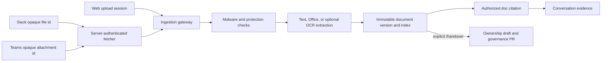

# Conversation Attachments

This document defines how Slack, Teams, and web chat attach documents and images to an FDAI
conversation without bypassing document safety, authorization, grounding, or ownership-handover
governance.

> Conversation channels never trust payload-supplied download URLs and never put file bytes in a
> model prompt. Every source enters the governed document-ingestion pipeline first. Only immutable
> `doc:<document_id>:<version_id>` citations reach a conversation.

## Design at a glance

All channel types converge on the same document lifecycle:



The file source changes by channel. Safety, storage, purpose, citations, retention, and audit do not.

## Implementation status

| Capability | Status | Implementation |
|------------|--------|----------------|
| Slack attachment metadata | Adapter implemented; deployment binding pending | The signed Events API adapter retains opaque file id, filename, size, and media type only. |
| Slack private download | Adapter implemented; deployment binding pending | `SlackPrivateFileFetcher` resolves the id through server-authenticated `files.info`, validates an HTTPS host allowlist, and streams within a byte cap. |
| Teams attachment metadata | Adapter implemented; deployment binding pending | The authenticated Bot Framework adapter retains an opaque attachment id and bounded metadata only. |
| Teams private download | Adapter implemented; deployment binding pending | `TeamsServerAttachmentFetcher` uses a server-owned endpoint resolver and audience-scoped workload identity token. |
| Protected channel ingestion | Composition implemented; deployment binding pending | `ProtectedChannelAttachmentIngestor` sends all bytes through the existing scan, protection, extraction, indexing, and access lifecycle. |
| Explicit ownership handover | Contract implemented; Slack/Teams deployment binding pending | A leading `/handover`, `/attach handover`, or `인수인계 문서:` directive selects `handover_bootstrap`; content and filenames never select it. |
| Web chat document references | Implemented backend contract | JSON and SSE chat accept up to eight immutable document/version ids. The production resolver permits only ready versions uploaded by the current principal. The SPA file picker remains product UI work. |
| Image OCR | Implemented, opt-in | `ImageOcrProvider` is injected into the standard extractor. Azure production can bind Document Intelligence `prebuilt-read` with managed identity. |

## Purpose and authorization

### Default evidence

An attachment without a directive uses `knowledge_base`. Attachment-only messages are valid and
return a deterministic protected-ingestion acknowledgement with citations. Ordinary prose that
mentions a handover does not change purpose.

### Ownership handover

Ownership handover requires an exact leading directive:

```text
/handover
/handover transfer Thor and Heimdall ownership
/attach handover
인수인계 문서: Thor 담당자 변경
```

The handover role floor is Contributor. The role check runs before vendor download, so a Reader
cannot spend fetch, scan, OCR, embedding, or GitOps capacity. A successful handover does not call the
narrator. It returns a deterministic review acknowledgement after the existing handover consumer has
created the grounded draft and, when enabled, the governance pull request.

The uploader does not become the owner by uploading. Existing ownership remains intact because the
candidate is additive. A person reviews and merges the Git change before the deployment loads it.

## Slack download contract

Slack event payload URLs are untrusted and discarded. The fetcher:

1. Accepts only the normalized opaque file id.
2. Reads the bot token from the injected secret provider.
3. Calls the server-configured HTTPS Slack API `files.info` endpoint without credentials, query,
  fragments, or redirects, requires HTTP 200, and stops reading metadata as soon as the configured
  byte cap is exceeded. The API origin must match the fixed metadata-host allowlist and use the
  default HTTPS port.
4. Requires the returned Slack file id to exactly match the requested opaque id.
5. Accepts only a private download URL whose host exactly matches the configured allowlist and
  whose HTTPS port is the default port.
6. Sends the bot token only to that validated host.
7. Disables redirects, rejects invalid or negative `Content-Length`, and enforces streamed-byte
  limits on decoded content.
8. Returns bytes to protected ingestion, which recomputes SHA-256 and checks metadata size.

The Slack app needs the narrow file-read permission required by the selected Slack API. Token values
stay in Key Vault or another `SecretProvider`; they never appear in config, audit, or errors.

## Teams download contract

Teams payload `contentUrl` and `serviceUrl` values are discarded. A deployment supplies a
`TeamsAttachmentEndpointResolver` that maps the opaque id through server-owned Bot or Graph state to
an `AttachmentDownloadLocation` containing a URL and token audience.

The fetcher:

- requires HTTPS and an exact configured host;
- requires the server-resolved token audience to exactly match
  `FDAI_TEAMS_ATTACHMENT_AUDIENCES` before requesting a token;
- rejects URL credentials and redirects;
- requests an audience-scoped token from the injected workload identity;
- streams within the same byte cap as Slack;
- sends no executor identity and accepts no caller-selected audience.

This resolver seam supports Bot Framework, Microsoft Graph, and sovereign-cloud deployments without
letting untrusted payloads select a network destination.

## Web chat contract

The read API does not accept multipart files, raw bytes, storage URLs, or channel attachment ids.
The future SPA flow is:

1. Create an authenticated ingestion upload session.
2. Upload and complete the file through the ingestion gateway.
3. Poll until the version is `ready` or `ready_with_warnings`.
4. Send `document_refs` with the chat turn:

```json
{
  "prompt": "Summarize the attached evidence",
  "document_refs": [
    {
      "document_id": "<document-uuid>",
      "version_id": "<version-uuid>"
    }
  ]
}
```

JSON and SSE routes enforce a maximum of eight unique references. Production re-reads PostgreSQL
metadata and currently allows only versions uploaded by the authenticated principal. This baseline
is intentionally narrower than collection sharing because the chat authorize seam exposes a stable
principal id but not full collection group claims. A future resolver may add collection readers
without changing the wire contract, provided it reuses document access policy.

The resolver must return each requested citation in the same order and exact canonical form,
`doc:<document_id>:<version_id>`. A substituted, reordered, duplicate, or malformed provider result
fails closed before it reaches view context or verification.

Resolved refs enter server-owned view context and terminal verification. Invalid UUID syntax returns
400; a deployment without a resolver returns 501. A missing, unavailable, held, failed, deleted, or
another principal's version returns the same access denial so document existence is not disclosed.

## Image OCR

The standard extractor recognizes image signatures before OCR. Without an OCR provider it preserves
the existing metadata-only image version. When `FDAI_OCR_ENDPOINT` is configured, production binds
`AzureDocumentIntelligenceOcr`:

1. Obtain a managed-identity token for the configured Cognitive Services audience.
2. Submit the image to `prebuilt-read` over HTTPS.
3. Validate `Operation-Location` against the exact configured origin, treating the implicit HTTPS
  port and explicit `:443` as equivalent.
4. Poll within configured attempt and time limits.
5. Enforce `FDAI_OCR_MAX_RESPONSE_BYTES` while streaming each poll response and stop before reading
  later chunks, then apply line and character limits to the parsed result.
6. Convert bounded page lines into `StructuralUnit` values with locators such as
   `page:1:line:2`.
7. Reject redirects and normalize identity, transport, malformed, failed, unknown, cross-origin,
  or over-budget failures as OCR provider errors.

A configured OCR failure fails the extraction stage and does not create searchable or handover
evidence. OCR text remains untrusted evidence and cannot redefine instructions or tool authority.

Terraform accepts `document_ocr_endpoint` only with a matching `document_ocr_resource_id` and
document ingestion enabled. It grants the ingestion managed identity `Cognitive Services User` at
that resource only. An empty endpoint keeps metadata-only behavior and provisions no OCR role.

## Production composition

`ProductionAttachmentConfig` owns channel evidence collection, access descriptor, reader groups,
retention policy, vendor host allowlists, and timeout. It is enabled only by
`FDAI_CHANNEL_ATTACHMENTS_ENABLED=1`; an invalid boolean, partial configuration, or an enabled
runtime without an injected production attachment ingestor fails startup.

Fetch timeouts must be positive finite numbers no greater than 300 seconds. Terminal processing
waits must be no greater than 600 seconds and use a polling interval from 0.1 through 10 seconds;
`FDAI_CHANNEL_ATTACHMENT_PROCESSING_MAX_POLLS` adds an independent ceiling from 1 through 1000
(default 480). `NaN`, infinity, and values outside those bounds fail startup. Vendor attachment
names must be leaf names without path separators, dot-only names, or control and formatting
characters.

`build_production_attachment_ingestor()` builds only fetchers for enabled channels. Teams requires
identity, resolver, host allowlist, and token audience allowlist. `ProductionChannelRuntime` binds
the resulting ingestor to an attachment-aware `ConversationChannelGateway` before starting Slack or
Teams consumers. A runtime configured with attachments and a gateway that cannot bind them fails
startup.

The repository currently ships these composition components as a library boundary. It does not yet
ship a standalone channel ASGI factory or Terraform channel workload that instantiates
`ProductionChannelRuntime`; the read API and headless core do not mount channel ingress routes.
Deployment remains pending until that separate process supplies the gateway, persistence, Teams
resolver, identities, attachment ingestor, and lifecycle callbacks. Do not set the attachment or
Slack/Teams channel enable flags in a deployed workload that lacks that complete composition.

The channel bridge seals each upload and publishes `document.received`; it never calls
`DocumentIngestionWorker.process()` directly. `MetadataDocumentTerminalResolver` waits only for the
terminal version produced by the agent-owned event pipeline. Configure its positive finite bound
with `FDAI_CHANNEL_ATTACHMENT_PROCESSING_TIMEOUT_SECONDS` and its bounded observation interval with
`FDAI_CHANNEL_ATTACHMENT_PROCESSING_POLL_SECONDS`. A timeout returns no citation and does not run an
inline worker fallback.

A message with multiple attachments creates one governed `UploadSession` per file. The files keep
independent lifecycle, retention, and audit records; the channel message is not a storage
transaction. If one file is held or fails, the turn returns no citations, while any sibling already
accepted by the pipeline remains visible through document-ingestion operations rather than being
silently deleted. After all files are sealed, terminal metadata waits run concurrently within the
eight-file message cap and preserve input order in the returned citations. A typed waiter failure
cancels and awaits its sibling waiters before the turn returns, so no background poll survives.

## Failure behavior

| Failure | Behavior |
|---------|----------|
| Missing vendor fetcher | Reject attachment before ingestion. |
| Reader submits `/handover` | Reject before vendor download. |
| Any attachment metadata exceeds the byte cap | Reject the whole turn before the first fetch. |
| Vendor metadata size mismatch | Reject; no citation. |
| Redirect or host mismatch | Reject before token disclosure or download. |
| Byte cap exceeded | Abort stream and reject. |
| Malware or protected-content hold | Return no citation and do not call the narrator. |
| Agent pipeline misses the terminal wait bound | Reject the turn; never run a worker inline. |
| Unexpected failure before attachment completion | Release the message claim, emit a sanitized processing transition, and continue the next queued turn. |
| Session/tool failure after attachment completion | Keep the message claim, return one generic error, and never ingest the same vendor message twice. |
| OCR configured but unavailable or malformed | Fail extraction; no searchable evidence. |
| Web reference malformed | Return 400. |
| Web resolver absent | Return 501. |
| Web version belongs to another principal or is unavailable | Deny access. |
| Duplicate channel message | Existing channel ledger prevents repeated processing. |

The channel gateway emits `attachment.ingestion` transitions for unavailable, rejected, and ready
outcomes without including filenames, source references, document contents, or provider errors.
An unexpected turn failure is isolated to that turn; it does not terminate the Slack or Teams
receive loop.

## Verification

Focused verification covers:

```bash
uv run pytest -q --no-cov \
  tests/core/conversation/test_attachment_directive.py \
  tests/conversation/test_channel_gateway.py \
  tests/delivery/channels \
  tests/delivery/azure/test_document_ocr.py \
  tests/delivery/ingestion_gateway/test_chat_evidence.py \
  tests/delivery/read_api/test_chat_route.py
terraform -chdir=infra validate
```

Security regressions include payload URL discard, exact host allowlists, redirect refusal, streamed
byte caps, pre-fetch role checks, explicit-purpose parsing, attachment-only messages, OCR
operation-location validation, OCR output bounds, uploader-only web refs, and missing-resolver
fail-closed behavior.

## Related docs

| To learn about | Read |
|----------------|------|
| Document safety and storage | [document-ingestion.md](document-ingestion.md) |
| Conversational channel authority | [operator-console.md](operator-console.md) |
| Ownership draft and merge lifecycle | [agent-stewardship-operations.md](agent-stewardship-operations.md) |
| Durable channel delivery | [durable-conversation-delivery.md](durable-conversation-delivery.md) |
