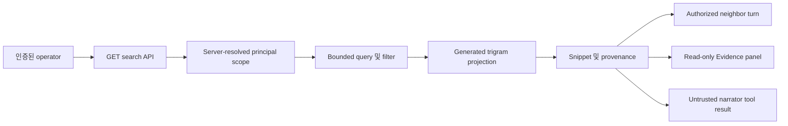

# Access-Scoped 대화 검색

이 설계는 authenticated principal의 durable conversation turn을 대상으로 하는 결정론적 read-only
검색을 정의합니다. Query semantics, authorization, bilingual matching, provenance, context navigation,
PostgreSQL indexing, retention, rebuild operation, narrator 사용, Console view를 다룹니다.

> **범위:** 검색은 operator가 이전 turn을 찾도록 돕습니다. Operator memory, semantic retrieval,
> working-context assembly, approval 또는 execution path를 대체하지 않습니다.

## 한눈에 보는 설계

Read API는 `ConversationSearchScope`를 만들기 전에 principal을 resolve합니다. Provider는 모든
storage query 안에서 scope를 적용한 뒤 결과를 좁히기만 하는 request filter를 적용합니다.
Inference call은 필요하지 않습니다.



## Contract

`ConversationSearch`는 세 operation을 가진 provider-neutral async Protocol입니다:

- `search(scope, query)`는 bounded ranked hit와 authorized index measurement를 반환합니다.
- `context(scope, result_id, before, after)`는 각 방향에 최대 3개 neighbor turn을 반환합니다.
- `lineage(scope, conversation_id)`는 authorized session과 ordered turn id를 반환합니다.

`ConversationSearchScope`는 principal id와 선택적 server-resolved channel 또는 conversation
allowlist를 포함합니다. Request parameter는 principal id를 채우거나 allowlist를 넓힐 수 없습니다.

`ConversationSearchQuery`는 text를 256자, result를 50개, context를 각 방향 3개로 제한합니다.
Channel, role, session, incident, correlation, time filter를 지원합니다. Punctuation-only 및
wildcard-only query는 storage 접근 전에 차단합니다.

## Query semantics

In-memory 및 PostgreSQL adapter는 같은 pure Unicode matching helper를 사용합니다:

| Mode | Semantics |
|------|-----------|
| `terms` | Normalized query token이 모두 turn text에 있습니다. |
| `phrase` | Normalized phrase가 연속해서 있습니다. |
| `prefix` | 각 query token이 normalized turn token 하나 이상의 접두사입니다. |

Normalization은 Unicode NFKC와 case folding을 사용합니다. English와 Korean은 같은 path를
사용합니다. Normalized 및 source offset 길이가 같을 때만 highlight range를 반환하며, 그렇지
않으면 만들어 낸 offset 없이 safe snippet을 반환합니다.

PostgreSQL은 `lower(content)`를 generated `search_text`로 저장하고 `pg_trgm`으로 index합니다.
Term/phrase는 escape된 parameter-bound indexed substring predicate를 사용하고 prefix는 token start에
대한 parameter-bound regular expression을 사용합니다. `%`, `_`, backslash는 SQL syntax로
interpolate하지 않습니다.

## Authorization 및 privacy

모든 search, context, lineage, measurement query는 `principal_id = %s`로 시작합니다. 선택적
authorized channel 및 conversation allowlist를 같은 statement에 적용합니다. Request filter는 그 뒤에
추가되며 authorized row를 좁히기만 합니다.

- Cross-principal row는 hit, count, snippet, lineage, byte total에 기여하지 않습니다.
- Public API는 internal query duration을 제외하여 storage timing metadata를 노출하지 않습니다.
- Result id는 source turn을 식별하지만 scope-bound lookup을 통해서만 사용할 수 있습니다.
- Hidden reasoning, credential, raw attachment, denied evidence는 source에 존재하지 않습니다.
- Metadata projection은 incident id, correlation id, bounded evidence reference만 읽습니다.

Narrator에 반환하는 search text는 `trusted: false`로 표시합니다. Tool, role, approval, execution
capability를 부여하지 않습니다.

## Ranking 및 snippet

Database는 trigram similarity로 candidate retrieval을 제한합니다. Shared matcher가 exact mode
semantics를 적용하고 final rank를 계산합니다. Tie는 recorded time, conversation id, turn id 순으로
정렬합니다. Snippet은 최대 500자, ordered highlight range는 최대 32개입니다. Result는 source
channel, role, time, lineage id, evidence reference도 제공합니다.

## Persistence 및 retention

Migration `20260720_0038`은 `pg_trgm`, generated `search_text`, scoped history/trigram index,
metadata index를 추가합니다. Projection은 두 번째 mutable table이 아니라 source row의 generated
column입니다. Turn append는 source와 projection을 한 transaction에서 갱신합니다.

`conversation_turn`은 `ON DELETE CASCADE`로 `conversation_record`를 참조합니다. Explicit delete와
retention purge는 memory of record와 search visibility를 atomic하게 제거합니다. Cleanup worker가
searchable orphan을 남길 수 없습니다.

## Rebuild 및 measurement

Headless environment에서 rebuild tool을 실행합니다:

```bash
FDAI_STATE_STORE_DSN=<postgres-dsn> \
  python -m fdai.delivery.conversation_search_rebuild_cli
```

Tool은 `REINDEX INDEX CONCURRENTLY` 및 `ANALYZE`를 실행한 뒤 source row, source byte, duration을
JSON으로 보고합니다. Generated `search_text`이므로 conversation body를 copy하지 않습니다.

Provider는 authorized row/byte, result cap, internal query duration을 측정합니다. API는 row, byte,
cap을 노출하지만 duration은 제외합니다. Deterministic 250-turn corpus test는 universal latency SLA를
주장하지 않고 measurement contract를 기록합니다.

## API 및 Console

Read API는 GET-only route를 제공합니다:

- `/me/conversations/search`
- `/me/conversations/search/{result_id}/context`
- `/me/conversations/{conversation_id}/lineage`

Evidence group의 Conversation search panel은 mode, channel, role, session, incident, time filter를
제공합니다. Result는 safe highlight, source metadata, evidence reference, bounded context를 표시합니다.
Missing result는 empty/unavailable로 남고 browser가 snippet을 만들지 않습니다.

`SearchConversationsTool`은 같은 provider를 Reader-floor async narrator tool로 노출합니다. Schema는
bilingual deterministic keyword를 제공하고 output은 명시적으로 untrusted입니다.

## Failure behavior

- Invalid mode, role, time window, result/context cap 또는 wildcard-only text는 400을 반환합니다.
- Scope 밖 result 또는 lineage는 missing record와 같은 404 shape를 반환합니다.
- PostgreSQL statement timeout은 over-budget query를 중단합니다.
- Decoder failure는 missing field를 추측하지 않고 rendering을 차단합니다.
- Concurrent rebuild는 성공 후에만 index를 swap하므로 failure 시 prior index를 보존합니다.

## Verification

Coverage는 English, Korean, phrase, prefix, metadata filter, wildcard abuse, principal/channel isolation,
authorized measurement, context, lineage, deletion, live migration, concurrent rebuild, narrator provenance,
API denial, Console decoding, navigation registration, responsive type checking을 포함합니다.

## 관련 문서

| 알아볼 내용 | 문서 |
|------------|------|
| Conversation persistence 및 consent | [Operator Console](operator-console-ko.md) |
| Provider 및 delivery boundary | [Project Structure](../architecture/project-structure-ko.md) |
| Human identity 및 role | [User RBAC and Entra Identity](user-rbac-and-identity-ko.md) |
| Working-context retrieval | [Prompt Composition](../decisioning/prompt-composition-ko.md) |
