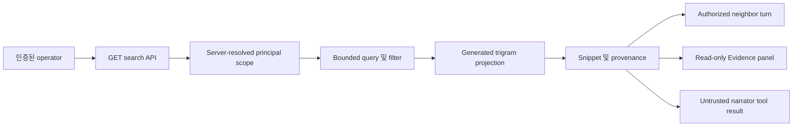

# Access-Scoped 대화 검색

이 설계는 인증된 principal의 영속 대화 턴을 대상으로 하는 결정론적 읽기 전용
검색을 정의합니다. 조회 의미 규칙, 권한 확인, bilingual matching, 출처 이력, 맥락 탐색,
PostgreSQL 인덱싱, 보존, 재구축 연산, 서술기 사용, Console 화면을 다룹니다.

> **범위:** 검색은 운영자가 이전 턴을 찾도록 돕습니다. Operator 기억, semantic 수집,
> working-context assembly, 승인 또는 실행 경로를 대체하지 않습니다.

## 한눈에 보는 설계

Operator API는 `ConversationSearchScope`를 만들기 전에 principal을 해석합니다. 프로바이더는 모든
저장소 조회 안에서 범위를 적용한 뒤 결과를 좁히기만 하는 요청 필터를 적용합니다.
Inference 호출은 필요하지 않습니다.


```mermaid
flowchart LR
    USER[인증된 operator] --> API[GET search API]
    API --> SCOPE[Server-resolved principal scope]
    SCOPE --> QUERY[Bounded query 및 filter]
    QUERY --> INDEX[Generated trigram projection]
    INDEX --> RESULT[Snippet 및 provenance]
    RESULT --> CONTEXT[Authorized neighbor turn]
    RESULT --> UI[Read-only Evidence panel]
    RESULT --> TOOL[Untrusted narrator tool result]
```

## 계약

`ConversationSearch`는 세 연산을 가진 provider-neutral 비동기 프로토콜입니다:

- `search(scope, query)`는 범위가 제한된 ranked 적중과 authorized 인덱스 측정을 반환합니다.
- `context(scope, result_id, before, after)`는 각 방향에 최대 3개 neighbor 턴을 반환합니다.
- `lineage(scope, conversation_id)`는 authorized 세션과 ordered 턴 id를 반환합니다.

`ConversationSearchScope`는 principal id와 선택적 server-resolved 채널 또는 대화
허용 목록을 포함합니다. 요청 매개변수는 principal id를 채우거나 허용 목록을 넓힐 수 없습니다.

`ConversationSearchQuery`는 텍스트를 256자, 결과를 50개, 맥락을 각 방향 3개로 제한합니다.
채널, 역할, 세션, 인시던트, 상관관계, time 필터를 지원합니다. Punctuation-only 및
wildcard-only 조회는 저장소 접근 전에 차단합니다.

## 조회 의미 규칙

In-memory 및 PostgreSQL 어댑터는 같은 pure Unicode matching 보조 로직을 사용합니다:

| 모드 | 의미 규칙 |
|------|-----------|
| `terms` | 정규화된 조회 토큰이 모두 턴 텍스트에 있습니다. |
| `phrase` | 정규화된 문구가 연속해서 있습니다. |
| `prefix` | 각 조회 토큰이 정규화된 턴 토큰 하나 이상의 접두사입니다. |

정규화는 유니코드 NFKC와 대소문자 접기를 사용합니다. 영어와 한국어는 같은 경로를
사용합니다. 정규화된 및 출처 오프셋 길이가 같을 때만 강조 범위를 반환하며, 그렇지
않으면 만들어 낸 오프셋 없이 safe 스니펫을 반환합니다.

PostgreSQL은 `lower(content)`를 생성된 `search_text`로 저장하고 `pg_trgm`으로 인덱스합니다.
Term/문구는 escape된 parameter-bound indexed substring 조건식을 사용하고 접두사는 토큰 시작에
대한 parameter-bound regular 표현식을 사용합니다. `%`, `_`, 역슬래시는 SQL 구문으로
interpolate하지 않습니다.

## 권한 확인 및 privacy

모든 search, 맥락, 계보, 측정 조회는 `principal_id = %s`로 시작합니다. 선택적
authorized 채널 및 대화 허용 목록을 같은 구문에 적용합니다. 요청 필터는 그 뒤에
추가되며 authorized 행을 좁히기만 합니다.

- Cross-principal 행은 적중, 개수, 스니펫, 계보, 바이트 합계에 기여하지 않습니다.
- 공개 API는 내부 조회 소요 시간을 제외하여 저장소 timing 메타데이터를 노출하지 않습니다.
- 결과 id는 출처 턴을 식별하지만 scope-bound 조회를 통해서만 사용할 수 있습니다.
- Hidden reasoning, 자격 증명, raw 첨부, 거부된 근거는 출처에 존재하지 않습니다.
- 메타데이터 변환 결과는 인시던트 id, 상관관계 id, 범위가 제한된 근거 참조만 읽습니다.

Narrator에 반환하는 search 텍스트는 `trusted: false`로 표시합니다. 도구, 역할, 승인, 실행
기능을 부여하지 않습니다.

## Ranking 및 스니펫

데이터베이스는 trigram 유사도로 후보 수집을 제한합니다. 공유 매칭기가 정확 모드
의미 규칙을 적용하고 최종 순위를 계산합니다. 동점은 기록된 time, 대화 id, 턴 id 순으로
정렬합니다. 스니펫은 최대 500자, ordered 강조 범위는 최대 32개입니다. 결과는 출처
채널, 역할, time, 계보 id, 근거 참조도 제공합니다.

## 영속성 및 보존

이행 `20260720_0038`은 `pg_trgm`, 생성된 `search_text`, scoped history/trigram 인덱스,
메타데이터 인덱스를 추가합니다. 변환 결과는 두 번째 변경 가능한 표가 아니라 출처 행의 생성된
열입니다. Turn 덧붙이기는 출처와 변환 결과를 한 트랜잭션에서 갱신합니다.

`conversation_turn`은 `ON DELETE CASCADE`로 `conversation_record`를 참조합니다. 명시적 삭제와
보존 정리는 기억 of 기록과 search 가시성을 atomic하게 제거합니다. 정리 워커가
searchable 고아를 남길 수 없습니다.

## 재구축 및 측정

Headless 환경에서 재구축 도구를 실행합니다:

```bash
FDAI_STATE_STORE_DSN=<postgres-dsn> \
  python -m fdai.delivery.conversation_search_rebuild_cli
```

도구는 `REINDEX INDEX CONCURRENTLY` 및 `ANALYZE`를 실행한 뒤 출처 행, 출처 바이트, 소요 시간을
JSON으로 보고합니다. 생성된 `search_text`이므로 대화 본문을 copy하지 않습니다.

프로바이더는 authorized 행/바이트, 결과 상한, 내부 조회 소요 시간을 측정합니다. API는 행, 바이트,
상한을 노출하지만 소요 시간은 제외합니다. 결정론적 250-turn 말뭉치 테스트는 universal 지연 시간 SLA를
주장하지 않고 측정 계약을 기록합니다.

## API 및 Console

Operator API는 GET-only 경로를 제공합니다:

- `/me/conversations/search`
- `/me/conversations/search/{result_id}/context`
- `/me/conversations/{conversation_id}/lineage`

근거 그룹의 대화 search 패널은 모드, 채널, 역할, 세션, 인시던트, time 필터를
제공합니다. 결과는 safe 강조, 출처 메타데이터, 근거 참조, 범위가 제한된 맥락을 표시합니다.
누락된 결과는 빈/사용 불가로 남고 브라우저가 스니펫을 만들지 않습니다.

`SearchConversationsTool`은 같은 프로바이더를 Reader-floor 비동기 서술기 도구로 노출합니다. 스키마는
bilingual 결정론적 키워드를 제공하고 출력은 명시적으로 신뢰할 수 없는입니다.

## 실패 behavior

- 잘못된 모드, 역할, time 구간, 결과/맥락 상한 또는 wildcard-only 텍스트는 400을 반환합니다.
- 범위 밖 결과 또는 계보는 누락된 기록과 같은 404 형태를 반환합니다.
- PostgreSQL 구문 시간 초과는 over-budget 조회를 중단합니다.
- Decoder 실패는 누락된 필드를 추측하지 않고 렌더링을 차단합니다.
- 동시 재구축은 성공 후에만 인덱스를 swap하므로 실패 시 이전 인덱스를 보존합니다.

## 검증

커버리지는 English, Korean, 문구, 접두사, 메타데이터 필터, 와일드카드 abuse, principal/채널 격리,
authorized 측정, 맥락, 계보, deletion, live 이행, 동시 재구축, 서술기 출처 이력,
API denial, Console 디코딩, 탐색 registration, responsive 타입 검사를 포함합니다.

## 관련 문서

| 알아볼 내용 | 문서 |
|------------|------|
| 대화 영속성 및 consent | [Operator Console](operator-console-ko.md) |
| 프로바이더 및 전달 경계 | [Project Structure](../architecture/project-structure-ko.md) |
| Human 신원 및 역할 | [User RBAC and Entra 신원](user-rbac-and-identity-ko.md) |
| Working-context 수집 | [프롬프트 조립](../decisioning/prompt-composition-ko.md) |
