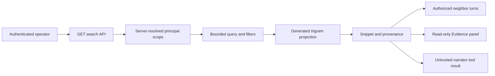

# Access-Scoped Conversation Search

This design defines deterministic, read-only search across an authenticated principal's durable
conversation turns. It covers query semantics, authorization, bilingual matching, provenance,
context navigation, PostgreSQL indexing, retention, rebuild operations, narrator use, and the
Console view.

> **Scope:** Search helps an operator find prior turns. It does not replace operator memory,
> semantic retrieval, working-context assembly, or any approval and execution path.

## Design at a glance

The read API resolves the principal before it constructs `ConversationSearchScope`. The provider
applies that scope inside every storage query, then applies request filters that can only narrow the
result. No inference call is required.



## Contracts

`ConversationSearch` is a provider-neutral async Protocol with three operations:

- `search(scope, query)` returns bounded ranked hits and authorized index measurements.
- `context(scope, result_id, before, after)` returns at most three neighboring turns per side.
- `lineage(scope, conversation_id)` returns the authorized session and ordered turn ids.

`ConversationSearchScope` contains the principal id and optional server-resolved channel or
conversation allowlists. Request parameters never populate the principal id or widen an allowlist.

`ConversationSearchQuery` limits text to 256 characters, results to 50, and context to three turns
per side. It supports channel, role, session, incident, correlation, and time filters.
Punctuation-only and wildcard-only queries are rejected before storage access.

## Query semantics

The in-memory and PostgreSQL adapters use the same pure Unicode matching helper:

| Mode | Semantics |
|------|-----------|
| `terms` | Every normalized query token occurs in the turn text. |
| `phrase` | The normalized phrase occurs contiguously. |
| `prefix` | Every query token prefixes at least one normalized turn token. |

Normalization uses Unicode NFKC plus case folding. English and Korean use the same path. Highlight
ranges are returned only when normalized and source offsets have equal length; otherwise the safe
snippet is returned without invented offsets.

PostgreSQL stores `lower(content)` as generated `search_text` and indexes it with `pg_trgm`. Terms
and phrases use escaped, parameter-bound indexed substring predicates. Prefixes use
parameter-bound regular expressions over token starts. `%`, `_`, and backslashes are escaped and
never interpolated as SQL syntax.

## Authorization and privacy

Every search, context, lineage, and measurement query starts with `principal_id = %s`. Optional
authorized channel and conversation allowlists are applied in the same statement. Request filters
are appended afterward and can only narrow authorized rows.

- Cross-principal rows do not contribute hits, counts, snippets, lineage, or byte totals.
- The public API omits internal query duration to avoid exposing storage timing metadata.
- Result ids identify source turns but are usable only through a scope-bound lookup.
- Hidden reasoning, credentials, raw attachments, and denied evidence are absent from the source.
- Metadata projection reads only incident id, correlation id, and bounded evidence references.

Search text returned to a narrator is marked `trusted: false`. It grants no tool, role, approval, or
execution capability.

## Ranking and snippets

The database uses trigram similarity to bound candidate retrieval. The shared matcher applies the
exact mode semantics and computes the final rank. Ties sort by recorded time, conversation id, and
turn id. Snippets contain at most 500 characters and 32 ordered highlight ranges. Each result also
carries source channel, role, time, lineage ids, and evidence references.

## Persistence and retention

Migration `20260720_0038` adds `pg_trgm`, generated `search_text`, scoped history and trigram
indexes, and metadata indexes. The projection is a generated column on the source row, not a second
mutable table. Turn append updates source and projection in one transaction.

`conversation_turn` already references `conversation_record` with `ON DELETE CASCADE`. Explicit
deletion and retention purge therefore remove search visibility atomically with the memory of
record. A cleanup worker cannot leave a searchable orphan.

## Rebuild and measurements

Run the rebuild tool in the headless environment:

```bash
FDAI_STATE_STORE_DSN=<postgres-dsn> \
  python -m fdai.delivery.conversation_search_rebuild_cli
```

The tool runs `REINDEX INDEX CONCURRENTLY` and `ANALYZE`, then reports source rows, source bytes,
and duration as JSON. Generated `search_text` means rebuild does not copy conversation bodies.

Providers measure authorized rows, authorized bytes, result cap, and internal query duration. The
API exposes rows, bytes, and cap but withholds duration. A deterministic 250-turn corpus test
records this measurement contract without claiming a universal latency SLA.

## API and Console

The read API exposes GET-only routes:

- `/me/conversations/search`
- `/me/conversations/search/{result_id}/context`
- `/me/conversations/{conversation_id}/lineage`

The Evidence group's Conversation search panel provides mode, channel, role, session, incident,
and time filters. Results show safe highlights, source metadata, evidence references, and bounded
context. Missing results stay empty or unavailable; the browser does not synthesize snippets.

`SearchConversationsTool` exposes the same provider as a Reader-floor async narrator tool. Its
schema has bilingual deterministic keywords, and its output is explicitly untrusted.

## Failure behavior

- Invalid mode, role, time window, result cap, context cap, or wildcard-only text returns 400.
- A result or lineage outside scope returns the same 404 shape as a missing record.
- PostgreSQL statement timeout aborts an over-budget query.
- Decoder failure blocks rendering instead of guessing missing fields.
- Concurrent rebuild swaps the index only after success, preserving the prior index on failure.

## Verification

Coverage includes English, Korean, phrase, prefix, metadata filters, wildcard abuse,
principal/channel isolation, authorized measurements, context, lineage, deletion, live migration,
concurrent rebuild, narrator provenance, API denial, Console decoding, navigation registration,
and responsive type checking.

## Related docs

| To learn about | Read |
|----------------|------|
| Conversation persistence and consent | [Operator Console](operator-console.md) |
| Provider and delivery boundaries | [Project Structure](../architecture/project-structure.md) |
| Human identity and roles | [User RBAC and Entra Identity](user-rbac-and-identity.md) |
| Working-context retrieval | [Prompt Composition](../decisioning/prompt-composition.md) |
