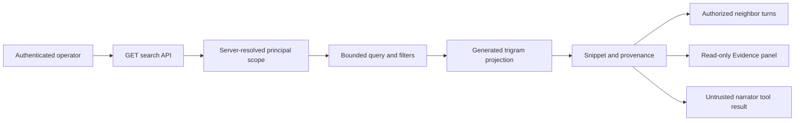

# Access-Scoped Conversation Search

This design defines deterministic, read-only search across an authenticated principal's durable
conversation turns. It covers query semantics, authorization, bilingual matching, provenance,
context navigation, PostgreSQL indexing, retention, rebuild operations, narrator use, and the
Console view.

> **Scope:** Search helps an operator find prior turns. It does not replace operator memory,
> semantic retrieval, working-context assembly, or any approval and execution path.

## Design at a glance

The Operator API resolves the principal before it constructs `ConversationSearchScope`. The provider
applies that scope inside every storage query, then applies request filters that can only narrow the
result. No inference call is required.


```mermaid
flowchart LR
    USER[Authenticated operator] --> API[GET search API]
    API --> SCOPE[Server-resolved principal scope]
    SCOPE --> QUERY[Bounded query and filters]
    QUERY --> INDEX[Generated trigram projection]
    INDEX --> RESULT[Snippet and provenance]
    RESULT --> CONTEXT[Authorized neighbor turns]
    RESULT --> UI[Read-only Evidence panel]
    RESULT --> TOOL[Untrusted narrator tool result]
```

## Contracts

`ConversationSearch` is a provider-neutral async Protocol with three operations:

- `search(scope, query)` returns bounded ranked hits and authorized index measurements.
- `context(scope, result_id, before, after)` returns at most three neighboring turns per side.
- `lineage(scope, conversation_id)` returns the authorized session and ordered turn ids.

`ConversationSearchScope` contains the principal id and optional server-resolved channel or
conversation allowlists. Request parameters never populate the principal id or widen an allowlist.

`ConversationSearchQuery` limits text to 256 characters, results to 50, and context to three turns
per side. It supports channel, role, session, incident, correlation, and time filters.
Punctuation-only and wildcard-only queries are rejected before storage access.

## Query semantics

The in-memory and PostgreSQL adapters use the same pure Unicode matching helper:

| Mode | Semantics |
|------|-----------|
| `terms` | Every normalized query token occurs in the turn text. |
| `phrase` | The normalized phrase occurs contiguously. |
| `prefix` | Every query token prefixes at least one normalized turn token. |

Normalization uses Unicode NFKC plus case folding. English and Korean use the same path. Highlight
ranges are returned only when normalized and source offsets have equal length; otherwise the safe
snippet is returned without invented offsets.

PostgreSQL stores `lower(content)` as generated `search_text` and indexes it with `pg_trgm`. Terms
and phrases use escaped, parameter-bound indexed substring predicates. Prefixes use
parameter-bound regular expressions over token starts. `%`, `_`, and backslashes are escaped and
never interpolated as SQL syntax.

## Authorization and privacy

Every search, context, lineage, and measurement query starts with `principal_id = %s`. Optional
authorized channel and conversation allowlists are applied in the same statement. Request filters
are appended afterward and can only narrow authorized rows.

- Cross-principal rows do not contribute hits, counts, snippets, lineage, or byte totals.
- The public API omits internal query duration to avoid exposing storage timing metadata.
- Result ids identify source turns but are usable only through a scope-bound lookup.
- Hidden reasoning, credentials, raw attachments, and denied evidence are absent from the source.
- Metadata projection reads only incident id, correlation id, and bounded evidence references.

Search text returned to a narrator is marked `trusted: false`. It grants no tool, role, approval, or
execution capability.

## Ranking and snippets

The database uses trigram similarity to bound candidate retrieval. The shared matcher applies the
exact mode semantics and computes the final rank. Ties sort by recorded time, conversation id, and
turn id. Snippets contain at most 500 characters and 32 ordered highlight ranges. Each result also
carries source channel, role, time, lineage ids, and evidence references.

## Persistence and retention

Migration `20260720_0038` adds `pg_trgm`, generated `search_text`, scoped history and trigram
indexes, and metadata indexes. The projection is a generated column on the source row, not a second
mutable table. Turn append updates source and projection in one transaction.

`conversation_turn` already references `conversation_record` with `ON DELETE CASCADE`. Explicit
deletion and retention purge therefore remove search visibility atomically with the memory of
record. A cleanup worker cannot leave a searchable orphan.

## Rebuild and measurements

Run the rebuild tool in the headless environment:

```bash
FDAI_STATE_STORE_DSN=<postgres-dsn> \
  python -m fdai.delivery.conversation_search_rebuild_cli
```

The tool runs `REINDEX INDEX CONCURRENTLY` and `ANALYZE`, then reports source rows, source bytes,
and duration as JSON. Generated `search_text` means rebuild does not copy conversation bodies.

Providers measure authorized rows, authorized bytes, result cap, and internal query duration. The
API exposes rows, bytes, and cap but withholds duration. A deterministic 250-turn corpus test
records this measurement contract without claiming a universal latency SLA.

## API and Console

The Operator API exposes GET-only routes:

- `/me/conversations/search`
- `/me/conversations/search/{result_id}/context`
- `/me/conversations/{conversation_id}/lineage`

The Evidence group's Conversation search panel provides mode, channel, role, session, incident,
and time filters. Results show safe highlights, source metadata, evidence references, and bounded
context. Missing results stay empty or unavailable; the browser does not synthesize snippets.

`SearchConversationsTool` exposes the same provider as a Reader-floor async narrator tool. Its
schema has bilingual deterministic keywords, and its output is explicitly untrusted.

## Failure behavior

- Invalid mode, role, time window, result cap, context cap, or wildcard-only text returns 400.
- A result or lineage outside scope returns the same 404 shape as a missing record.
- PostgreSQL statement timeout aborts an over-budget query.
- Decoder failure blocks rendering instead of guessing missing fields.
- Concurrent rebuild swaps the index only after success, preserving the prior index on failure.

## Verification

Coverage includes English, Korean, phrase, prefix, metadata filters, wildcard abuse,
principal/channel isolation, authorized measurements, context, lineage, deletion, live migration,
concurrent rebuild, narrator provenance, API denial, Console decoding, navigation registration,
and responsive type checking.

## Implementation status

### Implementation scope

| Area | State | Evidence | Notes |
|------|-------|----------|-------|
| Bounded query contracts and Unicode matching | implemented | `services/core-control-plane/src/fdai/shared/providers/conversation_search.py`; `services/core-control-plane/src/fdai/shared/providers/conversation_search_text.py`; `services/core-control-plane/tests/providers/test_conversation_search.py` | The shared contracts enforce query, result, context, snippet, and measurement bounds. Focused provider tests cover English, Korean, phrase, prefix, and metadata matching. |
| Principal-scoped in-memory search, context, lineage, measurements, and deletion | implemented | `services/core-control-plane/src/fdai/shared/providers/testing/conversation_search.py`; `services/core-control-plane/tests/providers/test_conversation_search.py` | Focused tests exercise principal and allowlist isolation before measurements, authorized neighbors and lineage, deterministic corpus caps, and deletion visibility. |
| PostgreSQL projection, indexing, retention, and rebuild | implemented | `alembic/versions/20260720_0038_conversation_search.py`; `services/core-control-plane/src/fdai/delivery/persistence/postgres_conversation_search.py`; `services/core-control-plane/src/fdai/delivery/conversation_search_rebuild_cli.py`; focused CLI and live PostgreSQL tests (`10 passed`, no skips) | The migration, adapter, and headless rebuild entry point preserve the source turns while rebuilding the derived index under the configured session statement timeout. Governed restart evidence remains open. |
| Reader-floor narrator search tool | implemented | `services/core-control-plane/src/fdai/core/conversation/_system_conversation_search_tool.py`; `services/core-control-plane/tests/conversation/test_search_conversations_tool.py` | Focused tests prove principal-scoped results, bounded validation errors, evidence references, and explicit `trusted: false` output for a Reader principal. |
| Operator API search, context, and lineage routes | implemented | `services/operator-service/src/fdai_operator_service/families/conversation/conversation_search.py`; `services/operator-service/src/fdai_operator_service/postgres_family_store.py`; `service-migrations/branches/operator-service/versions/20260814_operator_conversation_search_read.py`; focused API and live PostgreSQL tests (`11 passed`, no skips) | The Operator resolves the authenticated principal, validates bounded filters, reads the source tables through its SELECT-only role, returns identical missing and out-of-scope 404 envelopes, and omits internal query duration. |
| Console search and context panel | in-progress | `console/src/routes/conversation-search.tsx`; `console/src/user-context-client.ts`; `console/src/user-context-client.test.ts`; `console/src/panels.test.ts` | The panel, client, bounded decoder checks, and navigation registration exist. No focused route interaction test proves submission, highlights, context loading, and fail-closed rendering together. |

### Implementation history

| Date | State | Change | Evidence | Remaining |
|------|-------|--------|----------|-----------|
| 2026-08-13 | in-progress | Adopted the implementation ledger without reconstructing earlier provenance. | `current change`; core provider and narrator checks passed 6 cases; the Operator conversation-family check passed 7 cases; Console decoder and panel checks passed 19 cases; PostgreSQL checks passed 1 non-live case and skipped 2 live cases because `FDAI_DATABASE_URL` was unset. | Complete the PostgreSQL, Operator API, Console, and governed runtime evidence below. |
| 2026-08-14 | implemented | Added the headless conversation-search projection rebuild command with bounded JSON metrics and fail-closed configuration and error handling, then exercised the complete PostgreSQL search suite against the supported local database. | `current change`; `services/core-control-plane/src/fdai/delivery/conversation_search_rebuild_cli.py`; `services/core-control-plane/tests/delivery/test_conversation_search_rebuild_cli.py`; CLI tests `6 passed`; live PostgreSQL tests `3 passed`, no skips. | Materialize the Operator projections, close the Console route coverage, and retain governed runtime evidence. |
| 2026-08-14 | implemented | Applied the configured statement timeout to the autocommit rebuild session before concurrent reindex so a blocked rebuild cannot wait without the server-owned bound. | `current change`; PostgreSQL search adapter and focused timeout-order plus live PostgreSQL tests `4 passed`, no skips. | Operator and Console projection work plus governed runtime evidence remain open. |
| 2026-08-14 | implemented | Materialized search, context, and lineage behind the Operator API with authenticated principal scoping, bounded wire projections, SELECT-only database access, and timing omission. | `current change`; Operator materializer, family adapter, PostgreSQL store, service-owned grant migration, focused API tests `10 passed`, and restricted-role live PostgreSQL test `1 passed`, no skips. | Add the focused Console interaction suite and retain governed cross-surface runtime evidence. |

### Remaining work

- [x] Record a passing live PostgreSQL focused check for migration, principal isolation, bilingual
  search, context, lineage, retention deletion, and concurrent rebuild with
  `FDAI_DATABASE_URL` configured.
- [x] Add the documented `fdai.delivery.conversation_search_rebuild_cli` headless entry point and
  focused success and failure-preservation checks.
- [x] Materialize the three search projections behind the Operator API and add focused API tests
  that prove server-resolved scope, indistinguishable out-of-scope 404 responses, bounded payloads,
  and omission of internal query duration.
- [ ] Add a focused Console route test that covers form filters, safe highlights, context loading,
  empty and unavailable results, and decoder failure without synthesized content.
- [ ] Record governed runtime evidence for the PostgreSQL, Operator API, Console, and narrator paths
  before promoting any scope row to `validated`.

## Related docs

| To learn about | Read |
|----------------|------|
| Conversation persistence and consent | [Operator Console](operator-console.md) |
| Provider and delivery boundaries | [Project Structure](../architecture/project-structure.md) |
| Human identity and roles | [User RBAC and Entra Identity](user-rbac-and-identity.md) |
| Working-context retrieval | [Prompt Composition](../decisioning/prompt-composition.md) |
