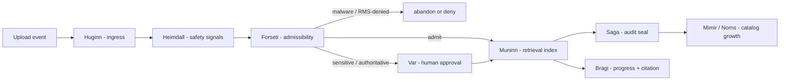

# 문서 인제스트 에이전트 소유권

이 문서는 모든 문서 인제스트 전이를 FDAI pantheon 에이전트에 할당합니다. Gateway를 기계적인
구성 요소로 유지하고 admission, 인덱싱, 감사 및 카탈로그 성장을 다른 모든 이벤트와 동일한
에이전트 주도 제어 루프에 포함합니다.

> **범위:** Upload gateway는 인증하고 quarantine으로 스트리밍하며 크기와 해시를 봉인합니다.
> 판단 권한이 없으며 dedicated identity에 Thor executor 권한을 부여하지 않습니다.

## 설계 개요

업로드는 `Event`입니다. 각 파이프라인 단계는 `aw.pipeline.stages`에서 typed object를 발행하거나
소비합니다. Worker 또는 gateway 부수 효과는 소유 에이전트의 결정을 대체할 수 없습니다.

## 소유권 맵

| 단계 | 소유 에이전트 | 소유 오브젝트 또는 근거 |
|------|--------------|--------------------------|
| Ingress - 업로드를 이벤트로 수용 | **Huginn** (Event Collector) | `Event`; 업로드는 bus가 아닌 external adapter를 통해 도착 |
| 안전 관측 - 악성코드, 시크릿, 보호, RMS 신호 | **Heimdall** (Observer) | 악성, 보호 또는 의심 업로드에 대한 `Anomaly` 또는 `SecurityEvent` |
| Admissibility - admit, hold 또는 abandon | **Forseti** (Judge) | `Verdict`; RMS 거부나 악성코드는 조용한 gateway drop이 아니라 abandon 또는 deny |
| 사람 승인 - 민감하거나 권위 있는 문서 | **Var** (Approver) | `Approval`; 권위 지식 승격 전에 승인하며 self-approval 금지 |
| 검색 인덱싱 - chunk 및 embed | **Muninn** (Memory) | `ContextIndex`; 승인된 governed version을 검색 가능하게 만듦 |
| 감사 봉인 - lifecycle 및 access 결정 | **Saga** (Auditor, hard dependency) | `AuditEntry`; 감사 없이 진행하지 않고 기록에 문서 text를 포함하지 않음 |
| 카탈로그 성장 - 권위 문서와 반복 패턴 | **Mimir** 및 **Norns** | `Rule`, `Policy` 또는 `RuleCandidate`; manual과 runbook이 reviewed candidate를 시딩 가능 |
| 서술 - 진행과 grounded citation | **Bragi** (Narrator) | `Turn`; 결정하지 않고 진행을 렌더링하며 `doc:` source를 인용 |
| 충돌 또는 롤백 - 상충하거나 잘못된 version | **Odin** 및 **Vidar** | `ArbitrationDecision` 또는 `Rollback`; version을 retract 또는 supersede |

## 승격과 감사 불변 조건

새로 인제스트된 문서는 먼저 advisory 상태입니다. Bragi가 인용할 수 있지만 Forseti가 admit하고,
Var가 민감한 승격을 승인하며, Saga가 감사를 봉인하기 전에는 T2 결정을 구동하지 않습니다. 모든
capability에 적용하는 관찰 모드에서 적용 모드로의 규율과 같습니다.

Gateway와 worker는 항상 소유 에이전트의 typed object로 단계 전이를 표현합니다. 소유 에이전트와
Saga 감사 항목이 없는 전이는 결함입니다. 충돌은 Odin으로 라우팅하며 잘못되거나 superseded된
version은 Vidar rollback 경로를 유지합니다.

## Ingress 구현

Ingress 단계를 먼저 배선합니다. Gateway 구성은 durable activity sink를
`PantheonDocumentActivitySink`로 감싸 `document.received` 전이를 Huginn 소유 `object.event`로
pantheon 버스에 승격합니다. `EventBusDocumentIngestionIntake`가 Huginn `producer_principal`을
클레임하고 `document_id`로 파티션하며 canonical `event_type`, `correlation_id`,
`idempotency_key`, `resource_id` 필드를 제공하므로, 이미 `object.event` 구독자인 Forseti와
Heimdall이 실행 가능한 일급 이벤트로 업로드를 수신합니다. Forseti는 action type이 없는
`kind = document_ingestion` admissibility verdict를 발행하고 malformed ingress는 hold합니다.
Thor는 이 non-action verdict를 명시적으로 무시하므로 업로드가 `ActionRun`을 만들 수 없습니다.
Delivery 계층은 Thor의 executor identity를 보유하지 않습니다. Saga는 문서 verdict를 소비해
audit chain에 추가하고 content-free `object.audit-entry`로 다시 발행합니다. Ingestion worker는
Saga가 감사한 `stage = received`, `decision = admit` 레코드만 소비합니다. 일반 `RECEIVED` 문서는
reconcile 대상에서 제외되어 Forseti와 Saga hard dependency가 모두 완료될 때까지 fail-closed
상태로 유지됩니다. 이후 worker는 scan과 protection inspection을 마친 `PROTECTION_CHECK`에서
멈춥니다. Huginn이 content-free inspection 사실을 다시 발행하고, Heimdall이 이를
`object.anomaly`로 정규화하며, Forseti가 protection verdict를 발행하고 Saga가 봉인합니다.
감사된 clear decision은 Muninn으로 전달되고, Muninn만 extraction과 indexing을 여는
`object.context-index` command를 발행합니다. Blocked decision은 version을 `HELD`로 이동합니다.
Sensitivity label, `handover_bootstrap`, `manual_distillation` purpose가 있는 clear 문서는 대신
`hil` verdict를 받습니다. Saga가 이 verdict를 봉인하고 Var가 문서 approval ticket을 만들며,
uploader는 자신의 문서를 승인할 수 없습니다. Var의 reviewer approval은 Muninn이 indexing을
열기 전에 Saga가 다시 봉인하며, rejection은 version을 `HELD`로 이동합니다. Thor는 문서
verdict와 approval을 모두 무시합니다.
Reconciliation은 stable idempotency key로 `RECEIVED`와 `PROTECTION_CHECK` event를 재발행하지만
해당 gated state를 직접 진행하지 않습니다. `QUARANTINED`, `SCANNING`, `EXTRACTING`, `INDEXING`의
post-decision 작업만 resume합니다.

## 관련 문서

| 알아볼 내용 | 문서 |
|-------------|------|
| Drop zone, storage, lifecycle 및 event 계약 | [문서 인제스트](document-ingestion-ko.md) |
| Slack, Teams, web chat, protected fetch 및 image OCR | [대화 첨부 파일](conversation-attachments-ko.md) |
| Pantheon 역할 경계 | [에이전트 Pantheon](../agents/agent-pantheon-ko.md) |
