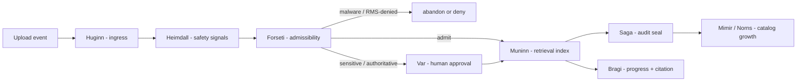

# 문서 인제스트 에이전트 소유권

이 문서는 모든 문서 인제스트 전이를 FDAI 판테온 에이전트에 할당합니다. 게이트웨이를 기계적인
구성 요소로 유지하고 반입, 인덱싱, 감사, 카탈로그 성장을 다른 모든 이벤트와 동일한
에이전트 주도 제어 루프에 포함합니다.

> **범위:** 업로드 게이트웨이는 인증하고 격리 구역으로 스트리밍하며 크기와 해시를 봉인합니다.
> 판단 권한이 없으며 전용 신원에 Thor의 실행 권한을 부여하지 않습니다.

## 설계 개요

업로드는 `Event`입니다. 각 파이프라인 단계는 `aw.pipeline.stages`에서 타입이 지정된 객체를
발행하거나 소비합니다. 워커나 게이트웨이의 부수 효과는 소유 에이전트의 결정을 대체할 수
없습니다.

```mermaid
flowchart LR
  U[Upload event] --> HU[Huginn - ingress]
  HU --> HE[Heimdall - safety signals]
  HE --> FO[Forseti - admissibility]
  FO -->|malware / RMS-denied| X[abandon or deny]
  FO -->|sensitive / authoritative| VA[Var - human approval]
  FO -->|admit| MU[Muninn - retrieval index]
  VA --> MU
  MU --> SA[Saga - audit seal]
  SA --> KM[Mimir / Norns - catalog growth]
  MU --> BR[Bragi - progress + citation]
```

## 소유권 맵

| 단계 | 소유 에이전트 | 소유 오브젝트 또는 근거 |
|------|--------------|--------------------------|
| Ingress - 업로드를 이벤트로 수용 | **Huginn** (Event Collector) | `Event`; 업로드는 버스가 아닌 외부 어댑터를 통해 도착 |
| 안전 관측 - 악성코드, 시크릿, 보호, RMS 신호 | **Heimdall** (Observer) | 악성, 보호 또는 의심 업로드에 대한 `Anomaly` 또는 `SecurityEvent` |
| 반입 판단 - 반입 허용, 보류 또는 포기 | **Forseti** (Judge) | `Verdict`; RMS 거부나 악성코드는 조용한 게이트웨이 폐기가 아니라 포기 또는 거부 |
| 사람 승인 - 민감하거나 권위 있는 문서 | **Var** (Approver) | `Approval`; 권위 지식 승격 전에 승인하며 자기 승인 금지 |
| 검색 인덱싱 - 조각 및 임베딩 | **Muninn** (Memory) | `ContextIndex`; 승인된 통제된 버전을 검색 가능하게 만듦 |
| 감사 봉인 - 수명 주기 및 접근 결정 | **Saga** (Auditor, 필수 의존성) | `AuditEntry`; 감사 없이 진행하지 않고 기록에 문서 텍스트를 포함하지 않음 |
| 카탈로그 성장 - 권위 문서와 반복 패턴 | **Mimir** 및 **Norns** | `Rule`, `Policy` 또는 `RuleCandidate`; 수동과 런북이 검토된 후보를 시딩 가능 |
| 서술 - 진행과 근거에 기반한 인용 | **Bragi** (Narrator) | `Turn`; 결정하지 않고 진행을 렌더링하며 `doc:` 출처를 인용 |
| 충돌 또는 롤백 - 상충하거나 잘못된 버전 | **Odin** 및 **Vidar** | `ArbitrationDecision` 또는 `Rollback`; 버전을 철회 또는 대체 |

## 승격과 감사 불변 조건

새로 인제스트된 문서는 먼저 참고용 상태입니다. Bragi가 인용할 수 있지만 Forseti가 반입 허용하고,
Var가 민감한 승격을 승인하며, Saga가 감사를 봉인하기 전에는 T2 결정을 구동하지 않습니다. 모든
기능에 적용하는 관찰 모드에서 적용 모드로의 규율과 같습니다.

게이트웨이와 워커는 항상 소유 에이전트의 타입이 지정된 객체로 단계 전이를 표현합니다. 소유 에이전트와
Saga 감사 항목이 없는 전이는 결함입니다. 충돌은 Odin으로 라우팅하며 잘못되거나 대체된된
버전은 Vidar 롤백 경로를 유지합니다.

## Ingress 구현

Ingress 단계를 먼저 배선합니다. 게이트웨이 구성은 영속 activity 싱크를
`PantheonDocumentActivitySink`로 감싸 `document.received` 전이를 Huginn 소유 `object.event`로
pantheon 버스에 승격합니다. `EventBusDocumentIngestionIntake`가 Huginn `producer_principal`을
클레임하고 `document_id`로 파티션하며 정본 `event_type`, `correlation_id`,
`idempotency_key`, `resource_id` 필드를 제공하므로, 이미 `object.event` 구독자인 Forseti와
Heimdall이 실행 가능한 일급 이벤트로 업로드를 수신합니다. Forseti는 액션 타입이 없는
`kind = document_ingestion` 반입 판단 판정을 발행하고 malformed 유입은 보류합니다.
Thor는 이 non-action 판정을 명시적으로 무시하므로 업로드가 `ActionRun`을 만들 수 없습니다.
전달 계층은 Thor의 실행기 신원을 보유하지 않습니다. Saga는 문서 판정을 소비해
감사 체인에 추가하고 내용이 없는 `object.audit-entry`로 다시 발행합니다. 인제스트 워커는
Saga가 감사한 `stage = received`, `decision = admit` 레코드만 소비합니다. 일반 `RECEIVED` 문서는
조정 대상에서 제외되어 Forseti와 Saga 필수 의존성이 모두 완료될 때까지 실패 시 차단
상태로 유지됩니다. 이후 워커는 검사와 protection 점검을 마친 `PROTECTION_CHECK`에서
멈춥니다. Huginn이 내용이 없는 점검 사실을 다시 발행하고, Heimdall이 이를
`object.anomaly`로 정규화하며, Forseti가 protection 판정을 발행하고 Saga가 봉인합니다.
감사된 clear 결정은 Muninn으로 전달되고, Muninn만 추출과 인덱싱을 여는
`object.context-index` 명령을 발행합니다. 차단된 결정은 버전을 `HELD`로 이동합니다.
민감도 라벨, `handover_bootstrap`, `manual_distillation` 용도가 있는 clear 문서는 대신
`hil` 판정을 받습니다. Saga가 이 판정을 봉인하고 Var가 문서 승인 티켓을 만들며,
업로더는 자신의 문서를 승인할 수 없습니다. Var의 reviewer 승인은 Muninn이 인덱싱을
열기 전에 Saga가 다시 봉인하며, 거절은 버전을 `HELD`로 이동합니다. Thor는 문서
판정과 승인을 모두 무시합니다.
조정은 고정된 멱등성 키로 `RECEIVED`와 `PROTECTION_CHECK` 이벤트를 재발행하지만
해당 gated 상태를 직접 진행하지 않습니다. `QUARANTINED`, `SCANNING`, `EXTRACTING`, `INDEXING`의
결정 이후 작업만 재개합니다.

## 지속성 있는 워커 소유권

각 기계적 워커 작업은 수명 주기 상태를 읽거나 변경하기 전에 `(upload_id, stage)`에 대한 별도
PostgreSQL 점유를 획득합니다. 점유는 워커 소유자, 시도 id, 개정 번호, 서버 clock 기준 점유
시각, 제한된 임차 기간 만료, 활성, completed 또는 released 상태를 기록합니다. 이 기록은
`UploadSession`에 워커 권한을 추가하지 않으며 Saga 또는 Muninn 게이트를 대체하지 않습니다.

- **단일 소유자:** 동시 복제본은 한 행에서 경합하므로 만료되지 않은 활성 점유 하나만 해당
  단계를 실행할 수 있습니다.
- **Fencing된 완료:** renew, 완전한, release는 소유자, 시도 id, 예상 개정 번호를 비교합니다.
  오래되거나 중단된 워커는 더 최신 시도를 닫을 수 없습니다.
- **제한된 복구:** 새 시도는 서버 time 기준 임차 기간이 만료된 뒤에만 활성 점유를
  복구할 수 있습니다. 명시적으로 release된 점유는 새 시도와 개정 번호로 즉시 재시도할 수
  있습니다.
- **최종 중복 제거:** completed 점유는 다시 획득할 수 없습니다. 따라서 중복 broker 전달과
  조정은 단계를 반복하는 대신 지속성 있는 최종 결과를 재사용합니다.
- **복구 수렴:** Restart 또는 축소 후 broker 재전달과 상태 조정이 경합할 수
  있지만 수명 주기 효과 전에 둘 다 동일한 단계 점유를 획득해야 합니다.
- **게이트 보존:** received 및 protection 단계 조정은 저장된 사실만 재발행합니다. 점검에는
  여전히 Saga가 감사한 반입이 필요하며, 인덱싱에는 Muninn 소유 명령 또는 이미 시작된
  결정 이후 상태의 복구가 필요합니다.

운영은 업로드 API와 워커를 별도 Container App으로 예약합니다. 이 분리는 프로세스
lifetime, scaling, managed 신원, database 권한 부여만 변경합니다. API는 워커 소비자 그룹을
구독하지 않고 워커는 업로드 유입을 노출하지 않으며, 어느 프로세스도 배포 역할에서
judgment, 승인, 감사, memory 또는 실행기 권한을 얻지 않습니다. Topic-scoped RBAC는
워커가 `aw.pantheon.objects`에서 Saga와 Muninn 객체를 수신하고 `aw.pipeline.stages`로 단계
사실을 보내게 하며, 분리 모드의 API 신원에는 워커 수신 권한을 부여하지 않습니다.
각 프로세스는 연결된 user-assigned 신원 클라이언트 id도 `FDAI_MI_CLIENT_ID`로 받습니다. Storage,
Event Hubs, 모델, 선택적 OCR 및 stewardship 어댑터는 해당 exact 신원을 선택하며 주변 또는
system-assigned principal로 대체 경로하지 않습니다.

## 관련 문서

| 알아볼 내용 | 문서 |
|-------------|------|
| 투입 구역, 저장소, 수명 주기 및 event 계약 | [문서 인제스트](document-ingestion-ko.md) |
| Slack, Teams, web chat, protected fetch 및 이미지 OCR | [대화 첨부 파일](conversation-attachments-ko.md) |
| Pantheon 역할 경계 | [에이전트 Pantheon](../agents/agent-pantheon-ko.md) |
