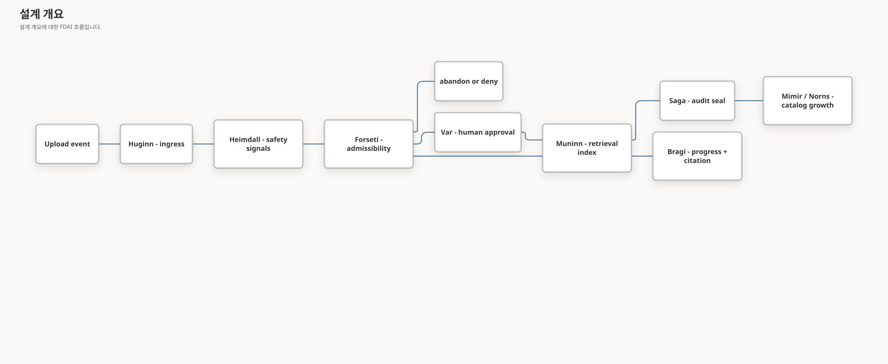

# 문서 인제스트 에이전트 소유권

이 문서는 모든 문서 인제스트 전이를 FDAI 판테온 에이전트에 할당합니다. 게이트웨이를 기계적인
구성 요소로 유지하고 반입, 인덱싱, 감사, 카탈로그 성장을 다른 모든 이벤트와 동일한
에이전트 주도 제어 루프에 포함합니다.

> **범위:** 업로드 게이트웨이는 인증하고 격리 구역으로 스트리밍하며 크기와 해시를 봉인합니다.
> 판단 권한이 없으며 전용 신원에 Thor의 실행 권한을 부여하지 않습니다.

## 설계 개요

업로드는 `Event`입니다. 권한을 포함하는 각 파이프라인 단계는 `fdai.pantheon.objects`에서
다중화된 타입이 지정된 논리 객체를 발행하거나 소비하며, `fdai.pipeline.stages`는 운영
활동만 전달합니다. 워커나 게이트웨이의 부수 효과는 소유 에이전트의 결정을 대체할 수
없습니다.

## 소유권 맵

| 단계 | 소유 에이전트 | 소유 오브젝트 또는 근거 |
|------|--------------|--------------------------|
| Ingress - 업로드를 이벤트로 수용 | **Huginn** (Event Collector) | `Event`; 업로드는 버스가 아닌 외부 어댑터를 통해 도착 |
| 안전 관측 - 악성코드, 시크릿, 보호, RMS 신호 | **Heimdall** (Observer) | 악성, 보호 또는 의심 업로드에 대한 `Anomaly` 또는 `SecurityEvent` |
| 반입 판단 - 반입 허용, 보류 또는 포기 | **Forseti** (Judge) | `Verdict`; RMS 거부나 악성코드는 조용한 게이트웨이 폐기가 아니라 포기 또는 거부 |
| 사람 승인 - 민감하거나 권위 있는 문서 | **Var** (Approver) | `Approval`; 권위 지식 승격 전에 승인하며 자기 승인 금지 |
| 검색 인덱싱 - 조각 및 임베딩 | **Muninn** (Memory) | `ContextIndex`; 승인된 통제된 버전을 검색 가능하게 만듦 |
| 감사 봉인 - 수명 주기 및 접근 결정 | **Saga** (Auditor, 필수 의존성) | `AuditEntry`; 감사 없이 진행하지 않고 기록에 문서 텍스트를 포함하지 않음 |
| 카탈로그 성장 - 권위 문서와 반복 패턴 | **Mimir** 및 **Norns** | `Rule`, `Policy` 또는 `RuleCandidate`; 수동과 런북이 검토된 후보를 시딩 가능 |
| 서술 - 진행과 근거에 기반한 인용 | **Bragi** (Narrator) | `Turn`; 결정하지 않고 진행을 렌더링하며 `doc:` 출처를 인용 |
| 충돌 또는 롤백 - 상충하거나 잘못된 버전 | **Odin** 및 **Vidar** | `ArbitrationDecision` 또는 `Rollback`; 버전을 철회 또는 대체 |

## 승격과 감사 불변 조건

새로 인제스트된 문서는 먼저 참고용 상태입니다. Bragi가 인용할 수 있지만 Forseti가 반입 허용하고,
Var가 민감한 승격을 승인하며, Saga가 감사를 봉인하기 전에는 T2 결정을 구동하지 않습니다. 모든
기능에 적용하는 관찰 모드에서 적용 모드로의 규율과 같습니다.

게이트웨이와 워커는 항상 소유 에이전트의 타입이 지정된 객체로 단계 전이를 표현합니다. 소유 에이전트와
Saga 감사 항목이 없는 전이는 결함입니다. 충돌은 Odin으로 라우팅하며 잘못되거나 대체된된
버전은 Vidar 롤백 경로를 유지합니다.

## Ingress 구현

Ingress 단계를 먼저 배선합니다. 게이트웨이 구성은 영속 activity 싱크를
`PantheonDocumentActivitySink`로 감싸 `document.received` 전이를 Huginn 소유 `object.event`로
pantheon 버스에 승격합니다. `EventBusDocumentIngestionIntake`가 Huginn `producer_principal`을
클레임하고 `document_id`로 파티션하며 정본 `event_type`, `correlation_id`,
`idempotency_key`, `resource_id` 필드를 제공하므로, 이미 `object.event` 구독자인 Forseti와
Heimdall이 실행 가능한 일급 이벤트로 업로드를 수신합니다. Forseti는 액션 타입이 없는
`kind = document_ingestion` 반입 판단 판정을 발행하고 malformed 유입은 보류합니다.
Thor는 이 non-action 판정을 명시적으로 무시하므로 업로드가 `ActionRun`을 만들 수 없습니다.
전달 계층은 Thor의 실행기 신원을 보유하지 않습니다. Saga는 문서 판정을 소비해
감사 체인에 추가하고 내용이 없는 `object.audit-entry`로 다시 발행합니다. 인제스트 워커는
Saga가 감사한 `stage = received`, `decision = admit` 레코드만 소비합니다. 일반 `RECEIVED` 문서는
조정 대상에서 제외되어 Forseti와 Saga 필수 의존성이 모두 완료될 때까지 실패 시 차단
상태로 유지됩니다. 이후 워커는 검사와 protection 점검을 마친 `PROTECTION_CHECK`에서
멈춥니다. Huginn이 내용이 없는 점검 사실을 다시 발행하고, Heimdall이 이를
`object.anomaly`로 정규화하며, Forseti가 protection 판정을 발행하고 Saga가 봉인합니다.
감사된 clear 결정은 Muninn으로 전달되고, Muninn만 추출과 인덱싱을 여는
`object.context-index` 명령을 발행합니다. 차단된 결정은 버전을 `HELD`로 이동합니다.
현재 구현에서는 민감도 레이블이 있거나 `handover_bootstrap`, `manual_distillation`, `cloud_reference` 용도로
제출된 문서는 안전성 검사를 통과해도 사람 승인(`hil`) 판정을 받습니다. `cloud_reference`
패키지의 서명이 유효해도 Var의 독립적인 사람 검토와 승인은 생략할 수 없습니다.
Saga가 이 판정을 봉인하고 Var가 문서 승인 티켓을 만듭니다. 업로더는 자신의 문서를
승인할 수 없습니다. 독립 검토자의 승인은 Muninn이 인덱싱을 시작하기 전에 Saga가 다시
봉인합니다. 거절된 버전은 `HELD`로 이동합니다. Thor는 문서 판정과 승인을 모두 무시합니다.
조정은 고정된 멱등성 키로 `RECEIVED`와 `PROTECTION_CHECK` 이벤트를 재발행하지만
해당 gated 상태를 직접 진행하지 않습니다. `QUARANTINED`, `SCANNING`, `EXTRACTING`, `INDEXING`의
결정 이후 작업만 재개합니다.

클라우드 참고 자료의 롤백은 현재 수동 검토 요청으로 제공됩니다. `Owner` 역할의 사용자는
요건을 충족하는 보존 버전을 더 높은 순번으로 제출할 수 있습니다. 원래 출처 날짜를 유지하며
동일한 독립 승인 및 인덱싱 절차를 거칩니다. 철회되었거나 사용 승인이 취소된 콘텐츠는 대상이
될 수 없습니다. 이 요청이 활성화 실패나 결과 재조회 실패에 대한 Vidar의 자동 복구를
입증하는 것은 아닙니다. 자동 복구와 독립적인 결과 확인은
[클라우드 수명 주기 구현 원장](../../roadmap-implementation/interfaces/cloud-resource-knowledge-lifecycle.md)에
남은 작업으로 기록되어 있습니다.

[구조화 검색 확장](cloud-resource-knowledge-structured-rag-ko.md)도 같은 담당 체계를 유지합니다.
블록, 인용문, 형식 선택이나 서명은 Forseti의 반입 판단, Saga가 감사한 해당 Var 승인 근거
또는 Muninn의 색인 명령을 대신할 수 없습니다.

[요청자 직접 적용 목표](cloud-resource-knowledge-lifecycle-ko.md#요청자-직접-적용-목표)는 사전에
독립적으로 승인된 정책에 포함되는 적격 참조 내용에 한해서만 새 문서별 사람 결정을 없앱니다.
Var는 해당 요청에 대한 기존 사람 승인을 검증하며, 사람의 검토 결과를 만들거나 요청자에게
권한을 부여하지 않습니다. 반입 API는 준비 단계에서 지정한 사람이 아니라 실제 요청이 있을
때 인증된 요청자를 기록합니다. 이 정책 경로는 구현하거나 승격하지 않았습니다. 현재의 문서별
승인과 자기 승인 금지는 계속 적용합니다. 민감한 내용과 판단 기준이 되는 규칙이나 정책으로의
승격은 자체 승인 요건을 유지합니다.

## 지속성 있는 워커 소유권

각 기계적 워커 작업은 수명 주기 상태를 읽거나 변경하기 전에 `(upload_id, stage)`에 대한 별도
PostgreSQL 점유를 획득합니다. 점유는 워커 소유자, 시도 id, 개정 번호, 서버 clock 기준 점유
시각, 제한된 임차 기간 만료, 활성, completed 또는 released 상태를 기록합니다. 이 기록은
`UploadSession`에 워커 권한을 추가하지 않으며 Saga 또는 Muninn 게이트를 대체하지 않습니다.

- **단일 소유자:** 동시 복제본은 한 행에서 경합하므로 만료되지 않은 활성 점유 하나만 해당
  단계를 실행할 수 있습니다.
- **Fencing된 완료:** renew, 완전한, release는 소유자, 시도 id, 예상 개정 번호를 비교합니다.
  오래되거나 중단된 워커는 더 최신 시도를 닫을 수 없습니다.
- **제한된 복구:** 새 시도는 서버 time 기준 임차 기간이 만료된 뒤에만 활성 점유를
  복구할 수 있습니다. 명시적으로 release된 점유는 새 시도와 개정 번호로 즉시 재시도할 수
  있습니다.
- **최종 중복 제거:** completed 점유는 다시 획득할 수 없습니다. 따라서 중복 broker 전달과
  조정은 단계를 반복하는 대신 지속성 있는 최종 결과를 재사용합니다.
- **복구 수렴:** Restart 또는 축소 후 broker 재전달과 상태 조정이 경합할 수
  있지만 수명 주기 효과 전에 둘 다 동일한 단계 점유를 획득해야 합니다.
- **게이트 보존:** received 및 protection 단계 조정은 저장된 사실만 재발행합니다. 점검에는
  여전히 Saga가 감사한 반입이 필요하며, 인덱싱에는 Muninn 소유 명령 또는 이미 시작된
  결정 이후 상태의 복구가 필요합니다.

운영은 업로드 API와 워커를 별도 Container App으로 예약합니다. 이 분리는 프로세스
lifetime, scaling, managed 신원, database 권한 부여만 변경합니다. API는 워커 소비자 그룹을
구독하지 않고 워커는 업로드 유입을 노출하지 않으며, 어느 프로세스도 배포 역할에서
judgment, 승인, 감사, memory 또는 실행기 권한을 얻지 않습니다. Topic-scoped RBAC는
워커가 `fdai.pantheon.objects`의 논리 채널을 통해 Saga와 Muninn 객체를 수신하고 기계적
수명 주기 사실을 보내게 하며, 분리 모드의 API 신원에는 워커 수신 권한을 부여하지
않습니다. 운영 진행 상황은 `fdai.pipeline.stages`에서 별도로 유지합니다.
각 프로세스는 연결된 user-assigned 신원 클라이언트 id도 `FDAI_MI_CLIENT_ID`로 받습니다. Storage,
Event Hubs, 모델, 선택적 OCR 및 stewardship 어댑터는 해당 exact 신원을 선택하며 주변 또는
system-assigned principal로 대체 경로하지 않습니다.

## 구현 상태

### 구현 범위

| 영역 | 상태 | 근거 | 참고 |
|------|------|------|------|
| Huginn, Heimdall, Forseti, Saga, Var 및 Muninn 게이트 체인 | implemented | `services/core-control-plane/tests/agents/test_document_ingestion_agent_chain.py`; `services/core-control-plane/src/fdai/agents/`; document worker 감사 및 인덱스 계약 | Focused agent-chain 테스트는 내용이 없는 ingress, 판정, 감사, 승인 및 인덱스 명령 소유권을 입증하며 Thor는 non-action 문서 결정을 무시합니다. |
| 독립 ingestion API 및 처리 worker | implemented | `services/document-ingestion-api/`; `services/document-processing-worker/`; `packages/service-contracts/src/fdai_service_contracts/document.py` | 별도 패키지, 진입점, 계약, 어댑터 및 focused service 테스트가 기계적 프로세스 역할을 보존합니다. |
| 격리된 native PDF 구문 분석 | implemented | `services/document-processing-worker/src/fdai_document_worker_service/adapters/pdf_isolation.py`; 집중 격리 및 구문 분석기 동등성 검사 | 기계적 worker는 신뢰할 수 없는 native PDF 구문 분석을 리소스 상한이 있는 별도 프로세스에 위임합니다. 구문 분석기 실패는 타입이 지정된 안전하지 않은 패키지 결과를 반환하며 수명 주기 또는 에이전트 권한을 부여하지 않습니다. |
| 영속 worker 점유 fencing 및 복구 | implemented | `services/core-control-plane/src/fdai/core/document_ingestion/`; `services/core-control-plane/tests/core/document_ingestion/`; service-owned worker 테스트 | Focused 테스트는 gated 상태 재생, 임차 기간과 점유 소유권, 중복 전달 및 결정 이후 복구 동작을 다룹니다. |
| 배포 신원, topic RBAC 및 재시작 근거 | in-progress | `config/independent-service-live-evidence-manifest.json`; `infra/`; 독립 service 패키지 | 토폴로지와 연결이 선언되고 service 검사가 있지만 이 owner 문서에는 현재 이미지 신원, topic 권한, 재시작 및 실행기 접근 부재 탐색에 대한 정확한 관리 증적이 없습니다. |
| 정책 기반 요청자 적용 | not-started | [수명 주기 목표](cloud-resource-knowledge-lifecycle-ko.md#요청자-직접-적용-목표) | 같은 고정 담당 체계로 기존 사람 승인을 검증해야 하며 런타임 승인이나 권한 변경은 포함하지 않습니다. |

### 구현 이력

| 날짜 | 상태 | 변경 | 근거 | 남은 작업 |
|------|------|------|------|-----------|
| 2026-08-14 | in-progress | 구현 ledger를 도입했으며 이전 출처 이력은 재구성하지 않았습니다. | `current change`; 구현 범위 표에 나열된 agent-chain, core ingestion, service 패키지 및 계약 근거입니다. | 정확한 배포 신원, 전송, 재시작 및 권한 상한 근거를 보존해야 합니다. |
| 2026-08-27 | implemented | 서버가 소유하는 벽시계, CPU, 주소 공간, 페이지 및 문자 상한을 적용해 native PDF 구문 분석을 장기 실행 문서 worker와 격리했습니다. | `current change`; 문서 worker 격리 및 구문 분석기 동등성 검사입니다. | 배포 신원, 전송, 재시작 및 엔드투엔드 에이전트 근거는 아래 열린 작업으로 유지합니다. |
| 2026-09-15 | not-started | 현재 문서별 승인과 기존 독립 내용 정책에 따른 요청자 적용 목표를 구분했습니다. | `current change`; 이 담당 문서와 연결된 클라우드 수명 주기 설계입니다. 문서만 변경하며 런타임 검사나 승인을 주장하지 않습니다. | 기존 에이전트로 정확한 정책 승인 검증, 철회 시 이전 작업 차단 및 요청자 기록을 구현하고 집중 검증과 독립적인 승격 근거를 보존해야 합니다. |

### 남은 작업

- [ ] 적격 요청자 적용이 Var와 Saga를 통해 사전 독립 정책 권한을 사용하고 자기 부여 또는 철회된 권한을 차단하며, Muninn과 독립적인 저장 재조회 이후에만 공개됨을 입증합니다. [수명 주기 목표](cloud-resource-knowledge-lifecycle-ko.md#요청자-직접-적용-목표)에서 추적합니다.
- [ ] API가 worker group을 소비할 수 없고 worker에는 선언된 수신 및 전송 topic만 있으며 어느 service도 Thor 신원이나 실행기 역할을 얻을 수 없음을 입증하는 정확한 이미지 기반 관리 증적을 보존합니다.
- [ ] Gated 상태가 사실만 재생하고 결정 이후 작업이 하나의 영속 stage 점유로 수렴함을 보여주는 재시작, 중복, 순서 변경, 임차 기간 만료 및 조정 근거를 보존합니다.
- [ ] 내용이 전송 또는 감사 레코드에 복사되지 않은 상태로 Huginn ingress에서 Saga 감사를 거쳐 Var 승인 또는 Muninn 인덱싱까지 이어지는 protected 문서 흐름과 clear 문서 흐름을 각각 하나씩 기록합니다.

## 관련 문서

| 알아볼 내용 | 문서 |
|-------------|------|
| 투입 구역, 저장소, 수명 주기 및 event 계약 | [문서 인제스트](document-ingestion-ko.md) |
| Slack, Teams, web chat, protected fetch 및 이미지 OCR | [대화 첨부 파일](conversation-attachments-ko.md) |
| Pantheon 역할 경계 | [에이전트 Pantheon](../agents/agent-pantheon-ko.md) |
