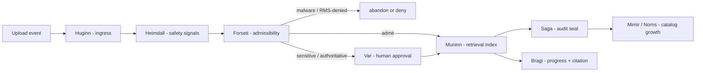

# Document ingestion agent ownership

This document assigns every document-ingestion transition to an FDAI pantheon agent. It keeps the
gateway mechanical and makes admission, indexing, audit, and catalog growth part of the same
agent-driven control loop used for every other event.

> **Scope:** The upload gateway authenticates, streams to quarantine, and seals size and hash. It
> has no judgment authority and its dedicated identity never receives Thor executor permissions.

## Design at a glance

An upload is an `Event`. Each pipeline stage emits or consumes a typed object on
`aw.pipeline.stages`; no worker or gateway side effect can substitute for an owning agent decision.

## Ownership map

| Stage | Owning agent | Owned object or basis |
|-------|--------------|-----------------------|
| Ingress - accept the upload as an event | **Huginn** (Event Collector) | `Event`; the upload arrives through an external adapter, not the bus |
| Safety observation - malware, secret, protection, RMS signals | **Heimdall** (Observer) | `Anomaly` or `SecurityEvent` for a malicious, protected, or suspicious upload |
| Admissibility - admit, hold, or abandon | **Forseti** (Judge) | `Verdict`; RMS denial or malware becomes abandon or deny, not a silent gateway drop |
| Human approval - sensitive or authoritative documents | **Var** (Approver) | `Approval`; approval precedes promotion to authoritative knowledge, with no self-approval |
| Retrieval indexing - chunk and embed | **Muninn** (Memory) | `ContextIndex`; the accepted governed version becomes retrievable |
| Audit seal - lifecycle and access decisions | **Saga** (Auditor, hard dependency) | `AuditEntry`; nothing progresses unaudited and the record contains no document text |
| Catalog growth - authoritative documents and recurring patterns | **Mimir** and **Norns** | `Rule`, `Policy`, or `RuleCandidate`; manuals and runbooks can seed reviewed candidates |
| Narration - progress and grounded citation | **Bragi** (Narrator) | `Turn`; renders progress and cites `doc:` sources without making decisions |
| Conflict or rollback - contradicting or bad versions | **Odin** and **Vidar** | `ArbitrationDecision` or `Rollback`; retract or supersede a version |

## Promotion and audit invariants

A newly ingested document is advisory first. Bragi may cite it, but it does not drive a T2 decision
until Forseti admits it, Var approves any sensitive promotion, and Saga seals the audit. This is the
same observation-to-enforcement discipline used by every capability.

The gateway and worker always express a stage transition as the owning agent's typed object. A
transition without an owning agent and Saga audit entry is a defect. A conflict routes to Odin, and
a bad or superseded version retains a Vidar rollback path.

## Ingress implementation

The ingress step is wired first. The gateway composition wraps the durable activity sink with a
`PantheonDocumentActivitySink` that promotes the `document.received` transition onto the pantheon
bus as Huginn's owned `object.event`. The `EventBusDocumentIngestionIntake` claims the Huginn
`producer_principal`, partitions by `document_id`, and supplies canonical `event_type`,
`correlation_id`, `idempotency_key`, and `resource_id` fields so Forseti and Heimdall (already
`object.event` subscribers) receive an actionable first-class event. Forseti emits a
`kind = document_ingestion` admissibility verdict with no action type; malformed ingress is held.
Thor explicitly ignores this non-action verdict, so an upload can never create an `ActionRun`.
The delivery layer never holds Thor's executor identity. Saga consumes the document verdict,
appends it to the audit chain, and republishes a content-free `object.audit-entry`. The ingestion
worker consumes only Saga's audited `stage = received`, `decision = admit` record. A plain
`RECEIVED` document is excluded from reconciliation and remains fail-closed until both Forseti and
the Saga hard dependency complete. The worker then stops at `PROTECTION_CHECK` after scan and
protection inspection. Huginn republishes the content-free inspection facts, Heimdall normalizes
them as an `object.anomaly`, Forseti emits the protection verdict, and Saga seals it. A clear,
audited decision reaches Muninn, which alone publishes the `object.context-index` command that
unlocks extraction and indexing; a blocked decision moves the version to `HELD`. A clear document
with a sensitivity label, `handover_bootstrap`, or `manual_distillation` purpose receives a `hil`
verdict instead. Saga seals that verdict, Var creates a document approval ticket, and the uploader
cannot approve their own document. Var's reviewer approval is sealed again by Saga before Muninn
can unlock indexing; rejection moves the version to `HELD`. Thor ignores both document verdicts
and approvals. Reconciliation
replays `RECEIVED` and `PROTECTION_CHECK` events with stable idempotency keys but never advances
those gated states. It resumes only post-decision work in `QUARANTINED`, `SCANNING`, `EXTRACTING`,
or `INDEXING`.

## Related docs

| To learn about | Read |
|----------------|------|
| Drop-zone, storage, lifecycle, and event contracts | [Document ingestion](document-ingestion.md) |
| Slack, Teams, web chat, protected fetch, and image OCR | [Conversation attachments](conversation-attachments.md) |
| Pantheon role boundaries | [Agent pantheon](../agents/agent-pantheon.md) |
