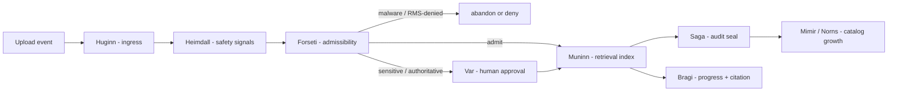

# Document ingestion agent ownership

This document assigns every document-ingestion transition to an FDAI pantheon agent. It keeps the
gateway mechanical and makes admission, indexing, audit, and catalog growth part of the same
agent-driven control loop used for every other event.

> **Scope:** The upload gateway authenticates, streams to quarantine, and seals size and hash. It
> has no judgment authority and its dedicated identity never receives Thor executor permissions.

## Design at a glance

An upload is an `Event`. Each pipeline stage emits or consumes a typed object on
`aw.pipeline.stages`; no worker or gateway side effect can substitute for an owning agent decision.

```mermaid
flowchart LR
  U[Upload event] --> HU[Huginn - ingress]
  HU --> HE[Heimdall - safety signals]
  HE --> FO[Forseti - admissibility]
  FO -->|malware / RMS-denied| X[abandon or deny]
  FO -->|sensitive / authoritative| VA[Var - human approval]
  FO -->|admit| MU[Muninn - retrieval index]
  VA --> MU
  MU --> SA[Saga - audit seal]
  SA --> KM[Mimir / Norns - catalog growth]
  MU --> BR[Bragi - progress + citation]
```

## Ownership map

| Stage | Owning agent | Owned object or basis |
|-------|--------------|-----------------------|
| Ingress - accept the upload as an event | **Huginn** (Event Collector) | `Event`; the upload arrives through an external adapter, not the bus |
| Safety observation - malware, secret, protection, RMS signals | **Heimdall** (Observer) | `Anomaly` or `SecurityEvent` for a malicious, protected, or suspicious upload |
| Admissibility - admit, hold, or abandon | **Forseti** (Judge) | `Verdict`; RMS denial or malware becomes abandon or deny, not a silent gateway drop |
| Human approval - sensitive or authoritative documents | **Var** (Approver) | `Approval`; approval precedes promotion to authoritative knowledge, with no self-approval |
| Retrieval indexing - chunk and embed | **Muninn** (Memory) | `ContextIndex`; the accepted governed version becomes retrievable |
| Audit seal - lifecycle and access decisions | **Saga** (Auditor, hard dependency) | `AuditEntry`; nothing progresses unaudited and the record contains no document text |
| Catalog growth - authoritative documents and recurring patterns | **Mimir** and **Norns** | `Rule`, `Policy`, or `RuleCandidate`; manuals and runbooks can seed reviewed candidates |
| Narration - progress and grounded citation | **Bragi** (Narrator) | `Turn`; renders progress and cites `doc:` sources without making decisions |
| Conflict or rollback - contradicting or bad versions | **Odin** and **Vidar** | `ArbitrationDecision` or `Rollback`; retract or supersede a version |

## Promotion and audit invariants

A newly ingested document is advisory first. Bragi may cite it, but it does not drive a T2 decision
until Forseti admits it, Var approves any sensitive promotion, and Saga seals the audit. This is the
same observation-to-enforcement discipline used by every capability.

The gateway and worker always express a stage transition as the owning agent's typed object. A
transition without an owning agent and Saga audit entry is a defect. A conflict routes to Odin, and
a bad or superseded version retains a Vidar rollback path.

## Ingress implementation

The ingress step is wired first. The gateway composition wraps the durable activity sink with a
`PantheonDocumentActivitySink` that promotes the `document.received` transition onto the pantheon
bus as Huginn's owned `object.event`. The `EventBusDocumentIngestionIntake` claims the Huginn
`producer_principal`, partitions by `document_id`, and supplies canonical `event_type`,
`correlation_id`, `idempotency_key`, and `resource_id` fields so Forseti and Heimdall (already
`object.event` subscribers) receive an actionable first-class event. Forseti emits a
`kind = document_ingestion` admissibility verdict with no action type; malformed ingress is held.
Thor explicitly ignores this non-action verdict, so an upload can never create an `ActionRun`.
The delivery layer never holds Thor's executor identity. Saga consumes the document verdict,
appends it to the audit chain, and republishes a content-free `object.audit-entry`. The ingestion
worker consumes only Saga's audited `stage = received`, `decision = admit` record. A plain
`RECEIVED` document is excluded from reconciliation and remains fail-closed until both Forseti and
the Saga hard dependency complete. The worker then stops at `PROTECTION_CHECK` after scan and
protection inspection. Huginn republishes the content-free inspection facts, Heimdall normalizes
them as an `object.anomaly`, Forseti emits the protection verdict, and Saga seals it. A clear,
audited decision reaches Muninn, which alone publishes the `object.context-index` command that
unlocks extraction and indexing; a blocked decision moves the version to `HELD`. A clear document
with a sensitivity label, `handover_bootstrap`, or `manual_distillation` purpose receives a `hil`
verdict instead. Saga seals that verdict, Var creates a document approval ticket, and the uploader
cannot approve their own document. Var's reviewer approval is sealed again by Saga before Muninn
can unlock indexing; rejection moves the version to `HELD`. Thor ignores both document verdicts
and approvals. Reconciliation
replays `RECEIVED` and `PROTECTION_CHECK` events with stable idempotency keys but never advances
those gated states. It resumes only post-decision work in `QUARANTINED`, `SCANNING`, `EXTRACTING`,
or `INDEXING`.

## Durable worker ownership

Each mechanical worker operation acquires a separate PostgreSQL claim for `(upload_id, stage)`
before it reads or changes lifecycle state. The claim records the worker owner, attempt id,
revision, server-clock claim time, bounded lease expiry, and active, completed, or released status.
It does not add worker authority to `UploadSession` and does not replace the Saga or Muninn gate.

- **Single owner:** Concurrent replicas contend on one row, so only one active unexpired claim can
  run a stage.
- **Fenced completion:** Renew, complete, and release compare the owner, attempt id, and expected
  revision. A stale or crashed worker cannot close a newer attempt.
- **Bounded recovery:** A new attempt can recover an active claim only after its server-time lease
  expires. An explicitly released claim can be retried immediately with a new attempt and revision.
- **Terminal deduplication:** A completed claim cannot be reacquired. Duplicate broker deliveries
  and reconciliation therefore reuse the durable terminal result instead of repeating the stage.
- **Recovery convergence:** Broker redelivery and state reconciliation may race after restart or
  scale-in, but both must acquire the same stage claim before any lifecycle effect.
- **Gate preservation:** Received and protection reconciliation only republishes persisted facts.
  Inspection still requires a Saga-audited admission, and indexing still requires a Muninn-owned
  command or recovery from an already started post-decision state.

Production schedules the upload API and worker as separate Container Apps. This split changes
process lifetime, scaling, managed identity, and database grants only. The API never subscribes to
worker consumer groups, the worker exposes no upload ingress, and neither process gains judgment,
approval, audit, memory, or executor authority from its deployment role. Topic-scoped RBAC lets the
worker receive Saga and Muninn objects from `aw.pantheon.objects` and send stage facts to
`aw.pipeline.stages`; the API identity has no worker receive grant in split mode.
Each process also receives its attached user-assigned identity client id through
`FDAI_MI_CLIENT_ID`. Storage, Event Hubs, model, optional OCR, and stewardship adapters select that
exact identity and do not fall back to an ambient or system-assigned principal.

## Implementation status

### Implementation scope

| Area | State | Evidence | Notes |
|------|-------|----------|-------|
| Huginn, Heimdall, Forseti, Saga, Var, and Muninn gate chain | implemented | `services/core-control-plane/tests/agents/test_document_ingestion_agent_chain.py`; `services/core-control-plane/src/fdai/agents/`; document worker audit and index contracts | Focused agent-chain tests prove content-free ingress, verdict, audit, approval, and index-command ownership while Thor ignores non-action document decisions. |
| Independent ingestion API and processing worker | implemented | `services/document-ingestion-api/`; `services/document-processing-worker/`; `packages/service-contracts/src/fdai_service_contracts/document.py` | Separate packages, entry points, contracts, adapters, and focused service tests preserve mechanical process roles. |
| Durable worker claim fencing and recovery | implemented | `services/core-control-plane/src/fdai/core/document_ingestion/`; `services/core-control-plane/tests/core/document_ingestion/`; service-owned worker tests | Focused tests cover gated-state replay, lease and claim ownership, duplicate delivery, and post-decision recovery behavior. |
| Deployed identity, topic RBAC, and restart evidence | in-progress | `config/independent-service-live-evidence-manifest.json`; `infra/`; independent service packages | The topology and bindings are declared and service checks exist, but this owner document has no exact governed receipt for current image identity, topic grants, restart, and no-executor-access probes. |

### Implementation history

| Date | State | Change | Evidence | Remaining |
|------|-------|--------|----------|-----------|
| 2026-08-14 | in-progress | Adopted the implementation ledger; earlier provenance was not reconstructed. | `current change`; agent-chain, core ingestion, service package, and contract evidence listed in the scope table. | Retain exact deployed identity, transport, restart, and authority-ceiling evidence. |

### Remaining work

- [ ] Retain a governed exact-image receipt proving the API cannot consume worker groups, the worker has only declared receive/send topics, and neither service can obtain Thor's identity or executor roles.
- [ ] Retain restart, duplicate, reorder, lease-expiry, and reconciliation evidence showing that gated states replay facts only and post-decision work converges on one durable stage claim.
- [ ] Record one end-to-end protected and one clear document flow from Huginn ingress through Saga audit and either Var approval or Muninn indexing, with no content copied into transport or audit records.

## Related docs

| To learn about | Read |
|----------------|------|
| Drop-zone, storage, lifecycle, and event contracts | [Document ingestion](document-ingestion.md) |
| Slack, Teams, web chat, protected fetch, and image OCR | [Conversation attachments](conversation-attachments.md) |
| Pantheon role boundaries | [Agent pantheon](../agents/agent-pantheon.md) |
