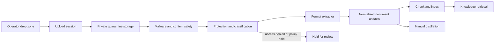

# 문서 인제스트와 Drop Zone

이 문서는 운영자가 FDAI를 통해 문서를 업로드하고, 보호하고, 처리하고, 저장하고,
공유하고, 삭제하는 방법을 정의합니다. 웹 drop zone과 비동기 인제스트 플레인을 함께
다루며, 콘솔에 executor identity를 부여하지 않고 Knowledge Base와 매뉴얼 증류에
문서를 공급합니다.

> **범위:** 업로드된 문서는 고객 데이터이며 downstream fork의 거버넌스 적용 저장소에
> 유지합니다. Upstream은 계약, 안전 기본값, provider seam만 제공합니다. 고객의 원본
> 파일, 추출 텍스트, 썸네일, 임베딩, 레이블 또는 액세스 목록은 제공하지 않습니다.
>
> **안전 경계:** 문서 인제스트는 콘텐츠 쓰기이며 운영 작업이 아닙니다. 전용 ingestion
> identity와 저장 경로를 사용합니다. Executor를 호출하거나, finding을 승인하거나,
> Azure workload를 변경할 수 없습니다.

## 설계 개요

브라우저는 수명이 짧고 단일 업로드로 범위가 제한된 권한을 통해 private object
storage로 직접 업로드합니다. 이후 이벤트 기반 파이프라인이 파일을 검사하고, 분류하고,
보호 상태를 확인하고, 추출하고, 청크로 나누고, 인덱싱합니다. 원본 바이트, 정규화된
콘텐츠, 메타데이터, 벡터에는 서로 다른 저장소와 보존 정책을 적용합니다. 모든 미리 보기,
검색 결과, citation에서 문서 액세스 정책을 다시 적용하므로 제한된 문서가 인제스트로 인해
광범위하게 공개되는 텍스트로 바뀌지 않습니다.



## Drop zone 제품 계약

Drop zone은 문서 인제스트 서비스의 진입점 중 하나입니다. Drag and drop, file picker,
ChatOps attachment, email-in gateway, connector는 모두 동일한 `UploadSession`을 만들고
동일한 파이프라인으로 들어갑니다. 채널 adapter는 검사나 분류를 건너뛸 수 없습니다.

### 운영자가 파일을 선택하기 전

업로드 전에 다음 정보를 표시합니다.

- **대상 collection:** 문서를 소유할 workspace 또는 collection입니다.
- **볼 수 있는 사람:** filename, preview, 추출 콘텐츠, citation을 읽을 수 있는 역할 또는
  그룹입니다. "FDAI access"만으로 문서 권한을 부여하지 않습니다.
- **사용 목적:** Knowledge Base grounding, manual distillation 또는 둘 다입니다.
- **보존:** 승인된 원본 및 derived artifact 보존 정책입니다.
- **지원 형식과 현재 제한:** 형식, 파일별 크기, batch 개수, archive 정책을 하드코딩된
  UI 텍스트가 아닌 서버 capability discovery에서 가져옵니다.
- **보호 콘텐츠 처리:** FDAI가 승인된 읽기 권한을 얻을 수 없으면 rights-managed 또는
  암호화된 콘텐츠를 hold하거나 수락하지 않을 수 있습니다.

확인 문구는 명확하고 collection별로 구체적이어야 합니다.

> 이 업로드는 업로더 개인에게만 공개되는 파일이 아닙니다. FDAI에서 `<collection>`에
> 액세스할 수 있는 사용자는 filename, preview, 추출 텍스트, citation을 볼 수 있습니다.
> 원본 보호와 collection 정책에 따라 대상이 더 좁아질 수 있습니다. 이 대상이 액세스하면
> 안 되는 secret 또는 콘텐츠를 업로드하지 마세요.

운영자는 collection에 처음 업로드하기 전 이 안내에 동의하고, collection, 대상, 사용 목적,
보존 정책이 변경될 때 다시 확인합니다. 동의 기록에는 policy version, collection id,
actor id, timestamp를 저장합니다. Audit record에는 문서 텍스트를 저장하지 않습니다.

### 업로드와 처리 중

업로드 진행률과 처리 진행률을 구분합니다.

1. **Uploading:** 전송된 바이트, pause/resume, retry, cancel을 표시합니다.
2. **Received:** source hash와 byte count가 수락되었습니다.
3. **Safety checks:** malware, archive, secret, personal-data, protection 검사를 수행합니다.
4. **Extracting:** extractor가 제공하는 경우 page, slide, sheet, image, attachment 진행률을
   표시합니다.
5. **Indexing:** chunk와 embedding을 commit하고 있습니다.
6. **Ready, held, failed:** 민감한 preview를 오류 메시지에 포함하지 않고 실행 가능한 이유와
   함께 명확한 결과를 표시합니다.

브라우저를 닫아도 서버 처리는 취소되지 않습니다. 운영자는 upload id를 사용해 document
activity view로 돌아갈 수 있습니다. 취소하면 새 작업을 중단하고 upload grant를 폐기하며
부분 artifact 삭제를 예약합니다.

### 처리 후

준비된 문서에는 다음 정보를 표시합니다.

- source name, format, size, content hash prefix, uploader, upload time
- collection, classification, sensitivity label, protection state, effective audience
- processing use, version, parser name/version, page 또는 item count, warning
- source retention, derived retention, legal-hold state, deletion eligibility
- 권한 없는 reader에게 콘텐츠를 노출하지 않는 citation 및 distilled candidate 링크

문서를 교체하면 새 immutable version을 만듭니다. Evidence를 제자리에서 덮어쓰지 않습니다.
새 버전이 `ready`에 도달한 후에만 active pointer를 이동합니다. 교체가 실패하면 이전 버전을
active 상태로 유지합니다.

## 권한 부여와 공유 가시성

문서에는 자체 access descriptor가 있습니다. 실제 reader 집합은 다음 항목의 교집합입니다.

1. 운영자의 FDAI 역할
2. 선택한 collection의 그룹
3. 사용 가능한 경우 source access control 및 rights-management policy
4. classification 및 sensitivity policy
5. legal hold, incident restriction 또는 다른 policy overlay

콘솔 액세스가 있다고 해서 업로드된 모든 문서에 자동으로 액세스할 수 있는 것은 아닙니다.
반대로 업로드는 개인 파일 보관함이 아닙니다. 선택한 collection이 공유되는 경우, 업로드 전
안내에 명시된 다른 승인된 구성원이 문서를 볼 수 있습니다.

권장 capability는 다음과 같습니다.

| Capability | Default audience |
|------------|------------------|
| Create upload session | collection Contributor 또는 Owner |
| Read metadata | effective collection Reader |
| Preview or download source | effective document reader와 source policy |
| Search extracted chunks | query time에 확인된 effective document reader |
| Change audience or retention | audit가 적용된 collection Owner |
| Delete or replace | policy가 허용하는 uploader 또는 collection Owner |
| Release a held document | uploader 단독이 아닌 지정된 security/data reviewer |

Derived text, thumbnail, summary, embedding, distilled candidate는 source `document_id`, version,
classification, access descriptor를 상속합니다. Retrieval은 ranking 전에 candidate를 필터링하고
콘텐츠 반환 전에 액세스를 다시 검사합니다. 이미 작성된 model answer를 나중에 필터링하는
방식은 너무 늦으므로 지원하지 않습니다.

## Rights-managed, labeled, encrypted 문서

"RMS-protected"는 Microsoft Purview Information Protection과 Azure Rights Management 보호를
포함합니다. 암호화가 없는 sensitivity label, password-encrypted file, 일반적인 storage
encryption과는 다릅니다. 파이프라인은 이 상태를 별도로 기록합니다.

### 계층화된 감지

Filename과 MIME type은 참고 정보일 뿐입니다. 신뢰할 수 있는 감지는 다음을 결합합니다.

- OOXML, PDF 및 기타 지원 형식의 container signature와 encryption record
- 승인된 parser 또는 Microsoft Purview Information Protection adapter가 제공하는
  sensitivity-label metadata
- `access_denied`, `password_required`, `encrypted`, `corrupt` 같은 parser outcome
- ingestion principal 또는 uploader delegated identity를 사용하는 제한된 read probe

Protection을 확인하기 전에는 parse 실패를 단순히 "corrupt"로 보고하지 않습니다. 정규화된
`ProtectionState`는 다음을 구분합니다.

- `none`
- `labeled_unencrypted`
- `rights_managed_accessible`
- `rights_managed_access_denied`
- `password_encrypted`
- `unsupported_protection`
- `unknown`

### FDAI는 보호를 제거하지 않고 준수합니다

FDAI는 password를 해독하거나, label을 제거하거나, rights를 낮추거나, source policy 밖에서
decrypted copy를 재사용하지 않습니다. Rights-managed file의 경우 production fork는 source
policy가 read rights를 부여할 때만 수명이 짧은 delegated on-behalf-of token 또는 승인된
workload identity를 사용할 수 있습니다. Tenant 전체에 적용되는 광범위한 decryption
permission은 기본값으로 적합하지 않습니다.

Policy는 다음 outcome 중 하나를 선택합니다.

| Outcome | Behavior |
|---------|----------|
| Metadata only | Filename, hash, label, state만 유지하고 text 또는 preview를 만들지 않습니다. |
| Ephemeral extraction | 격리된 worker에서 decrypt하고 승인된 derived content를 index한 후 plaintext working file을 폐기합니다. |
| Governed derivative | Policy가 허용할 때만 추출 콘텐츠를 저장하고 source label, ACL, expiry, revocation lineage를 상속합니다. |
| Hold | 암호화된 source를 quarantine에 유지하고 data/security review를 요청합니다. |
| Reject | Failure-retention window 후 quarantine source를 삭제하고 uploader가 승인된 버전을 제공하는 방법을 안내합니다. |

Source rights가 revoke, expire 또는 변경되면 다음 액세스 검사에서 즉시 읽기를 차단합니다.
이후 reconciliation job이 cached preview, chunk, embedding을 제거하거나 다시 보호합니다.
FDAI는 ingestion-time authorization을 영구적으로 신뢰하지 않습니다.

Password-protected document는 기본적으로 hold합니다. Password는 chat, log, metadata, upload
form에서 받지 않습니다. Fork가 password 입력을 지원하려면 별도의 ephemeral secret channel과
문서화된 privacy/security review가 필요합니다.

## 형식 지원

형식 지원은 capability 기반입니다. 서비스는 사용 가능한 extractor와 제한을 게시하고 UI는
그 응답을 렌더링합니다. Fork는 ingestion state machine을 변경하지 않고 extractor를 추가할
수 있습니다.

| Family | Examples | Baseline handling |
|--------|----------|-------------------|
| Plain text and code | TXT, Markdown, RST, JSON, YAML, XML, CSV, Terraform, Rego | 선언되거나 감지된 encoding으로 decode하고 line range를 보존하며 text로 위장한 binary를 수락하지 않습니다. |
| Portable documents | text PDF, scanned PDF, PDF portfolios | Layout-aware text extraction을 사용하고 image page에는 OCR을 적용하며 embedded file을 열거하고 page citation을 보존합니다. |
| Office documents | DOCX, PPTX, XLSX, ODT, ODP, ODS | 지원되는 범위에서 heading, table, slide, speaker note, sheet, cell, object relationship을 보존하며 macro를 실행하지 않습니다. |
| Images | PNG, JPEG, TIFF, WebP, HEIC | OCR과 image metadata를 사용하고 diagram에는 선택적으로 승인된 vision extraction을 적용합니다. |
| Email and messages | EML, MSG, MBOX exports | Header/body/attachment를 parse하고 모든 attachment를 inherited access가 적용된 child document로 처리합니다. |
| Web and wiki export | HTML, MHTML, Confluence/Notion export packages | Active content를 sanitize하고 link를 text로 유지하며 page hierarchy를 보존합니다. |
| Archives | ZIP, TAR, GZIP | 기본적으로 비활성화하거나 엄격한 depth, count, ratio, byte budget 안에서 확장합니다. 각 member는 child document가 됩니다. |
| Legacy or proprietary binary | DOC, XLS, PPT, vendor formats | Fork가 승인한 경우 격리된 converter를 사용하고, 그렇지 않으면 `unsupported_format`을 반환합니다. |
| Audio and video | MP3, WAV, MP4, meeting recordings | Locale, consent, retention policy가 적용된 선택적 transcription adapter를 사용합니다. Day-zero baseline에는 포함하지 않습니다. |

Library가 일부 text를 반환할 수 있다는 이유만으로 format을 "supported"로 간주하지 않습니다.
Extractor conformance test는 structure, citation, table, protection outcome, malformed input,
resource budget을 다룹니다. Lossy extraction은 warning으로 표시하며 metadata-only storage는
허용하면서 manual distillation은 차단할 수 있습니다.

## 대용량 문서와 batch 설계

대용량 파일은 console server를 통과하지 않으며 worker memory 전체에 올리지 않습니다.
Private block/object storage, resumable transfer, streaming hash, bounded worker를 사용합니다.

### 업로드 경로

1. Console이 ingestion gateway에 수명이 짧은 upload session을 요청합니다.
2. Gateway가 collection과 policy를 authorize하고 quota를 예약한 후 하나의 object와 expiry로
   범위가 제한된 write-only grant를 반환합니다. Grant는 log 또는 audit에 기록하지 않습니다.
3. Browser가 bounded parallelism과 retry를 사용해 block을 private storage로 직접 업로드합니다.
4. Browser 또는 gateway가 block list를 commit하고 byte count와 streaming SHA-256을 제출합니다.
5. Gateway가 object property를 확인하고 session을 닫은 후 `document.received`를 publish합니다.

브라우저 저장소에는 upload id와 completed block id만 유지하여 브라우저를 다시 시작해도
pause/resume을 지원합니다. Storage grant는 예약된 object만 commit할 수 있습니다. 다른 문서를
list, read, overwrite하거나 자체 expiry를 연장할 수 없습니다.

### 처리 경로

- **Streaming first:** scanner와 extractor는 range 또는 stream을 소비합니다. Whole-file read를
  피하고 엄격한 quota가 적용된 encrypted scratch storage에 intermediate data를 기록합니다.
- **자연스러운 경계로 shard:** page, slide, sheet, archive member, media time range를 독립적인
  work item으로 만듭니다. Manifest가 순서와 parent-child relationship을 보존합니다.
- **Bounded parallelism:** document별, collection별, global concurrency limit으로 하나의 upload가
  event processing 또는 다른 tenant를 고갈시키지 않도록 합니다.
- **Fast and slow lanes:** native text와 text PDF는 fast lane을 사용합니다. OCR, archive, media,
  protected file은 별도로 metering되는 worker pool을 사용합니다.
- **Checkpointing:** 완료된 shard는 안전하게 retry할 수 있고 worker restart 후 반복하지 않습니다.
- **Partial outcome:** 승인된 page가 성공하고 실패한 item이 식별되면 document를
  `ready_with_warnings`로 만들 수 있습니다. Manual distillation에는 더 엄격한
  all-required-items gate를 적용할 수 있습니다.

File size, expanded bytes, page count, archive depth, member count, OCR pixels, media duration,
processing time, extracted-character count에는 각각 독립적인 configurable budget을 적용합니다.
예약된 storage와 processing budget에 맞을 때만 대용량 source를 수락합니다. 압축 파일의 작은
upload size로 expanded-content limit을 우회할 수 없습니다.

Upstream에는 하나의 hard-coded maximum을 두지 않습니다. Fork는 storage quota, extractor
capability, worker memory, cost policy, 측정된 throughput을 기반으로 limit을 게시합니다. 기존
lightweight loader는 작은 local text file에 적합합니다. Production large-file ingestion은 이
streaming path를 사용합니다.

## 성능과 용량

사용자가 체감하는 목표는 동기식 완료가 아니라 즉시 수락과 관찰 가능한 진행 상황입니다.
각 production fork는 측정된 baseline을 수립하고 다음 항목에 대한 p50/p95 목표를 설정합니다.

- upload-session creation 및 commit acknowledgement
- size band와 network condition별 transfer throughput
- fast/slow lane별 queue delay
- page 또는 MB당 scan, protection check, extraction, indexing duration
- time to first searchable chunk 및 time to fully ready
- retry, hold, failure, cancellation rate
- storage growth, deduplication savings, processed unit당 cost

Architecture는 direct-to-storage upload, 동일 security scope 안의 content-hash deduplication,
incremental version processing, page-level parallelism, batched embedding, autoscaling event-driven
worker로 latency를 줄입니다. Cross-collection 또는 cross-tenant deduplication은 제한된 문서의
존재를 노출할 수 있으므로 지원하지 않습니다.

빠른 UI가 느린 safety work를 숨기면 안 됩니다. "Uploaded"는 byte가 도착했다는 뜻입니다.
문서가 retrieval 또는 distillation에 참여할 수 있는 상태는 `ready`뿐입니다.

## 저장소 모델

각 계층에 자체 access 및 retention policy를 적용할 수 있도록 목적별로 콘텐츠를 분리합니다.

| Store | Contents | Recommended Azure implementation |
|-------|----------|----------------------------------|
| Quarantine source | 신뢰되지 않은 uploaded bytes와 upload manifest | public access가 없고 짧은 lifecycle retention을 적용한 private ADLS Gen2 HNS `documents/quarantine/` |
| Governed source | managed-copy mode를 선택했을 때 수락된 immutable source version | quarantine에서 atomic rename하는 private ADLS Gen2 HNS `documents/governed/{collection_hash}/{document_id}/{version_id}/` |
| Derived artifacts | normalized JSON/JSONL, page text, thumbnail, OCR output, extraction manifest | source와 ACL로 연결되고 암호화된 별도 private ADLS Gen2 HNS `derived` filesystem |
| Metadata and status | document/version record, state transition, policy, effective access reference | PostgreSQL |
| Search index | chunk, embedding, source/version/access reference | PostgreSQL with pgvector |
| Audit | actor, state transition, policy decision, hash와 reference, document body 제외 | append-only audit ledger |
| Worker scratch | 임시 decrypted 또는 expanded content | 격리된 encrypted ephemeral volume, completion/failure 시 삭제 |

Object name에는 user filename 대신 opaque id를 사용합니다. Collection directory에는 collection
label 대신 non-reversible hash segment를 사용합니다. Original filename은 동일한 access policy로
보호되는 metadata입니다. Azure 구현은 hierarchical namespace(HNS), Shared Key
비활성화, TLS 1.2, soft delete, lifecycle policy, `blob`과 `dfs` private endpoint를 적용한 전용
StorageV2 account를 사용합니다. HNS account에는 Blob versioning을 사용할 수 없으므로 source
version을 overwrite하지 않고 모든 `version_id`에 새로운 opaque path를 할당합니다. 선택적
immutable retention과 legal hold는 collection policy로 유지합니다. Customer-managed key는
upstream에 하드코딩하는 값이 아니라 fork policy 선택입니다.

Public console은 인증된 ingestion gateway로 byte를 전송합니다. Gateway는 선언된 size를
검증하고 request 전체를 memory에 buffer하지 않은 채 private ADLS로 stream하며 SHA-256과 size
metadata를 봉인한 후 shared `aw.pipeline.stages` topic에 `document.received`를 publish합니다. Durable Kafka
consumer group이 worker를 at-least-once로 실행하며 commit되지 않은 failure는 restart 후
retry합니다. ClamAV는 replica-local sidecar로 실행되고 clean 문서만 extraction, pgvector
indexing, quarantine-to-governed atomic rename에 도달합니다.

### 지연된 non-Azure storage 권장 사항

Azure만 구현 대상입니다. 다음 항목은 future phase를 위한 문서상 권장 사항이며 이 roadmap에서
AWS 또는 GCP adapter 구현을 허용하지 않습니다.

| Future target | Recommended storage | FDAI contract mapping |
|---------------|---------------------|-----------------------|
| AWS (TBD) | Block Public Access, bucket owner enforced, SSE-KMS, policy에 따른 versioning/Object Lock, lifecycle rule, gateway VPC endpoint, IAM role credential을 적용한 Amazon S3 | `DocumentObjectStore`가 opaque key를 S3 object에 mapping하며 accepted version은 immutable prefix와 multipart upload를 사용합니다. |
| GCP (TBD) | Uniform bucket-level access, public access prevention, policy에 따른 CMEK와 Object Versioning/retention policy, lifecycle rule, Private Google Access/PSC, Workload Identity Federation을 적용한 Cloud Storage | `DocumentObjectStore`가 opaque key를 Cloud Storage object에 mapping하며 accepted version은 immutable prefix와 resumable upload를 사용합니다. |

두 future mapping은 기존 provider seam 뒤에서 PostgreSQL metadata와 vector-index adapter를
유지합니다. Azure 구현에는 AWS/GCP SDK, Terraform module, runtime branch 또는 deployment
commitment가 포함되지 않습니다.

### Source 저장 모드

Collection은 source별로 다음 모드 중 하나를 선택합니다.

- **Managed copy:** FDAI가 immutable source version을 유지하고 lifecycle enforcement를
  담당합니다. Direct upload와 안정적인 evidence에 적합합니다.
- **Linked source:** FDAI가 connector reference, version token, ACL snapshot, derived index를
  저장합니다. 읽기 및 주기적 reconciliation에는 source system의 현재 authorization을
  사용합니다. SharePoint, Confluence, Notion에 적합합니다.
- **Ephemeral processing:** 승인된 extraction 후 raw source를 유지하지 않습니다. Derived
  artifact에는 명시적인 더 짧은 policy와 source hash/provenance를 적용합니다. Raw retention이
  허용되지 않을 때 적합하지만 reprocessing 및 evidence option이 줄어듭니다.
- **Metadata only:** Raw 또는 extracted content 없이 identity, protection/classification, hash,
  status만 저장합니다.

업로드 전에 모드를 표시합니다. 모드 변경은 governed operation이며 기존 version을 조용히
migration하지 않습니다.

### Canonical document representation

모든 extractor는 pgvector에 직접 기록하지 않고 versioned `DocumentEnvelope`를 생성합니다.

- stable `document_id`와 immutable `version_id`
- source hash, media type, observed format, size, parent/child link
- uploader/source identity, collection, purpose, provenance
- classification, sensitivity label, `ProtectionState`, access descriptor reference
- page/slide/sheet/cell/time-range locator가 있는 ordered structural unit
- inline binary object가 아닌 extracted text와 asset reference
- extractor name/version, warning, loss indicator, processing metric
- retention, legal hold, deletion lineage, superseded-version reference

Knowledge indexing과 manual distillation은 이 envelope를 소비합니다. Raw upload를 각각 별도로
parse하지 않으므로 protection, citation, deletion behavior를 일관되게 유지할 수 있습니다.

일반 document index는 각 structural unit을 독립적으로 분할합니다. 기본값은 chunk당 `1200`자와
`150`자 overlap이며 paragraph, line, sentence, word boundary 순서로 경계를 우선합니다. 모든
chunk는 unit locator, source hash, collection, access descriptor, purpose, immutable
document/version identity를 유지합니다. 안정적인 version 범위 chunk id로 retry를 idempotent하게
처리합니다.

로컬 gateway는 end-to-end 개발을 위해 deterministic in-memory embedding index를 사용합니다.
pgvector adapter는 database transaction을 열기 전에 모든 embedding을 계산하고, 하나의 document
version을 원자적으로 교체하며 document/version identity로 삭제합니다. Retrieval에는 collection과
명시적으로 허용된 access descriptor reference 집합이 모두 필요합니다. Governed chunk에는 marker를
추가하며 범위가 지정되지 않은 free-form Knowledge Source query path에서는 제외합니다.

## 보안과 content-safety pipeline

인증된 uploader가 제공해도 uploaded byte는 신뢰하지 않습니다. 콘텐츠를 읽거나 model에
전달하기 전에 다음 단계를 적용합니다.

1. **Object validation:** 실제 file signature, media type, length, hash, upload-session match를
   확인합니다.
2. **Archive defense:** expanded-byte, nesting, member-count, path traversal, symlink,
   compression-ratio limit을 적용합니다.
3. **Malware scan:** 승인된 antimalware service를 사용합니다. 감염된 콘텐츠는 사용할 수 없는
   상태로 유지하고 구성된 evidence/deletion policy를 따릅니다.
4. **Active-content neutralization:** macro, script, external relationship, formula, remote fetch를
   실행하지 않습니다. HTML과 preview를 sanitize합니다.
5. **Protection and label check:** extraction 전에 RMS/Purview, PDF encryption, password
   encryption, unknown protection을 분류합니다.
6. **Secret and personal-data scan:** Finding은 policy hold, redaction 또는 rejection으로
   route합니다. Raw value는 audit 또는 operator-visible error에 포함하지 않습니다.
7. **Prompt-injection marking:** 추출된 instruction은 untrusted knowledge입니다. Retrieval은
   이를 evidence로 감싸며 document text가 system instruction 또는 tool authority를 다시
   정의하도록 허용하지 않습니다.
8. **Parser sandbox:** Converter는 executor identity 없이, 일반 outbound network 없이,
   read-only source access, CPU/memory/time limit, ephemeral writable volume으로 실행합니다.

Held 또는 failed source는 특별히 승인된 review workflow를 제외하면 검색, preview, download,
model 전송을 할 수 없습니다. Uploader가 malware, rights, sensitivity hold를 스스로 해제할 수
없습니다.

## Lifecycle, retention, deletion

Version state machine은 명시적이며 audit에 append-only로 기록합니다.

```text
created -> uploading -> received -> quarantined -> scanning -> protection_check
        -> extracting -> indexing -> ready | ready_with_warnings
        -> held | failed
ready | ready_with_warnings | held | failed -> deleting -> deleted
```

Retry는 동일한 idempotency key 아래 state-transition attempt를 만듭니다. Source byte가 다르지
않으면 두 번째 version을 만들지 않습니다.

Deletion은 lineage를 인식합니다.

1. 삭제 권한과 legal hold를 확인합니다.
2. Preview, search, retrieval, distillation에서 version을 사용할 수 없게 합니다.
3. Chunk와 embedding을 삭제하거나 tombstone 처리합니다.
4. Normalized artifact와 cached preview를 삭제합니다.
5. Policy가 허용하면 managed source를 삭제합니다.
6. Replica, index, 승인된 model/vector cache로 삭제를 전파합니다.
7. Content를 유지하지 않고 completion evidence를 기록합니다.

Backup expiry, immutable retention, legal hold로 인해 physical deletion이 지연될 수 있습니다.
UI는 즉시 삭제되었다고 주장하지 않고 `deletion_pending`과 governing reason을 표시합니다.
Linked-source removal과 ACL change event에도 동일한 reconciliation 및 lineage path를 사용합니다.

## API와 event 계약

Document ingestion은 read API 또는 executor process가 아닌 전용 ingestion gateway가
제공합니다. 초기 HTTP surface는 다음과 같습니다.

로컬 콘솔 개발에서는 보호된 in-memory gateway를 별도 포트에서 실행할 수 있습니다.

```bash
FDAI_INGESTION_GATEWAY_DEV_MODE=1 \
  uv run uvicorn fdai.delivery.ingestion_gateway.dev:app \
  --factory --host 127.0.0.1 --port 8011
```

`VITE_INGESTION_API_BASE_URL`을 `http://127.0.0.1:8011`로 설정하세요. 로컬 factory는
명시적 dev-mode 변수가 없으면 시작되지 않으며 production composition이 아닙니다. 기본적으로
`127.0.0.1`과 `localhost`의 로컬 콘솔 포트 `4173`, `5173`, `5180`, `5190`을 허용합니다.
다른 포트를 사용하려면 gateway process의 `FDAI_INGESTION_GATEWAY_CORS_ALLOW_ORIGINS`를
쉼표로 구분한 정확한 HTTP(S) origin 목록으로 설정하세요.

| Method and path | Purpose |
|-----------------|---------|
| `GET /ingestion/capabilities` | format, size/batch/archive limit, storage mode, policy version |
| `POST /ingestion/uploads` | destination을 authorize하고 `UploadSession` 생성 |
| `POST /ingestion/uploads/{upload_id}/complete` | 수신한 object를 verify하고 commit |
| `GET /ingestion/uploads/{upload_id}` | resumable transfer와 processing status |
| `GET /ingestion/uploads/{upload_id}/handover-draft` | `handover_bootstrap` purpose의 권한 적용 grounded steward-map draft |
| `POST /ingestion/uploads/{upload_id}/cancel` | grant를 revoke하고 partial data 정리 |
| `GET /documents/search?q=...&collection_id=...` | 인증과 collection scope가 적용된 citation 포함 semantic retrieval |
| `GET /documents/{document_id}/versions` | 권한이 적용된 metadata와 state history |
| `DELETE /documents/{document_id}/versions/{version_id}` | governed deletion 요청 |

Source byte는 client와 object storage 사이에서 직접 이동합니다. Authentication token과 storage
grant는 log에 남을 수 있는 query string으로 받지 않습니다.

Artifact write, index commit, purpose별 consumer delivery에는 각각 bounded deadline을 적용합니다.
`FDAI_DOCUMENT_INDEXING_STAGE_TIMEOUT_SECONDS`를 양의 초 단위 값으로 설정하세요. Azure 배포의
기본값은 90입니다. Timeout이 발생하면 `indexing_failed`를 기록하고 수락된 source를 quarantine에
유지하며 partial derived/index data를 제거합니다. Structured stage log에는 upload id와 stage
name만 기록하고 document content나 provider error text는 기록하지 않습니다.

State transition은 `document.received`, `document.held`, `document.ready`,
`document.superseded`, `document.access_changed`, `document.deleted` 같은 typed event를
publish합니다. Consumer는 idempotent하게 동작합니다. Knowledge indexing과 manual distillation은
version의 선언된 purpose에 자신이 포함된 경우에만 `document.ready`를 subscribe합니다.
Purpose별 processing은 `DocumentReadyConsumer`를 bind할 수도 있습니다. Worker는 safety check를
통과한 `DocumentEnvelope`만 전달합니다. 제공되는 `handover_bootstrap` consumer는 이 envelope를
근거가 있고 검토 전용인 steward-map draft로 변환합니다.

## 실패 동작

| Failure | Safe behavior |
|---------|---------------|
| Browser 또는 network disconnect | Commit된 block부터 resume하고 abandoned session을 expire한 후 partial object를 삭제합니다. |
| Storage commit mismatch | Object를 hold하고 completion을 수락하지 않으며 content 없이 expected/observed metadata를 audit합니다. |
| Scanner unavailable | Quarantine에 유지하고 retry하며 scanning을 건너뛰지 않습니다. |
| RMS access denied | Policy에 따라 metadata-only로 기록하거나 hold하며 protection을 제거하지 않습니다. |
| Parser crash 또는 timeout | Budget 안에서 새 sandbox로 retry한 후 fail하거나 승인된 partial output을 반환합니다. |
| Artifact/index/embedding timeout | 수락된 source를 quarantine에 유지하고 partial derived/index data를 제거하며 `indexing_failed`와 bounded stage diagnostic을 기록합니다. |
| ACL source unavailable | Authorization을 다시 확인할 때까지 read와 retrieval을 fail closed합니다. |
| Index deletion failure | Document를 unavailable 상태로 유지하고 deletion을 retry하며 `deletion_pending`을 보고합니다. |
| Queue overload | Admission control과 collection별 fairness를 적용하고 operational event processing에 우선순위를 둡니다. |

## Observability와 audit

Metric에는 bytes, pages, queue delay, stage latency, extractor outcome, protection state, hold
category, retry count, index count, deletion lag, class별 storage를 포함합니다. Label은 bounded
enum을 사용합니다. Filename, document text, source URL, customer identifier는 포함하지 않습니다.

Audit entry에는 actor, collection, document/version id, source hash, action, state transition,
policy version, classification decision, effective-access descriptor reference, processing purpose,
extractor version, outcome을 기록합니다. Security review access와 모든 source download를 audit합니다.

Operational alert는 quarantine backlog, scanner degradation, 반복적인 parser sandbox failure,
rights-reconciliation lag, orphaned partial upload, indexing lag, deletion lag, storage quota를
다룹니다.

## 구현 경계와 rollout

Upstream 구현은 이제 contract, fail-closed lifecycle, 전용 ASGI gateway, console drop zone,
streaming browser hash, local direct-upload adapter, 안전한 text/OOXML extractor, protection
signature detection, structure-aware chunking, ADLS Gen2 source/artifact store, PostgreSQL
metadata, governed pgvector index, Azure OpenAI embedding, Event Hubs Kafka processing, ClamAV
scanning, test adapter, deletion lineage를 제공합니다. Production fork는 Purview/RMS, OCR,
rich format이 필요할 때 dependency injection으로 provider를 교체할 수 있습니다.

| Slice | Upstream 상태 |
|-------|---------------|
| Contract and metadata | 제공됨: `DocumentEnvelope`, state machine, capability discovery, access provider, metadata/activity seam, console visibility notice |
| Safe text | 일반 구현 제공됨: direct-upload gateway, quarantine lifecycle, fail-closed scanner seam, UTF-8/OOXML extraction, structure-aware overlapping chunk, local embedding retrieval, 원자적 pgvector version 교체/삭제, access-filtered search, deletion. Upstream scanner는 production provider를 bind할 때까지 abstain합니다. |
| Layout | 일부 제공됨: OOXML structure와 PDF/protection detection을 제공합니다. Layout-aware PDF extraction, OCR, preview에는 승인된 provider가 필요합니다. |
| Protection | 일부 제공됨: PDF/Office/container encryption과 의심스러운 rights metadata를 감지하고 hold합니다. Purview/RMS adapter, delegated authorization, revocation reconciliation은 fork binding으로 남습니다. |
| Connector and scale | Contract 준비됨: resumable/scoped upload session, streaming hash, bounded parser budget, provider seam을 제공합니다. Azure Blob, durable metadata, connector delta sync, 측정된 capacity target은 배포 작업으로 남습니다. |

Rollout 순서는 다음과 같습니다.

1. **Contract and metadata slice:** `DocumentEnvelope`, state machine, capability discovery, access
   descriptor, audit, metadata-only UI
2. **Safe text slice:** direct block upload, quarantine, malware/secret scan, plain-text extractor,
   managed-copy storage, deletion lineage, Knowledge Base indexing
3. **Layout slice:** PDF와 modern Office extractor, page citation, OCR slow lane, preview,
   extraction conformance test
4. **Protection slice:** Purview/RMS adapter, delegated authorization, label/ACL inheritance,
   revocation reconciliation, governed derivative
5. **Connector and scale slice:** linked-source mode, delta sync, large-batch admission control,
   측정된 capacity target, manual-distillation consumption

각 slice는 model execution 없이 시작하며 승인된 metadata 외에는 document visibility를
제공하지 않습니다. Access filtering, deletion propagation, adversarial-file test가 shadow에서
통과한 후에만 retrieval과 distillation을 활성화합니다.

## 결정과 미해결 질문

이 설계에서 확정하는 결정은 다음과 같습니다.

- Browser는 scoped session을 통해 private object storage로 직접 업로드합니다.
- Console은 executor identity를 받지 않습니다.
- Source, derived artifact, metadata, vector, audit, scratch에는 별도 storage class를 사용합니다.
- Retrieval 전에 access를 적용하고 모든 derivative가 access를 상속합니다.
- Rights management를 제거하지 않고 보존합니다.
- Large-document processing은 streaming, sharded, resumable, budgeted 방식입니다.
- Upload completion과 processing readiness는 서로 다른 상태입니다.
- Upstream의 고정 size limit 또는 retention period를 UI code에 포함하지 않습니다.

승인된 evidence가 필요한 fork 결정은 다음과 같습니다.

- Collection audience, classification mapping, residency, retention, backup, legal hold
- 지원할 extractor/converter와 license
- Malware, OCR, Purview/RMS, embedding, transcription provider
- Protected content에 ephemeral extraction 또는 governed derivative를 허용할지 여부
- Format별 resource budget, service target, quota, cost limit
- Archive, legacy format, audio/video, source download 활성화 여부

## 다음 단계

| 알아볼 내용 | 참고 자료 |
|-------------|-----------|
| 매뉴얼을 결정론적 artifact로 컴파일 | [매뉴얼 증류](../rules-and-detection/manual-distillation-ko.md) |
| Root-cause analysis의 knowledge evidence | [관찰 가능성과 탐지](../rules-and-detection/observability-and-detection-ko.md) |
| Data classification, retention, privacy evidence | [Data Governance and Privacy Evidence](../architecture/data-governance-ko.md) |
| Human role과 Entra authorization | [User RBAC and Entra Identity](user-rbac-and-identity-ko.md) |
| Console authority boundary | [Operator Console](operator-console-ko.md) |
| Storage와 security threat model | [Security and Identity](../architecture/security-and-identity-ko.md) |
