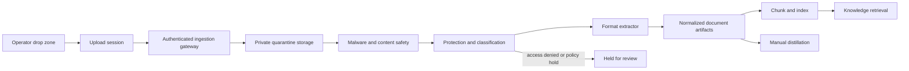

# 문서 인제스트와 투입 구역

이 문서는 운영자가 FDAI를 통해 문서를 업로드하고, 보호하고, 처리하고, 저장하고,
공유하고, 삭제하는 방법을 정의합니다. 웹 투입 구역과 비동기 인제스트 플레인을 함께
다루며, 콘솔에 실행기 신원을 부여하지 않고 Knowledge Base와 매뉴얼 증류에
문서를 공급합니다.

> **범위:** 업로드된 문서는 고객 데이터이며 downstream 포크의 거버넌스 적용 저장소에
> 유지합니다. Upstream은 계약, 안전 기본값, 프로바이더 경계만 제공합니다. 고객의 원본
> 파일, 추출 텍스트, 썸네일, 임베딩, 레이블 또는 액세스 목록은 제공하지 않습니다.
>
> **안전 경계:** 문서 인제스트는 콘텐츠 쓰기이며 운영 작업이 아닙니다. 전용 인제스트
> 신원과 저장 경로를 사용합니다. 실행기를 호출하거나, 발견 사항을 승인하거나,
> Azure 워크로드를 변경할 수 없습니다.

## 설계 개요

운영 브라우저는 전용 인제스트 게이트웨이에 인증된 범위가 제한된 스트리밍 PUT을 보내고 게이트웨이가
전용 managed 신원으로 비공개 객체 저장소에 기록합니다. 브라우저에 저장소 자격 증명이나
실행기 신원을 주지 않습니다. 이후 이벤트 기반 파이프라인이 파일을 검사하고, 분류하고,
보호 상태를 확인하고, 추출하고, 청크로 나누고, 인덱싱합니다. 원본 바이트, 정규화된
콘텐츠, 메타데이터, 벡터에는 서로 다른 저장소와 보존 정책을 적용합니다. 모든 미리 보기,
검색 결과, 인용에서 문서 액세스 정책을 다시 적용하므로 제한된 문서가 인제스트로 인해
광범위하게 공개되는 텍스트로 바뀌지 않습니다.


```mermaid
flowchart LR
 U[Operator drop zone] --> S[Upload session]
 S --> G[Authenticated ingestion gateway]
 G --> Q[Private quarantine storage]
 Q --> M[Malware and content safety]
 M --> P[Protection and classification]
 P --> X[Format extractor]
 X --> N[Normalized document artifacts]
 N --> K[Chunk and index]
 K --> R[Knowledge retrieval]
 N --> D[Manual distillation]
 P -->|access denied or policy hold| H[Held for review]
```

## 인제스트 파이프라인의 에이전트 소유

문서 인제스트는 독립적인 결정 서비스를 만들지 않고 에이전트 주도 제어 루프를 재사용합니다.
단계별 에이전트 맵, 타입이 지정된 객체, 승격 규율 및 필수 Saga 감사 경계는 [문서 인제스트 에이전트 소유권](document-ingestion-agent-ownership-ko.md)을 참조하세요.

## 투입 구역 제품 계약

투입 구역, ChatOps 첨부, 이메일 유입 및 connector는 동일한 `UploadSession`을 만들고
동일한 검사 및 분류 파이프라인으로 들어갑니다. Slack, Teams, web chat, 용도, 최종 waiting 및 OCR 계약은 [대화 첨부 파일](conversation-attachments-ko.md)을 참조하세요.

채널 어댑터는 검사이나 분류를 건너뛸 수 없습니다. 첨부 내용을 운영자 메시지 또는 도구 인자에 추가하지 않으며 최종 통제된 버전만 `doc:` 출처가 됩니다.

### 운영자가 파일을 선택하기 전

업로드 전에 다음 정보를 표시합니다.

- **대상 collection:** 문서를 소유할 workspace 또는 collection입니다.
- **볼 수 있는 사람:** 파일 이름, 미리 보기, 추출 콘텐츠, 인용을 읽을 수 있는 역할 또는
 그룹입니다. "FDAI 접근"만으로 문서 권한을 부여하지 않습니다.
- **사용 목적:** Knowledge Base grounding, 수동 정제 또는 둘 다입니다.
- **보존:** 승인된 원본 및 derived 산출물 보존 정책입니다.
- **지원 형식과 현재 제한:** 형식, 파일별 크기, 배치 개수, 보관 정책을 하드코딩된
 UI 텍스트가 아닌 서버 기능 발견에서 가져옵니다.
- **보호 콘텐츠 처리:** FDAI가 승인된 읽기 권한을 얻을 수 없으면 rights-managed 또는
 암호화된 콘텐츠를 보류하거나 수락하지 않을 수 있습니다.

확인 문구는 명확하고 collection별로 구체적이어야 합니다.

> 이 업로드는 업로더 개인에게만 공개되는 파일이 아닙니다. FDAI에서 `<collection>`에
> 액세스할 수 있는 사용자는 파일 이름, 미리 보기, 추출 텍스트, 인용을 볼 수 있습니다.
> 원본 보호와 collection 정책에 따라 대상이 더 좁아질 수 있습니다. 이 대상이 액세스하면
> 안 되는 시크릿 또는 콘텐츠를 업로드하지 마세요.

운영자는 collection에 처음 업로드하기 전 이 안내에 동의하고, collection, 대상, 사용 목적,
보존 정책이 변경될 때 다시 확인합니다. 동의 기록에는 정책 버전, collection id,
행위자 id, 시각을 저장합니다. 감사 기록에는 문서 텍스트를 저장하지 않습니다.

### 업로드와 처리 중

업로드 진행률과 처리 진행률을 구분합니다.

1. **Uploading:** 현재 UI는 hashing/uploading 상태와 취소를 표시하고 파일 하나를 한 번의 범위가 제한된
 PUT으로 전송합니다. 바이트 진행 상황, pause/재개, 블록 체크포인트는 future 프로바이더 기능입니다.
2. **Received:** 출처 해시와 바이트 개수가 수락되었습니다.
3. **안전성 checks:** malware, 보관, 시크릿, personal-data, protection 검사를 수행합니다.
4. **Extracting:** 추출기가 제공하는 경우 페이지, slide, sheet, 이미지, 첨부 진행률을
  표시합니다.
5. **인덱싱:** 조각과 임베딩을 커밋하고 있습니다.
6. **준비된, held, 실패한:** 민감한 미리 보기를 오류 메시지에 포함하지 않고 실행 가능한 이유와
  함께 명확한 결과를 표시합니다.

`complete` 이후 브라우저를 닫아도 서버 처리는 취소되지 않습니다. 현재 Console은 열린 화면에서
상태를 polling하며 영속 활동/이력은 업로드 id로 조회할 수 있습니다. 취소하면 새 작업을 중단하고 세션을 폐기하며
부분 산출물 삭제를 예약합니다.

### 처리 후

준비된 문서에는 다음 정보를 표시합니다.

- 출처 이름, format, 크기, 내용 해시 접두사, 업로더, 업로드 시간
- collection, 분류, 민감도 라벨, protection 상태, effective 대상
- 처리 use, 버전, 파서 이름/버전, 페이지 또는 항목 개수, 경고
- 출처 보존, derived 보존, legal-hold 상태, deletion 충족 여부
- 권한 없는 읽기 담당에게 콘텐츠를 노출하지 않는 인용 및 distilled 후보 링크

문서를 교체하면 새 변경할 수 없는 버전을 만듭니다. 근거를 제자리에서 덮어쓰지 않습니다.
새 버전이 `ready`에 도달한 후에만 활성 포인터를 이동합니다. 교체가 실패하면 이전 버전을
활성 상태로 유지합니다.

## 권한 부여와 공유 가시성

문서에는 자체 접근 서술자가 있습니다. 실제 읽기 담당 집합은 다음 항목의 교집합입니다.

1. 운영자의 FDAI 역할
2. 선택한 collection의 그룹
3. 사용 가능한 경우 출처 접근 컨트롤 및 rights-management 정책
4. 분류 및 민감도 정책
5. legal 보류, 인시던트 restriction 또는 다른 정책 overlay

콘솔 액세스가 있다고 해서 업로드된 모든 문서에 자동으로 액세스할 수 있는 것은 아닙니다.
반대로 업로드는 개인 파일 보관함이 아닙니다. 선택한 collection이 공유되는 경우, 업로드 전
안내에 명시된 다른 승인된 구성원이 문서를 볼 수 있습니다.

권장 기능은 다음과 같습니다.

| 기능 | 기본값 대상 |
|------------|------------------|
| 생성 업로드 세션 | collection 기여자 또는 Owner |
| 읽기 메타데이터 | effective collection 읽기 담당 |
| 미리 보기 or download 출처 | effective 문서 읽기 담당과 출처 정책 |
| Search extracted 조각 | 조회 시간에 확인된 effective 문서 읽기 담당 |
| 변경 대상 or 보존 | 감사가 적용된 collection Owner |
| 삭제 or replace | 정책이 허용하는 업로더 또는 collection Owner |
| release a held 문서 | 업로더 단독이 아닌 지정된 security/데이터 검토자 |

Derived 텍스트, thumbnail, 요약, 임베딩, distilled 후보는 출처 `document_id`, 버전,
분류, 접근 서술자를 상속합니다. 수집은 순위 전에 후보를 필터링하고
콘텐츠 반환 전에 액세스를 다시 검사합니다. 이미 작성된 모델 답변을 나중에 필터링하는
방식은 너무 늦으므로 지원하지 않습니다.

## Rights-managed, labeled, encrypted 문서

"RMS-protected"는 Microsoft Purview Information Protection과 Azure 권리 관리 보호를
포함합니다. 암호화가 없는 민감도 라벨, password-encrypted 파일, 일반적인 저장소
encryption과는 다릅니다. 파이프라인은 이 상태를 별도로 기록합니다.

### 계층화된 감지

파일 이름과 MIME 타입은 참고 정보일 뿐입니다. 신뢰할 수 있는 감지는 다음을 결합합니다.

- OOXML, PDF 및 기타 지원 형식의 컨테이너 서명과 encryption 기록
- 승인된 파서 또는 Microsoft Purview Information Protection 어댑터가 제공하는
 sensitivity-label 메타데이터
- `access_denied`, `password_required`, `encrypted`, `corrupt` 같은 파서 결과
- 인제스트 principal 또는 업로더 delegated 신원을 사용하는 제한된 읽기 탐색

Protection을 확인하기 전에는 parse 실패를 단순히 "corrupt"로 보고하지 않습니다. 정규화된
`ProtectionState`는 다음을 구분합니다.

- `none`
- `labeled_unencrypted`
- `rights_managed_accessible`
- `rights_managed_access_denied`
- `password_encrypted`
- `unsupported_protection`
- `unknown`

### FDAI는 보호를 제거하지 않고 준수합니다

FDAI는 password를 해독하거나, 라벨을 제거하거나, 권리를 낮추거나, 출처 정책 밖에서
decrypted copy를 재사용하지 않습니다. Rights-managed 파일의 경우 운영 배포는 출처
정책이 읽기 권리를 부여할 때만 수명이 짧은 delegated on-behalf-of 토큰 또는 승인된
워크로드 신원을 사용할 수 있습니다. 테넌트 전체에 적용되는 광범위한 decryption
권한은 기본값으로 적합하지 않습니다.

Policy는 다음 결과 중 하나를 선택합니다.

| 결과 | 행동 |
|---------|----------|
| 메타데이터 only | 파일 이름, 해시, 라벨, 상태만 유지하고 텍스트 또는 미리 보기를 만들지 않습니다. |
| 일시적인 추출 | 격리된 워커에서 decrypt하고 승인된 derived 내용을 인덱스한 후 plaintext working 파일을 폐기합니다. |
| 통제된 derivative | Policy가 허용할 때만 추출 콘텐츠를 저장하고 출처 라벨, ACL, 만료, 철회 계보를 상속합니다. |
| 보류 | 암호화된 출처를 격리 구역에 유지하고 데이터/security 검토를 요청합니다. |
| 거부 | Failure-retention 구간 후 격리 구역 출처를 삭제하고 업로더가 승인된 버전을 제공하는 방법을 안내합니다. |

출처 권리가 철회, expire 또는 변경되면 다음 액세스 검사에서 즉시 읽기를 차단합니다.
이후 조정 작업이 cached 미리 보기, 조각, 임베딩을 제거하거나 다시 보호합니다.
FDAI는 ingestion-time 권한 확인을 영구적으로 신뢰하지 않습니다.

Password-protected 문서는 기본적으로 보류합니다. Password는 chat, 로그, 메타데이터, 업로드
양식에서 받지 않습니다. 포크가 password 입력을 지원하려면 별도의 일시적인 시크릿 채널과
문서화된 privacy/security 검토가 필요합니다.

## 형식 지원

형식 지원은 기능 기반입니다. 서비스는 사용 가능한 추출기와 제한을 게시하고 UI는
그 응답을 렌더링합니다. 포크는 인제스트 상태 머신을 변경하지 않고 추출기를 추가할
수 있습니다.

Upstream 기능은 `text`, `ooxml`, `image-metadata`, `pdf-text`를 게시합니다. 운영은 OCR
프로바이더가 연결된 경우에만 `pdf-ocr`을 추가합니다. 실제 지원 여부와 한도는 항상
`GET /ingestion/capabilities` 응답이 권위입니다.

| 계열 | Examples | Provider-enabled 처리 정책 |
|--------|----------|-------------------|
| Plain 텍스트 and 코드 | TXT, Markdown, RST, JSON, YAML, XML, CSV, Terraform, Rego | 선언되거나 감지된 인코딩으로 decode하고 줄 범위를 보존하며 텍스트로 위장한 binary를 수락하지 않습니다. |
| Portable documents | 텍스트 PDF, scanned PDF, PDF portfolios | Layout-aware 텍스트 추출을 사용하고 이미지 페이지에는 OCR을 적용하며 embedded 파일을 열거하고 페이지 인용을 보존합니다. |
| Office documents | DOCX, PPTX, XLSX, ODT, ODP, ODS | 지원되는 범위에서 heading, 표, slide, speaker note, sheet, cell, 객체 관계를 보존하며 매크로를 실행하지 않습니다. |
| Images | PNG, JPEG, TIFF, WebP, HEIC | OCR과 이미지 메타데이터를 사용하고 diagram에는 선택적으로 승인된 vision 추출을 적용합니다. |
| 이메일 and messages | EML, MSG, MBOX exports | 헤더/본문/첨부를 parse하고 모든 첨부를 inherited 접근이 적용된 하위 문서로 처리합니다. |
| Web and wiki 내보내기 | HTML, MHTML, Confluence/Notion 내보내기 packages | 활성 내용을 sanitize하고 링크를 텍스트로 유지하며 페이지 hierarchy를 보존합니다. |
| Archives | ZIP, TAR, GZIP | 기본적으로 비활성화하거나 엄격한 깊이, 개수, ratio, 바이트 예산 안에서 확장합니다. 각 구성원은 하위 문서가 됩니다. |
| 이전 방식 or proprietary binary | DOC, XLS, PPT, 벤더 formats | 포크가 승인한 경우 격리된 converter를 사용하고, 그렇지 않으면 `unsupported_format`을 반환합니다. |
| Audio and video | MP3, WAV, MP4, meeting recordings | 로케일, consent, 보존 정책이 적용된 선택적 transcription 어댑터를 사용합니다. Day-zero 기준선에는 포함하지 않습니다. |

Library가 일부 텍스트를 반환할 수 있다는 이유만으로 format을 "supported"로 간주하지 않습니다.
추출기 conformance 테스트는 structure, 인용, 표, protection 결과, malformed 입력,
리소스 예산을 다룹니다. Lossy 추출은 경고로 표시하며 metadata-only 저장소는
허용하면서 수동 정제는 차단할 수 있습니다.

## 대용량 문서와 배치 설계

파일 바이트는 읽기 전용 콘솔/Operator API 프로세스를 통과하지 않지만 전용 인제스트 게이트웨이를
통과합니다. 게이트웨이는 요청 전체를 기억에 올리지 않고 비공개 객체 저장소로 스트림하며
범위가 제한된 워커가 처리합니다.

### 업로드 경로

1. Console이 인제스트 게이트웨이에 수명이 짧은 업로드 세션을 요청합니다.
2. 게이트웨이가 collection과 정책을 authorize하고 할당량을 예약한 후 해당 세션의 인증된
 `/content` 대상과 만료를 반환합니다. Storage 자격 증명은 브라우저에 반환하지 않습니다.
3. 현재 Console은 파일을 순차적으로 게이트웨이에 한 번의 PUT으로 전송합니다. 게이트웨이는 ADLS로
 스트림하며 크기와 SHA-256 메타데이터를 봉인합니다.
4. 클라이언트가 `complete`를 호출하면 게이트웨이가 객체 속성, 예상 크기/해시를 확인합니다.
5. 게이트웨이가 세션을 닫은 후 `document.received`를 publish합니다.

현재 재시도는 같은 업로드 세션의 대상을 다시 얻을 수 있지만 내용 PUT은 처음부터 다시
전송합니다. 블록 체크포인트와 browser-restart 재개는 향후 object-store 프로바이더 기능입니다.
게이트웨이 신원은 예약된 opaque 객체 키에만 쓰고 다른 문서를 브라우저에 목록/읽기하지 않습니다.

### 처리 경로

- **스트리밍 first:** scanner와 추출기는 범위 또는 스트림을 소비합니다. Whole-file 읽기를
 피하고 엄격한 할당량이 적용된 encrypted scratch 저장소에 intermediate 데이터를 기록합니다.
- **자연스러운 경계로 샤드:** 페이지, slide, sheet, 보관 구성원, media 시간 범위를 독립적인
 작업 항목으로 만듭니다. 매니페스트가 순서와 parent-child 관계를 보존합니다.
- **범위가 제한된 parallelism:** 문서별, collection별, global 동시성 한도로 하나의 업로드가
 이벤트 처리 또는 다른 테넌트를 고갈시키지 않도록 합니다.
- **Fast and slow lanes:** native 텍스트와 텍스트 PDF는 fast 레인을 사용합니다. OCR, 보관, media,
 protected 파일은 별도로 metering되는 워커 풀을 사용합니다.
- **Checkpointing:** 완료된 샤드는 안전하게 재시도할 수 있고 워커 재시작 후 반복하지 않습니다.
- **부분 결과:** 승인된 페이지가 성공하고 실패한 항목이 식별되면 문서를
 `ready_with_warnings`로 만들 수 있습니다. 수동 정제에는 더 엄격한
 all-required-items gate를 적용할 수 있습니다.

파일 크기, expanded 바이트, 페이지 개수, 보관 깊이, 구성원 개수, OCR pixels, media 소요 시간,
처리 시간, extracted-character 개수에는 각각 독립적인 configurable 예산을 적용합니다.
예약된 저장소와 처리 예산에 맞을 때만 대용량 출처를 수락합니다. 압축 파일의 작은
업로드 크기로 expanded-content 한도를 우회할 수 없습니다.

로컬 참조 추출기는 입력, 출력, 파서 중첩, 컨테이너 expansion, XML 구성원, PDF 객체와
내용 스트림 및 OCR 출력에 hard 상한이 있는 변경할 수 없는 `DocumentParserPolicy`를 사용합니다.
배포는 파서 코드를 변경하지 않고 더 엄격한 정책을 inject할 수 있습니다. 예산/파서 실패는
출처 텍스트가 없는 정제된 category를 반환합니다. Retained `pypdf` library는 개별 decode 버퍼가 할당되기
전에 해당 decode를 중단할 수 없으므로 운영 PDF 추출은 isolated 워커에서도 실행하는 것이
좋습니다. Decode 전 raw-byte 검사와 직후 decoded-byte 검사는 defense in 깊이로 유지됩니다.

Upstream에는 하나의 hard-coded 최대를 두지 않습니다. 포크는 저장소 할당량, 추출기
기능, 워커 기억, 비용 정책, 측정된 처리량을 기반으로 한도를 게시합니다. 기존
lightweight 로더는 작은 로컬 텍스트 파일에 적합합니다. 운영 large-file 인제스트는 이
스트리밍 경로를 사용합니다.

## 성능과 용량

사용자가 체감하는 목표는 동기식 완료가 아니라 즉시 수락과 관찰 가능한 진행 상황입니다.
각 운영 배포는 측정된 기준선을 수립하고 다음 항목에 대한 p50/p95 목표를 설정합니다.

- upload-session creation 및 커밋 확인 응답
- 크기 band와 네트워크 조건별 transfer 처리량
- fast/slow 레인별 큐 delay
- 페이지 또는 MB당 검사, protection 검사, 추출, 인덱싱 소요 시간
- 시간 to first searchable 조각 및 시간 to fully 준비된
- 재시도, 보류, 실패, 취소 비율
- 저장소 growth, deduplication 절감, processed 단위당 비용

아키텍처는 범위가 제한된 게이트웨이 스트리밍, 동일 security 범위 안의 content-hash deduplication,
incremental 버전 처리, page-level parallelism, batched 임베딩, autoscaling event-driven
워커로 지연 시간을 줄입니다. Cross-collection 또는 cross-tenant deduplication은 제한된 문서의
존재를 노출할 수 있으므로 지원하지 않습니다.

빠른 UI가 느린 안전성 작업을 숨기면 안 됩니다. "Uploaded"는 바이트가 도착했다는 뜻입니다.
문서가 수집 또는 정제에 참여할 수 있는 상태는 `ready` 또는 정책이 허용한
`ready_with_warnings`뿐입니다.

## 저장소 모델

각 계층에 자체 접근 및 보존 정책을 적용할 수 있도록 목적별로 콘텐츠를 분리합니다.

| 저장소 | Contents | Recommended Azure 구현 |
|-------|----------|----------------------------------|
| 격리 구역 출처 | 신뢰되지 않은 uploaded 바이트와 업로드 매니페스트 | 공개 접근이 없고 짧은 수명 주기 보존을 적용한 비공개 ADLS Gen2 HNS `documents/quarantine/` |
| 통제된 출처 | managed-copy 모드를 선택했을 때 수락된 변경할 수 없는 출처 버전 | 격리 구역에서 atomic 이름 변경하는 비공개 ADLS Gen2 HNS `documents/governed/{collection_hash}/{document_id}/{version_id}/` |
| Derived artifacts | 정규화된 JSON/JSONL, 페이지 텍스트, thumbnail, OCR 출력, 추출 매니페스트 | 출처와 ACL로 연결되고 암호화된 별도 비공개 ADLS Gen2 HNS `derived` 파일 시스템 |
| 메타데이터 and 상태 | 문서/버전 기록, 상태 transition, 정책, effective 접근 참조 | PostgreSQL |
| Search 인덱스 | 조각, 임베딩, 출처/버전/접근 참조 | PostgreSQL with pgvector |
| 감사 | 행위자, 상태 transition, 정책 결정, 해시와 참조, 문서 본문 제외 | 추가 전용 감사 원장 |
| 워커 scratch | 임시 decrypted 또는 expanded 내용 | 격리된 encrypted 일시적인 양, 완료/실패 시 삭제 |

객체 이름에는 user 파일 이름 대신 opaque id를 사용합니다. Collection 디렉터리에는 collection
라벨 대신 non-reversible 해시 구간을 사용합니다. Original 파일 이름은 동일한 접근 정책으로
보호되는 메타데이터입니다. Azure 구현은 hierarchical 이름 공간(HNS), Shared Key
비활성화, TLS 1.2, soft 삭제, 수명 주기 정책, `blob`과 `dfs` 비공개 엔드포인트를 적용한 전용
StorageV2 계정을 사용합니다. HNS 계정에는 Blob versioning을 사용할 수 없으므로 출처
버전을 overwrite하지 않고 모든 `version_id`에 새로운 opaque 경로를 할당합니다. 선택적
변경할 수 없는 보존과 legal 보류는 collection 정책으로 유지합니다. Customer-managed 키는
upstream에 하드코딩하는 값이 아니라 포크 정책 선택입니다.

격리 구역 승격 전에 ADLS 어댑터는 통제된 HNS 상위 디렉터리를 각각 멱등적하게
생성합니다. 이름 변경 응답이 유실된 경우 재시도는 통제된 대상이 존재하면 성공으로
처리합니다. 출처와 대상 어느 쪽으로도 승격을 완료할 수 없을 때만 누락된 출처를
보고합니다.

공개 콘솔은 인증된 인제스트 게이트웨이로 바이트를 전송합니다. 게이트웨이는 선언된 크기를
검증하고 요청 전체를 기억에 버퍼하지 않은 채 비공개 ADLS로 스트림하며 SHA-256과 크기
메타데이터를 봉인한 후 shared `aw.pipeline.stages` 토픽에 `document.received`를 publish합니다. 영속 Kafka
소비자 그룹이 워커를 at-least-once로 실행하며 커밋되지 않은 실패는 재시작 후
재시도합니다. ClamAV는 replica-local sidecar로 실행되고 clean 문서만 추출, pgvector
인덱싱, quarantine-to-governed atomic 이름 변경에 도달합니다.

### 운영 프로세스 역할

운영은 같은 이미지를 독립적으로 개정 번호되는 두 Container App으로 실행합니다. 공개 API는
업로드, 상태, 검색, 통제된 deletion을 처리하지만 점검, 추출, 조정,
인덱싱 루프를 시작하지 않습니다. 내부 워커는 `/live`와 `/ready`만 노출하고 세 영속
소비자/조정 루프를 소유하며 ClamAV를 replica-local로 유지합니다.

API, 워커, 이행 작업은 서로 다른 managed 신원과 PostgreSQL 역할을 사용합니다. 워커만
Event Hubs 수신과 OCR 권한을 받고 이행만 administrator DSN을 읽습니다. 두 런타임 역할은
수명 주기 기록을 publish할 수 있으며 필요한 문서 표에만 접근합니다. API와 워커의 CPU,
기억, 복제본 범위는 독립적이며 `SELECT current_user`가 role-scoped DSN을 확인한 뒤에만 준비된이
됩니다. 워커 기본값은 복제본 하나입니다. 운영 확장 전에는
재시작, 재전달, DLQ, durable-claim smoke 근거를 기록합니다. `ingestion_cohost_worker=true`는
토픽, 소비자 그룹, 오프셋, 저장소 경로, 공개 경로를 바꾸지 않고 이전 co-host topology를
복원합니다. 로컬 interactive topology는 변경되지 않습니다.

### 지연된 non-Azure 저장소 권장 사항

Azure만 구현 대상입니다. 다음 항목은 future phase를 위한 문서상 권장 사항이며 이 roadmap에서
AWS 또는 GCP 어댑터 구현을 허용하지 않습니다.

| Future 대상 | Recommended 저장소 | FDAI 계약 대응 |
|---------------|---------------------|-----------------------|
| AWS (TBD) | 블록 공개 접근, 버킷 소유자 enforced, SSE-KMS, 정책에 따른 versioning/객체 Lock, 수명 주기 룰, 게이트웨이 VPC 엔드포인트, IAM 역할 자격 증명을 적용한 Amazon S3 | `DocumentObjectStore`가 opaque 키를 S3 객체에 대응하며 accepted 버전은 변경할 수 없는 접두사와 multipart 업로드를 사용합니다. |
| GCP (TBD) | Uniform bucket-level 접근, 공개 접근 prevention, 정책에 따른 CMEK와 객체 Versioning/보존 정책, 수명 주기 룰, 비공개 Google 접근/PSC, 워크로드 신원 Federation을 적용한 Cloud Storage | `DocumentObjectStore`가 opaque 키를 Cloud Storage 객체에 대응하며 accepted 버전은 변경할 수 없는 접두사와 resumable 업로드를 사용합니다. |

두 future 대응은 기존 프로바이더 경계 뒤에서 PostgreSQL 메타데이터와 vector-index 어댑터를
유지합니다. Azure 구현에는 AWS/GCP SDK, Terraform 모듈, 런타임 가지 또는 배포
commitment가 포함되지 않습니다.

### 출처 저장 모드

Collection은 출처별로 다음 모드 중 하나를 선택합니다.

- **Managed copy:** FDAI가 변경할 수 없는 출처 버전을 유지하고 수명 주기 적용을
 담당합니다. Direct 업로드와 안정적인 근거에 적합합니다.
- **Linked 출처:** FDAI가 connector 참조, 버전 토큰, ACL 스냅샷, derived 인덱스를
 저장합니다. 읽기 및 주기적 조정에는 출처 system의 현재 권한 확인을
 사용합니다. SharePoint, Confluence, Notion에 적합합니다.
- **일시적인 처리:** 승인된 추출 후 raw 출처를 유지하지 않습니다. Derived
 산출물에는 명시적인 더 짧은 정책과 출처 해시/출처 이력을 적용합니다. Raw 보존이
 허용되지 않을 때 적합하지만 reprocessing 및 근거 옵션이 줄어듭니다.
- **메타데이터 only:** Raw 또는 extracted 내용 없이 신원, protection/분류, 해시,
 상태만 저장합니다.

업로드 전에 모드를 표시합니다. 모드 변경은 통제된 연산이며 기존 버전을 조용히
이행하지 않습니다.

### 정본 문서 표현

모든 추출기는 pgvector에 직접 기록하지 않고 versioned `DocumentEnvelope`를 생성합니다.

- 고정된 `document_id`와 변경할 수 없는 `version_id`
- 출처 해시, media 타입, 관찰된 format, 크기, 상위/하위 링크
- 업로더/출처 신원, collection, 용도, 출처 이력
- 분류, 민감도 라벨, `ProtectionState`, 접근 서술자 참조
- 줄, DOCX paragraph/heading-context/table-cell, PPTX slide/형태/paragraph/table-cell/speaker-note,
 XLSX cell-address 및 PDF 페이지/블록/OCR 위치 지정자가 있는 ordered structural 단위. 명시적으로 선언된
 Office 표 역할은 선택적 `table_cell_role` 필드를 사용합니다.
- inline binary 객체가 아닌 extracted 텍스트와 asset 참조
- 추출기 이름/버전, 경고, loss indicator, 처리 메트릭
- 보존, legal 보류, deletion 계보, superseded-version 참조

Knowledge 인덱싱과 수동 정제는 이 묶음을 소비합니다. 온톨로지 출처 이력 브리지는
비어 있지 않은 단위를 정규화된 줄 하나로 대응하고 단위 id와 위치 지정자를 점유/제안 근거에
전달하며 raw 업로드를 다시 parse하지 않습니다.

일반 문서 인덱스는 각 structural 단위를 독립적으로 분할합니다. 기본값은 조각당 `1200`자와
`150`자 overlap이며 paragraph, 줄, sentence, word 경계 순서로 경계를 우선합니다. 모든
조각은 단위 위치 지정자, 출처 해시, collection, 접근 서술자, 용도, 변경할 수 없는
문서/버전 신원을 유지합니다. 안정적인 버전 범위 조각 id로 재시도를 멱등적하게
처리합니다.

로컬 게이트웨이는 종단 간 개발을 위해 결정론적 in-memory 임베딩 인덱스를 사용합니다.
pgvector 어댑터는 데이터베이스 트랜잭션을 열기 전에 모든 임베딩을 계산하고, 하나의 문서
버전을 원자적으로 교체하며 문서/버전 신원으로 삭제합니다. 수집에는 collection과
명시적으로 허용된 접근 서술자 참조 집합이 모두 필요합니다. 통제된 조각에는 표시를
추가하며 범위가 지정되지 않은 free-form Knowledge 출처 조회 경로에서는 제외합니다.

## 보안과 content-safety 파이프라인

인증된 업로더가 제공해도 uploaded 바이트는 신뢰하지 않습니다. 콘텐츠를 읽거나 모델에
전달하기 전에 다음 단계를 적용합니다.

1. **객체 검증:** 실제 파일 서명, media 타입, length, 해시, upload-session 일치를
  확인합니다.
2. **보관 defense:** expanded-byte, 중첩, member-count, 경로 탐색, symlink,
  compression-ratio 한도를 적용합니다.
3. **Malware 검사:** 승인된 antimalware 서비스를 사용합니다. 감염된 콘텐츠는 사용할 수 없는
  상태로 유지하고 구성된 근거/deletion 정책을 따릅니다.
4. **Active-content neutralization:** 매크로, 스크립트, 외부 관계, formula, 원격 fetch를
  실행하지 않습니다. HTML과 미리 보기를 sanitize합니다.
5. **Protection and 라벨 검사:** 추출 전에 RMS/Purview, PDF encryption, password
  encryption, 알 수 없음 protection을 분류합니다.
6. **시크릿 and personal-data 검사:** 발견 사항은 정책 보류, 민감정보 제거 또는 거절로
  경로합니다. Raw 값은 감사 또는 operator-visible 오류에 포함하지 않습니다.
7. **Prompt-injection marking:** 추출된 instruction은 신뢰할 수 없는 knowledge입니다. 수집은
  이를 근거로 감싸며 문서 텍스트가 system instruction 또는 도구 권한을 다시
  정의하도록 허용하지 않습니다.
8. **파서 샌드박스:** Converter는 실행기 신원 없이, 일반 아웃바운드 네트워크 없이,
  읽기 전용 출처 접근, CPU/기억/시간 한도, 일시적인 writable 양으로 실행합니다.

Held 또는 실패한 출처는 특별히 승인된 검토 작업 흐름을 제외하면 검색, 미리 보기, download,
모델 전송을 할 수 없습니다. 업로더가 malware, 권리, 민감도 보류를 스스로 해제할 수
없습니다.

## 수명 주기, 보존, deletion

버전 상태 머신은 명시적이며 감사에 추가 전용으로 기록합니다.

```text
created -> uploading -> received -> quarantined -> scanning -> protection_check
    -> extracting -> indexing -> ready | ready_with_warnings
    -> held | failed
ready | ready_with_warnings | held | failed -> deleting -> deleted
```

재시도는 동일한 멱등성 키 아래 state-transition 시도를 만듭니다. 출처 바이트가 다르지
않으면 두 번째 버전을 만들지 않습니다.

Deletion은 계보를 인식합니다.

1. 삭제 권한과 legal 보류를 확인합니다.
2. 미리 보기, 검색, 수집, 정제에서 버전을 사용할 수 없게 합니다.
3. 조각과 임베딩을 삭제하거나 tombstone 처리합니다.
4. 정규화된 산출물과 cached 미리 보기를 삭제합니다.
5. Policy가 허용하면 managed 출처를 삭제합니다.
6. 복제본, 인덱스, 승인된 모델/vector 캐시로 삭제를 전파합니다.
7. 내용을 유지하지 않고 완료 근거를 기록합니다.

백업 만료, 변경할 수 없는 보존, legal 보류로 인해 physical deletion이 지연될 수 있습니다.
UI는 즉시 삭제되었다고 주장하지 않고 `deletion_pending`과 governing 사유를 표시합니다.
Linked-source 제거와 ACL 변경 이벤트에도 동일한 조정 및 계보 경로를 사용합니다.

## API와 이벤트 계약

문서 인제스트는 Operator API 또는 실행기 프로세스가 아닌 전용 인제스트 게이트웨이가
제공합니다. 초기 HTTP 표면은 다음과 같습니다.

로컬 콘솔 개발에서는 보호된 in-memory 게이트웨이를 별도 포트에서 실행할 수 있습니다.

```bash
FDAI_INGESTION_GATEWAY_DEV_MODE=1 \
 uv run uvicorn fdai.delivery.ingestion_gateway.dev:app \
 --factory --host 127.0.0.1 --port 8011
```

`VITE_INGESTION_API_BASE_URL`을 `http://127.0.0.1:8011`로 설정하세요. 로컬 factory는
명시적 dev-mode 변수가 없으면 시작되지 않으며 운영 조립이 아닙니다. 기본적으로
`127.0.0.1`과 `localhost`의 로컬 콘솔 포트 `4173`, `5273`, `5180`, `5190`을 허용합니다.
다른 포트를 사용하려면 게이트웨이 프로세스의 `FDAI_INGESTION_GATEWAY_CORS_ALLOW_ORIGINS`를
쉼표로 구분한 정확한 HTTP(S) 출처 목록으로 설정하세요.

기본적으로 로컬 게이트웨이는 모든 프로바이더를 in-memory로 유지하므로 프로세스를 재시작하면
업로드된 바이트와 메타데이터가 사라집니다. 로컬 업로드가 운영 게이트웨이와 동일한 프로바이더를
통해 영속되도록하려면 `FDAI_INGESTION_GATEWAY_PERSISTENT=1`을 설정하세요. 그러면 게이트웨이는
출처 바이트를 로컬 디스크 객체 저장소(`FDAI_INGESTION_GATEWAY_LOCAL_STORE_DIR`, 기본
`.fdai/document-store`)에 쓰고, 버전 메타데이터를 `PostgresDocumentMetadataStore`를 통해 로컬
PostgreSQL에 기록하며, 동일한 pgvector `knowledge_chunk` 테이블에 결정론적 로컬 임베딩
모델로 조각을 인덱싱합니다. psycopg DSN은 `FDAI_STATE_STORE_DSN`(없으면 `FDAI_DATABASE_URL`)에서
읽습니다. 먼저 로컬 데이터베이스에 `alembic upgrade head`를 실행하세요. ClamAV와 Azure
OpenAI는 로컬 대체가 없으므로 malware 검사는 결정론적 stub로 유지되고 임베딩은 로컬
모델을 사용합니다. `Console Web: Ingestion Gateway (persistent)` launch 프로파일이 이를
배선합니다.

운영 워커는 `handover_bootstrap` 소비자를 영속 `PostgresStateStore`
변환 결과에 연결하고 워커 managed 신원으로 Microsoft Graph의 정확한 user/그룹 display
이름을 해석합니다. 신원에는 최소 권한 Graph 애플리케이션 역할인 `User.Read.All`과
`Group.Read.All`이 필요합니다. 일치 항목이 없거나 모호하면 사람 검토를 위해 해결되지 않은으로
남깁니다. 근거에 기반한 mixed-model `HandoverInterpreter`가 구성되지 않으면 interpreter는
abstain하고 결정론적 추출은 계속됩니다.

| 메서드 and 경로 | 용도 |
|-----------------|---------|
| `GET /healthz` | 배포 검증용 인증되지 않은 프로세스 생존, `{"status":"ok"}`만 반환 |
| `GET /ingestion/capabilities` | format, 크기/배치/보관 한도, 저장소 모드, 정책 버전 |
| `POST /ingestion/uploads` | 대상을 authorize하고 `UploadSession` 생성 |
| `POST /ingestion/uploads/{upload_id}/resume` | 권한과 세션 상태를 재검사하고 현재 업로드 대상 반환 |
| `PUT /ingestion/uploads/{upload_id}/content` | 인증된 범위가 제한된 출처 스트림을 ADLS 격리 구역에 기록 |
| `POST /ingestion/uploads/{upload_id}/complete` | 수신한 객체를 verify하고 커밋 |
| `GET /ingestion/uploads/{upload_id}` | 권한이 적용된 upload-session과 처리 상태 |
| `GET /ingestion/uploads/{upload_id}/handover-draft` | `handover_bootstrap` 용도의 권한 적용 근거에 기반한 steward-map 초안 |
| `POST /ingestion/uploads/{upload_id}/cancel` | 권한 부여를 철회하고 부분 데이터 정리 |
| `GET /documents/search?q=...&collection_id=...` | 인증과 collection 범위가 적용된 인용 포함 semantic 수집 |
| `GET /documents/{document_id}/versions` | 권한이 적용된 메타데이터와 상태 이력 |
| `DELETE /documents/{document_id}/versions/{version_id}` | 통제된 deletion 요청 |

출처 바이트는 클라이언트에서 전용 게이트웨이를 거쳐 객체 저장소로 스트리밍됩니다. Authentication
토큰은 헤더로 전달하며 저장소 자격 증명이나 권한 부여를 조회 문자열로 브라우저에 노출하지 않습니다.
객체가 수락된 후 `complete`를 다시 호출하면 현재 세션을 `202`로 반환하고
`document.received` 이벤트를 다시 publish하지 않습니다. 따라서 HTTP 응답이 유실되어도
안전하게 재시도할 수 있습니다.

산출물 쓰기, 인덱스 커밋, 용도별 소비자 전달에는 각각 범위가 제한된 기한을 적용합니다.
`FDAI_DOCUMENT_INDEXING_STAGE_TIMEOUT_SECONDS`를 양의 초 단위 값으로 설정하세요. Azure 배포의
기본값은 90입니다. 시간 초과가 발생하면 `indexing_failed`를 기록하고 수락된 출처를 격리 구역에
유지하며 부분 derived/인덱스 데이터를 제거합니다. 구조화된 단계 로그에는 업로드 id와 단계
이름만 기록하고 문서 내용나 프로바이더 오류 텍스트는 기록하지 않습니다.

상태 transition은 `document.received`, `document.held`, `document.ready`,
`document.superseded`, `document.access_changed`, `document.deleted` 같은 타입이 지정된 이벤트를
publish합니다. 소비자는 멱등적하게 동작합니다. Knowledge 인덱싱과 수동 정제는
버전의 선언된 용도에 자신이 포함된 경우에만 `document.ready`를 구독합니다.
용도별 처리는 `DocumentReadyConsumer`를 연결할 수도 있습니다. 워커는 안전성 검사를
통과한 `DocumentEnvelope`만 전달합니다. 제공되는 `handover_bootstrap` 소비자는 이 묶음을
근거가 있고 검토 전용인 steward-map 초안으로 변환합니다.
영속 조정기는 업로드 또는 메타데이터 cycle 예외의 타입을 로그에 기록하고 프로세스 내
deduplication 자리를 해제한 뒤, 작업을 종료하지 않고 다음 범위가 제한된 간격에 계속 실행합니다.

## 실패 동작

| 실패 | Safe 행동 |
|---------|---------------|
| 브라우저 또는 네트워크 disconnect | 실패한 스트리밍 PUT의 부분 객체를 삭제하고 같은 세션에서 처음부터 재시도하거나 abandoned 세션을 expire합니다. |
| Storage 커밋 mismatch | 객체를 보류하고 완료를 수락하지 않으며 내용 없이 예상/관찰된 메타데이터를 감사합니다. |
| Scanner 사용 불가 | 격리 구역에 유지하고 재시도하며 검사를 건너뛰지 않습니다. |
| RMS 접근 거부된 | Policy에 따라 metadata-only로 기록하거나 보류하며 protection을 제거하지 않습니다. |
| 파서 비정상 종료 또는 시간 초과 | 예산 안에서 새 샌드박스로 재시도한 후 fail하거나 승인된 부분 출력을 반환합니다. |
| 산출물/인덱스/임베딩 시간 초과 | 수락된 출처를 격리 구역에 유지하고 부분 derived/인덱스 데이터를 제거하며 `indexing_failed`와 범위가 제한된 단계 진단을 기록합니다. |
| ACL 출처 사용 불가 | 권한 확인을 다시 확인할 때까지 읽기와 수집을 실패 시 차단합니다. |
| 인덱스 deletion 실패 | 문서를 사용 불가 상태로 유지하고 deletion을 재시도하며 `deletion_pending`을 보고합니다. |
| 큐 overload | Admission 컨트롤과 collection별 fairness를 적용하고 operational 이벤트 처리에 우선순위를 둡니다. |

## Observability와 감사

메트릭에는 바이트, pages, 큐 delay, 단계 지연 시간, 추출기 결과, protection 상태, 보류
category, 재시도 개수, 인덱스 개수, deletion lag, 등급별 저장소를 포함합니다. 라벨은 범위가 제한된
enum을 사용합니다. 파일 이름, 문서 텍스트, 출처 URL, customer 식별자는 포함하지 않습니다.

감사 항목에는 행위자, collection, 문서/버전 id, 출처 해시, 액션, 상태 transition,
정책 버전, 분류 결정, effective-access 서술자 참조, 처리 용도,
추출기 버전, 결과를 기록합니다. Security 검토 접근과 모든 출처 download를 감사합니다.

Operational alert는 격리 구역 적체, scanner 성능 저하, 반복적인 파서 샌드박스 실패,
rights-reconciliation lag, orphaned 부분 업로드, 인덱싱 lag, deletion lag, 저장소 할당량을
다룹니다.

## 구현 경계와 롤아웃

Upstream 구현은 이제 계약, 실패 시 차단 수명 주기, 전용 ASGI 게이트웨이, 콘솔 투입 구역,
스트리밍 브라우저 해시, 로컬 direct-upload 어댑터, 안전한 텍스트, 구조화된 Office, 범위가 제한된
strict-pypdf 텍스트 추출기, protection
서명 detection, structure-aware 조각화, ADLS Gen2 출처/산출물 저장소, PostgreSQL
메타데이터, 통제된 pgvector 인덱스, Azure OpenAI 임베딩, Event Hubs Kafka 처리, ClamAV
검사, 테스트 어댑터, deletion 계보를 제공합니다. 배포는 Purview/RMS, OCR,
rich format이 필요할 때 의존성 injection으로 프로바이더를 교체할 수 있습니다.

| Slice | Upstream 상태 |
|-------|---------------|
| 계약 and 메타데이터 | 제공됨: `DocumentEnvelope`, 상태 머신, 기능 발견, 접근 프로바이더, 메타데이터/활동 경계, 콘솔 가시성 notice |
| Safe 텍스트 | 일반 구현 제공됨: 게이트웨이 스트리밍 업로드, 격리 구역 수명 주기, 실패 시 차단 scanner 경계, UTF-8/OOXML 추출, structure-aware overlapping 조각, 로컬 임베딩 수집, 원자적 pgvector 버전 교체/삭제, access-filtered 검색, deletion. Upstream scanner는 운영 프로바이더를 연결할 때까지 abstain합니다. |
| 배치 | 일반 구현 제공됨: DOCX paragraph/heading/표 cell, PPTX slide/형태/표 cell/speaker note 및 strict `pypdf` native PDF 페이지 블록. PDF 파싱은 encryption을 거부하고 바이트, 페이지, 객체, 단위 및 extracted-character 상한을 독립적으로 적용합니다. 파서 실패는 문서 내용 없이 정제된 오류 하나만 노출합니다. Scanned PDF는 OCR 경계가 연결된 경우에만 사용합니다. 미리 보기는 프로바이더 후속 작업입니다. |
| 채널 근거 | 일반 구현 제공됨: 범위가 제한된 opaque Slack/Teams 메타데이터, credential-fetcher 경계, 바이트/해시 검증, 전체 protected 인제스트, reject-before-tool gating, citation-only `doc:` 참조. PNG/JPEG/GIF/WebP 서명은 metadata-only 묶음을 만들며 OCR 및 벤더 자격 증명 조립은 프로바이더 연결로 남습니다. |
| Protection | 일부 제공됨: PDF/Office/컨테이너 encryption과 의심스러운 권리 메타데이터를 감지하고 보류합니다. Purview/RMS 어댑터, delegated 권한 확인, 철회 조정은 포크 연결로 남습니다. |
| Connector and 규모 | 일부 제공됨: scoped 업로드 세션, 스트리밍 해시, ADLS, 영속 PostgreSQL 메타데이터, 범위가 제한된 파서 예산을 제공합니다. Block-resumable direct 업로드, connector delta sync, 측정된 용량 대상은 후속 작업입니다. |

롤아웃 순서는 다음과 같습니다.

1. **계약 and 메타데이터 slice:** `DocumentEnvelope`, 상태 머신, 기능 발견, 접근
  서술자, 감사, metadata-only UI
2. **Safe 텍스트 slice:** 게이트웨이 스트리밍 업로드, 격리 구역, malware 검사, plain-text 추출기,
  managed-copy 저장소, deletion 계보, Knowledge Base 인덱싱
3. **배치 slice:** PDF와 modern Office 추출기, 페이지 인용, OCR slow 레인, 미리 보기,
  추출 conformance 테스트
4. **Protection slice:** Purview/RMS 어댑터, delegated 권한 확인, 라벨/ACL inheritance,
  철회 조정, 통제된 derivative
5. **Connector and 규모 slice:** linked-source 모드, delta sync, large-batch admission 컨트롤,
  측정된 용량 대상, manual-distillation consumption

각 slice는 모델 실행 없이 시작하며 승인된 메타데이터 외에는 문서 가시성을
제공하지 않습니다. 접근 filtering, deletion propagation, adversarial-file 테스트가 그림자에서
통과한 후에만 수집과 정제를 활성화합니다.

## 결정과 미해결 질문

이 설계에서 확정하는 결정은 다음과 같습니다.

- 운영 브라우저는 scoped 세션의 인증된 게이트웨이 대상으로 업로드하며 게이트웨이가
 비공개 객체 저장소로 스트림합니다. Direct-to-storage 권한 부여는 future 프로바이더 기능입니다.
- Console은 실행기 신원을 받지 않습니다.
- 출처, derived 산출물, 메타데이터, vector, 감사, scratch에는 별도 저장소 등급을 사용합니다.
- 수집 전에 접근을 적용하고 모든 derivative가 접근을 상속합니다.
- 권리 관리를 제거하지 않고 보존합니다.
- 현재 범위가 제한된 업로드는 스트리밍 방식입니다. Sharded/block-resumable large-document 처리는
 운영 shipped 기능이 아니라 프로바이더 대상입니다.
- 업로드 완료와 처리 준비 상태는 서로 다른 상태입니다.
- Upstream의 고정 크기 한도 또는 보존 기간을 UI 코드에 포함하지 않습니다.

승인된 근거가 필요한 포크 결정은 다음과 같습니다.

- Collection 대상, 분류 대응, residency, 보존, 백업, legal 보류
- 지원할 추출기/converter와 license
- Malware, OCR, Purview/RMS, 임베딩, transcription 프로바이더
- Protected 내용에 일시적인 추출 또는 통제된 derivative를 허용할지 여부
- Format별 리소스 예산, 서비스 대상, 할당량, 비용 한도
- 보관, 이전 방식 format, audio/video, 출처 download 활성화 여부

## 다음 단계

| 알아볼 내용 | 참고 자료 |
|-------------|-----------|
| 매뉴얼을 결정론적 산출물로 컴파일 | [매뉴얼 증류](../rules-and-detection/manual-distillation-ko.md) |
| Root-cause analysis의 knowledge 근거 | [관찰 가능성과 탐지](../rules-and-detection/observability-and-detection-ko.md) |
| 데이터 분류, 보존, privacy 근거 | [데이터 거버넌스 and Privacy 근거](../architecture/data-governance-ko.md) |
| Human 역할과 Entra 권한 확인 | [User RBAC and Entra 신원](user-rbac-and-identity-ko.md) |
| Console 권한 경계 | [Operator Console](operator-console-ko.md) |
| Storage와 security threat 모델 | [Security and 신원](../architecture/security-and-identity-ko.md) |
