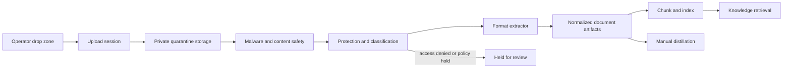

# Document Ingestion and Drop Zone

This document defines how operators upload, protect, process, store, share, and remove documents
through FDAI. It covers the web drop zone and the asynchronous ingestion plane that feeds both the
Knowledge Base and manual distillation without giving the console an executor identity.

> **Scope:** uploaded documents are customer data and stay in the downstream fork's governed
> storage. Upstream ships contracts, safety defaults, and provider seams only. It never ships a
> customer's source files, extracted text, thumbnails, embeddings, labels, or access lists.
>
> **Safety boundary:** document ingestion is a content write, not an operational action. It uses a
> dedicated ingestion identity and storage path. It cannot call the executor, approve a finding,
> or mutate an Azure workload.

## Design at a glance

The browser uploads directly to private object storage through a short-lived, single-upload grant.
An event-driven pipeline then scans, classifies, checks protection, extracts, chunks, and indexes
the file. Raw bytes, normalized content, metadata, and vectors use separate stores and retention
policies. Every preview, search result, and citation applies the document access policy again, so
ingestion never turns a restricted document into broadly visible text.



## Product contract for the drop zone

The drop zone is one entry point for a document ingestion service. Drag and drop, a file picker,
ChatOps attachment, email-in gateway, and connector all create the same `UploadSession` and enter
the same pipeline. A channel adapter cannot skip scanning or classification.

### Before the operator selects a file

The surface shows these facts before upload:

- **Destination collection:** the workspace or collection that will own the document.
- **Who can see it:** the roles or groups that can read the filename, preview, extracted content,
  and citations. "FDAI access" alone is not a document permission.
- **Use:** Knowledge Base grounding, manual distillation, or both.
- **Retention:** the approved source and derived-artifact retention policy.
- **Supported formats and current limits:** format, per-file size, batch count, and archive policy
  come from server capability discovery, not hard-coded UI text.
- **Protected-content behavior:** rights-managed or encrypted content may be held or rejected when
  FDAI cannot obtain authorized read access.

The confirmation text should be explicit and collection-specific:

> This upload is not private to you. People who can access `<collection>` in FDAI may be able to
> view the filename, preview, extracted text, and citations. Source protection and collection
> policy can narrow that audience. Do not upload secrets or content that this audience may not
> access.

The operator confirms this notice before the first upload to a collection and again whenever the
collection, audience, use, or retention policy changes. Consent is recorded as policy version,
collection id, actor id, and timestamp. The audit record never contains document text.

### During upload and processing

Upload progress and processing progress are separate:

1. **Uploading:** bytes transferred, pause/resume, retry, and cancel.
2. **Received:** the source hash and byte count were accepted.
3. **Safety checks:** malware, archive, secret, personal-data, and protection checks.
4. **Extracting:** page, slide, sheet, image, and attachment progress where the extractor reports it.
5. **Indexing:** chunks and embeddings are being committed.
6. **Ready, held, or failed:** a clear outcome with an actionable reason and no sensitive preview
   in an error message.

Closing the browser does not cancel server-side processing. The operator can return to a document
activity view using the upload id. Cancellation stops new work, revokes the upload grant, and
schedules partial artifacts for deletion.

### After processing

A ready document displays:

- source name, format, size, content hash prefix, uploader, and upload time;
- collection, classification, sensitivity label, protection state, and effective audience;
- processing use, version, parser name/version, page or item count, and warnings;
- source retention, derived retention, legal-hold state, and deletion eligibility;
- links to citations and distilled candidates without exposing content to unauthorized readers.

Replacing a document creates a new immutable version. It does not overwrite evidence in place.
The active pointer moves only after the new version reaches `ready`; a failed replacement leaves
the prior version active.

## Authorization and shared visibility

A document has its own access descriptor. The effective reader set is the intersection of:

1. the operator's FDAI role;
2. the selected collection's groups;
3. source access control and rights-management policy when available;
4. classification and sensitivity policy;
5. legal hold, incident restriction, or other policy overlays.

A user with console access is not automatically entitled to every uploaded document. Conversely,
an upload is not a personal file locker. If the selected collection is shared, other authorized
members can see it as stated in the pre-upload notice.

Recommended capabilities are:

| Capability | Default audience |
|------------|------------------|
| Create upload session | collection Contributor or Owner |
| Read metadata | effective collection Reader |
| Preview or download source | effective document reader and source policy |
| Search extracted chunks | effective document reader, checked at query time |
| Change audience or retention | collection Owner with audit |
| Delete or replace | uploader while policy allows, or collection Owner |
| Release a held document | designated security/data reviewer, not the uploader alone |

Derived text, thumbnails, summaries, embeddings, and distilled candidates inherit the source
`document_id`, version, classification, and access descriptor. Retrieval filters candidates before
ranking and rechecks access before returning content. Post-filtering an already composed model
answer is too late and is not supported.

## Rights-managed, labeled, and encrypted documents

"RMS-protected" covers Microsoft Purview Information Protection and Azure Rights Management
protection. It is different from a sensitivity label with no encryption, a password-encrypted
file, and ordinary storage encryption. The pipeline records these states separately.

### Detection is layered

Filename and MIME type are hints only. Authoritative detection combines:

- container signatures and encryption records for OOXML, PDF, and other supported formats;
- sensitivity-label metadata exposed by an approved parser or Microsoft Purview Information
  Protection adapter;
- parser outcomes such as `access_denied`, `password_required`, `encrypted`, or `corrupt`;
- a controlled read probe under the ingestion principal or the uploader's delegated identity.

A failed parse is never reported simply as "corrupt" until protection has been checked. The
normalized `ProtectionState` distinguishes:

- `none`;
- `labeled_unencrypted`;
- `rights_managed_accessible`;
- `rights_managed_access_denied`;
- `password_encrypted`;
- `unsupported_protection`;
- `unknown`.

### FDAI respects protection rather than removing it

FDAI does not crack passwords, strip labels, downgrade rights, or reuse a decrypted copy outside
the source policy. For a rights-managed file, a production fork can use a short-lived delegated
on-behalf-of token or an approved workload identity only when the source policy grants it read
rights. Broad tenant-wide decryption permission is not an acceptable default.

The policy chooses one of these outcomes:

| Outcome | Behavior |
|---------|----------|
| Metadata only | Keep filename, hash, label, and state; create no text or preview. |
| Ephemeral extraction | Decrypt in an isolated worker, index approved derived content, then destroy plaintext working files. |
| Governed derivative | Persist extracted content only when policy permits it; inherit the source label, ACL, expiry, and revocation lineage. |
| Hold | Keep the encrypted source in quarantine and request a data/security review. |
| Reject | Delete the quarantined source after the failure-retention window and explain how the uploader can provide an approved version. |

If source rights are revoked, expired, or changed, the next access check blocks reads immediately.
A reconciliation job then removes or re-protects cached previews, chunks, and embeddings. FDAI does
not rely on ingestion-time authorization forever.

Password-protected documents are held by default. Passwords are not accepted in chat, logs,
metadata, or an upload form. A fork that supports password entry needs a separate ephemeral secret
channel and a documented privacy/security review.

## Format support

Format support is capability-based. The service advertises available extractors and their limits;
the UI renders that response. A fork can add an extractor without changing the ingestion state
machine.

| Family | Examples | Baseline handling |
|--------|----------|-------------------|
| Plain text and code | TXT, Markdown, RST, JSON, YAML, XML, CSV, Terraform, Rego | Decode with declared/observed encoding, preserve line ranges, reject binary masquerading as text. |
| Portable documents | text PDF, scanned PDF, PDF portfolios | Layout-aware text extraction; OCR for image pages; enumerate embedded files; preserve page citations. |
| Office documents | DOCX, PPTX, XLSX, ODT, ODP, ODS | Preserve headings, tables, slides, speaker notes, sheets, cells, and object relationships where supported; never run macros. |
| Images | PNG, JPEG, TIFF, WebP, HEIC | OCR plus image metadata; optional approved vision extraction for diagrams. |
| Email and messages | EML, MSG, MBOX exports | Parse headers/body/attachments; treat every attachment as a child document with inherited access. |
| Web and wiki export | HTML, MHTML, Confluence/Notion export packages | Sanitize active content, keep links as text, and preserve page hierarchy. |
| Archives | ZIP, TAR, GZIP | Disabled by default or expanded under strict depth, count, ratio, and byte budgets. Each member becomes a child document. |
| Legacy or proprietary binary | DOC, XLS, PPT, vendor formats | Use an isolated converter when a fork approves one; otherwise return `unsupported_format`. |
| Audio and video | MP3, WAV, MP4, meeting recordings | Optional transcription adapter with locale, consent, and retention policy; not part of the day-zero baseline. |

A format is not "supported" merely because a library can return some text. Extractor conformance
tests cover structure, citations, tables, protection outcomes, malformed inputs, and resource
budgets. Lossy extraction is visible as warnings and can block manual distillation while still
allowing metadata-only storage.

## Large-document and batch design

Large files do not pass through the console server or remain fully resident in worker memory.
The design uses private block/object storage, resumable transfers, streaming hashes, and bounded
workers.

### Upload path

1. The console asks the ingestion gateway for a short-lived upload session.
2. The gateway authorizes collection and policy, reserves quota, and returns a write-only grant
   scoped to one object and one expiry. The grant is never logged or written to audit.
3. The browser uploads blocks directly to private storage with bounded parallelism and retries.
4. The browser or gateway commits the block list and submits byte count plus a streaming SHA-256.
5. The gateway verifies object properties, closes the session, and publishes `document.received`.

The server supports pause/resume across browser restarts by persisting only upload id and completed
block ids in browser storage. The storage grant can commit only the reserved object; it cannot list,
read, overwrite another document, or extend its own expiry.

### Processing path

- **Streaming first:** scanners and extractors consume ranges or streams. They avoid whole-file
  reads and write intermediate data to encrypted scratch storage with a strict quota.
- **Shard by natural boundary:** pages, slides, sheets, archive members, and media time ranges
  become independent work items. A manifest preserves order and parent-child relationships.
- **Bounded parallelism:** per-document, per-collection, and global concurrency limits prevent one
  upload from starving event processing or other tenants.
- **Fast and slow lanes:** native text and text PDFs use the fast lane. OCR, archives, media, and
  protected files use separately metered worker pools.
- **Checkpointing:** completed shards are safe to retry and are not repeated after a worker restart.
- **Partial outcome:** a document can be `ready_with_warnings` when approved pages succeeded and
  failed items are identified. Manual distillation can require a stricter all-required-items gate.

File size, expanded bytes, page count, archive depth, member count, OCR pixels, media duration,
processing time, and extracted-character count all have independently configured budgets. A large
source is accepted only when its reserved storage and processing budget fit. A compressed file's
small upload size never bypasses expanded-content limits.

There is no single upstream hard-coded maximum. A fork publishes limits based on storage quota,
extractor capability, worker memory, cost policy, and measured throughput. The existing lightweight
loaders remain suitable for small local text files; production large-file ingestion uses this
streaming path instead.

## Performance and capacity

The user-visible goal is immediate acceptance and observable progress, not synchronous completion.
Each production fork establishes measured baselines and sets p50/p95 targets for:

- upload-session creation and commit acknowledgement;
- transfer throughput by size band and network condition;
- queue delay by fast/slow lane;
- scan, protection check, extraction, and indexing duration per page or MB;
- time to first searchable chunk and time to fully ready;
- retry, hold, failure, and cancellation rates;
- storage growth, deduplication savings, and cost per processed unit.

The architecture reduces latency through direct-to-storage upload, content-hash deduplication
inside the same security scope, incremental version processing, page-level parallelism, batched
embeddings, and autoscaling event-driven workers. Cross-collection or cross-tenant deduplication is
not supported because it can leak the existence of a restricted document.

A fast UI must not hide slow safety work. "Uploaded" means bytes arrived. Only `ready` means the
document can participate in retrieval or distillation.

## Storage model

FDAI separates content by purpose so each layer can have its own access and retention policy.

| Store | Contents | Recommended Azure implementation |
|-------|----------|----------------------------------|
| Quarantine source | untrusted uploaded bytes and upload manifests | private Blob Storage container, no public access, short retention |
| Governed source | accepted immutable source versions when managed-copy mode is selected | private Blob Storage with versioning, lifecycle policy, optional immutable/legal-hold controls |
| Derived artifacts | normalized JSON/JSONL, page text, thumbnails, OCR output, extraction manifest | separate private Blob container, encrypted and ACL-linked to source |
| Metadata and status | document/version records, state transitions, policy, effective access references | PostgreSQL |
| Search index | chunks, embeddings, source/version/access references | PostgreSQL with pgvector |
| Audit | actor, state transition, policy decision, hashes and references, never document body | append-only audit ledger |
| Worker scratch | temporary decrypted or expanded content | isolated encrypted ephemeral volume, wiped on completion/failure |

Object names are opaque ids, not user filenames. The original filename is metadata protected by the
same access policy. Storage accounts use private endpoints, encryption at rest, secure transport,
key rotation, soft-delete/versioning according to policy, and no anonymous container access.
Customer-managed keys are a fork policy choice, not a value hard-coded upstream.

### Source storage modes

A collection chooses one mode per source:

- **Managed copy:** FDAI retains an immutable source version and owns lifecycle enforcement. Best
  for direct uploads and stable evidence.
- **Linked source:** FDAI stores a connector reference, version token, ACL snapshot, and derived
  index. Reads and periodic reconciliation use the source system's current authorization. Best for
  SharePoint, Confluence, and Notion.
- **Ephemeral processing:** FDAI retains no raw source after approved extraction. Derived artifacts
  have an explicit shorter policy and source hash/provenance. Best when raw retention is not
  allowed, but it reduces reprocessing and evidence options.
- **Metadata only:** FDAI stores identity, protection/classification, hash, and status with no raw
  or extracted content.

The mode is shown before upload. Changing it is a governed operation and does not silently migrate
existing versions.

### Canonical document representation

Every extractor produces a versioned `DocumentEnvelope` rather than writing directly to pgvector:

- stable `document_id` and immutable `version_id`;
- source hash, media type, observed format, size, and parent/child links;
- uploader/source identity, collection, purpose, and provenance;
- classification, sensitivity label, `ProtectionState`, and access descriptor reference;
- ordered structural units with page/slide/sheet/cell/time-range locators;
- extracted text and asset references, not inline binary objects;
- extractor name/version, warnings, loss indicators, and processing metrics;
- retention, legal hold, deletion lineage, and superseded-version reference.

Knowledge indexing and manual distillation consume this envelope. They do not parse the raw upload
independently, which keeps protection, citations, and deletion behavior consistent.

## Security and content-safety pipeline

Uploaded bytes are untrusted even when the uploader is authenticated. Before content becomes
readable or model-bound, the pipeline applies:

1. **Object validation:** actual file signature, media type, length, hash, and upload-session match.
2. **Archive defense:** expanded-byte, nesting, member-count, path traversal, symlink, and
   compression-ratio limits.
3. **Malware scan:** approved antimalware service; infected content remains unavailable and follows
   the configured evidence/deletion policy.
4. **Active-content neutralization:** macros, scripts, external relationships, formulas, and remote
   fetches are never executed. HTML and previews are sanitized.
5. **Protection and label check:** RMS/Purview, PDF encryption, password encryption, and unknown
   protection are classified before extraction.
6. **Secret and personal-data scan:** findings route to policy hold, redaction, or rejection. Raw
   values do not enter audit or operator-visible errors.
7. **Prompt-injection marking:** extracted instructions are untrusted knowledge. Retrieval wraps
   them as evidence and never lets document text redefine system instructions or tool authority.
8. **Parser sandbox:** converters run without executor identity, with no general outbound network,
   read-only source access, CPU/memory/time limits, and an ephemeral writable volume.

A held or failed source is not searchable, previewable, downloadable, or sent to a model except by
a specifically authorized review workflow. The uploader cannot self-release a malware, rights, or
sensitivity hold.

## Lifecycle, retention, and deletion

The version state machine is explicit and append-only in audit:

```text
created -> uploading -> received -> quarantined -> scanning -> protection_check
        -> extracting -> indexing -> ready | ready_with_warnings
        -> held | failed
ready | ready_with_warnings | held | failed -> deleting -> deleted
```

Retries create state-transition attempts under the same idempotency key. They do not create a
second version unless source bytes differ.

Deletion is lineage-aware:

1. authorize deletion and check legal hold;
2. make the version unavailable to preview, search, retrieval, and distillation;
3. delete or tombstone chunks and embeddings;
4. delete normalized artifacts and cached previews;
5. delete the managed source when policy permits;
6. propagate deletion to replicas, indexes, and approved model/vector caches;
7. record completion evidence without retaining content.

Backup expiry, immutable retention, and legal hold can delay physical deletion. The UI reports
`deletion_pending` and the governing reason rather than claiming immediate erasure. Linked-source
removal and ACL change events use the same reconciliation and lineage path.

## API and event contracts

Document ingestion is served by a dedicated ingestion gateway, not by the read API and not by the
executor process. The initial HTTP surface is:

| Method and path | Purpose |
|-----------------|---------|
| `GET /ingestion/capabilities` | formats, size/batch/archive limits, storage modes, policy versions |
| `POST /ingestion/uploads` | authorize destination and create an `UploadSession` |
| `POST /ingestion/uploads/{upload_id}/complete` | verify and commit the received object |
| `GET /ingestion/uploads/{upload_id}` | resumable transfer and processing status |
| `POST /ingestion/uploads/{upload_id}/cancel` | revoke grant and clean partial data |
| `GET /documents/{document_id}/versions` | authorized metadata and state history |
| `DELETE /documents/{document_id}/versions/{version_id}` | request governed deletion |

The source bytes travel directly between client and object storage. Authentication tokens and
storage grants are never accepted in query strings that may be logged.

State transitions publish typed events such as `document.received`, `document.held`,
`document.ready`, `document.superseded`, `document.access_changed`, and `document.deleted`.
Consumers are idempotent. Knowledge indexing and manual distillation subscribe to `document.ready`
only when the version's declared purpose includes them.

## Failure behavior

| Failure | Safe behavior |
|---------|---------------|
| Browser or network disconnect | Resume committed blocks; expire abandoned sessions and delete partial objects. |
| Storage commit mismatch | Hold the object, reject completion, and audit expected vs observed metadata without content. |
| Scanner unavailable | Keep in quarantine and retry; never skip scanning. |
| RMS access denied | Record metadata-only or hold according to policy; never strip protection. |
| Parser crash or timeout | Retry in a fresh sandbox within budget, then fail or return approved partial output. |
| OCR/embedding provider outage | Preserve accepted source and checkpoint; resume the affected stage later. |
| ACL source unavailable | Fail closed for reads and retrieval until authorization can be re-established. |
| Index deletion failure | Keep the document unavailable, retry deletion, and report `deletion_pending`. |
| Queue overload | Apply admission control and per-collection fairness; operational event processing keeps priority. |

## Observability and audit

Metrics include bytes, pages, queue delay, stage latency, extractor outcome, protection state,
hold category, retry count, index count, deletion lag, and storage by class. Labels use bounded
enums. They never include filenames, document text, source URLs, or customer identifiers.

Audit entries record actor, collection, document/version id, source hash, action, state transition,
policy version, classification decision, effective-access descriptor reference, processing purpose,
extractor version, and outcome. Security review access and every source download are audited.

Operational alerts cover quarantine backlog, scanner degradation, repeated parser sandbox failure,
rights-reconciliation lag, orphaned partial uploads, indexing lag, deletion lag, and storage quota.

## Implementation boundaries and rollout

The upstream implementation now ships the contracts, fail-closed lifecycle, dedicated ASGI
gateway, console drop zone, streaming browser hash, local direct-upload adapter, safe text/OOXML
extractor, protection signature detection, test adapters, and deletion lineage. Production forks
still supply governed object/metadata/vector stores and approved malware, Purview/RMS, OCR, and
rich-format providers.

| Slice | Upstream status |
|-------|-----------------|
| Contract and metadata | Shipped: `DocumentEnvelope`, state machine, capability discovery, access provider, metadata/activity seams, and console visibility notice. |
| Safe text | Shipped generically: direct-upload gateway, quarantine lifecycle, fail-closed scanner seam, UTF-8/OOXML extraction, artifact/index seams, and deletion. The upstream scanner abstains until a production provider is bound. |
| Layout | Partial: OOXML structure and PDF/protection detection ship; layout-aware PDF extraction, OCR, and previews require approved providers. |
| Protection | Partial: PDF/Office/container encryption and suspicious rights metadata are detected and held. A Purview/RMS adapter, delegated authorization, and revocation reconciliation remain fork bindings. |
| Connector and scale | Contract ready: resumable/scoped upload sessions, streaming hashes, bounded parser budgets, and provider seams ship. Azure Blob, durable metadata, connector delta sync, and measured capacity targets remain deployment work. |

The rollout sequence remains:

1. **Contract and metadata slice:** `DocumentEnvelope`, state machine, capability discovery, access
   descriptor, audit, and a metadata-only UI.
2. **Safe text slice:** direct block upload, quarantine, malware/secret scan, plain-text extractors,
   managed-copy storage, deletion lineage, and Knowledge Base indexing.
3. **Layout slice:** PDF and modern Office extractors, page citations, OCR slow lane, previews, and
   extraction conformance tests.
4. **Protection slice:** Purview/RMS adapter, delegated authorization, label/ACL inheritance,
   revocation reconciliation, and governed derivatives.
5. **Connector and scale slice:** linked-source mode, delta sync, large-batch admission control,
   measured capacity targets, and manual-distillation consumption.

Each slice starts with no model execution and no document visibility beyond authorized metadata.
Retrieval and distillation are enabled only after access filtering, deletion propagation, and
adversarial-file tests pass in shadow.

## Decisions and open questions

Decisions fixed by this design:

- the browser uploads directly to private object storage through a scoped session;
- the console never receives the executor identity;
- source, derived artifacts, metadata, vectors, audit, and scratch use separate storage classes;
- access is enforced before retrieval and inherited by every derivative;
- rights management is preserved, not removed;
- large-document processing is streaming, sharded, resumable, and budgeted;
- upload completion and processing readiness are different states;
- no fixed upstream size limit or retention period is embedded in UI code.

Fork decisions that require approved evidence:

- collection audience, classification mapping, residency, retention, backup, and legal hold;
- supported extractors/converters and their licenses;
- malware, OCR, Purview/RMS, embedding, and transcription providers;
- whether protected content permits ephemeral extraction or governed derivatives;
- per-format resource budgets, service targets, quotas, and cost limits;
- whether archives, legacy formats, audio/video, and source download are enabled.

## Next steps

| To learn about | Read |
|----------------|------|
| Compiling manuals into deterministic artifacts | [Manual Distillation](../rules-and-detection/manual-distillation.md) |
| Knowledge evidence in root-cause analysis | [Observability and Detection](../rules-and-detection/observability-and-detection.md) |
| Data classification, retention, and privacy evidence | [Data Governance and Privacy Evidence](../architecture/data-governance.md) |
| Human roles and Entra authorization | [User RBAC and Entra Identity](user-rbac-and-identity.md) |
| Console authority boundaries | [Operator Console](operator-console.md) |
| Storage and security threat model | [Security and Identity](../architecture/security-and-identity.md) |
