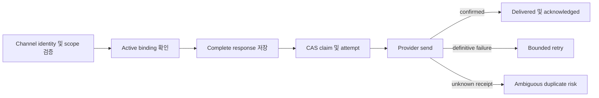

# 영구 대화 전송

이 문서는 검증된 principal-to-channel binding, 영구 outbound reply delivery, process-loss
recovery, adapter health control, read-only reliability metric을 정의합니다. Console에 mutation
authority를 부여하지 않으면서 Web, Slack, Teams 및 scheduled-result continuation에 적용됩니다.

> Vendor sender id는 routing evidence이며 principal id가 아닙니다. 모호한 provider receipt는
> visible terminal state이며 자동으로 재시도하지 않습니다.

## 설계 개요

FDAI는 provider 호출 전에 완전하고 제한된 response를 저장합니다. Worker는 compare-and-set
(CAS)으로 immutable payload를 claim하고 한 번 전송한 뒤 confirmed acknowledgement, bounded
retry가 가능한 definitive failure 또는 visible duplicate risk를 기록합니다.



## Identity 및 binding

`VerifiedChannelEndpoint`는 canonical identity와 vendor routing identity를 분리합니다.

- **Canonical principal**: explicit authorization mapping이 있는 authenticated FDAI principal입니다.
- **Scope**: principal이 접근 권한을 가진 narrow scope입니다.
- **Vendor endpoint**: channel kind, channel id, sender id, optional thread id입니다.
- **Verification evidence**: opaque mapping 또는 Entra verification reference와 timestamp입니다.

Slack과 Teams는 `ChannelPrincipalAuthorizationMapping`을 사용합니다. Web은 authenticated Entra
principal과 별도의 browser session reference를 사용합니다. Hook은 vendor sender id를 principal
id로 반환하는 mapping을 차단합니다. Binding endpoint를 만들기 전에 scope authorization을
확인합니다.

`PrincipalConversationBindingService`는 audit event와 함께 binding을 생성하고 revoke합니다.
Cross-channel resume은 explicit하며 하나의 principal과 scope를 유지하고 source binding을
참조합니다. 관련 없는 thread를 병합하지 않습니다. Delivery는 전체 verified endpoint로 active
binding을 확인합니다. Revoked 또는 mismatched binding은 delivery context를 만들지 않습니다.

## Delivery ledger

Delivery state machine은 다음과 같습니다.

```text
pending -> sending -> delivered
                   -> failed -> sending
                   -> ambiguous
                   -> abandoned
```

Complete `OutboundResponse`, response digest, destination, operation, principal, scope,
conversation, binding, origin reference, freshness deadline, retention deadline을 send 전에
저장합니다. Stable origin과 destination 및 operation으로 deterministic idempotency key를
만듭니다. 동일 key를 다른 response content에 재사용하면 차단됩니다.

다음 state는 immutable입니다.

| State | 의미 | 자동 재시도 |
|-------|------|-------------|
| `delivered` | Provider가 usable acknowledgement를 반환했고 FDAI가 저장했습니다. | 아니요 |
| `ambiguous` | Send가 provider에 도달했을 수 있으나 local confirmation이 없습니다. | 아니요 |
| `abandoned` | Definitive failure 이후 attempt 또는 freshness를 소진했습니다. | 아니요 |

`failed`는 provider가 operation을 수락하지 않았음이 확실한 상태입니다. 이 state와 unsent
`pending` row만 claim할 수 있습니다. Retry는 stored response를 재사용하며 model, tool,
background task, scheduled task 또는 response generator를 호출하지 않습니다.

## PostgreSQL consistency

Alembic revision `20260720_0047`은 binding, delivery, attempt, acknowledgement 및 adapter breaker
table을 추가합니다. Database는 다음을 강제합니다.

- Unique delivery idempotency key 및 binding endpoint constraint입니다.
- `pending`과 `failed`를 위한 due-row index, retention, latency, duplicate-risk index입니다.
- Concurrent worker를 위한 `FOR UPDATE SKIP LOCKED` row-lock CAS claim입니다.
- Delivery별 하나의 attempt sequence와 delivered record별 하나의 acknowledgement입니다.
- `delivered`, `ambiguous`, `abandoned` row update를 거부하는 trigger입니다.
- Terminal row가 `retention_until`에 도달한 뒤에만 retention delete를 허용합니다.

In-memory 구현은 deterministic test를 위해 동일 transition rule을 따릅니다. Production은
PostgreSQL store를 사용합니다.

## Crash recovery

Production channel startup은 consumer 시작 전에 ledger를 reconcile합니다.

1. 만료된 `sending` lease를 `duplicate_risk=true` 및 `process_loss`가 있는 `ambiguous`로 바꿉니다.
2. Due `pending` 및 `failed` row를 attempt, freshness, batch cap 안에서 claim하고 전송합니다.
3. 기존 `ambiguous` row는 변경하지 않습니다.

Claim 전 crash는 claim 가능한 `pending` response를 남깁니다. Claim이 `sending` lease를 만든 뒤에는
provider 호출 직전 crash도 실제 send 여부를 증명할 수 없으므로 startup reconciliation이
보수적으로 `ambiguous` terminal row로 표시합니다. Send 중, provider receipt 후 또는 local
acknowledgement 전 crash도 같은 결과입니다.
FDAI는 provider가 지원하지 않는 exactly-once 동작을 주장하지 않습니다.

## Adapter health

`AdapterHealthService`는 bounded failure window를 기록하고 configured threshold에서 breaker를
엽니다. Open 및 manually paused adapter는 새 claim을 중단합니다. Timer나 successful probe로
자동 resume하지 않으며 authorized operator가 explicit resume해야 합니다.

Fallback health notification은 다른 adapter의 authorized A2 operational-alert route로 제한됩니다.
Denied 또는 failed fallback은 audited됩니다. Fallback failure는 delivery를 다시 열거나 execution
authority를 부여하지 않습니다.

Pause, resume 및 status command는 별도로 authenticated된 channel command app의
`/commands/adapters/*`에 있습니다. Console read API에는 mount하지 않습니다.

## Conversation 및 scheduled integration

`ConversationChannelGateway`는 shared conversation gateway의 inbound deduplication과 thread
semantics를 유지합니다. Durable delivery가 binding되면 verified binding context를 확인하고
provider를 직접 호출하는 대신 complete response를 ledger에 제출합니다. Duplicate webhook 또는
completion은 coordinator를 다시 실행하거나 다른 delivery를 만들지 않습니다.

`ScheduledContinuationDeliveryCoordinator`는 stable anchor id를 origin으로 사용해 외부 Slack 및
Teams result를 제출합니다. 이미 저장된 result summary, digest, evidence, conversation reference,
thread mode를 사용합니다. Web continuation은 idempotent conversation turn을 유지합니다.

## Read-only operations view

`ConversationDeliveryPanel`은 GET-only `ReadPanel`입니다. 다음을 보고합니다.

- Delivery latency count, average 및 p95입니다.
- State count, duplicate-risk count, retry 및 abandonment입니다.
- Attempt 및 acknowledgement count입니다.
- Adapter breaker state count입니다.

Payload는 `read_only=true` 및 `mutations_available=false`를 설정합니다. Console에는 pause, resume,
retry, duplicate-risk override 또는 resend control이 없습니다.

## 검증

Focused coverage에는 send 전 crash, send 중 crash, provider receipt 후 crash, local acknowledgement
전 crash, duplicate input 및 completion, concurrent claim, stale lease, cross-principal 및
cross-scope denial, revoked authorization, breaker threshold, manual resume, fallback failure, retry
storm, Slack/Teams post, edit, stream, reaction degradation이 포함됩니다.

## 관련 문서

| 학습 항목 | 문서 |
|-----------|------|
| Conversation coordinator 및 tool authority | [Operator console](operator-console-ko.md) |
| Channel trust 및 rich delivery | [Channel 및 notification](channels-and-notifications-ko.md) |
| Exact scheduled-run anchor | [Scheduled result continuation](scheduled-result-continuations-ko.md) |
| Identity 및 least privilege | [Security 및 identity](../architecture/security-and-identity-ko.md) |
