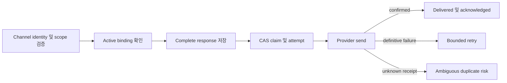

# 영구 대화 전송

이 문서는 검증된 principal-to-channel 연결, 영구 outbound 회신 전달, process-loss
복구, 어댑터 health control, 읽기 전용 reliability 메트릭을 정의합니다. Console에 변경
권한을 부여하지 않으면서 Web, Slack, Teams 및 scheduled-result 이어가기에 적용됩니다.

> 벤더 sender id는 라우팅 근거이며 principal id가 아닙니다. 모호한 프로바이더 증적은
> visible 최종 상태이며 자동으로 재시도하지 않습니다.

## 설계 개요

FDAI는 프로바이더 호출 전에 완전하고 제한된 응답을 저장합니다. 워커는 compare-and-set
(CAS)으로 변경할 수 없는 페이로드를 점유하고 한 번 전송한 뒤 confirmed 확인 응답, 범위가 제한된
재시도가 가능한 definitive 실패 또는 visible 중복 risk를 기록합니다.


```mermaid
flowchart LR
 AUTH[Channel identity 및 scope 검증] --> BIND[Active binding 확인]
 BIND --> STORE[Complete response 저장]
 STORE --> CLAIM[CAS claim 및 attempt]
 CLAIM --> SEND[Provider send]
 SEND -->|confirmed| ACK[Delivered 및 acknowledged]
 SEND -->|definitive failure| RETRY[Bounded retry]
 SEND -->|unknown receipt| AMBIG[Ambiguous duplicate risk]
```

## 신원 및 연결

`VerifiedChannelEndpoint`는 정본 신원과 벤더 라우팅 신원을 분리합니다.

- **정본 principal**: 명시적 권한 확인 대응이 있는 인증된 FDAI principal입니다.
- **범위**: principal이 접근 권한을 가진 narrow 범위입니다.
- **벤더 엔드포인트**: 채널 kind, 채널 id, sender id, 선택적 스레드 id입니다.
- **검증 근거**: opaque 대응 또는 Entra 검증 참조와 시각입니다.

Slack과 Teams는 `ChannelPrincipalAuthorizationMapping`을 사용합니다. Web은 인증된 Entra
principal과 별도의 브라우저 세션 참조를 사용합니다. 훅은 벤더 sender id를 principal
id로 반환하는 대응을 차단합니다. 연결 엔드포인트를 만들기 전에 범위 권한 확인을
확인합니다.

`PrincipalConversationBindingService`는 감사 event와 함께 연결을 생성하고 철회합니다.
Cross-channel 재개는 명시적하며 하나의 principal과 범위를 유지하고 출처 연결을
참조합니다. 관련 없는 스레드를 병합하지 않습니다. 전달은 전체 검증된 엔드포인트로 활성
연결을 확인합니다. 철회된 또는 mismatched 연결은 전달 맥락을 만들지 않습니다.

## 전달 원장

전달 상태 머신은 다음과 같습니다.

```text
pending -> sending -> delivered
     -> failed -> sending
     -> ambiguous
     -> abandoned
```

완전한 `OutboundResponse`, 응답 다이제스트, destination, 연산, principal, 범위,
대화, 연결, 출처 참조, 최신성 기한, 보존 기한을 전송 전에
저장합니다. 고정된 출처와 destination 및 연산으로 결정론적 멱등성 키를
만듭니다. 동일 키를 다른 응답 내용에 재사용하면 차단됩니다.
타입이 지정된 채널 진행 상황 스냅샷은 이 변경할 수 없는 응답 하나에 포함됩니다. 영속 재생은
프로바이더 호출 전에 contiguous 개정 번호, 단조 증가 활동 개수 및 정본 답변과 동일한 최종
confirmed 스냅샷을 검증합니다. 스냅샷을 다시 생성하거나 조정기를 다시 실행하지 않습니다.
재생 decode는 agent 활동의 scalar 강제 변환을 차단합니다. Boolean 및 integer는 JSON 타입을
유지하고 시각은 timezone이 있는 RFC 3339를 사용하며 완료는 시작보다 빠를 수 없습니다.

다음 상태는 변경할 수 없는입니다.

| 상태 | 의미 | 자동 재시도 |
|-------|------|-------------|
| `delivered` | 프로바이더가 usable 확인 응답을 반환했고 FDAI가 저장했습니다. | 아니요 |
| `ambiguous` | 전송이 프로바이더에 도달했을 수 있으나 로컬 확인이 없습니다. | 아니요 |
| `abandoned` | Definitive 실패 이후 시도 또는 최신성을 소진했습니다. | 아니요 |

`failed`는 프로바이더가 연산을 수락하지 않았음이 확실한 상태입니다. 이 상태와 unsent
`pending` 행만 점유할 수 있습니다. 재시도는 stored 응답을 재사용하며 모델, 도구,
background 작업, scheduled 작업 또는 응답 generator를 호출하지 않습니다.

## PostgreSQL 일관성

Alembic 개정 번호 `20260720_0047`은 연결, 전달, 시도, 확인 응답 및 어댑터 차단기
표를 추가합니다. 데이터베이스는 다음을 강제합니다.

- Unique 전달 멱등성 키 및 연결 엔드포인트 제약입니다.
- `pending`과 `failed`를 위한 due-row 인덱스, 보존, 지연 시간, duplicate-risk 인덱스입니다.
- 동시 워커를 위한 `FOR UPDATE SKIP LOCKED` row-lock CAS 점유입니다.
- 전달별 하나의 시도 순서와 delivered 기록별 하나의 확인 응답입니다.
- `delivered`, `ambiguous`, `abandoned` 행 갱신을 거부하는 트리거입니다.
- 최종 행이 `retention_until`에 도달한 뒤에만 보존 삭제를 허용합니다.

In-memory 구현은 결정론적 테스트를 위해 동일 transition rule을 따릅니다. 운영은
PostgreSQL 저장소를 사용합니다.

## 비정상 종료 복구

운영 채널 시작은 소비자 시작 전에 원장을 조정합니다.

- 채널 첨부를 사용하면 시작은 fully built 운영 첨부 ingestor도
 요구합니다. Enabled-but-unbound 런타임은 경로 또는 소비자 시작 전에 실패합니다.

1. 만료된 `sending` 임차 기간을 `duplicate_risk=true` 및 `process_loss`가 있는 `ambiguous`로 바꿉니다.
2. Due `pending` 및 `failed` 행을 시도, 최신성, 배치 상한 안에서 점유하고 전송합니다.
3. 기존 `ambiguous` 행은 변경하지 않습니다.

점유 전 비정상 종료는 점유 가능한 `pending` 응답을 남깁니다. 점유가 `sending` 임차 기간을 만든 뒤에는
프로바이더 호출 직전 비정상 종료도 실제 전송 여부를 증명할 수 없으므로 시작 조정이
보수적으로 `ambiguous` 최종 행으로 표시합니다. 전송 중, 프로바이더 증적 후 또는 로컬
확인 응답 전 비정상 종료도 같은 결과입니다.
FDAI는 프로바이더가 지원하지 않는 exactly-once 동작을 주장하지 않습니다.
Progressive initial 게시 이후에도 같은 규칙을 적용합니다. 첫 message가 이미 표시되므로 이후 편집에서
프로바이더가 definitive 오류를 반환해도 실패는 `ambiguous`입니다. 원장은 완전한 응답을
다른 게시로 다시 시도하지 않습니다.

## 어댑터 health

`AdapterHealthService`는 범위가 제한된 실패 구간을 기록하고 구성된 임계값에서 차단기를
엽니다. Open 및 manually paused 어댑터는 새 점유를 중단합니다. Timer나 successful 탐색으로
자동 재개하지 않으며 authorized 운영자가 명시적 재개해야 합니다.

대체 경로 health notification은 다른 어댑터의 authorized A2 operational-alert 경로로 제한됩니다.
거부된 또는 실패한 대체 경로는 audited됩니다. 대체 경로 실패는 전달을 다시 열거나 실행
권한을 부여하지 않습니다.

Pause, 재개 및 상태 명령은 별도로 인증된된 채널 명령 앱의
`/commands/adapters/*`에 있습니다. Console Operator API에는 mount하지 않습니다.

## 대화 및 scheduled integration

`ConversationChannelGateway`는 shared 대화 게이트웨이의 inbound deduplication, protected
첨부 근거 및 스레드 의미 규칙을 유지합니다. 첨부 바이트는 응답 영속성 전에
통제된 인제스트를 완료하며 변경할 수 없는 응답에는 인용만 들어갑니다.
[conversation-attachments-ko.md](conversation-attachments-ko.md)를 참조하세요. 중복 webhook
또는 완료는 인제스트, 조정기, 전달을 다시 실행하지 않습니다.

통제된 첨부 인제스트 후 downstream 세션 또는 도구가 실패하면 게이트웨이는 inbound 점유를
유지하고 범용 오류 응답을 반환합니다. 따라서 재전달이 동일 벤더 message에 대해 다른
문서 버전을 만들지 않습니다. 첨부 완료 전 실패는 점유를 release하고 한
턴으로 격리하므로 채널 소비자가 계속 동작합니다.

Direct 프로바이더 전송, delivery-context 조회 또는 영속 제출 실패도 originating 턴으로
격리되고 정제된 `delivery.submit` transition을 발행합니다. 채널 수신 loop를 종료하거나
프로바이더 응답 텍스트를 노출하지 않습니다.

`ScheduledContinuationDeliveryCoordinator`는 고정된 anchor id를 출처로 사용해 외부 Slack 및
Teams 결과를 제출합니다. 이미 저장된 결과 요약, 다이제스트, 근거, 대화 참조,
스레드 모드를 사용합니다. Web 이어가기는 멱등적 대화 턴을 유지합니다.

## 읽기 전용 operations 화면

`ConversationDeliveryPanel`은 GET-only `ReadPanel`입니다. 다음을 보고합니다.

- 전달 지연 시간 개수, average 및 p95입니다.
- 상태 개수, duplicate-risk 개수, 재시도 및 abandonment입니다.
- 시도 및 확인 응답 개수입니다.
- 어댑터 차단기 상태 개수입니다.
- 조립이 범위가 제한된 수집기를 Web 또는 채널 발행기와 공유할 때 선택적 집계
 progressive-conversation 개수와 first-progress, first-confirmed, 가지 지연 시간입니다.

페이로드는 `read_only=true` 및 `mutations_available=false`를 설정합니다. Console에는 pause, 재개,
재시도, duplicate-risk 재정의 또는 resend control이 없습니다.

## 검증

Focused 커버리지에는 전송 전 비정상 종료, 전송 중 비정상 종료, 프로바이더 증적 후 비정상 종료, 로컬 확인 응답
전 비정상 종료, 중복 입력 및 완료, 동시 점유, stale 임차 기간, cross-principal 및
cross-scope denial, 철회된 권한 확인, 차단기 임계값, 수동 재개, 대체 경로 실패, 재시도
storm, Slack/Teams 게시, 편집, 스트림, reaction 성능 저하가 포함됩니다.

## 관련 문서

| 학습 항목 | 문서 |
|-----------|------|
| 대화 조정기 및 도구 권한 | [Operator 콘솔](operator-console-ko.md) |
| 채널 trust 및 rich 전달 | [채널 및 notification](channels-and-notifications-ko.md) |
| Exact scheduled-run anchor | [Scheduled 결과 이어가기](scheduled-result-continuations-ko.md) |
| 신원 및 least 권한 | [Security 및 신원](../architecture/security-and-identity-ko.md) |
