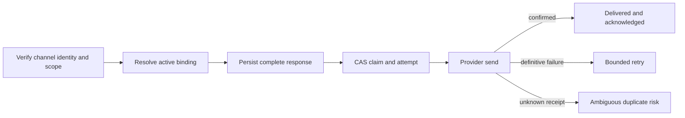

# Durable Conversation Delivery

This document defines verified principal-to-channel bindings, durable outbound reply delivery,
process-loss recovery, adapter health controls, and read-only reliability metrics. It applies to
web, Slack, Teams, and scheduled-result continuations without granting the console mutation
authority.

> A vendor sender id is routing evidence, not a principal id. Ambiguous provider receipt is a
> visible terminal state and is never retried automatically.

## Design at a glance

FDAI persists the complete bounded response before a provider call. A worker claims that immutable
payload with compare-and-set (CAS), sends it once, and records either a confirmed acknowledgement,
a definitive failure eligible for bounded retry, or visible duplicate risk.



## Identity and binding

`VerifiedChannelEndpoint` keeps canonical identity and vendor routing identity separate:

- **Canonical principal**: an authenticated FDAI principal with an explicit authorization mapping.
- **Scope**: the narrow scope that the principal is authorized to access.
- **Vendor endpoint**: channel kind, channel id, sender id, and optional thread id.
- **Verification evidence**: an opaque mapping or Entra verification reference and timestamp.

Slack and Teams use `ChannelPrincipalAuthorizationMapping`; web uses its authenticated Entra
principal plus a distinct browser session reference. A hook rejects a mapping that returns the
vendor sender id as the principal id. Scope authorization is checked before a binding endpoint can
be created.

`PrincipalConversationBindingService` creates and revokes bindings with audit events. Cross-channel
resume is explicit, preserves one principal and scope, and references the source binding. It does
not merge unrelated threads. Delivery resolves an active binding by the complete verified endpoint;
a revoked or mismatched binding produces no delivery context.

## Delivery ledger

The delivery state machine is:

```text
pending -> sending -> delivered
                   -> failed -> sending
                   -> ambiguous
                   -> abandoned
```

The complete `OutboundResponse`, response digest, destination, operation, principal, scope,
conversation, binding, origin reference, freshness deadline, and retention deadline are stored
before send. The stable origin plus destination and operation derive one deterministic idempotency
key. Reusing that key with different response content is rejected.

The following states are immutable:

| State | Meaning | Automatic retry |
|-------|---------|-----------------|
| `delivered` | Provider returned a usable acknowledgement and FDAI stored it. | No |
| `ambiguous` | A send may have reached the provider, but local confirmation is unavailable. | No |
| `abandoned` | Attempts or freshness were exhausted after definitive failures. | No |

`failed` means the provider definitively did not accept the operation. Only this state and unsent
`pending` rows are claimable. Retries reuse the stored response and never invoke a model, tool,
background task, scheduled task, or response generator.

## PostgreSQL consistency

Alembic revision `20260720_0047` adds binding, delivery, attempt, acknowledgement, and adapter
breaker tables. The database enforces:

- Unique delivery idempotency keys and binding endpoint constraints.
- Due-row indexes for `pending` and `failed`, plus retention, latency, and duplicate-risk indexes.
- Row-lock CAS claims with `FOR UPDATE SKIP LOCKED` for concurrent workers.
- One attempt sequence per delivery and one acknowledgement per delivered record.
- A trigger that rejects updates to `delivered`, `ambiguous`, and `abandoned` rows.
- Retention deletion only after a terminal row reaches `retention_until`.

The in-memory implementation follows the same transition rules for deterministic tests. Production
uses the PostgreSQL stores.

## Crash recovery

Production channel startup reconciles the ledger before starting consumers:

1. Expired `sending` leases become `ambiguous` with `duplicate_risk=true` and `process_loss`.
2. Due `pending` and `failed` rows are claimed and sent within attempt, freshness, and batch caps.
3. Existing `ambiguous` rows remain untouched.

A crash before claim leaves a claimable `pending` response. Once claim creates a `sending` lease,
even a crash immediately before the provider call cannot prove whether send occurred, so startup
reconciliation conservatively exposes an `ambiguous` terminal row. Crashes during send, after
provider receipt, or before local acknowledgement have the same outcome.
FDAI does not claim exactly-once behavior from a provider that cannot support it.

## Adapter health

`AdapterHealthService` records bounded failure windows and opens a breaker at the configured
threshold. Open and manually paused adapters stop new claims. They never resume from a timer or a
successful probe; an authorized operator must explicitly resume them.

Fallback health notification is limited to authorized A2 operational-alert routes on another
adapter. A denied or failed fallback is audited. Fallback failure does not reopen delivery or grant
execution authority.

Pause, resume, and status commands live in the separately authenticated channel command app under
`/commands/adapters/*`. They are not mounted in the console read API.

## Conversation and scheduled integration

`ConversationChannelGateway` keeps inbound deduplication and thread semantics from the shared
conversation gateway. When durable delivery is bound, it resolves verified binding context and
submits the complete response to the ledger instead of calling the provider directly. Duplicate
webhooks or completions do not rerun the coordinator or create another delivery.

`ScheduledContinuationDeliveryCoordinator` submits external Slack and Teams results with the
stable anchor id as the origin. It uses the already persisted result summary, digest, evidence,
conversation reference, and thread mode. Web continuations remain idempotent conversation turns.

## Read-only operations view

`ConversationDeliveryPanel` is a GET-only `ReadPanel`. It reports:

- Delivery latency count, average, and p95.
- State counts, duplicate-risk count, retries, and abandonment.
- Attempt and acknowledgement counts.
- Adapter breaker state counts.

The payload sets `read_only=true` and `mutations_available=false`. The console exposes no pause,
resume, retry, duplicate-risk override, or resend control.

## Verification

Focused coverage includes crash before send, during send, after provider receipt, before local
acknowledgement, duplicate input and completion, concurrent claim, stale lease, cross-principal and
cross-scope denial, revoked authorization, breaker threshold, manual resume, fallback failure,
retry storm, and Slack/Teams post, edit, stream, reaction degradation.

## Related docs

| To learn about | Read |
|----------------|------|
| Conversation coordinator and tool authority | [Operator console](operator-console.md) |
| Channel trust and rich delivery | [Channels and notifications](channels-and-notifications.md) |
| Exact scheduled-run anchors | [Scheduled result continuations](scheduled-result-continuations.md) |
| Identity and least privilege | [Security and identity](../architecture/security-and-identity.md) |
