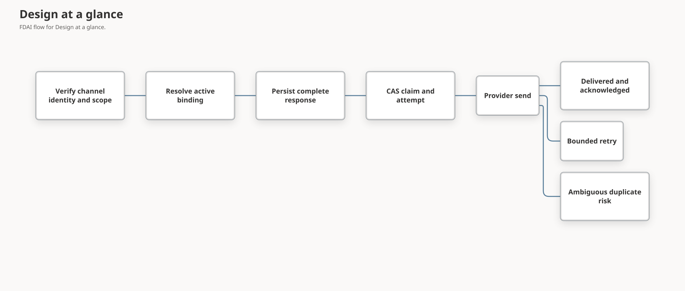

# Durable Conversation Delivery

This document defines verified principal-to-channel bindings, durable outbound reply delivery,
process-loss recovery, adapter health controls, and read-only reliability metrics. It applies to
web, Slack, Teams, and scheduled-result continuations without granting the console mutation
authority.

Production A3 startup composition and transport lifecycle are owned by
[Production A3 channel runtime](production-a3-channel-runtime.md); this document remains the
durable state-machine owner.

> A vendor sender id is routing evidence, not a principal id. Ambiguous provider receipt is a
> visible terminal state and is never retried automatically.

## Read-investigation terminal completion

Core publishes `read-investigation-completion` `1.0.0` only after the immutable background-task
result and its pending completion outbox commit. The authority-free contract carries a
deterministic completion id, canonical task and attempt identity, request idempotency key,
principal, correlation and origin binding, bounded terminal result and evidence references,
usage, ordered timestamps, retention deadline, `trusted=false`, and
`execution_authority=false`. The task id is the partition key. Core never imports an Operator
implementation or writes an Operator conversation, inbox, or delivery table.

The Operator completion consumer validates the exact contract and digest, then requires the
matching durable `read_investigation.start` proposal before it accepts the record. One
Operator-owned database transaction must insert or replay the completion inbox record, append the
deterministic untrusted assistant turn, and enqueue the immutable outbound response. Broker offset
commit follows that transaction. The existing delivery worker owns provider claim, send,
acknowledgement, ambiguous-send handling, and retry. A delivery failure never asks Core to rerun
the investigation or rewrite its result.

The first codec accepts exact `1.0.0`. An additive successor must keep N and N-1 decoders and may
not downgrade a newer payload. Malformed records go directly to the sibling DLQ. A completion whose
matching proposal is not yet visible is retried with a bounded count before quarantine. Inbox,
turn, and outbound identities are deterministic, so duplicate transport delivery reuses the same
records. The broker retains normal records for one day and DLQ records for seven days; the durable
inbox and delivery rows retain data until the contract-provided deadline and terminal delivery
retention rules permit purge.

Rollback disables the completion consumer and Core publisher, restores the last compatible
Operator codec, and leaves Core completion outbox rows plus accepted Operator inbox and delivery
rows intact. After compatibility is restored, replay resumes from those durable records. Rollback
never deletes a terminal result, rewinds a broker offset past an accepted Operator transaction, or
grants Core an Operator database writer.

## Implementation status

### Implementation scope

| Area | State | Evidence | Notes |
|------|-------|----------|-------|
| Verified bindings and delivery context | implemented | `channel_delivery_models.py`; `postgres_channel_binding.py`; live PostgreSQL checks | The Operator-local store enforces exact idempotent create, active-endpoint uniqueness, revocation CAS, principal-scoped listing, and restart persistence through the runtime role. The standalone edge binds the store and revalidates binding state and identity before every due send. |
| Immutable delivery ledger and recovery coordinator | implemented | [`conversation_delivery.py`](../../../services/core-control-plane/src/fdai/shared/providers/conversation_delivery.py), [`outbound_delivery.py`](../../../services/core-control-plane/src/fdai/core/conversation/outbound_delivery.py), [`test_conversation_delivery.py`](../../../services/core-control-plane/tests/providers/test_conversation_delivery.py), [`test_outbound_delivery.py`](../../../services/core-control-plane/tests/conversation/test_outbound_delivery.py) | The in-memory store and coordinator enforce stable idempotency, CAS claims, bounded retry, terminal ambiguity, and stale-lease reconciliation in focused tests. This row does not claim restart durability. |
| Conversation gateway and typed progress replay | implemented | [`channel_gateway.py`](../../../services/core-control-plane/src/fdai/core/conversation/channel_gateway.py), [`test_channel_gateway.py`](../../../services/core-control-plane/tests/conversation/test_channel_gateway.py), [`test_rich_contract.py`](../../../services/core-control-plane/tests/delivery/channels/test_rich_contract.py) | The gateway persists one complete response through its durable-delivery boundary and isolates duplicate turns and delivery failures. Typed activity and progress payloads round-trip in focused tests. No production channel runtime binds this path. |
| Cross-channel readable semantic rows | implemented | Operator `presentation_rows.py`; v1/v2 artifact compilers; focused Operator presentation checks (`94 passed`) | Web, Slack, Teams, and replay receive one bounded projection that leads with readable resource fields and omits nested provider bags from display blocks. The immutable response still retains exact technical evidence, and delivery never regenerates the projection during retry. |
| PostgreSQL schema and production persistence | implemented | [`20260720_0047_conversation_delivery.py`](../../../alembic/versions/20260720_0047_conversation_delivery.py); `operator_a3_channel_delivery_20260819`; Operator store modules; live PostgreSQL checks (`9 passed`, no skips) | Legacy revision 0047 remains frozen. The Operator branch owns the new processing/completed inbound claim and exact role grants. Concrete Operator stores preserve immutable response JSON, claim/attempt and finish/ack transaction boundaries, process-loss ambiguity, breaker CAS, and terminal retention cleanup. |
| Operator A3 semantic delivery and recovery worker | implemented | `channel_edge/{pipeline,pipeline_contracts,worker}.py`; focused edge checks (`81 passed`); live PostgreSQL join (`1 passed`, no skips) | Deterministic provider-message identity converges retries on one semantic proposal, binding, and delivery. Inbound completion follows durable ownership, provider sends require a closed persisted breaker and active exact-scope binding, ambiguous acknowledgements become immutable duplicate risk, and startup reconciliation precedes worker readiness. |
| Operator A3 production composition | implemented | `channel_edge/{composition,runtime,application,entry}.py`; private local launch; Operator-service Terraform root; focused edge checks (`74 passed`) | The standalone lifespan probes the Operator role and every owned table, starts semantic transport and replay before consumers, reconciles expired sends before readiness, supervises queue and delivery tasks, and exhaustively closes HTTP clients and credentials. Governed restart and external-provider receipts remain open. |
| Adapter health policy | implemented | [`adapter_health.py`](../../../services/core-control-plane/src/fdai/core/conversation/adapter_health.py), [`test_adapter_health.py`](../../../services/core-control-plane/tests/conversation/test_adapter_health.py) | Bounded failure windows, fail-closed breaker modes, authorized pause and resume, and authorized A2 fallback behavior pass focused in-memory tests. The separately authenticated command app is not implemented. |
| Scheduled delivery and adapter command surfaces | in-progress | [`scheduled_continuation.py`](../../../services/core-control-plane/src/fdai/shared/providers/scheduled_continuation.py), [`continuation.py`](../../../services/core-control-plane/src/fdai/core/scheduler/continuation.py), [`conversation_delivery.py`](../../../services/core-control-plane/src/fdai/shared/providers/conversation_delivery.py) | Scheduled anchors and delivery/snapshot contracts exist. `ScheduledContinuationDeliveryCoordinator`, adapter command routes, and production startup composition are absent from the current tree. |
| Read-only delivery operations panel | implemented | [`delivery_panel.py`](../../../services/core-control-plane/src/fdai/core/conversation/delivery_panel.py), [`test_delivery_panel.py`](../../../services/core-control-plane/tests/conversation/test_delivery_panel.py) | `ConversationDeliveryPanel` projects latency count/average/p95, state counts, duplicate risk, retries, abandonment, attempt and acknowledgement counts, breaker mode counts, and optional progressive counters. The payload declares `read_only=true` and `mutations_available=false`, exposes no identifier or answer text, and only the snapshot read capability is reachable. No console route or production store binds this projection yet. |

| Area | State | Evidence | Notes |
|------|-------|----------|-------|
| Read-investigation terminal completion ingress | in-progress | `read-investigation-completion` `1.0.0`; Core completion publisher; Operator completion repository and consumer; `operator_read_investigation_completion_20260826`; focused completion and privilege checks | Core publishes one immutable terminal task result. Operator production composition validates the exact proposal and atomically writes one durable inbox row plus one idempotent Web assistant turn. The migration grants the Operator conversation writer and restores read-only access on rollback. Slack and Teams outbound enqueue, retention purge, and governed restart evidence remain open. |

### Implementation history

| Date | State | Change | Evidence | Remaining |
|------|-------|--------|----------|-----------|
| 2026-08-13 | in-progress | Adopted the implementation ledger and corrected production persistence, startup, command, scheduled-delivery, and operations-view claims to match the current service tree. | The 76 focused tests listed in the scope table passed. Repository search found no current production store, runtime composition, command route, scheduled delivery coordinator, or read panel. | Implement and bind the missing production surfaces, run database-backed checks, and capture governed runtime receipts. |
| 2026-08-16 | in-progress | Implemented the GET-only `ConversationDeliveryPanel` aggregate projection with bounded latency percentiles, breaker and state counts, optional progressive counters, and no mutation or identifier surface. | `pytest services/core-control-plane/tests/conversation/test_delivery_panel.py` passed 11 focused tests, including read-only declaration, identifier-free payload, and mutation-path refusal. | Bind the panel to an authenticated console read route and a production delivery store, then capture governed runtime receipts. |
| 2026-08-19 | implemented | Added concrete PostgreSQL principal binding and outbound delivery stores over unchanged revision 0047, plus additive revision 0087 and a lease-aware inbound message ledger. The gateway marks an inbound claim complete only after direct acknowledgement or durable delivery ownership. | `current change`; live loopback PostgreSQL checks passed 9 cases with no skips, in-memory/gateway parity passed 36 cases, migration checks passed 183 cases, and Ruff, formatting, and strict mypy passed. | Bind all stores in the fail-closed production A3 lifespan and retain runtime restart evidence. |
| 2026-08-19 | withdrawn | Withdrew the Core-owned PostgreSQL adapters and root revision 0087 because the Operator Service owns the conversation tables and the root Alembic lineage is frozen. | Root migration head restored to `20260819_0086`; legacy inventory restored to 88 revisions and 105 tables; focused Core migration checks passed 200 cases and service-migration checks passed 47 cases. | Reimplement the stores under Operator ownership. |
| 2026-08-19 | in-progress | Added the inbound claim table and exact six-table grants to the Operator service migration branch. | `current change`; `operator_a3_channel_delivery_20260819`; ownership manifest; service-migration checks passed 47 cases; loopback Operator branch upgraded to the new head. | Implement and bind the Operator-local stores, then retain restart and process-loss evidence. |
| 2026-08-19 | implemented | Added Operator-local binding, inbound claim, outbound delivery, attempt, acknowledgement, retention, and breaker stores over the frozen legacy tables and Operator service migration. | `current change`; live loopback PostgreSQL checks passed 9 cases with no skips through the Operator runtime role; Ruff, formatting, and strict mypy passed. | Bind the stores in the production edge and retain restart plus external-provider evidence. |
| 2026-08-19 | implemented | Composed Operator-local semantic terminal delivery, exact binding replay, immediate and due provider claims, atomic acknowledgement closure, process-loss reconciliation, and persisted breaker admission. | `current change`; focused pipeline and worker checks passed 10 cases; the runtime-role PostgreSQL join passed 1 case with no skips; Ruff and strict mypy passed. | Bind the worker and stores in the fail-closed edge lifespan and retain restart plus external-provider evidence. |
| 2026-08-20 | implemented | Bound the three Operator stores, semantic bridge, recovery worker, provider adapters, and readiness probes in the standalone fail-closed edge lifespan. | `current change`; focused edge checks passed 74 cases, live channel PostgreSQL checks passed 10 cases with no skips, and Ruff plus strict mypy passed. | Retain governed restart and external-provider evidence before validation. |
| 2026-08-20 | implemented | Hardened due-delivery authorization and lifecycle recovery: every claimed retry revalidates an active principal, scope, conversation, and channel binding, known Teams JWKS keys refresh after a bounded TTL, and runtime plus credential shutdown is idempotent. | `current change`; focused edge checks passed 81 cases; Ruff and strict mypy passed. | Retain governed restart and external-provider evidence before validation. |
| 2026-08-20 | implemented | Unified the readable semantic-row projection used before durable channel reduction. Nested provider properties no longer disappear from v2 or leak as raw display JSON; the response exposes allowlisted name, type, status, and location fields while preserving exact evidence for replay. | `current change`; [Issue #241](https://github.com/dotnetpower/fdai/issues/241); focused Operator presentation checks passed 94 cases; Ruff, formatting, and strict mypy passed. | Retain authenticated Web evidence and the existing governed Slack/Teams runtime receipts before raising channel validation claims. |
| 2026-08-23 | not-started | Registered the cross-service terminal read-investigation completion ingress as an explicit ownership prerequisite without inventing a transport schema or granting Core access to Operator conversation tables. | `current change`; the three owner documents linked in the scope row agree on the open boundary. | Define and review the versioned contract, then implement Operator-owned durable acceptance, idempotent projection, delivery retry, retention, and rollback tests. |
| 2026-08-26 | in-progress | Implemented the versioned completion codec, Core publisher, Operator inbox, and Web conversation materializer. The Operator migration grants conversation writes, one writable CTE deduplicates the durable proposal, assistant turn, and inbox row, and rollback removes writes before dropping the inbox. | `current change`; focused Operator readiness, completion store, and migration privilege checks passed. | Add verified channel binding resolution and outbound enqueue, retention purge, and governed restart/process-loss receipts. |

### Remaining work

- [x] Implement Operator-local PostgreSQL delivery, binding, breaker, and inbound claim adapters
    with live database-backed focused tests.
- [x] Implement the Operator-local semantic delivery pipeline and supervised recovery worker with
    deterministic replay, durable-before-send ownership, breaker admission, and live database join.
- [x] Bind the three PostgreSQL stores in production composition.
- [x] Compose a production channel runtime that invokes startup reconciliation before consumers and
    fails closed when required attachment or channel dependencies are unavailable.
- [ ] Add the separately authenticated `/commands/adapters/*` application with authorization,
    audit, and focused pause, resume, and status tests.
- [ ] Implement `ScheduledContinuationDeliveryCoordinator` for Slack and Teams with stable anchor
    origins and persisted-result replay tests.
- [x] Implement the GET-only `ConversationDeliveryPanel` projection without mutation controls.
- [ ] Bind `ConversationDeliveryPanel` to an authenticated console read route and a production
    delivery store, and share the bounded progressive-conversation collector with it.
- [x] Define the versioned terminal completion contract and bind the Core publisher, Operator-owned
    durable inbox, poison handling, bounded retry, rollback grant, and idempotent Web assistant turn.
- [ ] Add verified Slack and Teams binding resolution plus outbound enqueue, implement completion
    inbox retention purge, and retain governed restart and process-loss receipts.
- [ ] Record governed runtime receipts for persistence across restart, process-loss reconciliation,
    external adapter acknowledgement, breaker control, scheduled delivery, and read-only metrics
    before promoting any row to `validated`.

## Design at a glance

FDAI persists the complete bounded response before a provider call. A worker claims that immutable
payload with compare-and-set (CAS), sends it once, and records either a confirmed acknowledgement,
a definitive failure eligible for bounded retry, or visible duplicate risk.



## Identity and binding

`VerifiedChannelEndpoint` keeps canonical identity and vendor routing identity separate:

- **Canonical principal**: an authenticated FDAI principal with an explicit authorization mapping.
- **Scope**: the narrow scope that the principal is authorized to access.
- **Vendor endpoint**: channel kind, channel id, sender id, and optional thread id.
- **Verification evidence**: an opaque mapping or Entra verification reference and timestamp.

Slack and Teams use `ChannelPrincipalAuthorizationMapping`; web uses its authenticated Entra
principal plus a distinct browser session reference. A hook rejects a mapping that returns the
vendor sender id as the principal id. Scope authorization is checked before a binding endpoint can
be created.

`PrincipalConversationBindingService` creates and revokes bindings with audit events. Cross-channel
resume is explicit, preserves one principal and scope, and references the source binding. It does
not merge unrelated threads. Delivery resolves an active binding by the complete verified endpoint;
a revoked or mismatched binding produces no delivery context.

## Delivery ledger

The delivery state machine is:

```text
pending -> sending -> delivered
                   -> failed -> sending
                   -> ambiguous
                   -> abandoned
```

The complete `OutboundResponse`, response digest, destination, operation, principal, scope,
conversation, binding, origin reference, freshness deadline, and retention deadline are stored
before send. The stable origin plus destination and operation derive one deterministic idempotency
key. Reusing that key with different response content is rejected.
Typed channel progress snapshots are part of that one immutable response. Durable replay validates
contiguous revisions, monotonic activity counts, and a final confirmed snapshot equal to the
canonical answer before a provider call. It never regenerates snapshots or reruns the coordinator.
Replay decoding rejects scalar coercion in agent activities. Booleans and integers retain their
JSON types, timestamps use RFC 3339 with a timezone, and completion cannot precede start.

The following states are immutable:

| State | Meaning | Automatic retry |
|-------|---------|-----------------|
| `delivered` | Provider returned a usable acknowledgement and FDAI stored it. | No |
| `ambiguous` | A send may have reached the provider, but local confirmation is unavailable. | No |
| `abandoned` | Attempts or freshness were exhausted after definitive failures. | No |

`failed` means the provider definitively did not accept the operation. Only this state and unsent
`pending` rows are claimable. Retries reuse the stored response and never invoke a model, tool,
background task, scheduled task, or response generator.

## PostgreSQL consistency

Frozen legacy revision `20260720_0047` adds binding, delivery, attempt, acknowledgement, and
adapter breaker tables. Operator service revision `operator_a3_channel_delivery_20260819` adds the
inbound processing lease and completed deduplication table and grants only the Operator role. The
database enforces:

- Unique delivery idempotency keys and binding endpoint constraints.
- Due-row indexes for `pending` and `failed`, plus retention, latency, and duplicate-risk indexes.
- Row-lock CAS claims with `FOR UPDATE SKIP LOCKED` for concurrent workers.
- One attempt sequence per delivery and one acknowledgement per delivered record.
- A trigger that rejects updates to `delivered`, `ambiguous`, and `abandoned` rows.
- One processing lease per inbound message digest, reclaim only after lease expiry, permanent
    completed deduplication, and release only while processing.
- Retention deletion only after a terminal row reaches `retention_until`.

The in-memory implementation follows the same transition rules for deterministic tests. The
Operator-local PostgreSQL stores and standalone production composition are present in the Operator
distribution; governed deployed evidence remains open.

## Crash recovery

Production channel startup reconciles the ledger before starting consumers. The standalone edge
invokes that operation before readiness:

- when channel attachments are enabled, startup also requires a fully built production attachment
    ingestor; an enabled-but-unbound runtime fails before routes or consumers start;

1. Expired `sending` leases become `ambiguous` with `duplicate_risk=true` and `process_loss`.
2. Due `pending` and `failed` rows are claimed and sent within attempt, freshness, and batch caps.
3. Existing `ambiguous` rows remain untouched.

A crash before claim leaves a claimable `pending` response. Once claim creates a `sending` lease,
even a crash immediately before the provider call cannot prove whether send occurred, so startup
reconciliation conservatively exposes an `ambiguous` terminal row. Crashes during send, after
provider receipt, or before local acknowledgement have the same outcome.
FDAI does not claim exactly-once behavior from a provider that cannot support it.
The same rule applies after a progressive initial post: any later edit failure is `ambiguous`, even
when the provider returned a definitive error for that edit, because the first message is already
visible. The ledger never retries the complete response as another post.

## Adapter health

`AdapterHealthService` records bounded failure windows and opens a breaker at the configured
threshold. Open and manually paused adapters stop new claims. They never resume from a timer or a
successful probe; an authorized operator must explicitly resume them.

Fallback health notification is limited to authorized A2 operational-alert routes on another
adapter. A denied or failed fallback is audited. Fallback failure does not reopen delivery or grant
execution authority.

Pause, resume, and status commands must live in a separately authenticated channel command app
under `/commands/adapters/*`. That command app is not implemented and these controls must not be
mounted in the console Operator API.

## Conversation and scheduled integration

`ConversationChannelGateway` keeps inbound deduplication, protected attachment evidence, and thread
semantics from the shared conversation gateway. Attachment bytes complete governed ingestion before
response persistence; only citations enter the immutable response. See
[conversation-attachments.md](conversation-attachments.md). Duplicate webhooks or completions do
not rerun ingestion, the coordinator, or delivery.

If a downstream session or tool fails after governed attachment ingestion, the gateway keeps the
inbound claim and returns a generic error response. This prevents redelivery from creating another
document version for the same vendor message. Failures before attachment completion release the
claim and are isolated to one turn so the channel consumer continues.

A direct provider send, delivery-context lookup, or durable submit failure is also isolated to its
originating turn and emits a sanitized `delivery.submit` transition. It does not terminate the
channel receive loop or expose provider response text.

The planned `ScheduledContinuationDeliveryCoordinator` must submit external Slack and Teams results
with the stable anchor id as the origin. It must use the already persisted result summary, digest,
evidence, conversation reference, and thread mode. The coordinator is not implemented. Web
continuations remain idempotent conversation turns.

## Read-only operations view

`ConversationDeliveryPanel` is a GET-only projection over one delivery snapshot. It reports:

- Delivery latency count, average, and p95.
- State counts, duplicate-risk count, retries, and abandonment.
- Attempt and acknowledgement counts.
- Adapter breaker state counts.
- Optional aggregate progressive-conversation counts and first-progress, first-confirmed, and branch
    latency when composition shares the bounded collector with Web or channel publishers.

Its payload sets `read_only=true` and `mutations_available=false` and stays aggregate-only, so it
carries no answer text and no principal, scope, conversation, delivery, attempt, or provider
identifier. The panel reaches only the snapshot read capability, and the console must expose no
pause, resume, retry, duplicate-risk override, or resend control. No console route or production
store binds the projection yet.

## Verification

Focused coverage includes crash before send, during send, after provider receipt, before local
acknowledgement, duplicate input and completion, concurrent claim, stale lease, cross-principal and
cross-scope denial, revoked authorization, breaker threshold, manual resume, fallback failure,
retry storm, and Slack/Teams post, edit, stream, reaction degradation.

## Related docs

| To learn about | Read |
|----------------|------|
| Conversation coordinator and tool authority | [Operator console](operator-console.md) |
| Channel trust and rich delivery | [Channels and notifications](channels-and-notifications.md) |
| Exact scheduled-run anchors | [Scheduled result continuations](scheduled-result-continuations.md) |
| Identity and least privilege | [Security and identity](../architecture/security-and-identity.md) |
