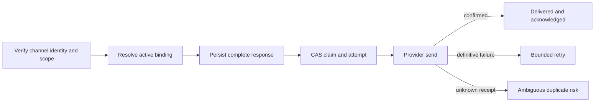

# Durable Conversation Delivery

This document defines verified principal-to-channel bindings, durable outbound reply delivery,
process-loss recovery, adapter health controls, and read-only reliability metrics. It applies to
web, Slack, Teams, and scheduled-result continuations without granting the console mutation
authority.

> A vendor sender id is routing evidence, not a principal id. Ambiguous provider receipt is a
> visible terminal state and is never retried automatically.

## Implementation status

### Implementation scope

| Area | State | Evidence | Notes |
|------|-------|----------|-------|
| Verified bindings and delivery context | implemented | [`principal_binding.py`](../../../services/core-control-plane/src/fdai/core/conversation/principal_binding.py), [`binding_delivery_context.py`](../../../services/core-control-plane/src/fdai/core/conversation/binding_delivery_context.py), [`test_principal_binding.py`](../../../services/core-control-plane/tests/conversation/test_principal_binding.py), [`test_binding_delivery_context.py`](../../../services/core-control-plane/tests/conversation/test_binding_delivery_context.py) | In-memory binding, explicit cross-channel resume, revocation, endpoint matching, and verified delivery-context resolution pass focused tests. No current PostgreSQL binding store or production composition is present. |
| Immutable delivery ledger and recovery coordinator | implemented | [`conversation_delivery.py`](../../../services/core-control-plane/src/fdai/shared/providers/conversation_delivery.py), [`outbound_delivery.py`](../../../services/core-control-plane/src/fdai/core/conversation/outbound_delivery.py), [`test_conversation_delivery.py`](../../../services/core-control-plane/tests/providers/test_conversation_delivery.py), [`test_outbound_delivery.py`](../../../services/core-control-plane/tests/conversation/test_outbound_delivery.py) | The in-memory store and coordinator enforce stable idempotency, CAS claims, bounded retry, terminal ambiguity, and stale-lease reconciliation in focused tests. This row does not claim restart durability. |
| Conversation gateway and typed progress replay | implemented | [`channel_gateway.py`](../../../services/core-control-plane/src/fdai/core/conversation/channel_gateway.py), [`test_channel_gateway.py`](../../../services/core-control-plane/tests/conversation/test_channel_gateway.py), [`test_rich_contract.py`](../../../services/core-control-plane/tests/delivery/channels/test_rich_contract.py) | The gateway persists one complete response through its durable-delivery boundary and isolates duplicate turns and delivery failures. Typed activity and progress payloads round-trip in focused tests. No production channel runtime binds this path. |
| PostgreSQL schema and production persistence | in-progress | [`20260720_0047_conversation_delivery.py`](../../../alembic/versions/20260720_0047_conversation_delivery.py) | The migration defines binding, delivery, attempt, acknowledgement, and breaker tables plus constraints and indexes. The current service tree has no PostgreSQL conversation-delivery or principal-binding store, database-backed focused test, or production binding. |
| Adapter health policy | implemented | [`adapter_health.py`](../../../services/core-control-plane/src/fdai/core/conversation/adapter_health.py), [`test_adapter_health.py`](../../../services/core-control-plane/tests/conversation/test_adapter_health.py) | Bounded failure windows, fail-closed breaker modes, authorized pause and resume, and authorized A2 fallback behavior pass focused in-memory tests. The separately authenticated command app is not implemented. |
| Scheduled delivery and read-only operations surfaces | in-progress | [`scheduled_continuation.py`](../../../services/core-control-plane/src/fdai/shared/providers/scheduled_continuation.py), [`continuation.py`](../../../services/core-control-plane/src/fdai/core/scheduler/continuation.py), [`conversation_delivery.py`](../../../services/core-control-plane/src/fdai/shared/providers/conversation_delivery.py) | Scheduled anchors and delivery/snapshot contracts exist. `ScheduledContinuationDeliveryCoordinator`, `ConversationDeliveryPanel`, adapter command routes, and production startup composition are absent from the current tree. |

### Implementation history

| Date | State | Change | Evidence | Remaining |
|------|-------|--------|----------|-----------|
| 2026-08-13 | in-progress | Adopted the implementation ledger and corrected production persistence, startup, command, scheduled-delivery, and operations-view claims to match the current service tree. | The 76 focused tests listed in the scope table passed. Repository search found no current production store, runtime composition, command route, scheduled delivery coordinator, or read panel. | Implement and bind the missing production surfaces, run database-backed checks, and capture governed runtime receipts. |

### Remaining work

- [ ] Implement PostgreSQL `ConversationDeliveryStore` and `PrincipalConversationBindingStore`
    adapters, add database-backed focused tests, and bind them in production composition.
- [ ] Compose a production channel runtime that invokes startup reconciliation before consumers and
    fails closed when required attachment or channel dependencies are unavailable.
- [ ] Add the separately authenticated `/commands/adapters/*` application with authorization,
    audit, and focused pause, resume, and status tests.
- [ ] Implement `ScheduledContinuationDeliveryCoordinator` for Slack and Teams with stable anchor
    origins and persisted-result replay tests.
- [ ] Implement the GET-only `ConversationDeliveryPanel` projection without mutation controls.
- [ ] Record governed runtime receipts for persistence across restart, process-loss reconciliation,
    external adapter acknowledgement, breaker control, scheduled delivery, and read-only metrics
    before promoting any row to `validated`.

## Design at a glance

FDAI persists the complete bounded response before a provider call. A worker claims that immutable
payload with compare-and-set (CAS), sends it once, and records either a confirmed acknowledgement,
a definitive failure eligible for bounded retry, or visible duplicate risk.


```mermaid
flowchart LR
    AUTH[Verify channel identity and scope] --> BIND[Resolve active binding]
    BIND --> STORE[Persist complete response]
    STORE --> CLAIM[CAS claim and attempt]
    CLAIM --> SEND[Provider send]
    SEND -->|confirmed| ACK[Delivered and acknowledged]
    SEND -->|definitive failure| RETRY[Bounded retry]
    SEND -->|unknown receipt| AMBIG[Ambiguous duplicate risk]
```

## Identity and binding

`VerifiedChannelEndpoint` keeps canonical identity and vendor routing identity separate:

- **Canonical principal**: an authenticated FDAI principal with an explicit authorization mapping.
- **Scope**: the narrow scope that the principal is authorized to access.
- **Vendor endpoint**: channel kind, channel id, sender id, and optional thread id.
- **Verification evidence**: an opaque mapping or Entra verification reference and timestamp.

Slack and Teams use `ChannelPrincipalAuthorizationMapping`; web uses its authenticated Entra
principal plus a distinct browser session reference. A hook rejects a mapping that returns the
vendor sender id as the principal id. Scope authorization is checked before a binding endpoint can
be created.

`PrincipalConversationBindingService` creates and revokes bindings with audit events. Cross-channel
resume is explicit, preserves one principal and scope, and references the source binding. It does
not merge unrelated threads. Delivery resolves an active binding by the complete verified endpoint;
a revoked or mismatched binding produces no delivery context.

## Delivery ledger

The delivery state machine is:

```text
pending -> sending -> delivered
                   -> failed -> sending
                   -> ambiguous
                   -> abandoned
```

The complete `OutboundResponse`, response digest, destination, operation, principal, scope,
conversation, binding, origin reference, freshness deadline, and retention deadline are stored
before send. The stable origin plus destination and operation derive one deterministic idempotency
key. Reusing that key with different response content is rejected.
Typed channel progress snapshots are part of that one immutable response. Durable replay validates
contiguous revisions, monotonic activity counts, and a final confirmed snapshot equal to the
canonical answer before a provider call. It never regenerates snapshots or reruns the coordinator.
Replay decoding rejects scalar coercion in agent activities. Booleans and integers retain their
JSON types, timestamps use RFC 3339 with a timezone, and completion cannot precede start.

The following states are immutable:

| State | Meaning | Automatic retry |
|-------|---------|-----------------|
| `delivered` | Provider returned a usable acknowledgement and FDAI stored it. | No |
| `ambiguous` | A send may have reached the provider, but local confirmation is unavailable. | No |
| `abandoned` | Attempts or freshness were exhausted after definitive failures. | No |

`failed` means the provider definitively did not accept the operation. Only this state and unsent
`pending` rows are claimable. Retries reuse the stored response and never invoke a model, tool,
background task, scheduled task, or response generator.

## PostgreSQL consistency

Alembic revision `20260720_0047` adds binding, delivery, attempt, acknowledgement, and adapter
breaker tables. The database enforces:

- Unique delivery idempotency keys and binding endpoint constraints.
- Due-row indexes for `pending` and `failed`, plus retention, latency, and duplicate-risk indexes.
- Row-lock CAS claims with `FOR UPDATE SKIP LOCKED` for concurrent workers.
- One attempt sequence per delivery and one acknowledgement per delivered record.
- A trigger that rejects updates to `delivered`, `ambiguous`, and `abandoned` rows.
- Retention deletion only after a terminal row reaches `retention_until`.

The in-memory implementation follows the same transition rules for deterministic tests. Production
must use PostgreSQL stores; those adapters and their production composition are not present in the
current service tree.

## Crash recovery

Production channel startup must reconcile the ledger before starting consumers. The coordinator
exposes the reconciliation operation, but the current tree has no production channel startup that
invokes it:

- when channel attachments are enabled, startup also requires a fully built production attachment
    ingestor; an enabled-but-unbound runtime fails before routes or consumers start;

1. Expired `sending` leases become `ambiguous` with `duplicate_risk=true` and `process_loss`.
2. Due `pending` and `failed` rows are claimed and sent within attempt, freshness, and batch caps.
3. Existing `ambiguous` rows remain untouched.

A crash before claim leaves a claimable `pending` response. Once claim creates a `sending` lease,
even a crash immediately before the provider call cannot prove whether send occurred, so startup
reconciliation conservatively exposes an `ambiguous` terminal row. Crashes during send, after
provider receipt, or before local acknowledgement have the same outcome.
FDAI does not claim exactly-once behavior from a provider that cannot support it.
The same rule applies after a progressive initial post: any later edit failure is `ambiguous`, even
when the provider returned a definitive error for that edit, because the first message is already
visible. The ledger never retries the complete response as another post.

## Adapter health

`AdapterHealthService` records bounded failure windows and opens a breaker at the configured
threshold. Open and manually paused adapters stop new claims. They never resume from a timer or a
successful probe; an authorized operator must explicitly resume them.

Fallback health notification is limited to authorized A2 operational-alert routes on another
adapter. A denied or failed fallback is audited. Fallback failure does not reopen delivery or grant
execution authority.

Pause, resume, and status commands must live in a separately authenticated channel command app
under `/commands/adapters/*`. That command app is not implemented and these controls must not be
mounted in the console Operator API.

## Conversation and scheduled integration

`ConversationChannelGateway` keeps inbound deduplication, protected attachment evidence, and thread
semantics from the shared conversation gateway. Attachment bytes complete governed ingestion before
response persistence; only citations enter the immutable response. See
[conversation-attachments.md](conversation-attachments.md). Duplicate webhooks or completions do
not rerun ingestion, the coordinator, or delivery.

If a downstream session or tool fails after governed attachment ingestion, the gateway keeps the
inbound claim and returns a generic error response. This prevents redelivery from creating another
document version for the same vendor message. Failures before attachment completion release the
claim and are isolated to one turn so the channel consumer continues.

A direct provider send, delivery-context lookup, or durable submit failure is also isolated to its
originating turn and emits a sanitized `delivery.submit` transition. It does not terminate the
channel receive loop or expose provider response text.

The planned `ScheduledContinuationDeliveryCoordinator` must submit external Slack and Teams results
with the stable anchor id as the origin. It must use the already persisted result summary, digest,
evidence, conversation reference, and thread mode. The coordinator is not implemented. Web
continuations remain idempotent conversation turns.

## Read-only operations view

The planned `ConversationDeliveryPanel` must be a GET-only `ReadPanel`. It must report:

- Delivery latency count, average, and p95.
- State counts, duplicate-risk count, retries, and abandonment.
- Attempt and acknowledgement counts.
- Adapter breaker state counts.
- Optional aggregate progressive-conversation counts and first-progress, first-confirmed, and branch
    latency when composition shares the bounded collector with Web or channel publishers.

Its payload must set `read_only=true` and `mutations_available=false`. The panel is not implemented,
and the console must expose no pause, resume, retry, duplicate-risk override, or resend control.

## Verification

Focused coverage includes crash before send, during send, after provider receipt, before local
acknowledgement, duplicate input and completion, concurrent claim, stale lease, cross-principal and
cross-scope denial, revoked authorization, breaker threshold, manual resume, fallback failure,
retry storm, and Slack/Teams post, edit, stream, reaction degradation.

## Related docs

| To learn about | Read |
|----------------|------|
| Conversation coordinator and tool authority | [Operator console](operator-console.md) |
| Channel trust and rich delivery | [Channels and notifications](channels-and-notifications.md) |
| Exact scheduled-run anchors | [Scheduled result continuations](scheduled-result-continuations.md) |
| Identity and least privilege | [Security and identity](../architecture/security-and-identity.md) |
