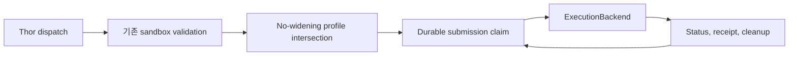

# 거버넌스 적용 실행 백엔드

이 문서는 이미 승인된 command 또는 task를 격리된 실행 venue에서 실행하는 provider-neutral
lifecycle을 정의합니다. Eligibility, 판단, 사람 승인, rollback, audit ownership은 backend 외부에
유지하면서 모든 submission에 영구적이고 제한된 lifecycle을 제공합니다.

> 새 profile은 disabled 상태로 시작합니다. Profile과 adapter는 selection 전에 shadow feasibility
> probe를 실행할 수 있지만, profile 존재만으로 capability가 promote되거나 enforcement가
> enable되지 않습니다.

> Azure Container Apps Job은 이 설계에서 유일하게 새로 추가하는 deployed backend입니다. 어떤
> profile도 promotion 후보가 되기 전에 live Azure evidence가 필요합니다.

## 한눈에 보는 설계

FDAI는 command 또는 task를 먼저 기존 sandbox catalog로 검증합니다. 그런 다음 검증된 authority와
불변 server-owned `ExecutionBackendProfile`의 교집합을 계산합니다. Backend는 effective request만
받아 lifecycle I/O를 수행하며, action 실행 여부를 결정하지 않습니다.

## Authority 경계

| 관심사 | 소유자 | Backend 역할 |
|--------|--------|--------------|
| Eligibility 및 action 판단 | Forseti, deterministic verifier, risk gate | Authority 없음 |
| 사람 승인 | Var 및 기존 approval path | 이미 승인된 dispatch만 소비 |
| Privileged dispatch | Thor | 모든 submission에 `owner_trace` evidence 유지 |
| Resource lock 및 blast radius | 기존 executor path | Lock 또는 blast-radius 결정 없음 |
| Rollback | Vidar 및 ActionType rollback contract | Lifecycle state만 보고하며 rollback을 선택하지 않음 |
| Audit durability | Saga 및 audit store | `audit_ref`를 운반하며 audit을 작성하거나 판단하지 않음 |
| Narration | Bragi | Credential, profile selection, execution 역할 없음 |

Mutation operation은 backend request가 생기기 전에 기존 risk decision, promotion state, approval,
resource lock, rollback availability, audit check를 계속 통과합니다. Backend 추가는 다섯 번째 execution
path를 만들지 않으며, 기존 governed path 뒤의 venue입니다.

## Provider-neutral protocol

`shared/providers/execution_backend.py`의 `ExecutionBackend`는 다음 async operation을 제공합니다.

- **`plan`**: 작업을 시작하지 않고 backend shape를 검증합니다.
- **`submit`**: idempotent plan 하나를 시작합니다.
- **`status`**: provider state를 reconcile합니다.
- **`cancel`**: bounded cancellation을 요청하고 race를 정직하게 보고합니다.
- **`collect_receipt`**: terminal provider evidence를 반환합니다.
- **`cleanup`**: 소유 artifact를 제거하거나 provider-retention 동작을 기록합니다.
- **`capabilities`**: authority를 부여하지 않고 lifecycle 지원을 보고합니다.
- **`health`**: reachable, degraded, unavailable 상태를 보고합니다.

모든 request에는 stable idempotency key, immutable artifact digest, Thor owner trace, stop condition,
audit reference, profile id와 version, region, scope가 필요합니다. Contract에는 raw credential field가
없습니다. Azure adapter는 injected `WorkloadIdentity`를 받으며 console 및 narrator principal은 request에
들어가지 않습니다.

## Server-owned profile

`ExecutionBackendProfile`은 frozen 및 versioned입니다. 다음 정보를 포함합니다.

- backend kind와 허용 command 또는 task id;
- workspace mode와 network profile;
- credential value가 아닌 credential profile reference;
- timeout, output, CPU, memory, ephemeral storage, concurrency ceiling;
- persistence mode, 허용 region과 scope, cancellation guarantee;
- Container Apps Job에만 server-owned template reference와 pinned image digest.

Profile document에는 `enabled` 또는 `promoted` field가 없습니다. Startup config가 별도 top-level
list에서 enabled profile id를 선택합니다. Unknown field, unknown enabled id, duplicate value, malformed
reference, missing adapter binding은 startup을 실패시킵니다.

## No-widening intersection

기존 `SandboxProfileCatalog`와 `VmTaskSandboxCatalog`는 계속 authoritative합니다. Adapter는 먼저 기존
`constrain` operation을 호출한 다음 `intersect_execution_profile`을 적용합니다. Backend profile은
workload id, network, credential ref, region, scope에서 validated authority의 subset이어야 합니다.
Workspace rank와 모든 numeric ceiling은 같거나 낮아야 합니다.

Request, generated task, installed skill, profile file, downstream distribution은 command, credential,
network path, writable workspace, resource allowance, region, scope를 추가할 수 없습니다. Widening
attempt는 provider I/O 전에 실패합니다.

## Durable lifecycle ledger

Alembic `0049`는 `execution_submission`과 `execution_submission_attempt`를 추가합니다. Submission row는
idempotency key로 식별하며 immutable request evidence, provider ref, status, cancellation intent, cleanup
state, retention deadline, CAS revision을 보존합니다. Attempt table은 submit, status, cancel, receipt,
cleanup attempt를 순서대로 유지합니다.

Coordinator는 다음 case를 처리합니다.

- **Duplicate submit 또는 restart**: 기존 ledger receipt를 반환하고 다시 submit하지 않습니다.
- **Submit transport loss**: `ambiguous`를 기록하며 성공으로 가정하거나 blind retry하지 않습니다.
- **Lost status**: terminal `ambiguous`를 기록해 autonomy가 fail closed하도록 합니다.
- **Timeout**: server-owned deadline이 만료되면 cancellation을 요청합니다.
- **Cancel race**: provider가 관측한 terminal success 또는 failure를 cancelled로 바꾸지 않습니다.
- **Cleanup**: terminal state 이후에만 실행하며 completed 또는 provider-retention cleanup을 기록합니다.

## Adapter 동작

### Bubblewrap local read

`BubblewrapExecutionBackend`는 기존 offline, credential-free, read-only workspace contract를 보존합니다.
Command catalog와 sandbox profile이 typed `CommandPlan`을 검증하며 backend profile은 timeout과 output
limit만 낮출 수 있습니다. Submit은 local process가 terminal이 된 뒤 반환하며 process timeout이 계속
cancellation mechanism입니다.

### Governed VM task

`VmTaskExecutionBackend`는 content-addressed Python task validation, declared capability check, target
opt-in, Managed Run Command lifecycle 동작을 보존합니다. Task timeout과 server-owned execution
envelope만 낮출 수 있습니다.

### Azure Container Apps Job

`AzureContainerAppsJobExecutionBackend`는 injected `WorkloadIdentity` 및 `httpx` client를 사용해 ARM
HTTPS로 pre-provisioned Job을 시작합니다. Request는 image, command, environment variable, credential을
제공할 수 없습니다. Adapter는 empty start body를 보내고 server-owned template map에서 Job resource를
resolve합니다.

Health discovery는 Job을 읽고 configured image가 expected pinned digest를 사용하는지 확인합니다.
Request는 bounded timeout, retry count, `Retry-After`, shared circuit breaker를 사용합니다. Status, stop,
receipt call은 ARM host와 Job execution path를 검증합니다.

Container Apps는 provider policy에 따라 execution metadata를 유지합니다. 따라서 cleanup은 terminal
또는 stop 동작을 확인하고 `provider_retention`을 기록합니다. Azure가 execution record를 삭제했다고
주장하지 않습니다.

## Cost 및 failure posture

- **Cost ceiling**: CPU, memory, ephemeral storage, concurrency, timeout, region은 server가 선택한 profile
  value입니다. Request는 이를 높일 수 없습니다.
- **Failure posture**: ambiguous submission 또는 status는 terminal이며 operator review가 필요합니다.
  Circuit-open health는 healthy-by-default가 아니라 unavailable입니다.
- **Cleanup posture**: local receipt를 release하고, VM Run Command resource는 기존 cancellation path로
  제거하며, Container Apps Job history는 provider retention을 따릅니다.
- **Retention**: ledger는 reconciliation 및 cleanup policy를 위한 server-owned deadline을 유지합니다.

## Shadow probe 및 promotion residual

Disabled profile은 `shadow_probe`를 통해 `health`, `capabilities`, `plan`을 실행할 수 있습니다. Probe는
ledger submission을 만들지 않고 `submit`을 호출하지 않습니다. Profile selection과 ActionType
promotion은 계속 별도 control입니다.

Azure Container Apps Job profile이 disabled shadow observation을 벗어나기 전에 identity scope, ARM
reachability, pinned-image health, duplicate start behavior, timeout 및 stop race, receipt completeness,
provider retention, measured cost에 대한 live evidence가 필요합니다. 이 evidence는 deployment follow-up으로
남아 있습니다. Unit test와 mock HTTP evidence는 promotion evidence로 계산하지 않습니다.

## Code map

| 책임 | 소스 | 테스트 |
|------|------|--------|
| Protocol 및 ledger record | `src/fdai/shared/providers/execution_backend.py` | provider 및 focused lifecycle test |
| Profile, registry, coordinator | `src/fdai/core/execution_backend/` | `tests/core/execution_backend/` |
| Bubblewrap 및 VM adapter | `src/fdai/delivery/execution_backend/` | `tests/delivery/execution_backend/` |
| Azure Container Apps Job | `src/fdai/delivery/azure/container_apps_job_backend.py` | `tests/delivery/azure/test_container_apps_job_backend.py` |
| PostgreSQL ledger | `src/fdai/delivery/persistence/postgres_execution_backend.py` | `tests/persistence/test_execution_backend_ledger.py` |
| Startup binding | `src/fdai/composition/wire_execution_backends.py` | `tests/composition/test_execution_backends.py` |

## 관련 문서

| 알아볼 내용 | 문서 |
|-------------|------|
| Eligibility, risk, executor path | [Execution 모델](../decisioning/execution-model-ko.md) |
| Identity 및 rollback ownership | [Security 및 Identity](../architecture/security-and-identity-ko.md) |
| Local 및 deployed parity | [Runtime Parity](../deployment/dev-and-deploy-parity-ko.md) |
| Module 및 composition 경계 | [프로젝트 구조](../architecture/project-structure-ko.md) |
