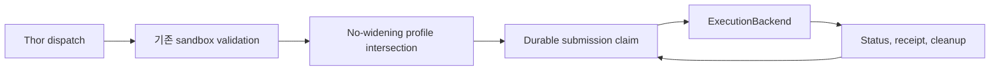

# 거버넌스 적용 실행 백엔드

이 문서는 이미 승인된 명령 또는 작업을 격리된 실행 venue에서 실행하는 프로바이더 중립적인
수명 주기를 정의합니다. 충족 여부, 판단, 사람 승인, 롤백, 감사 소유권은 백엔드 외부에
유지하면서 모든 제출에 영구적이고 제한된 수명 주기를 제공합니다.

> 새 프로파일은 비활성화된 상태로 시작합니다. 프로파일과 어댑터는 선택 전에 shadow feasibility
> 탐색을 실행할 수 있지만, 프로파일 존재만으로 기능이 promote되거나 적용이
> 활성화되지 않습니다.

> Azure Container Apps 작업은 이 설계에서 유일하게 새로 추가하는 deployed 백엔드입니다. 어떤
> 프로파일도 승격 후보가 되기 전에 실제 운영 Azure 근거가 필요합니다.

## 한눈에 보는 설계

FDAI는 명령 또는 작업을 먼저 기존 샌드박스 카탈로그로 검증합니다. 그런 다음 검증된 권한과
불변 서버가 소유한 `ExecutionBackendProfile`의 교집합을 계산합니다. 백엔드는 effective 요청만
받아 수명 주기 I/O를 수행하며, 액션 실행 여부를 결정하지 않습니다.

```mermaid
flowchart LR
    THOR[Thor dispatch] --> SANDBOX[기존 sandbox validation]
    SANDBOX --> INTERSECT[No-widening profile intersection]
    INTERSECT --> LEDGER[Durable submission claim]
    LEDGER --> BACKEND[ExecutionBackend]
    BACKEND --> STATUS[Status, receipt, cleanup]
    STATUS --> LEDGER
```

## 권한 경계

| 관심사 | 소유자 | 백엔드 역할 |
|--------|--------|--------------|
| 충족 여부 및 액션 판단 | Forseti, 결정론적 검증기, risk 게이트 | 권한 없음 |
| 사람 승인 | Var 및 기존 승인 경로 | 이미 승인된 전달만 소비 |
| Privileged 전달 | Thor | 모든 제출에 `owner_trace` 근거 유지 |
| Resource 잠금 및 영향 범위 | 기존 실행기 경로 | 잠금 또는 blast-radius 결정 없음 |
| Rollback | Vidar 및 ActionType 롤백 계약 | 수명 주기 상태만 보고하며 롤백을 선택하지 않음 |
| 감사 내구성 | Saga 및 감사 저장소 | `audit_ref`를 운반하며 감사를 작성하거나 판단하지 않음 |
| 서술 | Bragi | 자격 증명, 프로파일 선택, 실행 역할 없음 |

변경 연산은 백엔드 요청이 생기기 전에 기존 risk 결정, 승격 상태, 승인,
리소스 잠금, 롤백 가용성, 감사 검사를 계속 통과합니다. 백엔드 추가는 다섯 번째 실행
경로를 만들지 않으며, 기존 통제된 경로 뒤의 venue입니다.

## 프로바이더 중립적인 프로토콜

`shared/providers/execution_backend.py`의 `ExecutionBackend`는 다음 비동기 연산을 제공합니다.

- **`plan`**: 작업을 시작하지 않고 백엔드 형태를 검증합니다.
- **`submit`**: 멱등적 계획 하나를 시작합니다.
- **`status`**: 프로바이더 상태를 조정합니다.
- **`cancel`**: 범위가 제한된 취소를 요청하고 race를 정직하게 보고합니다.
- **`collect_receipt`**: 최종 프로바이더 근거를 반환합니다.
- **`cleanup`**: 소유 산출물을 제거하거나 provider-retention 동작을 기록합니다.
- **`capabilities`**: 권한을 부여하지 않고 수명 주기 지원을 보고합니다.
- **`health`**: reachable, degraded, 사용 불가 상태를 보고합니다.

모든 요청에는 고정된 멱등성 키, 변경할 수 없는 산출물 다이제스트, Thor 소유자 추적, stop 조건,
감사 참조, 프로파일 id와 버전, 지역, 범위가 필요합니다. 계약에는 raw 자격 증명 필드가
없습니다. Azure 어댑터는 injected `WorkloadIdentity`를 받으며 콘솔 및 서술기 principal은 요청에
들어가지 않습니다.

## 서버가 소유한 프로파일

`ExecutionBackendProfile`은 고정된 및 versioned입니다. 다음 정보를 포함합니다.

- 백엔드 종류와 허용 명령 또는 작업 id;
- workspace 모드와 네트워크 프로파일;
- 자격 증명 값이 아닌 자격 증명 프로파일 참조;
- 시간 초과, 출력, CPU, 기억, 일시적인 저장소, 동시성 상한;
- 영속성 모드, 허용 지역과 범위, 취소 guarantee;
- Container Apps 작업에만 서버가 소유한 템플릿 참조와 pinned 이미지 다이제스트.

프로파일 문서에는 `enabled` 또는 `promoted` 필드가 없습니다. 시작 구성이 별도 top-level
목록에서 활성화된 프로파일 id를 선택합니다. 알 수 없음 필드, 알 수 없음 활성화된 id, 중복 값, malformed
참조, 누락된 어댑터 연결은 시작을 실패시킵니다.

## No-widening intersection

기존 `SandboxProfileCatalog`와 `VmTaskSandboxCatalog`는 계속 권위를 가집니다. 어댑터는 먼저 기존
`constrain` 연산을 호출한 다음 `intersect_execution_profile`을 적용합니다. 백엔드 프로파일은
워크로드 id, 네트워크, 자격 증명 참조, 지역, 범위에서 검증된 권한의 subset이어야 합니다.
Workspace 순위와 모든 numeric 상한은 같거나 낮아야 합니다.

요청, 생성된 작업, installed 스킬, 프로파일 파일, 다운스트림 분포는 명령, 자격 증명,
네트워크 경로, writable workspace, 리소스 allowance, 지역, 범위를 추가할 수 없습니다. Widening
시도는 프로바이더 I/O 전에 실패합니다.

## 영속 수명 주기 원장

Alembic `0049`는 `execution_submission`과 `execution_submission_attempt`를 추가합니다. 제출 행은
멱등성 키로 식별하며 변경할 수 없는 요청 근거, 프로바이더 참조, 상태, 취소 의도, 정리
상태, 보존 기한, CAS 개정 번호를 보존합니다. 시도 표는 제출, 상태, 취소, 증적,
정리 시도를 순서대로 유지합니다.

조정기는 다음 사례를 처리합니다.

- **중복 제출 또는 재시작**: 기존 원장 증적을 반환하고 다시 제출하지 않습니다.
- **재시작 후 프로파일 누락**: 상태, 취소, 증적, 정리에 원장이 기록한 exact 프로파일
  id와 버전을 요구합니다. 프로파일이 없거나 변경되면 `ambiguous`를 기록하고 프로바이더 수명 주기
  호출을 수행하지 않습니다.
- **제출 전송 계층 loss**: `ambiguous`를 기록하며 성공으로 가정하거나 blind 재시도하지 않습니다.
- **Lost 상태**: 최종 `ambiguous`를 기록해 자율성이 실패 시 차단하도록 합니다.
- **시간 초과**: 서버가 소유한 기한이 만료되면 취소를 요청합니다.
- **취소 race**: 프로바이더가 관측한 최종 성공 또는 실패를 취소된으로 바꾸지 않습니다.
- **정리**: 최종 상태 이후에만 실행하며 completed 또는 provider-retention 정리를 기록합니다.

## 어댑터 동작

### Bubblewrap 로컬 읽기

`BubblewrapExecutionBackend`는 기존 offline, credential-free, 읽기 전용 workspace 계약을 보존합니다.
Command 카탈로그와 샌드박스 프로파일이 타입이 지정된 `CommandPlan`을 검증하며 백엔드 프로파일은 시간 초과와 출력
한도만 낮출 수 있습니다. 제출은 로컬 프로세스가 최종이 된 뒤 반환하며 프로세스 시간 초과가 계속
취소 방식입니다.

### 통제된 VM 작업

`VmTaskExecutionBackend`는 내용 기반 주소를 가진 Python 작업 검증, declared 기능 검사, 대상
명시적 선택, Managed Run Command 수명 주기 동작을 보존합니다. 작업 시간 초과와 서버가 소유한 실행
묶음만 낮출 수 있습니다.

### Azure Container Apps 작업

`AzureContainerAppsJobExecutionBackend`는 injected `WorkloadIdentity` 및 `httpx` 클라이언트를 사용해 ARM
HTTPS로 pre-provisioned 작업을 시작합니다. 요청은 이미지, 명령, 환경 variable, 자격 증명을
제공할 수 없습니다. 어댑터는 빈 시작 본문을 보내고 서버가 소유한 템플릿 지도에서 작업 리소스를
해석합니다.

Health 발견은 작업을 읽고 구성된 이미지가 예상 pinned 다이제스트를 사용하는지 확인합니다.
요청은 범위가 제한된 시간 초과, 재시도 개수, `Retry-After`, shared circuit 차단기를 사용합니다. 상태, stop,
증적 호출은 ARM 호스트와 작업 실행 경로를 검증합니다.

Container Apps는 프로바이더 정책에 따라 실행 메타데이터를 유지합니다. 따라서 정리는 최종
또는 stop 동작을 확인하고 `provider_retention`을 기록합니다. Azure가 실행 기록을 삭제했다고
주장하지 않습니다.

## 비용 및 실패 자세

- **비용 상한**: CPU, 기억, 일시적인 저장소, 동시성, 시간 초과, 지역은 서버가 선택한 프로파일
  값입니다. 요청은 이를 높일 수 없습니다.
- **실패 자세**: 모호한 제출 또는 상태는 최종이며 운영자 검토가 필요합니다.
  Circuit-open 상태는 healthy-by-default가 아니라 사용 불가입니다.
- **정리 자세**: 로컬 증적을 release하고, VM Run Command 리소스는 기존 취소 경로로
  제거하며, Container Apps 작업 이력은 프로바이더 보존을 따릅니다.
- **보존**: 원장은 조정 및 정리 정책을 위한 서버가 소유한 기한을 유지합니다.

## Shadow 탐색 및 승격 잔여

비활성화된 프로파일은 `shadow_probe`를 통해 `health`, `capabilities`, `plan`을 실행할 수 있습니다. 탐색은
원장 제출을 만들지 않고 `submit`을 호출하지 않습니다. 프로파일 선택과 ActionType
승격은 계속 별도 컨트롤입니다.

Azure Container Apps 작업 프로파일이 비활성화된 shadow 관측을 벗어나기 전에 신원 범위, ARM
도달 가능성, pinned-image 상태, 중복 시작 행동, 시간 초과 및 stop race, 증적 완전성,
프로바이더 보존, measured 비용에 대한 실제 운영 근거가 필요합니다. 이 근거는 배포 후속 조치로
남아 있습니다. 단위 테스트와 mock HTTP 근거는 승격 근거로 계산하지 않습니다.

## 코드 지도

| 책임 | 소스 | 테스트 |
|------|------|--------|
| 프로토콜 및 원장 기록 | `services/core-control-plane/src/fdai/shared/providers/execution_backend.py` | 프로바이더 및 focused 수명 주기 테스트 |
| 프로파일, 레지스트리, 조정기 | `services/core-control-plane/src/fdai/core/execution_backend/` | `services/core-control-plane/tests/core/execution_backend/` |
| Bubblewrap 및 VM 어댑터 | `services/core-control-plane/src/fdai/delivery/execution_backend/` | `services/core-control-plane/tests/delivery/execution_backend/` |
| Azure Container Apps 작업 | `services/core-control-plane/src/fdai/delivery/azure/container_apps_job_backend.py` | `services/core-control-plane/tests/delivery/azure/test_container_apps_job_backend.py` |
| PostgreSQL 원장 | `services/core-control-plane/src/fdai/delivery/persistence/postgres_execution_backend.py` | `services/core-control-plane/tests/persistence/test_execution_backend_ledger.py` |
| 시작 연결 | `services/core-control-plane/src/fdai/composition/wire_execution_backends.py` | `services/core-control-plane/tests/composition/test_execution_backends.py` |

## 관련 문서

| 알아볼 내용 | 문서 |
|-------------|------|
| 충족 여부, risk, 실행기 경로 | [실행 모델](../decisioning/execution-model-ko.md) |
| 신원 및 롤백 소유권 | [Security 및 신원](../architecture/security-and-identity-ko.md) |
| 로컬 및 deployed 동등성 | [런타임 동등성](../deployment/dev-and-deploy-parity-ko.md) |
| 모듈 및 조립 경계 | [프로젝트 구조](../architecture/project-structure-ko.md) |
