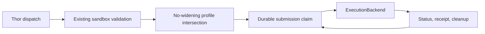

# Governed Execution Backends

This document defines the provider-neutral lifecycle used to run an already-approved command or
task on an isolated execution venue. It keeps eligibility, judgment, human approval, rollback, and
audit ownership outside the backend while giving every submission a durable, bounded lifecycle.

> New profiles start disabled. A profile and adapter can run shadow feasibility probes before
> selection, but profile presence never promotes a capability or enables enforcement.

> Azure Container Apps Job is the only new deployed backend in this design. Live Azure evidence is
> still required before any profile can be considered for promotion.

## Design at a glance

FDAI validates a command or task against its existing sandbox catalog first. It then intersects the
validated authority with an immutable server-owned `ExecutionBackendProfile`. The backend receives
only the effective request and performs lifecycle I/O. It never decides whether the action should
run.

## Authority boundary

| Concern | Owner | Backend role |
|---------|-------|--------------|
| Eligibility and action judgment | Forseti, deterministic verifier, risk gate | No authority |
| Human approval | Var and the existing approval path | Consumes already-approved dispatch only |
| Privileged dispatch | Thor | Retains `owner_trace` evidence on every submission |
| Resource lock and blast radius | Existing executor path | No lock or blast-radius decision |
| Rollback | Vidar and the ActionType rollback contract | Reports lifecycle state; never selects rollback |
| Audit durability | Saga and the audit store | Carries an `audit_ref`; never writes or judges audit |
| Narration | Bragi | No credential, profile-selection, or execution role |

Mutation operations still pass the existing risk decision, promotion state, approval, resource
lock, rollback availability, and audit checks before a backend request exists. Adding a backend
does not create a fifth execution path. It is a venue behind an existing governed path.

## Provider-neutral protocol

`ExecutionBackend` in `shared/providers/execution_backend.py` exposes these asynchronous
operations:

- **`plan`**: validates backend shape without starting work.
- **`submit`**: starts one idempotent plan.
- **`status`**: reconciles provider state.
- **`cancel`**: requests bounded cancellation and reports races honestly.
- **`collect_receipt`**: returns terminal provider evidence.
- **`cleanup`**: removes owned artifacts or records provider-retention behavior.
- **`capabilities`**: reports lifecycle support without granting authority.
- **`health`**: reports reachable, degraded, or unavailable state.

Every request requires a stable idempotency key, immutable artifact digest, Thor owner trace, stop
condition, audit reference, profile id and version, region, and scope. The contract has no raw
credential field. Azure adapters receive an injected `WorkloadIdentity`; console and narrator
principals never enter the request.

## Server-owned profiles

An `ExecutionBackendProfile` is frozen and versioned. It contains:

- backend kind and allowed command or task ids;
- workspace mode and network profiles;
- credential profile references, never credential values;
- timeout, output, CPU, memory, ephemeral storage, and concurrency ceilings;
- persistence mode, allowed regions and scopes, and cancellation guarantee; and
- for Container Apps Job only, a server-owned template reference and pinned image digest.

Profile documents have no `enabled` or `promoted` field. Startup config selects enabled profile ids
in a separate top-level list. Unknown fields, unknown enabled ids, duplicate values, malformed
references, or missing adapter bindings fail startup.

## No-widening intersection

The existing `SandboxProfileCatalog` and `VmTaskSandboxCatalog` remain authoritative. Adapters first
call their existing `constrain` operation, then apply `intersect_execution_profile`. The backend
profile must be a subset of the validated authority for workload ids, network, credential refs,
region, and scope. Workspace rank and every numeric ceiling must be equal or lower.

A request, generated task, installed skill, profile file, or downstream distribution cannot add a
command, credential, network path, writable workspace, resource allowance, region, or scope. A
widening attempt fails before provider I/O.

## Durable lifecycle ledger

Alembic `0049` adds `execution_submission` and `execution_submission_attempt`. The submission row
is keyed by idempotency key and preserves immutable request evidence, provider refs, status,
cancellation intent, cleanup state, retention deadline, and a CAS revision. The attempt table keeps
ordered submit, status, cancel, receipt, and cleanup attempts.

The coordinator handles these cases:

- **Duplicate submit or restart**: returns the existing ledger receipt and does not re-submit.
- **Submit transport loss**: records `ambiguous`; it does not assume success or retry blindly.
- **Lost status**: records terminal `ambiguous` so autonomy fails closed.
- **Timeout**: requests cancellation when the server-owned deadline expires.
- **Cancel race**: preserves a provider-observed terminal success or failure instead of rewriting it
  as cancelled.
- **Cleanup**: runs only after terminal state and records completed or provider-retention cleanup.

## Adapter behavior

### Bubblewrap local read

`BubblewrapExecutionBackend` preserves the existing offline, credential-free, read-only workspace
contract. The command catalog and sandbox profile validate the typed `CommandPlan`; the backend
profile can only lower timeout and output limits. Submit returns after the local process is
terminal, and process timeout remains the cancellation mechanism.

### Governed VM task

`VmTaskExecutionBackend` preserves content-addressed Python task validation, declared capability
checks, target opt-in, and Managed Run Command lifecycle behavior. It can only lower the task
timeout and the server-owned execution envelope.

### Azure Container Apps Job

`AzureContainerAppsJobExecutionBackend` starts a pre-provisioned Job through ARM HTTPS using an
injected `WorkloadIdentity` and `httpx` client. The request cannot supply an image, command,
environment variable, or credential. The adapter sends an empty start body and resolves the Job
resource from a server-owned template map.

Health discovery reads the Job and verifies that its configured image uses the expected pinned
digest. Requests use bounded timeout, retry count, `Retry-After`, and the shared circuit breaker.
Status, stop, and receipt calls validate the ARM host and Job execution path.

Container Apps retains execution metadata according to provider policy. Cleanup therefore confirms
terminal or stop behavior and records `provider_retention`; it does not claim that Azure deleted an
execution record.

## Cost and failure posture

- **Cost ceiling**: CPU, memory, ephemeral storage, concurrency, timeout, and region are profile
  values selected by the server. A request cannot raise them.
- **Failure posture**: ambiguous submission or status is terminal and requires operator review.
  Circuit-open health is unavailable, not healthy-by-default.
- **Cleanup posture**: local receipts are released, VM Run Command resources are removed through
  the existing cancellation path, and Container Apps Job history follows provider retention.
- **Retention**: the ledger keeps a server-owned deadline for reconciliation and cleanup policy.

## Shadow probes and promotion residual

Disabled profiles may run `health`, `capabilities`, and `plan` through `shadow_probe`. The probe does
not create a ledger submission and never calls `submit`. Profile selection and ActionType promotion
remain separate controls.

Before an Azure Container Apps Job profile can move beyond disabled shadow observation, operators
still need live evidence for identity scope, ARM reachability, pinned-image health, duplicate start
behavior, timeout and stop races, receipt completeness, provider retention, and measured cost. That
evidence remains deployment follow-up; unit tests and mock HTTP evidence do not count as promotion
evidence.

## Code map

| Responsibility | Source | Tests |
|----------------|--------|-------|
| Protocol and ledger records | `src/fdai/shared/providers/execution_backend.py` | provider and focused lifecycle tests |
| Profiles, registry, coordinator | `src/fdai/core/execution_backend/` | `tests/core/execution_backend/` |
| Bubblewrap and VM adapters | `src/fdai/delivery/execution_backend/` | `tests/delivery/execution_backend/` |
| Azure Container Apps Job | `src/fdai/delivery/azure/container_apps_job_backend.py` | `tests/delivery/azure/test_container_apps_job_backend.py` |
| PostgreSQL ledger | `src/fdai/delivery/persistence/postgres_execution_backend.py` | `tests/persistence/test_execution_backend_ledger.py` |
| Startup binding | `src/fdai/composition/wire_execution_backends.py` | `tests/composition/test_execution_backends.py` |

## Related docs

| To learn about | Read |
|----------------|------|
| Eligibility, risk, and executor paths | [Execution Model](../decisioning/execution-model.md) |
| Identity and rollback ownership | [Security and Identity](../architecture/security-and-identity.md) |
| Local and deployed parity | [Runtime Parity](../deployment/dev-and-deploy-parity.md) |
| Module and composition boundaries | [Project Structure](../architecture/project-structure.md) |
