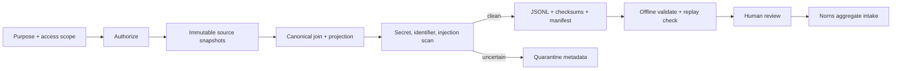

# 관리형 Trajectory 데이터셋

이 문서는 FDAI가 관찰 가능한 런타임 레코드를 버전이 지정되고 접근 범위가 제한된
trajectory 데이터셋으로 조인하여 오프라인 품질 검토에 사용하는 방식을 정의합니다. 이 계약은
실패와 원본 provenance를 보존하면서 숨겨진 추론, 제한 없는 payload, credential을 제외합니다.

> Trajectory export는 증적 작업이며 학습이나 promotion 작업이 아닙니다. 콘솔은 읽기 전용으로
> 유지되며, Norns는 명시적으로 검토된 aggregate만 받습니다.

## 한눈에 보는 설계

Export 경로는 원본 provider를 호출하기 전에 principal, purpose, access scope를 승인합니다. 이후
immutable source snapshot을 canonical 순서로 조인하고, 모든 projection record를 스캔하고,
deterministic JSONL을 스트리밍한 다음 데이터 파일과 manifest가 모두 완료된 경우에만 게시합니다.

## 안정적인 envelope

Schema version `1.0`은 현재 write version입니다. Reader는 `TrajectoryVersionPolicy`에 명시된
version만 허용하며, readable version은 현재 major version을 공유합니다. Writer는 항상 현재
version을 내보내고 offline validation은 지원되지 않는 manifest나 record를 차단합니다.

각 `TrajectoryEnvelope`에는 다음 정보가 포함됩니다.

| 필드 그룹 | 필수 데이터 |
|-----------|-------------|
| Identity | Schema version, trajectory id, trace id, correlation id |
| Time | Timezone-aware 시작 및 완료 timestamp |
| Runtime | Environment, evidence profile, model capability id |
| Access | Principal-scope SHA-256 digest. Credential이나 token은 포함하지 않음 |
| Completion | `completed`, `failed`, `cancelled`, `timed_out`, `abstained`, `ambiguous` 중 하나 |
| Governance | Purpose, retention, deletion due date, legal-hold state와 reference |
| Redaction | Projection에 사용한 redaction-policy version |
| Provenance | 정렬된 immutable source record id와 SHA-256 digest |
| Observations | 연속된 zero-based step과 catalog-shaped tool statistics |

마지막 step은 항상 `completion_status`와 일치하는 `terminal_outcome` 하나입니다. 실패, 취소,
timeout, abstain, ambiguous 실행은 first-class record로 유지되며 성공 지표를 높이기 위해
export에서 제거하지 않습니다.

## 관찰 가능한 step

Projection은 다음 step kind만 허용합니다.

- `normalized_input_reference`
- `routing_decision`
- `assistant_output`
- `tool_request` 및 `tool_receipt`
- `action_request` 및 `action_receipt`
- `verifier_result` 및 `risk_result`
- `approval`
- `terminal_outcome`
- `rollback_state`

각 kind에는 4 KiB에서 16 KiB 사이의 자체 byte cap이 있습니다. Source provider는 raw record
body가 아니라 bounded excerpt 또는 reference를 반환합니다. Recursive payload validation은 숨겨진
추론, chain-of-thought, raw prompt, credential, token, authorization header, 제한 없는 tool output,
raw cloud payload, attachment를 차단합니다. JSON이 아닌 값과 oversized excerpt는 fail closed 됩니다.

Tool statistics는 server-owned 전체 tool catalog에서 생성합니다. 사용량이 0인 tool을 포함해 모든
catalog tool에 lexical order column 하나를 부여하므로 batch 사이에서 column이 이동하지 않습니다.
Catalog에 없는 observed tool은 projection을 차단합니다.

## Source provider와 authorization

`shared/providers/trajectory.py`는 audit, conversation, tool, approval, terminal-outcome source를
위한 별도 async snapshot Protocol을 정의합니다. 각 provider는 source digest가 있는 frozen
metadata를 반환합니다. Provider implementation은 기존 authority와 storage model을 유지하며,
trajectory join은 새로운 system of record가 되지 않습니다.

`TrajectoryJoinService`는 먼저 `TrajectoryAccessAuthorizer.authorize(principal_id,
access_scope, purpose)`를 호출합니다. Authorization이 성공하기 전에는 provider method가 실행되지
않습니다. 기본 allowlist authorizer는 알 수 없는 principal/scope/purpose 조합을 차단하고 scope
digest를 계산합니다. Deployment는 core projection logic을 바꾸지 않고 policy-backed authorizer를
주입할 수 있습니다.

Batch filter는 명시적이며 server-side에서 적용합니다.

- timezone-aware 시작 및 종료 시간
- vertical
- action type
- tier
- terminal outcome
- evidence profile

## Deterministic export

`TrajectoryJsonlExporter`는 gitignored `.trajectory.jsonl` filename을 요구하고 canonical
sorted-key JSON을 `.partial` sibling에 씁니다. 각 JSONL
line은 record 하나와 SHA-256 checksum을 감쌉니다. Exporter는 정확한 line byte를 dataset
checksum으로 hash하고 dataset id, schema version, purpose, scope digest, record count, outcome
count, dataset checksum, manifest checksum이 포함된 별도 canonical manifest를 씁니다.

Data와 manifest는 둘 다 완료된 후에만 최종 위치로 rename됩니다. Cancellation, exception, empty
dataset, quarantine finding이 있으면 partial file을 제거합니다. Exporter는 부분적으로 신뢰된
dataset을 final path에 쓰지 않습니다. 각 record는 current schema를 사용하고 첫 byte가 허용되기
전에 request의 purpose 및 authorized scope digest와 일치해야 합니다.

Scanner는 record에서 불확실한 secret pattern, placeholder가 아닌 identifier, resource id,
example이 아닌 email address, prompt-injection marker를 찾으면 dataset을 quarantine합니다.
Quarantine store에는 finding code와 trajectory identity만 저장하며 일치한 민감 값을 반복하지
않습니다.

## Offline validation과 replay

`validate_export`는 network나 cloud credential 없이 실행됩니다. 다음 조건을 차단합니다.

- 누락, empty, malformed, unsupported-version export
- record, dataset, manifest checksum 불일치
- manifest와 다른 record 및 outcome count
- 연속되지 않은 step 순서 또는 여러 개이거나 누락된 terminal outcome
- canonical이 아닌 trajectory 순서 또는 중복 trajectory identity
- envelope source map에 없는 step source digest
- 현재 redaction 및 excerpt policy와 호환되지 않는 payload

`replay_check`는 judge-only입니다. Mapping과 순서만 검증하며 tool, action, training job,
promotion, executor를 호출하지 않습니다.

## Retention과 legal hold

Alembic revision `20260720_0048`은 exported record body가 아니라 dataset metadata와
quarantine code를 저장합니다. `TrajectoryRetentionService`는 injected provider로 artifact를
삭제한 뒤 storage reference를 지우고 metadata를 deleted로 표시합니다. Provider 실패 시 metadata는
재시도 가능하게 남습니다. 두 store는 legal hold를 제외하고 tombstone commit 시 hold를 재검사합니다.

Customer-scoped JSONL과 manifest는 runtime artifact입니다. Exporter가 강제하는 suffix는
Git에서 ignore되며 이 저장소에 commit하지 않습니다.

## 관리 surface

Read API는 선택적으로 Owner-only GET route를 등록합니다.

- `GET /admin/trajectory-datasets?purpose=...&access_scope=...`
- `GET /admin/trajectory-datasets/{dataset_id}?purpose=...&access_scope=...`

두 parameter는 모두 필수입니다. Scope denial은 not found를 반환하고 response는 storage path를
제외합니다. POST는 등록하지 않습니다. Response에는 training과 promotion action이 제공되지
않는다는 점이 명시됩니다.

`fdaictl trajectory validate`에는 `--dataset`, `--manifest`, `--purpose`,
`--access-scope`가 필요합니다. 동일한 offline validator와 replay check를 수행한 다음 manifest의
purpose 및 scope digest가 operator request와 일치하는지 검증합니다.

## Norns 경계

Norns는 human review receipt, manifest checksum, outcome count, tool request count가 포함된
`ReviewedTrajectoryDataset`만 받습니다. Raw trajectory record는 받지 않습니다. 소비는 digest로
deduplicate되고 behavior telemetry만 기록합니다. 자체적으로 candidate를 만들지 않으며 자동
training 또는 promotion 경로가 없습니다. 이후 proposal이 생기더라도 inert 상태를 유지하고 기존
Norns-to-Mimir quality gate를 사용합니다.

## Code와 test

| 책임 | 위치 |
|------|------|
| Envelope, projection, review, validation | `src/fdai/core/trajectory/` |
| Source 및 dataset provider contract | `src/fdai/shared/providers/trajectory.py` |
| JSONL exporter 및 scanner quarantine | `src/fdai/delivery/trajectory/` |
| PostgreSQL metadata adapter | `src/fdai/delivery/persistence/postgres_trajectory.py` |
| 읽기 전용 admin route | `src/fdai/delivery/read_api/routes/trajectory_datasets.py` |
| Offline CLI | `src/fdai/deployment_cli/trajectory.py` |
| Migration | `alembic/versions/20260720_0048_trajectory_dataset.py` |
| Golden test | `tests/core/trajectory/`, `tests/delivery/trajectory/` |

## 관련 문서

| 알아볼 내용 | 문서 |
|-------------|------|
| Module 및 DI 경계 | [프로젝트 구조](../architecture/project-structure-ko.md) |
| 읽기 전용 operator surface | [오퍼레이터 콘솔](operator-console-ko.md) |
| Norns 역할과 권한 | [에이전트 판테온](../agents/agent-pantheon-ko.md) |
| Audit 및 identity control | [보안 및 ID](../architecture/security-and-identity-ko.md) |
