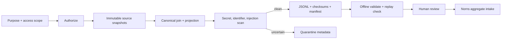

# 관리형 Trajectory 데이터셋

이 문서는 FDAI가 관찰 가능한 런타임 레코드를 버전이 지정되고 접근 범위가 제한된
trajectory 데이터셋으로 조인하여 오프라인 품질 검토에 사용하는 방식을 정의합니다. 이 계약은
실패와 원본 출처 이력을 보존하면서 숨겨진 추론, 제한 없는 페이로드, 자격 증명을 제외합니다.

> Trajectory 내보내기는 증적 작업이며 학습이나 승격 작업이 아닙니다. 콘솔은 읽기 전용으로
> 유지되며, Norns는 명시적으로 검토된 집계만 받습니다.

## 한눈에 보는 설계

내보내기 경로는 원본 프로바이더를 호출하기 전에 principal, 용도, 접근 범위를 승인합니다. 이후
변경할 수 없는 출처 스냅샷을 정본 순서로 조인하고, 모든 변환 결과 기록을 스캔하고,
결정론적 JSONL을 스트리밍한 다음 데이터 파일과 매니페스트가 모두 완료된 경우에만 게시합니다.

```mermaid
flowchart LR
  REQUEST[Purpose + access scope] --> AUTH[Authorize]
  AUTH --> SOURCES[Immutable source snapshots]
  SOURCES --> JOIN[Canonical join + projection]
  JOIN --> SCAN[Secret, identifier, injection scan]
  SCAN -->|clean| EXPORT[JSONL + checksums + manifest]
  SCAN -->|uncertain| QUARANTINE[Quarantine metadata]
  EXPORT --> VALIDATE[Offline validate + replay check]
  VALIDATE --> REVIEW[Human review]
  REVIEW --> NORNS[Norns aggregate intake]
```

## 안정적인 묶음

스키마 버전 `1.0`은 현재 쓰기 버전입니다. Reader는 `TrajectoryVersionPolicy`에 명시된
버전만 허용하며, readable 버전은 현재 major 버전을 공유합니다. Writer는 항상 현재
버전을 내보내고 offline 검증은 지원되지 않는 매니페스트나 기록을 차단합니다.

각 `TrajectoryEnvelope`에는 다음 정보가 포함됩니다.

| 필드 그룹 | 필수 데이터 |
|-----------|-------------|
| 신원 | 스키마 버전, trajectory id, trace id, 상관관계 id |
| 시간 | Timezone-aware 시작 및 완료 시각 |
| 런타임 | 환경, 근거 프로파일, 모델 기능 id |
| 접근 | Principal-scope SHA-256 다이제스트. 자격 증명이나 토큰은 포함하지 않음 |
| 완료 | `completed`, `failed`, `cancelled`, `timed_out`, `abstained`, `ambiguous` 중 하나 |
| Governance | 용도, 보존, deletion due date, legal-hold 상태와 참조 |
| 민감정보 제거 | 변환 결과에 사용한 redaction-policy 버전 |
| 출처 이력 | 정렬된 변경할 수 없는 출처 기록 id와 SHA-256 다이제스트 |
| Observations | 연속된 zero-based 단계와 catalog-shaped 도구 통계 |

마지막 단계는 항상 `completion_status`와 일치하는 `terminal_outcome` 하나입니다. 실패, 취소,
시간 초과, abstain, 모호한 실행은 일급 기록으로 유지되며 성공 지표를 높이기 위해
내보내기에서 제거하지 않습니다.

## 관찰 가능한 단계

변환 결과는 다음 단계 kind만 허용합니다.

- `normalized_input_reference`
- `routing_decision`
- `assistant_output`
- `tool_request` 및 `tool_receipt`
- `action_request` 및 `action_receipt`
- `verifier_result` 및 `risk_result`
- `approval`
- `terminal_outcome`
- `rollback_state`

각 kind에는 4 KiB에서 16 KiB 사이의 자체 바이트 상한이 있습니다. 출처 프로바이더는 raw 기록
본문이 아니라 범위가 제한된 excerpt 또는 참조를 반환합니다. 재귀 페이로드 검증은 숨겨진
추론, 추론 과정, raw 프롬프트, 자격 증명, 토큰, 권한 확인 헤더, 제한 없는 도구 출력,
raw cloud 페이로드, 첨부를 차단합니다. JSON이 아닌 값과 oversized excerpt는 실패 시 차단 됩니다.

도구 통계는 서버가 소유한 전체 도구 카탈로그에서 생성합니다. 사용량이 0인 도구를 포함해 모든
카탈로그 도구에 lexical order 열 하나를 부여하므로 배치 사이에서 열이 이동하지 않습니다.
카탈로그에 없는 관찰된 도구는 변환 결과를 차단합니다.

## 출처 프로바이더와 권한 확인

`shared/providers/trajectory.py`는 감사, 대화, 도구, 승인, terminal-outcome 출처를
위한 별도 비동기 스냅샷 프로토콜을 정의합니다. 각 프로바이더는 출처 다이제스트가 있는 고정된
메타데이터를 반환합니다. 프로바이더 구현은 기존 권한과 저장소 모델을 유지하며,
trajectory 결합은 새로운 system of 기록이 되지 않습니다.

`TrajectoryJoinService`는 먼저 `TrajectoryAccessAuthorizer.authorize(principal_id,
access_scope, 용도)`를 호출합니다. 권한 확인이 성공하기 전에는 프로바이더 메서드가 실행되지
않습니다. 기본 허용 목록 authorizer는 알 수 없는 principal/범위/용도 조합을 차단하고 범위
다이제스트를 계산합니다. 배포는 코어 변환 결과 logic을 바꾸지 않고 policy-backed authorizer를
주입할 수 있습니다.

배치 필터는 명시적이며 서버 측에서 적용합니다.

- timezone-aware 시작 및 종료 시간
- vertical
- 액션 타입
- tier
- 최종 결과
- 근거 프로파일

## 결정론적 내보내기

`TrajectoryJsonlExporter`는 gitignored `.trajectory.jsonl` filename을 요구하고 정본
sorted-key JSON을 `.partial` 형제에 씁니다. 각 JSONL
줄은 기록 하나와 SHA-256 체크섬을 감쌉니다. 내보내기 도구는 정확한 줄 바이트를 데이터셋
체크섬으로 해시하고 데이터셋 id, 스키마 버전, 용도, 범위 다이제스트, 기록 개수, 결과
개수, 데이터셋 체크섬, 매니페스트 체크섬이 포함된 별도 정본 매니페스트를 씁니다.

Data와 매니페스트는 둘 다 완료된 후에만 최종 위치로 rename됩니다. 취소, exception, 빈
데이터셋, 격리 구역 발견 사항이 있으면 부분 file을 제거합니다. 내보내기 도구는 부분적으로 신뢰된
데이터셋을 최종 경로에 쓰지 않습니다. 각 기록은 현재 스키마를 사용하고 첫 바이트가 허용되기
전에 요청의 용도 및 authorized 범위 다이제스트와 일치해야 합니다.

Scanner는 기록에서 불확실한 시크릿 pattern, 자리 표시자가 아닌 identifier, 리소스 id,
예시가 아닌 email 주소, prompt-injection 표시를 찾으면 데이터셋을 격리합니다.
격리 구역 저장소에는 발견 사항 코드와 trajectory 신원만 저장하며 일치한 민감 값을 반복하지
않습니다.

## Offline 검증과 재생

`validate_export`는 네트워크나 cloud 자격 증명 없이 실행됩니다. 다음 조건을 차단합니다.

- 누락, 빈, malformed, unsupported-version 내보내기
- 기록, 데이터셋, 매니페스트 체크섬 불일치
- 매니페스트와 다른 기록 및 결과 개수
- 연속되지 않은 단계 순서 또는 여러 개이거나 누락된 최종 결과
- 정본이 아닌 trajectory 순서 또는 중복 trajectory 신원
- 묶음 출처 map에 없는 단계 출처 다이제스트
- 현재 민감정보 제거 및 excerpt 정책과 호환되지 않는 페이로드

`replay_check`는 judge-only입니다. 대응과 순서만 검증하며 도구, 액션, training 작업,
승격, 실행기를 호출하지 않습니다.

## 보존과 legal 보류

Alembic 개정 번호 `20260720_0048`과 `20260814_0084`는 exported 기록 본문이 아니라 데이터셋
메타데이터, 격리 구역 코드 및 삭제 claim 상태를 저장합니다. `TrajectoryRetentionService`는 먼저
적격 completed 레코드를 `deleting`으로 compare-and-set합니다. 이 claim은 legal hold를 거부하고
외부 삭제가 시작된 뒤 hold가 추가되지 않도록 합니다. 주입된 산출물 삭제 계약은 멱등이므로 산출물
삭제 뒤 crash가 발생해도 같은 `deleting` claim을 재개합니다. 프로바이더 또는 tombstone 실패는
재시도 가능하게 남으며 claim된 레코드만 저장소 참조를 지우고 `deleted`가 될 수 있습니다.
데이터베이스는 외부 산출물이 이미 제거됐는지 추론할 수 없으므로 삭제 claim이 하나라도 활성 상태이면
스키마 downgrade를 차단합니다.

Customer-scoped JSONL과 매니페스트는 런타임 산출물입니다. 내보내기 도구가 강제하는 접미사는
Git에서 ignore되며 이 저장소에 커밋하지 않습니다.

## 관리 표면

Operator API는 선택적으로 Owner-only GET 경로를 등록합니다.

- `GET /admin/trajectory-datasets?purpose=...&access_scope=...`
- `GET /admin/trajectory-datasets/{dataset_id}?purpose=...&access_scope=...`

두 매개변수는 모두 필수입니다. 범위 denial은 not found를 반환하고 응답은 저장소 경로를
제외합니다. 게시는 등록하지 않습니다. 응답에는 training과 승격 액션이 제공되지
않는다는 점이 명시됩니다.

계획된 `fdaictl trajectory validate` 명령에는 `--dataset`, `--manifest`, `--purpose`,
`--access-scope`가 필요합니다. 아직 패키지 CLI 명령은 등록되지 않았습니다. 구현 후에는 동일한
오프라인 검증기와 재생 검사를 수행한 다음 매니페스트의 용도 및 범위 다이제스트가 운영자 요청과
일치하는지 검증합니다.

## Norns 경계

Norns는 human review 증적, 매니페스트 체크섬, 결과 개수, 도구 요청 개수가 포함된
`ReviewedTrajectoryDataset`만 받습니다. Raw trajectory 기록은 받지 않습니다. 소비는 다이제스트로
deduplicate되고 행동 telemetry만 기록합니다. 자체적으로 후보를 만들지 않으며 자동
training 또는 승격 경로가 없습니다. 이후 proposal이 생기더라도 inert 상태를 유지하고 기존
Norns-to-Mimir quality gate를 사용합니다.

## 코드와 테스트

| 책임 | 위치 |
|------|------|
| 묶음, 변환 결과, review, 검증 | `services/core-control-plane/src/fdai/core/trajectory/` |
| 출처 및 데이터셋 프로바이더 계약 | `services/core-control-plane/src/fdai/shared/providers/trajectory.py` |
| JSONL 내보내기 도구 및 scanner 격리 구역 | `services/core-control-plane/src/fdai/delivery/trajectory/` |
| PostgreSQL 메타데이터 어댑터 | `services/core-control-plane/src/fdai/delivery/persistence/postgres_trajectory.py` |
| 읽기 전용 admin 경로 | `services/operator-service/src/fdai_operator_service/` |
| 오프라인 CLI | 구현되지 않음 |
| 이행 | `alembic/versions/20260720_0048_trajectory_dataset.py`, `alembic/versions/20260814_0084_trajectory_deletion_claim.py` |
| Focused 테스트 | `services/core-control-plane/tests/core/trajectory/`, `services/core-control-plane/tests/persistence/test_postgres_trajectory.py`, `services/core-control-plane/tests/composition/test_trajectory.py`, `services/core-control-plane/tests/agents/test_norns_trajectory.py` |

## 구현 상태

### 구현 범위

| 영역 | 상태 | 근거 | 참고 |
|------|------|------|------|
| 묶음 및 변환 결과 | implemented | `services/core-control-plane/src/fdai/core/trajectory/`; `services/core-control-plane/tests/core/trajectory/` | Focused 테스트는 범위가 제한된 레코드, 변환 결과, 버전 정책, 보존 결정 및 읽기 전 권한 확인을 다룹니다. |
| 스캔, 내보내기 및 오프라인 검증 | in-progress | `services/core-control-plane/src/fdai/core/trajectory/scanning.py`; `services/core-control-plane/src/fdai/core/trajectory/validation.py`; `services/core-control-plane/src/fdai/delivery/trajectory/` | 구현은 있지만 현재 트리에서 focused 내보내기, 격리, 체크섬 또는 재생 검증 테스트를 찾지 못했습니다. |
| 메타데이터 영속성, 보존 및 Owner 전용 읽기 경로 | implemented | trajectory 이행, `services/core-control-plane/src/fdai/delivery/persistence/postgres_trajectory.py`, `services/core-control-plane/tests/persistence/test_postgres_trajectory.py`, `services/operator-service/src/fdai_operator_service/families/workflow/`, `services/operator-service/tests/test_operator_workflow_family.py` | PostgreSQL 어댑터는 정확한 중복 메타데이터, 범위 제한 읽기, 기한 정렬, monotonic legal hold, 영속 `deleting` claim, late-hold 거부, 재시도 가능한 산출물 또는 tombstone 실패 및 실제 downgrade guard를 적용합니다. 통제된 runtime custody 및 삭제 근거는 남아 있습니다. |
| 오프라인 CLI 검증 | not-started | [관리 표면](#관리-표면) | 명령 계약은 설계됐지만 패키지 `fdaictl trajectory validate` 구현은 등록되지 않았습니다. |
| 검토된 Norns 수집 | implemented | `services/core-control-plane/src/fdai/agents/norns.py`; `services/core-control-plane/tests/agents/test_norns_trajectory.py` | Norns는 `ReviewedTrajectoryDataset`만 허용하고 다이제스트로 중복을 제거하며 raw 기록이나 자동 학습 권한을 받지 않습니다. |
| 운영 산출물 보관 및 삭제 | in-progress | `services/core-control-plane/src/fdai/core/trajectory/datasets.py`; `services/core-control-plane/src/fdai/delivery/trajectory/service.py` | 보존 및 정리 동작은 코드에 있지만 종단 간 산출물 삭제, legal hold 보존 및 프로바이더 실패 후 재시도를 입증하는 관리되는 런타임 증적은 없습니다. |

### 구현 이력

| 날짜 | 상태 | 변경 | 근거 | 남은 작업 |
|------|------|------|------|-----------|
| 2026-08-14 | in-progress | 구현 ledger를 도입했으며 이전 출처 이력은 재구성하지 않았습니다. | `current change`; 구현 범위 표에 나열된 현재 source와 focused 검사입니다. | 아래 PostgreSQL, 패키지 CLI 및 관리되는 산출물 보관 근거를 완료해야 합니다. |
| 2026-08-14 | implemented | 누락된 PostgreSQL trajectory 메타데이터 어댑터를 추가하고 실제 데이터베이스에서 보존 의미 규칙을 증명했습니다. | `current change`; `test_postgres_trajectory.py`가 지원되는 일회용 데이터베이스에서 세 건을 건너뛰기 없이 통과했습니다. | Focused export와 패키지 CLI 검사를 추가한 뒤 관리되는 산출물 보관 근거를 보존해야 합니다. |
| 2026-08-14 | implemented | Tombstone 전에 영속 `deleting` claim과 멱등 crash 복구를 사용하도록 보존 경로를 강화했습니다. | `current change`; focused core, PostgreSQL 및 migration 검사 186개가 통과했습니다. | 같은 claim 프로토콜의 관리되는 산출물 보관 근거를 보존해야 합니다. |
| 2026-08-14 | implemented | 안전하지 않은 completed 상태를 추측하지 않고 외부 삭제 claim이 활성 상태인 동안 스키마 downgrade를 차단했습니다. | `current change`; focused Core, PostgreSQL 및 migration 검사 187개가 통과했습니다. | 의도적인 downgrade 전에 활성 claim을 조정해야 합니다. |
| 2026-08-14 | implemented | 활성 PostgreSQL 삭제 claim에 정확한 migration downgrade guard를 실행하고 SQLSTATE `55000`을 검증했습니다. | `current change`; focused Core, PostgreSQL 및 migration 검사 188개가 통과했습니다. | Migration-focused 검증 경로에서 guard를 계속 유지해야 합니다. |

### 남은 작업

- [x] 지원되는 로컬 데이터베이스에서 focused PostgreSQL trajectory suite를 건너뛰지 않고 실행하고 legal-hold compare-and-set, 재시도 가능한 삭제 실패 및 실제 downgrade guard 검사를 포함합니다.
- [ ] Focused 내보내기, scanner, 격리, 체크섬, 오프라인 검증 및 판정 전용 재생 검사를 추가하고 생성된 모든 산출물을 source control 밖에 유지합니다.
- [ ] 생성된 JSONL 및 매니페스트 산출물을 사용하는 패키지 `fdaictl trajectory validate`를 구현하고 검사를 통과시키며 용도 및 접근 범위 불일치 사례를 포함합니다.
- [ ] 데이터셋 하나를 내보내고 검증하고 검토하고 보존하고 삭제하는 관리되는 종단 간 증적을 기록하며 legal hold가 삭제를 차단하고 raw 기록이 Norns에 도달하지 않음을 입증합니다.

## 관련 문서

| 알아볼 내용 | 문서 |
|-------------|------|
| 모듈 및 DI 경계 | [프로젝트 구조](../architecture/project-structure-ko.md) |
| 읽기 전용 운영자 표면 | [오퍼레이터 콘솔](operator-console-ko.md) |
| Norns 역할과 권한 | [에이전트 판테온](../agents/agent-pantheon-ko.md) |
| 감사 및 신원 control | [보안 및 ID](../architecture/security-and-identity-ko.md) |
