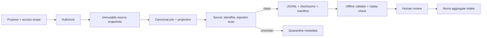

# Governed Trajectory Datasets

This document defines how FDAI joins observable runtime records into versioned,
access-scoped trajectory datasets for offline quality review. The contract preserves failures
and source provenance while excluding hidden reasoning, unrestricted payloads, and credentials.

> Trajectory export is an evidence operation, not a training or promotion action. The console
> remains read-only, and Norns receives only explicitly reviewed aggregates.

## Design at a glance

The export path authorizes the principal, purpose, and access scope before any source provider is
called. It then joins immutable source snapshots in canonical order, scans every projected record,
streams deterministic JSONL, and publishes the data file and manifest only after both complete.

## Stable envelope

Schema version `1.0` is the current write version. A reader accepts only versions explicitly
listed by `TrajectoryVersionPolicy`; readable versions share the current major version. Writers
always emit the current version, and offline validation rejects an unsupported manifest or record.

Each `TrajectoryEnvelope` contains:

| Field group | Required data |
|-------------|---------------|
| Identity | Schema version, trajectory id, trace id, correlation id |
| Time | Timezone-aware start and completion timestamps |
| Runtime | Environment, evidence profile, model capability id |
| Access | Principal-scope SHA-256 digest, never a credential or token |
| Completion | One of `completed`, `failed`, `cancelled`, `timed_out`, `abstained`, `ambiguous` |
| Governance | Purpose, retention, deletion due date, legal-hold state and reference |
| Redaction | Redaction-policy version used for projection |
| Provenance | Sorted immutable source record ids and SHA-256 digests |
| Observations | Contiguous zero-based steps and catalog-shaped tool statistics |

The final step is always one `terminal_outcome` whose value matches `completion_status`. Failed,
cancelled, timed-out, abstained, and ambiguous runs remain first-class records; export never drops
them to improve a success metric.

## Observable steps

The projection admits only these step kinds:

- `normalized_input_reference`
- `routing_decision`
- `assistant_output`
- `tool_request` and `tool_receipt`
- `action_request` and `action_receipt`
- `verifier_result` and `risk_result`
- `approval`
- `terminal_outcome`
- `rollback_state`

Each kind has its own byte cap from 4 KiB to 16 KiB. A source provider returns a bounded excerpt or
reference, not a raw record body. Recursive payload validation blocks hidden reasoning,
chain-of-thought, raw prompts, credentials, tokens, authorization headers, unrestricted tool
output, raw cloud payloads, and attachments. Non-JSON values and oversized excerpts fail closed.

Tool statistics are generated from the complete server-owned tool catalog. Every catalog tool
gets one lexically ordered column, including tools with zero requests, so columns do not shift
between batches. An observed tool absent from the catalog blocks projection.

## Source providers and authorization

`shared/providers/trajectory.py` defines separate async snapshot Protocols for audit,
conversation, tool, approval, and terminal-outcome sources. Each provider returns frozen metadata
with a source digest. Provider implementations retain their existing authority and storage model;
the trajectory join does not become another system of record.

`TrajectoryJoinService` first calls `TrajectoryAccessAuthorizer.authorize(principal_id,
access_scope, purpose)`. No provider method runs before authorization succeeds. The built-in
allowlist authorizer denies unknown principal/scope/purpose triples and computes the scope digest;
a deployment can inject a policy-backed authorizer without changing core projection logic.

Batch filters are explicit and server-side:

- timezone-aware start and end time
- vertical
- action type
- tier
- terminal outcome
- evidence profile

## Deterministic export

`TrajectoryJsonlExporter` requires a gitignored `.trajectory.jsonl` filename and writes to its
`.partial` sibling with canonical sorted-key JSON. Every JSONL
line wraps one record and its SHA-256 checksum. The exporter hashes the exact line bytes into a
dataset checksum and writes a separate canonical manifest containing dataset id, schema version,
purpose, scope digest, record count, outcome counts, dataset checksum, and manifest checksum.

Data and manifest are renamed into place only after both are complete. Cancellation, an exception,
an empty dataset, or a quarantine finding removes partial files. The exporter never writes a
partially trusted dataset at the final path. Every record must use the current schema and match the
request's purpose and authorized scope digest before the first byte is accepted.

The scanner quarantines a dataset when any record has an uncertain secret pattern, non-placeholder
identifier, resource id, non-example email address, or prompt-injection marker. Quarantine stores
only finding codes and trajectory identity. It never echoes the matched sensitive value.

## Offline validation and replay

`validate_export` runs without network or cloud credentials. It rejects:

- missing, empty, malformed, or unsupported-version exports
- record, dataset, or manifest checksum mismatches
- record and outcome counts that disagree with the manifest
- non-contiguous step order or multiple/missing terminal outcomes
- non-canonical trajectory ordering or duplicate trajectory identities
- a step whose source digest is absent from the envelope source map
- payloads incompatible with the current redaction and excerpt policy

`replay_check` is judge-only. It verifies mapping and order and never invokes a tool, action,
training job, promotion, or executor.

## Retention and legal hold

Alembic revision `20260720_0048` stores dataset metadata and quarantine codes, not exported record
bodies. `TrajectoryRetentionService` deletes the artifact through an injected provider before it
clears the storage reference and marks metadata deleted. A provider failure leaves metadata
retryable. Both stores exclude legal holds and recheck the hold when committing the tombstone.

Customer-scoped JSONL and manifests are runtime artifacts. The exporter-enforced suffix is ignored
by git, and these files are never committed to this repository.

## Administrative surfaces

The read API optionally registers Owner-only GET routes:

- `GET /admin/trajectory-datasets?purpose=...&access_scope=...`
- `GET /admin/trajectory-datasets/{dataset_id}?purpose=...&access_scope=...`

Both parameters are required. Scope denial returns not found, and responses omit storage paths.
POST is not registered. Responses explicitly report that training and promotion actions are not
available.

`fdaictl trajectory validate` requires `--dataset`, `--manifest`, `--purpose`, and
`--access-scope`. It performs the same offline validator and replay checks, then verifies that the
manifest purpose and scope digest match the operator request.

## Norns boundary

Norns accepts `ReviewedTrajectoryDataset`, which contains a human review receipt, manifest
checksum, outcome counts, and tool request counts. It does not accept raw trajectory records.
Consumption is digest-deduplicated and records behavior telemetry only; it creates no candidate by
itself and has no automatic training or promotion path. Any later proposal remains inert and uses
the existing Norns-to-Mimir quality gate.

## Code and tests

| Responsibility | Location |
|----------------|----------|
| Envelope, projection, review, validation | `src/fdai/core/trajectory/` |
| Source and dataset provider contracts | `src/fdai/shared/providers/trajectory.py` |
| JSONL exporter and scanner quarantine | `src/fdai/delivery/trajectory/` |
| PostgreSQL metadata adapters | `src/fdai/delivery/persistence/postgres_trajectory.py` |
| Read-only admin routes | `src/fdai/delivery/read_api/routes/trajectory_datasets.py` |
| Offline CLI | `src/fdai/deployment_cli/trajectory.py` |
| Migration | `alembic/versions/20260720_0048_trajectory_dataset.py` |
| Golden tests | `tests/core/trajectory/`, `tests/delivery/trajectory/` |

## Related docs

| To learn about | Read |
|----------------|------|
| Module and DI boundaries | [Project structure](../architecture/project-structure.md) |
| Read-only operator surfaces | [Operator console](operator-console.md) |
| Norns role and permissions | [Agent pantheon](../agents/agent-pantheon.md) |
| Audit and identity controls | [Security and identity](../architecture/security-and-identity.md) |
