# 계층형 대화 계획

이 설계는 단순 질문부터 복합 질문, 다국어 질문, 멀티모달 질문까지 FDAI Console의 모든 질문을
처리하기 위해, 도구 하나로 끝나던 의미 턴 계획을 범위가 제한된 하나의 의도 그래프(intent graph)로
대체합니다. 이 그래프에는 실행 권한이 없습니다. 결정론적 검증이 각 읽기 목표를 사용할 수 있는
기능(capability)에 연결하며, Bragi는 근거와 검증된 한계만 서술합니다.

> 범위: 이 경로는 읽기를 우선합니다. 쓰기 요청은 타입이 지정된 초안만 만들 수 있습니다. 기존
> 안전성 검사, 사람 승인, 롤백, 영향 범위, 감사 게이트가 계속 최종 권한을 가집니다.

## 설계 개요



T1 소형 모델은 언어를 해석해 그래프를 제안합니다. 이 모델은 현재 principal과 배포 환경에서 쓸 수
있는 기능만 볼 수 있습니다. 검증기는 알 수 없는 기능, 순환 참조, 해결되지 않은 의존성, 잘못된
인자, 지어낸 범위, 확인 초안을 벗어난 쓰기를 차단합니다. T2는 첫 의미 플래너로 사용되지 않습니다.
T1 모델 또는 프로바이더를 사용할 수 없고 활성화된 타입 기반 정책이 해당 단계를 허용할 때만 Core가
같은 frame 또는 plan 단계를 T2로 한 번 재시도합니다. 스키마, 구성, 매니페스트, frame-plan 검증
실패는 T2 없이 명확화, 지원되지 않음 또는 보류로 종료됩니다. 유효한 T1 명확화, 액션 초안, 범위
거부, 근거 실행 보류에도 T2 용량을 사용하지 않습니다. Golden 캠페인 요청은 별도의
`golden_campaign_no_t2` 프로필을 선택하므로 프로바이더를 사용할 수 없어도 캠페인 fallback을
호출하지 않습니다.

Owner는 런타임 정책에서 적극적인 읽기 전용 T2 복구를 활성화할 수 있습니다. 로컬 시연을 위해 개발
환경에서는 기본적으로 활성화하고, 측정된 보증 근거로 승격하기 전까지 스테이징과 운영 환경에서는
기본적으로 비활성화합니다. 이 설정은 각 대화형 턴에서 다시 읽으므로 변경할 때 Core를 재시작할 필요가
없습니다. 활성화하면 T1이 사용할 수 있는 프레임이나 계획을 만들지 못한 경우 Core가 구성된 T2
플래너에 범위가 제한된 재시도 기회 한 번을 제공합니다. 명확화 중에서는 타입이 지정된 Resource 신원,
주제 또는 측정값 보류만 해당하며 서버 결속 범위와 목적 보류는 제외합니다. 재시도에는 실패한 단계,
트리거, 안전한 검증 사유로 구성된 간결한 타입 기반 복구 맥락만 전달합니다. 프로바이더 출력이나 숨겨진
추론은 전달하지 않습니다. 결정론적 프레임 및 계획 검증기는 계속 필수입니다. T2에도 명확화가 필요하면
Core는 확신도가 더 낮은 추측 대신 원래 T1 명확화를 반환하고 이후 계획이 실패하면 정직한 사용 불가
결과로 유지합니다. 액션 초안, 범위와 권한 부여 차단, `golden_campaign_no_t2`, 근거 검증, 실행
권한은 변경되지 않습니다. 요청 프로필을 런타임
설정보다 먼저 평가하므로 `golden_campaign_no_t2`가 항상 우선합니다. T2는 더 나은 검증된 읽기
계획을 제안할 수 있지만 정직한 한계를 피하기 위해 리소스 신원, 관계 또는 근거 항목을 만들어낼 수
없습니다. 각 턴은 적용된 설정값과 에스컬레이션 트리거를 운영 로그에 기록합니다.

Compact T1 conversation preflight는 매니페스트 로드와 전체 의미 판단 전에 실행됩니다. 이 모델은
발화, 언어, 범위가 제한된 최근 맥락 및 신뢰할 수 있는 Bragi 프로필만 보고 온톨로지 기능 카탈로그는
보지 않습니다. 스키마는 `social_act`, 운영 신호 및 맥락 의존성을 독립 축으로 유지합니다.
인시던트나 연속 조사 바인딩이 없는 대화에서는 이전 턴이 있더라도 맥락에 의존하지 않는 인사 또는
자기소개를 높은 확신도로 판정하면 모델 작성 응답을 직접 반환할 수 있습니다.
혼합, 맥락 의존, 모호함, 낮은 확신도 또는 preflight 실패는 부분 응답 텍스트를 사용하지 않고 기존
전체 의미 판단으로 계속 진행됩니다.

전체 모델 기반 의미 판단 경계는 운영 의미의 권위 있는 소유자로 유지됩니다. 사회적 표현과 운영 요청이
결합되면 전체 경로를 사용하고 `social_act`는 권한 없는 계획 메타데이터로만 보존합니다. Runtime 코드는
고정된 성공 답변으로 대체하거나 키워드, 문구 표, 정규식, 토큰 비교 또는 하드코딩된 발화에서 의도를
추론하지 않습니다. 어떤 경로도 실행 권한을 얻지 않습니다.

## 적응형 설명 계약

일반 지식 목표가 필수이면 통제된 작업이나 결정 대기가 명시적으로 요청을 넘겨받는 경우에만
운영 전용 경로를 선택할 수 있습니다. 모순된 계획은 운영 조회 전에 중단합니다.

하나의 대화 요청에는 인사, 일반 지식, 필수 운영 근거, 선택적 환경 예시가 함께 포함될 수 있습니다.
이는 서로 배타적인 채팅 모드가 아니라 별도의 답변 목표입니다. 스키마로 검증된 모델이 전체 발화와
제한된 이전 대화에서 목표를 선택합니다. 진입 모드, 키워드, 선택한 에이전트는 경로나 실행 권한을
부여하지 않습니다. 순수 운영 질문, 결정 대기, 인시던트에 연결된 요청은 기존 검증 경로를 유지합니다.

적응형 경로는 별도의 `advisory_response` 최종 응답 계약을 사용합니다. 일반 지식에 운영 조회 증적을
만들어 붙이지 않습니다. 각 목표는 종류, 필수 여부, 답변 상태, 서버가 소유한 근거 참조를 기록합니다.
선택적 예시를 찾지 못해도 일반 설명은 유지하며 필수 운영 근거가 없으면 해당 목표를 명시적으로
보류합니다. 환경 예시는 기존 사용자 범위의 검증된 조회 런타임만 사용합니다. 버전 두 개만으로
블루-그린 배포를 단정하지 않으며 구성 사실을 실행 사실로 취급하지 않습니다.

`1.6.0` 요청과 변환 결과 계약은 `additive-ignore-unknown`이 아닌 `version-negotiated`
호환성을 사용하며 담당 관계와 자문 근거의 조건부 검증을 유지합니다.
구형 변환기와 호환성 행렬 증명은 의미 처리 데이터가 없는 일반 묶음에만 적용되며 의미 요청과
자문 결과는 구형으로 변환할 수 없습니다. 해당 데이터를 활성화하기 전에 수신 서비스를 먼저
업그레이드합니다. 오프라인 호환성 테스트는 선언된 송신 버전을 사용하며 실제 배포 근거를
대체하지 않습니다.

공통 대화 정책, 서버가 소유한 Pantheon 역할 하나, 언어, 검증된 담당 관계를 바탕으로 크기가 제한된
단계별 프롬프트를 조립합니다. 사용자 문장, 이전 대화, 첨부, 도구 결과는 시스템 지침이 아닌 데이터로
유지합니다. 사용자와 에이전트의 매핑은 관련 맥락만 바꾸며 RBAC, 승인, 실행기 신원을 바꾸지 않습니다.
명시적 대상과 영속 세션 연결이 담당 관계의 추천보다 우선합니다.

독립 검토는 목표 누락, 모순, 근거 없는 운영 주장, 역할 일관성을 확인합니다. 허용된 상위 모델 보강은
최대 한 번 수행하고 독립 검증을 다시 거칩니다. 모델의 자신감 점수만으로 운영 주장을 게시하지 않습니다.
시간, 호출 횟수, 입출력 크기, 합산 토큰 예산으로 전체 요청을 제한합니다. 공급자 속도 제한, 취소,
기한 만료는 무한 재시도 없이 시도를 종료합니다. 안전하지 않거나 검토되지 않은 초안을 검증된 답변으로
표시하지 않습니다.

설계 비평: 운영 조회 실패 뒤에 일반 답변으로 우회하면 거부 상태를 숨기고 근거를 만들어낼 수 있습니다.
수정 설계는 조회 계획 전에 설명 목표를 선택하며 권한 실패를 근거 없는 답변으로 바꾸지 않고 기존
작업 초안 경로를 보존합니다. 공통 정책은 한 곳에서 버전 관리하지만 분류기, 작성기, 독립 검토기는
서로 다른 최소 입력을 받습니다. 모순되는 에이전트별 복사본과 거대한 만능 프롬프트를 모두 피합니다.
이번 구현은 실제 모델 호출이나 승격 상태 변경 없이 시작합니다.

### 대화 전체에 적용되는 제한

검증된 조회와 통제된 처리 경로에 전달한 요청은 Azure 모델 어댑터에서도 같은 사용량 한도를
따릅니다. 실제 요청을 보내기 전에 입력 바이트와 출력 토큰을 예약하고, 측정된 사용량으로
정산합니다. 실패한 시도의 예약량은 유지합니다. 조회가 끝나면 진행 중인 프로바이더 작업을
취소하고 종료를 기다리며, 프로바이더 실패 후 같은 조회 범위에서 다른 후보를 호출하지 않습니다.

| 제한 | 기본값 |
|------|--------|
| 답변 목표와 근거 조회 | 목표 6개, 조회 목표 최대 2개 |
| 모델 호출 | 내부 조회 계획을 포함해 전체 5회이며 조회 중에는 답변과 검토를 위한 2회를 남깁니다. |
| 전체 토큰 | 48000이며 요청 전에 보수적으로 사용량을 예약합니다. |
| 시간 | 대화당 60초, 적응형 처리 단계당 20초 |
| 상위 모델 보강 | 최대 1회이며 같은 한도 안에서 독립 검증을 받습니다. |

온톨로지 상태가 없거나 운영 카탈로그가 잘못되어도 독립적으로 유효한 일반 설명 서비스는
사용할 수 있습니다. 근거 조회가 성공했더라도 검토자가 생략하거나
지지하지 않은 설명을 뒷받침하지는 않습니다. 해당 목표에는 제한 사유를 표시하고, 지지된 일반
지식은 유지합니다. 원시 근거를 대신 표시할 때는 Markdown 구분자도 출력 길이에 포함합니다.
통제된 처리 경로에 요청을 넘길 때 모델 관측값을 보존하되 중복 집계하지 않습니다.
검토자가 목표를 모두 다뤘다고 평가했더라도 미해결 지적이 있으면 품질은 미완료로 남습니다.
목표를 다뤘다는 이유만으로 허용된 보강을 생략하지 않습니다.

## 구현 상태

### 구현 범위

| 영역 | 상태 | 근거 | 참고 |
|------|------|------|------|
| 적응형 설명과 검증된 예시 | implemented | `current change`; 집중 Python 검사 653개, Console 검사 209개, 격리된 합성 브라우저 시나리오 10개 통과 | 일반 지식과 운영 목표, 고정 역할 프롬프트, 만료되는 담당 관계 증명, 독립 검토, 제한된 보강 및 재실행 후 표현을 연결했습니다. 실제 모델 품질과 배포 근거는 별도입니다. |
| Compact conversation preflight 및 social narrator | implemented | `conversation-preflight.v1.yaml`, `conversation-social-narrator.v1.yaml`, act별 enforce pack, [`conversation_preflight.py`](../../../services/core-control-plane/src/fdai/core/conversation/conversation_preflight.py), [`semantic_judgment.py`](../../../services/core-control-plane/src/fdai/delivery/azure/llm/semantic_judgment.py), 집중 routing, 조립, transport 및 prompt 테스트 | Temperature 0인 분류기가 매니페스트 로드 전에 인사, 자기소개, 명시적 감사, 작별, 일반 동의, 운영, 혼합, 운영 맥락 및 사회적 연속성 턴을 분리합니다. 이 schema는 사용자 대상 문장을 전달할 수 없습니다. 조건에 맞는 social route는 공통 temperature 0.3 페르소나 base와 타입 기반 act pack 하나만 조립하며 기능 카탈로그나 운영 맥락을 받지 않습니다. 분류기는 catalog 추정 토큰 531개와 schema 포함 system 문자 3,599자이고, act별 narrator 조립은 추정 토큰 283-314개와 1,721-1,847자입니다. |
| Semantic frame, 검증된 계획 및 intent graph | implemented | [`semantic_planning.py`](../../../services/core-control-plane/src/fdai/core/conversation/semantic_planning.py), [`semantic_planning_cascade.py`](../../../services/core-control-plane/src/fdai/core/conversation/semantic_planning_cascade.py), [`semantic_runtime.py`](../../../services/core-control-plane/src/fdai/core/conversation/semantic_runtime.py), 의미 계획 집중 테스트 | 전체 턴 제안은 범위와 release가 제한되고 검증되며 실행 권한 없이 projection됩니다. T1을 항상 먼저 시도합니다. 기본 타입 기반 정책은 T1을 사용할 수 없을 때만 같은 단계의 T2 재시도를 한 번 허용하고, 유효하지 않은 frame, 스키마, 구성, 결정론적 plan 불일치는 안전하게 종료합니다. |
| Owner 제어 적극 T2 복구 | implemented | `conversation.t2_escalation.aggressive_enabled`, 런타임 설정 변환 결과, 의미 턴 처리기, 집중 백엔드 검사 640개, Console 모델 테스트, 타입 검사, 운영 빌드 및 인증된 설정 저장 | 개발 환경의 대화형 읽기 턴은 조건에 맞는 T1 명확화, 사용 불가 또는 수락되지 않은 프레임과 계획 제안에 대해 범위가 제한된 T2 복구 한 번을 기본으로 사용합니다. 스테이징과 운영 환경은 승격 근거를 확보할 때까지 기본적으로 비활성화합니다. 이 설정은 재시작 없이 턴마다 평가하고 T2에도 모호함이 남으면 원래 명확화를 보존합니다. Golden 캠페인, 액션, 권한 부여, 근거 검증 및 실행 권한은 확장할 수 없습니다. |
| 모델 기반 사회적 직접 응답 | implemented | `conversation-preflight.v1.yaml`, `semantic-judgment.v5.yaml`, [`semantic_planning.py`](../../../services/core-control-plane/src/fdai/core/conversation/semantic_planning.py), [`semantic_turn.py`](../../../packages/service-contracts/src/fdai_service_contracts/semantic_turn.py), [`semantic_turn_processor.py`](../../../services/core-control-plane/src/fdai_core_service/semantic_turn_processor.py), 집중 모델 routing, 사용량, 정제 및 stream 테스트 | Compact preflight가 조건에 맞고 맥락에 의존하지 않는 social 턴의 직접 텍스트를 작성합니다. Core는 확신도, 바인딩, 맥락 의존성, 응답 언어, 신뢰할 수 있는 프로필 digest 및 범위가 제한된 텍스트를 검증한 뒤 보존합니다. 혼합, 맥락 의존, 결정 대기, 모호함, 바인딩 및 preflight 실패에는 전체 의미 판단을 사용합니다. 직접 응답은 고정 성공 템플릿 또는 lexical fallback 없이 측정된 모델 사용량과 신원을 유지합니다. |
| Principal 범위 관리 문서 RAG | implemented | [`semantic_governed_document_planning.py`](../../../services/core-control-plane/src/fdai/core/conversation/semantic_governed_document_planning.py), [`governed_document_reader.py`](../../../services/core-control-plane/src/fdai/core/knowledge/governed_document_reader.py), [`governed_document_queries.py`](../../../services/core-control-plane/src/fdai/core/ontology_platform/governed_document_queries.py), 집중 계약, ACL, runtime 및 projection 검사 | 의미 판단은 문서 근거를 `none`, `optional`, `required`, `explicit` 중 하나로 선택합니다. 검색은 인증된 principal의 정확한 그룹, 컬렉션, 개정, 수명 주기, 목적, 접근 정책을 먼저 제한하고 다시 검증합니다. 필수 근거는 안전하게 종료하고, 독립적인 선택 문서 실패는 완료된 운영 근거가 있을 때만 한계를 표시한 부분 답변을 허용합니다. 현재 PostgreSQL 어댑터는 `index_completeness_unverified`를 보고하므로 완전한 프로바이더 세대를 연결하기 전까지 운영 환경의 필수 및 명시적 턴은 보류됩니다. 문서 텍스트는 신뢰할 수 없으며 지시 또는 실행 권한이 없습니다. |
| 구조화된 인과 조사 | implemented | `semantic_investigation.py`, `semantic_investigation_planning.py`, 조사 query-node 및 표현 테스트, 집중 조사 검사 | 대상 결속 인과 diagnosis는 정확한 source span, 타입이 지정된 entity 역할, 증상 방향, 시간 단서, 순서가 있는 LinkType side, 경쟁 가설, 근거 기준, 답변 형태를 전달합니다. Core는 이 요소를 검증하고 모델이 작성한 plan 없이 entity 해석, multi-hop 확장, 정렬된 window, topology diff, 증상 비교, 지지/반증 wave를 컴파일합니다. 일반 선언 범위 causal evidence는 기존의 범위가 제한된 plan을 유지합니다. 가설 결과가 두 개 미만으로 표현 계층에 도달하면 거짓 완전 진단을 만들지 않고 대상과 증상 비교를 명시적인 근거 한계와 함께 유지합니다. |
| 운영 Core semantic runtime 조립 | implemented | [`wire_semantic_query.py`](../../../services/core-control-plane/src/fdai/composition/wire_semantic_query.py), [`semantic_query_model_targets.py`](../../../services/core-control-plane/src/fdai/composition/semantic_query_model_targets.py), [`bootstrap.py`](../../../services/core-control-plane/src/fdai/runtime/bootstrap.py), 의미 질의 조립 집중 테스트 | Azure T1 및 T2 계획 어댑터를 별도로 연결합니다. 전제 조건을 갖추면 principal 범위 매니페스트, 보안 ObjectSet, 읽기 함수 및 범위가 제한된 DAG 실행이 조립됩니다. |
| 버전이 지정된 서비스 간 semantic-turn 계약 | implemented | [`semantic_turn.py`](../../../packages/service-contracts/src/fdai_service_contracts/semantic_turn.py), [`operator-core-request/1.6.0.json`](../../../packages/service-contracts/src/fdai_service_contracts/schemas/operator-core-request/1.6.0.json), [`semantic_turn_processor.py`](../../../services/core-control-plane/src/fdai_core_service/semantic_turn_processor.py), [`test_semantic_turn_processor.py`](../../../services/core-control-plane/tests/test_semantic_turn_processor.py) | 요청 1.6은 범위가 제한된 인증 principal 그룹과 적응형 담당 관계 필드를 추가합니다. 두 기능이 모두 필요 없는 요청에는 producer가 1.5를 유지합니다. Projection은 실행 권한을 부여하지 않으면서 신원, 목적, 기한, digest, 처리 결과, 근거 및 관측 모델 메타데이터를 결합합니다. |
| Durable Operator bridge 및 Console projection | implemented | [`semantic_turn_runtime.py`](../../../services/operator-service/src/fdai_operator_service/families/conversation/semantic_turn_runtime.py), [`postgres_semantic_turn_store.py`](../../../services/operator-service/src/fdai_operator_service/postgres_semantic_turn_store.py), [`test_semantic_turn_bridge.py`](../../../services/operator-service/tests/test_semantic_turn_bridge.py) | Operator는 durable acceptance, outbox claim, result projection, 인증된 replay, typed hold 및 `done` event 변환을 담당합니다. |
| Event transport 및 배포 설정 | implemented | [`semantic_kafka.py`](../../../services/operator-service/src/fdai_operator_service/adapters/semantic_kafka.py), [`main.tf`](../../../infra/main.tf), [`test_semantic_turn_topics.py`](../../../tests/integration/infra/test_semantic_turn_topics.py) | 논리 request 및 projection topic은 통제된 물리 event stream을 공유하며 두 service에 설정됩니다. |
| 구조 및 인식 상태 커버리지 기반 | in-progress | [`epistemic_coverage.py`](../../../services/core-control-plane/src/fdai/core/conversation/epistemic_coverage.py), [`test_epistemic_coverage.py`](../../../services/core-control-plane/tests/conversation/test_epistemic_coverage.py) | Receipt와 gate 계약은 존재하지만 완전한 descriptor generation, runtime question receipt 및 L3/L4 인증은 제공되지 않았습니다. |
| 완전한 temporal, metric, causal 및 relationship query surface | in-progress | [`wire_semantic_query.py`](../../../services/core-control-plane/src/fdai/composition/wire_semantic_query.py), [Ontology Query Coverage 구현 계획](ontology-query-coverage-implementation-plan-ko.md) | ObjectSet, set operation, projection, aggregation 및 일부 read function은 연결됐지만 나머지 provider-backed query kind는 미완성입니다. |
| Multimodal semantic planning 입력 | not-started | [Conversation Attachments](conversation-attachments-ko.md) | Semantic-turn 요청은 현재 범위가 제한된 text와 prior-turn context를 전달하며 server-validated image 또는 document evidence는 전달하지 않습니다. |
| 통제된 운영 인증 | not-started | 이 문서의 검증 계약 | 운영 준비 상태를 입증하는 보존된 인증 cross-service browser 증적 또는 randomized assurance 증적이 현재 없습니다. |

### 구현 이력

| 날짜 | 상태 | 변경 | 근거 | 남은 작업 |
|------|------|------|------|-----------|
| 2026-09-06 | implemented | 의미 기반 문서 근거 분류, principal 범위 관리 문서 검색, 정확한 개정 인용, 필수 원본 보류, 독립적으로 조건을 충족한 선택적 부분 답변을 추가했습니다. 인증된 Entra 그룹은 Operator 애플리케이션 역할과 분리하며 요청, principal 범위, 함수 호출, 최종 ACL 검사에 결합됩니다. 관리 문서 RAG 하드닝 렌즈 30개를 완료했고 마지막 독립 리뷰에서 남은 Medium 이상 결함이 없음을 확인했습니다. | `current change`; 계약, ACL, 계획, runtime, 처리기, 전송, Operator 집중 검사 650개와 영향을 받는 Operator 인증 검사 375개가 통과했습니다. 소스 파일 35개는 strict mypy를, 선택한 Python 파일은 Ruff를 통과했습니다. Console 검사 67개와 Console 타입 검사, 생성된 서비스 계약 드리프트 검사가 통과했습니다. | 운영 준비 상태를 보고하기 전에 인증된 서비스 간 검색 증적을 보존합니다. 프로바이더가 소유하는 완전한 인덱스 세대를 연결하고 검증합니다. 현재 PostgreSQL 어댑터는 어휘 검색을 사용하며 완전성을 검증하지 못했다고 보고합니다. |
| 2026-09-06 | implemented | 근거, 원본 장애, 프로바이더 실패, 취소, 사용량 제한, 신원, 복합 요청, 검토 품질, 버전, 복원 및 표현을 대상으로 집중 비평과 하드닝을 11회 완료했습니다. 카탈로그 장애 격리, 보강 누락, 경로와 목표가 모순된 계획 및 복원된 일반 대화에 화면 맥락이 붙는 문제를 포함해 발견된 Medium 이상 결함을 수정했습니다. | `current change`; 집중 Python 검사 653개, Console 검사 209개, Console 타입 검사와 빌드, 격리된 합성 E2E 시나리오 10개 통과. 영어와 한국어 데스크톱, 좁은 데스크톱 및 모바일 화면의 가로 넘침 검사와 스크린샷 검토를 통과했습니다. | 별도로 승인된 실제 모델 및 배포 근거를 보존합니다. 오프라인 결과로 승격이나 운영 준비 완료를 주장하지 않습니다. |
| 2026-09-06 | in-progress | 적응형 목표, 선택한 역할의 프롬프트, 검증된 담당 관계 증명, 조언 응답 전송 및 내부 프로바이더의 공통 사용량 제한을 연결했습니다. | `current change`; `test_adaptive_runtime.py` 9개, `test_adaptive_provider_budget.py` 10개, `test_wire_adaptive_conversation.py` 19개가 통과했습니다. | 전달 전 최종 집중 회귀 검사와 비평 근거를 완료합니다. 실제 모델과 배포 검증은 별도입니다. |
| 2026-09-03 | implemented | 분리된 Service Health 답변 렌더러를 검토된 표현 전용 lexical 경로로 등록했습니다. 검증된 machine field를 읽으며 운영자 문장에서 의도를 추론하지 않습니다. | `current change`, semantic-routing baseline 검사 및 집중 Service Health 표현 테스트 | 이 감사 등록에 남은 작업은 없습니다. |
| 2026-09-03 | implemented | 간결한 타입 기반 복구 맥락과 턴별 설정 평가를 사용하는 개발 환경 기본 활성화 Owner 제어 적극 T2 복구 모드를 추가했습니다. Golden no-T2 프로필, 액션 및 서버 결속 보류, 결정론적 검증, 원래 명확화 반환은 계속 최종 권한을 가집니다. 저장한 토글을 재시작 없이 다음 턴에 적용할 수 있도록 리비전 기반 Operator 설정 갱신과 설정 변환 결과 무효화를 수정했습니다. | `current change`, 집중 Core, Operator 및 로컬 시작 검사 640개 통과, Console 모델 테스트, 타입 검사 및 운영 빌드 통과, 집중 Ruff 및 strict mypy 통과, 인증된 Console 저장에서 리비전 1이 2로 증가했고 실제 질문이 타입 기반 T2 에스컬레이션을 기록했습니다. | 실제 복구에서 구성된 T2 프로바이더가 HTTP 429를 반환했습니다. validated 상태를 선언하거나 스테이징과 운영 환경 기본값을 승격하기 전에 성공한 인증 답변 증적을 보존합니다. |
| 2026-09-01 | implemented | 커밋된 리비전의 제한된 의미 정규화를 VPN 경로 프라이빗 Foundry 엔드포인트에서 검증했습니다. exact-source cohort 10개가 실행 권한 없이 10/10으로 통과했으며, 중지 표식과 기존 보증 원장을 원래 다이제스트로 복원하고 확인했습니다. | 출처 `31002f3db70649ceb6844dc8ea59798ba7aa4d13`, 출처에 고정된 원장 다이제스트 `sha256:ef474b09662296d2e61a6e74569945afd236d038523795545069f8d11546d779`, 정확한 결과 10/10 | 이중 언어 후속 캠페인 20개를 시작하지 않고 제안합니다. 100개 캠페인은 계속 비활성화합니다. |
| 2026-09-01 | implemented | `ff4e92fc0`의 나머지 조건이 유효한 9/10 cohort에서 정확히 해당 typed 판단이 생성된 뒤 제한된 변경 상관관계 앵커 family에 검토된 `change_activity` 표기를 추가했습니다. 추가 intent, 대상 종류 또는 관련 없는 facet은 허용하지 않습니다. | `current change`, 집중 의미 계획 검사 및 `ff4e92fc0`에 고정된 9/10 canary 근거 | 커밋하고 exact cohort 10개를 다시 실행합니다. 10/10 이후에만 20개를 제안합니다. |
| 2026-09-01 | implemented | 변동하는 계획 경로 2개에서 스키마 수준 대상과 인스턴스 신원을 구분했습니다. 변경 상관관계는 제한된 주제 집합의 검토된 `object_type` 대상을 바인딩된 인스턴스로 취급하지 않고 유지할 수 있으며 타입이 지정된 `targets`와 `correlation` 별칭을 허용합니다. 리소스 활동은 `ResourceType`으로 정규화된 `resource_type` 대상과 기간을 유지하면서도 정확한 Resource 신원 명확화를 계속 요구할 수 있습니다. 구체 리소스 대상은 두 복구 경로를 계속 우회합니다. | `current change`, 집중 의미 계획 검사 및 `a08547b29`에 고정된 8/10 canary 근거 | 커밋하고 exact cohort 10개를 다시 실행합니다. 10/10 이후에만 20개를 제안합니다. |
| 2026-09-01 | implemented | 커밋된 9/10 재실행에서 의미가 같은 `query.resource_change_activity`, 복수형 `changes`, `without_causal_inference` 판단이 생성된 뒤 여전히 취약한 변경 상관관계 exact facet tuple을 제한된 typed family로 교체했습니다. 이 보류는 이제 관계 또는 변경 활동 intent, 승인된 변경 기간, 대상 리소스, 서비스 경로, 비인과 family 및 변경 또는 장애 앵커 중 하나만 허용합니다. 대상, 추가 facet, 누락된 필수 family, 바인딩된 장애 및 권한을 포함한 자세는 계속 거부합니다. | `current change`, 집중 의미 계획 검사 및 `02248cac7`에 고정된 9/10 canary 근거 | 커밋하고 exact cohort 10개를 다시 실행합니다. 10/10 이후에만 20개를 제안합니다. |
| 2026-09-01 | implemented | VPN 경로 런타임 근거에서 T1이 `incident`, 승인된 변경 기간, 대상 리소스, 서비스 경로, 현재 finding 부재를 유지하면서 중복되는 `change` facet을 생략할 수 있음을 확인한 뒤 바인딩되지 않은 변경 상관관계 facet 경계를 수정했습니다. 결정론적 보류는 이제 해당 필수 집합과 선택적인 명시적 `change`만 허용하며, 추가 facet이나 누락된 필수 facet은 계속 이 경로를 우회합니다. | `current change`, 집중 의미 계획 검사 및 exact-source canary 근거 | 커밋된 수정에서 exact cohort 10개를 다시 실행하고 20개를 제안하기 전에 10/10을 보존합니다. |
| 2026-09-01 | implemented | 바인딩되지 않은 변경 상관관계 요청에 대해 검토된 `compare/windowed` 프레임을 보존했습니다. 결정론적 경계는 정확한 typed facet 집합만 수락하며 필요한 장애 바인딩이 없으면 보류 결과를 반환합니다. 추가 facet이 있거나 장애가 바인딩된 요청은 일반 계획을 계속하며, 이 보류는 관계 또는 인과 근거를 만들지 않습니다. | `current change`, 집중 의미 계획 검사 | 독립적인 Golden 서비스 상태 문구 수정 후 exact-source canary 근거를 보존합니다. |
| 2026-08-28 | implemented | 결정론적 social 분류와 페르소나 표현 생성을 분리한 뒤 social 표현을 공통 base와 타입 기반 greeting, thanks, farewell 및 self-introduction pack으로 나눴습니다. 분류기 schema는 사용자 대상 문장을 작성할 수 없습니다. Narrator는 타입 기반 social act, 연속성 flag, 언어, 발화 및 신뢰할 수 있는 Bragi 프로필만 받고 social 전용 temperature를 사용하며 정본 신원 문자열을 보존합니다. Narrator 실패는 안전한 unavailable 결과를 만들며 전체 의미 판단도 fallback social 문장을 게시할 수 없습니다. | `current change`, 집중 계약, prompt, transport, routing 및 processor 검사 608개 통과, Ruff 및 strict mypy 통과, 인증된 한국어 자기소개 변형 3개가 같은 검증된 프로필 사실과 query 없음 계약을 유지하면서 서로 다른 문장 구조를 만들었고 이름이 없는 구어체 요청은 전체 1.7K토큰을 사용했습니다. 집중 조립 검사는 각 social act에 검토된 pack 하나만 적용됨을 입증합니다. | 더 큰 응답 충돌률 corpus와 인증된 pack별 waterfall 근거를 보존합니다. Social 턴은 두 호출에서 전체 약 1.7K-1.9K토큰을 사용하며, 안전한 routing과 자연스러운 표현을 위해 일부 지연을 사용합니다. |
| 2026-08-28 | implemented | 한국어와 영어 첫 인사, 반복 인사, 자기소개, 직접 호칭, 감사, 작별, 혼합 및 순수 운영 요청, 인용된 사회적 표현, 액션성 동의 및 모호한 후속 질문을 포함한 인증된 13라운드 강화 캠페인을 완료했습니다. 캠페인에서 페르소나 연속성, 명시적 social act, 일반 동의 veto, 결정 대기 명확화, malformed 시도 veto, 범위가 제한된 schema 교정, Unicode 존댓말 검증 및 정확한 `social_act` 변환 결과 메타데이터를 추가했습니다. | `current change`, 집중 계약, preflight, 의미 routing, processor, 조립 및 prompt 검사 605개 통과, Ruff 및 strict mypy 통과, 선언한 모든 캠페인 경로에서 승인되지 않은 실행이 없었습니다. 순수 social 사례는 preflight 호출 1건을 사용했고, 혼합 및 운영 사례는 social로 종료되지 않았으며, 일반 동의를 승인으로 해석하지 않았습니다. | 액션성 동의는 안전하지만 모델 호출 3건과 10.5초가 걸리는 성능 저하가 남아 있습니다. 인용된 social 표현 설명은 현재 일반 명확화를 반환합니다. Routing을 약화하지 않고 두 잔여 항목을 최적화하고 캠페인을 통제된 artifact로 보존합니다. |
| 2026-08-28 | implemented | 고정된 지역화 인사 및 자기소개 렌더러를 제거했습니다. 이제 의미 판단 prompt v5는 신뢰할 수 있는 Bragi 프로필에서 해당 턴에 맞는 새로운 응답을 작성하고, Core는 응답 언어, 프로필 digest, 범위가 제한된 일반 텍스트 및 실행 권한 없음을 검증한 뒤 해당 응답을 의미 projection 전체에 보존합니다. | `current change`, 공유 계약, 의미 판단, tier routing, Core processor, 조립 및 prompt 검사 584개 통과, 집중 Ruff 및 strict mypy 통과, 인증된 로컬 Console 관찰에서 서로 다른 한국어 자기소개 및 인사 응답을 확인했으며 각 응답은 `semantic-judgment` 모델 호출 1건을 근거로 했습니다. | 이 구현 근거를 validated로 승격하기 전에 통제된 브라우저 artifact를 보존합니다. |
| 2026-08-25 | implemented | 실제 의미 판단 배포, 프로바이더가 측정한 토큰 사용량, 호출 시간, 요청이 명시적으로 활성화한 정제된 모델 trace를 직접 인사 및 자기소개 projection으로 전달했습니다. Trace는 범위가 제한되고 자격 증명 및 고객 식별자 패턴을 제거하며 숨겨진 추론을 보존하지 않습니다. 또한 질의, 근거, 검증 또는 실행 권한을 만들지 않습니다. | `current change`, 요청 1.4 호환성 검사 128개 통과, 집중 판단, 정제, 직접 projection, Operator 최종 처리, Console 배지 검사 통과, 엄격한 Python 및 TypeScript 검사 통과 | 정확한 소스의 로컬 스택을 다시 시작하고 토큰 사용량과 모델 trace를 활성화한 인증된 인사 하나를 보존합니다. 그런 다음 trace를 비활성화한 상태로 반복해 영속 trace가 생성되지 않음을 입증합니다. |
| 2026-08-25 | implemented | 다양한 인증 Command Deck 캠페인에서 발견한 문제를 바탕으로 모델 기반 사회적 의도와 액션 처리 방식을 보강했습니다. 이제 자기소개는 닫힌 정본 facet을 사용하고, 고유한 신원 및 권한 facet은 근거 읽기가 없는 직접 응답으로 이동할 수 있으며, 승인된 `advise_only` 판단은 frame 단계에서 액션 초안으로 바뀔 수 없습니다. 대상, 비교 기준 또는 기간에 필요한 정보가 없으면 lexical 추론 대신 명확화를 요청합니다. Core 로컬 입력 digest에는 prompt catalog도 포함되므로 오래된 의미 지침을 읽은 정상 프로세스가 source readiness를 통과할 수 없습니다. | `current change`, 한국어, 영어, 혼합 언어, 구어체, 오타, 사회적 표현과 운영 요청의 결합, 모호성, 직접 액션 및 2턴 후속 질문을 포함한 서로 다른 브라우저 질문 32개와 durable 최종 시도 44개. 직접 응답은 검사 0/0, 근거 참조 0개, 조사 수명 주기 미노출을 유지했습니다. 집중 prompt, routing, posture 및 launcher 검사 통과 | 선택된 화면 Resource와 검증된 view fact를 타입이 지정된 의미 요청으로 전달해 화면 기준 상태, 관계, 요약 및 후속 질문이 명확화 또는 지원되지 않음으로 저하되지 않도록 합니다. 별도의 Ontology instance graph 표현 방향 오류를 해결한 뒤 캠페인을 통제된 근거로 보존합니다. |
| 2026-08-25 | implemented | 문구 목록과 정규식으로 의도를 추론하던 전체 발화 인사 및 자기소개 분류기를 철회했습니다. 의미 판단 prompt v3는 예시 발화 없이 두 사회적 의미를 정의하고, Core는 스키마로 검증된 정본 모델 의도만 사용해 분기합니다. Operator는 더 이상 운영자 텍스트를 읽거나 추측성 수락 및 계획 프레임을 보내지 않습니다. | `current change`, 공유 계약 검사 19개, 집중 모델 라우팅 검사 6개, 최종 변환 결과 기반 Operator 수명 주기 검사 5개, 활성 prompt 계약 통과 | 현재 source 스택을 다시 시작하고 lexical fallback 없이 인증된 인사, 자기소개, 복합 운영 및 모델 사용 불가 결과를 보존합니다. |
| 2026-08-25 | implemented | Bragi의 자기소개를 요청한 문장이 일반 조사 수명 주기에 진입한 뒤 타입이 지정된 `self_introduction` 직접 응답 의도를 추가했습니다. 공유 전체 발화 분류기는 이제 범위가 제한된 한국어 및 영어 신원 요청을 인식하고, Core는 지역화된 신원 및 권한 경계를 렌더링하며, Operator는 `done`만 보냅니다. 자기소개와 운영 작업을 결합한 요청은 일반 계획 경로를 유지합니다. | `current change`, 공유 계약 집중 검사 17개, Core 계획 검사 9개, Core 최종 변환 결과 검사 2개, Operator 표현 및 수명 주기 검사 3개, Console 엄격 증적 구문 분석 검사 53개 통과 | 로컬 스택을 다시 시작하고 일시적인 조사 UI가 없는 인증된 자기소개를 보존합니다. |
| 2026-08-25 | implemented | 정확한 인사 분류기를 공유 서비스 계약으로 옮기고, Core의 직접 응답 최종 변환 결과가 도착하기 전에 Operator와 Console이 추측성 조사 진행 상황을 표시하지 않도록 수정했습니다. Operator는 정확한 인사에 `done`만 보냅니다. Console은 관측된 진행 프레임이 있을 때만 `Preparing answer`를 표시하며 직접 응답에는 최소 준비 지연을 적용하지 않습니다. 복합 운영 요청은 일반 수명 주기를 유지합니다. | `current change`, 집중 Core 인사 경계 검사 23개, Operator 직접 및 일반 수명 주기 검사 3개, Console 스트림 및 시각 검사 58개 통과 | Core, Operator, Console을 다시 시작한 뒤 일시적인 조사 UI가 없는 인증된 인사 응답을 보존합니다. |
| 2026-08-25 | implemented | 매니페스트와 모델 기반 의미 판단보다 먼저 실행되는 결정론적 전체 발화 인사 사전 검사를 추가했습니다. 정확히 비교하기 전에 Unicode, 대소문자, 공백, 경계 구두점을 정규화하며, 인사로 시작하는 운영 요청은 의미 계획 경로에 남깁니다. | `current change`, `direct_response.py`, 집중 분류기 및 전체 의미 tier-routing 검사 378개 통과, 변경 범위 Ruff 및 strict mypy 통과 | Core를 재시작하고 조사, 질의, 출처 사용 불가 또는 근거 projection이 없는 인증된 Console 인사 응답을 보존합니다. |
| 2026-08-22 | implemented | 광범위한 유효하지 않음 또는 사용 불가 T2 대체 경로를 타입 기반 escalation 조건과 정책으로 교체했습니다. Interactive Console 계획은 T1 사용 불가 대체 경로만 제한적으로 허용하고 `golden_campaign_no_t2`는 어떤 대체 경로도 허용하지 않습니다. | `current change`, 집중 tier-routing, 공유 계약, Core processor, Operator bridge, Console 캠페인 검사 통과 | 560-turn golden 캠페인 전에 인증된 준비 상태 probe를 실행합니다. |
| 2026-08-20 | implemented | Prompt v30이 이전 system prompt 문자 제한을 초과해 계획 전에 전체 runtime을 사용할 수 없게 된 문제를 수정하고, 범위가 제한된 Azure semantic adapter와 통제된 frame prompt를 정렬했습니다. Adapter는 고정된 32,768자 system prompt 제한과 기존 전체 request byte 제한을 유지합니다. | `current change`, 실제 prompt catalog 조립 및 제한 초과 adapter 회귀 검사 | Core readiness는 이제 semantic runtime이 연결됐다고 보고합니다. 재시작 전에 완료한 replay를 반복하지 않았으므로 인증된 대상 결속 답변은 남아 있습니다. |
| 2026-08-20 | implemented | 가설 결과가 0개 또는 1개만 표현 계층에 도달해도 구조화된 인과 artifact를 유지하도록 보강했습니다. Artifact는 검증된 대상과 증상 비교를 유지하고, 사용할 수 있는 가설 행만 표시하며, 불완전한 경쟁 근거 집합을 영어와 한국어 한계로 명시합니다. | `current change`, 집중 조사 및 Operator 표현 검사 | Runtime 검증을 주장하기 전에 인증된 대상 결속 slowdown 답변과 viewport 근거를 보존합니다. |
| 2026-08-20 | 진행 중 | 아래 structured-investigation 행의 tracking owner를 정정했습니다. 이슈 #242는 관련 없는 golden-question assurance 작업입니다. 이슈 #244는 T1 frame 거부 진단과 범위가 제한된 T2 throttling 동작을 포함한 인증된 인과 diagnosis parity를 소유합니다. | [이슈 #244](https://github.com/dotnetpower/fdai/issues/244), 인증된 타입 보류 근거 | 타입이 지정된 보류를 약화하지 않고 완전한 인증 대상 결속 diagnosis를 생성합니다. |
| 2026-08-20 | implemented | Free-text name fragment를 선언된 resource type과 함께 유지하도록 frame prompt를 v29로 올렸습니다. 모델은 계속 의미만 제안하며 Core는 정확한 fragment가 발화에 있는지 검증하고 ObjectSet을 좁히기만 할 수 있습니다. | `current change`, [이슈 #242](https://github.com/dotnetpower/fdai/issues/242), 집중 prompt 및 multi-filter grounding 검사 | 인과 비교 전에 인증된 수정 filter를 보존합니다. |
| 2026-08-20 | implemented | 새로 추가한 metric concept 입력에만 기본값을 제공해 Azure frame adapter의 N-1 직접 호출 호환성을 복원했습니다. Runtime 조립은 검토된 metric registry를 계속 명시적으로 전달합니다. 확장된 조사 traversal은 scoped query-table 검증기 계약을 유지하며 service-test 소유권에는 인과 표현 회귀 테스트가 포함됩니다. | `current change`, [이슈 #242](https://github.com/dotnetpower/fdai/issues/242), 집중 adapter 및 검증기 검사 27개 통과 | 실제 Console 근거 전에 정확한 commit 및 통합 range 검증을 완료합니다. |
| 2026-08-20 | implemented | 정확한 커밋 검증에서 일반 visible-scope causal 회귀 두 건을 찾은 뒤 structured-intent 허용 규칙을 수정했습니다. 이제 causal frame의 subject가 공급된 선언 이름 밖의 정확한 대상을 포함할 때만 structured intent를 요구하며, 일반 선언 범위 causal evidence는 기존의 검증된 plan을 계속 사용합니다. | `current change`, [이슈 #242](https://github.com/dotnetpower/fdai/issues/242), 집중 호환성, 대상 결속, prompt 및 service-suite 검사 37개 통과 | 정확히 수정된 소스에서 인증된 resource filter 및 대상 결속 slowdown 답변을 보존합니다. |
| 2026-08-20 | implemented | 검증된 조사 intent와 서버 소유 인과 근거 compiler를 추가했습니다. 순서가 있는 관계 확장 전에 정확한 대상을 해석하고, 모든 가설은 관측한 증상 변화에 의존하며, 모호한 신원, 불완전한 범위, 반대 증상 방향, 오래된 window 또는 누락된 근거는 영향받는 branch를 타입이 지정된 사유로 중단합니다. | `current change`, 집중 계약, 계획기, query-node, 질문 공간, processor, Operator 표현 검사 97개와 Ruff, formatting, strict mypy 통과 | 현재 v27 기반을 prompt v28로 통합한 뒤 세 Console viewport에서 인증된 영어 및 한국어 slowdown 답변을 보존합니다. |
| 2026-08-20 | implemented | Frame prompt v28을 통해 구조화된 조사 계약을 현재 의미 frame에 통합했습니다. 비인과 frame은 기존 v27 동작을 유지하고, 인과 frame은 검증 가능한 조사 intent를 요구하며 Core가 plan을 서버에서 컴파일합니다. | `current change`, [이슈 #242](https://github.com/dotnetpower/fdai/issues/242), 집중 investigation, tier-routing 및 prompt 검사 | 정확히 커밋된 소스에서 인증된 resource filter 및 slowdown 답변을 보존합니다. |
| 2026-08-13 | in-progress | 이전 출처 이력을 재구성하지 않고 목표 아키텍처를 현재 Core runtime, Operator bridge, service contract, 배포 설정 및 집중 테스트와 대조했습니다. | 구현 범위 표에 나열한 현재 소스와 집중 검사입니다. | 완전한 query coverage, multimodal transport, descriptor generation, runtime coverage receipt 및 통제된 live 인증이 남아 있습니다. |
| 2026-08-14 | implemented | 즉시 T2를 사용하는 의미 계획을 T1 우선 cascade로 교체했습니다. T2를 호출하는 유일한 조건은 T1 frame 또는 plan 제안이 없거나 결정론적 검증을 통과하지 못한 경우입니다. | `current change`, 의미 플래너 및 조립 회귀 테스트는 T1 성공, 명확화, 근거 보류가 T2를 호출하지 않고 범위가 제한된 제안 실패만 한 단계를 다시 시도할 수 있음을 검증합니다. | tier 선택을 기록하는 인증 근거를 보존하고 기존 통제된 실제 인증을 완료합니다. |

### 남은 작업

- [x] 적응형 대화 비평에서 Low를 초과하는 미해결 문제가 없도록 했습니다. 집중 구현 검사와
  격리된 브라우저 근거는 현재 변경의 이력에 기록했습니다.
- [ ] 읽을 수 있는 모든 ontology declaration과 runtime availability state에 대해 release에서
    파생한 descriptor generation 및 독립적으로 검증된 atomic activation을 완성합니다.
- [ ] 남은 temporal, metric-series, evidence-join, causal, relationship-side 및 provider-backed
    read capability를 secured query gateway를 통해 연결합니다.
- [ ] Attachment ingestion 및 custody 경로가 범위가 제한된 immutable reference를 만든 뒤에만
    인증된 image와 document evidence를 semantic planning으로 전달합니다.
- [ ] 고정된 bilingual question universe의 runtime epistemic receipt를 만들고 structural coverage
    검사를 약화하지 않으면서 release gate에 연결합니다.
- [ ] 인증된 cross-service browser 및 randomized assurance 증적을 수집하고 rollback과 typed-hold
    동작을 검증한 뒤 이 경로를 production-ready로 보고합니다.
- [ ] 인증된 선택 화면 Resource 하나와 검증된 view-fact digest를 Console, Operator 및 Core를
    통해 전달한 뒤 광범위한 질의 대체나 lexical routing 없이 상태, 관계, 요약 및 문맥 기반
    후속 browser case를 통과합니다.
- [ ] 서비스 하나를 해석하고 순서가 있는 LinkType side를 둘 이상 순회하며, 실행 권한 없이
    지지됨, 반증됨 또는 미해결 가설을 둘 이상 보고하는 인증된 인과 조사를 보존합니다.
- [ ] Semantic graph 경로의 replay가 동등하거나 더 나은 coverage와 safety를 입증한 뒤에만
    임시 legacy natural-language route를 제거합니다.

구조화된 의도 그래프는 이제 semantic-turn 요청을 처리하도록 설정된 서버 플래너입니다. Core는 모델,
release, 저장소, 전송 계층의 전제 조건을 모두 갖추면 Azure 계획 수립 어댑터, principal 매니페스트
검증, 결정론적 의도 그래프와 실행 증적 생성, 정확한 Console v2/v1 전송 형식 변환을 연결합니다.
Operator 브리지는 근거가 결합된 결과를 기존 Console `done` 프레임으로 변환하며, 전제 조건이 빠졌다면
타입이 지정된 한계로 남깁니다.
기본 Core 호환 경로는 이제 정확한 정본 명령만 받아들입니다. 자연어 별칭, 키워드 나열식 서술,
정본 문자열 읽기 계획에는 명시적이고 일시적인 `legacy` 모드가 필요합니다. 비동기 의미 런타임은
검증된 일상 언어 DAG를 실행하고 범위가 제한된 그래프와 근거 변환 결과를 내보냅니다. 영속적인 서술자
인덱싱과 추가적인 시계열, 메트릭, 인과 프로바이더 연결은 명시적인 후속 구현 과제로 남아 있습니다.

서비스 간 전환은 기존 계약에 더해지는 `operator-core-request` 및 `core-operator-projection` 버전 1.2
메시지 보자기에서 시작합니다. 의미 요청은 인증된 principal 역할, 범위가 제한된 세션 및 직전 턴
맥락, 목적, 기한, 멱등성 식별자와 `execution_authority: false`를 실어 나릅니다. 턴이 답변되었다면
최종 의미 결과는 타입이 지정된 처리 결과 하나와 함께 정확한 release, principal 매니페스트, 계획,
실행 증적, 근거 식별자를 실어 나릅니다. 범용 보자기는 버전 1.0 소비자와 계속 호환되지만, 의미
페이로드를 이전 형식으로 변환하지는 않습니다. 그렇게 변환하면 근거 계약이 사라지기 때문입니다.
발행 측과 결과 수신 측 전송 경로가 모두 연결되면 Operator 발신함 발행기, Core 소비자, 영속
결과 변환, Console `done` 어댑터가 함께 구성됩니다. Operator 쪽 전환은 Terraform이 프로비저닝한
`operator.semantic-turn.requests` 및 `core.semantic-turn.projections` 토픽을 사용합니다. 이때 의미를
이해하는 어댑터 하나가 변환, 제안, 스트림 라우팅을 모두 맡고, 로컬 Azure 서술기는 `chat.stream`에서
제외됩니다. PostgreSQL 점유는 데이터베이스 시계를 쓰고, 보류된 재시도는 요청과 결과 다이제스트를
결합한 변환 식별자를 쓰며, 중복된 결과는 요청과 principal과 다이제스트를 원자적으로 검증합니다. 이
경로를 운영 준비 완료로 보고하려면 서비스 간 실제 실행 증적과 무작위 보증 증적이 더 필요합니다.

정확한 release에 구속된 의미 후보, 검증된 의미 계획, 범위가 제한된 ObjectSet, 보안된 조회 증적,
타입이 지정된 함수 등록, `OntologyQueryPlan`, 결정론적 검증기, 범위가 제한된 의존성 단계별 실행은
온톨로지 플랫폼의 기반으로 이미 존재합니다. 내장 노드는 ObjectSet, 집합 연산, 정렬, 투영,
그룹별 집계, 읽기 전용 함수를 다룹니다. 아직 대화 조정기와는 연결되지 않았습니다. 시계열, 메트릭
시리즈, 근거 결합, 완전한 런타임 가용성 서술자는 과제로 남아 있습니다.

목표로 하는 서버 경로는 프로바이더 원본 응답 대신 민감 정보를 가린 그래프와 시각이 찍힌 목표 증적을
저장합니다. 검증된 읽기 목표를 범위가 제한된 의존성 단계로 실행하고, 막힌 하위 작업은 건너뛰며,
취소를 전파하고, 성공한 형제 작업의 근거는 보존합니다. 액션 초안은 현재 기능 매니페스트에
대조해 다시 검사합니다. 전달과 순서는 [Ontology Query Coverage 구현
계획](ontology-query-coverage-implementation-plan-ko.md)에서 추적합니다.

현재 호환 경로에는 카탈로그 토큰 매칭과 이전 방식의 단일 도구 파서가 아직 남아 있습니다. 이들은
목표로 하는 자연어 아키텍처가 아닙니다. 정확한 식별자는 계속 직접 해석할 수 있지만, 일상 언어는
활성 온톨로지와 기능 매니페스트에서 타입이 지정된 의미 후보를 만들어야 합니다. 목표 상태에서는
정규식, 문구 목록, 질문별 별칭이 기능과 관계 경로, 답변 형태를 선택할 수 없습니다.

## 온톨로지 조회 커버리지 계약

FDAI는 모든 질문에 완전한 답을 준다고 보장하는 대신 100% **구조적 조회 커버리지**를
목표로 삼습니다. 구조적 커버리지란 현재 principal이 읽을 수 있는 활성 온톨로지 release의 모든
선언이 플래너의 조회 표면에 드러나거나, 타입이 지정된 미지원 사유를 갖는다는 뜻입니다.
대상 선언은 ObjectType, 조회 가능한 Property, LinkType의 양쪽 조회 방향, Interface, 읽기 전용
FunctionType, 그리고 초안 작성 용도로만 쓰이는 ActionType입니다.

Release 게이트는 다음 세 결과를 따로 측정합니다.

- **스키마 커버리지**: 읽을 수 있는 모든 활성 선언에 내용 기반 주소를 가진 플래너 서술자가
    있습니다.
- **질문 처리 결과**: 받아들인 모든 턴은 근거에 기반한 답변, 명확화 요청, 근거 보류,
    지원하지 않는 목표, 통제된 액션 초안 중 하나로 끝납니다.
- **답변 커버리지**: 역량 검증 질문 중 근거에 기반한 완전한 답변에 도달한 비율입니다. 이 값은
    배포된 데이터와 근거에 따라 달라지므로 설계상 100%로 표시하지 않습니다.

release 게이트에는 별도의 인식 상태 완결성 기반도 추가되었습니다. 내용 기반 주소를 가진
`QuestionUniverseReceipt`는 하나의 유한한 release 및 principal 범위 분모를 고정합니다.
`EpistemicQuestionRecord`는 형식이 지정된 지식 상태, 완전한 원문 범위 및 의미 원자 해석, 근거가
필요한 결과의 완전성 증적, 답변의 주장 증명, 검증된 빈 결과의 닫힌 모집단 증명을 요구합니다.
게이트는 누락 사례, 일치하지 않는 전송 처리 결과, 숨겨진 범위 누출, 근거 없는 주장, 해결되지
않은 충돌, 안전하지 않은 변이 생존, 언어 차이를 차단합니다. 기존 구조 고정본 게이트는 계속
유효하지만 일치하며 통과한 인식 상태 커버리지 증적 없이는 `production_ready`를 보고할 수
없습니다. 질문 생성, 런타임 증적 생성, L3/L4 실제 인증은 후속 구현 과제로 남아 있습니다.
그래프는 이제 `resource_classified_as`를 선언하며 인벤토리 온톨로지 변환기는 내용 기반 주소를
가진 ResourceType 레지스트리 매핑에서 관찰된 Resource마다 검증된 분류 하나를 만들 수 있습니다.
미매핑 형식은 변환 결과를 불완전하게 만듭니다. 운영 인벤토리 작업은 해당 매핑을 주입하며,
형식이 지정된 질의 함수가 조립되기 전까지 리소스와 Rule을 연결하는 질문은 사용할 수 없습니다.

언어 커버리지는 문구를 계속 추가하는 방식으로 유지하지 않습니다. 모델이나 임베딩 인덱스는
객체, 관계, 함수 후보를 제안할 수 있습니다. 결정론적 검증기는 각 후보를 정확한 release에
대응시키고 종단점 타입과 인자를 검증한 뒤 `VerifiedSemanticPlan`을 만들거나 명확화를 요청합니다.
유사도는 관계를 입증하지도, 조회나 액션 권한을 부여하지도 않습니다.

## 의미 분해와 계획 수립

자연어를 객체 검색에 바로 넘기지 않습니다. 플래너는 먼저 운영자가 원하는 것과 그것을 충족할 수
있는 객체 및 근거를 분리한, 범위가 제한된 의미 표현을 만듭니다. 이 기록은 후보일 뿐이며
프로바이더 조회문이나 실행 가능한 텍스트, 객체에 대한 단정을 담지 않습니다.

계획은 다음 5단계로 수립합니다.

1. **요청 분해**: 전체 턴과 정확한 맥락에서 요청된 연산, 대상 조건, 측정 대상, 시간 범위,
     비교 방식, 출력 형태, 근거 기준을 추출합니다.
2. **스키마 대응**: 추출한 역할을 principal 범위로 한정된 release 기반 매니페스트의 ObjectType,
     Interface, Property, LinkType 방향, FunctionType 후보에 대응시킵니다.
3. **의도 그래프 구성**: 근거가 아직 확인하지 못한 구체적인 런타임 객체를 고르지 않은 채로
     독립 목표와 의존 목표를 표현합니다.
4. **검증 및 컴파일**: 범위가 제한된 읽기 작업 DAG로 컴파일하기 전에 모든 스키마 참조,
     관계 조합, 시간 경계, 인자, 범위, 기능을 타입 검사합니다.
5. **근거 실행 및 결합**: 권위 있는 프로바이더로 구체적인 객체를 해석하고 타입이 지정된 링크를
     따라가며 등록된 함수를 실행합니다. 기준 시점을 정렬하고 단정을 검증한 뒤 서술합니다.

예를 들어 "지난주 이후 요청이 왜 많아졌지?"라는 질문은 다음과 같은 의미 표현을 만들 수
있습니다.

```yaml
operation: explain_change
measure_concept: request.volume
subject_constraint: service
temporal_scope:
    current: {from: start_of_last_week, to: now}
    baseline: {before: start_of_last_week, equal_duration: true}
requested_result: ranked_causal_hypotheses
evidence_requirements:
    - complete_metric_windows
    - typed_service_identity
    - dependency_neighborhood
    - bounded_change_history
```

이 예시는 문구 규칙이 아니라 논리적 형식입니다. "왜"를 포함해 그 어떤 단어도 단독으로
`explain_change`를 선택하지 않습니다. 모델은 전체 턴, 선택된 화면 객체, 앞서 검증된 맥락,
로케일, 시간 기준을 종합해 연산을 제안합니다. "요청"이 HTTP 요청인지, 지원 요청인지,
배포 요청인지 모호하거나 달력 경계가 확정되지 않으면, 검증기는 운영 데이터를 읽기 전에
명확화를 요청합니다.

스키마 대응을 마치면 의도 그래프는 메트릭 변화 탐지, 영향받은 Service 객체 선택, Workload와
Pod로의 탐색, 변화 시점 근처의 Deployment 및 구성 Change 조회, 정렬된 메트릭 구간 비교 같은
목표를 연결할 수 있습니다. 작업 DAG는 서로 독립적인 읽기를 동시에 수행할 수 있지만, 인과 관계
결합은 각 증적을 기다립니다. 증가보다 먼저 일어난 배포는 설명 후보일 뿐입니다. 의존 관계,
시점, 작동 기제, 완전성, 경합하는 변경의 근거를 모두 따져 지지됨, 반증됨, 미확정 중
하나로 판정합니다.

## 의도 그래프 계약

의도 그래프는 운영자 요청을 도구 하나로 축소하지 않고 그대로 기록합니다. 모든 그래프에는 다음
항목이 들어갑니다.

- **목표**: 독립적으로 식별할 수 있는 하나 이상의 결과입니다.
- **의존성**: 해당 목표를 실행하기 전에 완료되어야 하는 목표 식별자입니다.
- **의도**: 상태, 진단, 비교, 정의처럼 답변이 갖추어야 할 형태입니다.
- **기능**: 서버 목록에 있는 읽기 기능 하나이며, 표시만 하는 목표에는 없을 수도 있습니다.
- **인자**: 운영자나 서버가 소유한 맥락이 제공한, 스키마로 검증한 값입니다.
- **근거 정책**: 필수이거나 선호하는 화면, 운영, 웹, 카탈로그, 모델 지식 근거입니다.
- **확신도와 대안**: 짐작 대신 모호함을 드러내는 데 쓰는, 범위가 제한된 값입니다.
- **액션 자세**: 읽기에는 `advise_only`를, 명시적인 변경 요청에는 `draft_only`를 씁니다.

그래프는 버전이 부여되고 재생할 수 있습니다. 숨겨진 추론 과정은 저장하지 않습니다. 관찰할 수 있는
추론 요약에는 선택한 기능, 근거 요구사항, 가정, 해결되지 않은 모호함, 의존 순서만 담깁니다.

## 맥락 해석

플래너는 모델을 호출하기 전에 조립된, 범위가 제한된 맥락 묶음을 받습니다.

- 현재 경로, 선택한 객체, 화면에서 읽은 의미 있는 사실, 단위, 측정 구간, 데이터 경과 시간입니다.
- principal 범위로 한정된 대화 이력과 운영자 로케일입니다.
- 검증된 이미지 조각과 변경할 수 없는 문서 근거 참조입니다.
- 경로 권한 확인을 거친 뒤 가용성, 활성화 상태, 권한으로 걸러낸 런타임 기능입니다.
    초안은 제출 경로의 현재 RBAC과 안전 게이트를 여전히 통과해야 합니다.
- 명시적인 웹 검색 가용 여부와 승인된 도메인 정책입니다.

`이 수치`, `여기`, `Bragi` 같은 참조는 타입이 지정된 맥락에 비춰 해석합니다. 모호한 참조는
명확화 목표 하나를 만듭니다. 내부 에이전트 `Bragi`와 신화 속 인물 Bragi는 이름 공간이 다르므로
신화 질문이 에이전트 요청으로 바뀌지 않습니다.

## 기능 레지스트리

레지스트리 하나가 플래너에게 보이는 서술자를 소유하며, 조립 계층은 해석기 연결을 타입이 지정된
프로바이더 경계 뒤에 숨깁니다. 서술자에는 고정된 이름, 용도, 부수 효과 등급, 인자 스키마,
소유자, 가용성, 활성화 상태, 권한 모드, 사용 불가 사유가 들어갑니다.

플래너는 쓸 수 없는 기능을 아예 받지 못합니다. 구독 상태, 인벤토리, 화면 읽기, 웹 검색,
에이전트가 소유한 읽기는 모두 같은 계약을 따릅니다. 언어 용어, 리소스 별칭, 서비스 이름은
Python 질문 패턴이 아니라 카탈로그나 온톨로지 데이터로 관리합니다.

### release에서 도출한 조회 매니페스트

기계적인 빌더 하나가 활성 온톨로지 release와 런타임 기능 레지스트리를 principal 범위로 한정된
조회 매니페스트로 변환합니다. 전체 배포 그래프나 숨겨진 필드를 모델에게 넘기지 않습니다.
검색과 설명 기능은 역할, 용도, 가용성, 활성화 상태, 권한으로 걸러낸 뒤의 제한된 서술자만
돌려줍니다.

각 서술자에는 다음 항목이 들어갑니다.

- **객체 또는 Interface 형태**: 고정된 식별자, 속성, 값 타입, 단위, 지원하는 조건식, 최신성
    요구사항입니다.
- **관계 방향**: 각 종단점의 의미 조회 이름, 종단점 타입, 관계 수, 대칭성, 인과성, 시간 순서,
    역방향 탐색 허용 여부입니다.
- **함수 계약**: 입출력 스키마, 연산 등급, 근거 요구사항, 한계치, 부수 효과 등급입니다.
- **액션 경계**: 초안 스키마와 필요한 권한만 담습니다. 변경 핸들러와 실행 자격 증명은
    플래너에게 노출하지 않습니다.

읽을 수 있는 선언을 변환할 수 없다면 그 release는 구조적으로 불완전합니다. 따라서 새 리소스나
관계를 추가하면 질문 패턴을 따로 등록하지 않아도 자연어 조회 표면이 넘혀집니다. 새로 추가된
조회측 메타데이터는 버전이 부여된 온톨로지 데이터이며, 자신이 설명하는 선언과 동일한 release
및 호환성 게이트를 통과합니다.

### 범용 온톨로지 조회 대수

플래너는 질문마다 전용 도구를 고르는 대신 범위가 제한된 `OntologyQueryPlan`을 구성합니다. 이
닫힌 대수는 객체나 Interface 선택, 타입이 지정된 속성 조건식, 관계 방향별 탐색, 집합의
합집합/교집합/차집합, 정렬, 집계, 투영, 등록된 읽기 전용 온톨로지 함수 호출을 지원합니다.
원본 SQL, KQL, Cypher, SPARQL, 프로바이더 URL, 실행 가능한 명령은 계획의 값이 될 수 없습니다.

예를 들어 VM의 피어링된 네트워크 너머에 있는 리소스를 묻는 질문은 정확한 화면 맥락에서
타입이 지정된 관계 방향으로 컴파일됩니다. VM에서 연결된 인터페이스, 인터페이스에서 서브넷,
서브넷을 포함하는 가상 네트워크, 피어 네트워크, 그 안에 포함되거나 연결된 리소스 순서입니다.
모델이 이 단계를 지어내지 않습니다. 검증기는 종단점 타입과 활성 release가 허용한 조합만
받아들입니다. "연결"이 연결 관계인지, 네트워크 도달 가능성인지, 워크로드 의존성인지, 공유된
범위인지 모호하면 서로 관계없는 링크를 합치는 대신 명확화를 요청합니다.

객체와 선언 임베딩은 선택적인 후보 인덱스입니다. 달리 표현된 문장과 생략된 이름을 해석하는 데
도움을 주지만, 실행기는 정확한 객체 식별자와 타입이 지정된 링크를 읽습니다. 인스턴스 임베딩은
구조적 커버리지에 필요하지 않으며, 배포 데이터에서 파생됐다면 해당 배포 환경 안에만 둘니다.

## 근거 정책

| 질문 유형 | 선호 경로 | 대체 경로 |
|---|---|---|
| 현재 화면에 보이는 사실 | 화면 스냅샷 | 해당 값이 없으면 명확화 요청 |
| 현재 운영 상태 | 권위 있는 읽기 기능 | 미확보 구간을 밝힌 부분 답변 |
| 관리되는 문서를 명시적으로 묻는 질문 | principal 범위 문서 검색 | 허용된 발췌문이 없으면 보류 |
| 내부 절차, 정책 또는 선언된 운영 의도 | 관리되는 문서 검색과 카탈로그 근거 | 문서 범위가 불완전하면 제한 사항을 밝힌 답변 |
| 공개된 사실이나 최신 외부 정보 | 승인된 웹 검색 | 최신성이 필요 없으면 모델 지식 |
| 벤치마크 비교 | 화면 메트릭과 비교 가능한 웹 근거 | 기준을 지어내지 않는 정성 분석 |
| 일반 지식 | 쓸 수 있거나 명시적으로 요청된 경우 웹 | 보정된 모델 지식 |
| 명시적인 변경 | 타입이 지정된 액션 초안 | 필수 인자가 없으면 보류 |

웹 검색 결과는 신뢰할 수 없는 근거입니다. 정제, 승인된 도메인, 수집 시각, 단정 검증이 계속
필요합니다. 검색을 쓸 수 없으면 답변은 모델 지식임을 밝히고 최신성 한계를 설명하며 인용을
지어내지 않습니다. 이 대체 경로는 검증된 목표에 최신 근거가 필요하지 않을 때만 허용됩니다.
추론 과정 원문은 저장하지도 표시하지도 않습니다. Bragi는 간결한 결론과 근거, 가정, 비교 기준,
한계, 불확실성을 제시합니다.

### 관리되는 문서 검색

의미 판단은 관리되는 문서가 무관한지, 선택 사항인지, 필수인지, 명시적으로 요청됐는지를 분류합니다.
의미 판단 자체는 문서에 답이 있다고 단정하지 않습니다. 결정론적 정책은 수락된 의도, 시간 범위,
액션 처리 방침에 맞는 근거 요구인지 검증한 뒤 사용할 수 있는 `query.governed_documents` 읽기 기능에
연결합니다.

이 기능은 범위가 제한된 원래 발화를 검색 질의로 받습니다. 서버는 검색 전에 principal과 컬렉션
범위를 해석합니다. 검색은 순위를 계산하기 전에 허용된 컬렉션과 접근 서술자로 후보를 제한하고,
선택된 각 문서의 정확한 개정, 수명 주기 상태, 목적, 접근 정책을 다시 검증합니다. 어휘 검색과
벡터 검색 후보를 결합할 수 있지만 순위 계산이 권한 범위를 넓히지는 않습니다.

반환되는 각 발췌문에는 정확한 문서 개정, 출처 위치, 콘텐츠 다이제스트, 인덱스 세대, 접근 범위
다이제스트와 `instruction_authority=false`가 포함됩니다. 문서 텍스트는 신뢰할 수 없는 데이터입니다.
도구, 역할, 승인 또는 실행 권한을 부여할 수 없으며, 문서에 포함된 지시는 시스템 또는 운영자
정책보다 우선하지 않습니다.

권한 범위 안에서 빈 결과가 나왔다는 것은 범위가 제한된 검색에서 허용 가능한 발췌문을 찾지 못했다는
뜻일 뿐입니다. 검색 증적이 선택한 세대의 인덱스 범위가 완전하다고 함께 증명하지 않는 한 관련
문서가 없다는 증거가 되지는 않습니다. 문서가 필수이거나 명시적으로 요청된 질문은 검색을 사용할 수
없거나, 불완전하거나, 오래됐거나, 권한이 없거나, 지원되지 않으면 보류합니다. 문서 근거가 선택
사항이면 다른 권위 있는 근거 경로를 계속 사용할 수 있지만 답변에 빠진 문서 범위를 표시합니다.
현재 PostgreSQL 어댑터는 반복 읽기 스냅샷 신원을 제공하지만 완전한 인덱스 세대 증적은 제공하지
않습니다. 따라서 `index_completeness_unverified`를 보고하고 필수 및 명시적 턴을 보류합니다.
선택적 검색은 독립적으로 완료된 운영 근거만 보완할 수 있습니다.

문서의 단정은 현재 운영 상태와 분리합니다. 런북은 예정된 절차나 과거 맥락을 설명할 수 있지만
리소스의 현재 상태를 증명할 수는 없습니다. 문서 근거와 프로바이더 근거가 충돌하면 답변은 충돌을
알리고 프로바이더 관측 상태를 현재 상태의 권위로 유지합니다.

### 맥락 기반 운영 근거 결합

후속 진단은 검증된 영속 턴에서 서버가 소유한 리소스와 이벤트 맥락만 재사용합니다. 메트릭 비교는
기록된 이벤트 전후의 동일한 구간을 조회합니다. 데이터베이스, Pod, 용량 진단은 정확한 리소스가
선택된 뒤에만 고정된 KQL 템플릿을 쓰며, 그렇지 않으면 해당 리소스를 물어봅니다. 오류율과
컨트롤 플레인 변경을 결합할 때는 시간 차이를 보고할 뿐, 시간이 맞는다는 이유로 원인이 증명됐다고
말하지 않습니다. 행 누락, 한도 누락, 잘림, 프로바이더 사용 불가는 긍정적인 발견이 아니라
명시적인 한계로 남깁니다.

선택된 인시던트 질문은 서버 근거 묶음에 분석 의도를 보존합니다. 범위가 제한된 감사 및 RCA
변환 하나가 시간순 타임라인, 근거가 인용된 가설 순위, 측정된 영향, 기록된 대응 결정,
사용한 근거 참조, 미확인 사항, 조사 진행 상황을 그려냅니다. 타임라인 순서는 인과의 증명이
아닙니다. 유사 인시던트로 묶으려면 공유된 도메인 신호와 명시적인 복구 성공 증적이 있어야
합니다. 프로바이더 장애는 검증된 빈 결과와 구분합니다. 대응 결정은 읽기 전용이므로 실행
권한을 주지 않으며, 조사 진행 상황에는 영속 실행 식별자가 필요합니다.

인시던트 분석 턴에서는 영속화된 인시던트 맥락이나 화면에서 정확히 선택한 인시던트 맥락이
관련 없는 의미 계획보다 우선합니다. 관련 없는 결정론적 도구, 명시적인 공개 웹 요청, 구체적인
액션 초안은 요청받은 권한을 그대로 유지하며, 맥락이 의도를 대신하지는 않습니다. 감사 값은 근거
묶음에 들어가기 전에 정규화되고 상한이 적용되며, 상한에 걸리면 `truncated`가 설정됩니다.
근거 참조는 실제로 사용한 긍정 감사 순서나 인용을 정확히 가리킵니다. RCA 확신도는 `0`부터
`1`까지의 유한한 확률일 때만 표시합니다. 최신성 후속 질문은 직전 영속 어시스턴트 턴에서 서버가
생성한 최신성 증적을 복원합니다. 브라우저가 제공한 최신성 객체는 서버 근거로서의 권위를 얻지
못합니다.

### 시간과 인과에 관한 질문

현재 그래프만으로는 "무엇이 바뀌었나" 또는 "오늘 왜 중단됐나"에 답할 수 없습니다. 이러한 목표는
타입이 지정된 이력 및 시계열 함수에 연결합니다. 먼저 증상이 바뀐 시점을 찾고, 범위가 제한된
전후 기준 시점의 그래프를 가져온 뒤 토폴로지 차이를 계산합니다. 이어서 영향받은 의존 관계
주변의 변경을 모으고 완전한 메트릭 구간을 비교합니다. 타임라인 순서는 보조 근거일 뿐 인과의
증명이 아닙니다.

스토리지 쓰기가 끊긴 구간을 묻는 질문에서는 플래너가 정확한 스토리지 객체와 요청된 구간을
기준점으로 삼습니다. 실행기는 과거 시점의 타입이 지정된 링크를 통해 상위 워크로드, 그 워크로드가
돌아가는 VM, 두 가상 네트워크, 제거된 피어링을 찾아낼 수 있습니다. 워크로드 의존성, 변경 전후
경로, 쓰기 시도, 쓰기 결과, 텔레메트리 완전성 근거가 모두 같은 기준 시점을 가리킬 때만 피어링
변경을 인과 가설로 순위에 올릴 수 있습니다. 빠진 DNS, 라우트, 방화벽, 자격 증명, 애플리케이션
근거는 이름을 밝힌 대안이나 한계로 남깁니다.

현재 인스턴스 그래프는 현재 상태만 보여주므로, 과거 토폴로지와 리소스 간 시간 결합은 앞으로
구현할 과제로 남아 있습니다. 권위 있는 이력 연결이 생기기 전까지는 최신 그래프로 과거를
재구성하지 않고 부분 근거나 명시적인 보류를 돌려줍니다.

## 작업 DAG 컴파일

결정론적 컴파일러는 검증된 읽기 목표를 범위가 제한된 작업으로 바꿉니다. 독립적인 작업은 동시에
실행하고, 의존성이 있는 작업은 선언된 선행 조건을 기다립니다. 각 작업은 고정된 식별자, 기능,
검증된 인자, 기한, 근거 키, 권한, 의존성, 상관관계 식별자, UTC 수명 주기 시각을 갖습니다.
브라우저에 남기는 기록은 제한된 참조만 유지하고 프로바이더 응답 본문은 지웁니다.

복합적인 구독 진단은 인벤토리, Resource Health, 메트릭, 승인된 웹 벤치마크 읽기를 동시에 퍼뜨린
뒤 시간 정렬과 상관관계 분석을 위해 다시 모을 수 있습니다. 한 가지쯤을 쓸 수 없다고 해서 거짓
성공이나 전체 조사 실패가 되지는 않고 부분 결과가 나옵니다. 지원하지 않는 목표는 사용 불가
사유와 함께 그대로 드러냅니다.

## 멀티모달 질문

첨부된 이미지는 범위가 제한된 검증 입력으로 다룹니다. 시각 처리가 가능한 모델은 텍스트, 개체,
시간 범위, 요청된 비교를 같은 맥락 묶음으로 추출할 수 있습니다. 추출 결과 자체는 근거로서의
권위를 갖지 못합니다. 운영상의 단정에는 여전히 화면, 도구, 에이전트, 문서, 웹 근거가
필요하며, 추출 확신도가 낮으면 명확화를 요청합니다.

## 답변과 액션의 경계

Bragi는 근거를 모으고 검증한 뒤에 서술을 스트리밍합니다. 답변 묶음은 `screen_grounded`,
`document_grounded`, `operational_grounded`, `web_grounded`, `mixed_grounded`, `model_knowledge`,
`partial`, `held_for_review` 중 하나의 근거 모드를 씁니다.

권고는 실행 가능한 액션이 아닙니다. 명시적인 변경 요청은 기존 안전성 및 승인 경로로 들어가는
타입이 지정된 초안을 만듭니다. 플래너는 실행, 승인, 승격, 정책 변경을 할 수 없습니다. 그래프
실행기는 정상 경로 밖에서 호출되더라도 읽기가 아닌 모든 목표를 거부하며, 경로는 확인
데이터를 돌려주기 직전에 초안 가용 여부를 다시 검사합니다.

## 이행 계획

1. 모든 활성 온톨로지 release에서 내용 기반 주소를 가진 조회 매니페스트를 생성하고, 변환되지 않은
    읽기 가능 선언이 있으면 커버리지 게이트를 실패시킵니다.
2. LinkType에 의미 조회 방향을 추가하고 Interface 선언을 불러들여, 새로 구현된 타입이 플래너를
    고치지 않아도 기존 조회에 들어오게 합니다.
3. 범용 ObjectSet 조회 기능 하나와 범위가 제한된 토폴로지, 이력, 메트릭, 인과 함수를 기존 보안
    조회 게이트웨이 뒤에 연결합니다.
4. 완료된 모든 턴에 활성 의도 그래프를 저장하고 재생한 뒤, 한국어와 영어 시나리오에서 선택,
    권한, 명확화, 지연 시간, 답변 품질을 비교합니다.
5. 비활성 의미 세대를 통째로 빌드하되 증분 빌드에서는 변경되지 않은 선언과 객체 다이제스트를
    재사용합니다. 독립적으로 검증한 뒤 새 세대를 원자적으로 활성화합니다.
6. 재생 결과가 같거나 더 나은 커버리지를 입증하면 카탈로그 토큰, 정규식, 이전 단일 도구,
    질문별 전용 경로를 제거합니다. 정확한 객체 및 카탈로그 식별자는 유효한 직접 참조로 남습니다.

호환 기간은 일시적입니다. 이행은 그래프 계약 하나와 레지스트리 하나로 끝납니다.

## 현재 미비점

| 영역 | 현재 상태 | 커버리지 영향 |
|------|-----------|---------------|
| 의도 그래프 | 검증된 계획이 범위가 제한된 그래프와 작업 근거를 만들고, Operator가 둘 다 Console 호환 `done` 프레임에 붙입니다. | 인증된 실제 실행으로 브라우저에 보이는 경로를 새로 검증해야 합니다. |
| 의미 계획과 ObjectSet | 정확한 release에 구속된 후보, principal 매니페스트 검증, 범위가 제한된 조건식과 탐색, 보안된 증적, 범용 집합/정렬/투영/집계 핸들러가 운영 semantic-turn 읽기 표면을 이룹니다. | 시계열 및 근거 결합 확장은 권위 있는 프로바이더가 연결될 때까지 사용할 수 없습니다. |
| Interface | 운영 로딩이 현재의 모든 ObjectType에 대해 검토된 `Identifiable` Interface를 검증하고 컴파일하며, ObjectSet 계약에 Interface 선택자가 있습니다. | 추가 기능 Interface와 운영용 다형 ObjectSet 조회 연결은 아직 붙지 않았습니다. |
| 관계 방향 | 방향이 있는 모든 LinkType이 결정론적인 나가는/들어오는 종단점별 조회 식별자를 제공하며, 저장소는 타입이 지정된 방향을 보존합니다. | 범용 검증기와 자연어 플래너는 아직 이 방향을 쓰지 않습니다. |
| 의미 세대 | 룰 검색은 완전한 세대와 후보 전용 순위를 제공합니다. | 선언과 런타임 객체 커버리지가 아직 온톨로지 전체로 넓어지지 않았습니다. |
| 과거 그래프 | 추가 전용 양방향 시간 리비전 계약, 툼스톤, 늦게 도착한 근거 재생, `graph_at`, `topology_diff`, 타입이 지정된 핸들러가 있습니다. | PostgreSQL 읽기/쓰기 구성과 인벤토리 승격 발행이 남아 있습니다. |
| 네트워크 및 인과 함수 | 현재 피어링, 프라이빗 링크 대상, 정확한 리소스의 다음 홉 변환과 메트릭 개념, 정렬된 구간, 토폴로지를 아는 시간적 지지/반증 기반이 있습니다. | 운영 증적 발급기, 프로바이더 메트릭 연결, 남은 Azure 워크로드/서비스 관계가 아직 불완전합니다. |

## 검증

Release 게이트는 한국어와 영어의 단순 및 복합 질문, 화면 참조, 일반 지식, MTTR 벤치마크 비교,
다중 서비스 진단, 텍스트/이미지/문서 입력, 웹 및 에이전트 장애, 부분 근거, 잘못된 그래프, 안정적인
재생, 취소, 가지치기 격리를 모두 다룹니다. 안전 목표는 근거 없는 운영상 단정 0건, 승인되지 않은
실행 0건입니다.

구조적 커버리지 픽스처는 고정된 release에서 읽을 수 있는 모든 선언도 열거합니다. 이를 통해 서술자
변환, 관계의 양쪽 방향, 지원하는 속성 연산자, Interface 확장, 함수 스키마 연결, 역할 필터링, 타입이
지정된 사용 불가 사유가 갖춰졌고 질문 패턴이라는 전제 조건이 없음을 입증합니다. 이 목록에 잡히지
않는 새 선언이 있으면 release를 막습니다.

Conversation Assurance는 활성화 전에 같은 고정 집단에서 의도 해석, 완전성, 근거 충실도, 확신도
보정, 실행 가능성, 로케일 간 동등성, 비용, 지연 시간을 측정합니다.

## 관련 문서

| 알아볼 내용 | 문서 |
|---|---|
| FDAI Console 대화의 경계 | [FDAI Console 대화](operator-console-ko.md) |
| 감사된 미비점, 순서, 전환, 롤백 | [Ontology Query Coverage 구현 계획](ontology-query-coverage-implementation-plan-ko.md) |
| 룰에 특화된 의미 순위와 세대 | [Rule 의미 검색](../rules-and-detection/rule-semantic-retrieval-ko.md) |
| 정확한 release, ObjectSet, 타입이 지정된 함수 | [FDAI Ontology Safety Infrastructure](../architecture/operating-ontology-platform-ko.md) |
| 완료된 답변 평가 | [Conversation Assurance](../decisioning/conversation-assurance-ko.md) |
| 멀티모달 근거 보관 | [Conversation Attachments](conversation-attachments-ko.md) |
| 에이전트와 제어 루프의 경계 | [Project Structure](../architecture/project-structure-ko.md) |
