# 계층형 대화 계획

이 설계는 단순, 복합, 다국어, 멀티모달 FDAI Console 질문을 처리하기 위해 단일 tool 의미 turn 계획을
하나의 범위가 제한된 intent graph로 교체합니다. Graph에는 실행 권한이 없습니다. Deterministic 검증이
각 read goal을 사용 가능한 capability에 연결하고, Bragi는 evidence와 검증된 제한 사항만 렌더링합니다.

> 범위: 이 경로는 read-first입니다. Write 요청은 typed draft만 만들 수 있습니다. 기존 안전성 검토,
> 사람 승인, rollback, 영향 범위, audit gate가 계속 authoritative합니다.

## 설계 개요

```mermaid
flowchart LR
    INPUT[Text, screen, image, document] --> CONTEXT[Bounded context resolver]
    CONTEXT --> PLAN[Mini-model intent graph]
    PLAN --> VALIDATE[Deterministic graph validator]
    VALIDATE --> BIND[Available capability binding]
    BIND --> DAG[Read task DAG]
    DAG --> EVIDENCE[Evidence ledger]
    EVIDENCE --> VERIFY[Claim verification]
    VERIFY --> BRAGI[Bragi presentation]
```



Mini-model은 언어를 해석하고 graph를 제안합니다. 현재 principal과 deployment에서 사용 가능한
capability만 볼 수 있습니다. Validator는 알 수 없는 capability, cycle, 해결되지 않은 dependency,
잘못된 argument, scope 날조, confirmation draft 밖의 write를 차단합니다.

## 구현 상태

Structured intent graph는 아직 active server planner가 아닙니다. Core에는 이제 schema-constrained
whole-turn semantic model seam, principal-manifest verification, deterministic intent-graph/receipt production
및 정확한 Console v2/v1 wire projection이 있습니다. Compatibility coordinator는 visible result를
바꾸지 않고 semantic planning을 shadow로 실행할 수 있습니다. Production turn stream은 이 projection을
attach하지 않으며 production semantic model 또는 descriptor-index binding도 enable되지 않았습니다.
Default Core compatibility path는 이제 exact canonical command만 수락합니다. Natural-language alias,
keyword narration 및 canonical-string read plan은 explicit temporary `legacy` mode가 필요합니다. Async
semantic runtime은 verified ordinary-language DAG를 실행하고 bounded graph/evidence projection을 emit합니다.
Production model, provider, descriptor-index 및 Operator stream composition은 남아 있습니다.

Cross-service cutover는 additive `operator-core-request` 및 `core-operator-projection` version 1.2
envelope에서 시작합니다. Semantic request는 인증된 principal role, bounded session/prior-turn context,
purpose, deadline, idempotency identity 및 `execution_authority: false`를 전달합니다. Terminal semantic
result는 turn이 답변됐을 때 하나의 typed disposition과 exact release, principal-manifest, plan,
execution-receipt 및 evidence identity를 전달합니다. Generic envelope는 version 1.0 consumer와
호환되지만 semantic payload를 이전 shape로 translate하지 않는데, 그렇게 하면 evidence contract가
손실되기 때문입니다. Operator outbox publisher, Core consumer 및 durable result projection이
compose되기 전까지 version 1.2는 transport contract일 뿐이며 visible answer path를 변경하지 않습니다.
Publisher와 result-source transport가 모두 bind되면 Operator-side cutover가 compose됩니다. 이때 하나의
semantic-aware adapter가 projection, proposal 및 stream routing을 소유하고 local Azure narrator는
`chat.stream`에서 제외됩니다. PostgreSQL claim은 database clock을 사용하고 held retry는 request와
result digest를 결합한 projection identity를 사용하며 duplicate result는 request, principal 및 digest를
atomic하게 검증합니다. 이 path가 production answer path가 되려면 Core consumer와 deployment transport
binding이 계속 필요합니다.

Exact-release semantic candidate, verified semantic plan, bounded ObjectSet, secured query receipt, typed
function registration, `OntologyQueryPlan`, deterministic verifier 및 bounded dependency-wave execution이
ontology-platform foundation으로 존재합니다. Built-in node는 ObjectSet, set algebra, ordering, projection,
grouped aggregation 및 read-only function을 다룹니다. Conversation coordinator와는 연결되지 않았습니다.
Temporal, metric-series, evidence-join 및 complete runtime availability descriptor는 남아 있습니다.

목표 server path는 raw provider payload 대신 redacted graph와 timestamp가 있는 goal receipt를
저장합니다. 검증된 read goal을 bounded dependency wave로 실행하고 blocked descendant를 skip하며
cancellation을 전파하고 성공한 sibling evidence를 보존합니다. Action draft는 현재 capability manifest에
대해 다시 검사합니다. Delivery와 sequencing은 [Ontology Query Coverage 구현
계획](ontology-query-coverage-implementation-plan-ko.md)에서 추적합니다.

현재 compatibility path에는 catalog token matching과 legacy single-tool parser가 아직 남아 있습니다.
이들은 목표 자연어 아키텍처가 아닙니다. Exact identifier는 계속 직접 resolve할 수 있지만, 일반
언어는 active ontology와 capability manifest에서 typed semantic candidate를 만들어야 합니다. 목표
상태에서는 regex, phrase list 또는 질문별 alias가 capability, relationship path 또는 answer shape를
선택할 수 없습니다.

## Ontology query coverage 계약

FDAI는 모든 질문에 완전한 답을 제공한다고 보장하는 대신 100% **structural query coverage**를
목표로 합니다. Structural coverage는 현재 principal이 읽을 수 있는 active ontology release의 모든
declaration이 planner query surface에 표현되거나 typed unavailable reason을 갖는다는 의미입니다.
대상 declaration은 ObjectType, query 가능한 Property, LinkType 양쪽 query side, Interface, read-only
FunctionType 및 draft-only target인 ActionType입니다.

Release gate는 다음 세 결과를 분리해 측정합니다.

- **Schema coverage**: 읽을 수 있는 모든 active declaration에 content-addressed planner descriptor가
    있습니다.
- **Question disposition**: 수락한 모든 turn은 grounded answer, clarification, evidence hold,
    unsupported goal 또는 governed action draft로 끝납니다.
- **Answer coverage**: Competency question 중 완전한 grounded answer에 도달한 비율입니다. 이 값은
    배포된 data와 evidence에 따라 달라지며 설계상 100%로 표시하지 않습니다.

Language coverage는 phrase를 추가하는 방식으로 유지하지 않습니다. Model 또는 embedding index는
object, relation 및 function candidate를 제안할 수 있습니다. Deterministic verifier는 각 candidate를
exact release에 resolve하고 endpoint type과 argument를 검증한 뒤 `VerifiedSemanticPlan`을 만들거나
clarification을 요청합니다. Similarity는 relationship을 입증하지도, query나 action authority를
부여하지도 않습니다.

## Semantic decomposition 및 plan 형성

자연어를 object search에 바로 전달하지 않습니다. Planner는 먼저 operator가 원하는 것과 이를 충족할
수 있는 object 및 evidence를 분리한 bounded meaning representation을 만듭니다. 이 record는
candidate-only이며 provider query, executable text 또는 object claim을 포함하지 않습니다.

Plan은 다음 5단계로 형성합니다.

1. **Request 분해**: 전체 turn과 exact context에서 요청 operation, subject constraint, measure,
     temporal scope, comparison, output shape 및 evidence standard를 추출합니다.
2. **Schema grounding**: 해당 role을 principal-scoped release-derived manifest의 ObjectType,
     Interface, Property, LinkType side 및 FunctionType candidate에 resolve합니다.
3. **Intent graph 구성**: Evidence가 아직 확립하지 않은 concrete runtime object를 선택하지 않고
     independent/dependent goal을 표현합니다.
4. **검증 및 compile**: Bounded read task DAG를 compile하기 전에 모든 schema reference,
     relationship composition, temporal bound, argument, scope 및 capability를 type-check합니다.
5. **Evidence 실행 및 join**: Authoritative provider를 통해 concrete object를 resolve하고 typed link를
     따라가며 등록된 function을 실행합니다. Cutoff를 정렬하고 claim을 검증한 뒤 표현합니다.

예를 들어 "지난주 이후 요청이 왜 많아졌지?"라는 질문은 다음 meaning representation을 만들 수
있습니다.

```yaml
operation: explain_change
measure_concept: request.volume
subject_constraint: service
temporal_scope:
    current: {from: start_of_last_week, to: now}
    baseline: {before: start_of_last_week, equal_duration: true}
requested_result: ranked_causal_hypotheses
evidence_requirements:
    - complete_metric_windows
    - typed_service_identity
    - dependency_neighborhood
    - bounded_change_history
```

이 예시는 phrase rule이 아니라 logical form입니다. "왜"를 포함한 어떤 개별 단어도
`explain_change`를 선택하지 않습니다. Model은 전체 turn, 선택된 screen object, 이전 verified
context, locale 및 time reference에서 operation을 제안합니다. "요청"이 HTTP request, support request,
deployment request 중 무엇인지 또는 calendar boundary가 resolve되지 않으면 verifier가 operational
read 전에 clarification을 반환합니다.

Schema grounding 이후 intent graph는 metric change 탐지, 영향받은 Service object 선택, Workload와
Pod traversal, change point 근처의 Deployment 및 configuration Change 조회, 정렬된 metric window 비교
같은 goal을 bind할 수 있습니다. Task DAG는 independent read를 동시에 실행할 수 있지만 causal join은
각 receipt를 기다립니다. 증가보다 먼저 발생한 deployment는 candidate explanation일 뿐입니다.
Dependency, timing, mechanism, completeness 및 competing-change evidence에 따라 supported, refuted 또는
unresolved로 결정합니다.

## Intent graph 계약

Intent graph는 operator 요청을 하나의 tool로 축소하지 않고 기록합니다. 모든 graph에는 다음 항목이
포함됩니다.

- **Goals**: 독립적으로 식별할 수 있는 하나 이상의 outcome입니다.
- **Dependencies**: Goal 실행 전에 완료되어야 하는 goal identifier입니다.
- **Intent**: Status, diagnosis, comparison, definition 같은 answer shape입니다.
- **Capability**: 서버 목록에 있는 read capability 하나이며 presentation-only goal에는 없을 수 있습니다.
- **Arguments**: Operator 또는 server-owned context가 제공한 schema-validated value입니다.
- **Evidence policy**: 필수 또는 선호 screen, operational, web, catalog, model-knowledge evidence입니다.
- **Confidence and alternatives**: 추측 대신 ambiguity를 명확히 하는 bounded value입니다.
- **Action posture**: Read에는 `advise_only`, 명시적 변경 요청에는 `draft_only`를 사용합니다.

Graph는 versioned 및 replayable합니다. Hidden reasoning을 저장하지 않습니다. 관찰 가능한 reasoning
summary에는 선택한 capability, evidence requirement, assumption, 해결되지 않은 ambiguity, dependency
순서만 포함합니다.

## Context 해석

Planner는 model invocation 전에 조립된 bounded context envelope를 받습니다.

- 현재 route, 선택한 object, semantic screen fact, unit, measurement window, source age입니다.
- Principal-scoped conversation history와 operator locale입니다.
- 검증된 image part와 immutable document evidence reference입니다.
- Route authorization 이후 availability, enabled state, authority로 필터링한 runtime capability입니다.
    Draft는 submission route의 현재 RBAC 및 safety gate를 계속 통과해야 합니다.
- 명시적인 web-search availability와 approved-domain policy입니다.

`이 수치`, `여기`, `Bragi` 같은 참조는 typed context에 대해 해석합니다. 모호한 참조는 clarification
goal 하나를 만듭니다. 내부 agent `Bragi`와 신화 속 인물 Bragi는 namespace가 다르므로 신화 질문이
agent 요청으로 바뀌지 않습니다.

## Capability registry

하나의 registry가 planner-visible descriptor를 소유하며 composition은 resolver binding을 typed provider
seam 뒤에 유지합니다. Descriptor에는 stable name, purpose, side-effect class, argument schema, owner,
availability, enabled state, authority mode, unavailable reason이 포함됩니다.

Planner는 unavailable capability를 받지 않습니다. Subscription health, inventory, screen read, web
search, agent-owned read는 같은 계약을 사용합니다. Language term, resource alias, service name은 Python
질문 pattern이 아니라 catalog 또는 ontology data로 유지합니다.

### Release-derived query manifest

하나의 mechanical builder가 active ontology release와 runtime capability registry를 principal-scoped
query manifest로 projection합니다. 전체 deployment graph나 hidden field를 model에 전달하지 않습니다.
Search와 describe는 role, purpose, availability, enabled state 및 authority filtering 이후의 bounded
descriptor만 반환합니다.

각 descriptor에는 다음 항목이 포함됩니다.

- **Object 또는 interface shape**: Stable identity, property, value type, unit, 지원 predicate 및
    freshness requirement입니다.
- **Relationship side**: 각 endpoint의 semantic query name, endpoint type, cardinality, symmetry,
    causality, temporal ordering 및 inverse traversal 허용 여부입니다.
- **Function contract**: Input/output schema, operation class, evidence requirement, bound 및
    side-effect class입니다.
- **Action boundary**: Draft schema와 필요한 authority만 포함합니다. Mutation handler와 executor
    credential은 planner에 노출하지 않습니다.

읽을 수 있는 declaration을 projection할 수 없으면 해당 release는 structurally incomplete합니다.
따라서 새 resource나 relationship을 추가하면 질문 pattern을 추가하지 않아도 자연어 query surface가
확장됩니다. 새 query-side metadata는 versioned ontology data이며 자신이 설명하는 declaration과 같은
release 및 compatibility gate를 통과합니다.

### Generic ontology query algebra

Planner는 질문별 tool 하나를 선택하는 대신 bounded `OntologyQueryPlan`을 구성합니다. Closed algebra는
object/interface selection, typed property predicate, relationship-side traversal, set
union/intersection/subtraction, ordering, aggregation, projection 및 등록된 read-only ontology function
호출을 지원합니다. Raw SQL, KQL, Cypher, SPARQL, provider URL 및 executable command는 plan value가
아닙니다.

예를 들어 VM의 peered network 너머에 있는 resource를 묻는 질문은 exact screen context에서 typed
relationship side로 compile됩니다. VM에서 attached interface, interface에서 subnet, subnet에서
containing virtual network, peer network, 그 안에 포함되거나 연결된 resource 순서입니다. Model이 이
단계를 발명하지 않습니다. Verifier는 endpoint type과 active release가 허용한 composition만
수락합니다. "연결"이 attachment, network reachability, workload dependency 또는 shared scope 중
무엇인지 모호하면 관련 없는 link를 합치는 대신 clarification을 요청합니다.

Object와 declaration embedding은 선택적인 candidate index입니다. Paraphrase와 생략된 이름을 resolve할
때 도움을 주지만 executor는 exact object identity와 typed link를 읽습니다. Instance embedding은
structural coverage에 필요하지 않으며 deployment data에서 파생됐으면 deployment local에 유지합니다.

## Evidence policy

| 질문 유형 | 선호 경로 | Fallback |
|---|---|---|
| 현재 screen fact | Screen snapshot | Datum이 없으면 clarification |
| 현재 operational state | Authoritative read capability | Coverage gap을 포함한 partial answer |
| Public 또는 현재 external fact | Approved web search | Freshness가 필요하지 않으면 model knowledge |
| Benchmark comparison | Screen metric과 비교 가능한 web evidence | Benchmark를 날조하지 않는 qualitative analysis |
| General knowledge | 사용 가능하거나 명시적으로 요청된 web | Calibrated model knowledge |
| 명시적 변경 | Typed action draft | 필수 argument가 없으면 hold |

Web result는 untrusted evidence입니다. Sanitization, approved domain, retrieval time, claim verification이
계속 필요합니다. Search가 unavailable이면 answer는 model knowledge를 표시하고 freshness 제한을
설명하며 citation을 날조하지 않습니다. 이 fallback은 validated goal에 fresh evidence가 필요하지 않은
경우에만 허용됩니다. Raw chain-of-thought는 저장하지도 표시하지도 않습니다. Bragi는 간결한 conclusion,
evidence, assumption, comparison basis, limitation, uncertainty를 제공합니다.

### 컨텍스트 기반 운영 근거 결합

후속 진단은 검증된 durable turn의 server-owned resource 및 event context만 재사용합니다. Metric 비교는
기록된 event 전후의 동일한 bounded window를 조회합니다. Database, pod 및 capacity 진단은 정확한
resource가 선택된 후에만 고정 KQL template을 사용하며, 그렇지 않으면 해당 resource를 요청합니다.
오류율과 control-plane change 결합은 시간 차이를 보고하고 시간적 일치를 원인 증명으로 표현하지
않습니다. Row 누락, limit 누락, truncation 또는 unavailable provider는 positive finding이 아니라
명시적인 제한으로 유지됩니다.

선택된 incident 질문은 server evidence envelope에 analysis intent를 보존합니다. 하나의 bounded audit 및
RCA projection이 ordered timeline, citation이 있는 hypothesis 순위, 측정된 impact, 기록된 response
decision, 사용된 evidence reference, unknown 및 investigation progress를 렌더링합니다. Timeline 순서는
원인 증명이 아닙니다. Similar incident는 공유 domain signal과 explicit successful recovery receipt를
요구합니다. Provider failure는 검증된 empty result와 구분됩니다. Response decision은 read-only이며 실행
권한을 부여하지 않고, investigation progress에는 durable run identifier가 필요합니다.

Incident-analysis turn에서는 durable 또는 exact screen-selected incident context가 관련 없는 semantic
plan보다 우선합니다. 관련 없는 deterministic tool, explicit public-web 요청 또는 concrete action draft는
요청한 authority를 유지하며, context가 intent를 대신하지 않습니다. Audit value는 evidence envelope에 들어가기 전에
normalize되고 cap이 적용되며, cap이 적용되면 `truncated`가 설정됩니다. Evidence reference는 실제로 사용한
positive audit sequence 또는 citation을 정확히 가리킵니다. RCA confidence는 `0`부터 `1`까지의 finite
probability일 때만 표시합니다. Freshness follow-up은 이전 durable assistant turn의 server-generated
freshness receipt를 복원합니다. Browser가 제공한 freshness object는 server evidence authority를 얻지
못합니다.

### Temporal 및 causal question

Current graph만으로는 "무엇이 바뀌었나" 또는 "오늘 왜 중단됐나"에 답할 수 없습니다. 이러한 goal은
typed history 및 time-series function에 bind합니다. 먼저 symptom change point를 찾고 bounded
before/after cutoff의 graph를 가져온 뒤 topology diff를 계산합니다. 이어서 영향받은 dependency
neighborhood의 change를 모으고 complete metric window를 비교합니다. Timeline 순서는 supporting
evidence이며 causal proof가 아닙니다.

Storage write gap 질문에서는 planner가 exact storage object와 요청 window를 anchor로 사용합니다.
Executor는 historical typed link를 통해 upstream workload, workload가 실행되는 VM, 두 virtual network
및 제거된 peering을 발견할 수 있습니다. Workload dependency, path-before/path-after, write-attempt,
write-result 및 telemetry-completeness evidence가 같은 cutoff를 지지할 때만 peering change를 causal
hypothesis로 ranking할 수 있습니다. 누락된 DNS, route, firewall, credential 또는 application evidence는
이름이 있는 alternative나 limitation으로 유지합니다.

현재 instance graph는 current-state projection이므로 historical topology와 cross-resource temporal
join은 delivery work로 남아 있습니다. Authoritative history binding이 제공되기 전에는 latest graph에서
과거를 재구성하지 않고 partial evidence 또는 explicit hold를 반환합니다.

## Task DAG 컴파일

Deterministic compiler는 검증된 read goal을 bounded task로 변환합니다. 독립 task는 동시에 실행하고,
dependent task는 선언된 prerequisite를 기다립니다. 각 task에는 stable identity, capability, validated
argument, deadline, evidence key, authority, dependency, correlation, UTC lifecycle timestamp가 포함됩니다.
Browser persistence는 bounded reference만 유지하고 provider body를 제거합니다.

복합 subscription diagnosis는 inventory, Resource Health, metric, approved web benchmark read를 fan-out한
후 시간 정렬과 correlation을 위해 join할 수 있습니다. unavailable branch 하나는 false success나 전체
investigation failure가 아니라 partial result를 만듭니다. 지원되지 않는 goal은 unavailable reason과 함께
표시됩니다.

## 멀티모달 질문

Image attachment는 bounded validated input으로 유지합니다. Vision-capable model은 text, entity, time
range, requested comparison을 같은 context envelope로 추출할 수 있습니다. 추출 결과는 evidence
authority를 만들지 않습니다. Operational claim에는 여전히 screen, tool, agent, document 또는 web
evidence가 필요하며, 낮은 extraction confidence는 clarification을 요청합니다.

## Answer 및 action 경계

Bragi는 evidence collection과 verification 이후 presentation을 streaming합니다. Answer envelope은
`screen_grounded`, `operational_grounded`, `web_grounded`, `mixed_grounded`, `model_knowledge`, `partial`,
`held_for_review` 중 하나의 evidence mode를 사용합니다.

Recommendation은 executable action이 아닙니다. 명시적인 변경 요청은 기존 안전성과 승인 경로로
들어가는 typed draft를 만듭니다. Planner는 실행, 승인, promotion, policy 변경을 할 수 없습니다.
Graph executor는 normal route 밖에서 호출돼도 모든 non-read goal을 거부하며, route는 confirmation data를
반환하기 직전에 draft availability를 다시 검사합니다.

## Migration

1. 모든 active ontology release에서 content-addressed query manifest를 생성하고 projection되지 않은
    readable declaration이 있으면 coverage gate를 실패시킵니다.
2. LinkType에 semantic query side를 추가하고 Interface declaration을 load하여 새 implementing type이
    planner 변경 없이 기존 query에 들어오게 합니다.
3. 하나의 generic ObjectSet query capability와 bounded topology, history, metric 및 causal function을
    기존 secured query gateway 뒤에 bind합니다.
4. 완료된 모든 turn에 active intent graph를 저장하고 replay한 뒤 bilingual scenario에서 selection,
    authority, clarification, latency 및 answer quality를 비교합니다.
5. 완전한 inactive semantic generation을 build하고 incremental build에서는 변경되지 않은 declaration
    및 object digest를 재사용합니다. 독립적으로 검증한 뒤 새 generation을 atomic하게 activate합니다.
6. Replay가 동등하거나 더 나은 coverage를 입증하면 catalog-token, regex, legacy single-tool 및
    question-specific route를 제거합니다. Exact object/catalog identifier는 valid direct ref로 남습니다.

Compatibility 기간은 일시적입니다. Migration은 하나의 graph contract와 하나의 registry로 끝납니다.

## 현재 gap

| 영역 | 현재 상태 | Coverage 영향 |
|------|-----------|---------------|
| Intent graph | Verified plan에서 bounded graph, task evidence 및 Console-compatible wire projection을 만들 수 있습니다. | Production one-shot/streamed turn completion은 아직 이를 attach하지 않으며 compatibility parser가 active입니다. |
| Semantic plan 및 ObjectSet | Exact-release candidate, principal-manifest verification, bounded predicate/traversal, secured receipt, generic set/order/project/aggregate handler 및 typed function invocation이 있습니다. | Generic query manifest/plan executor는 아직 production narrator surface가 아니며 temporal/evidence-join extension이 남아 있습니다. |
| Interface | Production loading은 모든 current ObjectType에 대해 reviewed `Identifiable` Interface를 검증하고 compile하며 ObjectSet contract에는 interface selector가 있습니다. | 추가 capability Interface와 production polymorphic ObjectSet query binding은 아직 연결되지 않았습니다. |
| Relationship side | 모든 directed LinkType이 deterministic outgoing/incoming endpoint-side query id를 제공하며 store는 typed direction을 보존합니다. | Generic verifier와 natural-language planner는 아직 이 side를 사용하지 않습니다. |
| Semantic generation | Rule retrieval은 complete generation과 candidate-only ranking을 제공합니다. | Declaration 및 runtime object coverage는 전체 ontology로 확장되지 않았습니다. |
| Historical graph | Append-only bitemporal revision contract, tombstone, late-evidence replay, `graph_at`, `topology_diff` 및 typed handler가 있습니다. | PostgreSQL reader/writer composition과 inventory-promotion publishing은 남아 있습니다. |
| Network 및 causal function | Current peering, private-link target, exact-resource next-hop projection과 metric concept, aligned window 및 topology-aware temporal support/refutation foundation이 있습니다. | Production receipt issuer, provider metric binding 및 남은 Azure workload/service relationship은 incomplete합니다. |

## 검증

Release gate는 simple 및 compound English/Korean question, screen reference, general knowledge, MTTR
benchmark comparison, multi-service diagnosis, text/image/document input, web 및 agent outage, partial
evidence, invalid graph, stable replay, cancellation, branch isolation을 다룹니다. 안전 목표는 unsupported
operational claim 0건과 unauthorized execution 0건입니다.

Structural coverage fixture는 frozen release에서 읽을 수 있는 모든 declaration도 열거합니다. Descriptor
projection, relationship 양쪽 side, 지원 property operator, interface expansion, function schema binding,
role filtering, typed unavailable reason 및 question-pattern prerequisite가 없음을 입증합니다. 이 inventory에
보이지 않는 새 declaration이 있으면 release를 차단합니다.

Conversation Assurance는 활성화 전에 같은 frozen cohort에서 intent resolution, completeness, grounding,
calibration, actionability, locale parity, cost, latency를 측정합니다.

## 관련 문서

| 알아볼 내용 | 문서 |
|---|---|
| FDAI Console conversation boundary | [FDAI Console 대화](operator-console-ko.md) |
| Audit된 gap, sequencing, cutover 및 rollback | [Ontology Query Coverage 구현 계획](ontology-query-coverage-implementation-plan-ko.md) |
| Rule-specific semantic ranking 및 generation | [Rule 의미 검색](../rules-and-detection/rule-semantic-retrieval-ko.md) |
| Exact release, ObjectSet 및 typed function | [FDAI Ontology Safety Infrastructure](../architecture/operating-ontology-platform-ko.md) |
| 완료 answer 평가 | [Conversation Assurance](../decisioning/conversation-assurance-ko.md) |
| Multimodal evidence custody | [Conversation Attachments](conversation-attachments-ko.md) |
| Agent 및 control-loop boundary | [Project Structure](../architecture/project-structure-ko.md) |
