# 계층형 대화 계획

이 설계는 단순 질문부터 복합 질문, 다국어 질문, 멀티모달 질문까지 FDAI Console의 모든 질문을
처리하기 위해, 도구 하나로 끝나던 의미 턴 계획을 범위가 제한된 하나의 의도 그래프(intent graph)로
대체합니다. 이 그래프에는 실행 권한이 없습니다. 결정론적 검증이 각 읽기 목표를 사용할 수 있는
기능(capability)에 연결하며, Bragi는 근거와 검증된 한계만 서술합니다.

> 범위: 이 경로는 읽기를 우선합니다. 쓰기 요청은 타입이 지정된 초안만 만들 수 있습니다. 기존
> 안전성 검사, 사람 승인, 롤백, 영향 범위, 감사 게이트가 계속 최종 권한을 가집니다.

## 설계 개요

```mermaid
flowchart LR
    INPUT[Text, screen, image, document] --> CONTEXT[Bounded context resolver]
    CONTEXT --> PLAN[Mini-model intent graph]
    PLAN --> VALIDATE[Deterministic graph validator]
    VALIDATE --> BIND[Available capability binding]
    BIND --> DAG[Read task DAG]
    DAG --> EVIDENCE[Evidence ledger]
    EVIDENCE --> VERIFY[Claim verification]
    VERIFY --> BRAGI[Bragi presentation]
```



소형 모델은 언어를 해석해 그래프를 제안합니다. 이 모델은 현재 principal과 배포 환경에서 쓸 수 있는
기능만 볼 수 있습니다. 검증기는 알 수 없는 기능, 순환 참조, 해결되지 않은 의존성, 잘못된 인자,
지어낸 범위, 확인 초안을 벗어난 쓰기를 차단합니다.

## 구현 상태

구조화된 의도 그래프는 이제 semantic-turn 요청을 처리하도록 설정된 서버 플래너입니다. Core는 모델,
release, 저장소, 전송 계층의 전제 조건을 모두 갖추면 Azure 계획 수립 어댑터, principal 매니페스트
검증, 결정론적 의도 그래프와 실행 증적 생성, 정확한 Console v2/v1 전송 형식 변환을 연결합니다.
Operator 브리지는 근거가 결합된 결과를 기존 Console `done` 프레임으로 변환하며, 전제 조건이 빠졌다면
타입이 지정된 한계로 남깁니다.
기본 Core 호환 경로는 이제 정확한 정본 명령만 받아들입니다. 자연어 별칭, 키워드 나열식 서술,
정본 문자열 읽기 계획에는 명시적이고 일시적인 `legacy` 모드가 필요합니다. 비동기 의미 런타임은
검증된 일상 언어 DAG를 실행하고 범위가 제한된 그래프와 근거 변환 결과를 내보냅니다. 영속적인 서술자
인덱싱과 추가적인 시계열, 메트릭, 인과 프로바이더 연결은 명시적인 후속 구현 과제로 남아 있습니다.

서비스 간 전환은 기존 계약에 더해지는 `operator-core-request` 및 `core-operator-projection` 버전 1.2
메시지 보자기에서 시작합니다. 의미 요청은 인증된 principal 역할, 범위가 제한된 세션 및 직전 턴
맥락, 목적, 기한, 멱등성 식별자와 `execution_authority: false`를 실어 나릅니다. 턴이 답변되었다면
최종 의미 결과는 타입이 지정된 처리 결과 하나와 함께 정확한 release, principal 매니페스트, 계획,
실행 증적, 근거 식별자를 실어 나릅니다. 범용 보자기는 버전 1.0 소비자와 계속 호환되지만, 의미
페이로드를 이전 형식으로 변환하지는 않습니다. 그렇게 변환하면 근거 계약이 사라지기 때문입니다.
발행 측과 결과 수신 측 전송 경로가 모두 연결되면 Operator 발신함 발행기, Core 소비자, 영속
결과 변환, Console `done` 어댑터가 함께 구성됩니다. Operator 쪽 전환은 Terraform이 프로비저닝한
`operator.semantic-turn.requests` 및 `core.semantic-turn.projections` 토픽을 사용합니다. 이때 의미를
이해하는 어댑터 하나가 변환, 제안, 스트림 라우팅을 모두 맡고, 로컬 Azure 서술기는 `chat.stream`에서
제외됩니다. PostgreSQL 점유는 데이터베이스 시계를 쓰고, 보류된 재시도는 요청과 결과 다이제스트를
결합한 변환 식별자를 쓰며, 중복된 결과는 요청과 principal과 다이제스트를 원자적으로 검증합니다. 이
경로를 운영 준비 완료로 보고하려면 서비스 간 실제 실행 증적과 무작위 보증 증적이 더 필요합니다.

정확한 release에 구속된 의미 후보, 검증된 의미 계획, 범위가 제한된 ObjectSet, 보안된 조회 증적,
타입이 지정된 함수 등록, `OntologyQueryPlan`, 결정론적 검증기, 범위가 제한된 의존성 단계별 실행은
온톨로지 플랫폼의 기반으로 이미 존재합니다. 내장 노드는 ObjectSet, 집합 연산, 정렬, 투영,
그룹별 집계, 읽기 전용 함수를 다룹니다. 아직 대화 조정기와는 연결되지 않았습니다. 시계열, 메트릭
시리즈, 근거 결합, 완전한 런타임 가용성 서술자는 과제로 남아 있습니다.

목표로 하는 서버 경로는 프로바이더 원본 응답 대신 민감 정보를 가린 그래프와 시각이 찍힌 목표 증적을
저장합니다. 검증된 읽기 목표를 범위가 제한된 의존성 단계로 실행하고, 막힌 하위 작업은 건너뛰며,
취소를 전파하고, 성공한 형제 작업의 근거는 보존합니다. 액션 초안은 현재 기능 매니페스트에
대조해 다시 검사합니다. 전달과 순서는 [Ontology Query Coverage 구현
계획](ontology-query-coverage-implementation-plan-ko.md)에서 추적합니다.

현재 호환 경로에는 카탈로그 토큰 매칭과 이전 방식의 단일 도구 파서가 아직 남아 있습니다. 이들은
목표로 하는 자연어 아키텍처가 아닙니다. 정확한 식별자는 계속 직접 해석할 수 있지만, 일상 언어는
활성 온톨로지와 기능 매니페스트에서 타입이 지정된 의미 후보를 만들어야 합니다. 목표 상태에서는
정규식, 문구 목록, 질문별 별칭이 기능과 관계 경로, 답변 형태를 선택할 수 없습니다.

## 온톨로지 조회 커버리지 계약

FDAI는 모든 질문에 완전한 답을 준다고 보장하는 대신 100% **구조적 조회 커버리지**를
목표로 삼습니다. 구조적 커버리지란 현재 principal이 읽을 수 있는 활성 온톨로지 release의 모든
선언이 플래너의 조회 표면에 드러나거나, 타입이 지정된 미지원 사유를 갖는다는 뜻입니다.
대상 선언은 ObjectType, 조회 가능한 Property, LinkType의 양쪽 조회 방향, Interface, 읽기 전용
FunctionType, 그리고 초안 작성 용도로만 쓰이는 ActionType입니다.

Release 게이트는 다음 세 결과를 따로 측정합니다.

- **스키마 커버리지**: 읽을 수 있는 모든 활성 선언에 내용 기반 주소를 가진 플래너 서술자가
    있습니다.
- **질문 처리 결과**: 받아들인 모든 턴은 근거에 기반한 답변, 명확화 요청, 근거 보류,
    지원하지 않는 목표, 통제된 액션 초안 중 하나로 끝납니다.
- **답변 커버리지**: 역량 검증 질문 중 근거에 기반한 완전한 답변에 도달한 비율입니다. 이 값은
    배포된 데이터와 근거에 따라 달라지므로 설계상 100%로 표시하지 않습니다.

release 게이트에는 별도의 인식 상태 완결성 기반도 추가되었습니다. 내용 기반 주소를 가진
`QuestionUniverseReceipt`는 하나의 유한한 release 및 principal 범위 분모를 고정합니다.
`EpistemicQuestionRecord`는 형식이 지정된 지식 상태, 완전한 원문 범위 및 의미 원자 해석, 근거가
필요한 결과의 완전성 증적, 답변의 주장 증명, 검증된 빈 결과의 닫힌 모집단 증명을 요구합니다.
게이트는 누락 사례, 일치하지 않는 전송 처리 결과, 숨겨진 범위 누출, 근거 없는 주장, 해결되지
않은 충돌, 안전하지 않은 변이 생존, 언어 차이를 차단합니다. 기존 구조 고정본 게이트는 계속
유효하지만 일치하며 통과한 인식 상태 커버리지 증적 없이는 `production_ready`를 보고할 수
없습니다. 질문 생성, 런타임 증적 생성, L3/L4 실제 인증은 후속 구현 과제로 남아 있습니다.

언어 커버리지는 문구를 계속 추가하는 방식으로 유지하지 않습니다. 모델이나 임베딩 인덱스는
객체, 관계, 함수 후보를 제안할 수 있습니다. 결정론적 검증기는 각 후보를 정확한 release에
대응시키고 종단점 타입과 인자를 검증한 뒤 `VerifiedSemanticPlan`을 만들거나 명확화를 요청합니다.
유사도는 관계를 입증하지도, 조회나 액션 권한을 부여하지도 않습니다.

## 의미 분해와 계획 수립

자연어를 객체 검색에 바로 넘기지 않습니다. 플래너는 먼저 운영자가 원하는 것과 그것을 충족할 수
있는 객체 및 근거를 분리한, 범위가 제한된 의미 표현을 만듭니다. 이 기록은 후보일 뿐이며
프로바이더 조회문이나 실행 가능한 텍스트, 객체에 대한 단정을 담지 않습니다.

계획은 다음 5단계로 수립합니다.

1. **요청 분해**: 전체 턴과 정확한 맥락에서 요청된 연산, 대상 조건, 측정 대상, 시간 범위,
     비교 방식, 출력 형태, 근거 기준을 추출합니다.
2. **스키마 대응**: 추출한 역할을 principal 범위로 한정된 release 기반 매니페스트의 ObjectType,
     Interface, Property, LinkType 방향, FunctionType 후보에 대응시킵니다.
3. **의도 그래프 구성**: 근거가 아직 확인하지 못한 구체적인 런타임 객체를 고르지 않은 채로
     독립 목표와 의존 목표를 표현합니다.
4. **검증 및 컴파일**: 범위가 제한된 읽기 작업 DAG로 컴파일하기 전에 모든 스키마 참조,
     관계 조합, 시간 경계, 인자, 범위, 기능을 타입 검사합니다.
5. **근거 실행 및 결합**: 권위 있는 프로바이더로 구체적인 객체를 해석하고 타입이 지정된 링크를
     따라가며 등록된 함수를 실행합니다. 기준 시점을 정렬하고 단정을 검증한 뒤 서술합니다.

예를 들어 "지난주 이후 요청이 왜 많아졌지?"라는 질문은 다음과 같은 의미 표현을 만들 수
있습니다.

```yaml
operation: explain_change
measure_concept: request.volume
subject_constraint: service
temporal_scope:
    current: {from: start_of_last_week, to: now}
    baseline: {before: start_of_last_week, equal_duration: true}
requested_result: ranked_causal_hypotheses
evidence_requirements:
    - complete_metric_windows
    - typed_service_identity
    - dependency_neighborhood
    - bounded_change_history
```

이 예시는 문구 규칙이 아니라 논리적 형식입니다. "왜"를 포함해 그 어떤 단어도 단독으로
`explain_change`를 선택하지 않습니다. 모델은 전체 턴, 선택된 화면 객체, 앞서 검증된 맥락,
로케일, 시간 기준을 종합해 연산을 제안합니다. "요청"이 HTTP 요청인지, 지원 요청인지,
배포 요청인지 모호하거나 달력 경계가 확정되지 않으면, 검증기는 운영 데이터를 읽기 전에
명확화를 요청합니다.

스키마 대응을 마치면 의도 그래프는 메트릭 변화 탐지, 영향받은 Service 객체 선택, Workload와
Pod로의 탐색, 변화 시점 근처의 Deployment 및 구성 Change 조회, 정렬된 메트릭 구간 비교 같은
목표를 연결할 수 있습니다. 작업 DAG는 서로 독립적인 읽기를 동시에 수행할 수 있지만, 인과 관계
결합은 각 증적을 기다립니다. 증가보다 먼저 일어난 배포는 설명 후보일 뿐입니다. 의존 관계,
시점, 작동 기제, 완전성, 경합하는 변경의 근거를 모두 따져 지지됨, 반증됨, 미확정 중
하나로 판정합니다.

## 의도 그래프 계약

의도 그래프는 운영자 요청을 도구 하나로 축소하지 않고 그대로 기록합니다. 모든 그래프에는 다음
항목이 들어갑니다.

- **목표**: 독립적으로 식별할 수 있는 하나 이상의 결과입니다.
- **의존성**: 해당 목표를 실행하기 전에 완료되어야 하는 목표 식별자입니다.
- **의도**: 상태, 진단, 비교, 정의처럼 답변이 갖추어야 할 형태입니다.
- **기능**: 서버 목록에 있는 읽기 기능 하나이며, 표시만 하는 목표에는 없을 수도 있습니다.
- **인자**: 운영자나 서버가 소유한 맥락이 제공한, 스키마로 검증한 값입니다.
- **근거 정책**: 필수이거나 선호하는 화면, 운영, 웹, 카탈로그, 모델 지식 근거입니다.
- **확신도와 대안**: 짐작 대신 모호함을 드러내는 데 쓰는, 범위가 제한된 값입니다.
- **액션 자세**: 읽기에는 `advise_only`를, 명시적인 변경 요청에는 `draft_only`를 씁니다.

그래프는 버전이 부여되고 재생할 수 있습니다. 숨겨진 추론 과정은 저장하지 않습니다. 관찰할 수 있는
추론 요약에는 선택한 기능, 근거 요구사항, 가정, 해결되지 않은 모호함, 의존 순서만 담깁니다.

## 맥락 해석

플래너는 모델을 호출하기 전에 조립된, 범위가 제한된 맥락 묶음을 받습니다.

- 현재 경로, 선택한 객체, 화면에서 읽은 의미 있는 사실, 단위, 측정 구간, 데이터 경과 시간입니다.
- principal 범위로 한정된 대화 이력과 운영자 로케일입니다.
- 검증된 이미지 조각과 변경할 수 없는 문서 근거 참조입니다.
- 경로 권한 확인을 거친 뒤 가용성, 활성화 상태, 권한으로 걸러낸 런타임 기능입니다.
    초안은 제출 경로의 현재 RBAC과 안전 게이트를 여전히 통과해야 합니다.
- 명시적인 웹 검색 가용 여부와 승인된 도메인 정책입니다.

`이 수치`, `여기`, `Bragi` 같은 참조는 타입이 지정된 맥락에 비춰 해석합니다. 모호한 참조는
명확화 목표 하나를 만듭니다. 내부 에이전트 `Bragi`와 신화 속 인물 Bragi는 이름 공간이 다르므로
신화 질문이 에이전트 요청으로 바뀌지 않습니다.

## 기능 레지스트리

레지스트리 하나가 플래너에게 보이는 서술자를 소유하며, 조립 계층은 해석기 연결을 타입이 지정된
프로바이더 경계 뒤에 숨깁니다. 서술자에는 고정된 이름, 용도, 부수 효과 등급, 인자 스키마,
소유자, 가용성, 활성화 상태, 권한 모드, 사용 불가 사유가 들어갑니다.

플래너는 쓸 수 없는 기능을 아예 받지 못합니다. 구독 상태, 인벤토리, 화면 읽기, 웹 검색,
에이전트가 소유한 읽기는 모두 같은 계약을 따릅니다. 언어 용어, 리소스 별칭, 서비스 이름은
Python 질문 패턴이 아니라 카탈로그나 온톨로지 데이터로 관리합니다.

### release에서 도출한 조회 매니페스트

기계적인 빌더 하나가 활성 온톨로지 release와 런타임 기능 레지스트리를 principal 범위로 한정된
조회 매니페스트로 변환합니다. 전체 배포 그래프나 숨겨진 필드를 모델에게 넘기지 않습니다.
검색과 설명 기능은 역할, 용도, 가용성, 활성화 상태, 권한으로 걸러낸 뒤의 제한된 서술자만
돌려줍니다.

각 서술자에는 다음 항목이 들어갑니다.

- **객체 또는 Interface 형태**: 고정된 식별자, 속성, 값 타입, 단위, 지원하는 조건식, 최신성
    요구사항입니다.
- **관계 방향**: 각 종단점의 의미 조회 이름, 종단점 타입, 관계 수, 대칭성, 인과성, 시간 순서,
    역방향 탐색 허용 여부입니다.
- **함수 계약**: 입출력 스키마, 연산 등급, 근거 요구사항, 한계치, 부수 효과 등급입니다.
- **액션 경계**: 초안 스키마와 필요한 권한만 담습니다. 변경 핸들러와 실행 자격 증명은
    플래너에게 노출하지 않습니다.

읽을 수 있는 선언을 변환할 수 없다면 그 release는 구조적으로 불완전합니다. 따라서 새 리소스나
관계를 추가하면 질문 패턴을 따로 등록하지 않아도 자연어 조회 표면이 넘혀집니다. 새로 추가된
조회측 메타데이터는 버전이 부여된 온톨로지 데이터이며, 자신이 설명하는 선언과 동일한 release
및 호환성 게이트를 통과합니다.

### 범용 온톨로지 조회 대수

플래너는 질문마다 전용 도구를 고르는 대신 범위가 제한된 `OntologyQueryPlan`을 구성합니다. 이
닫힌 대수는 객체나 Interface 선택, 타입이 지정된 속성 조건식, 관계 방향별 탐색, 집합의
합집합/교집합/차집합, 정렬, 집계, 투영, 등록된 읽기 전용 온톨로지 함수 호출을 지원합니다.
원본 SQL, KQL, Cypher, SPARQL, 프로바이더 URL, 실행 가능한 명령은 계획의 값이 될 수 없습니다.

예를 들어 VM의 피어링된 네트워크 너머에 있는 리소스를 묻는 질문은 정확한 화면 맥락에서
타입이 지정된 관계 방향으로 컴파일됩니다. VM에서 연결된 인터페이스, 인터페이스에서 서브넷,
서브넷을 포함하는 가상 네트워크, 피어 네트워크, 그 안에 포함되거나 연결된 리소스 순서입니다.
모델이 이 단계를 지어내지 않습니다. 검증기는 종단점 타입과 활성 release가 허용한 조합만
받아들입니다. "연결"이 연결 관계인지, 네트워크 도달 가능성인지, 워크로드 의존성인지, 공유된
범위인지 모호하면 서로 관계없는 링크를 합치는 대신 명확화를 요청합니다.

객체와 선언 임베딩은 선택적인 후보 인덱스입니다. 달리 표현된 문장과 생략된 이름을 해석하는 데
도움을 주지만, 실행기는 정확한 객체 식별자와 타입이 지정된 링크를 읽습니다. 인스턴스 임베딩은
구조적 커버리지에 필요하지 않으며, 배포 데이터에서 파생됐다면 해당 배포 환경 안에만 둘니다.

## 근거 정책

| 질문 유형 | 선호 경로 | 대체 경로 |
|---|---|---|
| 현재 화면에 보이는 사실 | 화면 스냅샷 | 해당 값이 없으면 명확화 요청 |
| 현재 운영 상태 | 권위 있는 읽기 기능 | 미확보 구간을 밝힌 부분 답변 |
| 공개된 사실이나 최신 외부 정보 | 승인된 웹 검색 | 최신성이 필요 없으면 모델 지식 |
| 벤치마크 비교 | 화면 메트릭과 비교 가능한 웹 근거 | 기준을 지어내지 않는 정성 분석 |
| 일반 지식 | 쓸 수 있거나 명시적으로 요청된 경우 웹 | 보정된 모델 지식 |
| 명시적인 변경 | 타입이 지정된 액션 초안 | 필수 인자가 없으면 보류 |

웹 검색 결과는 신뢰할 수 없는 근거입니다. 정제, 승인된 도메인, 수집 시각, 단정 검증이 계속
필요합니다. 검색을 쓸 수 없으면 답변은 모델 지식임을 밝히고 최신성 한계를 설명하며 인용을
지어내지 않습니다. 이 대체 경로는 검증된 목표에 최신 근거가 필요하지 않을 때만 허용됩니다.
추론 과정 원문은 저장하지도 표시하지도 않습니다. Bragi는 간결한 결론과 근거, 가정, 비교 기준,
한계, 불확실성을 제시합니다.

### 맥락 기반 운영 근거 결합

후속 진단은 검증된 영속 턴에서 서버가 소유한 리소스와 이벤트 맥락만 재사용합니다. 메트릭 비교는
기록된 이벤트 전후의 동일한 구간을 조회합니다. 데이터베이스, Pod, 용량 진단은 정확한 리소스가
선택된 뒤에만 고정된 KQL 템플릿을 쓰며, 그렇지 않으면 해당 리소스를 물어봅니다. 오류율과
컨트롤 플레인 변경을 결합할 때는 시간 차이를 보고할 뿐, 시간이 맞는다는 이유로 원인이 증명됐다고
말하지 않습니다. 행 누락, 한도 누락, 잘림, 프로바이더 사용 불가는 긍정적인 발견이 아니라
명시적인 한계로 남깁니다.

선택된 인시던트 질문은 서버 근거 묶음에 분석 의도를 보존합니다. 범위가 제한된 감사 및 RCA
변환 하나가 시간순 타임라인, 근거가 인용된 가설 순위, 측정된 영향, 기록된 대응 결정,
사용한 근거 참조, 미확인 사항, 조사 진행 상황을 그려냅니다. 타임라인 순서는 인과의 증명이
아닙니다. 유사 인시던트로 묶으려면 공유된 도메인 신호와 명시적인 복구 성공 증적이 있어야
합니다. 프로바이더 장애는 검증된 빈 결과와 구분합니다. 대응 결정은 읽기 전용이므로 실행
권한을 주지 않으며, 조사 진행 상황에는 영속 실행 식별자가 필요합니다.

인시던트 분석 턴에서는 영속화된 인시던트 맥락이나 화면에서 정확히 선택한 인시던트 맥락이
관련 없는 의미 계획보다 우선합니다. 관련 없는 결정론적 도구, 명시적인 공개 웹 요청, 구체적인
액션 초안은 요청받은 권한을 그대로 유지하며, 맥락이 의도를 대신하지는 않습니다. 감사 값은 근거
묶음에 들어가기 전에 정규화되고 상한이 적용되며, 상한에 걸리면 `truncated`가 설정됩니다.
근거 참조는 실제로 사용한 긍정 감사 순서나 인용을 정확히 가리킵니다. RCA 확신도는 `0`부터
`1`까지의 유한한 확률일 때만 표시합니다. 최신성 후속 질문은 직전 영속 어시스턴트 턴에서 서버가
생성한 최신성 증적을 복원합니다. 브라우저가 제공한 최신성 객체는 서버 근거로서의 권위를 얻지
못합니다.

### 시간과 인과에 관한 질문

현재 그래프만으로는 "무엇이 바뀌었나" 또는 "오늘 왜 중단됐나"에 답할 수 없습니다. 이러한 목표는
타입이 지정된 이력 및 시계열 함수에 연결합니다. 먼저 증상이 바뀐 시점을 찾고, 범위가 제한된
전후 기준 시점의 그래프를 가져온 뒤 토폴로지 차이를 계산합니다. 이어서 영향받은 의존 관계
주변의 변경을 모으고 완전한 메트릭 구간을 비교합니다. 타임라인 순서는 보조 근거일 뿐 인과의
증명이 아닙니다.

스토리지 쓰기가 끊긴 구간을 묻는 질문에서는 플래너가 정확한 스토리지 객체와 요청된 구간을
기준점으로 삼습니다. 실행기는 과거 시점의 타입이 지정된 링크를 통해 상위 워크로드, 그 워크로드가
돌아가는 VM, 두 가상 네트워크, 제거된 피어링을 찾아낼 수 있습니다. 워크로드 의존성, 변경 전후
경로, 쓰기 시도, 쓰기 결과, 텔레메트리 완전성 근거가 모두 같은 기준 시점을 가리킬 때만 피어링
변경을 인과 가설로 순위에 올릴 수 있습니다. 빠진 DNS, 라우트, 방화벽, 자격 증명, 애플리케이션
근거는 이름을 밝힌 대안이나 한계로 남깁니다.

현재 인스턴스 그래프는 현재 상태만 보여주므로, 과거 토폴로지와 리소스 간 시간 결합은 앞으로
구현할 과제로 남아 있습니다. 권위 있는 이력 연결이 생기기 전까지는 최신 그래프로 과거를
재구성하지 않고 부분 근거나 명시적인 보류를 돌려줍니다.

## 작업 DAG 컴파일

결정론적 컴파일러는 검증된 읽기 목표를 범위가 제한된 작업으로 바꿉니다. 독립적인 작업은 동시에
실행하고, 의존성이 있는 작업은 선언된 선행 조건을 기다립니다. 각 작업은 고정된 식별자, 기능,
검증된 인자, 기한, 근거 키, 권한, 의존성, 상관관계 식별자, UTC 수명 주기 시각을 갖습니다.
브라우저에 남기는 기록은 제한된 참조만 유지하고 프로바이더 응답 본문은 지웁니다.

복합적인 구독 진단은 인벤토리, Resource Health, 메트릭, 승인된 웹 벤치마크 읽기를 동시에 퍼뜨린
뒤 시간 정렬과 상관관계 분석을 위해 다시 모을 수 있습니다. 한 가지쯤을 쓸 수 없다고 해서 거짓
성공이나 전체 조사 실패가 되지는 않고 부분 결과가 나옵니다. 지원하지 않는 목표는 사용 불가
사유와 함께 그대로 드러냅니다.

## 멀티모달 질문

첨부된 이미지는 범위가 제한된 검증 입력으로 다룹니다. 시각 처리가 가능한 모델은 텍스트, 개체,
시간 범위, 요청된 비교를 같은 맥락 묶음으로 추출할 수 있습니다. 추출 결과 자체는 근거로서의
권위를 갖지 못합니다. 운영상의 단정에는 여전히 화면, 도구, 에이전트, 문서, 웹 근거가
필요하며, 추출 확신도가 낮으면 명확화를 요청합니다.

## 답변과 액션의 경계

Bragi는 근거를 모으고 검증한 뒤에 서술을 스트리밍합니다. 답변 묶음은 `screen_grounded`,
`operational_grounded`, `web_grounded`, `mixed_grounded`, `model_knowledge`, `partial`,
`held_for_review` 중 하나의 근거 모드를 씁니다.

권고는 실행 가능한 액션이 아닙니다. 명시적인 변경 요청은 기존 안전성 및 승인 경로로 들어가는
타입이 지정된 초안을 만듭니다. 플래너는 실행, 승인, 승격, 정책 변경을 할 수 없습니다. 그래프
실행기는 정상 경로 밖에서 호출되더라도 읽기가 아닌 모든 목표를 거부하며, 경로는 확인
데이터를 돌려주기 직전에 초안 가용 여부를 다시 검사합니다.

## 이행 계획

1. 모든 활성 온톨로지 release에서 내용 기반 주소를 가진 조회 매니페스트를 생성하고, 변환되지 않은
    읽기 가능 선언이 있으면 커버리지 게이트를 실패시킵니다.
2. LinkType에 의미 조회 방향을 추가하고 Interface 선언을 불러들여, 새로 구현된 타입이 플래너를
    고치지 않아도 기존 조회에 들어오게 합니다.
3. 범용 ObjectSet 조회 기능 하나와 범위가 제한된 토폴로지, 이력, 메트릭, 인과 함수를 기존 보안
    조회 게이트웨이 뒤에 연결합니다.
4. 완료된 모든 턴에 활성 의도 그래프를 저장하고 재생한 뒤, 한국어와 영어 시나리오에서 선택,
    권한, 명확화, 지연 시간, 답변 품질을 비교합니다.
5. 비활성 의미 세대를 통째로 빌드하되 증분 빌드에서는 변경되지 않은 선언과 객체 다이제스트를
    재사용합니다. 독립적으로 검증한 뒤 새 세대를 원자적으로 활성화합니다.
6. 재생 결과가 같거나 더 나은 커버리지를 입증하면 카탈로그 토큰, 정규식, 이전 단일 도구,
    질문별 전용 경로를 제거합니다. 정확한 객체 및 카탈로그 식별자는 유효한 직접 참조로 남습니다.

호환 기간은 일시적입니다. 이행은 그래프 계약 하나와 레지스트리 하나로 끝납니다.

## 현재 미비점

| 영역 | 현재 상태 | 커버리지 영향 |
|------|-----------|---------------|
| 의도 그래프 | 검증된 계획이 범위가 제한된 그래프와 작업 근거를 만들고, Operator가 둘 다 Console 호환 `done` 프레임에 붙입니다. | 인증된 실제 실행으로 브라우저에 보이는 경로를 새로 검증해야 합니다. |
| 의미 계획과 ObjectSet | 정확한 release에 구속된 후보, principal 매니페스트 검증, 범위가 제한된 조건식과 탐색, 보안된 증적, 범용 집합/정렬/투영/집계 핸들러가 운영 semantic-turn 읽기 표면을 이룹니다. | 시계열 및 근거 결합 확장은 권위 있는 프로바이더가 연결될 때까지 사용할 수 없습니다. |
| Interface | 운영 로딩이 현재의 모든 ObjectType에 대해 검토된 `Identifiable` Interface를 검증하고 컴파일하며, ObjectSet 계약에 Interface 선택자가 있습니다. | 추가 기능 Interface와 운영용 다형 ObjectSet 조회 연결은 아직 붙지 않았습니다. |
| 관계 방향 | 방향이 있는 모든 LinkType이 결정론적인 나가는/들어오는 종단점별 조회 식별자를 제공하며, 저장소는 타입이 지정된 방향을 보존합니다. | 범용 검증기와 자연어 플래너는 아직 이 방향을 쓰지 않습니다. |
| 의미 세대 | 룰 검색은 완전한 세대와 후보 전용 순위를 제공합니다. | 선언과 런타임 객체 커버리지가 아직 온톨로지 전체로 넓어지지 않았습니다. |
| 과거 그래프 | 추가 전용 양방향 시간 리비전 계약, 툼스톤, 늦게 도착한 근거 재생, `graph_at`, `topology_diff`, 타입이 지정된 핸들러가 있습니다. | PostgreSQL 읽기/쓰기 구성과 인벤토리 승격 발행이 남아 있습니다. |
| 네트워크 및 인과 함수 | 현재 피어링, 프라이빗 링크 대상, 정확한 리소스의 다음 홉 변환과 메트릭 개념, 정렬된 구간, 토폴로지를 아는 시간적 지지/반증 기반이 있습니다. | 운영 증적 발급기, 프로바이더 메트릭 연결, 남은 Azure 워크로드/서비스 관계가 아직 불완전합니다. |

## 검증

Release 게이트는 한국어와 영어의 단순 및 복합 질문, 화면 참조, 일반 지식, MTTR 벤치마크 비교,
다중 서비스 진단, 텍스트/이미지/문서 입력, 웹 및 에이전트 장애, 부분 근거, 잘못된 그래프, 안정적인
재생, 취소, 가지치기 격리를 모두 다룹니다. 안전 목표는 근거 없는 운영상 단정 0건, 승인되지 않은
실행 0건입니다.

구조적 커버리지 픽스처는 고정된 release에서 읽을 수 있는 모든 선언도 열거합니다. 이를 통해 서술자
변환, 관계의 양쪽 방향, 지원하는 속성 연산자, Interface 확장, 함수 스키마 연결, 역할 필터링, 타입이
지정된 사용 불가 사유가 갖춰졌고 질문 패턴이라는 전제 조건이 없음을 입증합니다. 이 목록에 잡히지
않는 새 선언이 있으면 release를 막습니다.

Conversation Assurance는 활성화 전에 같은 고정 집단에서 의도 해석, 완전성, 근거 충실도, 확신도
보정, 실행 가능성, 로케일 간 동등성, 비용, 지연 시간을 측정합니다.

## 관련 문서

| 알아볼 내용 | 문서 |
|---|---|
| FDAI Console 대화의 경계 | [FDAI Console 대화](operator-console-ko.md) |
| 감사된 미비점, 순서, 전환, 롤백 | [Ontology Query Coverage 구현 계획](ontology-query-coverage-implementation-plan-ko.md) |
| 룰에 특화된 의미 순위와 세대 | [Rule 의미 검색](../rules-and-detection/rule-semantic-retrieval-ko.md) |
| 정확한 release, ObjectSet, 타입이 지정된 함수 | [FDAI Ontology Safety Infrastructure](../architecture/operating-ontology-platform-ko.md) |
| 완료된 답변 평가 | [Conversation Assurance](../decisioning/conversation-assurance-ko.md) |
| 멀티모달 근거 보관 | [Conversation Attachments](conversation-attachments-ko.md) |
| 에이전트와 제어 루프의 경계 | [Project Structure](../architecture/project-structure-ko.md) |
