# 계층형 대화 계획

이 설계는 단순, 복합, 다국어, 멀티모달 FDAI Console 질문을 처리하기 위해 단일 tool 의미 계획을
하나의 범위 제한 intent graph로 교체합니다. Graph에는 실행 권한이 없습니다. Deterministic 검증이
각 read goal을 사용 가능한 capability에 연결하고, Bragi는 evidence와 검증된 제한 사항만 표현합니다.

> 범위: 이 경로는 read-first입니다. Write 요청은 typed draft만 만들 수 있습니다. 기존 안전성 검토,
> 사람 승인, rollback, 영향 범위, audit gate가 계속 authoritative합니다.

## 설계 개요

```mermaid
flowchart LR
    INPUT[Text, screen, image, document] --> CONTEXT[Bounded context resolver]
    CONTEXT --> PLAN[Mini-model intent graph]
    PLAN --> VALIDATE[Deterministic graph validator]
    VALIDATE --> BIND[Available capability binding]
    BIND --> DAG[Read task DAG]
    DAG --> EVIDENCE[Evidence ledger]
    EVIDENCE --> VERIFY[Claim verification]
    VERIFY --> BRAGI[Bragi presentation]
```

Mini-model은 언어를 해석하고 graph를 제안합니다. 현재 principal과 deployment에서 사용 가능한
capability만 볼 수 있습니다. Validator는 알 수 없는 capability, cycle, 해결되지 않은 dependency,
잘못된 argument, scope 날조, confirmation draft 밖의 write를 차단합니다.

## 구현 상태

Operator API는 이제 one-shot 및 streamed turn의 active planner로 structured intent graph를 사용합니다.
검증된 read goal은 기존 tool, web, agent provider seam을 통해 bounded concurrency로 dependency wave별
실행됩니다. Goal receipt는 하나의 evidence ledger에 유지되며 failed 또는 unavailable goal은 성공한
sibling을 삭제하지 않고 partial result를 만듭니다.

Subscription health는 server-owned scope를 사용하는 typed capability입니다. Agent 및 web capability는
request 시점에 provider가 ready 및 enabled인 경우에만 planner에 표시됩니다. 반복 read capability는 서로
다른 validated argument를 사용할 수 있습니다. 실패한 dependency는 descendant를 skip하며 cancellation은
active provider까지 전달됩니다. Legacy single-tool parser는 제거 기간 중 compatibility test에 남습니다.

Terminal response는 raw provider payload가 아니라 redacted graph와 timestamp가 있는 goal receipt를
저장합니다. Console은 Observed process에서 goal, dependency, status, evidence mode를 replay합니다. Action
draft는 confirmation 직전에 현재 capability manifest에 대해 다시 검사합니다.
Provider-facing schema는 지원되는 structured-output subset만 사용하며 deterministic parsing은 goal
dependency와 alternative의 uniqueness를 계속 검사합니다. Catalog가 완전하게 compile한 inventory
request는 typed query에 scope, grouping, projection, freshness를 유지하고 model planning을 건너뜁니다.
불완전하거나 compound인 request는 intent graph를 계속 사용합니다.

## Intent graph 계약

Intent graph는 operator 요청을 하나의 tool로 축소하지 않고 기록합니다. 모든 graph에는 다음 항목이
포함됩니다.

- **Goals**: 독립적으로 식별할 수 있는 하나 이상의 outcome입니다.
- **Dependencies**: Goal 실행 전에 완료되어야 하는 goal identifier입니다.
- **Intent**: Status, diagnosis, comparison, definition 같은 answer shape입니다.
- **Capability**: 서버 목록에 있는 read capability 하나이며 presentation-only goal에는 없을 수 있습니다.
- **Arguments**: Operator 또는 server-owned context가 제공한 schema-validated value입니다.
- **Evidence policy**: 필수 또는 선호 screen, operational, web, catalog, model-knowledge evidence입니다.
- **Confidence and alternatives**: 추측 대신 ambiguity를 명확히 하는 bounded value입니다.
- **Action posture**: Read에는 `advise_only`, 명시적 변경 요청에는 `draft_only`를 사용합니다.

Graph는 versioned 및 replayable합니다. Hidden reasoning을 저장하지 않습니다. 관찰 가능한 reasoning
summary에는 선택한 capability, evidence requirement, assumption, 해결되지 않은 ambiguity, dependency
순서만 포함합니다.

## Context 해석

Planner는 model invocation 전에 조립된 bounded context envelope를 받습니다.

- 현재 route, 선택한 object, semantic screen fact, unit, measurement window, source age입니다.
- Principal-scoped conversation history와 operator locale입니다.
- 검증된 image part와 immutable document evidence reference입니다.
- Route authorization 이후 availability, enabled state, authority로 필터링한 runtime capability입니다.
    Draft는 submission route의 현재 RBAC 및 safety gate를 계속 통과해야 합니다.
- 명시적인 web-search availability와 approved-domain policy입니다.

`이 수치`, `여기`, `Bragi` 같은 참조는 typed context에 대해 해석합니다. 모호한 참조는 clarification
goal 하나를 만듭니다. 내부 agent `Bragi`와 신화 속 인물 Bragi는 namespace가 다르므로 신화 질문이
agent 요청으로 바뀌지 않습니다.

## Capability registry

하나의 registry가 planner-visible descriptor를 소유하며 composition은 resolver binding을 typed provider
seam 뒤에 유지합니다. Descriptor에는 stable name, purpose, side-effect class, argument schema, owner,
availability, enabled state, authority mode, unavailable reason이 포함됩니다.

Planner는 unavailable capability를 받지 않습니다. Subscription health, inventory, screen read, web
search, agent-owned read는 같은 계약을 사용합니다. Language term, resource alias, service name은 Python
질문 pattern이 아니라 catalog 또는 ontology data로 유지합니다.

## Evidence policy

| 질문 유형 | 선호 경로 | Fallback |
|---|---|---|
| 현재 screen fact | Screen snapshot | Datum이 없으면 clarification |
| 현재 operational state | Authoritative read capability | Coverage gap을 포함한 partial answer |
| Public 또는 현재 external fact | Approved web search | Freshness가 필요하지 않으면 model knowledge |
| Benchmark comparison | Screen metric과 비교 가능한 web evidence | Benchmark를 날조하지 않는 qualitative analysis |
| General knowledge | 사용 가능하거나 명시적으로 요청된 web | Calibrated model knowledge |
| 명시적 변경 | Typed action draft | 필수 argument가 없으면 hold |

Web result는 untrusted evidence입니다. Sanitization, approved domain, retrieval time, claim verification이
계속 필요합니다. Search가 unavailable이면 answer는 model knowledge를 표시하고 freshness 제한을
설명하며 citation을 날조하지 않습니다. 이 fallback은 validated goal에 fresh evidence가 필요하지 않은
경우에만 허용됩니다. Raw chain-of-thought는 저장하거나 표시하지 않습니다. Bragi는 간결한 conclusion,
evidence, assumption, comparison basis, limitation, uncertainty를 제공합니다.

### 컨텍스트 기반 운영 근거 결합

후속 진단은 검증된 durable turn의 server-owned resource 및 event context만 재사용합니다. Metric 비교는
기록된 event 전후의 동일한 bounded window를 조회합니다. Database, pod 및 capacity 진단은 정확한
resource가 선택된 후에만 고정 KQL template을 사용하며, 그렇지 않으면 해당 resource를 요청합니다.
오류율과 control-plane change 결합은 시간 차이를 보고하고 시간적 일치를 원인 증명으로 표현하지
않습니다. Row 누락, limit 누락, truncation 또는 unavailable provider는 positive finding이 아니라
명시적인 제한으로 유지됩니다.

선택된 incident 질문은 server evidence envelope에 analysis intent를 보존합니다. 하나의 bounded audit 및
RCA projection이 ordered timeline, citation이 있는 hypothesis 순위, 측정된 impact, 기록된 response
decision, 사용된 evidence reference, unknown 및 investigation progress를 렌더링합니다. Timeline 순서는
원인 증명이 아닙니다. Similar incident는 공유 domain signal과 explicit successful recovery receipt를
요구합니다. Provider failure는 검증된 empty result와 구분됩니다. Response decision은 read-only이며 실행
권한을 부여하지 않고, investigation progress에는 durable run identifier가 필요합니다.

Incident-analysis turn에서는 durable 또는 exact screen-selected incident context가 관련 없는 semantic
plan보다 우선합니다. 관련 없는 deterministic tool, explicit public-web 요청 또는 concrete action draft는
요청한 authority를 유지하며, context가 intent를 대신하지 않습니다. Audit value는 evidence envelope에 들어가기 전에
normalize되고 cap이 적용되며, cap이 적용되면 `truncated`가 설정됩니다. Evidence reference는 실제로 사용한
positive audit sequence 또는 citation을 정확히 가리킵니다. RCA confidence는 `0`부터 `1`까지의 finite
probability일 때만 표시합니다. Freshness follow-up은 이전 durable assistant turn의 server-generated
freshness receipt를 복원합니다. Browser가 제공한 freshness object는 server evidence authority를 얻지
못합니다.

## Task DAG 컴파일

Deterministic compiler는 검증된 read goal을 bounded task로 변환합니다. 독립 task는 동시에 실행하고,
dependent task는 선언된 prerequisite를 기다립니다. 각 task에는 stable identity, capability, validated
argument, deadline, evidence key, authority, dependency, correlation, UTC lifecycle timestamp가 포함됩니다.
Browser persistence는 bounded reference만 유지하고 provider body를 제거합니다.

복합 subscription diagnosis는 inventory, Resource Health, metric, approved web benchmark read를 fan-out한
후 시간 정렬과 correlation을 위해 join할 수 있습니다. unavailable branch 하나는 false success나 전체
investigation failure가 아니라 partial result를 만듭니다. 지원되지 않는 goal은 unavailable reason과 함께
표시됩니다.

## 멀티모달 질문

Image attachment는 bounded validated input으로 유지합니다. Vision-capable model은 text, entity, time
range, requested comparison을 같은 context envelope로 추출할 수 있습니다. 추출 결과는 evidence
authority를 만들지 않습니다. Operational claim에는 여전히 screen, tool, agent, document 또는 web
evidence가 필요하며, 낮은 extraction confidence는 clarification을 요청합니다.

## Answer 및 action 경계

Bragi는 evidence collection과 verification 이후 presentation을 streaming합니다. Answer envelope은
`screen_grounded`, `operational_grounded`, `web_grounded`, `mixed_grounded`, `model_knowledge`, `partial`,
`held_for_review` 중 하나의 evidence mode를 사용합니다.

Recommendation은 executable action이 아닙니다. 명시적인 변경 요청은 기존 안전성과 승인 경로로
들어가는 typed draft를 만듭니다. Planner는 실행, 승인, promotion, policy 변경을 할 수 없습니다.
Graph executor는 normal route 밖에서 호출돼도 모든 non-read goal을 거부하며, route는 confirmation data를
반환하기 직전에 draft availability를 다시 검사합니다.

## Migration

1. 완료된 모든 turn에 active graph를 저장하고 replay합니다.
2. Bilingual scenario에서 selection, authority, clarification, latency, answer quality를 비교합니다.
3. 모든 supported read path가 typed planning을 사용하도록 registry를 확장합니다.
4. Replay가 coverage를 확인하면 legacy single-tool 및 question-specific route를 제거합니다.

Compatibility 기간은 일시적입니다. Migration은 하나의 graph contract와 하나의 registry로 끝납니다.

## 검증

Release gate는 simple 및 compound English/Korean question, screen reference, general knowledge, MTTR
benchmark comparison, multi-service diagnosis, text/image/document input, web 및 agent outage, partial
evidence, invalid graph, stable replay, cancellation, branch isolation을 다룹니다. 안전 목표는 unsupported
operational claim 0건과 unauthorized execution 0건입니다.

Conversation Assurance는 활성화 전에 같은 frozen cohort에서 intent resolution, completeness, grounding,
calibration, actionability, locale parity, cost, latency를 측정합니다.

## 관련 문서

| 알아볼 내용 | 문서 |
|---|---|
| FDAI Console conversation boundary | [FDAI Console 대화](operator-console-ko.md) |
| 완료 answer 평가 | [Conversation Assurance](../decisioning/conversation-assurance-ko.md) |
| Multimodal evidence custody | [Conversation Attachments](conversation-attachments-ko.md) |
| Agent 및 control-loop boundary | [Project Structure](../architecture/project-structure-ko.md) |
