# Hierarchical Conversation Planning

This design replaces the single-tool semantic turn plan with one bounded intent graph for simple,
compound, multilingual, and multimodal FDAI Console questions. The graph has no execution
authority. Deterministic validation binds each read goal to an available capability, and Bragi
renders only evidence and verified limitations.

> Scope: This path is read-first. A write request can produce a typed draft only. Existing safety,
> human approval, rollback, impact-scope, and audit gates remain authoritative.

## Design at a glance

```mermaid
flowchart LR
    INPUT[Text, screen, image, document] --> CONTEXT[Bounded context resolver]
    CONTEXT --> PLAN[Mini-model intent graph]
    PLAN --> VALIDATE[Deterministic graph validator]
    VALIDATE --> BIND[Available capability binding]
    BIND --> DAG[Read task DAG]
    DAG --> EVIDENCE[Evidence ledger]
    EVIDENCE --> VERIFY[Claim verification]
    VERIFY --> BRAGI[Bragi presentation]
```

The mini-model interprets language and proposes a graph. It sees only capabilities available to the
current principal and deployment. The validator blocks unknown capabilities, cycles, unresolved
dependencies, invalid arguments, scope invention, and writes outside a confirmation draft.

## Implementation status

The Operator API now uses the structured intent graph as its active planner for one-shot and
streamed turns. Validated read goals execute in dependency waves with bounded concurrency through
the existing tool, web, and agent provider seams. Goal receipts remain in one evidence ledger, and
a failed or unavailable goal produces a partial result without dropping successful siblings.

Subscription health is a typed capability with server-owned scope. Agent and web capabilities are
projected at request time only when their providers are ready and enabled. Repeated read capabilities
can use distinct validated arguments. Failed dependencies skip their descendants, and cancellation
reaches active providers. Legacy single-tool parsing remains for compatibility tests during removal.

The terminal response persists a redacted graph and timestamped goal receipts, not raw provider
payloads. The Console replays goals, dependencies, status, and evidence mode in Observed process.
Action drafts are checked against the current capability manifest again before confirmation.

## Intent graph contract

An intent graph records the operator request without reducing it to one tool. Every graph contains:

- **Goals**: One or more independently identifiable outcomes.
- **Dependencies**: Goal identifiers that must complete before a goal can run.
- **Intent**: The answer shape, such as status, diagnosis, comparison, or definition.
- **Capability**: One server-listed read capability, or no capability for presentation-only goals.
- **Arguments**: Schema-validated values supplied by the operator or server-owned context.
- **Evidence policy**: Required or preferred screen, operational, web, catalog, or model-knowledge evidence.
- **Confidence and alternatives**: Bounded values used to clarify ambiguity rather than guess.
- **Action posture**: `advise_only` for reads or `draft_only` for an explicit change request.

The graph is versioned and replayable. It never stores hidden reasoning. The observable reasoning
summary contains selected capabilities, evidence requirements, assumptions, unresolved ambiguity,
and dependency ordering.

## Context resolution

The planner receives a bounded context envelope assembled before model invocation:

- Current route, selected object, semantic screen facts, units, measurement window, and source age.
- Principal-scoped conversation history and operator locale.
- Validated image parts and immutable document evidence references.
- Runtime capabilities projected after route authorization and filtered by availability, enabled
    state, and authority. A draft still passes the submission route's current RBAC and safety gates.
- Explicit web-search availability and the approved-domain policy.

References such as `this value`, `here`, or `Bragi` resolve against typed context. Ambiguous
references produce one clarification goal. Internal agent `Bragi` and the mythological entity
Bragi use separate namespaces, so a mythology question does not become an agent request.

## Capability registry

One registry owns planner-visible descriptors while composition keeps resolver bindings behind
typed provider seams. A descriptor contains its stable name, purpose, side-effect class, argument
schema, owner, availability, enabled state, authority mode, and unavailable reason.

The planner never receives unavailable capabilities. Subscription health, inventory, screen reads,
web search, and agent-owned reads use the same contract. Language terms, resource aliases, and
service names remain catalog or ontology data rather than Python question patterns.

## Evidence policy

| Question type | Preferred path | Fallback |
|---|---|---|
| Current screen fact | Screen snapshot | Clarify when the datum is absent |
| Current operational state | Authoritative read capability | Partial answer with coverage gaps |
| Public or current external fact | Approved web search | Model knowledge when freshness is not required |
| Benchmark comparison | Screen metric plus comparable web evidence | Qualitative analysis without invented benchmarks |
| General knowledge | Web when available or explicitly requested | Calibrated model knowledge |
| Explicit change | Typed action draft | Hold when required arguments are missing |

Web results are untrusted evidence. Sanitization, approved domains, retrieval time, and claim
verification remain required. When search is unavailable, the answer labels model knowledge,
states freshness limits, and never fabricates citations. This fallback is allowed only when the
validated goal doesn't require fresh evidence. Raw chain-of-thought is not persisted or shown.
Bragi presents a concise conclusion, evidence, assumptions, comparison basis, limitations, and
uncertainty.

## Task DAG compilation

The deterministic compiler converts validated read goals into bounded tasks. Independent tasks run
concurrently; dependent tasks wait for declared prerequisites. Each task carries a stable identity,
capability, validated arguments, deadline, evidence keys, authority, dependencies, correlation, and
UTC lifecycle timestamps. Browser persistence keeps bounded references and removes provider bodies.

A compound subscription diagnosis can fan out inventory, Resource Health, metric, and approved web
benchmark reads, then join them for time alignment and correlation. One unavailable branch produces
a partial result, not a false success or a whole-investigation failure. Unsupported goals remain
visible with an unavailable reason.

## Multimodal questions

Image attachments remain bounded validated input. A vision-capable model may extract text,
entities, time ranges, and requested comparisons into the same context envelope. Extraction does
not create evidence authority. Operational claims still require screen, tool, agent, document, or
web evidence, and low-confidence extraction asks for clarification.

## Answer and action boundaries

Bragi streams a presentation after evidence collection and verification. The answer envelope uses
one evidence mode: `screen_grounded`, `operational_grounded`, `web_grounded`, `mixed_grounded`,
`model_knowledge`, `partial`, or `held_for_review`.

A recommendation is not an executable action. An explicit change request produces a typed draft
that enters the existing safety and approval path. The planner cannot execute, approve, promote, or
change policy. The graph executor refuses every non-read goal even if called outside the normal
route, and the route rechecks draft availability immediately before returning confirmation data.

## Migration

1. Persist and replay the active graph with every completed turn.
2. Compare selection, authority, clarification, latency, and answer quality on bilingual scenarios.
3. Expand the registry until every supported read path is available through typed planning.
4. Remove legacy single-tool and question-specific routes after replay confirms coverage.

The compatibility period is temporary. Migration ends with one graph contract and one registry.

## Verification

The release gate covers simple and compound English and Korean questions, screen references,
general knowledge, MTTR benchmark comparison, multi-service diagnosis, text/image/document input,
web and agent outages, partial evidence, invalid graphs, stable replay, cancellation, and branch
isolation. The safety target is zero unsupported operational claims and zero unauthorized execution.

Conversation Assurance measures intent resolution, completeness, grounding, calibration,
actionability, locale parity, cost, and latency on the same frozen cohort before activation.

## Related docs

| To learn about | Read |
|---|---|
| FDAI Console conversation boundary | [FDAI Console Conversations](operator-console.md) |
| Completed-answer evaluation | [Conversation Assurance](../decisioning/conversation-assurance.md) |
| Multimodal evidence custody | [Conversation Attachments](conversation-attachments.md) |
| Agent and control-loop boundaries | [Project Structure](../architecture/project-structure.md) |
