# Hierarchical Conversation Planning

This design replaces the single-tool semantic turn plan with one bounded intent graph for simple,
compound, multilingual, and multimodal FDAI Console questions. The graph has no execution
authority. Deterministic validation binds each read goal to an available capability, and Bragi
renders only evidence and verified limitations.

> Scope: This path is read-first. A write request can produce a typed draft only. Existing safety,
> human approval, rollback, impact-scope, and audit gates remain authoritative.

## Design at a glance

```mermaid
flowchart LR
    INPUT[Text, screen, image, document] --> CONTEXT[Bounded context resolver]
    CONTEXT --> PLAN[Mini-model intent graph]
    PLAN --> VALIDATE[Deterministic graph validator]
    VALIDATE --> BIND[Available capability binding]
    BIND --> DAG[Read task DAG]
    DAG --> EVIDENCE[Evidence ledger]
    EVIDENCE --> VERIFY[Claim verification]
    VERIFY --> BRAGI[Bragi presentation]
```



The mini-model interprets language and proposes a graph. It sees only capabilities available to the
current principal and deployment. The validator blocks unknown capabilities, cycles, unresolved
dependencies, invalid arguments, scope invention, and writes outside a confirmation draft.

## Implementation status

The structured intent graph is not yet the active server planner. Core now has a schema-constrained
whole-turn semantic model seam, principal-manifest verification, deterministic intent-graph and
receipt production, and exact Console v2/v1 wire projections. The compatibility coordinator can
run semantic planning in shadow without changing the visible result. The production turn stream
does not attach these projections, and no production semantic model or descriptor-index binding is
enabled. The default Core compatibility path now accepts exact canonical commands only.
Natural-language aliases, keyword narration, and canonical-string read plans require explicit
temporary `legacy` mode. An async semantic runtime executes verified ordinary-language DAGs and
emits bounded graph and evidence projections. Production model, provider, descriptor-index, and
Operator stream composition remain.

The cross-service cutover starts with additive `operator-core-request` and
`core-operator-projection` version 1.2 envelopes. A semantic request carries the authenticated
principal roles, bounded session and prior-turn context, purpose, deadline, idempotency identity,
and `execution_authority: false`. A terminal semantic result carries one typed disposition plus
exact release, principal-manifest, plan, execution-receipt, and evidence identities when the turn
is answered. The generic envelope remains compatible with version 1.0 consumers, but a semantic
payload is never translated into the older shape because that would discard its evidence contract.
Until the Operator outbox publisher, Core consumer, and durable result projection are composed,
version 1.2 is a transport contract only and does not change the visible answer path.

Exact-release semantic candidates, verified semantic plans, bounded ObjectSets, secured query
receipts, typed function registration, `OntologyQueryPlan`, a deterministic verifier, and bounded
dependency-wave execution exist as ontology-platform foundations. Built-in nodes cover ObjectSets,
set algebra, ordering, projection, grouped aggregation, and read-only functions. They are not wired
to the conversation coordinator. Temporal, metric-series, evidence-join, and complete runtime
availability descriptors remain.

The target server path will persist a redacted graph and timestamped goal receipts rather than raw
provider payloads. It will execute validated read goals in bounded dependency waves, skip blocked
descendants, propagate cancellation, retain successful sibling evidence, and recheck action drafts
against the current capability manifest. Delivery and sequencing are tracked in
[Ontology Query Coverage Implementation Plan](ontology-query-coverage-implementation-plan.md).

The current compatibility path still includes catalog token matching and legacy single-tool
parsers. They are not the target natural-language architecture. Exact identifiers may continue to
resolve directly, but ordinary language must produce a typed semantic candidate from the active
ontology and capability manifest. No regex, phrase list, or question-specific alias may select the
capability, relationship path, or answer shape in the target state.

## Ontology query coverage contract

FDAI targets 100% **structural query coverage**, not a guarantee that every question has enough
evidence for a complete answer. Structural coverage means every declaration readable by the
current principal in the active ontology release is represented in the planner's query surface or
has a typed unavailable reason. The covered declarations are ObjectTypes, queryable Properties,
both query sides of LinkTypes, Interfaces, read-only FunctionTypes, and ActionTypes as draft-only
targets.

The release gate measures three separate outcomes:

- **Schema coverage**: Every readable active declaration has a content-addressed planner descriptor.
- **Question disposition**: Every accepted turn ends as a grounded answer, clarification, evidence
    hold, unsupported goal, or governed action draft.
- **Answer coverage**: The measured share of competency questions that reach a complete grounded
    answer. This value depends on deployed data and evidence and is never presented as 100% by design.

Language coverage is not maintained by adding phrases. A model or embedding index may propose
object, relation, and function candidates. The deterministic verifier resolves each candidate to
the exact release, validates endpoint types and arguments, and either produces a
`VerifiedSemanticPlan` or asks for clarification. Similarity never proves a relationship or grants
query or action authority.

## Semantic decomposition and plan formation

Natural language is not sent directly to an object search. The planner first creates a bounded
meaning representation that separates what the operator wants from the objects and evidence that
may satisfy it. This record is candidate-only and contains no provider query, executable text, or
object claim.

Plan formation follows five stages:

1. **Decompose the request**: Extract the requested operation, subject constraints, measure,
    temporal scope, comparison, output shape, and evidence standard from the complete turn and its
    exact context.
2. **Ground the schema**: Resolve those roles to candidate ObjectTypes, Interfaces, Properties,
    LinkType sides, and FunctionTypes in the principal-scoped release-derived manifest.
3. **Build the intent graph**: Express independent and dependent goals without selecting concrete
    runtime objects that evidence has not established.
4. **Verify and compile**: Type-check every schema reference, relationship composition, temporal
    bound, argument, scope, and capability before compiling a bounded read task DAG.
5. **Execute and join evidence**: Resolve concrete objects through authoritative providers, follow
    typed links, run registered functions, align cutoffs, and verify claims before presentation.

For example, the question "Why have requests increased since last week?" may produce this meaning
representation:

```yaml
operation: explain_change
measure_concept: request.volume
subject_constraint: service
temporal_scope:
  current: {from: start_of_last_week, to: now}
  baseline: {before: start_of_last_week, equal_duration: true}
requested_result: ranked_causal_hypotheses
evidence_requirements:
  - complete_metric_windows
  - typed_service_identity
  - dependency_neighborhood
  - bounded_change_history
```

This example is a logical form, not a phrase rule. No individual word, including "why", selects
`explain_change`. The model proposes the operation from the whole turn, selected screen objects,
prior verified context, locale, and time reference. If "requests" could mean HTTP requests,
support requests, or deployment requests, or if the calendar boundary is unresolved, the verifier
returns a clarification before any operational read.

After schema grounding, the intent graph can bind goals such as detecting the metric change,
selecting affected Service objects, traversing to Workloads and Pods, retrieving Deployments and
configuration Changes near the change point, and comparing aligned metric windows. The task DAG may
run independent reads concurrently, but the causal join waits for their receipts. A deployment that
precedes the increase is a candidate explanation only; dependency, timing, mechanism, completeness,
and competing-change evidence determine whether it is supported, refuted, or unresolved.

## Intent graph contract

An intent graph records the operator request without reducing it to one tool. Every graph contains:

- **Goals**: One or more independently identifiable outcomes.
- **Dependencies**: Goal identifiers that must complete before a goal can run.
- **Intent**: The answer shape, such as status, diagnosis, comparison, or definition.
- **Capability**: One server-listed read capability, or no capability for presentation-only goals.
- **Arguments**: Schema-validated values supplied by the operator or server-owned context.
- **Evidence policy**: Required or preferred screen, operational, web, catalog, or model-knowledge evidence.
- **Confidence and alternatives**: Bounded values used to clarify ambiguity rather than guess.
- **Action posture**: `advise_only` for reads or `draft_only` for an explicit change request.

The graph is versioned and replayable. It never stores hidden reasoning. The observable reasoning
summary contains selected capabilities, evidence requirements, assumptions, unresolved ambiguity,
and dependency ordering.

## Context resolution

The planner receives a bounded context envelope assembled before model invocation:

- Current route, selected object, semantic screen facts, units, measurement window, and source age.
- Principal-scoped conversation history and operator locale.
- Validated image parts and immutable document evidence references.
- Runtime capabilities projected after route authorization and filtered by availability, enabled
    state, and authority. A draft still passes the submission route's current RBAC and safety gates.
- Explicit web-search availability and the approved-domain policy.

References such as `this value`, `here`, or `Bragi` resolve against typed context. Ambiguous
references produce one clarification goal. Internal agent `Bragi` and the mythological entity
Bragi use separate namespaces, so a mythology question does not become an agent request.

## Capability registry

One registry owns planner-visible descriptors while composition keeps resolver bindings behind
typed provider seams. A descriptor contains its stable name, purpose, side-effect class, argument
schema, owner, availability, enabled state, authority mode, and unavailable reason.

The planner never receives unavailable capabilities. Subscription health, inventory, screen reads,
web search, and agent-owned reads use the same contract. Language terms, resource aliases, and
service names remain catalog or ontology data rather than Python question patterns.

### Release-derived query manifest

One mechanical builder projects the active ontology release and runtime capability registry into a
principal-scoped query manifest. It does not hand the entire deployment graph or hidden fields to
the model. Search and describe return bounded descriptors only after role, purpose, availability,
enabled state, and authority filtering.

Each descriptor includes:

- **Object or interface shape**: Stable identity, properties, value types, units, supported
    predicates, and freshness requirements.
- **Relationship sides**: One semantic query name for each endpoint, endpoint types, cardinality,
    symmetry, causality, temporal ordering, and whether inverse traversal is allowed.
- **Function contract**: Input and output schema, operation class, evidence requirements, bounds,
    and side-effect class.
- **Action boundary**: Draft schema and required authority only. Mutation handlers and executor
    credentials are never planner-visible.

A release is structurally incomplete when a readable declaration cannot be projected. Adding a
new resource or relationship then expands the natural-language query surface without adding a
question pattern. New query-side metadata is versioned ontology data and passes the same release
and compatibility gates as the declaration it describes.

### Generic ontology query algebra

The planner composes a bounded `OntologyQueryPlan` instead of choosing one question-specific tool.
The closed algebra supports object or interface selection, typed property predicates, relationship-
side traversal, set union/intersection/subtraction, ordering, aggregation, projection, and calls to
registered read-only ontology functions. Raw SQL, KQL, Cypher, SPARQL, provider URLs, and executable
commands are not plan values.

For example, a question about resources beyond a VM's peered network compiles from exact screen
context into typed relationship sides: VM to attached interface, interface to subnet, subnet to
containing virtual network, peer network, then contained or attached resources. The model does not
invent those steps. The verifier accepts only compositions licensed by endpoint types and the
active release. If "connected" could mean attachment, network reachability, workload dependency,
or shared scope, the result is a clarification rather than a union of unrelated links.

Object and declaration embeddings are optional candidate indexes. They help resolve paraphrases
and omitted names, but the executor reads exact object identities and typed links. Instance
embeddings are never required for structural coverage and remain deployment-local when derived
from deployment data.

## Evidence policy

| Question type | Preferred path | Fallback |
|---|---|---|
| Current screen fact | Screen snapshot | Clarify when the datum is absent |
| Current operational state | Authoritative read capability | Partial answer with coverage gaps |
| Public or current external fact | Approved web search | Model knowledge when freshness is not required |
| Benchmark comparison | Screen metric plus comparable web evidence | Qualitative analysis without invented benchmarks |
| General knowledge | Web when available or explicitly requested | Calibrated model knowledge |
| Explicit change | Typed action draft | Hold when required arguments are missing |

Web results are untrusted evidence. Sanitization, approved domains, retrieval time, and claim
verification remain required. When search is unavailable, the answer labels model knowledge,
states freshness limits, and never fabricates citations. This fallback is allowed only when the
validated goal doesn't require fresh evidence. Raw chain-of-thought is not persisted or shown.
Bragi presents a concise conclusion, evidence, assumptions, comparison basis, limitations, and
uncertainty.

### Contextual operational joins

Follow-up diagnostics reuse only server-owned resource and event context from a verified durable
turn. Metric comparisons query equal bounded windows before and after the recorded event. Database,
pod, and capacity diagnostics use fixed KQL templates only after an exact resource has been selected;
otherwise the route asks for that resource. Error-rate and control-plane change joins report temporal
distance and never describe temporal alignment as proof of cause. Missing rows, missing limits,
truncation, or an unavailable provider remain explicit limits rather than positive findings.

Selected-incident questions preserve their analysis intent in the server evidence envelope. One
bounded audit and RCA projection renders the ordered timeline, cited hypothesis ranking, measured
impact, recorded response decision, consumed evidence references, unknowns, and investigation
progress. Timeline order is not causal proof. Similar incidents require a shared domain signal and
an explicit successful recovery receipt. Provider failure remains distinct from a verified empty
result. A response decision is read-only and grants no execution authority, and investigation
progress requires a durable run identifier.

For an incident-analysis turn, durable or exact screen-selected incident context overrides an
unrelated semantic plan. An unrelated deterministic tool, explicit public-web request, or concrete
action draft keeps its requested authority; context never substitutes for intent. Audit values are normalized and capped
before entering the evidence envelope; any cap sets `truncated`. Evidence references identify the
exact positive audit sequence or citation consumed. RCA confidence is displayed only as a finite
probability from `0` through `1`. Freshness follow-ups restore the server-generated freshness
receipt from the prior durable assistant turn. A browser-supplied freshness object never gains
server evidence authority.

### Temporal and causal questions

A current graph cannot answer "what changed" or "why did this stop today" by itself. These goals
bind to typed history and time-series functions. They first find a symptom change point, retrieve
the graph at bounded before/after cutoffs, compute a topology diff, gather changes in the affected
dependency neighborhood, and compare complete metric windows. Timeline order is supporting
evidence, not causal proof.

For a storage-write gap, the planner anchors the exact storage object and requested windows. The
executor may discover an upstream workload, the VM that runs it, both virtual networks, and a
removed peering through historical typed links. It can rank the peering change as a causal
hypothesis only when workload dependency, path-before/path-after, write-attempt, write-result, and
telemetry-completeness evidence support the same cutoff. Missing DNS, route, firewall, credential,
or application evidence remains a named alternative or limitation.

The current instance graph is a current-state projection, so historical topology and cross-resource
temporal joins remain delivery work. Until authoritative history bindings exist, these questions
return partial evidence or an explicit hold rather than reconstructing the past from the latest
graph.

## Task DAG compilation

The deterministic compiler converts validated read goals into bounded tasks. Independent tasks run
concurrently; dependent tasks wait for declared prerequisites. Each task carries a stable identity,
capability, validated arguments, deadline, evidence keys, authority, dependencies, correlation, and
UTC lifecycle timestamps. Browser persistence keeps bounded references and removes provider bodies.

A compound subscription diagnosis can fan out inventory, Resource Health, metric, and approved web
benchmark reads, then join them for time alignment and correlation. One unavailable branch produces
a partial result, not a false success or a whole-investigation failure. Unsupported goals remain
visible with an unavailable reason.

## Multimodal questions

Image attachments remain bounded validated input. A vision-capable model may extract text,
entities, time ranges, and requested comparisons into the same context envelope. Extraction does
not create evidence authority. Operational claims still require screen, tool, agent, document, or
web evidence, and low-confidence extraction asks for clarification.

## Answer and action boundaries

Bragi streams a presentation after evidence collection and verification. The answer envelope uses
one evidence mode: `screen_grounded`, `operational_grounded`, `web_grounded`, `mixed_grounded`,
`model_knowledge`, `partial`, or `held_for_review`.

A recommendation is not an executable action. An explicit change request produces a typed draft
that enters the existing safety and approval path. The planner cannot execute, approve, promote, or
change policy. The graph executor refuses every non-read goal even if called outside the normal
route, and the route rechecks draft availability immediately before returning confirmation data.

## Migration

1. Generate a content-addressed query manifest from every active ontology release and fail the
    coverage gate for an unprojected readable declaration.
2. Add semantic query sides to LinkTypes and load Interface declarations so new implementing types
    enter existing queries without planner changes.
3. Bind one generic ObjectSet query capability plus bounded topology, history, metric, and causal
    functions behind the existing secured query gateway.
4. Persist and replay the active intent graph with every completed turn, then compare selection,
    authority, clarification, latency, and answer quality on bilingual scenarios.
5. Build full inactive semantic generations, reuse unchanged declaration and object digests on
    incremental builds, validate independently, and atomically activate the new generation.
6. Remove catalog-token, regex, legacy single-tool, and question-specific routes after replay proves
    equivalent or better coverage. Exact object and catalog identifiers remain valid direct refs.

The compatibility period is temporary. Migration ends with one graph contract and one registry.

## Current gaps

| Area | Current state | Coverage impact |
|------|---------------|-----------------|
| Intent graph | Verified plans can produce bounded graphs, task evidence, and Console-compatible wire projections. | Production one-shot and streamed turn completion do not yet attach them; compatibility parsers remain active. |
| Semantic plans and ObjectSets | Exact-release candidates, principal-manifest verification, bounded predicates/traversal, secured receipts, generic set/order/project/aggregate handlers, and typed function invocation exist. | The generic query manifest and plan executor are not yet the production narrator surface; temporal and evidence-join extensions remain. |
| Interfaces | Production loading validates and compiles the reviewed `Identifiable` Interface for all current ObjectTypes, and Interface selectors exist in the ObjectSet contract. | Additional capability Interfaces and production polymorphic ObjectSet query binding remain unwired. |
| Relationship sides | Every directed LinkType exposes deterministic outgoing and incoming endpoint-side query ids while stores preserve typed direction. | The generic verifier and natural-language planner do not yet consume those sides. |
| Semantic generations | Rule retrieval has complete generations and candidate-only ranking | Declaration and runtime-object coverage has not yet expanded to the full ontology. |
| Historical graph | Append-only bitemporal revision contracts, tombstones, late-evidence replay, `graph_at`, `topology_diff`, and typed handlers exist. | PostgreSQL reader/writer composition and inventory-promotion publishing remain. |
| Network and causal functions | Current peering, private-link target, and exact-resource next-hop projection plus metric concepts, aligned windows, and topology-aware temporal support/refutation foundations exist. | Production receipt issuers, provider metric bindings, and remaining Azure workload/service relationships remain incomplete. |

## Verification

The release gate covers simple and compound English and Korean questions, screen references,
general knowledge, MTTR benchmark comparison, multi-service diagnosis, text/image/document input,
web and agent outages, partial evidence, invalid graphs, stable replay, cancellation, and branch
isolation. The safety target is zero unsupported operational claims and zero unauthorized execution.

Structural coverage fixtures also enumerate every readable declaration in a frozen release. They
prove descriptor projection, both relationship sides, supported property operators, interface
expansion, function schema binding, role filtering, typed unavailable reasons, and the absence of a
question-pattern prerequisite. A new declaration that is invisible to this inventory blocks the
release.

Conversation Assurance measures intent resolution, completeness, grounding, calibration,
actionability, locale parity, cost, and latency on the same frozen cohort before activation.

## Related docs

| To learn about | Read |
|---|---|
| FDAI Console conversation boundary | [FDAI Console Conversations](operator-console.md) |
| Audited gaps, sequencing, cutover, and rollback | [Ontology Query Coverage Implementation Plan](ontology-query-coverage-implementation-plan.md) |
| Rule-specific semantic ranking and generations | [Rule Semantic Retrieval](../rules-and-detection/rule-semantic-retrieval.md) |
| Exact releases, ObjectSets, and typed functions | [FDAI Ontology Safety Infrastructure](../architecture/operating-ontology-platform.md) |
| Completed-answer evaluation | [Conversation Assurance](../decisioning/conversation-assurance.md) |
| Multimodal evidence custody | [Conversation Attachments](conversation-attachments.md) |
| Agent and control-loop boundaries | [Project Structure](../architecture/project-structure.md) |
