# 사용자-에이전트 할당 및 지식 이전

이 문서는 관리자가 사용자를 검색하고, FDAI 접근 권한을 할당하고, 사용자를 에이전트에
매핑하고, 승인 대응 체계를 구성하고, 사용자에게 과도한 부담을 주지 않으면서 운영 지식을
수집하는 목표 워크플로를 정의합니다. ID, 운영 책임, 승인, 대화, 문서 수집을 조정하지만 각
권한은 독립적으로 유지합니다.

> **안전 경계:** 사용자를 에이전트에 매핑해도 FDAI 역할은 부여되지 않습니다. 통합 관리자
> 워크플로가 두 결과를 함께 요청할 수는 있지만, RBAC과 운영 담당 체계는 여전히 별도 축으로
> 검증, 승인, 적용, 감사됩니다.
> **현재 범위:** 한정된 소스 요건과 잔여 소스 구현 이후 서로 다른 최종 통합 비판 검토 12회는 [최종 기록](../../internals/handover-lifecycle-hardening-20260914.md#final-integrated-critique-after-remaining-source-implementation)의 체크포인트에서 완료했으며 당시 미해결로 확인된 Medium/High 소스 문제는 없었습니다.
> [PR #1014](https://github.com/dotnetpower/fdai/pull/1014)는 검토된 헤드 `8c1d9977c`의 [CI 34925881557](https://github.com/dotnetpower/fdai/actions/runs/34925881557) 통과 후 `953a17de4`로 병합되었습니다. 병합 후 [CI 34926168342](https://github.com/dotnetpower/fdai/actions/runs/34926168342)도 통과했으며 #946은 완료되었습니다.
> [로컬 UI 후속 근거](../../internals/handover-ui-evidence-20260915.md)는 [#1017](https://github.com/dotnetpower/fdai/issues/1017)의 서로 다른 합성 브라우저 시나리오 28개, 집중 단위 검사 127개, 집중 비판 검토 10회와 최종 통합 검토 10회를 기록합니다.
> 평가 기준 ID 50개를 모두 검토했지만 실제 스크린 리더 근거는 없습니다. 결과는 `needs-human`이며 최종 점수나 WCAG 충족을 주장하지 않습니다. 실제 운영 근거는 #458의 요건으로 남습니다.
> 배포나 승격을 활성화하지 않으며 준비도는 `shadow`와 `operationally_ready=false`를 유지합니다.

## 설계 개요

목표 환경은 권한과 운영 감독을 분리합니다. `Settings > Identity and access`는 정확한 디렉터리
ID, FDAI App 역할, 접근 요청을 담당합니다. `Governance > Agent oversight`는 사람 의존성 맵,
지식 인수인계, 작업별 승인 경로, 매핑 검토를 담당합니다. Owner는 범위가 지정된 기본 및 백업
커버리지를 입증한 후 하나의 통제된 할당 케이스를 제출합니다. 케이스는 두 가지 결과를
조정합니다.

1. 검토된 담당 체계 풀 리퀘스트가 에이전트 인수인계 맵을 업데이트합니다.
2. 담당 체계 변경이 병합된 후 Thor가 사용자를 허용 목록의 Entra 역할 그룹에 추가합니다.
3. 두 결과가 일치한 후 매핑된 에이전트는 Bragi를 통해 제한된 지식 인수인계를 시작할 수 있고,
   업로드된 근거는 기존 에이전트 소유 수집 경로로 들어갑니다.



## 현재 담당자 읽기 모델 및 Console

추가 방식의 현재 담당자 레코드는 Operator 서비스가 검토된 선언, 범위가 제한된 ID 디렉터리
식별 정보, Owner에게 보이는 할당 케이스를 결합해 만듭니다. 브라우저는 이 레코드를 검증하고
표시하지만 원본을 직접 결합하거나 표시 이름을 권한으로 취급하지 않습니다. 또한 누락된 연결,
스키마 이행, ID 검사, 백업 범위 공백을 숨기지 않습니다.
통합 라우트 조립은 운영 및 개발 구성의 `/stewardship`에 이 데코레이터를 적용하며, 관련 없는
운영 변환 결과는 변경 없이 통과시킵니다.
할당 근거를 사용할 수 없으면 현재 담당자 화면은 검토된 담당 체계를 유지하고 변경 대기 근거만
사용할 수 없는 상태로 표시합니다.
범위가 제한된 할당 페이지는 전체 개수, 커서 또는 원본 절단 플래그에서 추가 케이스가 있음을
보여 주면 일부 결과로 표시합니다.
브라우저는 현재 담당자의 에이전트 순서, 유지관리자, 정확한 주체, 서로 다른 주 담당 및 백업 수,
요약 합계를 검증된 담당 체계와 대조합니다. 불일치하면 한 버전을 선택하지 않고 패널을
실패시킵니다.
현재 담당자 화면은 명시적 새로 고침을 제공합니다. 새 읽기가 진행되는 동안 마지막 준비 완료
변환 결과를 유지하고, 다음 준비 완료, 사용 불가 또는 오류 종단 상태가 도착하면 교체합니다.
모바일 새로 고침 컨트롤은 공통 44px 터치 크기를 유지합니다.
컨테이너 너비가 제한된 데스크톱과 모바일에서 현재 담당자 화면은 넓은 비교 표를 레이블이 있는
에이전트별 레코드로 바꿉니다. 반응형 표시는 모든 필드를 유지하며 적용 범위나 근거를 변경하지
않습니다.
현재 담당자 화면은 할당 수명 주기 상태를 현지화하고, 기계 값을 주요 운영 문구로 표시하지 않도록
전체 원본 다이제스트를 펼칠 수 있는 기술 세부 정보에 둡니다.
공유 Console 카탈로그는 통합 레코드를 사용할 수 있기 전에 표시되는 현재 담당자 제목과 담당 범위
레이블을 유지합니다. 할당 편집기는 관찰되지 않은 명단과 필터 결과가 비어 있는 상태를 구분하고
표준 기본 및 보조 버튼 역할을 적용합니다.

## 결정과 경계

- **하나의 워크플로와 분리된 권한:** `AssignmentCase`는 RBAC과 담당 체계를 조정하지만 하나의
  권한 모델로 합치지 않습니다.
- **그룹 멤버십을 IAM 쓰기 표면으로 사용:** 일상적인 등록은 구성된 FDAI 역할 그룹 하나에
  사용자를 추가하거나 제거합니다. 임의 그룹 ID나 직접 역할 ID를 받지 않습니다.
- **권한 부여는 담당 체계 우선, 접근 권한 마지막:** 새 사용자는 검토된 담당 체계 변경이
  병합된 후에만 콘솔 접근 권한을 받습니다. IAM 쓰기가 실패하면 새 접근 권한을 부여하지 않고,
  필수로 지정된 백업 담당자에게 업무를 라우팅합니다.
- **명시적인 운영 보고 체계:** 승인 체인은 FDAI 임무 그래프입니다. 통제된 조직도 또는 Entra
  관리자는 별도의 [사람 보고선](human-report-lines-and-approval-routing-ko.md)을 제안할 수
  있지만, 한쪽 당사자가 edge를 확인하고 독립 Owner가 검토해야 합니다. 이 관계만으로 승인
  권한을 부여하지 않습니다.
- **무응답은 타이머로 판단:** 현재 상태, 일정, 부재중 신호는 참고 정보입니다. 전달, 확인,
  결정 시각이 권위 있는 에스컬레이션 입력입니다.
- **형식화된 이벤트 협업:** 에이전트끼리 직접 호출하거나 변경 가능한 인터뷰 상태를 공유하지
  않습니다. Bragi만 대화를 렌더링합니다.
- **지식은 먼저 참고 정보:** 답변과 문서는 검토와 승격 없이 권위 있는 정책 또는 온톨로지
  사실이 되지 않습니다.

목표 명령은 정확히 같은 재시도에서도 목표 주체의 활성 책임 담당 매핑과 정확한 담당 체계 원본
리비전을 다시 검증합니다. 매핑이 제거되거나 변경되었거나 확인할 수 없으면 허용된 기존 근거를
숨기지 않고 명령을 보류합니다. 독립 Owner의 수락과 목표 주체는 분리합니다. 재시도 식별자는
근거 또는 사유의 전체 내용에 연결합니다. 내용이 달라지면 충돌이며, 이러한 결합이 없는 과거
증적은 성공한 재시도로 추정하지 않고 새로 고침을 요구합니다.

## 관리자 경험

### 에이전트 감독 작업 공간

거버넌스 화면은 에이전트 감독 작업 공간을 제공합니다. 사람 중심 IAM 편집기나 중첩 카드
마법사 대신 에이전트 우선의 밀도 있는 작업 공간으로 유지합니다. ID와 역할 상세는 IAM 권위
소스의 읽기 전용 프로젝션입니다.

| 영역 | 내용 |
|------|------|
| 개요 | 공급자 가용성, 권한 모드, 유지관리자 하한, 백업 커버리지, 과부하, 소스 최신성입니다. |
| 사람 의존성 | 고정 Pantheon 역할, 에이전트와 범위의 담당 체계, 정확한 주체, 그룹 또는 일정, 유효 기간, 실패 시 차단 검증입니다. |
| 지식 인수인계 | 에이전트 소유 목표 템플릿, 근거 가중치, ACL과 출처 구간, 최신성, 피로도 예산, 로그인 초대입니다. |
| 승인 경로 | ActionType과 범위, 적격 역할, 정족수, 요청자 분리, 전달 상태, 무응답 TTL, 사전 권한입니다. |
| 매핑 검토 | 변경할 수 없는 케이스 리비전, 현재-제안 차이, 독립 검토자, 담당 체계 PR, IAM 수렴, 롤백, 감사 영수증입니다. |

`GET /stewardship` 버전 2는 각 accountable 담당자의 `primary`, `backup`, `escalation` 임무를
손실 없이 보존합니다. Informed 관계는 임무를 생략합니다. 브라우저는 목록 순서에서 운영 담당
체계를 추론하지 않으며, accountable 임무 누락이나 informed 관계의 임무 포함을 계약 오류로
처리합니다.

브라우저는 `GET /iam/directory/users`를 통해 검색하며 Graph 자격 증명을 받지 않습니다. 검색
결과는 안정적인 공급자 주체 ID, 활성 상태, 멤버 또는 게스트 유형, 현재 FDAI App 역할, 기존
에이전트 매핑, 현재 커버리지를 보여 줍니다. 표시 이름과 사용자 이름은 계정 식별을 위한 참고
정보이며 권위 있는 식별자가 아닙니다.

### 통합 할당 검토

1. **ID:** 정확히 하나의 활성 디렉터리 주체, 그룹, 구성된 일정을 확인합니다. 모호한 자유
  텍스트는 후보로 유지하며 제출할 수 없습니다.
2. **범위:** 운영 담당 체계를 에이전트와 서비스, 환경, 대상 범위에 연결합니다.
3. **담당 체계:** accountable 기본, 백업, 에스컬레이션 임무를 informed 관계와 분리해
  할당합니다. Informed 항목에는 임무가 없습니다.
4. **승인 커버리지:** ActionType별 역할 적격성, 정족수, 요청자, 대상, 검토자, 실행자 분리를
  평가합니다.
5. **인수인계 목표:** 선택한 에이전트의 버전 관리 목표 템플릿에서 시작하고 허용된 문서,
  링크, 명시적인 해당 없음 결정을 첨부합니다.
6. **검토:** 커버리지 결함이 있으면 제출을 차단하고 예정 결과, 독립 검토자, 롤백 또는
  forward 복구, 소스 최신성, 남은 경고를 보여 줍니다.

편집기는 비공개 초안을 저장할 수 있지만 제출하면 변경할 수 없는 `AssignmentCase` 하나를
생성합니다. 이후 의도 변경은 승인 이력을 편집하는 대신 기존 케이스를 대체하는 새 케이스를
생성합니다.

**H10 담당 체계 전용 소스 경로:** 정확한 사용자, 그룹, 구성된 일정 선언은 개인 IAM 할당이
아닌 별도의 범위별 임무 사례를 사용합니다. Owner 전용
`POST /handover/scoped-duty-cases`는 전송 버전 `1.2.0`으로 기존 불변 발신함과 고정 에이전트
검토 흐름에 진입합니다. 서로 다른 현재 Owner 두 명이 정확한 계획을 검토합니다. 요청자,
확인된 대상자, 정적 대체 담당자는 검토할 수 없습니다. 후속 검토가 끝난 뒤 재시도하더라도
각 명령의 원래 상태와 리비전을 유지합니다.

Core는 `FDAI_SCOPED_DUTY_CATALOG_PATH`를 크기가 제한된 비공개 JSON 카탈로그에 연결합니다.
카탈로그에는 `schema_version: "1.0.0"`, 정확한 `scopes`, 구성된 `shifts` (`rotation`,
`primary_oid`, `secondary_oid`, `start`, `until`)가 들어갑니다. ID 조회 후에도 내용에서 계산한
리비전을 다시 확인합니다. Entra 조회는 활성 사용자의 완전한 목록을 요구하며, 일정 조회는
`OnCallSchedule`을 재사용합니다. 알 수 없는 범위, 모호하거나 불완전한 그룹, 만료된 원본,
미래에만 적용되는 구간은 보류합니다. 일정을 확인할 수 없으면 선언된 정적 개인을 별도로
조회합니다.

독립 검토 후 기존 초안 발행기가 비공개 배포 저장소의 `config/scoped-duty-plans/` 아래에
불변 파일 하나를 제안합니다. 별도 읽기 제공자는 정확한 PR head에 대한 사람 검토, 사람의
병합, 병합 커밋과 현재 기본 브랜치 양쪽의 동일한 파일 내용을 확인합니다. 그 후에만
`GET /handover/scoped-duties?agent_name=...&scope_ref=...`가 현재 담당 범위를 보여 줍니다.
관찰 결과는 60초 이내 또는 더 이른 원본 만료·임무 전환 시점에 만료되며, 구성된 조정 주기는
최대 30초입니다. 일부만 조회한 결과, 겹치는 사례, 변경된 자료, 확인 불가 원본은 전역 맵과
합치지 않고 보류합니다. `GET /handover/scoped-duties/catalog`는 카탈로그와 검토 자료 전달의
가용성을 별도로 표시합니다.
명시적인 `supersedes_case_id`는 같은 에이전트와 범위의 검토된 사례만 대체할 수 있습니다.
새 자료의 병합이 독립적으로 관찰되기 전에는 기존 관찰 결과를 밀어내지 못합니다. 그 후에는
음수 증적인 대체 이력을 보존하므로 장애가 발생해도 이전 임무를 자동 복원하지 않습니다.

실제 `/agent-oversight/mapping-reviews` Console 경로에 이 담당 체계 전용 작업 공간이
연결되었습니다. 기존 API 6개로 정확한 사례 탐색, 명시적인 UTC 구간, 정적 일정 대체 담당자,
기존 사례 대체, 수동 새로 고침을 지원합니다. 권위 있는 GET이 사례를 반환하기 전까지
HTTP202는 `awaiting_core`이며 결과가 불확실한 재시도도 원래 요청 식별자를 유지합니다.
필드 오류는 해당 입력으로 연결하며 선언 추가/삭제나 요청 완료 후에는 사용할 수 있는 컨트롤로
포커스를 복구합니다. 사용자가 직접 이동한 포커스는 빼앗지 않습니다. [후속 근거](../../internals/handover-ui-evidence-20260915.md)는
두 언어의 키보드 동작, 긴 내용/펼침 상태, 320px 재배치, 실제 200% 글자 확대, 테마와 요청 복구를
다룹니다. API 응답은 모두 합성이며 실제 스크린 리더 음성 안내와 실제 범위의 근거는 남아 있습니다.

그룹 조회로 개인 권한을 만들지 않으며 오늘의 일정으로 미래 담당 범위를 입증하지 않습니다.
전역 v2 맵도 변경하지 않습니다. 작업 공간은 IAM 역할, 문서 ACL, 실행 권한을 부여하지 않습니다.
실제 신원과 GitHub 근거, 운영 도입, 실제 보조 기술 검사는 별도 요건으로 남아 있습니다.
체크리스트 컨트롤은 서버가 제공한 개별 작업과 검토 리비전을 따릅니다. 클라이언트나 목표가
바뀌면 비공개 입력을 초기화하고 이전 요청의 늦은 응답을 차단합니다.

## 할당 및 임무 모델

### 통합 할당 케이스

`AssignmentCase`는 조정 상태이며 새로운 권한 소스가 아닙니다.

| 필드 | 목적 |
|------|------|
| `case_id` 및 `idempotency_key` | 재시도와 감사 상관 관계입니다. |
| `subject_ref` | 공급자와 변경되지 않는 Entra 개체 ID입니다. |
| `requested_role` | 원하는 FDAI App 역할과 구성된 그룹 슬롯입니다. |
| `duty_bindings` | 에이전트, 임무 슬롯, 범위, 유효 기간입니다. |
| `approval_routes` | 순서가 있는 적격 주체 또는 일정 참조입니다. |
| `handover_goal_refs` | 사용자에게 선택한 버전 관리 목표 템플릿입니다. |
| `requester`, `reviewers`, `justification` | 역할 분리와 귀속 정보입니다. |
| `effect_receipts` | 담당 체계 PR과 IAM 공급자 영수증입니다. |

권한 부여 상태는 `draft -> pending_review -> approved -> ownership_pr_open -> ownership_merged ->
iam_applying -> active`입니다. 별도로 검토한 `revocation` 의도는 원래 사례와 대체 사례의
리비전을 고정하고 `approved -> iam_applying -> iam_revoked -> ownership_pr_open -> revoked`를
따릅니다. `rejected`, `degraded`, `superseded`는 최종 또는 보류 결과입니다. Core 목표 변경에는
활성 상태이며 보류되지 않은 할당이 필요하고 현재 담당 체계 및 근거 검사도 적용됩니다.
보류되거나 제거된 할당은 허용된 기존 근거만 보존하며 변경 또는 수락 권한을 유지하지 않습니다.

### 최소 커버리지

완전 자율이 아닌 모든 에이전트와 통제된 운영 범위에는 다음이 필요합니다.

- **기본 담당:** 한 명 이상의 `primary` 최종 책임자가 필요합니다.
- **백업 담당:** 서로 다른 `backup` 담당자 한 명 이상 또는 명시적인 `escalation` 대상 한 명
  이상이 필요합니다.
- **승인 적격성:** 해당 범위에서 승인이 필요한 작업의 최소 역할을 충족할 수 있는 서로 다른
  활성 주체 두 명 이상이 필요합니다.
- **플랫폼 대체 경로:** FDAI 유지관리자는 최종 플랫폼 에스컬레이션으로 유지되지만, 해당 임무에
  명시적으로 할당되지 않으면 도메인 백업 커버리지를 충족하지 않습니다.

담당 범위를 입증하려면 현재 시점에 서로 다른 사람으로 확인되어야 합니다. 주 담당과 백업이
같은 사람이면 이 요건을 충족하지 않습니다. 확인할 수 없는 그룹은 알림 대상일 수 있지만
2인 승인 대응을 입증하지 않습니다. 현재 그룹/일정 확인은 H10의 범위별 검토, 병합 관찰,
읽기 결과, 한정된 Console 작업 공간에 연결되었습니다. 실제 담당 범위에는 현재 배포 근거가
필요합니다. 한 사람이 여러 에이전트를 담당할 수 있지만 과부하는 계속 표시됩니다.

### 운영 보고 그래프

명시적이고 순환하지 않는 임무 그래프를 사용합니다.

```text
HumanPrincipal -> occupies -> AgentDuty(primary|backup|escalation)
AgentDuty -> covers -> Agent + scope
AgentDuty -> escalates_to -> AgentDuty or schedule
AgentDuty -> requires_role -> FDAI App Role
```

그래프는 배포 상태이며 실제 테넌트 값을 사용하여 업스트림 카탈로그에 들어가지 않습니다. 구성된
최대 깊이, 자기 참조 금지, 유효 기간, 그리고 일정 어댑터가 현재 온콜 사용자를 제공하는 경우에도
정적 대체 대상 한 명을 갖습니다.

## 통제된 IAM 프로비저닝

공유 멤버십 SDK, Core 실행 자료와 승인 서비스, 격리된 Graph 어댑터가 구현된 소스 경로를
구성합니다. Core는 변경 신원 없이 계획하고 근거를 읽습니다. Operator는 통제된 제안과 사람의
결정을 받지만 브라우저 및 수집 서비스와 마찬가지로 Graph 쓰기 기능은 받지 않습니다.
기존 Core `HumanAccessDirectApiExecutor`는 계속 적용 모드를 차단합니다. 별도 격리 경로만
현재의 독립적인 승격과 모든 검사를 통과한 뒤 적용 모드를 지원합니다.

1. **실행 자료:** 권한 부여의 검토된 담당 체계 병합 후 Forseti가 원래 카탈로그 `Action`을
  정확한 사례, 사람, 허용된 역할 그룹, 현재 승격, 대상 다이제스트에 연결합니다. 제거에는
  별도로 검토한 새 의도와 현재 대체 담당 범위가 필요합니다.
2. **사람 승인:** Var는 이 불변 자료에 기존 사람 승인(HIL) 대기 항목을 만듭니다.
  Reader/Contributor 접근에는 현재 적격 Owner 한 명, Approver/Owner 접근에는 서로 다른
  현재 적격 Owner 두 명이 필요합니다. 요청자와 대상은 포함되지 않습니다. 기존 역할 및
  ActionType 승인 정책, 위험/정족수 상한, 연장되지 않는 원래 5분 구간을 적용합니다.
  원래 사례 검토는 실행 승인이 아닙니다.
3. **준비:** Saga가 검토를 봉인한 뒤 Muninn이 정확한 자료와 사례 준비를 리비전 `r`에서
  `r+1`로 원자적으로 기록합니다. 승인된 `expected_revision=r`, Action 바이트, 승인 만료는
  바꾸지 않습니다. 재시작으로 갱신하거나 다른 자료에 연결할 수 없습니다.
4. **전달:** Thor만 공통 안전장치 7개의 조정기를 통해 게시합니다. Core와 Executor는 사례,
  부여, 제거, 역방향 복구에 같은 정규화된 사람/그룹 잠금을 사용합니다. 게시 전과 각 전달
  경계에서 현재 원본, 사람 승인, 역할/작업 정책, 비상 정지, 성능 저하에 따른 제한, 승격을
  다시 확인합니다. 격리 Executor는 Graph 변경 한 번 전에 정확한 이전 상태와 의도를
  영속화하고, 응답을 받은 뒤에는 불변 결과를 기록합니다.
5. **결과:** 공급자 응답은 성공이 아닙니다. 독립 신원의 Heimdall 관찰, Forseti 판정, Saga
  봉인, 기존의 원자적 잠금 해제 후 종료 처리가 Muninn의 IAM 결과보다 먼저입니다. 필수
  담당 체계와 IAM 결과가 있어야 사례를 활성화하거나 회수 완료로 처리합니다. 역할 클레임을
  받으려면 새 사용자 토큰이 필요할 수 있습니다.

안전장치 7개는 중지 조건, 테스트된 롤백, 제한된 영향 범위, 성공한 사전 모의 실행, 논리 대상
잠금, 안정적인 멱등 키, 2단계 감사입니다. 격리 쓰기 경로는 구별된 전용 신원과 일상적인 FDAI
역할 그룹 4개의 불변 허용 목록을 사용합니다. 그룹 생성, BreakGlass 부여, 임의/동적/역할 할당
가능 그룹 대상 지정, 클라우드 리소스 실행 권한 차용은 허용하지 않습니다. Microsoft Graph
멤버십 변경에는 `GroupMember.ReadWrite.All`, 활성 사용자 확인에는 `User.Read.All`도 필요합니다.
이는 외부 테넌트 권한이며 코드 허용 목록으로 디렉터리 권한 범위가 좁아지지는 않습니다.

**복구에는 새 승인이 필요하며 자동 역변경이 아닙니다.** 기존 `ops.apply-human-access`와
`ops.revoke-human-access` ActionType은 `recovery_of`로 정확한 원래 소유 변경, 이전 상태,
불변 의도/결과, 현재 멤버십 필요성, 대상 세대를 연결합니다. Forseti가 판정하고 Vidar는 자신이
소유한 Rollback 토픽으로 제안과 완료를 처리합니다. Var는 새 독립 Owner 승인 항목과 기존
ActionType 허용 목록을 요구하며 Thor만 전달합니다. 독립 역방향 관찰과 공통 원자적 종료가
있어야 롤백을 완료합니다. Core 사례는 `degraded`로 남으며 임무, 목표 권한, 승인, 승격을
복원하지 않습니다. `ALREADY_APPLIED`, 변경 소유 여부 불명, 중간에 끼어든 시도, 응답이 없는
전달은 역방향 변경이나 자동 변경 재시도를 허용하지 않습니다. 참조 문자열만으로 테스트된
롤백을 입증하지 않습니다.

실행 장소와 무관하게 같은 원본/구성과 권한 규칙을 사용하며 장소별 자격 증명, 엔드포인트,
공급자 범위만 달라집니다. 로컬 권한 전환은 허용되지 않고 shadow는 변경하지 않습니다.
이전 shadow 알림을 재생해도 적용 모드가 되지 않습니다.

회수는 기존 부여 승인이 아니라 리비전을 고정한 현재 대체 담당 범위와 새로운 제거 검토에서
시작합니다. 요청 및 결과 전송 `1.1.0`이 이 의도를 보존하며 이전 부여 기록과의 호환성으로
제거를 부여로 해석하지 않습니다. Core는 결과 처리 전에 비교 후 설정(CAS)으로 정확한
원래 사례를 보류하고 재시작 후에도 보류를 복구합니다. 보류는 회수나 원상 복구의 증거가 아닙니다.

역순 결과 처리는 IAM 접근을 먼저 회수한 뒤 검토 전용 이전 임무 PR을 엽니다. 독립적으로
기록된 IAM 회수 증적이 있어야 PR을 만들며 정확한 서명 병합만 `revoked`에 도달하고
재부여 요청 없이 원래 보류를 종료합니다. 렌더링은 백업의 승격을 추론하지 않고 고정된
대체 리비전과 현재 임무를 다시 확인합니다. 다른 활성 또는 미확정 부여의 멤버십은 보존합니다.
API는 비활성 상태인 정확한 사람을 제거 대상으로만 허용합니다. 실행 승인, 대상 잠금,
독립 관찰, 복구는 이제 소스에 연결되었습니다. 실제 자격 증명, 권한, Graph 결과,
잠금/복구 훈련, 승격은 외부 요건이며 [#458](https://github.com/dotnetpower/fdai/issues/458)은
열린 상태로 유지합니다.

## 승인 무응답 및 에스컬레이션

채널 대체와 사람 에스컬레이션은 별도로 유지합니다. 채널 대체는 같은 단계의 전달을 재시도하고,
승인 감독자는 무응답 이후 다른 권한 있는 사용자로 이동합니다.

각 승인 대기 항목은 `delivered_at`, `ack_deadline`, `decision_deadline`, 전체 마감 시각, 현재
단계, 시도한 주체, 작업 해시, 최소 역할, 요청자, 대상, 영향도, 긴급도, 일정 확인 영수증을
저장합니다.

기본 진행 순서는 기본 담당 -> 백업 담당 -> 에스컬레이션 임무 -> 유지관리자입니다. 부재중 또는
위임 응답이 명시되면 즉시 다음 단계로 이동합니다. 거절은 최종 결정이며 "승인될 때까지 다른
사람에게 요청"을 의미하지 않습니다. 다음 단계는 변경되지 않은 작업 해시와 남은 마감 시간을
받습니다. 비교 후 설정 클레임으로 첫 번째 유효 결정만 수락하며 늦은 결정은 감사 후 무시합니다.

모든 단계가 만료되면 작업은 감사된 no-op으로 종료됩니다. 별도로 구성된 상시 권한은 일반 안전성
검토로 다시 진입할 수 있지만, 사용자의 부재만으로 자동 권한이 생기지는 않습니다.

## 선제적 지식 이전

### 세션 트리거

`active` 할당의 사용자가 로그인하면 Huginn이 콘텐츠 없는 세션 시작 이벤트를 내보냅니다.
인수인계 수명주기는 미완료 목표를 로드합니다. 매핑된 에이전트가 지식 공백을 게시하고, Odin이 이를
중복 제거하고 우선순위를 정한 후, Bragi가 한 번 초대합니다. "Muninn에 담당 영역의 미답변 런북
질문이 두 개 있습니다. 지금 최대 5분 동안 답변하거나, 문서를 업로드하거나, 나중에 다시 알림을
받을 수 있습니다."

매핑된 에이전트가 질문과 수락 기준을 소유합니다. Bragi는 이를 번역하고 렌더링할 뿐입니다. 거절이나
다시 알림은 콘솔 접근을 막지 않으며 목표를 완료로 표시하지 않습니다.

### 지식 이전 목표

`HandoverGoal`은 근거 요구 사항이 있는 버전 관리 체크리스트입니다. 기본 템플릿은 다음을 다룹니다.

- 운영 범위와 명시적인 제외 항목
- 결정 트리거, 임계값, SLO, 유지 관리 기간
- 런북, 롤백 절차, 검증 단계
- 종속성, 연락처, 기본 및 백업 에스컬레이션 경로
- 알려진 장애 모드, 예외, 해결되지 않은 위험
- 권위 있는 문서, 소스 소유자, 검토 날짜, 보존 분류

공통 `handover_checklist` `1.0.0`은 영역 6개를 명시합니다. 각 영역에는 허용된 문서 근거
또는 사유가 있는 개별 `not_applicable` 면제가 필요합니다. 영역이 없는 이전 문서는 완전성을
입증하지 않습니다. 상태는 `not_started`, `in_progress`, `blocked`, `ready_for_review`,
`accepted`, `stale`입니다. 현재 요건이 부족한 이전 수락 또는 검토 준비 기록은 `blocked`로
표시하며 저장된 이력을 다시 쓰지 않습니다.

수락은 독립 Owner와 고영향 기본 기준에 따른 별도의 현재 백업을 정확한 체크리스트
다이제스트에 연결합니다. 최초 및 이전 검토자의 현재 디렉터리 역할과 백업 임무를 다시
확인합니다. 영향도를 모른다고 검토 요건을 낮추지 않습니다. Reader 전용 백업은 디렉터리에서
현재 관찰한 역할 그룹 소속과 문서 ACL이 일치해야 검토할 수 있습니다. 직접 부여한 Reader
역할, 임무, 토큰, 목표 필드는 그룹 소속을 입증하지 않습니다. 그룹 근거는 서버 내부에만
유지하며 명부가 없거나 일부만 조회되면 검토를 보류합니다.
문서 화면은 공통 영역, 면제, 서버가 허용한 검토 명령을 사용합니다.
선택한 인수인계 영역마다 파일 하나를 선택합니다. 여러 파일을 놓으면 전송 전에 차단하며
처리 경고가 업로드된 문서의 인수인계 연결 실패 안내를 가리지 않습니다.
같은 사람, 범위, 현재 담당 체계 리비전의 근거는 원본 재검증 후 현재 에이전트 사이에서
재사용할 수 있지만 검토는 복사하지 않으며 대상 목표에는 새 수락이 필요합니다.

Operator의 현재 원본 연결은 필요한 허용 검사를 수행합니다. Core는 목표 서비스,
`GoalEvidenceAdmission`, `GoalReviewerEligibility`, 검색을 `CoreHandoverDocumentReader`, `PostgresCoreHandoverReview`, `PostgresCoreHandoverSearch`에 연결하며 지식 담당 경로는 현재 Core 목표 검증을 유지합니다.
`CombinedGovernedHandoverReader`는 `target`, `exact_refs`, `context_source`, `conversation_ref`, `document_context_digest`를 받습니다.
선택자를 하나라도 명시하면 기존 통제 문서 읽기 모듈에만 그대로 전달하며 광범위한 Core 인수인계 검색은 호출하지 않습니다.
이러한 범위 지정 요청에서 기존 원본이 없거나 실패하면 범위 확장이나 대체 경로 없이 예외를 발생시킵니다. `CoreHandoverDocumentReader`를 직접 호출해도 같은 인자를 받지만 범위 지정 요청은 I/O 전에 보류합니다.
조건 없는 일반 병합은 바뀌지 않습니다. 내용 접근 전에 원본 허용 여부를 확인하며 신원, 검토자, ACL 또는 원본 근거가 없거나 오래되면 Operator 권한을 빌리지 않고 보류합니다.
Operator는 통제된 지식, 활성 인덱스, 유효한 보존 상태, 정확한 업로더와 다이제스트,
실제 불리언 가용성을 요구합니다. 제한된 SQL 읽기에는 Operator 역할이 필요합니다.
이 읽기 모듈과 Core 원본 읽기 모듈 어느 쪽에도 문서 테이블 `SELECT` 권한을 부여하지 않습니다.

### 피로도 예산

반복 질문보다 비동기 근거를 우선하는 구성 가능한 기본값을 사용합니다.

- 로그인당 선제적 초대는 최대 한 번이며 개인 전체의 활성 인수인계 세션도 한 개로 제한합니다.
- 연장되지 않는 고정 5분 세션 안에서 서로 다른 턴 식별자를 최대 3개 허용합니다.
- 24시간 다시 알림과 ISO 주당 실제 인수인계 세션 최대 두 번을 사용합니다.
- 사용자가 인시던트 또는 승인을 처리하는 동안에는 초대하지 않습니다.
- 위험도가 가장 높은 미해결 질문을 먼저 묻고 에이전트 간 수락된 사실을 재사용합니다.
- 항상 `Upload document`, `Answer now`, `Remind me later`를 제공합니다.

대화 예산이 소진된 후에도 중요한 공백은 할당 목록에 계속 표시됩니다. 반복 팝업이 아니라 최종
책임자의 업무가 됩니다.

Operator는 서술 전에 개인 전체의 영속 기록에서 턴을 예약합니다. 정확한 재시도는 원래
마감 시각을 유지하고 내용 변경은 충돌입니다. 네 번째 고유 턴, 다른 활성 세션, ISO 주의
세 번째 세션, 만료된 재사용, 시계 역행은 보류합니다. 정확한 재시도도 현재 담당 체계,
활성 신원, 업무 중 억제, 목표 적격성을 다시 확인합니다. 담당 체계가 무효화되거나 사용자가
업무 중이거나 목표가 오래됨 또는 수락됨 상태이면 보류를 우회할 수 없습니다. 의미 요청
마감은 남은 세션 시간으로 낮추며 재시도, 재시작, 브라우저가 연장할 수 없습니다.
Console 대화 키에는 로그인과 목표 식별자를 함께 보존합니다. 다음 로그인은 소진된 목표
전용 세션을 재사용하지 않으며 개인별 서버 예산은 계속 적용됩니다.
같은 탭에서도 인증 redirect가 성공하면 이 식별자를 갱신합니다. 새로 고침과 자동 토큰
갱신은 현재 식별자를 유지하며 서버의 주간 허용량을 다시 부여하지 않습니다.

## 지식 처리 및 에이전트 협업

답변, 링크, 파일은 먼저 허용, 보호, 청킹, ACL 적용을 소유하는 기존 문서 수집 경계로
들어갑니다. 대화는 벡터 인덱스나 온톨로지에 직접 쓰지 않습니다. 인수인계 흐름은 수집을
대체하지 않고 비공개 의미 패키지 컴파일과 독립 검토를 연결합니다. Core 초기화는 기존
`AssignmentWorkflowBindings`에서 `bind_handover_semantics`로 실제 Norns/Mimir 공급자를
연결합니다.

문서 공급자는 공통 실행 환경 확인기와 문서 공급자 기능 테이블을 사용합니다. 실행 환경이
없거나 비어 있으면 더 엄격한 배포 연결을 선택하고 알 수 없는 값은 공급자 I/O 전에 거부합니다.
배포 전제 조건이 없으면 로컬 문서 경로가 있어도 컴파일을 사용할 수 없습니다. 로컬 저장소는
명시적인 로컬 기능일 때만 선택하며 원격 원본의 대체 경로로 사용하지 않습니다.

워커는 자신의 작업을 Muninn, Mimir, Norns의 결정으로 표시하지 않고 기계적
`knowledge.handover.source_observed.v1` 알림을 게시합니다. 실제 경로는 다음과 같습니다.
Huginn -> Forseti -> Saga -> Muninn `StateSnapshot` -> Saga -> Norns -> Mimir -> Saga.

| 담당자 | 현재 책임 |
|--------|-----------|
| Huginn | 원문 없는 원본 알림을 정규화합니다. |
| Forseti | 정확한 원본을 독립적으로 확인하고 명시적 다이제스트 충돌을 명확화 경로로 보냅니다. |
| Saga | 흐름의 감사 경계에서 독립적인 단계 결과를 기록하고 내용 없는 패키지 참조를 봉인합니다. |
| Muninn | 컴파일된 규칙이나 온톨로지 사실이 아니라 `StateSnapshot`을 생성합니다. |
| Norns | 기존 합의, 게시 게이트, 호출 빈도 제한을 유지합니다. 정확한 `fdai.rule.candidate.v1` JSON 규칙과 기존 서술형 `Distiller`의 온톨로지 후보를 비공개 불변 SQL 패키지로 컴파일합니다. |
| Mimir | 비공개 내용보다 현재 원본을 먼저 다시 읽고 모델 호출 없이 독립적으로 재컴파일합니다. 기존 구독에서 현재 보존 정책에 따라 패키지 사용을 중단하거나 내용을 제거하며 비활성 검토 결과를 만듭니다. |

Forseti, Muninn, Norns, Mimir는 원본을 독립적으로 다시 읽고 소유자별 CAS를 사용합니다. 형식화된 이벤트 버스
메시지는 참조와 다이제스트를 전달하며 문서 원문이나 공유된 변경 가능 단계 권한을 담지
않습니다. 각 구독자는 독립적으로 재시도하고 다른 담당자의 상태로 자신의 결정을 대신하지 않습니다.

- **정확한 관찰:** 목표 관찰 `1.1.0`은 원문 없는 다이제스트와 정확한 원본 읽기 검사를
  사용합니다. 수락 상태 관찰은 문서를 허용하거나 검토 권한을 부여하지 않습니다.
- **제한된 SQL:** Core의 제한된 문서 함수는 정확한 업로더와 다이제스트, 불리언 가용성,
  통제 상태, 활성 인덱스, 보존 상태, 주체에 연결된 ACL을 확인하며 원본 문서 테이블의
  `SELECT` 권한을 부여하지 않습니다. 의미 처리에서는 원본이나 비공개 패키지 내용에
  접근하기 전에 `manual_distillation` 목적과 현재 검토도 확인합니다. 이러한 로컬 검사는
  실제 디렉터리, 코호트 또는 배포된 원본의 근거가 아닙니다.
- **철회:** 같은 원본 리비전의 철회는 되돌아가지 않습니다. 고정된 5분 재확인과 추적된
  최신 원본 식별자가 삭제 및 재시작 처리를 보존합니다.
  진행 중인 회수 보류는 기여를 차단합니다. 회수가 끝난 뒤에는 같은 에이전트와 범위의
  독립적으로 활성화된 새 배정만 허용하며 이전 사례를 다시 활성화하지 않습니다.
- **충돌 경계:** 같은 문서의 명시적 다이제스트 충돌은 Forseti -> Odin으로 전달되어
  명확화 필요 결과를 내고 어느 쪽도 채택하지 않습니다. 기존 `publish_knowledge_conflict`
  도우미는 제안 기본 요소이며 임의의 의미 모순을 감지하지 않습니다.

기존 결정론적 조각은 원본 구간, 버전, ACL, 청킹 정책 버전, 내용 다이제스트, 선택적 목표
참조를 유지합니다. 검색은 원본 ACL로 제한되며 현재 원본 허용 확인이 필요합니다. 컴파일은
JSON 문자열 안의 의미 있는 공백과 원래 원본 위치 정보를 보존합니다. 정규 형태의 패키지,
원본, 주장 식별자와 현재 정책, 복구 템플릿, 스키마 다이제스트를 확인합니다.
취소는 그대로 전파하며 작업은 원래 알림 기한을 넘지 않습니다.

비공개 패키지 컴파일, 독립 검토, 원본에 연결된 보존은 구현되었습니다. Mimir는 알림당
최대 25개를 확인하고 철회, 변경, 원래/현재 만료 중 더 엄격한 기한에 따라 되돌릴 수 없게
사용을 중단합니다. 법적 보존은 읽을 수 없는 바이트를 보존합니다. 보존 여부를 모르거나
원본을 사용할 수 없으면 내용을 제거할 수 없습니다. 삭제에는 현재 법적 보존이 없다는
명시적 근거가 필요하며 불변 점유 기록, 다이제스트, 증적, 감사를 남겨 같은 식별자로 추출을
다시 시작하지 못하게 합니다. 타입 지정 Rule 컴파일도 단일 모델의 산문 규칙 충실도를
입증하지는 않습니다. 공급자 계약 준수, 배포된 원본/보존 정책, 코호트 근거는 외부 요건입니다.
비공개 패키지는 카탈로그, 그래프, 승격, IAM 또는 새로운 문서 읽기 권한을 부여하지 않습니다.

## 보안, 개인정보 보호, 장애 동작

- 디렉터리 검색, 역할 목록 읽기, 역할 변경, 관리자 조회, 일정, 현재 상태는 별도 공급자 기능을
  사용합니다. 관리자, 일정, 현재 상태 접근은 선택 사항입니다.
- 원문 문서 텍스트, 이름, 사용자 이름, 개체 ID, 토큰, 공급자 응답은 로그나 일반 이벤트 토픽에
  들어가지 않습니다. 감사에는 안정적인 참조와 다이제스트를 저장합니다.
- 디렉터리 장애는 새 할당 제출 또는 IAM 적용을 차단하지만 현재 담당 체계를 지우지 않습니다. 일정
  장애가 발생하면 필수 정적 백업을 사용합니다.
- 담당 체계 병합 후 IAM 결과가 불확실하거나 실패하면 사례를 보류하고 백업 담당 범위를
  유지합니다. 이미 적용되었을 수 있는 변경을 반복하지 않고 보존된 시도를 재조정합니다.
  소유가 입증된 변경에만 별도로 승인한 역방향 복구를 허용합니다.
- 인수인계 대화는 자율성을 높이거나, IAM을 변경하거나, 자체 근거를 승인하거나, 규칙 또는 온톨로지
  후보를 승격할 수 없습니다.
- 모든 변경은 안전장치 7개와 독립 결과 검증을 유지합니다. 복구는 정확히 승인된 이전 멤버십
  상태만 되돌리며 임무, 승인, 문서 ACL, 승격 권한을 복원하지 않습니다.

## 제공 계획 및 종료 기준

종속성 순서, PR 소유 파일 표면, 호환성 마이그레이션, 집중 테스트, Azure 권한, 롤아웃 근거,
중지 조건은 [사용자-에이전트 할당 구현 계획](human-agent-assignment-implementation-plan-ko.md)에
정의되어 있습니다.

운영 제어는 가용성, 활성화 설정, 권한 모드를 독립적으로 표시합니다. 비상 정지는 변경
적격성을 낮출 수만 있습니다. 감사되는 활성화 설정은 재시작 시 적용되며 승격 상태를
바꾸지 않고 권한을 가진 어댑터 구성을 억제할 수 있습니다. 재조정은 기존의 범위가 제한된
워커를 `human_access.reconciliation_interval_seconds` 주기로 실행합니다. IAM 공급자 호출이나
복구 변경 없이 보류된 사례를 관찰합니다.

S5는 이 재조정에서 표본별 개수, 전체 개수, 잘못된 기록 수, 부분 조회 여부, 경고 관찰,
명시적인 소스 공백과 외부 차단 요인을 보고합니다. 평균 결과 증적 간격은 결과가 두 개 있는
사례만 사용하며 해당 사례가 없으면 `null`입니다. Owner 전용 `GET /handover/readiness`는
10분 후 만료되고 미래 시각이거나 형식이 잘못된 보고서는 사용할 수 없습니다. 항상
`shadow` 및 운영 준비 미완료를 표시합니다. 경고 전달, 공급자 점검, 복구 변경, 기능 승격은
수행하지 않습니다.

[현재 변경 범위](human-agent-assignment-implementation-plan-ko.md#현재-변경의-근거와-남은-범위)는
[최종 통합 검토 12회 기록](../../internals/handover-lifecycle-hardening-20260914.md#final-integrated-critique-after-remaining-source-implementation)과 함께 한정된 소스 구현과 검토 완료를 문서화합니다.
이 결론은 기록된 체크포인트에만 적용되며 겹치는 근거 수는 합산하지 않습니다.
두 번째 로컬 병합은 `c8edd2769`로 게시되었지만 CI 34921323157의 1차 시도는 실패했습니다. 집중 소스 수정은 로컬에서 구현되었으며 검토 후 번역 갱신, 정본 생성, 수정본 훅/PR 갱신, 정확한 헤드의 보호된 CI 통과/병합은 [#946](https://github.com/dotnetpower/fdai/issues/946)의 미완료 요건입니다.
전체 UI 평가표/보조 기술 근거와 실제 공급자, 신원, IAM, GitHub App, Teams, 원본 정책,
배포, 훈련, 코호트 근거는 별도의 열린 요건입니다.

1. **할당 프로젝션:** 통합 읽기 모델, 커버리지 검증기, IAM ID 프로젝션, 거버넌스 에이전트
  감독 작업 공간을 사용합니다. 제출로 공급자 변경을 만들지 않습니다.
2. **통제된 IAM 적용:** 정확히 승인된 격리 경로와 독립 관찰로 확인한 복구를 사용합니다.
  필요한 shadow 비교와 비프로덕션 훈련을 마친 뒤에만 승격합니다.
3. **승인 감독자:** 기본, 백업, 에스컬레이션 임무와 무응답 타이머를 사용합니다. 단계 전환을
   활성화하기 전에 실제 승인 이력과 관찰 모드 시간을 비교합니다.
4. **선제적 인수인계:** 목표 템플릿, 한 번의 초대 정책, 다시 알림, 요약, 검토를 사용합니다. 메시지
   수가 아니라 완료와 수신 거부를 측정합니다.
5. **지식 수명 주기:** 독립 원본 관찰과 비활성 비공개 컴파일, 검토, 보존을 사용합니다.
   공급자 계약 준수와 실제 원본/코호트 근거는 별도로 보존합니다.

다음 첫 릴리스 운영 기준은 열린 상태이며 소스 검사만으로 완료하지 않습니다.

- [ ] Owner가 정확한 활성 Entra 주체를 검색하고 기존 역할 및 에이전트 매핑을 볼 수 있습니다.
- [ ] 모든 활성 매핑이 기본 담당 한 명과 서로 다른 백업 또는 에스컬레이션 대상 한 명을 입증합니다.
- [ ] 검토된 케이스가 담당 체계 PR과 허용 목록 IAM 멤버십을 자동으로 수렴시킵니다.
- [ ] 요청자 또는 대상이 자신의 접근 권한을 승인할 수 없고, 상위 역할에는 정족수가 필요합니다.
- [ ] 미응답 승인이 적격 단계를 거쳐 이동하고 감사된 no-op으로 종료됩니다.
- [ ] 매핑된 사용자는 구성된 인수인계 예산보다 많은 요청을 받지 않고 다시 알림이나 업로드를 선택할
  수 있습니다.
- [ ] 수락된 모든 목표가 승인된 근거를 인용하고, 모든 청크가 소스 ACL과 범위를 보존합니다.
- [ ] 에이전트 협업은 형식화된 이벤트 전용이며, 재시도 가능하고, 콘텐츠를 최소화하고, Saga가
  감사합니다.

## 관련 문서

| 알아볼 내용 | 문서 |
|-------------|------|
| 구현 상태 및 남은 작업 | [구현 원장](../../roadmap-implementation/interfaces/human-agent-assignment-and-knowledge-handover.md) |
| 종속성 순서 구현 및 롤아웃 | [사용자-에이전트 할당 구현 계획](human-agent-assignment-implementation-plan-ko.md) |
| FDAI 역할, 디렉터리 검색, 현재 접근 요청 | [사용자 RBAC 및 Entra ID](user-rbac-and-identity-ko.md) |
| 담당 체계 맵과 최종 책임자 | [에이전트 운영 담당 체계 및 담당자 인수인계](agent-stewardship-and-handover-ko.md) |
| 사람 보고 관계 및 승인 라우팅 | [사람 보고선 및 승인 라우팅](human-report-lines-and-approval-routing-ko.md) |
| 사람 무응답과 상시 권한 | [에스컬레이션 및 상시 권한](../decisioning/escalation-and-standing-authority-ko.md) |
| 에이전트 소유 문서 승인과 인덱싱 | [문서 수집 에이전트 소유권](document-ingestion-agent-ownership-ko.md) |
| 콘솔 및 ChatOps 보안 경계 | [운영자 콘솔](operator-console-ko.md) |
