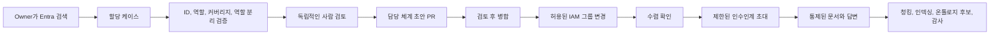

# 사용자-에이전트 할당 및 지식 이전

이 문서는 관리자가 사용자를 검색하고, FDAI 접근 권한을 할당하고, 사용자를 에이전트에
매핑하고, 승인 대응 체계를 구성하고, 사용자에게 과도한 부담을 주지 않으면서 운영 지식을
수집하는 목표 워크플로를 정의합니다. ID, 운영 책임, 승인, 대화, 문서 수집을 조정하지만 각
권한은 독립적으로 유지합니다.

> **안전 경계:** 사용자를 에이전트에 매핑해도 FDAI 역할은 부여되지 않습니다. 통합 관리자
> 워크플로가 두 결과를 함께 요청할 수는 있지만, RBAC과 운영 담당 체계는 여전히 별도 축으로
> 검증, 승인, 적용, 감사됩니다.

## 구현 상태

### 구현 범위

| 영역 | 상태 | 근거 | 참고 |
|------|------|------|------|
| 담당 체계 v2 임무와 커버리지 | implemented | `services/core-control-plane/src/fdai/core/stewardship/`; `services/core-control-plane/tests/core/stewardship/`; 집중 담당 체계 테스트 (71 passed) | 스키마, 결정론적 마이그레이션, 커버리지, 에스컬레이션, 알림 기본 요소가 있습니다. 실제 디렉터리 커버리지와 배포 훈련은 별도 근거입니다. |
| 배정 케이스, 독립 검토, 관찰 변환 결과 | implemented | `services/core-control-plane/src/fdai/core/human_assignment/`; `services/operator-service/src/fdai_operator_service/families/iam/assignments.py`; `console/src/routes/settings-iam-assignments.tsx`; 집중 사용자-에이전트 배정 테스트 (43 passed) | 리비전 기반 케이스와 읽기 전용 API/console은 역할, 임무, 권한 분리를 보존합니다. |
| 소유권 제안과 일치하는 병합 조정 | not-started | 배정을 인식하는 담당 체계 거버넌스 서비스 또는 인수인계 초안 게시기가 조립되지 않았습니다. `services/document-ingestion-api/src/fdai_ingestion_api_service/adapters/stewardship.py`의 서명된 수신 경로는 병합 근거만 저장합니다. | 다이제스트에 결합된 제안과 일치하는 병합이 케이스를 진행시키기 전까지 소유권과 IAM 효과는 종단 간 워크플로가 아닙니다. |
| 통제된 사용자 접근 변경 기능 | implemented | `services/core-control-plane/src/fdai/core/human_assignment/access_apply.py`; `services/core-control-plane/src/fdai/delivery/identity/entra_access.py`; `services/core-control-plane/src/fdai/delivery/identity/direct_api.py`; 집중 사용자-에이전트 배정 테스트 (43 passed) | 허용 목록 기반 계획, 적용, 검증, 롤백 기능이 관찰 모드로 있습니다. Console, 요청자, 대상 principal에는 어떤 공급자 권한도 부여하지 않습니다. |
| 사람 무응답 감독 | implemented | `services/core-control-plane/src/fdai/core/hil_resume/escalation_supervisor.py`; `services/core-control-plane/src/fdai/runtime/bootstrap.py`; 집중 shadow 감독자 테스트 (10 passed) | 주기적 워커는 shadow-only입니다. 디스패치 승격과 실제 단계별 역할 근거는 남아 있습니다. |
| 인수인계 목표와 피로도 통제 | implemented | `services/core-control-plane/src/fdai/core/human_assignment/goals.py`; `services/core-control-plane/src/fdai/core/human_assignment/fatigue.py`; `services/core-control-plane/tests/core/human_assignment/test_goals.py` | 영속 목표, 초대, 근거 참조, 다시 알림, 거절, 독립 검토 기능이 있습니다. 에이전트의 공백 생산과 현지화된 Bragi 렌더링은 연결되지 않았습니다. |
| 지식 근거와 후보 수명 주기 | in-progress | 기존 문서 수집 청크 계보 및 비활성 후보 계약; 집중 수집 테스트 | 목표와 업로드의 상관관계, ACL 필터 검색 근거, 에이전트 후보 전달, 충돌 검토, 운영 삭제 훈련은 완료되지 않았습니다. |
| 운영 승격과 운영 증명 | not-started | 이 문서에서 보존된 승격 증적, Azure 권한 검사, 운영 훈련 근거로 연결되는 항목이 없습니다. | IAM 적용, 무응답 디스패치, 선제적 인수인계는 각각 독립 검사를 통과할 때까지 사용할 수 없습니다. |

### 구현 이력

| 날짜 | 상태 | 변경 | 근거 | 남은 작업 |
|------|------|------|------|-----------|
| 2026-08-13 | in-progress | 이전 출처를 재구성하지 않고 구현 원장을 도입했으며, 구현된 케이스, IAM, 감독, 목표 기능을 누락된 소유권-IAM 조정과 분리했습니다. | `current change`; 구현 범위 표에 나열된 소스와 집중 검사. | 제안 및 병합 조정, 지식 전달, 독립 승격, 운영 근거를 완료합니다. |

### 남은 작업

- [ ] 승인된 케이스마다 다이제스트에 결합된 소유권 제안 하나를 조립하고, 일치하는 서명된 병합만 소유권 효과를 진행시킴을 입증하는 집중 테스트를 통과시킵니다.
- [ ] 일치하는 소유권 증적 후에만 형식이 지정된 IAM 적용 요청 하나를 게시하고, 수집 또는 Operator 서비스에 Graph 쓰기 권한을 부여하지 않으면서 허용 목록 기반 수렴과 소유권 인식 롤백을 입증합니다.
- [ ] 목표-업로드 바인딩, ACL 필터 검색, 에이전트 소유 공백 및 후보 이벤트, 현지화된 Bragi 렌더링, 충돌 검토, 노후화, 삭제 전파를 완료합니다.
- [ ] IAM 변경, 무응답 단계 디스패치, 선제적 인수인계의 승격 근거를 각각 보존합니다. 모든 승인 소진은 감사된 no-op으로 남아야 합니다.
- [ ] 워크플로를 `validated`로 표시하기 전에 추가, 거부, 시간 초과, 에스컬레이션, 회수, 롤백, 재시작, 공급자 장애, 재해 복구 훈련을 수행합니다.

## 설계 개요

목표 환경은 권한과 운영 감독을 분리합니다. `Settings > Identity and access`는 정확한 디렉터리
ID, FDAI App 역할, 접근 요청을 담당합니다. `Governance > Agent oversight`는 사람 의존성 맵,
지식 인수인계, 작업별 승인 경로, 매핑 검토를 담당합니다. Owner는 범위가 지정된 기본 및 백업
커버리지를 입증한 후 하나의 통제된 할당 케이스를 제출합니다. 케이스는 두 가지 결과를
조정합니다.

1. 검토된 담당 체계 풀 리퀘스트가 에이전트 인수인계 맵을 업데이트합니다.
2. 담당 체계 변경이 병합된 후 Thor가 사용자를 허용 목록의 Entra 역할 그룹에 추가합니다.
3. 두 결과가 일치한 후 매핑된 에이전트는 Bragi를 통해 제한된 지식 인수인계를 시작할 수 있고,
   업로드된 근거는 기존 에이전트 소유 수집 경로로 들어갑니다.



## 결정과 경계

- **하나의 워크플로와 분리된 권한:** `AssignmentCase`는 RBAC과 담당 체계를 조정하지만 하나의
  권한 모델로 합치지 않습니다.
- **그룹 멤버십을 IAM 쓰기 표면으로 사용:** 일상적인 등록은 구성된 FDAI 역할 그룹 하나에
  사용자를 추가하거나 제거합니다. 임의 그룹 ID나 직접 역할 ID를 받지 않습니다.
- **권한 부여는 담당 체계 우선, 접근 권한 마지막:** 새 사용자는 검토된 담당 체계 변경이
  병합된 후에만 콘솔 접근 권한을 받습니다. IAM 쓰기가 실패하면 새 접근 권한을 부여하지 않고,
  필수로 지정된 백업 담당자에게 업무를 라우팅합니다.
- **명시적인 운영 보고 체계:** 승인 체인은 FDAI 임무 그래프입니다. Entra 관리자 또는 HR 보고
  체계는 제안으로 표시할 수 있지만 승인 권한은 아닙니다.
- **무응답은 타이머로 판단:** 현재 상태, 일정, 부재중 신호는 참고 정보입니다. 전달, 확인,
  결정 시각이 권위 있는 에스컬레이션 입력입니다.
- **형식화된 이벤트 협업:** 에이전트끼리 직접 호출하거나 변경 가능한 인터뷰 상태를 공유하지
  않습니다. Bragi만 대화를 렌더링합니다.
- **지식은 먼저 참고 정보:** 답변과 문서는 검토와 승격 없이 권위 있는 정책 또는 온톨로지
  사실이 되지 않습니다.

## 관리자 경험

### 에이전트 oversight 작업 공간

거버넌스 화면은 에이전트 oversight 작업 공간을 제공합니다. 사람 중심 IAM 편집기나 중첩 카드
마법사 대신 에이전트 우선의 밀도 있는 작업 공간으로 유지합니다. ID와 역할 상세는 IAM 권위
소스의 읽기 전용 프로젝션입니다.

| 영역 | 내용 |
|------|------|
| 개요 | 공급자 가용성, 권한 모드, 유지관리자 하한, 백업 커버리지, 과부하, 소스 최신성입니다. |
| 사람 의존성 | 고정 Pantheon 역할, 에이전트와 범위의 담당 체계, 정확한 주체, 그룹 또는 일정, 유효 기간, 실패 시 차단 검증입니다. |
| 지식 인수인계 | 에이전트 소유 목표 템플릿, 근거 가중치, ACL과 출처 구간, 최신성, 피로도 예산, 로그인 초대입니다. |
| 승인 경로 | ActionType과 범위, 적격 역할, 정족수, 요청자 분리, 전달 상태, 무응답 TTL, 사전 권한입니다. |
| 매핑 검토 | 변경할 수 없는 케이스 리비전, 현재-제안 차이, 독립 검토자, 담당 체계 PR, IAM 수렴, 롤백, 감사 영수증입니다. |

`GET /stewardship` 버전 2는 각 accountable 담당자의 `primary`, `backup`, `escalation` 임무를
손실 없이 보존합니다. Informed 관계는 임무를 생략합니다. 브라우저는 목록 순서에서 운영 담당
체계를 추론하지 않으며, accountable 임무 누락이나 informed 관계의 임무 포함을 계약 오류로
처리합니다.

브라우저는 `GET /iam/directory/users`를 통해 검색하며 Graph 자격 증명을 받지 않습니다. 검색
결과는 안정적인 공급자 주체 ID, 활성 상태, 멤버 또는 게스트 유형, 현재 FDAI App 역할, 기존
에이전트 매핑, 현재 커버리지를 보여 줍니다. 표시 이름과 사용자 이름은 계정 식별을 위한 참고
정보이며 권위 있는 식별자가 아닙니다.

### 통합 할당 검토

1. **ID:** 정확히 하나의 활성 디렉터리 주체, 그룹, 구성된 일정을 확인합니다. 모호한 자유
  텍스트는 후보로 유지하며 제출할 수 없습니다.
2. **범위:** 운영 담당 체계를 에이전트와 서비스, 환경, 대상 범위에 연결합니다.
3. **담당 체계:** accountable 기본, 백업, 에스컬레이션 임무를 informed 관계와 분리해
  할당합니다. Informed 항목에는 임무가 없습니다.
4. **승인 커버리지:** ActionType별 역할 적격성, 정족수, 요청자, 대상, 검토자, 실행자 분리를
  평가합니다.
5. **인수인계 목표:** 선택한 에이전트의 버전 관리 목표 템플릿에서 시작하고 허용된 문서,
  링크, 명시적인 해당 없음 결정을 첨부합니다.
6. **검토:** 커버리지 결함이 있으면 제출을 차단하고 예정 결과, 독립 검토자, 롤백 또는
  forward 복구, 소스 최신성, 남은 경고를 보여 줍니다.

편집기는 비공개 초안을 저장할 수 있지만 제출하면 변경할 수 없는 `AssignmentCase` 하나를
생성합니다. 이후 의도 변경은 승인 이력을 편집하는 대신 기존 케이스를 대체하는 새 케이스를
생성합니다.

## 할당 및 임무 모델

### 통합 할당 케이스

`AssignmentCase`는 조정 상태이며 새로운 권한 소스가 아닙니다.

| 필드 | 목적 |
|------|------|
| `case_id` 및 `idempotency_key` | 재시도와 감사 상관 관계입니다. |
| `subject_ref` | 공급자와 변경되지 않는 Entra 개체 ID입니다. |
| `requested_role` | 원하는 FDAI App 역할과 구성된 그룹 슬롯입니다. |
| `duty_bindings` | 에이전트, 임무 슬롯, 범위, 유효 기간입니다. |
| `approval_routes` | 순서가 있는 적격 주체 또는 일정 참조입니다. |
| `handover_goal_refs` | 사용자에게 선택한 버전 관리 목표 템플릿입니다. |
| `requester`, `reviewers`, `justification` | 역할 분리와 귀속 정보입니다. |
| `effect_receipts` | 담당 체계 PR과 IAM 공급자 영수증입니다. |

권장 상태는 `draft`, `pending_review`, `approved`, `ownership_pr_open`,
`ownership_merged`, `iam_applying`, `active`, `rejected`, `degraded`, `superseded`입니다.
`active`만 선제적 인수인계 초대 또는 목표 변경을 허용합니다. Degraded 또는 대체된
배정의 기존 근거는 읽을 수 있지만 목표를 추가, 연기, 거절 또는 수락할 수 없습니다.

### 최소 커버리지

완전 자율이 아닌 모든 에이전트와 통제된 운영 범위에는 다음이 필요합니다.

- **기본 담당:** 한 명 이상의 `primary` 최종 책임자가 필요합니다.
- **백업 담당:** 서로 다른 `backup` 담당자 한 명 이상 또는 명시적인 `escalation` 대상 한 명
  이상이 필요합니다.
- **승인 적격성:** 해당 범위에서 승인이 필요한 작업의 최소 역할을 충족할 수 있는 서로 다른
  활성 주체 두 명 이상이 필요합니다.
- **플랫폼 대체 경로:** FDAI 유지관리자는 최종 플랫폼 에스컬레이션으로 유지되지만, 해당 임무에
  명시적으로 할당되지 않으면 도메인 백업 커버리지를 충족하지 않습니다.

검증기는 그룹을 확장하고 기본과 백업이 동일한 사용자로 확인되면 정상 상태를 수락하지 않습니다.
확장할 수 없는 그룹은 알림 대상으로 유지하지만 2인 승인 커버리지를 입증하지 못합니다. 한 사용자가
여러 에이전트를 담당할 수 있지만 과부하는 계속 표시됩니다.

### 운영 보고 그래프

명시적이고 순환하지 않는 임무 그래프를 사용합니다.

```text
HumanPrincipal -> occupies -> AgentDuty(primary|backup|escalation)
AgentDuty -> covers -> Agent + scope
AgentDuty -> escalates_to -> AgentDuty or schedule
AgentDuty -> requires_role -> FDAI App Role
```

그래프는 배포 상태이며 실제 테넌트 값을 사용하여 업스트림 카탈로그에 들어가지 않습니다. 구성된
최대 깊이, 자기 참조 금지, 유효 기간, 그리고 일정 어댑터가 현재 온콜 사용자를 제공하는 경우에도
정적 대체 대상 한 명을 갖습니다.

## 통제된 IAM 프로비저닝

할당 경로에는 이제 Thor 뒤의 쓰기 전용 `HumanAccessProvisioner` 공급자가 포함됩니다. 기존
`HumanIdentityDirectory`와 모든 Operator API 경로는 읽기 전용입니다. 새 경로는 ActionType을 별도로
승격할 때까지 관찰 전용입니다.

1. Forseti가 정확한 활성 주체, 구성된 역할 그룹, 커버리지 규칙, 요청자 분리, 예상 현재 멤버십을
   검증합니다.
2. Var가 독립적인 승인을 받습니다. 읽기 담당 및 기여자 부여에는 적격 Owner 한 명이 필요하고,
   Approver 및 Owner 부여에는 적격 검토자 두 명이 필요합니다. 요청자와 대상은 포함되지 않습니다.
3. 담당 체계 초안 PR을 먼저 검토하고 병합합니다.
4. Thor가 승인된 주체, 허용 목록 그룹 슬롯, 작업 해시, 예상 멤버십 리비전, 멱등 키를 사용하여
   프로비저너를 호출합니다.
5. 컨트롤러가 멤버십 수렴을 확인하고 콘텐츠가 없는 영수증을 저장한 후 케이스를 활성으로 표시합니다.
   역할 클레임을 받으려면 사용자가 새 토큰을 발급받아야 할 수 있습니다.
6. Saga가 모든 전환을 기록합니다. 잘못된 주체나 그룹 변경이 확인되면 Vidar가 새 멤버십을 제거할
   수 있습니다.

어댑터는 전용 워크로드 ID와 일상적인 FDAI 역할 그룹 4개의 변경 불가능한 허용 목록을
사용합니다. 그룹 생성, BreakGlass 부여, 임의, 동적 또는 role-assignable 그룹 대상 지정, Thor의
클라우드 리소스 권한 재사용은 지원하지 않습니다. Microsoft Graph의 사용자 멤버십 변경에는
테넌트 범위 애플리케이션 권한 `GroupMember.ReadWrite.All`이 필요합니다. 활성 사용자 사전
검사에는 `User.Read.All`도 필요합니다. 허용 목록은 보완 통제이며 디렉터리 권한 경계가 아닙니다.

권한을 회수할 때 관리자는 먼저 대체 커버리지를 할당합니다. 이전 임무를 제거하기 전에 접근 권한을
회수하고, 검토된 담당 체계 PR이 수렴하는 동안 백업 담당자가 기본 담당자가 됩니다. 자동화된 흐름은
관련 없는 기존 역할을 자동으로 제거하지 않습니다.

## 승인 무응답 및 에스컬레이션

채널 대체와 사람 에스컬레이션은 별도로 유지합니다. 채널 대체는 같은 단계의 전달을 재시도하고,
승인 감독자는 무응답 이후 다른 권한 있는 사용자로 이동합니다.

각 승인 대기 항목은 `delivered_at`, `ack_deadline`, `decision_deadline`, 전체 마감 시각, 현재
단계, 시도한 주체, 작업 해시, 최소 역할, 요청자, 대상, 영향도, 긴급도, 일정 확인 영수증을
저장합니다.

기본 진행 순서는 기본 담당 -> 백업 담당 -> 에스컬레이션 임무 -> 유지관리자입니다. 부재중 또는
위임 응답이 명시되면 즉시 다음 단계로 이동합니다. 거절은 최종 결정이며 "승인될 때까지 다른
사람에게 요청"을 의미하지 않습니다. 다음 단계는 변경되지 않은 작업 해시와 남은 마감 시간을
받습니다. 비교 후 설정 클레임으로 첫 번째 유효 결정만 수락하며 늦은 결정은 감사 후 무시합니다.

모든 단계가 만료되면 작업은 감사된 no-op으로 종료됩니다. 별도로 구성된 상시 권한은 일반 안전성
검토로 다시 진입할 수 있지만, 사용자의 부재만으로 자동 권한이 생기지는 않습니다.

## 선제적 지식 이전

### 세션 트리거

`active` 할당의 사용자가 로그인하면 Huginn이 콘텐츠 없는 세션 시작 이벤트를 내보냅니다.
인수인계 수명주기는 미완료 목표를 로드합니다. 매핑된 에이전트가 지식 공백을 게시하고, Odin이 이를
중복 제거하고 우선순위를 정한 후, Bragi가 한 번 초대합니다. "Muninn에 담당 영역의 미답변 런북
질문이 두 개 있습니다. 지금 최대 5분 동안 답변하거나, 문서를 업로드하거나, 나중에 다시 알림을
받을 수 있습니다."

매핑된 에이전트가 질문과 수락 기준을 소유합니다. Bragi는 이를 번역하고 렌더링할 뿐입니다. 거절이나
다시 알림은 콘솔 접근을 막지 않으며 목표를 완료로 표시하지 않습니다.

### 지식 이전 목표

`HandoverGoal`은 근거 요구 사항이 있는 버전 관리 체크리스트입니다. 기본 템플릿은 다음을 다룹니다.

- 운영 범위와 명시적인 제외 항목
- 결정 트리거, 임계값, SLO, 유지 관리 기간
- 런북, 롤백 절차, 검증 단계
- 종속성, 연락처, 기본 및 백업 에스컬레이션 경로
- 알려진 장애 모드, 예외, 해결되지 않은 위험
- 권위 있는 문서, 소스 소유자, 검토 날짜, 보존 분류

각 항목은 인용된 답변 또는 문서 범위가 있거나, 이유가 있는 명시적 `not_applicable` 결정이 있을
때만 완료됩니다. 상태는 `not_started`, `in_progress`, `blocked`, `ready_for_review`,
`accepted`, `stale`입니다. 기본 담당자가 요약을 검토하고, 영향이 큰 목표는 `accepted`가 되기
전에 백업 담당자의 확인도 필요합니다.

### 피로도 예산

반복 질문보다 비동기 근거를 우선하는 구성 가능한 기본값을 사용합니다.

- 로그인당 선제적 초대는 최대 한 번이며, 활성 인수인계 세션도 한 개로 제한합니다.
- 세션당 질문은 최대 세 개 또는 시간은 최대 5분입니다.
- 24시간 다시 알림과 주당 최대 두 번의 선제적 세션을 사용합니다.
- 사용자가 인시던트 또는 승인을 처리하는 동안에는 초대하지 않습니다.
- 위험도가 가장 높은 미해결 질문을 먼저 묻고 에이전트 간 수락된 사실을 재사용합니다.
- 항상 `Upload document`, `Answer now`, `Remind me later`를 제공합니다.

대화 예산이 소진된 후에도 중요한 공백은 할당 목록에 계속 표시됩니다. 반복 팝업이 아니라 최종
책임자의 업무가 됩니다.

## 지식 처리 및 에이전트 협업

답변, 링크, 파일은 기존 문서 수집 경계로 들어갑니다. 대화는 벡터 인덱스 또는 온톨로지에 직접
쓰지 않습니다.

| 단계 | 에이전트 책임 |
|------|---------------|
| 수집 및 상관 관계 | Huginn이 제한된 인수인계 근거 이벤트를 내보냅니다. |
| 보호 및 허용 여부 | Heimdall과 Forseti가 안전하지 않은 자료를 검사, 분류, 보류합니다. |
| 민감한 승격 | Var가 자기 승인 없이 사람 승인을 받습니다. |
| 구조 인식 청킹 및 검색 | Muninn이 제목, 표, 소스 범위, 버전, ACL, 콘텐츠 다이제스트를 보존합니다. |
| 온톨로지 및 규칙 후보 | Mimir가 형식화된 개념을 제안하고 Norns가 반복 패턴을 제안합니다. 둘 다 직접 승격하지 않습니다. |
| 충돌 해결 | Forseti가 근거를 검증하고 Odin이 모순되는 담당 체계 주장을 중재하며, 사용자에게 확인 질문 한 개를 보냅니다. |
| 감사 및 설명 | Saga가 콘텐츠 없는 수명주기 기록을 저장하고 Bragi가 승인된 소스 범위를 인용합니다. |

에이전트 논의는 `handover.goal.requested`, `knowledge.gap.raised`,
`knowledge.evidence.proposed`, `knowledge.conflict.detected`,
`handover.goal.review-requested`와 같은 형식화되고 재생 가능한 이벤트를 사용합니다. 이벤트에는 원문
대신 참조와 다이제스트가 포함됩니다. 각 구독자는 독립적으로 재시도할 수 있으며, 응답 누락이 다른
에이전트를 차단하지 않습니다.

청크는 문서 버전과 청크 정책 버전에 대해 결정적입니다. 테넌트 및 문서 ACL을 보존하고, 검색 중
권한 경계를 넘지 않으며, 소스 버전과 함께 삭제되거나 대체됩니다. 온톨로지 링크와 RAG 청크는
동일한 소스 범위를 인용합니다.
조각 기록에는 타입이 지정된 출처 구간, ACL 참조, chunk-policy 버전, 내용 다이제스트,
선택적 목표 참조가 포함됩니다. 후보 이벤트는 내용이 없는이며 항상 검토가 필요합니다.
자동 goal-to-upload 연결과 에이전트 후보 전달은 롤아웃 작업으로 남습니다.

## 보안, 개인정보 보호, 장애 동작

- 디렉터리 검색, 역할 목록 읽기, 역할 변경, 관리자 조회, 일정, 현재 상태는 별도 공급자 기능을
  사용합니다. 관리자, 일정, 현재 상태 접근은 선택 사항입니다.
- 원문 문서 텍스트, 이름, 사용자 이름, 개체 ID, 토큰, 공급자 응답은 로그나 일반 이벤트 토픽에
  들어가지 않습니다. 감사에는 안정적인 참조와 다이제스트를 저장합니다.
- 디렉터리 장애는 새 할당 제출 또는 IAM 적용을 차단하지만 현재 담당 체계를 지우지 않습니다. 일정
  장애가 발생하면 필수 정적 백업을 사용합니다.
- 담당 체계는 병합되었지만 IAM이 실패하면 케이스는 `degraded`가 되고, 사용자는 새 역할을 받지
  않으며, 백업이 계속 활성 상태를 유지하고, Owner가 동일한 멱등 쓰기를 다시 시도할 수 있습니다.
- 인수인계 대화는 자율성을 높이거나, IAM을 변경하거나, 자체 근거를 승인하거나, 규칙 또는 온톨로지
  후보를 승격할 수 없습니다.
- 모든 변경에는 중지 조건, 제한된 대상 그룹, 멱등 키, 롤백 또는 전진 복구 경로, Saga 감사
  기록이 있습니다.

## 제공 계획 및 종료 기준

종속성 순서, PR 소유 파일 표면, 호환성 마이그레이션, 집중 테스트, Azure 권한, 롤아웃 근거,
중지 조건은 [사용자-에이전트 할당 구현 계획](human-agent-assignment-implementation-plan-ko.md)에
정의되어 있습니다.

운영 컨트롤은 독립적인 가용성, 활성화된, authority-mode 축을 노출합니다. Kill 전환은
변경 충족 여부를 낮출 수만 있습니다. 감사되는 활성화된 선호 설정은 재시작 시 적용되며
승격 상태를 바꾸지 않고 privileged 어댑터 조립을 억제할 수 있습니다.
조정은 현재 held 사례의 audited shadow 복구 계획만 만들며 IAM 프로바이더를 호출하지
않습니다. 영속 상태가 구성되면 readiness-gated 런타임 워커가 제한된
`human_access.reconciliation_interval_seconds` 주기로 이 관찰을 반복합니다.

1. **할당 프로젝션:** 통합 읽기 모델, 커버리지 검증기, IAM ID 프로젝션, 거버넌스 에이전트
  oversight 작업 공간을 추가합니다. 제출은 관찰
   전용이며 공급자 변경을 만들지 않습니다.
2. **통제된 IAM 적용:** 허용 목록 프로비저너, 상위 검토 정책, 수렴 영수증, 재시도, 롤백을
   추가합니다. 관찰 비교에서 대상 불일치가 0건임을 확인한 후 승격합니다.
3. **승인 감독자:** 기본, 백업, 에스컬레이션 임무와 무응답 타이머를 추가합니다. 단계 전환을
   활성화하기 전에 실제 승인 이력과 관찰 모드 시간을 비교합니다.
4. **선제적 인수인계:** 목표 템플릿, 한 번의 초대 정책, 다시 알림, 요약, 검토를 추가합니다. 메시지
   수가 아니라 완료와 수신 거부를 측정합니다.
5. **지식 수명주기:** 근거 이벤트, 결정적 청크, 온톨로지 후보, 충돌 검토, 오래됨 표시, 삭제
   전파를 추가합니다.

첫 번째 릴리스는 다음 조건을 충족하면 완료됩니다.

- [ ] Owner가 정확한 활성 Entra 주체를 검색하고 기존 역할 및 에이전트 매핑을 볼 수 있습니다.
- [ ] 모든 활성 매핑이 기본 담당 한 명과 서로 다른 백업 또는 에스컬레이션 대상 한 명을 입증합니다.
- [ ] 검토된 케이스가 담당 체계 PR과 허용 목록 IAM 멤버십을 자동으로 수렴시킵니다.
- [ ] 요청자 또는 대상이 자신의 접근 권한을 승인할 수 없고, 상위 역할에는 정족수가 필요합니다.
- [ ] 미응답 승인이 적격 단계를 거쳐 이동하고 감사된 no-op으로 종료됩니다.
- [ ] 매핑된 사용자는 구성된 인수인계 예산보다 많은 요청을 받지 않고 다시 알림이나 업로드를 선택할
  수 있습니다.
- [ ] 수락된 모든 목표가 승인된 근거를 인용하고, 모든 청크가 소스 ACL과 범위를 보존합니다.
- [ ] 에이전트 협업은 형식화된 이벤트 전용이며, 재시도 가능하고, 콘텐츠를 최소화하고, Saga가
  감사합니다.

## 관련 문서

| 알아볼 내용 | 문서 |
|-------------|------|
| 종속성 순서 구현 및 롤아웃 | [사용자-에이전트 할당 구현 계획](human-agent-assignment-implementation-plan-ko.md) |
| FDAI 역할, 디렉터리 검색, 현재 접근 요청 | [사용자 RBAC 및 Entra ID](user-rbac-and-identity-ko.md) |
| 담당 체계 맵과 최종 책임자 | [에이전트 운영 담당 체계 및 담당자 인수인계](agent-stewardship-and-handover-ko.md) |
| 사람 무응답과 상시 권한 | [에스컬레이션 및 상시 권한](../decisioning/escalation-and-standing-authority-ko.md) |
| 에이전트 소유 문서 승인과 인덱싱 | [문서 수집 에이전트 소유권](document-ingestion-agent-ownership-ko.md) |
| 콘솔 및 ChatOps 보안 경계 | [운영자 콘솔](operator-console-ko.md) |
