# Human-Agent Assignment and Knowledge Transfer

This document defines the target administrator workflow for finding a person, assigning FDAI
access, mapping the person to agents, establishing approval coverage, and collecting operational
knowledge without overwhelming the person. It coordinates identity, operational ownership,
approval, conversation, and document ingestion while keeping each authority independent.

> **Status:** Partially implemented. Directory search, governed access-request records, the
> ownership map, ordered duties, the composite assignment-case core, and the observation-only
> Assignments API and console exist. Owners can revalidate one exact active subject, create and
> review revisioned cases, and inspect joined role, duty, coverage, case, and unavailable-handover
> evidence. Ownership PR coordination and the Entra membership path now publish a typed apply
> request, plan one allowlisted group mutation, verify convergence, and roll back a failed
> postcondition. The path remains in observation mode. The human non-response supervisor runs as a
> shadow-only periodic worker; enforce promotion, automated replacement-
> coverage revocation, and proactive handover goals aren't implemented.
>
> **Safety boundary:** Mapping a person to an agent never grants an FDAI role. A combined
> administrator workflow may request both outcomes, but RBAC and operational ownership are still
> validated, approved, applied, and audited as separate axes.

## Design at a glance

The target experience adds an **Assignments** tab under `Settings > IAM`. An Owner searches the
configured human directory once, chooses FDAI access and agent duties, proves primary and backup
coverage, and submits one governed assignment case. The case coordinates two effects:

1. A reviewed ownership pull request updates the agent handover map.
2. After the ownership change merges, Thor adds the person to an allowlisted Entra role group.
3. After both effects converge, the mapped agents can begin a bounded knowledge handover through
   Bragi, and uploaded evidence enters the existing agent-owned ingestion path.

```mermaid
flowchart LR
  A[Owner searches Entra] --> C[Assignment case]
  C --> V[Validate identity, role, coverage, and separation]
  V --> R[Independent human review]
  R --> P[Ownership draft PR]
  P --> M[Reviewed merge]
  M --> I[Allowlisted IAM group mutation]
  I --> X[Convergence check]
  X --> H[Bounded handover invitation]
  H --> K[Governed documents and answers]
  K --> G[Chunk, index, ontology candidates, and audit]
```



## Decisions and boundaries

- **One workflow, separate authorities:** `AssignmentCase` coordinates RBAC and ownership but
  doesn't collapse them into one permission model.
- **Group membership is the IAM write surface:** Routine registration adds or removes a person
  from one configured FDAI role group. It doesn't accept arbitrary group ids or direct role ids.
- **Ownership first, access last for grants:** A new user receives console access only after the
  reviewed ownership change merges. A failed IAM write leaves the user without new access and
  routes work to the already-required backup.
- **Explicit operational reporting:** The approval chain is an FDAI duty graph. An Entra manager
  or HR reporting line may be shown as a suggestion, but it isn't approval authority.
- **Timers determine non-response:** Presence, calendar, and out-of-office signals are advisory.
  Delivered, acknowledged, and decided timestamps are the authoritative escalation inputs.
- **Typed-event collaboration:** Agents don't call each other or share mutable interview state.
  Bragi is the only conversational renderer.
- **Knowledge is advisory first:** Answers and documents don't become authoritative policy or
  ontology facts without review and promotion.

## Administrator experience

### Assignments tab

The existing IAM surface gains an Assignments tab beside Users and Access requests. Keep the page
as a dense operational workspace rather than a wizard made of nested cards.

| Region | Contents |
|--------|----------|
| Search and filters | Name or username, active status, FDAI role, mapped agent, coverage, and handover state. |
| Assignment roster | Person, role, agent duties, primary or backup slot, escalation target, knowledge progress, and last verification. |
| Assignment editor | Identity, FDAI role, agent duties, approval coverage, handover goals, and final review. |
| Validation panel | Missing backup, duplicate principals, stale identity, role mismatch, reporting cycle, overload, and unresolved directory result. |
| Evidence drawer | Assignment audit, ownership PR, IAM receipt, approval history, and handover evidence references. |

The browser searches through `GET /iam/directory/users`; it never receives Graph credentials. A
result exposes the stable provider subject id, active state, member or guest type, current FDAI App
Roles, existing agent mappings, and current coverage. Display name and username are recognition
hints, not authoritative identifiers.

### Assignment editor

1. **Identity:** Select exactly one active directory subject. Ambiguous free text can't be
   submitted.
2. **FDAI access:** Choose Reader, Contributor, Approver, or Owner. BreakGlass stays outside the
   routine workflow.
3. **Agent duties:** Select one or more agents and a duty slot for each mapping.
4. **Approval coverage:** Show the primary, backup, and escalation route, including role
   eligibility for each selected action domain.
5. **Handover goals:** Start from agent-owned goal templates, adjust scope, and attach known
   documents or links.
6. **Review:** Show both intended effects, approvers, rollback, and residual warnings.

The editor may save a private draft, but submission creates one immutable `AssignmentCase`. A
later intent change creates a superseding case instead of editing approved history.

## Assignment and duty model

### Composite assignment case

`AssignmentCase` is coordination state, not a new authorization source.

| Field | Purpose |
|-------|---------|
| `case_id` and `idempotency_key` | Retry and audit correlation. |
| `subject_ref` | Provider plus immutable Entra object id. |
| `requested_role` | Desired FDAI App Role and configured group slot. |
| `duty_bindings` | Agent, duty slot, scope, and effective dates. |
| `approval_routes` | Ordered eligible subjects or schedule references. |
| `handover_goal_refs` | Versioned goal templates selected for the person. |
| `requester`, `reviewers`, and `justification` | Separation of duties and attribution. |
| `effect_receipts` | Ownership PR and IAM provider receipts. |

Recommended states are `draft`, `pending_review`, `approved`, `ownership_pr_open`,
`ownership_merged`, `iam_applying`, `active`, `rejected`, `degraded`, and `superseded`. Only
`active` allows a proactive handover invitation.

### Minimum coverage

Every non-autonomous agent and governed operational scope needs:

- **Primary:** At least one `primary` accountable owner.
- **Backup:** At least one distinct `backup` owner or one explicit `escalation` target.
- **Approval eligibility:** At least two distinct live principals who can satisfy the minimum role
  for approval-bearing actions in that scope.
- **Platform fallback:** FDAI maintainers remain the final platform escalation, but they don't
  satisfy domain backup coverage unless explicitly assigned to that duty.

The validator expands groups and rejects a clean state when primary and backup resolve to the same
person. A group that can't be expanded remains a notification target but doesn't prove two-person
approval coverage. One person may own several agents, but overload remains visible.

### Operational reporting graph

Use an explicit, acyclic duty graph:

```text
HumanPrincipal -> occupies -> AgentDuty(primary|backup|escalation)
AgentDuty -> covers -> Agent + scope
AgentDuty -> escalates_to -> AgentDuty or schedule
AgentDuty -> requires_role -> FDAI App Role
```

The graph is deployment state and never enters the upstream catalog with real tenant values. It
has a configured maximum depth, no self-loop, effective dates, and one static fallback even when a
schedule adapter supplies the current on-call person.

## Governed IAM provisioning

The assignment path now includes a write-only `HumanAccessProvisioner` provider behind Thor. The
existing `HumanIdentityDirectory` and every read API route remain read-only. The new path is
observation-only until its ActionType is separately promoted.

1. Forseti validates the exact active subject, configured role group, coverage rules, requester
   separation, and expected current membership.
2. Var obtains independent approval. Reader and Contributor grants require one eligible Owner.
   Approver and Owner grants require two eligible reviewers. The requester and target don't count.
3. The ownership draft PR is reviewed and merged first.
4. Thor invokes the provisioner with the approved subject, allowlisted group slot, action hash,
   expected membership revision, and idempotency key.
5. The controller reads the role roster until membership converges, stores a content-free receipt,
   and marks the case active. The user may need a new token before the role claim appears.
6. Saga records every transition. Vidar can remove the new membership if verification proves that
   the wrong subject or group changed.

The adapter uses a dedicated workload identity and an immutable allowlist of the four routine FDAI
role groups. It can't create a group, grant BreakGlass, target an arbitrary, dynamic, or
role-assignable group, or reuse Thor's cloud-resource permissions. Microsoft Graph requires the
tenant-wide application permission `GroupMember.ReadWrite.All` for user membership mutation. The
active-user precheck also requires `User.Read.All`. The allowlist is a compensating control, not a
directory permission boundary.

For revocation, the administrator assigns replacement coverage first. Access is revoked before the
old duty is removed, and the backup becomes primary while the reviewed ownership PR converges. No
automated flow silently removes an unrelated existing role.

## Approval non-response and escalation

Channel fallback and human escalation remain separate. Channel fallback retries delivery to the
same rung. The approval supervisor advances to another authorized person after non-response.

Each pending approval stores `delivered_at`, `ack_deadline`, `decision_deadline`, the overall
deadline, current rung, attempted subjects, action hash, minimum role, requester, target, impact,
urgency, and schedule resolution receipt.

The default progression is primary -> backup -> escalation duty -> maintainer. A declared
unavailable or delegate response advances immediately. A rejection is terminal and doesn't mean
"ask someone else until approved." The next rung receives the unchanged action hash and remaining
deadline. The first valid decision wins through a compare-and-set claim; late decisions are audited
and ignored.

If all rungs expire, the action ends as an audited no-op. Standing authorization, when separately
configured, may re-enter the normal risk gate, but absence never creates automatic authority.

## Proactive knowledge transfer

### Session trigger

After an `active` assignment's user signs in, Huginn emits a content-free session-start event. The
handover lifecycle loads incomplete goals. Mapped agents publish their knowledge gaps, Odin
deduplicates and prioritizes them, and Bragi offers one invitation: "Muninn has two unanswered
runbook questions for your ownership area. Spend up to five minutes now, upload a document, or
remind me later."

The mapped agent owns the question and acceptance criteria. Bragi only translates and renders it.
Declining or snoozing never blocks console access and never marks a goal complete.

### Knowledge transfer goals

A `HandoverGoal` is a versioned checklist with evidence requirements. The default template covers:

- operational scope and explicit exclusions;
- decision triggers, thresholds, SLOs, and maintenance windows;
- runbooks, rollback procedures, and verification steps;
- dependencies, contacts, primary and backup escalation routes;
- known failure modes, exceptions, and unresolved risks;
- authoritative documents, source owners, review dates, and retention class.

Each item is complete only with a cited answer or document span, or an explicit `not_applicable`
decision with a reason. States are `not_started`, `in_progress`, `blocked`, `ready_for_review`,
`accepted`, and `stale`. The primary owner reviews the summary; high-impact goals also require
backup acknowledgement before `accepted`.

### Fatigue budget

Use configurable defaults that prefer asynchronous evidence over repeated questions:

- at most one proactive invitation per login and one active handover session;
- at most three questions or five minutes per session;
- a 24-hour snooze and no more than two proactive sessions per week;
- no invitation while the user is handling an incident or approval;
- ask the highest-risk unresolved question first and reuse accepted facts across agents;
- always offer `Upload document`, `Answer now`, and `Remind me later`.

Critical gaps remain visible in the assignment roster after the budget is exhausted. They become
accountable work, not repeated pop-ups.

## Knowledge processing and agent collaboration

Answers, links, and files enter the existing document-ingestion boundary. The conversation never
writes directly to a vector index or ontology.

| Stage | Agent responsibility |
|-------|----------------------|
| Intake and correlation | Huginn emits a bounded handover evidence event. |
| Protection and admissibility | Heimdall and Forseti scan, classify, and hold unsafe material. |
| Sensitive promotion | Var obtains human approval with no self-approval. |
| Structure-aware chunking and retrieval | Muninn preserves headings, tables, source spans, version, ACL, and content digest. |
| Ontology and rule candidates | Mimir proposes typed concepts; Norns proposes recurring patterns. Neither promotes them. |
| Conflict resolution | Forseti verifies evidence; Odin arbitrates contradictory ownership claims; the user receives one focused clarification. |
| Audit and explanation | Saga stores content-free lifecycle records; Bragi cites admitted source spans. |

Agent discussion uses typed, replayable events such as `handover.goal.requested`,
`knowledge.gap.raised`, `knowledge.evidence.proposed`, `knowledge.conflict.detected`, and
`handover.goal.review-requested`. Events carry references and digests, not raw document text.
Every subscriber is independently retryable, and a missing response doesn't block other agents.

Chunks are deterministic for a document version and chunk-policy version. They preserve tenant and
document ACLs, never cross an authorization boundary during retrieval, and are deleted or
superseded with their source version. Ontology links and RAG chunks cite the same source spans.

## Security, privacy, and failure behavior

- Directory search, roster read, role mutation, manager lookup, calendar, and presence use separate
  provider capabilities. Manager, calendar, and presence access is optional.
- Raw document text, names, usernames, object ids, tokens, and provider responses don't enter logs
  or general event topics. Audit stores stable references and digests.
- A directory outage blocks new assignment submission or IAM apply but doesn't erase ownership. A
  schedule outage uses the required static backup.
- If ownership merged but IAM failed, the case is `degraded`, the user has no new role, the backup
  remains active, and an Owner can retry the same idempotent write.
- A handover conversation can't raise autonomy, modify IAM, approve its own evidence, or promote a
  rule or ontology candidate.
- Every mutation has a stop condition, bounded target group, idempotency key, rollback or
  forward-repair path, and Saga audit record.

## Delivery plan and exit criteria

The dependency order, PR-owned file surfaces, compatibility migration, focused tests, Azure
permissions, rollout evidence, and stop conditions are defined in the
[Human-agent assignment implementation plan](human-agent-assignment-implementation-plan.md).

1. **Assignment projection:** Add the composite read model, coverage validator, and Assignments tab.
   Submission remains observation-only and creates no provider mutation.
2. **Governed IAM apply:** Add the allowlisted provisioner, elevated-review policy, convergence
   receipt, retry, and rollback. Promote after shadow comparisons show zero target mismatch.
3. **Approval supervisor:** Add primary, backup, and escalation duties plus the non-response timer.
   Run shadow timing against real approval history before enabling rung transitions.
4. **Proactive handover:** Add goal templates, one-invitation policy, snooze, summaries, and review.
   Measure completion and opt-out, not message count.
5. **Knowledge lifecycle:** Add evidence events, deterministic chunks, ontology candidates,
   conflict review, staleness, and deletion propagation.

The first release is complete when:

- [ ] An Owner can search an exact active Entra subject and see existing role and agent mappings.
- [ ] Every active mapping proves one primary and one distinct backup or escalation target.
- [ ] A reviewed case automatically converges the ownership PR and allowlisted IAM membership.
- [ ] No requester or target can approve their own access, and elevated roles require quorum.
- [ ] An unanswered approval advances through eligible rungs and ends in an audited no-op.
- [ ] A mapped user receives no more than the configured handover budget and can snooze or upload.
- [ ] Every accepted goal cites admitted evidence, and every chunk preserves source ACL and span.
- [ ] Agent collaboration is typed-event-only, retryable, content-minimized, and Saga-audited.

## Related docs

| To learn about | Read |
|----------------|------|
| Dependency-ordered implementation and rollout | [Human-agent assignment implementation plan](human-agent-assignment-implementation-plan.md) |
| FDAI roles, directory search, and current access requests | [User RBAC and Entra identity](user-rbac-and-identity.md) |
| Ownership map and accountable owners | [Agent operational ownership and ownership handover](agent-stewardship-and-handover.md) |
| Human non-response and standing authorization | [Escalation and standing authority](../decisioning/escalation-and-standing-authority.md) |
| Agent-owned document admission and indexing | [Document ingestion agent ownership](document-ingestion-agent-ownership.md) |
| Console and ChatOps security boundaries | [Operator console](operator-console.md) |
