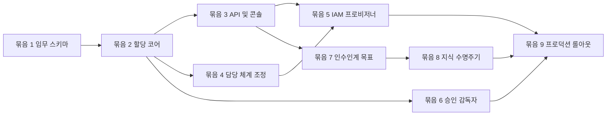

# 사용자-에이전트 할당 구현 계획

이 계획은 사용자-에이전트 할당 및 지식 인수인계 설계를 `main`에서 진행하는 종속성 순서의 작업
묶음으로 구체화합니다. 기능 브랜치 없이 각 묶음을 하나 이상의 집중 커밋으로 완료합니다. IAM
쓰기를 활성화하기 전에 필요한 소유 모듈, 호환성 경로, API 및 이벤트 계약,
집중 테스트, Azure 권한, 롤아웃 제어, 근거를 정의합니다.

> **권한 경계:** FDAI Console은 도메인 스키마로 검증된 케이스를 제출합니다. Graph 쓰기 권한 또는 Thor의
> ID를 받지 않습니다. 담당 체계 병합, 사람 승인, IAM 적용, 지식 승격은 각각 독립적으로 검증
> 가능한 결과로 유지합니다.

## 구현 상태

### 구현 범위

| 영역 | 상태 | 근거 | 참고 |
|------|------|------|------|
| 묶음 1-3: 임무, 배정 코어, API, 콘솔 | implemented | `services/core-control-plane/src/fdai/core/stewardship/`; `services/core-control-plane/src/fdai/core/human_assignment/`; `services/operator-service/src/fdai_operator_service/families/iam/assignments.py`; `console/src/routes/settings-iam-assignments.tsx`; 집중 사용자-에이전트 배정 테스트 (43 passed) | 이 묶음은 공급자 변경 없이 관찰 전용 의도와 변환 결과를 구성합니다. |
| 묶음 4: 소유권 PR 조정 | not-started | `StewardshipGovernanceService` 또는 동등한 배정 인식 게시기가 없습니다. 현재 서명된 웹후크는 케이스 또는 후보 다이제스트 상관관계 없이 병합 근거를 기록합니다. | 이 의존성이 없으므로 배정 워크플로는 소유권 수렴을 입증하거나 IAM 전제 조건을 게시할 수 없습니다. |
| 묶음 5: 사용자 접근 공급자 기능 | implemented | `services/core-control-plane/src/fdai/core/human_assignment/access_apply.py`; `services/core-control-plane/src/fdai/delivery/identity/entra_access.py`; `services/core-control-plane/src/fdai/delivery/identity/direct_api.py`; 집중 사용자-에이전트 배정 테스트 (43 passed) | 관찰 전용 허용 목록, 수렴, 롤백 기능이 있지만 묶음 4는 아직 배정 케이스에서 이를 트리거하지 않습니다. |
| 묶음 6: 무응답 감독자 | implemented | `services/core-control-plane/src/fdai/core/hil_resume/escalation_supervisor.py`; `services/core-control-plane/src/fdai/runtime/bootstrap.py`; 집중 shadow 감독자 테스트 (10 passed) | 주기적 shadow 관찰이 있습니다. 운영 단계 디스패치는 승격되지 않았습니다. |
| 묶음 7: 인수인계 목표 코어와 명령 | implemented | `services/core-control-plane/src/fdai/core/human_assignment/goals.py`; `services/operator-service/src/fdai_operator_service/families/iam/handover.py`; 집중 사용자-에이전트 배정 테스트 (43 passed) | 영속 초대와 응답 명령이 있습니다. 에이전트의 공백 생산과 현지화된 Bragi 렌더링은 연결되지 않았습니다. |
| 묶음 8: 지식 근거 전달 | in-progress | `packages/service-contracts/src/fdai_service_contracts/document.py`; 기존 수집 청크 계보 테스트 | 선택적 목표 참조와 결정론적 근거 메타데이터가 있습니다. 목표-업로드 상관관계, 후보 전달, ACL 검색, 검토, 삭제 훈련은 남아 있습니다. |
| 묶음 9: 운영 롤아웃 | in-progress | `services/core-control-plane/src/fdai/core/human_assignment/production_controls.py`; `services/core-control-plane/src/fdai/runtime/human_assignment_reconciliation.py`; `services/core-control-plane/src/fdai/delivery/runtime_settings.py` | 기능 축과 관찰 전용 조정이 있습니다. 적용 모드 승격, Azure 권한 검사, 대시보드, 경고, 자동 복구, 운영 훈련은 완료되지 않았습니다. |

### 구현 이력

| 날짜 | 상태 | 변경 | 근거 | 남은 작업 |
|------|------|------|------|-----------|
| 2026-08-13 | in-progress | 이전 출처를 재구성하지 않고 구현 원장을 도입하고 묶음 4와 묶음 5의 의존성 주장을 바로잡았습니다. | `current change`; 구현 범위 표에 나열된 소스와 집중 검사. | 묶음 4를 구현하고 묶음 8-9를 완료하며 승격 및 운영 근거를 수집합니다. |

### 남은 작업

- [ ] 멱등이고 다이제스트에 결합된 담당 체계 제안 하나와 해당 배정 케이스만 진행시키는 서명된 일치 병합 증적으로 묶음 4를 구현합니다.
- [ ] 일치하는 증적에서만 형식이 지정된 IAM 적용 요청을 게시하고 소유권, 검토, IAM, 실행기 권한이 이벤트 경계에서 합쳐지지 않음을 입증합니다.
- [ ] 에이전트 소유 인수인계 공백 생산, 현지화된 Bragi 렌더링, 목표-업로드 바인딩, 후보 전달, ACL 검색, 충돌 검토, 노후화, 삭제 전파를 완료합니다.
- [ ] 묶음 9의 Azure 권한 검사, 비운영 변경 및 롤백 훈련, shadow 비교, 대시보드, 경고, 재시작 및 장애 복구 근거를 수행하고 보존합니다.
- [ ] IAM 변경, 무응답 디스패치, 선제적 인수인계는 각각 롤아웃 임계값을 통과한 뒤 독립적으로 승격합니다. 소진 또는 불충분한 근거에서는 감사된 no-op을 보존합니다.

## 제공 형태

구현을 `main`의 집중된 작업 묶음 9개로 나눕니다. 묶음 1부터 묶음 4까지는 완전한 관찰 전용
워크플로를 만듭니다. 묶음 5는 첫 번째 공급자 변경이며 별도 승격 전까지 관찰 모드로 유지합니다.
묶음 6부터 묶음 8까지는 IAM 권한을 높이지 않고 승인 연속성과 지식 수집을 추가합니다. 각 묶음은
집중 커밋 전에 완료하고 검증하며, 관련 없는 작업 트리 변경을 해당 커밋에 섞지 않습니다.

## 현재 기준선과 공백

| 영역 | 재사용 | 누락된 구현 |
|------|--------|-------------|
| 디렉터리 | `HumanIdentityDirectory`, Entra 검색, 정확한 주체 조회, App 역할 목록, 허용 목록 Entra 멤버십 어댑터 | 적용 모드 승격 근거와 프로덕션 권한 준비 상태 |
| 접근 | `AccessRequestService`, 원자적 상태와 감사, Owner 검토, 자기 승인 방지, 허용 목록 기반 관찰 모드 provider | Assignment-case apply trigger, 회수용 대체 커버리지 수명 주기, provider reconciliation |
| 담당 체계 | 담당 체계 v2 임무, 커버리지, 에스컬레이션 순서, 영속 handover draft, signed merge intake | Assignment-aware proposal 게시, candidate-digest correlation, matching-merge case 진행 |
| 승인 | `HilResumeCoordinator`, 온콜 기본/보조 영수증, 다시 알림, 부하 제어, 주기적 shadow 무응답 관찰 | 운영 승격, 실제 운영 rung-role 검증, urgency 압축 |
| 대화 | 인증된 세션, 영구 턴, Bragi 설명, 제한된 handover session 명령 | Agent-owned gap 생산과 현지화된 proactive invitation rendering |
| 문서 | 에이전트 소유 승인, source span, 결정론적 chunking, pgvector, optional goal reference | Goal-to-upload binding, ACL-filtered retrieval 근거, candidate 전달 |
| 콘솔 | IAM 사용자, 역할, 요청, 디렉터리 검색, 관찰 전용 Assignments 탭 및 편집기 | 수렴 및 활성 목표 프로젝션 |

## 코딩 전 계약 결정

### 담당 체계 스키마 마이그레이션

담당 체계 스키마 v2는 accountable 담당자 항목에 `duty: primary | backup | escalation`을
추가합니다. `responsibility`는 `accountable | informed`를 유지하고 informed 항목에는 임무가
없습니다. 다음 호환 기간을 사용하는 추가 방식 마이그레이션입니다.

1. v2 로더가 v1을 읽고 첫 accountable 주체를 `primary`, 이후 주체를 `backup`으로 유도하지만
  `duty_derived` 및 `backup_missing` 점검 결과를 냅니다.
2. `scripts/governance/migrate-stewardship-v2.py`는 검토 가능한 v2 후보를 렌더링하며 라이브 파일을
  직접 편집하지 않습니다.
3. 새 할당 케이스는 항상 v2를 냅니다. 기존 v1 배포는 관찰 모드에서 계속 동작합니다.
4. 적용 모드는 v2, 활성 기본 한 명, 서로 다른 활성 백업 또는 에스컬레이션 한 명을 요구합니다.

이를 통해 두 번째 변경 가능 임무 그래프를 만들지 않고 `config/agent-stewardship.yaml`을 담당
체계의 권위 있는 소스로 유지합니다.

### 할당 상태

순수 모델, 전환 검증, 커버리지 점검, 기존 `StateStore` 기반 조정자를 포함하는
`services/core-control-plane/src/fdai/core/human_assignment/`를 추가합니다. 초기 영속성은 원자적 `state_kv`와 감사 해시
체인을 사용하므로 첫 번째 릴리스에는 Alembic 마이그레이션이 필요하지 않습니다.

| 상태 키 | 내용 |
|---------|------|
| `human_assignment:case:<case_id>` | 변경 불가능한 의도, 리비전, 요청자, 대상, 역할, 임무, 목표, 결과 영수증 |
| `human_assignment:decision:<case_id>` | 독립적인 검토 결정과 정족수 근거 |
| `human_assignment:active:<subject_hash>:<agent>:<scope_hash>` | 이름과 사용자 이름이 없는 현재 수렴 할당 프로젝션 |
| `handover_goal:<goal_id>` | 목표 리비전, 필수 근거 슬롯, 피로도 상태, 검토 상태 |

묶음 2는 사례 키만 씁니다. 추가 전용 검토 영수증을 리비전 기반 사례 스냅샷에 포함하므로
정족수 근거와 수명 주기 상태가 하나의 원자적 CAS로 함께 진행됩니다. 별도의 결정 및 활성
변환 결과 키는 묶음 3 읽기 모델 작업에 남아 있습니다.

상태 전환은 `초안 -> pending_review -> approved -> ownership_pr_open ->
ownership_merged -> iam_applying -> 활성`입니다. 최종 또는 보류 상태는 `rejected`, `degraded`,
`superseded`입니다. 비교 후 설정 리비전 검사가 오래된 명령을 차단합니다.

### 명령, 이벤트, 작업

Operator API는 케이스를 만들 수 있지만 결과를 적용할 수 없습니다. 머신 협업은 검증된 이벤트와 기존
컨트롤 루프 수집 경로를 사용합니다.

Semantic 요청 및 결과 logical topic을 하나의 physical Event Hub로 multiplex해도 사람 principal,
역할, 승인 또는 할당 리비전은 병합되지 않습니다. 인증된 principal은 versioned 요청에 유지되며,
physical-topic RBAC는 전송 접근만 부여하고 할당 또는 실행 권한은 부여하지 않습니다. 기한이 제한된
semantic 재생은 typed hold만 만들 수 있으며 할당 케이스를 만들거나 진행할 수 없습니다. 타입이
고정된 JSONB 영속성은 principal 또는 할당 상태를 변경하지 않습니다.

| 계약 | 목적 |
|------|------|
| `POST /iam/assignment-cases` | Owner가 변경 불가능한 할당 의도와 멱등 키를 제출합니다. |
| `GET /iam/assignments` | 역할, 임무, 커버리지, 케이스, 인수인계 프로젝션을 조인합니다. |
| `GET /iam/assignment-cases/{case_id}` | 결과 영수증, 감사 참조, 실패 상태를 반환합니다. |
| `human.assignment.requested` | Forseti 검증 및 Var 검토 입력입니다. |
| `human.assignment.ownership_merged` | 서명된 웹후크가 정확한 담당 체계 리비전 병합을 입증합니다. |
| `human.assignment.iam_apply_requested` | 선행조건 수렴 후 형식화된 파이프라인에 다시 진입합니다. |
| `human.assignment.activated` | 역할 목록 읽기가 예상 멤버십과 임무 리비전을 입증합니다. |
| `handover.goal.requested` | 매핑된 에이전트가 제한된 지식 요구를 게시합니다. |
| `knowledge.evidence.proposed` | 승인된 답변 또는 문서 범위를 검토할 수 있습니다. |

관찰 모드가 기본인 `ops.apply-human-access` 및 `ops.revoke-human-access`
ActionType을 추가합니다. 판테온 바인딩은 Forseti 판정, Var 승인, Thor 실행, Vidar 복구, Saga
감사를 유지합니다. 어떤 역할 바인딩도 구성으로 변경할 수 없습니다.

## main 브랜치 작업 묶음 순서

### 묶음 1 - 운영 책임 v2 및 커버리지

**변경:** `core/stewardship/model.py`, `resolver.py`, `coverage.py`, `escalation.py`, 구성 검사기,
담당 체계 설계 문서 쌍을 확장합니다. 마이그레이션 렌더러와 고정본을 추가합니다. v1 읽기 호환성과
15개 에이전트 이름을 유지합니다.

**테스트:** v1 유도와 v2 fail-fast 해석기 테스트, 기본과 백업이 서로 다른 정규화된
사용자로 확인되는 속성 테스트, 그룹 확장 실패가 2인 커버리지를 입증하지 못하는 테스트,
마이그레이션 출력의 v2 로더 왕복 테스트를 추가합니다.

**종료:** 기존 v1 구성이 점검 결과와 함께 로드되고, 생성된 v2 후보가 결정적이며, v2가 기본
누락, 백업 또는 에스컬레이션 누락, 순환, 중복 임무, 오래된 주체만 있는 커버리지를 차단합니다.

### 묶음 2 - 할당 케이스 코어

**상태:** 구현되었습니다. 코어는 관찰 전용이며 공급자, API, 런타임 바인딩을 포함하지 않습니다.

**변경:** `core/human_assignment/model.py`, `transitions.py`, `coverage.py`, `service.py`,
`__init__.py`를 추가합니다. `StateStore.write_state_with_audit_if_absent` 및 리비전 쓰기를
재사용합니다. 요청, 검토, 결과 영수증, 활성화, 저하, 대체를 위한 콘텐츠 없는 감사 종류를
추가합니다.

**테스트:** 상태 전환 표, 멱등 재생, 키 충돌, 오래된 리비전, 정규화된 자기 승인 방지, 상위 역할
정족수, 부분 결과 복구, 어떤 상태도 검토 또는 담당 체계 병합을 건너뛰지 않는 속성 테스트를
추가합니다.

**종료:** `StateStore` 외부 I/O 없이 케이스를 생성, 검토, 재생, 프로젝션할 수 있고, 담당 체계 및
IAM 영수증 모두 없이 어떤 전환도 케이스를 활성으로 만들 수 없습니다.

### 묶음 3 - 관찰 전용 API 및 Assignments 탭

**상태:** 구현되었습니다. Operator API와 브라우저는 사용자 접근 provisioner 또는 Graph 쓰기 기능을
받지 않습니다. 누락된 디렉터리, 역할 및 인수인계 근거는 명시적으로 사용 불가 상태를 유지합니다.

**변경:** `delivery/operator_api/routes/human_assignments.py`를 추가하고 `iam.py` 옆에 등록합니다. 앱
구성에는 케이스 서비스와 담당 체계 프로젝션만 추가하고 프로비저너는 넣지 않습니다.
`settings-iam-assignments.tsx`, 모델 및 명령 타입, 다섯 번째 IAM 탭, 영문/한국어 카탈로그 키,
스켈레톤 로딩, 필터, 편집기, 검증 요약, 근거 서랍을 추가합니다.

**테스트:** Owner 전용 검색 및 제출, 정확한 주체 재검증, 본문 및 페이지네이션 제한, 오래된
리비전, 사용할 수 없는 디렉터리, Preact 집약기 및 decoder, 키보드 탭, 현지화 동등성,
접근성, 프로덕션 빌드를 테스트합니다.

**종료:** Owner가 활성 주체 한 명을 검색하고 역할, 임무, 목표를 작성하여 관찰 전용 케이스를
만들 수 있습니다. UI는 Entra 멤버십이 변경되지 않았음을 명확히 표시합니다.

### 묶음 4 - 담당 체계 PR 조정

**상태:** 시작되지 않았습니다. 워커는 검토 전용 인수인계 초안을 저장하고 수집 서비스는
서명된 병합 근거를 기록할 수 있지만 배정 인식 게시기, 제안 상태,
후보 다이제스트와 케이스의 상관관계는 조립되지 않았습니다.

**변경:** 승인된 케이스를 받아 v2 overlay 하나를 렌더링하는 `StewardshipGovernanceService`를
추가합니다. 제안 상태에 사례 ID, PR 증적, 정본 후보 다이제스트를 저장합니다. 서명된
GitHub 병합 경로는 PR 참조와 렌더링된 내용 다이제스트가 일치할 때만 소유권 효과 증적을
사례에 기록합니다.

**테스트:** 추가 병합, 대체 담당자 없는 제거 차단, 원격 PR 재생, 웹후크 서명, 잘못된 저장소 또는
다이제스트, 중복 전달, 케이스 대체, 알림, 원자적 감사 영수증을 테스트합니다.

**종료:** 승인된 케이스 하나가 최대 하나의 초안 PR을 만들고, 일치하는 검토 후 병합만 케이스를
진행시킵니다. IAM은 변경되지 않습니다.

### 묶음 5 - 통제된 Entra 멤버십 적용

**상태:** 공급자 기능은 관찰 모드로 구현되었습니다. 별도 승격에서 필요한 비프로덕션 근거를
기록할 때까지 적용 모드는 사용할 수 없습니다. 사후 조건 실패 시 현재 시도에서 적용한
구성원만 롤백합니다. 기존 구성원은 유지하며 검증 예외도 같은 소유권 인식 복구 경로를
사용합니다. 묶음 4는 아직 이 기능으로 들어오는 배정 케이스 적용 요청을 게시하지 않습니다.

**변경:** 계획, apply, verify, 롤백 영수증을 제공하는 CSP 중립
`shared/providers/human_access.py`를 추가합니다. `delivery/identity/entra_access.py`, 런타임
바인더, ActionType, 실행기 어댑터를 추가합니다. Operator API는 이 공급자를 가져오기하거나 받지
않습니다.

사용자 멤버십에 대해 Microsoft Graph는 `POST /groups/{group-id}/members/$ref`의 최소
애플리케이션 권한으로 `GroupMember.ReadWrite.All`을 명시합니다. 전용 관리 ID를 사용하고,
role-assignable 그룹을 제외하고, 구성된 FDAI 역할 그룹 개체 ID만 변경 불가능한 허용 목록에
넣습니다. 애플리케이션 권한은 테넌트 범위이므로 코드 허용 목록은 보완 통제이며 디렉터리 권한
경계가 아닙니다. 묶음 5에는 administrative-unit 범위의 Groups Administrator 또는 custom 역할과
필요한 읽기 권한이 대상 테넌트에서 광범위한 애플리케이션 권한을 대체할 수 있는지 확인하는 보안
스파이크가 포함됩니다. 두 방식을 함께 사용하면서 administrative 단위가 이미 테넌트 범위인
애플리케이션 권한을 좁힌다고 주장하지 않습니다.

**테스트:** 허용 목록 거부, 비활성 주체, 예상 리비전 불일치, 이미 멤버인 경우의 재생, 204 수렴,
복제 지연의 제한된 재시도, 403 안전 실패, 민감정보 제거, 잘못된 대상 postcondition, 롤백,
관찰 모드 no-op, 어댑터 계약을 테스트합니다.

**종료:** 관찰 모드가 요청할 정확한 변경을 기록합니다. 비프로덕션 테넌트에서 대상 불일치 0건과
add, verify, remove, 복원 훈련 성공을 확인한 후 `main`의 별도 집중 커밋으로 적용 모드를
승격합니다.

### 묶음 6 - 사람 무응답 감독자

**상태:** 주기적 shadow 워커로 구현되었습니다. 조정기 park가 범위가 제한된 단계 구조와 전달
증적을 스냅샷하며 최종 결정은 CAS 승자 하나만 수락합니다. 운영 승격은 사용할 수
없습니다. 최종 점유는 parked 액션, 액션 해시, 요청 fingerprint가 바뀌지 않은 동안에만
delivery-state 개정 번호 변경을 제한적으로 재시도할 수 있습니다.

**변경:** `core/hil_resume/escalation_supervisor.py`를 추가합니다. 승인 대기 시 역할 적격성, 전달
마감, 작업 해시, 전체 마감과 함께 기본, 백업, 에스컬레이션, 관리자 단계 스냅샷을
저장합니다. 예약 런타임 tick이 CAS로 기한이 된 전환을 점유하고, 변경되지 않은 요청을 다음 단계로
전달하고, 단계마다 Saga 감사 하나를 추가합니다.

**테스트:** 전달 실패와 사람 무응답 구분, 즉시 부재중 응답, 기본 시간 초과, 늦은 결정, 동시
tick, 거절 최종성, 역할 상실, 일정 장애 대체 경로, 전체 만료, 재시작 재생, 상시 권한 없는 no-op을
테스트합니다.

**종료:** 단계 전달을 활성화하기 전에 관찰 지표가 과거 승인 시간과 일치합니다. 적용 모드는 작업
해시를 변경하거나 두 결정을 수락하거나 모든 단계 소진을 실행으로 바꾸지 않습니다.

### 묶음 7 - 선제적 지식 이전 목표

**상태:** Core 수명 주기와 Operator API 명령이 구현되었습니다. 활성 배정이 목표 생성과
변경을 제어하고 세션 및 주간 invitation 점유는 재시작 후에도 유지되며 raw 답변 대신 승인된 근거
참조만 받습니다. Agent-side 목표 생산과 현지화된 Bragi 렌더링은 롤아웃 작업으로 남습니다.

**변경:** `core/human_assignment/goals.py` 및 `fatigue.py`를 추가합니다. 채팅 세션 등록이 콘텐츠
없는 가용성 이벤트를 냅니다. 매핑된 에이전트가 이벤트 버스로 목표 공백을 게시하고, Odin이 중복
제거 및 순위 결정을 하고, Bragi가 초대 한 번을 렌더링합니다. 로그인을 차단하지 않는 답변,
업로드, 다시 알림, 거절, 목표 검토 명령을 추가합니다.

**테스트:** 로그인당 초대 한 번, 주간 및 세션 예산, 24시간 다시 알림, 인시던트 및 승인 처리 중
억제, 에이전트 간 중복 제거, 로케일 렌더링, 수신 거부, 오래된 목표 갱신, 인용 근거 또는 이유가
있는 `not_applicable` 없이 완료할 수 없음을 테스트합니다.

**종료:** 매핑된 사용자가 제한된 세션을 완료, 연기, 거절할 수 있고 피로도 제한이 재시작 후에도
유지됩니다. 어떤 대화 경로도 IAM, 승인, 자율성을 변경하지 않습니다.

### 묶음 8 - 근거, 청킹, 온톨로지 후보

**상태:** 결정론적 조각 계보와 inert 후보 계약이 구현되었습니다. 조각은 타입이 지정된
출처 span, ACL 참조, 제공된 경우 목표 참조, 정책 버전, 내용 다이제스트를
포함합니다. Goal-to-upload 연결과 Mimir/Norns 후보 전달은 아직 연결되지 않았습니다.

**변경:** 인수인계 근거 목적과 형식화된 이벤트를 문서 수집 경로에 추가합니다. 청크 메타데이터를
목표, 소스 범위, ACL, 청크 정책 버전, 콘텐츠 다이제스트로 확장합니다. Muninn이 승인된 근거를
인덱싱하고, Mimir와 Norns가 비활성 온톨로지 또는 규칙 후보를 내며, Forseti와 Odin이 형식화된
이벤트로 충돌 검토를 처리합니다.

**테스트:** 결정적 구조 청크 경계, 표와 제목 보존, ACL 필터 검색, 삭제와 대체 전파, 중복 근거,
충돌 주장, 콘텐츠 없는 이벤트, 소스 범위 인용, 후보 미승격을 테스트합니다.

**종료:** 수락된 모든 목표가 승인된 근거를 인용하고, 검색이 소스 ACL을 넘지 않으며, 어떤 문서나
대화도 온톨로지 또는 규칙 카탈로그를 직접 변경할 수 없습니다.

### 묶음 9 - 프로덕션 롤아웃 및 운영

**상태:** 기능 축과 shadow 조정이 구현되었습니다. Settings는 가용성,
활성화된 선호 설정, 권한 모드를 분리하며 kill 전환 상태는 변경 충족 여부를 낮출 수만
있습니다. 감사되는 `human_access.enabled` 설정은 재시작 시 적용되며 승격 상태를 바꾸지
않고 privileged 어댑터를 억제할 수 있습니다. Held 사례는 프로바이더 호출 없이 감사와 함께
복구 단계를 변환 결과합니다. Malformed 저장된 사례 기록은 내용이 없는 오류와 함께
격리하므로 뒤의 valid 사례를 계속 관찰할 수 있으며, StateStore I/O 실패는 워커 재시도를 위해
계속 전파됩니다. Azure
권한 탐색, automatic repair, 대시보드, alert, 배포 복구 drill은 롤아웃 작업입니다.

영속 상태가 구성되면 readiness-gated 런타임 워커가 제한된
`human_access.reconciliation_interval_seconds` 주기로 held 사례의 shadow 복구 계획을
반복해서 관찰합니다.

**변경:** Settings에 분리된 `available`, `enabled`, `mode` 상태를 표시합니다. 준비도 검사,
대시보드, 경고, 복구 런북, 배포 입력, 관리 ID 권한 검증, 결과 사이에서 보류된 케이스의 조정 작업을
추가합니다.

**테스트:** 모든 상태에서 프로세스 손실 복구, Graph 및 GitHub 장애, 오래된 디렉터리, 채널 장애,
중복 버스 전달, 감사 체인 검증, 백업 인계, 권한 제거, kill 전환, 관찰 모드 강등을 테스트합니다.

**종료:** 운영자가 데이터베이스 편집 없이 add, 거부, 시간 초과, escalate, 철회, 롤백,
재시작, 재해 복구 훈련을 완료합니다. 모든 활성 할당은 검증된 기본 및 백업 커버리지와 현재
인수인계 검토 날짜를 갖습니다.

## 작업별 집중 검증

| 작업 | 커밋 전 좁은 명령 |
|------|-------------------|
| 담당 체계 v2 | `uv run pytest -q --no-cov services/core-control-plane/tests/core/stewardship` 및 `bash scripts/governance/check-stewardship.sh` |
| 할당 코어 | `uv run pytest -q --no-cov services/core-control-plane/tests/core/human_assignment` |
| IAM API | `uv run pytest -q --no-cov services/operator-service/tests/ services/operator-service/tests/` |
| 콘솔 | `npm --prefix console test -- --run src/routes/settings-iam.test.ts src/routes/settings-iam-assignments.test.tsx` |
| 담당 체계 거버넌스 | `uv run pytest -q --no-cov services/core-control-plane/tests/delivery/stewardship services/core-control-plane/tests/delivery/ingestion_gateway/test_handover.py` |
| 승인 감독자 | `uv run pytest -q --no-cov services/core-control-plane/tests/core/hil_resume` |
| 지식 수명주기 | `uv run pytest -q --no-cov services/core-control-plane/tests/core/document_ingestion services/core-control-plane/tests/delivery/document_index services/core-control-plane/tests/delivery/ingestion_gateway` |

각 묶음은 집중 커밋 전에 변경한 Python 경로에 대해서만 Ruff와 strict mypy도 실행합니다. 중앙
통합
검증기가 diff 범위 통합과 저장소 전체 검증 영수증을 소유합니다.

## 롤아웃 근거 및 중지 조건

| 단계 | 필수 근거 | 중지 또는 강등 조건 |
|------|-----------|---------------------|
| 할당 관찰 | 30일 또는 100개 케이스, 잘못된 주체 및 커버리지 이탈 0건 | 케이스가 잘못된 주체, 역할, 에이전트, 범위를 프로젝션함 |
| IAM 관찰 | 모든 케이스에서 계획된 정확한 그룹과 주체 일치 | 대상 불일치 또는 민감정보 제거되지 않은 공급자 응답 |
| IAM 비프로덕션 적용 | add/remove 20회, 수렴 100%, 롤백 훈련 | 잘못된 멤버십, 검증 불가능한 영수증, 롤백 실패 |
| 에스컬레이션 관찰 | 과거 시간 재생 및 라이브 승인 대기 50건 | 중복 결정, 변경된 작업 해시, 권한 없는 단계 |
| 인수인계 파일럿 | 매핑된 사용자 20명, 수신 거부 및 완료 측정 | 예산 위반, 로그인 차단, 인용 없는 수락 목표 |
| 지식 파일럿 | ACL, 삭제, 인용, 충돌 모음 통과 | ACL 간 검색 또는 검토되지 않은 후보 승격 |

릴리스 보호 지표는 할당 활성화 지연, 담당 체계-IAM 수렴 지연, 커버리지 결함, 단계별 승인 응답,
소진된 승인, 사용자별 인수인계 초대, 목표 완료와 수신 거부, 인용 커버리지, ACL 거부, 롤백
성공률입니다. IAM과 에스컬레이션 kill 전환은 독립적입니다.

## 완료 정의

- [ ] Owner 검색이 정확한 라이브 Entra 주체와 기존 FDAI 역할 및 임무를 반환합니다.
- [ ] 담당 체계 v2가 기본 한 명과 서로 다른 백업 또는 에스컬레이션 대상 한 명을 적용합니다.
- [ ] 변경 불가능한 케이스 하나가 독립 검토, 담당 체계 PR, IAM 영수증, 감사를 연결합니다.
- [ ] Operator API와 브라우저가 멤버십 쓰기 자격 증명을 받지 않습니다.
- [ ] Thor가 담당 체계 병합과 독립 승인 후 허용 목록 그룹 변경만 적용합니다.
- [ ] 미응답 승인이 영구 마감에 따라 진행하고 감사된 no-op으로 소진됩니다.
- [ ] 로그인 트리거 인수인계가 피로도 제한을 지키고 접근을 차단하지 않습니다.
- [ ] 수락된 목표가 승인된 ACL 보존 근거와 검토된 후보만 인용합니다.
- [ ] 재시작, 중복 전달, 장애, 회수, 롤백, 강등 훈련을 통과합니다.

## 관련 문서

| 알아볼 내용 | 문서 |
|-------------|------|
| 목표 동작과 관리자 경험 | [사용자-에이전트 할당 및 지식 인수인계](human-agent-assignment-and-knowledge-handover-ko.md) |
| 현재 사람 RBAC과 접근 요청 계약 | [사용자 RBAC 및 Entra ID](user-rbac-and-identity-ko.md) |
| 담당 체계 스키마와 거버넌스 수명주기 | [에이전트 운영 담당 체계 및 인수인계](agent-stewardship-and-handover-ko.md) |
| 승인 대기 감독 | [에스컬레이션 및 상시 권한](../decisioning/escalation-and-standing-authority-ko.md) |
| 에이전트 소유 문서 경로 | [문서 수집 에이전트 소유권](document-ingestion-agent-ownership-ko.md) |
