# 사용자-에이전트 할당 구현 계획

이 계획은 사용자-에이전트 할당 및 지식 인수인계 설계를 의존성 순서의 작업 묶음으로 구체화합니다.
각 묶음은 작업 브랜치와 격리된 worktree에서 구현한 뒤 검토된 pull request로 `main`에 병합합니다. IAM
쓰기를 활성화하기 전에 필요한 소유 모듈, 호환성 경로, API 및 이벤트 계약,
집중 테스트, Azure 권한, 롤아웃 제어, 근거를 정의합니다.

> **권한 경계:** FDAI Console은 도메인 스키마로 검증된 케이스를 제출합니다. Graph 쓰기 권한 또는 Thor의
> ID를 받지 않습니다. 담당 체계 병합, 사람 승인, IAM 적용, 지식 승격은 각각 독립적으로 검증
> 가능한 결과로 유지합니다.
## 제공 형태

구현을 집중된 작업 묶음 9개로 나눕니다. 묶음 1부터 묶음 4까지는 완전한 관찰 전용
워크플로를 목표로 합니다. 묶음 5는 첫 번째 공급자 변경이며 별도 승격 전까지 관찰 모드로 유지합니다.
묶음 6부터 묶음 8까지는 IAM 권한을 높이지 않고 승인 연속성과 지식 수집을 추가합니다. 묶음 9는
운영 준비 완료가 아닌 한정된 관찰 근거를 보고합니다. 소스 요건과 잔여 구현 이후 [서로 다른 최종 비판 검토 12회](../../internals/handover-lifecycle-hardening-20260914.md#final-integrated-critique-after-remaining-source-implementation)를
완료했으며 미해결로 확인된 Medium/High 소스 문제는 없습니다. 소스는 [PR #1014](https://github.com/dotnetpower/fdai/pull/1014)로 전달했습니다. 검토된 헤드는 `8c1d9977c`, 보호된 병합 커밋은 `953a17de4`이며 정확한 헤드의 CI `34925881557`과 병합 후 CI `34926168342`가 통과했습니다.
[#1017 로컬 UI 검토](../../internals/handover-ui-evidence-20260915.md)에는 실제 보조 기술 근거가 남아 있으며 실제 운영 근거는 별도 요건입니다.

## 현재 기준선과 공백

| 영역 | 현재 소스 구현 | 남은 검토 또는 외부 근거 |
|------|--------|-------------|
| 디렉터리 | `HumanIdentityDirectory`, 정확한 Entra 주체 조회, App Role 목록, 허용 목록 멤버십 어댑터 | 외부: 현재 배포 신원, 공급자 자격 증명, 권한 및 승격 근거 |
| 접근 | 공유 SDK, 정확한 Core 자료/HIL/준비, 격리 Graph 전달, 사람/그룹 잠금, 영속 의도/결과, 독립 Heimdall 관찰, 원자적 종료, 새로 승인한 역방향 복구 | 외부: 열린 #458의 실제 자격 증명, 권한, 현재 승인, Graph/잠금/복구 훈련, 독립 승격. 항상 적용을 차단하는 것은 기존 Core 어댑터뿐임 |
| 담당 체계 | 담당 체계 v2 및 담당 체계 전용 범위별 임무 `1.2.0` 사례, 현재 그룹/일정 조회, Owner 2인 검토, 불변 자료, 현재 병합 관찰, H10 Console 경로 | 외부: 관리되는 GitHub App과 배포 수명 주기/담당 범위 근거. IAM, ACL, 인가를 부여하지 않음 |
| 승인 | `HilResumeCoordinator`, 제한된 단계별 증적, 현재 원본 기반 예측 시간, 다시 알림, 부하 제어, shadow 무응답 관찰 | 외부: 현재 단계별 신원, 전달, 실측 시간 코호트, 훈련, 승격 |
| 대화 | 현재 Operator와 Core 목표/검토자/원본 허용/검색 연결, 6개 영역 수락, 관찰된 그룹 기반 Reader ACL 검사, 개인별 영속 예산 | 외부: 현재 배포 신원, 원본 ACL, 파일럿/코호트 근거 |
| 문서 | 통제된 수집, 결정론적 조각, 목표 관찰 `1.1.0`, 불변 타입 지정 Rule/온톨로지 컴파일, 독립 검토, Mimir 보존/내용 제거 | 외부: 공급자 적합성, 배포된 원본/법적 보존 정책, 지연 시간, 코호트. 지원하지 않는 산문은 의미 처리 성공이 아니라 보류 |
| 콘솔 | 실제 매핑 검토 H10 작업 공간, 현재 담당자, 문서 체크리스트/검토 제어, Owner 전용 준비도 조회 | #1017에서 UI 기준 50개를 기록하고 로컬 키보드, 긴 내용/펼침 상태, 반응형 검사를 통과했습니다. 실제 스크린 리더 근거는 `needs-human`으로 남아 최종 점수는 없습니다. 실제 수렴/파일럿 근거는 미완료이며 준비도는 `shadow`, `operationally_ready=false`를 유지합니다. |

## 코딩 전 계약 결정

### 선제적 담당자 인수인계 대화

현재 Operator 대화 경로는 검토된 담당 체계 변환 결과를 서버 측 배정 권한으로 사용합니다.
Operator 서비스는 로그인한 최종 책임자에게 안전하게 다시 시도할 수 있는 초대 하나를 만들고, 고정된
Pantheon 에이전트, 목표, 세션, 담당 체계 리비전에 연결합니다. 브라우저가 제공하는 에이전트 이름은
권한이 없는 라우팅 힌트로 유지하며 모든 결정과 근거 전환은 서버 소유 상태에서 독립적으로 확인합니다.

이 범위에는 다음 규칙을 적용합니다.

- `GET /handover/goals/invitation`은 초대를 반환하거나 만들기 전에 로그인한 주체를 현재 담당 체계
  변환 결과와 대조합니다.
- 한 세션에는 초대를 최대 하나만 제공합니다. 한 주체에는 ISO 주 기준으로 새 초대를 최대 두 번만
  제공합니다. 다시 시도하면 기존 초대를 반환합니다.
- 초대는 Console 접근을 차단하지 않습니다. 인수인계 턴을 예약하기 전에 현재 담당 체계,
  활성 신원, 인시던트/승인 작업 중 억제, 목표 적격성을 다시 확인합니다.
- 인수인계 대화는 모든 턴에 목표 ID를 보냅니다. 서버는 매핑된 에이전트 주소를 추가하기 전에
  주체, 목표, 에이전트, 영속 대화 세션을 검증합니다. 이 라우팅은 작업, 승인, 근거 권한을
  부여하지 않습니다.
- 웹 파일은 먼저 문서 수집 게이트웨이를 통과합니다. 목표 근거가 검토 준비 상태가 되기 전에
  Operator 서비스는 정확한 문서 버전을 다시 읽고 업로더, 승인 상태, 활성 가용성, 불변
  `doc:<document_id>:<version_id>` 인용, 원본 다이제스트를 검증합니다.
- 목표 전환은 리비전을 확인하며 `handover_checklist` `1.0.0`의 공통 명시 영역 6개를
  사용합니다. 영역 없는 이전 문서는 완전성을 입증하지 않습니다. 현재 요건을 충족하지
  못하는 이전 `accepted` 또는 `ready_for_review` 기록은 이력을 다시 쓰지 않고
  `blocked`로 표시합니다. 각 영역에는 허용된 근거 또는 사유를 기록한 개별 면제가 필요합니다.
- 수락은 독립 Owner와 고영향 기본 기준에 따른 별도의 현재 백업을 정확한 체크리스트
  다이제스트에 연결합니다. 최초 및 이전 검토자의 현재 디렉터리 역할과 백업 임무를
  다시 확인합니다. Reader 전용 백업 검토에는 현재 관찰한 역할 그룹 소속과 정확한 문서 ACL이
  필요합니다. 임무, 역할 이름, 직접 부여한 App Role로 접근을 추론하지 않습니다. 그룹 근거가
  없거나 일부만 조회되면 보류하며 어느 검토도 실행 권한을 부여하지 않습니다.
- 정확히 같은 재시도를 포함한 모든 목표 명령은 변경 전에 목표 주체의 활성 책임 담당 매핑과
  정확한 담당 체계 리비전을 다시 검증합니다. 신원 또는 담당 체계 근거가 없으면 명령을
  보류합니다. 매핑이 제거되어도 허용된 기존 근거는 읽을 수 있지만 변경할 수 없습니다.
- 재시도는 전체 명령 내용, 정규화된 행위자, 작업, 예상 리비전에 연결됩니다. 같은 식별자로
  다른 근거나 사유를 보내면 성공으로 처리하지 않고 충돌로 반환합니다.
- Operator의 개인 전체에 적용되는 영속 예산은 활성 세션 하나, 서로 다른 턴 식별자
  최대 3개, 연장되지 않는 5분, ISO 주당 실제 세션 최대 2개를 허용합니다. 정확한 재시도도
  원래 마감 시각을 유지하지만 담당 체계가 무효화되거나 사용자가 업무 중이거나 목표가
  오래됨, 수락됨 등 부적격 상태이면 보류합니다. 의미 요청의 마감은 세션 구간으로 제한하며
  일반 Console 대화에는 영향을 주지 않습니다.
- 같은 사람, 범위, 현재 담당 체계 리비전의 근거는 원본 재확인 후 현재 에이전트 사이에서
  명시적으로 재사용할 수 있습니다. 검토는 복사하지 않으며 대상 목표에는 새 수락이 필요합니다.
- Core는 현재 원본과 검토자 읽기 모듈로 `GoalEvidenceAdmission`과 `GoalReviewerEligibility`를
  연결합니다. 실제 지식 담당 에이전트의 소비 경로가 연결된 목표 서비스를 호출하며 인증된
  통제 문서 함수는 연결된 독립 검색을 사용합니다. 내용 접근 전에 원본 허용 여부를 확인하고
  신원, 원본, 검토자, ACL 근거가 없으면 보류합니다. Operator 권한을 빌리거나 원본 문서
  테이블 읽기 권한을 부여하지 않습니다.

이 범위는 IAM 변경을 승격하거나 대화 텍스트에서 새 담당자를 추론하지 않습니다. 담당 체계 변경에는
계속 검토된 pull request 흐름이 필요하며 공급자 변경은 독립적인 승격 축으로 유지합니다.

### 담당 체계 스키마 마이그레이션

담당 체계 스키마 v2는 accountable 담당자 항목에 `duty: primary | backup | escalation`을
추가합니다. `responsibility`는 `accountable | informed`를 유지하고 informed 항목에는 임무가
없습니다. 다음 호환 기간을 사용하는 추가 방식 마이그레이션입니다.

1. v2 로더가 v1을 읽고 첫 accountable 주체를 `primary`, 이후 주체를 `backup`으로 유도하지만
  `duty_derived` 및 `backup_missing` 점검 결과를 냅니다.
2. `scripts/governance/migrate-stewardship-v2.py`는 검토 가능한 v2 후보를 렌더링하며 라이브 파일을
  직접 편집하지 않습니다.
3. 새 할당 케이스는 항상 v2를 냅니다. 기존 v1 배포는 관찰 모드에서 계속 동작합니다.
4. 적용 모드는 v2, 활성 기본 한 명, 서로 다른 활성 백업 또는 에스컬레이션 한 명을 요구합니다.

이를 통해 두 번째 변경 가능 임무 그래프를 만들지 않고 `config/agent-stewardship.yaml`을 담당
체계의 권위 있는 소스로 유지합니다.

### 할당 상태

순수 모델, 전환 검증, 커버리지 점검, 기존 `StateStore` 기반 조정자를 포함하는
`services/core-control-plane/src/fdai/core/human_assignment/`를 추가합니다. 리비전이 있는 사례는
원자적 `state_kv`와 감사 해시 체인을 사용합니다. 연결된 수명 주기에는 불변 증적, 이름 공간
방어, 제한된 원본 읽기, 의미 패키지, Executor 근거를 위한 서비스 소유 마이그레이션도 필요합니다.
마이그레이션이 없던 초기 사례 시제품은 현재 릴리스 경계가 아닙니다.

| 상태 키 | 내용 |
|---------|------|
| `human_assignment:case:<case_id>` | 변경 불가능한 의도, 리비전, 요청자, 대상, 역할, 임무, 목표, 결과 영수증 |
| `human_assignment:decision:<case_id>` | 독립적인 검토 결정과 정족수 근거 |
| `human_assignment:active:<subject_hash>:<agent>:<scope_hash>` | 이름과 사용자 이름이 없는 현재 수렴 할당 프로젝션 |
| `handover_goal:<goal_id>` | 목표 리비전, 필수 근거 슬롯, 피로도 상태, 검토 상태 |

묶음 2는 사례 키만 씁니다. 추가 전용 검토 영수증을 리비전 기반 사례 스냅샷에 포함하므로
정족수 근거와 수명 주기 상태가 하나의 원자적 CAS로 함께 진행됩니다. Operator는 이 권위 있는
상태에서 표시용 할당 결과를 만듭니다. 두 번째 승인 저장소가 아닙니다.

권한 부여 전환은 `draft -> pending_review -> approved -> ownership_pr_open ->
ownership_merged -> iam_applying -> active`입니다. 제거에는 독립적으로 검토한 새 의도를
사용하며 결과 순서는 `approved -> iam_applying -> iam_revoked -> ownership_pr_open -> revoked`로
뒤집힙니다. 비교 후 설정(CAS) 검사는 오래된 명령을 차단하고 결과 처리 전에 고정된 원래 사례를
보류합니다. `rejected`, `degraded`, `superseded`는 최종 또는 보류 결과로 유지합니다.

### 명령, 이벤트, 작업

Operator API는 케이스를 만들 수 있지만 결과를 적용할 수 없습니다. 머신 협업은 검증된 이벤트와 기존
컨트롤 루프 수집 경로를 사용합니다.

배정 전송에는 변경할 수 없는 Operator 제안 참조, 표준 다이제스트, 작업, 수락 시각만 포함합니다.
소비자는 정해진 이름 공간의 소유자가 기록한 정확한 원본을 확인합니다. 메시지의 역할이나 전송
신원으로 인증된 증적을 대체하지 않습니다. 근거가 없거나 만료되었거나 일치하지 않거나 권한이
없으면 감사된 보류 결과를 만듭니다. 전송 수신이 검증되어도 `awaiting_agent_review`일 뿐이며
승인 또는 활성 배정이 아닙니다. 사례를 변경하는 소비자는 담당 체계 제안을 조정하기 전에
Forseti 검증, 필요한 경우 Var가 전달하는 독립 검토, Saga의 봉인된 결과를 요구합니다. 에이전트
연결을 사용할 수 없으면 이를 표시하고 Operator의 화면 상태를 대신 적용하지 않습니다.

데이터베이스를 공유해도 권한을 공유하지는 않습니다. Operator 전용 추가 전용 증적 테이블에
인증된 명령을 outbox 제안과 같은 트랜잭션으로 기록합니다. Core는 이 테이블을 읽을 수만 있고,
배정 사례와 명령 결과는 Core만 기록합니다. 봉인되지 않은 과거 제안은 마이그레이션으로
소급하여 권한을 얻지 않습니다. Huginn이 내용 없는 알림을 정규화하고 Forseti가 검증하며,
Var가 독립적인 사람의 검토를 다시 확인합니다. Saga가 각 결정을 봉인한 뒤에만 Muninn이
해당 명령을 상태에 반영합니다. 검토용 담당 체계 문서는 봉인된 사례 결과를 받은 뒤 기존의
멱등 PR 게시 경로로 전달합니다. 이 경로는 PR을 병합하거나 담당 체계를 적용하거나 접근
권한을 부여하지 않으며, Thor의 실행 경로를 대신하지 않습니다.

목표 관찰 `1.1.0`은 원문 없는 다이제스트를 정확한 원본 읽기 검사에 연결합니다. Core는
Operator 목표를 변경할 수 없습니다. 범위가 제한된 워커는 페이지와 출처 우선순위를 순회하고
실패한 페이지를 보존하며 에이전트 결정 대신 기계적 `knowledge.handover.source_observed.v1`
알림을 게시합니다. 목표 관찰은 문서를 허용하거나 후보를 승격하지 않습니다. Core 전용 불리언
SQL 함수는 문서 `SELECT` 권한 없이 현재 업로더, 다이제스트, 가용성, 통제 상태, 인덱스,
보존 상태를 확인합니다. 이 로컬 검사는 배포 환경의 실제 디렉터리, 코호트, 원본 상태를
입증하지 않습니다. 공유 테이블 방어와 불변 증적 스키마는 Core가, 이에 의존하는 추가/읽기
권한은 Operator가 소유합니다. 증적이 남아 있으면 롤백으로 삭제할 수 없습니다.

Semantic 요청 및 결과 logical topic을 하나의 physical Event Hub로 multiplex해도 사람 principal,
역할, 승인 또는 할당 리비전은 병합되지 않습니다. 인증된 principal은 versioned 요청에 유지되며,
physical-topic RBAC는 전송 접근만 부여하고 할당 또는 실행 권한은 부여하지 않습니다. 기한이 제한된
semantic 재생은 typed hold만 만들 수 있으며 할당 케이스를 만들거나 진행할 수 없습니다. 타입이
고정된 JSONB 영속성은 principal 또는 할당 상태를 변경하지 않습니다.

| 계약 | 목적 |
|------|------|
| `POST /iam/assignment-cases` | Owner가 변경 불가능한 할당 의도와 멱등 키를 제출합니다. |
| `GET /iam/assignments` | 역할, 임무, 커버리지, 케이스, 인수인계 프로젝션을 조인합니다. |
| `GET /iam/assignment-cases/{case_id}` | 결과 영수증, 감사 참조, 실패 상태를 반환합니다. |
| `human.assignment.requested` | Forseti 검증 및 Var 검토 입력입니다. |
| `human.assignment.ownership_merged` | 서명된 웹후크가 정확한 담당 체계 리비전 병합을 입증합니다. |
| `human.assignment.iam_apply_requested` | 선행조건 수렴 후의 이전 shadow 전용 입력이며 재생으로 권한을 높이지 않습니다. |
| `human.assignment.activated` | 독립 멤버십 관찰과 원자적 종료 후에만 Core의 일치하는 담당 체계/IAM 전환을 수행합니다. |
| `handover.goal.requested` | 매핑된 에이전트가 제한된 지식 요구를 게시합니다. |
| `knowledge.evidence.proposed` | 승인된 답변 또는 문서 범위를 검토할 수 있습니다. |
| `knowledge.handover.source_observed.v1` | 기계적 원본 확인 알림이며 각 책임 소비자가 독립적으로 결정합니다. |
| `GET /handover/readiness` | Owner 전용의 제한된 관찰 보고서이며 운영 승인이 아닙니다. |

관찰 모드가 기본인 `ops.apply-human-access` 및 `ops.revoke-human-access`
ActionType을 추가합니다. 판테온 바인딩은 Forseti 판정, Var 승인, Thor 실행, Vidar 복구, Saga
감사를 유지합니다. 어떤 역할 바인딩도 구성으로 변경할 수 없습니다.

## 의존성 순서의 작업 묶음

### 묶음 1 - 운영 책임 v2 및 커버리지

**변경:** `core/stewardship/model.py`, `resolver.py`, `coverage.py`, `escalation.py`, 구성 검사기,
담당 체계 설계 문서 쌍을 확장합니다. 마이그레이션 렌더러와 고정본을 추가합니다. v1 읽기 호환성과
15개 에이전트 이름을 유지합니다.

**테스트:** v1 유도와 v2 fail-fast 해석기 테스트, 기본과 백업이 서로 다른 정규화된
사용자로 확인되는 속성 테스트, 그룹 확장 실패가 2인 커버리지를 입증하지 못하는 테스트,
마이그레이션 출력의 v2 로더 왕복 테스트를 추가합니다.

**종료:** 기존 v1 구성이 점검 결과와 함께 로드되고, 생성된 v2 후보가 결정적이며, v2가 기본
누락, 백업 또는 에스컬레이션 누락, 순환, 중복 임무, 오래된 주체만 있는 커버리지를 차단합니다.

### 묶음 2 - 할당 케이스 코어

**상태:** 구현되었습니다. 코어는 관찰 전용이며 런타임 어댑터는 감사된 명령만 소비합니다.
정확한 명령 증적을 사례 CAS 및 감사와 같은 트랜잭션에 저장합니다.

**변경:** `core/human_assignment/model.py`, `transitions.py`, `coverage.py`, `service.py`,
`__init__.py`를 추가합니다. `StateStore.write_state_with_audit_if_absent` 및 리비전 쓰기를
재사용합니다. 요청, 검토, 결과 영수증, 활성화, 저하, 대체를 위한 콘텐츠 없는 감사 종류를
추가합니다.

**테스트:** 상태 전환 표, 멱등 재생, 키 충돌, 오래된 리비전, 정규화된 자기 승인 방지, 상위 역할
정족수, 부분 결과 복구, 어떤 상태도 검토 또는 담당 체계 병합을 건너뛰지 않는 속성 테스트를
추가합니다.

**종료:** `StateStore` 외부 I/O 없이 케이스를 생성, 검토, 재생, 프로젝션할 수 있고, 담당 체계 및
IAM 영수증 모두 없이 어떤 전환도 케이스를 활성으로 만들 수 없습니다.

### 묶음 3 - 관찰 전용 API 및 Assignments 탭

**상태:** 구현되었습니다. Operator API와 브라우저는 사용자 접근 provisioner 또는 Graph 쓰기 기능을
받지 않습니다. 누락된 디렉터리, 역할 및 인수인계 근거는 명시적으로 사용 불가 상태를 유지합니다.

**변경:** 독립 Operator 서비스가 `families/iam/assignments.py`와 IAM 경로를 소유합니다. 앱
구성에는 케이스 서비스와 담당 체계 프로젝션만 추가하고 프로비저너는 넣지 않습니다.
`settings-iam-assignments.tsx`, 모델 및 명령 타입, 다섯 번째 IAM 탭, 영문/한국어 카탈로그 키,
스켈레톤 로딩, 필터, 편집기, 검증 요약, 근거 서랍을 추가합니다.

**테스트:** Owner 전용 검색 및 제출, 정확한 주체 재검증, 본문 및 페이지네이션 제한, 오래된
리비전, 사용할 수 없는 디렉터리, Preact 집약기 및 decoder, 키보드 탭, 현지화 동등성,
접근성, 프로덕션 빌드를 테스트합니다.

**종료:** Owner가 활성 주체 한 명을 검색하고 역할, 임무, 목표를 작성하여 관찰 전용 케이스를
만들 수 있습니다. UI는 Entra 멤버십이 변경되지 않았음을 명확히 표시합니다.

### 묶음 4 - 담당 체계 PR 조정

**상태:** 불변 요청 발신함, Core 증적 읽기, 고정 에이전트의 검증·검토·감사 연결, 승인된 사례의
초안 게시, 서명 병합 소비가 소스에서 연결되었습니다. 로컬 테스트는 별도 저장소와 실제
PostgreSQL 서비스 역할, 감사 트랜잭션 실패, 재생, 임대 점유 제한, 단일 초안 PR, 정확한
병합 상관관계를 검증합니다. GitHub App 설치, 현재 배포 구성, 공급자 훈련은 별도의 근거
게이트로 남아 있습니다.

**변경:** 승인된 케이스를 받아 v2 overlay 하나를 렌더링하는 `StewardshipGovernanceService`를
추가합니다. 제안 상태에 사례 ID, PR 증적, 정본 후보 다이제스트를 저장합니다. 서명된
GitHub 병합 경로는 PR 참조와 렌더링된 내용 다이제스트가 일치할 때만 소유권 효과 증적을
사례에 기록합니다.

**테스트:** 추가 병합, 대체 담당자 없는 제거 차단, 원격 PR 재생, 웹후크 서명, 잘못된 저장소 또는
다이제스트, 중복 전달, 케이스 대체, 알림, 원자적 감사 영수증을 테스트합니다.

**종료:** 승인된 케이스 하나가 최대 하나의 초안 PR을 만들고, 일치하는 검토 후 병합만 케이스를
진행시킵니다. IAM은 변경되지 않습니다.

### 묶음 5 - 통제된 Entra 멤버십 적용

**상태:** 공유 SDK, Core 자료/HIL/준비, 격리 Graph 실행, 독립 관찰, 공통 원자적 잠금 해제 후
종료, 새로 승인한 역방향 복구까지 소스에 연결되었습니다. 기존 Core 어댑터는 계속 적용 모드를
차단합니다. 실제 격리 경로는 독립 승격과 현재 승인을 충족해야 적용 모드를 지원합니다.
이 기록은 실제 승격을 입증하지 않습니다.

**변경:** [공유 멤버십 계약](../../../packages/service-contracts/src/fdai_service_contracts/human_access.py),
[Core 런타임 연결](../../../services/core-control-plane/src/fdai/runtime/human_access_runtime.py),
[격리 실행기](../../../services/isolated-executor/src/fdai_executor_service/human_access.py),
[종료 재조정](../../../services/core-control-plane/src/fdai/delivery/human_access_closure.py)은 다음
경계를 유지합니다.

1. **원래 실행 자료:** Forseti는 사람 승인 전에 정확한 카탈로그 Action 바이트, 사례/대체 사례와
  역할 맵 다이제스트, 현재 승격을 보존합니다. Core에는 변경 신원이 없으며 Operator와 수집
  서비스에도 Graph 쓰기 기능을 주지 않습니다. 부여에는 일치하는 담당 체계 병합이 먼저입니다.
2. **승인과 준비:** Var는 연장되지 않는 원래 5분 구간의 기존 HIL 항목을 사용합니다.
  Reader/Contributor 접근에는 현재 적격 Owner 한 명, Approver/Owner 접근에는 서로 다른
  현재 적격 Owner 두 명이 필요하며 요청자와 대상은 제외합니다. 기존 역할/ActionType 승인
  정책과 위험/정족수 상한도 적용합니다. 원래 사례 검토는 실행 승인이 아닙니다. Muninn은
  승인된 `expected_revision=r`, Action, 만료를 바꾸지 않고 준비 `r -> r+1`을 기록합니다.
3. **전달과 결과:** Thor만 공통 안전장치 7개를 통해 전달합니다. 부여, 회수, 역방향 복구는
  사례와 무관하게 같은 정규화된 사람/그룹 잠금을 사용합니다. 전달 경계에서 현재 원본,
  승인, 비상 정지/성능 저하 제한, 역할/작업 정책, 승격을 다시 확인합니다. Executor 소유의
  영속 이전 상태/의도는 Graph 변경 한 번보다 먼저이고 응답 확인 결과는 그 뒤입니다.
  독립 Heimdall 관찰, Forseti 판정, Saga 봉인, 공통 원자적 잠금 해제 후 종료가 Muninn의
  사례 결과보다 먼저입니다. 응답만으로 성공을 판단하지 않습니다.
4. **새 역방향 복구:** 기존 ActionType에 `recovery_of`를 사용하여 정확한 원래 소유 변경의
  이전 상태, 불변 의도/결과, 현재 필요성, 변경되지 않은 대상 계보를 연결합니다. Vidar가
  자신의 토픽으로 제안과 완료를 처리하고 Var는 새 독립 Owner 승인과 기존 ActionType
  허용 목록을 요구하며 Thor만 전달합니다. 독립 역방향 관찰과 종료가 필수입니다. Core는
  `degraded`로 남고 임무, 목표, 승인, 승격을 복원하지 않습니다. `ALREADY_APPLIED`, 소유 여부
  불명, 응답 없는 전달, 중간에 끼어든 시도는 역방향 변경이나 자동 변경 재시도를 허용하지
  않습니다. 스크립트 참조만으로 롤백을 입증하지 않습니다.

모든 실행 장소에 같은 원본/구성과 권한 검사를 적용합니다. 자격 증명, 엔드포인트, 공급자
범위는 장소별로 관리합니다. 로컬 권한 전환은 허용되지 않으며 shadow는 변경하지 않습니다.
다른 경로가 승격되어도 이전 `iam_apply_requested`는 shadow 전용입니다.

**제거 순서:** 불변 `revocation` 전송 `1.1.0`은 원래 사례와 대체 사례 리비전을 고정하고
새 제거 검토를 요구합니다. Core가 CAS로 원래 사례를 보류합니다. 순서는
`approved -> iam_applying -> iam_revoked -> ownership_pr_open -> revoked`입니다. 독립 IAM 회수가
검토 전용 이전 임무 PR보다 먼저이며 정확한 서명 병합이 재부여 없이 보류를 종료합니다.
렌더링은 고정된 활성 대체 사례와 실제 임무를 다시 확인합니다. 다른 활성 또는 미확정 부여의
필요성이 있으면 멤버십을 유지합니다. 이 일반 제거는 정확한 역방향 복구와 별개입니다.

사용자 멤버십에 대해 Microsoft Graph는 `POST /groups/{group-id}/members/$ref`의 최소
애플리케이션 권한으로 `GroupMember.ReadWrite.All`을 명시합니다. 전용 관리 ID를 사용하고,
role-assignable 그룹을 제외하고, 구성된 FDAI 역할 그룹 개체 ID만 변경 불가능한 허용 목록에
넣습니다. 애플리케이션 권한은 테넌트 범위이므로 코드 허용 목록은 보완 통제이며 디렉터리 권한
경계가 아닙니다. 활성 사용자 확인에는 `User.Read.All`도 필요합니다. 선택한 배포에서는 관리 단위
범위의 Groups Administrator 또는 사용자 지정 역할과 필요한 읽기 권한이 광범위한 애플리케이션
권한을 대체할 수 있는지 별도로 보안 평가해야 합니다. 두 방식을 함께 사용하면서 관리 단위가
이미 테넌트 범위인 애플리케이션 권한을 좁힌다고 주장하지 않습니다.

**테스트:** 기록된 실행 검사 132개와 별도의 실제 SQL/고정 에이전트 검사 21개가 통과했습니다.
현재 승인/준비, 소유가 입증된 역방향 복구, 공통 잠금/종료, 서비스 역할 격리, 원래 바이트,
불확실한 전달의 재시도 차단을 다룹니다. 공급자 HTTP와 Owner 관찰은 합성이며 겹치는 수를
합산하지 않습니다.

**종료:** 소스 요건은 완료되었습니다. 실제 자격 증명/권한, 대상 불일치가 없는 shadow 근거,
비프로덕션 추가/검증/제거/복원 훈련, 독립 승격은 열린
[#458](https://github.com/dotnetpower/fdai/issues/458)의 외부 요건입니다.

### 묶음 6 - 사람 무응답 감독자

런타임은 검토된 에스컬레이션 카탈로그를 읽습니다. 카탈로그 수신 그룹은 명시적인 그룹별
사람 확인이 필요하며 담당자 목록의 순서로 추측하지 않습니다. 제한된 응답 구간과 긴급도
입력을 불변 요청과 함께 기록합니다. 선택이나 수신 대상 확인이 불가능하면 보수적인 기존
단계를 유지하고 카탈로그를 사용할 수 없는 이유를 남기며 긴급도를 만들어내지 않습니다.
실제 전달에는 현재 역할과 활성 신원을 확인하는 주입된 검증기가 필요합니다. 검증기가
없으면 적격으로 간주할 수 없습니다. 관찰 모드는 전달하지 않으며 상시 권한 실행을 가져오지 않습니다.
기존 Heimdall 평가기는 위반 예상 시각과 예측 구간의 신뢰 수준을 트랜잭션 게시 기록에
보존합니다. Core 역할의 정확한 에피소드/게시 기록 조회가 이를 승인 대상과 상관관계에
연결해야 카탈로그 응답 시간을 줄일 수 있습니다. 근거가 없거나 오래됨·종료·불일치 상태면
보수적인 시간을 유지하며 요청이 제공한 숫자나 `R²`는 증명이 아닙니다.

**상태:** 주기적 shadow 워커로 구현되었습니다. 조정기 park가 범위가 제한된 단계 구조와 전달
증적을 스냅샷하며 최종 결정은 CAS 승자 하나만 수락합니다. 운영 승격은 사용할 수
없습니다. 최종 점유는 parked 액션, 액션 해시, 요청 fingerprint가 바뀌지 않은 동안에만
delivery-state 개정 번호 변경을 제한적으로 재시도할 수 있습니다.

**변경:** `core/hil_resume/escalation_supervisor.py`를 추가합니다. 승인 대기 시 역할 적격성, 전달
마감, 작업 해시, 전체 마감과 함께 기본, 백업, 에스컬레이션, 관리자 단계 스냅샷을
저장합니다. 예약 런타임 tick이 CAS로 기한이 된 전환을 점유하고, 변경되지 않은 요청을 다음 단계로
전달하고, 단계마다 Saga 감사 하나를 추가합니다.

**테스트:** 전달 실패와 사람 무응답 구분, 즉시 부재중 응답, 기본 시간 초과, 늦은 결정, 동시
tick, 거절 최종성, 역할 상실, 일정 장애 대체 경로, 전체 만료, 재시작 재생, 상시 권한 없는 no-op을
테스트합니다.

**종료:** 단계 전달을 활성화하기 전에 관찰 지표가 과거 승인 시간과 일치합니다. 적용 모드는 작업
해시를 변경하거나 두 결정을 수락하거나 모든 단계 소진을 실행으로 바꾸지 않습니다.

### 묶음 7 - 선제적 지식 이전 목표

**상태:** Operator와 Core 소스 경로의 원본에 연결된 명령, 체크리스트 `1.0.0`, 독립 Owner/백업
수락, 세션 1개/턴 3개/5분/ISO 주당 2회의 영속 예산을 구현했습니다. 요건이 부족한 이전 기록은
이력을 바꾸지 않고 차단 상태로 표시합니다. Core의 현재 목표/검토자/원본 허용/검색 연결은
실제 원본 및 검색 경로에서 사용합니다. Reader 전용 백업은 현재 관찰한 역할 그룹 소속과
정확한 문서 ACL을 요구합니다. 근거가 없거나 일부이면 보류하며 배포 원본과 파일럿 근거는 남습니다.

**변경:** 목표 및 문서 명령은 명시 영역 6개, 현재 담당 체계와 검토자 확인, 재시도 내용 고정,
원본 재검증을 공유합니다. 현재 에이전트 사이에서 같은 사람/범위/리비전의 근거 참조만
재사용하며 검토를 복사하지 않습니다. 독립 검색에도 현재 원본 허용 확인이 필요합니다.
로그인과 일반 대화는 인수인계 완료 여부와 분리됩니다.

**테스트:** 명시 영역과 면제, 이전 기록의 차단 표시, 최초/이전 검토자의 역할 상실,
현재 원본 확인 실패 보류, 정확한 재시도, 개인 전체의 영속 예산, 업무 중/오래됨/수락됨 보류,
검토를 복사하지 않는 근거 재사용, 문서 화면 상호 작용과 접근성을 다룹니다.

**종료:** 현재 Core 연결과 집중 소스/SQL 근거는 완료되었습니다. 통제된 Reader 백업 및
파일럿 근거는 별도로 보존합니다. 어떤 목표 경로도 IAM, ACL, 자율성을 바꾸지 않습니다.

### 묶음 8 - 근거, 원본 확인, 비활성 의미 패키지

**상태:** 소스에 연결되었습니다. Norns는 정확한 타입 지정 Rule과 온톨로지 후보를 비공개
불변 패키지로 컴파일합니다. Mimir는 내용보다 현재 원본을 먼저 독립적으로 다시 읽고 모델
호출 없이 재컴파일하며 기존 구독에서 보존을 관리합니다. 워커 알림은 기계적이며 Saga 증적은
문서 원문을 담지 않습니다. 실제 SQL 검사는 로컬 서비스 격리를 입증할 뿐 배포된 원본의
최신성을 입증하지 않습니다. 타입 지정 컴파일은 지원하지 않는 산문 규칙의 충실도를 증명하지 않습니다.

**변경:** 책임 경로는 Huginn -> Forseti -> Saga -> Muninn `StateSnapshot` -> Saga ->
Norns(기존 합의, 게시 게이트, 호출 빈도 제한) -> Mimir 독립 패키지 검토 -> Saga입니다.
Forseti, Muninn, Norns, Mimir는 독립적으로 원본을 읽고 소유자별 CAS를 사용합니다. 공유된
변경 가능 단계는 권한을 부여하지 않습니다. 같은 원본 리비전에서 철회는 되돌아가지 않으며 5분 재확인과
추적된 최신 원본 식별자가 삭제와 재시작을 처리합니다. 같은 문서의 명시적 다이제스트 충돌은
Forseti에서 Odin으로 전달해 명확화를 요구하며 어느 쪽도 채택하지 않습니다. 기존
`publish_knowledge_conflict`는 제안 기본 요소일 뿐 일반적인 의미 모순 감지가 아닙니다.

Mimir는 알림당 최대 25개를 확인하고 보존된 식별자를 순회하며 철회, 변경, 원래/현재 만료 중
더 엄격한 기한에 따라 되돌릴 수 없게 사용을 중단합니다. 법적 보존이 확인되면 읽을 수 없는
바이트를 남깁니다. 보존 여부를 모르거나 원본을 사용할 수 없으면 삭제하지 않습니다. 내용 제거에는
현재 법적 보존이 없다는 명시적 근거가 필요하며 불변 점유 기록, 다이제스트, 증적, 감사를
유지합니다. 법적 보존 해제나 재생으로 사용 중단 패키지를 복원하거나 같은 식별자로 추출을
다시 시작하지 않습니다.

**테스트:** 정확한 관찰/다이제스트 읽기, 실제 SQL 격리 및 불리언 원본 확인, 독립 단계의
재처리/CAS, 삭제/재시작 철회, 명시적 다이제스트 충돌, 결정론적 조각 계보, 비활성 출력을
다룹니다. 컴파일러/실제 SQL 검사 37개가 통과했습니다. 별도의 계약, 묶음, 런타임, 담당
에이전트 검사는 기록된 입력에서 40개가, 이후 보존/정책/컴파일러/SQL/에이전트 검사는
60개가 통과했습니다. 겹치는 결과이므로 합산하지 않습니다.

**종료:** 한정된 컴파일/검토/보존 소스 요건은 완료되었습니다. 공급자 적합성, 배포된 원본/법적
보존 정책, 지연 시간, 코호트는 외부 요건입니다. 검토 패키지는 카탈로그나 그래프를 활성화하거나
ACL을 부여하지 않으며 승격 또는 IAM 권한을 제공하지 않습니다.

### 묶음 9 - 프로덕션 롤아웃 및 운영

**상태:** 기능 축과 범위가 제한된 shadow 재조정은 구현되었지만 운영 적용이 완료된 것은
아닙니다. `human_access.enabled`는 재시작 시 적용되고 비상 정지는 적격성을 낮출 수만
있습니다. 기존 워커는 `human_access.reconciliation_interval_seconds` 주기로 페이지를
순회하며 잘못된 기록을 격리하고 실패한 페이지를 보존합니다. 공급자 호출 없이 복구를 관찰합니다.

**변경:** 같은 재조정 경로가 표본별 개수, 전체 개수, 잘못된 기록 수, 부분 조회 여부,
경고 관찰, 명시적인 소스 공백과 외부 차단 요인을 기록합니다. 평균 결과 증적 간격은 결과가
두 개 있는 사례만 사용하고 해당 사례가 없으면 `null`입니다. 제품 전체 지연 시간이 아닙니다.
Owner 전용 `GET /handover/readiness`는 보고서를 10분간 제공합니다. 미래 시각이거나 형식이
잘못된 보고서는 사용할 수 없습니다. 항상 `shadow` 및 운영 준비 미완료를 유지하며 경고
전달, 공급자 점검, 복구 변경, 승격을 수행하지 않습니다.
소스 구현을 완료하여 공백 목록은 비어 있지만(`source_gaps=[]`), `operationally_ready=false`와
모든 외부 차단 요인은 유지합니다. 보고는 통제된 실행/복구 워커와 별개입니다.

**테스트:** 제한된 조회와 재시작, 표본/전체/잘못된 기록/부분 결과 보고, 결과 2개의 간격 또는
null, 명시적인 차단 요인, Owner 권한, 만료, 미래 시각, 잘못된 입력을 다룹니다.

**종료:** 통제된 신원, IAM, GitHub, 알림, 롤백, 재시작, 복구 훈련과
코호트 근거를 보존합니다. 이 보고 범위는 경고 전달, 공급자 점검, 복구 변경, 승격을 제공하지 않습니다.

### 묶음 10 - 사람 보고선 및 승인 라우팅

**상태:** 소스에 구현했으며 기본값은 비활성입니다. 배포 근거와 승격은 아직 필요합니다.

**변경:** 변경할 수 없는 문서 후보, edge 확인, 독립 Owner 검토, 순환하지 않는 현재 그래프
변환 결과, 요청자 연락 동의 및 가장 가까운 적격 상위자 라우팅을 포함하는 독립
`human_reporting` 수명 주기를 추가합니다. 통제된 문서 수집, 기존 할당 transport, HIL 대기열,
무응답 감독기 및 principal-to-ActionType 정책을 재사용합니다. Operator API와 Console은
범위가 제한된 제안과 변환 결과만 노출합니다. 실행기 신원을 얻지 않으며 report line이나 연락
동의만으로 승인 권한을 부여하지 않습니다.

초기 런타임 opt-in은 quorum `1`을 지원합니다. 더 높은 quorum의 작업은 기존 workflow 또는
human-access 승인 경로를 유지합니다. `FDAI_REPORT_LINE_APPROVAL_ROUTES_JSON`은 정확한
ActionType을 선택하며 빈 값은 기존 승인 라우팅을 보존합니다.

**테스트:** 계약 다이제스트와 변조 검사, 추출과 디렉터리 충돌 보류, edge 전이와 그래프 순환
속성, 독립 검토자 검사, 현재 경로 적격성, 연락 동의 만료와 재생, 영속 Operator 전달, HIL 전달과
오래된 경로 차단, Console 디코딩과 상호 작용 계약 및 이중 언어 카탈로그 동등성을 다룹니다.

**종료:** 소스 동작과 집중 검사를 통과하고 서로 다른 비평 및 하드닝 라운드 10회 이상에서 Low
초과 미해결 항목이 없으며, 보호된 CI가 정확한 검토 헤드를 병합합니다. 실제 Graph, 알림 및
승격 근거는 배포 환경에서 별도로 보존합니다.

## 현재 변경의 근거와 남은 범위

[최종 통합 기록](../../internals/handover-lifecycle-hardening-20260914.md#final-integrated-critique-after-remaining-source-implementation)은 잔여 소스 구현 이후 서로 다른 검토 12회를 문서화합니다.
미해결로 확인된 Medium/High 소스 문제는 없습니다. 이전 체크포인트 결과는 과거 근거로 보존하며
아래 이전 소스 검사 범위는 서로 겹치므로 합산하지 않습니다. #1014 전달은 완료했으며
#1017의 로컬 UI 후속 작업과 #458의 운영 근거는 별도 결과로 유지합니다.

| 검토 범위 | 기록된 최종 소스 검토 근거 |
|-----------|---------------------------|
| 목표, 회수, 대체, Operator, Reader, 카탈로그 | 집중 검사 145개 통과 |
| 실제 SQL, 고정 에이전트, 소유 마이그레이션 목록 | 검사 92개 통과. 공급자 HTTP와 Owner 관찰은 합성 |
| 런타임 모드, 관찰자, 준비도 | 검사 33개 통과 |
| 의미 컴파일, 보존, Core 런타임 | 검사 61개 통과 |
| HIL, 초기화, 구조, 문서 동등성 | 검사 136개 통과 |
| 실행 소스 타입 | 모듈 19개 엄격한 타입 검사 통과 |
| 작업 소스 정적 검사 | Python 파일 227개 린트/서식, 소스 모듈 149개 가져오기/모듈 문서 검사 통과. 기존 LOC 상한 유지 |
| 전달된 문서 체크포인트 | #1014에서 검토된 영문/한국어 동기화, 정본 카탈로그 생성, 정상 훅을 완료했으며 정확한 헤드와 병합 후 CI가 통과했습니다. |
| 현재 로컬 Console 후속 작업 | #1017: 서로 다른 합성 브라우저 시나리오 28개, 집중 단위 검사 127개, TypeScript 통과. 평가 기준 50개를 기록했지만 실제 보조 기술 근거가 없어 최종 점수는 없습니다. |

기존의 한정된 소스 요건은 이 근거에 따라 모두 완료되었습니다.

- [x] **H10:** [범위별 요청 처리](../../../services/core-control-plane/src/fdai/core/human_assignment/scoped_duty_requests.py)와
  실제 [Console 작업 공간](../../../console/src/routes/scoped-duty-workspace.tsx)이 현재 범위/그룹/일정
  검토, 병합 관찰, 읽기 결과를 연결합니다. 미래 전용 선언은 초안이며 HTTP202는 수동 GET까지
  `awaiting_core`입니다. 개인 IAM이나 ACL을 추론하지 않습니다.
- [x] **대체 Core 목표:** [Core 연결](../../../services/core-control-plane/src/fdai/runtime/core_handover.py)이
  현재 목표/검토자/원본 허용과 독립 검색을 실제 소비 경로에 연결합니다.
- [x] **Reader 백업 소스:** [검토자 적격성](../../../services/operator-service/src/fdai_operator_service/families/iam/handover_review_eligibility.py)은
  새 권한 부여 없이 현재 관찰한 그룹과 정확한 문서 ACL을 대조합니다.
- [x] **의미 후보:** [의미 처리 연결](../../../services/core-control-plane/src/fdai/runtime/handover_semantics.py),
  [보존 정책](../../../services/core-control-plane/src/fdai/rule_catalog/pipeline/distill/handover_retention.py),
  [비공개 SQL 패키지](../../../services/core-control-plane/src/fdai/delivery/persistence/postgres_handover_semantics.py)는
  타입 지정 내용의 충실도, 출처 위치, 내용 접근 전 현재 원본의 독립 검토, 되돌릴 수 없는 사용 중단을 유지합니다.
- [x] **긴급도 소스:** [예측 검증](../../../services/core-control-plane/src/fdai/core/hil_resume/forecast_urgency.py)은
  실제 생산/승인 원본을 연결합니다. 실측 코호트는 외부 요건입니다.
- [x] **실행 소스 연결:** [런타임](../../../services/core-control-plane/src/fdai/runtime/human_access_runtime.py),
  [격리 실행](../../../services/isolated-executor/src/fdai_executor_service/human_access.py),
  [역방향 복구](../../../services/core-control-plane/src/fdai/runtime/human_access_recovery.py),
  [원자적 종료](../../../services/core-control-plane/src/fdai/delivery/human_access_closure.py)는
  정확한 HIL/준비, 공통 멤버십 잠금, 영속 의도/결과, 독립 결과를 연결합니다.

- [x] **최종 소스 비판 검토:** 잔여 소스 구현 이후 서로 다른 통합 검토 12회를 완료했습니다.
  [최종 기록](../../internals/handover-lifecycle-hardening-20260914.md#final-integrated-critique-after-remaining-source-implementation)에 미해결로 확인된 Medium/High 소스 문제는 없습니다.
- [x] **#946 게시:** 검토된 번역, 정본 생성, 정상 훅과 [PR #1014](https://github.com/dotnetpower/fdai/pull/1014) 전달을 완료했습니다. 정확한 헤드의 CI `34925881557`과 병합 후 CI `34926168342`가 통과했습니다.
- [x] **로컬 UI 근거:** [#1017 근거](../../internals/handover-ui-evidence-20260915.md)는 기준 ID 50개, 키보드, 요청/오류 복구, 긴 내용/펼침 상태, 두 언어와 반응형 측정을 기록합니다.
- [ ] **보조 기술:** NVDA와 지원되는 Chrome 또는 명시한 동등 조합으로 실제 영문/한국어 상태, 오류, 펼침 안내를 보존합니다. 그전까지 평가 결과는 `needs-human`이며 최종 점수나 WCAG 충족을 주장하지 않습니다.
**후속 전달:** [#1017](https://github.com/dotnetpower/fdai/issues/1017)에서 이번 변경의 정상 훅과 정확한 헤드의 보호된 CI/병합을 추적합니다. #1014의 성공한 전달은 새 변경을 검증하지 않습니다.

외부 차단 요인은 별도로 유지합니다. [#458](https://github.com/dotnetpower/fdai/issues/458)은
실제 자격 증명/권한, 현재 신원과 승인, Graph/GitHub App, 독립 IAM 결과와 대상 잠금의 훈련,
승격을 위해 열린 상태입니다. Teams 근거는 [#942](https://github.com/dotnetpower/fdai/issues/942)와
[#944](https://github.com/dotnetpower/fdai/issues/944), 문서 근거는
[#424](https://github.com/dotnetpower/fdai/issues/424), 배포 근거는
[#803](https://github.com/dotnetpower/fdai/issues/803)에 남아 있으며 필요한 코호트 근거도
별도 요건입니다. 로컬 SQL 검사는 해당 배포의 실제 디렉터리, 코호트, 문서 원본 상태를
검증하지 않습니다.
[독립 배포 조정기](../deployment/installable-deployment-cli-ko.md)와 관리 호스트를 사용해
명시적으로 선택한 서명된 release, 현재의 정확한 계획, 독립 승인과 읽기 재확인을 처리합니다.
GitHub Actions는 테넌트 배포 전송 경로가 아닙니다. [선행 조건 표](../../internals/handover-ui-evidence-20260915.md#delivery-and-operational-boundary)는
현재 신원, App 설치, ChatOps, 원본/ACL/법적 보존, 역방향 훈련과 코호트 근거를 명시합니다.
소스 구현이나 이슈 종료는 이 승인을 대신하지 않습니다.

## 작업별 집중 검증

| 작업 | 커밋 전 좁은 명령 |
|------|-------------------|
| 담당 체계 v2 | `uv run pytest -q --no-cov services/core-control-plane/tests/core/stewardship` 및 `bash scripts/governance/check-stewardship.sh` |
| 할당 코어 | `uv run pytest -q --no-cov services/core-control-plane/tests/core/human_assignment` |
| IAM API | `uv run pytest -q --no-cov services/operator-service/tests/test_operator_iam_family.py services/operator-service/tests/test_operator_service_postgres.py services/operator-service/tests/test_handover_runtime.py` |
| 콘솔 | `npm --prefix console test -- --run src/routes/settings-iam.test.ts src/routes/settings-iam-assignments.test.tsx` |
| 담당 체계 거버넌스 | `uv run pytest -q --no-cov services/core-control-plane/tests/core/human_assignment/test_ownership_coordination.py services/core-control-plane/tests/runtime/test_stewardship_governance.py services/core-control-plane/tests/runtime/test_stewardship_merge_effects.py` |
| 승인 감독자 | `uv run pytest -q --no-cov services/core-control-plane/tests/core/hil_resume` |
| 지식 수명주기 | `uv run pytest -q --no-cov services/core-control-plane/tests/core/document_ingestion services/core-control-plane/tests/delivery/document_index services/core-control-plane/tests/delivery/ingestion_gateway` |

각 묶음은 집중 커밋 전에 변경한 Python 경로에 대해서만 Ruff와 strict mypy도 실행합니다.
중앙 통합 검증기가 변경 범위의 통합과 저장소 전체 검증 증적을 소유합니다.

## 롤아웃 근거 및 중지 조건

| 단계 | 필수 근거 | 중지 또는 강등 조건 |
|------|-----------|---------------------|
| 할당 관찰 | 30일 또는 100개 케이스, 잘못된 주체 및 커버리지 이탈 0건 | 케이스가 잘못된 주체, 역할, 에이전트, 범위를 프로젝션함 |
| IAM 관찰 | 모든 케이스에서 계획된 정확한 그룹과 주체 일치 | 대상 불일치 또는 민감정보 제거되지 않은 공급자 응답 |
| IAM 비프로덕션 적용 | add/remove 20회, 수렴 100%, 롤백 훈련 | 잘못된 멤버십, 검증 불가능한 영수증, 롤백 실패 |
| 에스컬레이션 관찰 | 과거 시간 재생 및 라이브 승인 대기 50건 | 중복 결정, 변경된 작업 해시, 권한 없는 단계 |
| 인수인계 파일럿 | 매핑된 사용자 20명, 수신 거부 및 완료 측정 | 예산 위반, 로그인 차단, 인용 없는 수락 목표 |
| 지식 파일럿 | ACL, 삭제, 인용, 충돌 모음 통과 | ACL 간 검색 또는 검토되지 않은 후보 승격 |

릴리스 보호 지표는 할당 활성화 지연, 담당 체계-IAM 수렴 지연, 커버리지 결함, 단계별 승인 응답,
소진된 승인, 사용자별 인수인계 초대, 목표 완료와 수신 거부, 인용 커버리지, ACL 거부, 롤백
성공률입니다. IAM과 에스컬레이션 kill 전환은 독립적입니다.

## 완료 정의

이 운영 릴리스 기준은 열린 상태이며 위의 소스 체크리스트로 완료하지 않습니다.

- [ ] Owner 검색이 정확한 라이브 Entra 주체와 기존 FDAI 역할 및 임무를 반환합니다.
- [ ] 담당 체계 v2가 기본 한 명과 서로 다른 백업 또는 에스컬레이션 대상 한 명을 적용합니다.
- [ ] 변경 불가능한 케이스 하나가 독립 검토, 담당 체계 PR, IAM 영수증, 감사를 연결합니다.
- [ ] Operator API와 브라우저가 멤버십 쓰기 자격 증명을 받지 않습니다.
- [ ] 부여는 검토된 담당 체계 병합 후 진행합니다. 제거는 새 독립 검토와 기록된 독립 IAM
  회수 이후에만 이전 임무 PR을 만들며 Thor는 허용 목록 그룹만 변경합니다.
- [ ] 미응답 승인이 영구 마감에 따라 진행하고 감사된 no-op으로 소진됩니다.
- [ ] 로그인 트리거 인수인계가 피로도 제한을 지키고 접근을 차단하지 않습니다.
- [ ] 수락된 목표가 승인된 ACL 보존 근거와 검토된 후보만 인용합니다.
- [ ] 재시작, 중복 전달, 장애, 회수, 롤백, 강등 훈련을 통과합니다.

## 관련 문서

| 알아볼 내용 | 문서 |
|-------------|------|
| 구현 상태 및 남은 작업 | [구현 원장](../../roadmap-implementation/interfaces/human-agent-assignment-implementation-plan.md) |
| 목표 동작과 관리자 경험 | [사용자-에이전트 할당 및 지식 인수인계](human-agent-assignment-and-knowledge-handover-ko.md) |
| 현재 사람 RBAC과 접근 요청 계약 | [사용자 RBAC 및 Entra ID](user-rbac-and-identity-ko.md) |
| 담당 체계 스키마와 거버넌스 수명주기 | [에이전트 운영 담당 체계 및 인수인계](agent-stewardship-and-handover-ko.md) |
| 승인 대기 감독 | [에스컬레이션 및 상시 권한](../decisioning/escalation-and-standing-authority-ko.md) |
| 에이전트 소유 문서 경로 | [문서 수집 에이전트 소유권](document-ingestion-agent-ownership-ko.md) |
