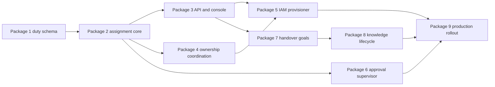

# Human-Agent Assignment Implementation Plan

This plan turns the human-agent assignment and knowledge-handover design into dependency-ordered
work packages on `main`. Each package lands as one or more focused commits without a feature
branch. It names the owning modules, compatibility path, API and event contracts, focused
tests, Azure permissions, rollout controls, and evidence required before IAM writes are enabled.

> **Current status:** Packages 1 and 2 are implemented on `main`. Stewardship v2 duties and the
> composite assignment-case core now provide immutable intent, normalized independent review,
> role-based quorum, revisioned StateStore transitions, content-free audit records, effect
> receipts, and fail-closed activation. Package 3, the observation-only API and console, is next.
> Provider-side IAM writes, timed non-response escalation, proactive handover goals, and ontology
> candidates don't exist yet.
>
> **Authority boundary:** FDAI Console submits a domain-typed case. It never receives Graph
> write permission or Thor's identity. Ownership merge, human approval, IAM apply, and knowledge
> promotion remain independently verifiable effects.

## Delivery shape

Implementation is split into nine focused work packages on `main`. Packages 1 through 4 produce a
complete observation-only workflow. Package 5 is the first provider mutation and stays in
observation mode until separately promoted. Packages 6 through 8 add approval continuity and
knowledge capture without raising IAM authority. Complete and validate each package before its
focused commit; don't mix unrelated worktree changes into that commit.

## Current baseline and gaps

| Area | Reuse | Missing implementation |
|------|-------|------------------------|
| Directory | `HumanIdentityDirectory`, Entra search, exact subject lookup, App Role roster | Write-only membership provider and convergence receipt |
| Access | `AccessRequestService`, atomic state plus audit, Owner review, no self-approval | Assignment-case join and post-approval execution trigger |
| Ownership | Stewardship v1, coverage, escalation ordering, handover PR, signed merge webhook | Explicit `primary`, `backup`, and `escalation` duty slots |
| Approval | `HilResumeCoordinator`, on-call primary/secondary receipt, reminders, load control | Durable rung deadlines and CAS-owned non-response transitions |
| Conversation | Authenticated sessions, durable turns, Bragi narration | Sign-in availability event and proactive goal invitation policy |
| Documents | Agent-owned admission, source spans, chunking, pgvector | Handover evidence purpose, ACL-filtered retrieval, ontology candidates |
| Console | IAM users, roles, requests, directory search | Assignments tab, composite editor, convergence and goal projections |

## Contract decisions before coding

### Ownership schema migration

Stewardship schema v2 adds `duty: primary | backup | escalation` to accountable steward entries.
`responsibility` remains `accountable | informed`; an informed entry has no duty. The migration is
additive and follows this compatibility window:

1. The v2 loader reads v1 and derives the first accountable subject as `primary` and later
   accountable subjects as `backup`, but emits `duty_derived` and `backup_missing` findings.
2. `scripts/governance/migrate-stewardship-v2.py` renders a reviewable v2 candidate and never edits
   the live file in place.
3. New assignment cases always emit v2. Existing v1 deployments continue in observation mode.
4. Enforce mode requires v2, one live primary, and one distinct live backup or escalation subject.

This keeps `config/agent-stewardship.yaml` as the ownership source of truth instead of creating a
second mutable duty graph.

### Assignment state

Add `src/fdai/core/human_assignment/` with pure models, transition validation, coverage checks, and
a coordinator over the existing `StateStore`. Initial persistence uses atomic `state_kv` plus the
audit hash chain, so no Alembic migration is required for the first release.

| State key | Contents |
|-----------|----------|
| `human_assignment:case:<case_id>` | Immutable intent, revision, requester, target, role, duties, goals, and effect receipts |
| `human_assignment:decision:<case_id>` | Independent review decision and quorum evidence |
| `human_assignment:active:<subject_hash>:<agent>:<scope_hash>` | Current converged assignment projection without names or usernames |
| `handover_goal:<goal_id>` | Goal revision, required evidence slots, fatigue state, and review status |

Package 2 writes only the case key. It embeds append-only review receipts in the revisioned case
snapshot so quorum evidence and lifecycle state advance in one atomic CAS. The separate decision
and active projection keys remain part of the Package 3 read-model work.

State transitions are `draft -> pending_review -> approved -> ownership_pr_open ->
ownership_merged -> iam_applying -> active`. Terminal or held states are `rejected`, `degraded`,
and `superseded`. Compare-and-set revision checks reject stale commands.

### Commands, events, and actions

The read API may create a case but can't apply its effects. Machine collaboration uses validated
events and existing control-loop ingress.

| Contract | Purpose |
|----------|---------|
| `POST /iam/assignment-cases` | Owner submits an immutable assignment intent and idempotency key |
| `GET /iam/assignments` | Joined role, duty, coverage, case, and handover projection |
| `GET /iam/assignment-cases/{case_id}` | Effect receipts, audit references, and failure state |
| `human.assignment.requested` | Forseti validation and Var review intake |
| `human.assignment.ownership_merged` | Signed webhook proves the exact stewardship revision merged |
| `human.assignment.iam_apply_requested` | Re-enters the typed pipeline after prerequisites converge |
| `human.assignment.activated` | Roster read proves the expected membership and duty revision |
| `handover.goal.requested` | Mapped agent publishes one bounded knowledge need |
| `knowledge.evidence.proposed` | Admitted answer or document span is available for review |

Add shadow-default `governance.apply-human-access` and `governance.revoke-human-access`
ActionTypes. Their pantheon bindings remain Forseti judge, Var approver, Thor executor, Vidar
recovery, and Saga auditor. No role binding is configurable.

## Main-branch work package sequence

### Package 1 - Stewardship v2 and coverage

**Changes:** Extend `core/stewardship/model.py`, `resolver.py`, `coverage.py`, `escalation.py`, the
config checker, and both ownership design docs. Add the migration renderer and fixtures. Keep v1
read compatibility and preserve all 15 agent names.

**Tests:** Resolver tests for v1 derivation and v2 fail-fast behavior; coverage properties proving
primary and backup resolve to distinct normalized people; group expansion failure doesn't prove
two-person coverage; migration output round-trips through the v2 loader.

**Exit:** Existing v1 config loads with findings, a generated v2 candidate is deterministic, and
v2 rejects missing primary, missing backup or escalation, cycles, duplicate duties, and stale-only
coverage.

### Package 2 - Assignment case core

**Status:** Implemented. The core remains observation-only and has no provider, API, or runtime
binding.

**Changes:** Add `core/human_assignment/model.py`, `transitions.py`, `coverage.py`, `service.py`, and
`__init__.py`. Reuse `StateStore.write_state_with_audit_if_absent` and revisioned writes. Add
content-free audit kinds for request, review, effect receipt, activation, degradation, and
supersession.

**Tests:** State-transition table, idempotent replay, conflicting key, stale revision, normalized
no-self-approval, elevated-role quorum, partial-effect recovery, and property tests that no state
skips review or ownership merge.

**Exit:** A case can be created, reviewed, replayed, and projected without I/O outside `StateStore`;
no transition can mark it active without both ownership and IAM receipts.

### Package 3 - Observation-only API and Assignments tab

**Changes:** Add `delivery/read_api/routes/human_assignments.py` and register it beside `iam.py`.
Extend app config with the case service and ownership projection, not a provisioner. Add
`settings-iam-assignments.tsx`, model and command types, the fifth IAM tab, English/Korean catalog
keys, skeleton loading, filters, editor, validation summary, and evidence drawer.

**Tests:** Owner-only search and submit, exact subject revalidation, body and pagination bounds,
stale revision, unavailable directory, Preact reducer and decoder tests, keyboard tabs,
localization parity, accessibility, and production build.

**Exit:** An Owner can search one active subject, compose role plus duties plus goals, and create an
observation-only case. The UI clearly states that no Entra membership changed.

### Package 4 - Ownership PR coordination

**Changes:** Extend `StewardshipGovernanceService` to accept an approved case and render one v2
overlay. Persist the PR receipt on the case. Extend the signed GitHub webhook to publish
`human.assignment.ownership_merged` only when the expected path, commit, case id, and rendered
content digest match.

**Tests:** Additive merge, removal rejection without replacement, remote PR replay, webhook
signature, wrong repository or digest, duplicate delivery, case supersession, notification, and
atomic audit receipt.

**Exit:** One approved case opens at most one draft PR; only the matching reviewed merge advances
the case; IAM remains untouched.

### Package 5 - Governed Entra membership apply

**Changes:** Add CSP-neutral `shared/providers/human_access.py` with plan, apply, verify, and
rollback receipts. Add `delivery/identity/entra_access.py`, a runtime binder, ActionTypes, and an
executor adapter. The read API never imports or receives this provider.

For user membership, Microsoft Graph documents `GroupMember.ReadWrite.All` as the least privileged
application permission for `POST /groups/{group-id}/members/$ref`. Use a dedicated managed identity,
exclude role-assignable groups, and hard-allowlist only configured FDAI role group object ids. An
application permission is tenant-wide, so the code allowlist is a compensating control, not a
directory permission boundary. Package 5 includes a security spike to determine whether an
administrative-unit-scoped Groups Administrator or custom role, plus required read permission, can
replace the broad application permission for the target tenant. Don't combine both and claim that
the administrative unit narrows an already tenant-wide application permission.

**Tests:** Allowlist refusal, inactive subject, expected-revision mismatch, already-member replay,
204 convergence, bounded retry for replication delay, 403 fail-closed, redaction, wrong-target
postcondition, rollback, shadow no-op, and adapter contract tests.

**Exit:** Observation mode records the exact mutation it would request. Enforce promotion is a
separate focused commit on `main` after zero target mismatches and successful add, verify, remove,
and restore drills in a non-production tenant.

### Package 6 - Human non-response supervisor

**Changes:** Add `core/hil_resume/escalation_supervisor.py`. On parking, snapshot the ordered
primary, backup, escalation, and maintainer rungs with role eligibility, delivery deadline, action
hash, and overall deadline. A scheduled runtime tick claims due transitions with CAS, dispatches
the unchanged request to the next rung, and appends one Saga audit per hop.

**Tests:** Delivery failure versus human silence, immediate unavailable response, primary timeout,
late decision, concurrent ticks, rejection terminality, role loss, schedule outage fallback,
overall expiry, restart replay, and no-op without standing authority.

**Exit:** Shadow metrics match historical approval timing before rung dispatch is enabled. Enforce
mode never changes the action hash, accepts two decisions, or turns exhaustion into execution.

### Package 7 - Proactive handover goals

**Changes:** Add `core/human_assignment/goals.py` and `fatigue.py`. Chat session registration emits a
content-free availability event. Mapped agents publish goal gaps through the event bus; Odin
deduplicates and ranks; Bragi renders one invitation. Add answer, upload, snooze, decline, and goal
review commands without blocking sign-in.

**Tests:** One invitation per login, weekly and session budgets, 24-hour snooze, incident and
approval suppression, cross-agent deduplication, locale rendering, opt-out, stale goal renewal,
and no completion without cited evidence or reasoned `not_applicable`.

**Exit:** A mapped user can complete, defer, or decline a bounded session; fatigue limits survive
restart; no conversational path changes IAM, approval, or autonomy.

### Package 8 - Evidence, chunking, and ontology candidates

**Changes:** Add a handover evidence purpose and typed events to the document-ingestion path.
Extend chunk metadata with goal, source-span, ACL, chunk-policy version, and content digest.
Muninn indexes admitted evidence; Mimir and Norns emit inert ontology or rule candidates; Forseti
and Odin handle conflict review through typed events.

**Tests:** Deterministic structured chunk boundaries, table and heading preservation, ACL-filtered
retrieval, deletion and supersession propagation, duplicate evidence, conflicting claims,
content-free events, source-span citation, and candidate non-promotion.

**Exit:** Every accepted goal cites admitted evidence, retrieval can't cross the source ACL, and no
document or conversation can directly mutate the ontology or rule catalog.

### Package 9 - Production rollout and operations

**Changes:** Expose separate `available`, `enabled`, and `mode` states in Settings. Add readiness
checks, dashboards, alerts, recovery runbooks, deployment inputs, managed-identity permission
verification, and a reconciliation job for cases held between effects.

**Tests:** Process-loss recovery at every state, Graph and GitHub outage, stale directory, channel
outage, duplicate bus delivery, audit-chain verification, backup takeover, permission removal,
kill switch, and demotion to observation mode.

**Exit:** Operators complete add, reject, timeout, escalate, revoke, rollback, restart, and disaster
recovery drills without database edits. Every active assignment has verified primary and backup
coverage and a current handover review date.

## Focused verification by slice

| Slice | Narrow command before commit |
|-------|------------------------------|
| Stewardship v2 | `uv run pytest -q --no-cov tests/core/stewardship` plus `bash scripts/governance/check-stewardship.sh` |
| Assignment core | `uv run pytest -q --no-cov tests/core/human_assignment` |
| IAM API | `uv run pytest -q --no-cov tests/delivery/read_api/test_iam.py tests/delivery/read_api/test_human_assignments.py` |
| Console | `npm --prefix console test -- --run src/routes/settings-iam.test.ts src/routes/settings-iam-assignments.test.tsx` |
| Ownership governance | `uv run pytest -q --no-cov tests/delivery/stewardship tests/delivery/ingestion_gateway/test_handover.py` |
| HIL supervisor | `uv run pytest -q --no-cov tests/core/hil_resume` |
| Knowledge lifecycle | `uv run pytest -q --no-cov tests/core/document_ingestion tests/delivery/document_index tests/delivery/ingestion_gateway` |

Each package also runs Ruff and strict mypy only for touched Python paths before its focused
commit. The centralized Integration
Validator owns diff-scoped integration and repository-wide validation receipts.

## Rollout evidence and stop conditions

| Stage | Required evidence | Stop or demote when |
|-------|-------------------|---------------------|
| Assignment observation | 30 days or 100 cases; zero invalid subject and coverage escapes | Any case projects the wrong subject, role, agent, or scope |
| IAM observation | Exact planned group and subject match on every case | Any target mismatch or unredacted provider response |
| IAM non-production enforce | 20 add/remove cycles; 100% convergence; rollback drill | Any wrong membership, unverifiable receipt, or rollback failure |
| Escalation observation | Historical timing replay plus 50 live pending approvals | Duplicate decision, changed action hash, or unauthorized rung |
| Handover pilot | 20 mapped users; opt-out and completion measured | Budget breach, sign-in blocking, or uncited accepted goal |
| Knowledge pilot | ACL, deletion, citation, and conflict suites green | Cross-ACL retrieval or promoted unreviewed candidate |

Release guard metrics are assignment activation latency, ownership-to-IAM convergence latency,
coverage defects, approval response by rung, exhausted approvals, handover invitations per user,
goal completion and opt-out, citation coverage, ACL denials, and rollback success. IAM and
escalation kill switches are independent.

## Definition of complete

- [ ] Owner search returns the exact live Entra subject and existing FDAI role and duties.
- [ ] Stewardship v2 enforces one primary and one distinct backup or escalation target.
- [ ] One immutable case correlates independent review, ownership PR, IAM receipt, and audit.
- [ ] The read API and browser never receive membership-write credentials.
- [ ] Thor applies only allowlisted group changes after ownership merge and independent approval.
- [ ] Unanswered approvals advance by durable deadlines and exhaust to audited no-op.
- [ ] Login-triggered handover respects fatigue limits and never blocks access.
- [ ] Accepted goals cite admitted, ACL-preserving evidence and reviewed candidates only.
- [ ] Restart, duplicate delivery, outage, revoke, rollback, and demotion drills pass.

## Related docs

| To learn about | Read |
|----------------|------|
| Target behavior and administrator experience | [Human-agent assignment and knowledge handover](human-agent-assignment-and-knowledge-handover.md) |
| Current human RBAC and access-request contract | [User RBAC and Entra identity](user-rbac-and-identity.md) |
| Ownership schema and governance lifecycle | [Agent operational ownership and handover](agent-stewardship-and-handover.md) |
| Pending approval supervision | [Escalation and standing authority](../decisioning/escalation-and-standing-authority.md) |
| Agent-owned document path | [Document ingestion agent ownership](document-ingestion-agent-ownership.md) |
