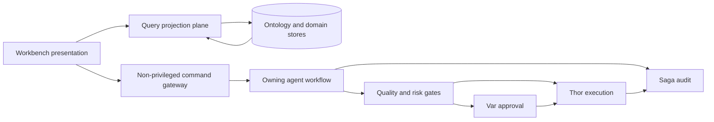

# 비특권 오퍼레이터 워크벤치

이 문서는 FDAI 콘솔을 executor나 두 번째 workflow authority로 만들지 않으면서 오퍼레이터
워크벤치로 발전시키는 방법을 정의합니다. Federated work queue, command-intake 경계, agent
routing, ontology 재사용, 단계별 제공 계획을 다룹니다.

> 목표는 읽기 전용 HTTP surface가 아니라 비특권 command surface입니다. 콘솔은 범위가 제한된
> 사람 결정이나 workflow command를 제출할 수 있지만 Thor의 executor identity를 받거나, 관리
> 리소스를 변경하거나, action 실행의 안전성을 판단하지 않습니다.

## 설계 요약

워크벤치는 authoritative domain record를 하나의 transient queue로 결합합니다. 모든 command는
해당 record를 이미 통제하는 agent-owned domain workflow로 돌려보냅니다. Queue item은 projection이며
새 `ObjectType`, event topic, lifecycle 또는 system of record가 아닙니다.



## 아키텍처 결정

FDAI 콘솔은 authority가 독립된 다섯 plane으로 발전시키는 것이 좋습니다.

| Plane | 책임 | Authority 경계 |
|-------|------|----------------|
| Presentation | Queue, detail, evidence, timeline, command control | Server 결정을 렌더링하며 브라우저에서 authority를 계산하지 않습니다. |
| Query projection | 범위가 제한된 ontology object set과 domain read model 결합 | Source record를 읽기만 하며 domain lifecycle을 갖지 않습니다. |
| Command intake | 인증, revision과 digest 검증, idempotency 기록, outbox message commit | 판단 authority와 executor credential이 없습니다. |
| Agent-owned workflow | Typed command를 해석하고 기존 domain lifecycle 진행 | 현재 pantheon owner가 single writer로 유지됩니다. |
| Authority and execution | Quality, risk, approval, execution, rollback, audit gate 적용 | Forseti가 판단하고, Var가 승인하고, Thor가 실행하고, Vidar가 rollback하고, Saga가 감사합니다. |

이 구조는 event-driven architecture를 보존합니다. API와 projector는 mechanical relay이며, 숨은
열여섯 번째 agent가 되거나 agent를 직접 호출하지 않습니다.

## Federated work queue

### Projection 계약

`WorkbenchQueueItem`은 exact ontology reference와 source revision으로 조합하는 API projection입니다.
Authoritative row로 저장하지 않습니다. Cache는 다시 만들 수 있는 materialized output을 저장할 수
있지만, cache 손실로 작업을 잃거나 source lifecycle이 바뀌면 안 됩니다.

| Field | 의미 |
|-------|------|
| `item_id` | `source_kind`와 `source_ref`에서 파생한 안정적인 projection id입니다. |
| `source_kind` | `review_case`, `approval`, `process`, `access_grant_request` 같은 discriminator입니다. |
| `source_ref` | 해당되는 경우 ontology release identity까지 포함한 exact source object reference입니다. |
| `source_revision` | Command intake의 compare-and-set에 사용하는 revision 또는 immutable digest입니다. |
| `title`과 `summary` | 정제된 source-owned display text입니다. |
| `status`와 `priority` | 정규화한 display value이며 기술 세부 정보는 machine value를 유지합니다. |
| `owner_agent` | 다음 domain decision을 담당하는 pantheon agent입니다. |
| `assignee_ref` | Source workflow에 사람이 배정된 경우의 assignee입니다. |
| `deadline` | Source record의 decision, acknowledgment 또는 process deadline입니다. |
| `evidence_refs` | Audit, decision, policy, source evidence의 범위 제한 reference입니다. |
| `allowed_commands` | 현재 principal과 source revision에 대해 서버가 계산한 command descriptor입니다. |
| `authority_explanation` | Command가 보이는 이유와 이후에도 적용되는 gate를 설명합니다. |

Queue는 범위 제한 filter와 안정적인 cursor pagination을 지원합니다. Source가 없거나 오래된 경우
기록된 tombstone에 따라 unavailable item을 만들거나 제거하며, 브라우저에서 상태를 추론하지 않습니다.

### Source 재사용

첫 번째 release는 기존 ontology object와 link를 재사용합니다.

| 오퍼레이터 관심사 | Authoritative object와 link | Queue 동작 |
|-------------------|-----------------------------|------------|
| Governed review | `Process -> runs_review -> ReviewCase -> resolved_by -> Decision` | 현재 review 상태, 이전 decision, 다음 stage owner를 보여줍니다. |
| 사람 승인 | `ReviewCase -> has_approval -> Approval`과 action-bound approval | 다른 approval type 없이 quorum, 자기 승인 방지 상태, deadline, evidence를 보여줍니다. |
| Workflow run | `WorkflowDefinition`, `WorkflowBinding`, `Process` | Immutable definition, current step, revision, target, compensation 상태를 보여줍니다. |
| Access 변경 | `AccessGrantRequest` | Immutable request를 기존 authorization workflow로 전달합니다. |
| Execution follow-up | `ActionRun`, rollback, audit reference | 결과와 recovery 상태를 보여주며 execute-again 바로 가기는 없습니다. |
| 담당자 인수인계 | Operational-readiness `Process`, `ReviewCase`, `Approval`, `Decision` | Saga 소유 proposal을 추가하지 않고 handover workflow를 재사용합니다. |

Generic `WorkItem`, 중복 `Approval`, 범용 mutable status table을 추가하지 않습니다. 최소 세 source type이
기존 exact type과 bounded object set으로 표현할 수 없는 안정적인 property, link, command를 공유한다는
근거가 생긴 뒤에만 새 semantic interface를 추가하는 것이 좋습니다.

### Ontology query 전략

Projector는 명시적인 `as_of` cutoff에서 source family별로 범위가 제한된 `ObjectSet`을 materialize한 뒤
선언된 link만 join합니다. 모든 response는 ontology release digest, source watermark, cutoff, truncation
reason, redaction summary, freshness state를 포함합니다. 따라서 브라우저에 free-form graph query를
허용하지 않고도 queue snapshot을 설명하고 replay할 수 있습니다.

## Agent ownership

워크벤치는 domain decision을 소유하지 않습니다. 이미 해당 결정을 담당하는 agent를 노출합니다.

| 작업 | 책임 owner | Workbench 역할 |
|------|-------------|----------------|
| 새 operator signal 수집 | Huginn | Typed ingress를 받아 correlate합니다. |
| Review 또는 proposed action 판단 | Forseti | Decision과 evidence를 표시하며 판단을 다시 수행하지 않습니다. |
| Action-bound request 승인 | Var | 인증된 사람 decision을 받고 기존 approval outcome을 publish합니다. |
| 승격된 action 실행 | Thor | 상태만 표시하며 콘솔에는 Thor credential 경로가 없습니다. |
| 실패한 action 복구 | Vidar | Rollback readiness와 결과를 표시합니다. |
| 모든 terminal path 감사 | Saga | Immutable timeline evidence를 제공하며 handover나 business workflow state를 소유하지 않습니다. |
| Federated context index 구성 | Muninn | 다시 만들 수 있는 work index를 소유하며 source owner는 자신의 record를 유지합니다. |
| 설명과 번역 | Bragi | Command와 result를 렌더링하며 join, judge, approve, execute하지 않습니다. |
| Outcome에서 rule 개선 | Norns와 Mimir | Audited outcome을 off-path로 소비하며 queue command로 rule을 직접 편집하지 않습니다. |

`Process`는 여러 agent를 거칠 수 있습니다. Current step이 accountable owner를 선언하고 workflow
coordinator는 revision check, deadline, event relay만 수행합니다. Domain decision을 내리거나 agent 사이의
shared mutable state를 보유하지 않습니다.

## Command intake

### Command descriptor

Allowed command는 서버 소유 descriptor이며 실행된다는 증명이 아닙니다.

```json
{
  "command_kind": "approval.decide",
  "source_ref": "approval:example",
  "source_revision": 7,
  "required_capability": "approve-runtime-hil",
  "argument_schema_ref": "approval.decide@1",
  "side_effect_class": "approve",
  "authority_explanation": "You may submit a decision. No-self-approval, quorum, and risk checks still apply."
}
```

서버는 principal, source state, exact command schema, policy에서 descriptor를 계산합니다. 제출 시 모든
검사를 반복합니다. Source revision, policy digest, role claim 또는 deadline이 바뀌면 descriptor는
만료됩니다.

### Gateway sequence

각 domain은 typed command endpoint와 handler를 유지합니다. Workbench는 generic workflow engine이 아니라
공통 envelope와 discovery projection을 추가합니다.

1. Entra token, audience, App Role, command capability를 확인합니다.
2. Source를 읽고 `source_revision`, deadline, policy digest를 비교합니다.
3. Typed argument를 검증하고 알 수 없는 field를 차단합니다.
4. Intake 시점에 알 수 있는 자기 승인 방지, quorum eligibility, scope, purpose check를 적용합니다.
5. Receipt, idempotency key, actor reference, outbox event를 원자적으로 commit합니다.
6. `accepted`, `conflict`, `denied`, `expired` 중 하나를 반환하며 intake에서 `executed`를 반환하지 않습니다.
7. Owning agent가 event를 처리하고 다음 authoritative state를 emit하도록 합니다.

Retry는 같은 idempotency key를 사용합니다. Concurrent transition은 최신 source revision과 함께 conflict를
반환합니다. Gateway는 agent implementation을 import하거나 Thor를 호출하거나 source owner의 table을 직접
수정하지 않습니다.

### 지원 command family

초기 workbench는 이미 governed된 command를 조합합니다.

- **결정:** Principal이 eligible하면 기존 `Approval`을 approve 또는 reject합니다.
- **초안:** GitHub App 경로로 catalog 또는 workflow draft를 만듭니다.
- **조사:** 새 operator signal로 bounded read investigation을 시작합니다.
- **진행:** Source workflow가 transition을 정의하고 owner가 event를 수락하는 경우에만 acknowledge,
  claim, cancel, retry 또는 resume합니다.
- **Access 요청:** 기존 flow를 통해 immutable `AccessGrantRequest`를 생성하거나 결정합니다.
- **통제:** 별도 capability와 audit requirement에 따라 kill-switch 또는 emergency command를 제출합니다.

Direct `execute`, arbitrary provider call, free-form object mutation, generic status update command는 없습니다.

## Identity, 담당자 인수인계, memory

Console principal과 Thor workload identity는 분리된 상태를 유지합니다. Human App Role은 command 제출을
인가하며 cloud permission을 부여하지 않습니다. Approval은 control-plane mutation이지만 managed-resource
execution은 아닙니다. 성공한 approval도 quorum, risk, promotion, lock, dry-run, executor check를 기다립니다.

운영 담당자 인수인계는 기존 operational-readiness workflow를 사용합니다. Huginn이 transfer signal을
받고, Mimir가 rule을 확인하고, Forseti가 review decision을 만들고, Var가 필요한 approval을 처리하고,
Thor가 별도로 승인된 fix를 적용하고, Saga가 감사합니다. Saga는 handover authority가 되지 않습니다.

Private `UserPreference` state는 Bragi 소유 presentation data로 유지합니다. 검토된 operational guidance와
case history는 governed operator-memory와 Muninn context 경로에 남습니다. Preference command로 private
text를 shared operational memory로 승격할 수 없습니다.

## API와 UI 구조

Target API는 domain endpoint를 유지하면서 query projection과 command discovery를 추가합니다.

- `GET /workbench/items`는 filtering한 federated queue를 반환합니다.
- `GET /workbench/items/{item_id}`는 source link, timeline, evidence, current command를 반환합니다.
- `GET /workbench/command-schemas/{ref}`는 redaction된 immutable argument schema를 반환합니다.
- Domain-specific `POST` route는 공통 envelope를 받고 intake receipt를 반환합니다.
- SSE는 source reference로 영향을 받은 item을 invalidate하며 client가 authoritative state를 다시 읽습니다.

첫 화면은 marketing dashboard가 아니라 queue입니다. Keyboard-accessible filter, local saved view, read-only
bulk comparison, evidence drawer, conflict recovery, unavailable state를 baseline에 포함합니다. Bulk command는
명시적인 bounded partial-failure 계약이 생긴 뒤에 도입합니다.

## 제공 계획

### Phase 0 - 계약 inventory

기존 mutation route, capability, source owner, revision, receipt, identity dependency를 모두 catalog합니다.
각 route를 query, simulate, approve, workflow command, execute, break-glass로 분류합니다. No-executor 경계는
보존하면서 오래된 `GET-only` 설명을 제거합니다.

Exit criteria: 제공되는 모든 command에 owner, capability, typed schema, idempotency rule, audit path가 하나씩
있습니다.

### Phase 1 - federated read projection

Source adapter protocol과 Muninn 소유 rebuildable index를 구현합니다. `ReviewCase`, `Approval`, `Process`,
`AccessGrantRequest`를 exact ref, evidence, freshness, pagination, redaction test와 함께 먼저 projection합니다.

Exit criteria: 같은 cutoff에서 다시 만들면 같은 queue가 생성되며 어떤 source lifecycle도 projection에
의존하지 않습니다.

### Phase 2 - command descriptor와 intake

서버가 계산한 `allowed_commands`와 immutable schema reference를 추가합니다. Revision, digest, idempotency,
receipt, outbox 동작을 표준화합니다. Stale descriptor, duplicate, self-approval, expiry, role change를
테스트합니다.

Exit criteria: SPA에는 command-specific authority logic이 없고 accepted command가 source owner를 우회하지
않습니다.

### Phase 3 - operator workflow

Review, approval, access-request, draft, investigation, timeline, evidence, conflict view를 추가합니다. 기존
`Process`와 review link를 통해 operational-readiness handover를 projection합니다.

Exit criteria: 오퍼레이터가 하나의 workbench에서 지원되는 사람 단계를 완료할 수 있으며 모든
managed-resource 변경은 이후 Thor `ActionRun`으로만 나타납니다.

### Phase 4 - 측정 기반 최적화

Cross-device 수요를 측정한 뒤에만 server-side saved view를 추가합니다. Bounded failure와 rollback semantic이
있는 workflow에만 bulk command를 추가합니다. Audited outcome으로 routing과 deadline을 off-path에서
개선합니다.

Exit criteria: Queue age, decision latency, conflict rate, duplicate suppression, overdue work, projection
freshness에 측정된 baseline과 alert가 있습니다.

## 채택하지 않은 대안

- **Authoritative generic `WorkItem`:** Domain lifecycle을 중복하고 두 번째 owner를 만듭니다.
- **Saga-owned handover proposal:** Auditor에게 business workflow authority를 부여합니다.
- **Bragi-owned command orchestration:** Presentation translator가 typed work를 결정하게 됩니다.
- **Browser-derived command:** Stale UI state를 authorization source로 만듭니다.
- **Executor credential을 가진 command gateway:** Approval과 execution identity를 합칩니다.
- **Direct graph mutation:** ActionType, risk, approval, audit gate를 우회합니다.

## 관련 문서

| 알아볼 내용 | 문서 |
|-------------|------|
| 대화형 번역과 tool coordination | [오퍼레이터 콘솔](operator-console-ko.md) |
| 사람 role과 command capability | [사용자 RBAC와 Entra 아이덴티티](user-rbac-and-identity-ko.md) |
| Exact ontology release, object set, mutation plan | [운영 온톨로지 플랫폼](../architecture/operating-ontology-platform-ko.md) |
| 고정 pantheon ownership | [에이전트 판테온](../agents/agent-pantheon-ko.md) |
| Operational-readiness handover | [운영 준비 상태](../operations/operational-readiness-ko.md) |
| 사람 assignment와 knowledge handover | [사람-에이전트 배정 및 지식 인수인계](human-agent-assignment-and-knowledge-handover-ko.md) |
