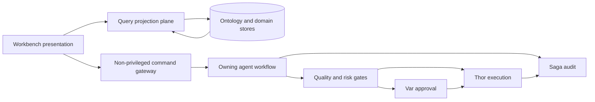

# Non-Privileged Operator Workbench

This document defines how the FDAI console becomes an operator workbench without becoming an
executor or a second workflow authority. It owns the federated work queue, command-intake boundary,
agent routing, ontology reuse, and staged delivery plan.

> The target is a non-privileged command surface, not a read-only HTTP surface. The console can
> submit a bounded human decision or workflow command, but it never receives Thor's executor
> identity, mutates a managed resource, or decides whether an action is safe to execute.

## Design at a glance

The workbench combines authoritative domain records into one transient queue. It sends every
command back to the agent-owned domain workflow that already controls the record. A queue item is a
projection, not a new `ObjectType`, event topic, lifecycle, or system of record.



## Architectural decision

FDAI should evolve the console through five planes with independent authority:

| Plane | Responsibility | Authority boundary |
|-------|----------------|--------------------|
| Presentation | Queue, detail, evidence, timeline, and command controls | Renders server decisions; doesn't derive authority in the browser. |
| Query projection | Federates bounded ontology object sets and domain read models | Read-only over source records; no domain lifecycle. |
| Command intake | Authenticates, validates revision and digest, records idempotency, and commits an outbox message | No judgment and no executor credential. |
| Agent-owned workflow | Interprets a typed command and advances the existing domain lifecycle | The current pantheon owner remains the single writer. |
| Authority and execution | Applies quality, risk, approval, execution, rollback, and audit gates | Forseti judges, Var approves, Thor executes, Vidar rolls back, and Saga audits. |

This shape preserves the event-driven architecture. The API and projector are mechanical relays.
They don't become a hidden sixteenth agent or call agents directly.

## Federated work queue

### Projection contract

`WorkbenchQueueItem` is an API projection assembled from exact ontology references and source
revisions. It isn't persisted as an authoritative row. A cache may store rebuildable materialized
output, but cache loss can't lose work or change a source lifecycle.

| Field | Meaning |
|-------|---------|
| `item_id` | Stable projection id derived from `source_kind` and `source_ref`. |
| `source_kind` | Discriminator such as `review_case`, `approval`, `process`, or `access_grant_request`. |
| `source_ref` | Exact source object reference, including ontology release identity where applicable. |
| `source_revision` | Revision or immutable digest used for compare-and-set command intake. |
| `title` and `summary` | Sanitized source-owned display text. |
| `status` and `priority` | Normalized display values; technical details retain the machine value. |
| `owner_agent` | Pantheon agent accountable for the next domain decision. |
| `assignee_ref` | Human assignee when the source workflow has one. |
| `deadline` | Decision, acknowledgment, or process deadline from the source record. |
| `evidence_refs` | Bounded references to audit, decision, policy, and source evidence. |
| `allowed_commands` | Server-computed command descriptors for this principal and source revision. |
| `authority_explanation` | Why a command is visible and which later gates still apply. |

The queue supports bounded filters and stable cursor pagination. Missing or stale sources produce
an unavailable item or disappear according to a recorded tombstone; the browser doesn't infer
state.

### Source reuse

The first release reuses existing ontology objects and links:

| Operator concern | Authoritative objects and links | Queue behavior |
|------------------|---------------------------------|----------------|
| Governed review | `Process -> runs_review -> ReviewCase -> resolved_by -> Decision` | Shows current review state, prior decisions, and the next-stage owner. |
| Human approval | `ReviewCase -> has_approval -> Approval` and action-bound approvals | Shows quorum, no-self-approval state, deadline, and evidence without another approval type. |
| Workflow run | `WorkflowDefinition`, `WorkflowBinding`, and `Process` | Shows the immutable definition, current step, revision, target, and compensation state. |
| Access change | `AccessGrantRequest` | Routes the immutable request through the existing authorization workflow. |
| Execution follow-up | `ActionRun`, rollback, and audit references | Shows outcome and recovery state; no execute-again shortcut. |
| Ownership handover | Operational-readiness `Process`, `ReviewCase`, `Approval`, and `Decision` | Reuses the handover workflow instead of adding a Saga-owned proposal. |

No generic `WorkItem`, duplicate `Approval`, or universal mutable status table is added. A new
semantic interface is justified only after at least three source types share stable properties,
links, and commands that existing exact types and bounded object sets can't express.

### Ontology query strategy

The projector materializes one bounded `ObjectSet` per source family at an explicit `as_of` cutoff,
then joins only declared links. Every response carries the ontology release digest, source
watermarks, cutoff, truncation reason, redaction summary, and freshness state. A queue snapshot is
therefore explainable and replayable without free-form browser graph queries.

## Agent ownership

The workbench doesn't own domain decisions. It exposes the agents that already do:

| Work | Accountable owner | Workbench role |
|------|-------------------|----------------|
| Collect a new operator signal | Huginn | Accept typed ingress and correlate it. |
| Judge a review or proposed action | Forseti | Display the decision and evidence; don't reproduce the judgment. |
| Approve an action-bound request | Var | Accept an authenticated human decision and publish the existing approval outcome. |
| Execute a promoted action | Thor | Display status only; the console has no path to Thor's credential. |
| Recover a failed action | Vidar | Display rollback readiness and results. |
| Audit every terminal path | Saga | Supply immutable timeline evidence; don't own handover or business workflow state. |
| Build the federated context index | Muninn | Own the rebuildable work index while source owners retain their records. |
| Explain and translate | Bragi | Render commands and results; never join, judge, approve, or execute. |
| Improve rules from outcomes | Norns and Mimir | Consume audited outcomes off-path; no queue command edits a rule directly. |

A `Process` can cross several agents. Its current step declares the accountable owner, while the
workflow coordinator performs only revision checks, deadlines, and event relay. It doesn't make a
domain decision or hold shared mutable state between agents.

## Command intake

### Command descriptor

An allowed command is a server-owned descriptor, not proof that execution will occur:

```json
{
  "command_kind": "approval.decide",
  "source_ref": "approval:example",
  "source_revision": 7,
  "required_capability": "approve-runtime-hil",
  "argument_schema_ref": "approval.decide@1",
  "side_effect_class": "approve",
  "authority_explanation": "You may submit a decision. No-self-approval, quorum, and risk checks still apply."
}
```

The server derives descriptors from the principal, source state, exact command schema, and policy.
Submission repeats every check. A descriptor expires when its source revision, policy digest, role
claims, or deadline changes.

### Gateway sequence

Each domain keeps its typed command endpoint and handler. The workbench adds a common envelope and
discovery projection, not a generic workflow engine:

1. Verify the Entra token, audience, App Roles, and command capability.
2. Load the source and compare `source_revision`, deadline, and policy digest.
3. Validate typed arguments and reject unknown fields.
4. Apply no-self-approval, quorum eligibility, scope, and purpose checks known at intake.
5. Commit the receipt, idempotency key, actor reference, and outbox event atomically.
6. Return `accepted`, `conflict`, `denied`, or `expired`; never return `executed` from intake.
7. Let the owning agent process the event and emit the next authoritative state.

Retries reuse the same idempotency key. A concurrent transition returns a conflict with the latest
source revision. The gateway never imports an agent implementation, calls Thor, or writes a source
owner's table directly.

### Supported command families

The initial workbench composes already governed commands:

- **Decide:** Approve or reject an existing `Approval` when the principal is eligible.
- **Draft:** Create a catalog or workflow draft through the GitHub App path.
- **Investigate:** Start a bounded read investigation as a new operator signal.
- **Advance:** Acknowledge, claim, cancel, retry, or resume only where the source workflow defines
  the transition and its owner accepts the event.
- **Request access:** Create or decide an immutable `AccessGrantRequest` through its existing flow.
- **Control:** Submit kill-switch or emergency commands under their separate capabilities and
  audit requirements.

There is no direct `execute`, arbitrary provider call, free-form object mutation, or generic status
update command.

## Identity, handover, and memory

The console principal and Thor's workload identity remain separate. Human App Roles authorize
command submission, not cloud permissions. Approval is a control-plane mutation but not
managed-resource execution. A successful approval still waits for quorum, risk, promotion, lock,
dry-run, and executor checks.

Operational ownership handover uses the existing operational-readiness workflow. Huginn accepts
the transfer signal, Mimir resolves rules, Forseti produces the review decision, Var handles
required approval, Thor applies separately approved fixes, and Saga audits. Saga never becomes the
handover authority.

Private `UserPreference` state remains Bragi-owned presentation data. Reviewed operational guidance
and case history remain in governed operator-memory and Muninn context paths. A preference command
can't promote private text into shared operational memory.

## API and UI shape

The target API adds query projection and command discovery while preserving domain endpoints:

- `GET /workbench/items` returns the filtered federated queue.
- `GET /workbench/items/{item_id}` returns source links, timeline, evidence, and current commands.
- `GET /workbench/command-schemas/{ref}` returns a redacted immutable argument schema.
- Domain-specific `POST` routes accept the common envelope and return an intake receipt.
- SSE invalidates affected items by source reference; clients refetch authoritative state.

The first screen is the queue, not a marketing dashboard. Keyboard-accessible filters, local saved
views, read-only bulk comparison, evidence drawers, conflict recovery, and unavailable states are
baseline features. Bulk commands wait for an explicit bounded partial-failure contract.

## Delivery plan

### Phase 0 - contract inventory

Catalog every existing mutation route, capability, source owner, revision, receipt, and identity
dependency. Classify each route as query, simulate, approve, workflow command, execute, or
break-glass. Remove stale `GET-only` claims while preserving the no-executor boundary.

Exit criteria: every shipped command has one owner, capability, typed schema, idempotency rule, and
audit path.

### Phase 1 - federated read projection

Implement the source adapter protocol and Muninn-owned rebuildable index. Project `ReviewCase`,
`Approval`, `Process`, and `AccessGrantRequest` first, with exact refs, evidence, freshness,
pagination, and redaction tests.

Exit criteria: rebuilding at the same cutoff produces the same queue and no source lifecycle
depends on the projection.

### Phase 2 - command descriptors and intake

Add server-computed `allowed_commands` and immutable schema references. Standardize revision,
digest, idempotency, receipt, and outbox behavior. Test stale descriptors, duplicates,
self-approval, expiry, and role changes.

Exit criteria: the SPA has no command-specific authority logic and no accepted command bypasses
its source owner.

### Phase 3 - operator workflows

Add review, approval, access-request, draft, investigation, timeline, evidence, and conflict views.
Project operational-readiness handover through existing `Process` and review links.

Exit criteria: an operator completes each supported human step in one workbench, while every
managed-resource change appears only as a later Thor `ActionRun`.

### Phase 4 - measured optimization

Add server-side saved views only after measuring cross-device demand. Add bulk commands only for
workflows with bounded failure and rollback semantics. Improve routing and deadlines off-path from
audited outcomes.

Exit criteria: queue age, decision latency, conflict rate, duplicate suppression, overdue work,
and projection freshness have measured baselines and alerts.

## Rejected alternatives

- **Authoritative generic `WorkItem`:** Duplicates domain lifecycle and creates a second owner.
- **Saga-owned handover proposal:** Gives the auditor business workflow authority.
- **Bragi-owned command orchestration:** Lets a presentation translator decide typed work.
- **Browser-derived commands:** Makes stale UI state an authorization source.
- **Command gateway with executor credentials:** Collapses approval and execution identities.
- **Direct graph mutation:** Bypasses ActionType, risk, approval, and audit gates.

## Related docs

| To learn about | Read |
|----------------|------|
| Conversational translation and tool coordination | [Operator Console](operator-console.md) |
| Human roles and command capabilities | [User RBAC and Entra Identity](user-rbac-and-identity.md) |
| Exact ontology releases, object sets, and mutation plans | [Operating Ontology Platform](../architecture/operating-ontology-platform.md) |
| Fixed pantheon ownership | [Agent Pantheon](../agents/agent-pantheon.md) |
| Operational-readiness handover | [Operational Readiness](../operations/operational-readiness.md) |
| Human assignment and knowledge handover | [Human-Agent Assignment and Knowledge Handover](human-agent-assignment-and-knowledge-handover.md) |
