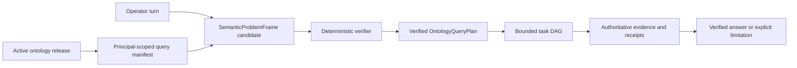

# Ontology Query Coverage 구현 계획

이 계획은 FDAI의 bounded conversation/ontology foundation과 operator 질문을 위한 목표 non-keyword
path 사이의 구현 gap을 닫습니다. 100% structural query coverage에 필요한 검증된 현재 baseline,
service/agent ownership, dependency 순서 work package, cutover gate 및 rollback unit을 기록합니다.

> **Coverage boundary:** 100%는 하나의 active ontology release에서 읽을 수 있는 모든 declaration이
> principal-scoped query descriptor 또는 typed unavailable reason을 갖는다는 뜻입니다. Identity,
> provider data, history 또는 evidence가 없을 때 완전하거나 정확한 답을 보장한다는 뜻이 아닙니다.
>
> **Authority boundary:** 자연어 및 embedding output은 candidate-only로 유지합니다. Read plan에는
> 실행 권한이 없습니다. 명시적 변경 요청은 기존 judgment, safety, 사람 승인, execution, recovery 및
> audit path로 다시 들어가는 typed draft만 만들 수 있습니다.
>
> **무작위 보증 상태(2026-08-11):** 인증된 Console은 생성된 영어 및 한국어 turn 100/100개를
> 완료했지만 측정된 경로는 로컬 Azure narrator만 사용했습니다. 의도 인식은 100%, 답변 성공은
> 20%였으며 카드 100개 모두 evidence 0/0의 unverified 상태였습니다. Core는 이제 Azure model
> candidate, exact ontology release 및 ontology instance store를 사용할 수 있을 때 semantic runtime을
> 구성합니다. 측정된 실행은 이 binding 이전의 결과입니다. Operator Service가 semantic turn을
> publish하고 evidence-bound projection을 consume하며 live cross-service receipt를 만들 때까지
> production completion은 계속 차단됩니다.
> [온톨로지 쿼리 무작위 보증](ontology-query-randomized-assurance-ko.md)을 참조하세요.
>
> **Cross-service contract 상태(2026-08-11):** Additive version 1.2 request/projection envelope은
> bounded semantic turn, 인증된 principal role, deadline, idempotency identity, terminal disposition 및
> exact evidence digest를 정의합니다. 이 계약만으로 production routing이 활성화되지는 않습니다.
> Semantic payload는 N-1 shape로 translate하지 않고 fail closed합니다. Core는 이제 설정된 semantic
> request를 consume하고 canonical result를 persist하며 terminal projection을 publish하고 startup
> readiness에 exact missing-provider reason을 보고합니다. Operator outbox publication과
> receipt-backed integration evidence가 cutover gate로 남아 있습니다.
>
> **구현 상태(2026-08-10):** Exact ontology release, semantic candidate, bounded ObjectSet, secured query
> receipt, typed function registration, current inventory projection, metric provider 및 causal-analysis
> primitive가 있습니다. Production path는 여전히 regex/token routing과 선택적인 serial 2-3 command
> read plan을 사용합니다. Server-side intent graph, full release-derived query manifest,
> `OntologyQueryPlan`, complete semantic index adapter, historical topology 및 cross-resource temporal
> query composition은 아직 제공되지 않습니다.
> Semantic problem frame, query DAG, intent graph, task receipt 및 structural coverage receipt의 OQ-01
> implementation-free SDK model은 이제 제공됩니다. Producer/consumer projection wiring은 OQ-04 및
> OQ-05에 남아 있습니다.
> OQ-02에는 이제 function을 role/purpose로 filter하고 supplied release declaration 전체를 account하는
> content-addressed principal-scoped manifest builder가 포함됩니다. 모든 directed LinkType은 이제
> deterministic outgoing/incoming endpoint query-side identifier를 projection합니다. Production catalog는
> reviewed `Identifiable` Interface를 load하고 모든 current ObjectType의 explicit binding을 검증하며
> polymorphic catalog를 compile하고 exact runtime release에 declaration을 포함합니다. 이 manifest를
> narrator 및 generic query surface에 연결하는 작업은 남아 있습니다.
> OQ-03에는 이제 bounded dependency wave, concurrency, timeout, cancellation, blocked-descendant 처리,
> stable failure reason 및 task receipt를 갖춘 exact-release query DAG executor가 포함됩니다. Built-in
> handler는 이제 secured ObjectSet materialization, union, intersection, subtraction, ordering,
> projection, grouped aggregation 및 exact-release query/derive/validate function invocation을 다룹니다.
> Deterministic verifier는 I/O 전에 principal manifest, readable property, LinkType, closed node argument,
> dependency output kind, function schema 및 registered extension schema를 검사합니다. Temporal,
> metric-series 및 evidence-join handler는 남아 있습니다.
> OQ-07은 이제 current connected VNet peering record를 observed direction으로 projection하고 private
> endpoint를 exact private-link service target에 attach합니다. Reverse peering에는 여전히 독립적인
> remote-VNet observation이 필요합니다. 또한 explicit ARM resource next-hop id에서만 `routes_to`를
> projection하며 IP, prefix 및 hostname은 ontology edge가 되지 않습니다. Snapshot과 real-time constraint는
> reviewed peering/routing vocabulary를 수락합니다. Workload/service mapping, observation receipt 및
> production network-path issuer는 남아 있습니다.
> OQ-04에는 이제 whole bounded turn과 candidate descriptor에서 semantic frame 및 typed node DAG를
> 제안하는 schema-constrained model seam이 있습니다. Core는 모든 digest/authority field를 다시 만들고
> exact principal manifest를 검증하며 verified plan, clarification 하나, action-draft handoff,
> unsupported 또는 unavailable result를 반환합니다. Compatibility coordinator는 이 path를 shadow로
> 실행하고 disposition/content digest만 기록할 수 있습니다. Azure adapter는 이제 workload identity를
> 통해 bounded JSON-object call 두 개를 실행하고 proposal schema 두 개를 검증하며 resolved candidate를
> 순서대로 시도합니다. Core composition은 모든 prerequisite를 사용할 수 있을 때 이 adapter를 exact
> release, current instance store, principal-scoped manifest, deterministic verifier 및
> request-role-specific secured executor에 bind합니다.
> OQ-05는 이제 deterministic하게 최대 8개 goal의 intent graph를 만들고 executor receipt를 해당 goal에
> bind하며 internal exact-plan contract를 Console v2/v1 wire shape로 projection합니다. Console은 explicit
> cancellation receipt도 수락합니다. Semantic plan 실행 및 production turn-completion stream에 이
> projection을 attach하는 작업은 남아 있습니다.
> OQ-06은 이제 atomic stage/activate, stale-generation, typed search 및 rollback behavior를 가진
> service-owned concrete in-memory semantic index를 복원했습니다. Full ontology generation builder는 모든
> principal-manifest declaration과 eligible deployment-local object projection을 emit하고 incremental
> build에서 변경되지 않은 document instance를 digest로 재사용합니다. Coverage와 document root를
> 독립적으로 다시 계산하며 해당 validation receipt가 bind되기 전에는 activation을 거부합니다. Durable
> PostgreSQL adapter, scheduled publisher process 및 production descriptor-selector binding은 남아 있습니다.
> OQ-08에는 이제 retained provider generation, object/link revision 및 tombstone을 위한 append-only
> bitemporal topology contract와 Core-owned migration, deterministic `graph_at`/`topology_diff`, `known_at`에
> 따른 late-evidence replay, incomplete-history semantics 및 verifier schema를 가진 typed query handler가
> 포함됩니다. PostgreSQL reader/writer binding과 inventory-promotion revision publisher는 남아 있습니다.
> OQ-09에는 phrase alias가 없는 exact reviewed metric-concept registry, authoritative metric window,
> zero와 missing data를 구분하는 equal-duration comparison, bounded metric-series/evidence-join handler 및
> competing explanation을 보존하는 topology-aware temporal support/refutation이 포함됩니다. Production
> metric provider binding과 reviewed catalog data에는 이제 reviewed alias-free catalog와 concrete
> `MetricProvider` window adapter가 포함됩니다. 이 adapter는 observed zero를 보존하고 empty provider
> result를 incomplete로 보고합니다. Runtime semantic-turn composition은 현재 ObjectSet과 pure
> set/order/project/aggregate handler만 노출합니다. Metric-series 및 evidence-join handler는
> authoritative provider가 명시적으로 bind될 때까지 unavailable 상태로 남습니다.
> OQ-05에는 이제 accepted ordinary-language turn을 answer, clarification, hold, unsupported, action draft
> 또는 cancellation으로 종료하는 async server-side semantic turn runtime도 포함됩니다. Verified query
> DAG만 실행하며 exact Console graph/evidence projection을 emit합니다.
> OQ-10은 synchronous compatibility coordinator의 default를 exact canonical command only로 변경합니다.
> Natural-language alias, keyword narration 및 canonical-string read plan은 test 또는 explicit temporary
> caller가 `legacy`를 선택할 때만 실행되며 ordinary language는 semantic runtime이 담당합니다.
> OQ-11은 모든 shipped principal manifest와 bilingual competency cohort를 대상으로 executable fast gate를
> 추가합니다. Complete structural accounting, terminal disposition 100%, legacy ordinary-language route 0,
> unsupported claim 0 및 unauthorized execution 0을 요구합니다. Answer count는 universal complete로
> 주장하지 않고 cohort별로 보고합니다.
> Committed competency cohort는 `receipt_source=deterministic_fixture`를 사용합니다. Gate receipt는
> local structural validation 결과를 `passed`에 유지하고 질문 하나라도 deterministic fixture evidence를
> 사용하면 `production_ready=false`로 보고합니다. Production 완료를 주장하는 caller는
> `require_production_ready=True`를 설정하고 외부에서 생성된 `cross_service_e2e` 또는
> `live_assurance` receipt를 제공해야 합니다. 따라서 일반 fast gate는 local CI에서 계속 실행할 수
> 있으며 hand-authored fixture를 cross-service 또는 live proof로 취급하지 않습니다.

## 설계 개요

Model은 언어를 분해하고 meaning representation을 제안합니다. Verifier는 schema identity,
relationship composition, time bound, scope, purpose 및 capability check를 소유합니다. Concrete object는
plan 검증 이후 authoritative read로만 선택합니다.

## 검증된 baseline 및 gap

| 영역 | 검증된 현재 구현 | 목표를 차단하는 gap |
|------|------------------|---------------------|
| Conversation routing | Default compatibility coordinator는 exact canonical command만 수락합니다. Configured Core semantic topic은 이제 Azure planning adapter를 사용하고 current ontology store에서 verified ordinary-language DAG를 실행한 다음 terminal graph/evidence projection을 persist/publish합니다. | Operator publication, projection replay/streaming, live cross-service receipt 및 complete-manifest bound를 넘는 manifest를 위한 descriptor index가 남아 있습니다. `legacy`는 explicit temporary compatibility mode로만 존재합니다. |
| Cross-service semantic wire | Version 1.2 request/projection envelope은 execution authority 없이 bounded semantic input과 evidence-bound terminal output을 전달합니다. | Runtime publisher, consumer, durable replay projection 및 production readiness가 남아 있으며 semantic record는 N-1로 downgrade하지 않습니다. |
| Console intent graph | Core는 verified plan에서 bounded graph/receipt evidence를 만들며 shared SDK projection은 Console v2/v1 parser와 정확히 일치합니다. | Production turn-completion stream은 아직 생성된 graph/evidence를 attach하지 않습니다. |
| Semantic interpretation | Azure OpenAI adapter는 bearer-token authentication과 resolved-candidate fallback을 통해 `SemanticProblemFrame` 및 typed DAG를 strict bounded JSON object 두 개로 제안합니다. Core는 identity를 부여하고 Pydantic schema와 principal manifest를 검증하며 exact request role로 실행합니다. | Descriptor bound를 넘으면 complete-manifest selector가 hold합니다. Operator Service는 evidence-bound projection을 visible streamed answer로 연결해야 합니다. |
| Object query | `OntologyQueryPlan`은 이제 immutable content-addressed table 위에서 secured ObjectSet, set algebra, ordering, projection, grouped aggregation 및 typed read-only function을 구성합니다. | Temporal snapshot, metric series 및 evidence join에는 registered extension handler가 필요합니다. |
| Query manifest | Principal-scoped content-addressed builder가 ObjectType/filtered property, LinkType 양쪽 endpoint side, Interface, read-only function 및 draft-only ActionType을 projection합니다. | Production narrator는 아직 manifest를 사용하지 않으며 complete operator/evidence availability descriptor가 남아 있습니다. |
| Interface | Production catalog loading은 `Identifiable`, provenance 및 모든 current ObjectType의 explicit binding을 검증합니다. Runtime composition은 이를 compile하고 exact release에 pin합니다. | 추가 capability Interface와 production ObjectSet query binding은 남아 있습니다. |
| Relationship | 모든 directed LinkType은 endpoint, cardinality, causal, transitive 및 temporal metadata와 함께 deterministic `<name>.outgoing`/`<name>.incoming` machine query id를 projection합니다. | 이 side를 사용하는 generic plan verifier와 planner binding은 남아 있습니다. |
| Semantic generation | Concrete service-owned atomic in-memory index와 off-path full/incremental ontology generation publisher가 declaration 및 eligible deployment-local object를 independent validation과 함께 다룹니다. | Durable PostgreSQL adapter, scheduled publisher process 및 production semantic descriptor selector는 남아 있습니다. |
| Current topology | Azure projection은 resource-group/VNet containment, attachment 및 bounded dependency allowlist를 emit합니다. | Azure adapter가 `peered_with` 또는 `routes_to`를 emit하지 않으며 private endpoint, workload 및 service dependency coverage가 incomplete합니다. |
| Historical topology | Bitemporal append-only revision contract, migration, retained generation ref, tombstone, `graph_at`, `topology_diff`, late-evidence replay 및 typed query handler가 있습니다. | PostgreSQL reader/writer composition과 inventory-promotion publishing은 남아 있습니다. |
| Metric 및 causality | Exact metric-concept registry, complete/incomplete window, aligned comparison 및 topology-aware temporal support/refutation handler가 있습니다. | Production provider binding과 reviewed metric catalog entry는 남아 있습니다. |

## Ownership 및 service boundary

| Responsibility | Accountable owner | Runtime placement |
|----------------|-------------------|-------------------|
| 자연어 분해 및 clarification | Bragi | Core agent runtime입니다. Operator Service는 authenticated relay 및 projection host입니다. |
| Ontology 및 query-manifest lifecycle | Mimir | Core mechanical builder 및 catalog lifecycle입니다. |
| Current/historical context materialization | Muninn | Core projection worker 및 owned persistence adapter입니다. |
| Evidence observation 및 completeness | Heimdall | Core read-only provider binding 및 typed observation입니다. |
| Correlated audit 및 replay evidence | Saga | Append-only audit path입니다. |
| External query authentication, scope, streaming 및 display projection | Operator Service | Versioned shared contract만 사용하는 독립 service입니다. |
| Query 및 receipt wire contract | Shared service-contract SDK | Service implementation 또는 provider access를 포함하지 않습니다. |

Authority-bearing transition은 event-bus message로 유지합니다. Read-only query execution은
purpose-bound immutable projection을 사용할 수 있지만 한 service가 다른 service implementation을 import하지
않습니다. 새 agent를 추가하지 않습니다.

## 목표 contract

### Semantic problem frame

`SemanticProblemFrame`은 language interpretation과 object retrieval을 분리합니다. 다음을 포함합니다.

- select, compare, explain change, validate 또는 draft action 같은 operation class
- 발명된 runtime identity가 없는 subject constraint
- measure 및 unit concept
- trusted time에 고정된 temporal/comparison window
- requested answer shape 및 evidence requirement
- unresolved concept 및 competing interpretation

Provider query, raw SQL/KQL, object claim 또는 execution authority는 포함하지 않습니다.

### Ontology query plan

검증된 `OntologyQueryPlan`은 다음 operation으로 구성된 closed DAG입니다.

- object/interface selection 및 exact context anchor
- typed property predicate/projection
- reviewed LinkType-side traversal
- set union, intersection 및 subtraction
- ordering, grouping 및 bounded aggregation
- 등록된 read-only query, derive 및 validate function
- temporal snapshot, diff, metric-window 및 evidence-join node

모든 node는 active release, purpose, role, scope, limit, dependency 및 expected receipt shape를
고정합니다. Plan은 executable provider text 또는 mutation handler를 포함할 수 없습니다.

## Work package

| ID | Work package | Dependency | Exit evidence |
|----|--------------|------------|---------------|
| OQ-00 | 현재 구현 baseline을 고정하고 status claim을 수정하며 모든 regex/token route를 inventory합니다. Exact, ambiguous, unsupported, temporal, causal 및 action 질문의 bilingual competency cohort를 추가합니다. | 없음 | Machine-readable baseline과 replay fixture가 모든 compatibility path를 식별합니다. |
| OQ-01 | `SemanticProblemFrame`, `OntologyQueryPlan`, intent goal, clarification, task receipt 및 structural coverage receipt의 versioned shared contract를 추가합니다. | OQ-00 | N/N-1 codec test가 unknown authority, unbounded plan, cycle 및 stale ref를 차단합니다. |
| OQ-02 | Ontology catalog data에 LinkType query side와 reviewed Interface declaration을 추가하고 exact release에서 complete principal-scoped manifest를 생성합니다. | OQ-01 | 읽을 수 있는 모든 ObjectType, Property, LinkType side, Interface, FunctionType 및 draft-only ActionType에 descriptor 또는 unavailable reason이 있습니다. |
| OQ-03 | ObjectSet, set operation, ordering, aggregation, projection 및 typed function node 위에 generic plan verifier/executor를 구현합니다. | OQ-01, OQ-02 | Property test가 bound, type safety, purpose narrowing, ACL closure, truncation, cancellation 및 stable receipt를 입증합니다. |
| OQ-04 | String-command `ReadPlanNarrator` planning을 Bragi-owned schema-constrained decomposition, manifest search/describe, deterministic verification 및 durable clarification으로 교체합니다. Compatibility path 옆에서 shadow로 실행합니다. | OQ-02, OQ-03 | English/Korean turn이 replay-stable verified plan 또는 bounded clarification 하나를 만들며 unverified read를 호출하지 않습니다. |
| OQ-05 | Bounded concurrency, cancellation, blocked descendant, conflict detection, evidence ledger 하나 및 claim verification을 갖춘 server-side intent graph와 dependency-wave task executor를 구현합니다. | OQ-03, OQ-04 | Operator Service가 Console이 이미 검증하는 같은 versioned graph/receipt를 stream하며 partial branch가 complete answer가 되지 않습니다. |
| OQ-06 | Owning service에 concrete semantic-index adapter와 off-path generation publisher를 복원한 뒤 generation document를 Rule에서 declaration 및 eligible deployment-local object projection으로 확장합니다. | OQ-02 | Full initial generation, digest-reusing incremental generation, independent validation, atomic activation, stale degradation 및 rollback test가 통과합니다. |
| OQ-07 | VNet peering, route, private endpoint, network membership, workload placement 및 service dependency의 current Azure topology projection을 완성하고 network-path receipt issuer를 bind합니다. | OQ-02, OQ-03 | VM-to-service 및 service-to-data-store path fixture가 direction, reciprocal peering evidence, completeness 및 unknown absence를 보존합니다. |
| OQ-08 | Append-only topology relationship revision과 retained provider-generation ref를 추가하고 bounded `graph_at`/`topology_diff` function을 구현합니다. Current graph는 fast current-state projection으로 유지합니다. | OQ-03, OQ-07 | Before/after peering fixture가 decision을 다시 쓰지 않고 exact retained graph, tombstone, late evidence 및 incomplete history를 재구성합니다. |
| OQ-09 | Reviewed metric-semantic registry와 metric series, change point, aligned window, cross-resource temporal correlation 및 causal support/refutation function을 추가합니다. | OQ-03, OQ-05, OQ-08 | Request-growth 및 storage-write-loss scenario가 zero와 missing data를 구분하고 chronology를 원인으로 단정하지 않으며 competing explanation을 인용합니다. |
| OQ-10 | 새 path를 모든 compatibility route와 shadow replay하고 cohort로 promotion한 뒤 ordinary language에서 regex, keyword narrator, phrase-based answer intent 및 canonical-string read planning을 제거합니다. Explicit exact-command surface는 별도로 유지합니다. | OQ-05, OQ-06, OQ-09 | 새 path가 cohort quality/latency를 유지하거나 개선하고 legacy ordinary-language routing share는 0이며 exact technical command는 deterministic하게 남습니다. |
| OQ-11 | 모든 ontology release/capability 변경에 continuous structural coverage 및 question disposition gate를 적용합니다. | OQ-10 | Structural coverage와 terminal disposition은 100%, unsupported claim과 unauthorized execution은 0이며 answer coverage는 cohort별로 보고합니다. |

## 병렬 lane 및 merge point

- **Lane A - contract 및 manifest:** OQ-01 -> OQ-02입니다.
- **Lane B - query kernel:** OQ-01 contract freeze 이후 OQ-03을 시작하고 release 전에 OQ-02와 join합니다.
- **Lane C - semantic projection:** OQ-02의 descriptor identity가 stable해지면 OQ-06을 시작합니다.
- **Lane D - operational evidence:** OQ-03 이후 OQ-04/OQ-05와 병렬로 OQ-07 -> OQ-08 -> OQ-09를 진행합니다.
- **Lane E - conversation cutover:** OQ-04 -> OQ-05 -> OQ-10이며 cutover에서 OQ-06/OQ-09와 join합니다.

각 lane은 focused test만 실행합니다. OQ-10은 complete end-to-end behavior를 비교하는 첫 integration
point이고 OQ-11은 release gate입니다.

## Competency scenario

### 지난주 이후 request volume 증가

Expected plan은 request를 `explain_change`, request-volume measure, service subject constraint,
equal baseline/current window 및 causal-evidence requirement로 분해합니다. 이어서 metric concept를
resolve하고 영향받은 service를 찾으며 workload/pod로 traversal합니다. Change point 주변 change를
조회하고 complete window를 비교해 supported/refuted/unresolved hypothesis를 ranking합니다. "요청" 또는
calendar boundary를 context로 resolve할 수 없으면 clarification으로 유지합니다.

### Network change 이후 storage write 중단

Expected plan은 storage object와 write-success series를 anchor로 사용하고 retained pre-change graph에서
upstream workload/VM dependency를 찾습니다. Change 전후 network path를 비교하고 peering revision 및
write-attempt evidence를 조회하며 DNS, route, firewall, credential 및 application alternative를 test합니다.
Current edge가 없다는 사실만으로 old path가 없었다거나 peering change가 symptom 원인이라고 입증할 수
없습니다.

## Migration, rollout 및 rollback

- **Additive contract 우선:** 새 field/table은 현재 read path를 바꾸지 않고 landing합니다.
- **Shadow comparison:** 새 plan은 compatibility routing 옆에서 read-only로 실행되며 cohort gate 전에는
  visible answer를 바꾸지 않습니다.
- **Atomic generation:** Semantic generation은 pointer activation 전에 stage/validate하며 rollback은 retained
  compatible generation을 다시 activate합니다.
- **Temporal storage 분리:** Historical relationship revision은 current instance store를 implicit
  latest-wins bitemporal authority로 만들지 않습니다.
- **Capability switch:** Availability, enabled state 및 authority는 독립적으로 유지합니다. Semantic
  planning을 끄면 keyword guessing이 아니라 exact command와 typed unavailable result로 돌아갑니다.
- **Legacy removal은 마지막:** Regex/token path는 replay evidence와 stable rollback release 이후에만
  제거합니다. 다시 활성화하는 것을 장기 rollback mechanism으로 사용하지 않습니다.

## 검증 및 measure

| Measure | Release expectation |
|---------|---------------------|
| Structural schema coverage | 읽을 수 있는 active declaration 100%가 표현되거나 typed unavailable입니다. |
| Question disposition | 수락한 turn 100%가 answer, clarification, hold, unsupported 또는 draft로 끝납니다. |
| Unsupported operational claim | 정확히 0건입니다. |
| Conversation에서 unauthorized execution | 정확히 0건입니다. |
| Exact identity 및 stale-revision error | 정확히 0건입니다. |
| Answer coverage | Question, language, domain, provider 및 evidence cohort별로 별도 측정합니다. |
| Clarification quality | 실질적인 competing interpretation이 남은 경우에만 정확히 질문합니다. |
| Full/incremental generation parity | Ordered document digest와 retrieval cohort outcome이 동일합니다. |
| Historical replay | 같은 cutoff가 같은 retained graph 및 evidence receipt를 resolve합니다. |

## 20-round hardening 기록

처음 landing한 세 slice를 contract digest, bound, DAG, concurrency, authority, serialization, error
handling, cancellation, redaction, replay time, manifest accounting, stale release, ObjectSet,
receipt, performance, service boundary, Operator projection, narrator authority, degradation 및
docs-code parity의 독립된 20개 lens로 검토했습니다.

검증된 Medium 이상 finding은 다음과 같이 해결했습니다.

- Principal-scoped manifest가 caller role 또는 purpose 밖의 property를 제거합니다.
- Exact release에 없는 declaration은 조용히 무시하지 않고 차단합니다.
- Execution이 ontology release와 query-manifest digest를 모두 다시 검사합니다.
- Manifest hashing은 작은 per-record JSON ceiling 대신 명시적인 8 MiB ceiling을 사용합니다.
- Cancellation을 handler 실행 전과 실행 중, semaphore wait 동안에도 관측합니다.
- Node deadline이 queueing 및 handler execution 전체를 포함합니다.
- Authorization denial, unavailable handler, invalid handler result, timeout, cancellation 및 unexpected
  provider failure가 provider detail 없는 stable typed receipt를 만듭니다.
- Focused test가 concurrent wave, blocked descendant, stale authority, cancellation race, total deadline,
  property filtering, declaration mismatch 및 digest stability를 검증합니다.

Handler 내부 fan-out, contract validation 이후 불가능한 DAG cycle, timezone-naive receipt 수락 및
candidate-limit truncation finding은 기각했습니다. Executor boundary 밖이거나 기존 contract가 이미
fail-closed하기 때문입니다. Landing한 contract, manifest 및 executor slice에는 재현 가능한 Medium 이상
finding이 남아 있지 않습니다.

Residual Low observation은 terminal receipt builder 사이의 code duplication, 여러 번 수행되는 bounded
graph projection pass 및 developer-only adapter의 더 명확한 diagnostic입니다. 추가 semantic Interface,
production planner binding, semantic generation, topology history 및 temporal join은 숨겨진 hardening
defect가 아니라 계획된 capability로 남아 있습니다.

OQ-04/OQ-05 foundation에는 authority, model trust, digest binding, structural coverage, role/purpose,
descriptor mutation, input bound, prompt injection, clarification, action draft, verifier bypass,
graph/receipt mapping, cancellation, Console parity, replay, redaction, compatibility routing, service boundary,
agent ownership, concurrency, test 및 docs를 다루는 추가 25-lens adversarial review를 수행했습니다.
재현 가능한 Medium finding 하나를 수정했습니다. Runtime metadata가 누락된 release declaration은 더 이상
structural coverage에서 사라질 수 없으며 manifest construction이 fail-close합니다. 제안된 descriptor
mutation finding은 selector가 exact manifest subset으로 검사되고 model 노출 전에 deep copy되며 test가
source manifest 불변을 입증하므로 기각했습니다. Owning bilingual design은 새 seam을 이미 문서화합니다.
이 shadow-only slice에는 재현 가능한 Medium 이상 finding이 남아 있지 않습니다.

OQ-06부터 OQ-11까지 landing한 후 전체 program을 대상으로 8,500-row generation parity, activation 및
rollback, embedding bound, Interface ACL, LinkType side, query typing, cutover escape path, total
disposition, evidence truncation, cancellation, bitemporal time, tombstone, migration/grant,
`routes_to`, zero-vs-missing metric, causal refutation, provider identity, continuous-gate honesty,
boundary, docs 및 test blind spot을 다루는 추가 25-lens review를 수행했습니다. 재현 가능한 Medium
finding 두 개를 수정했습니다. Interface property는 이제 ObjectType property와 같은 role/purpose filtering을
받으며 goal receipt는 existing terminal reason과 evidence-reference truncation을 모두 보존합니다. Focused
regression이 두 수정 사항을 입증합니다. 구현된 ontology-query program에는 재현 가능한 Medium 이상
finding이 남아 있지 않습니다. 남은 production provider/durable adapter binding은 명시적인 delivery gap이며
fail-close합니다.

## 관련 문서

| 알아볼 내용 | 문서 |
|-------------|------|
| 무작위 Console 근거와 현재 릴리스 차단 항목 | [온톨로지 쿼리 무작위 보증](ontology-query-randomized-assurance-ko.md) |
| 목표 question planning 및 coverage contract | [계층형 대화 계획](hierarchical-conversation-planning-ko.md) |
| Exact release, ObjectSet 및 typed function | [FDAI Ontology Safety Infrastructure](../architecture/operating-ontology-platform-ko.md) |
| Operating object, relationship, identity 및 time | [FDAI 운영 온톨로지](../architecture/operating-ontology-ko.md) |
| Rule-specific semantic generation | [Rule 의미 검색](../rules-and-detection/rule-semantic-retrieval-ko.md) |
| Causal hypothesis evidence 및 closure | [인과 incident graph](../rules-and-detection/causal-incident-graph-ko.md) |
| Console 및 narrator authority | [FDAI Console 대화](operator-console-ko.md) |
