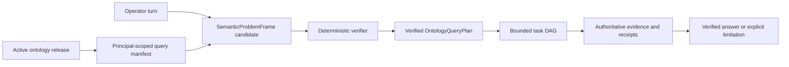

# Ontology Query Coverage 구현 계획

이 계획은 FDAI의 bounded conversation/ontology foundation과 operator 질문을 위한 목표 non-keyword
path 사이의 구현 gap을 닫습니다. 100% structural query coverage에 필요한 검증된 현재 baseline,
service/agent ownership, dependency 순서 work package, cutover gate 및 rollback unit을 기록합니다.

> **Coverage boundary:** 100%는 하나의 active ontology release에서 읽을 수 있는 모든 declaration이
> principal-scoped query descriptor 또는 typed unavailable reason을 갖는다는 뜻입니다. Identity,
> provider data, history 또는 evidence가 없을 때 완전하거나 정확한 답을 보장한다는 뜻이 아닙니다.
>
> **Authority boundary:** 자연어 및 embedding output은 candidate-only로 유지합니다. Read plan에는
> 실행 권한이 없습니다. 명시적 변경 요청은 기존 judgment, safety, 사람 승인, execution, recovery 및
> audit path로 다시 들어가는 typed draft만 만들 수 있습니다.
>
> **구현 상태(2026-08-10):** Exact ontology release, semantic candidate, bounded ObjectSet, secured query
> receipt, typed function registration, current inventory projection, metric provider 및 causal-analysis
> primitive가 있습니다. Production path는 여전히 regex/token routing과 선택적인 serial 2-3 command
> read plan을 사용합니다. Server-side intent graph, full release-derived query manifest,
> `OntologyQueryPlan`, complete semantic index adapter, historical topology 및 cross-resource temporal
> query composition은 아직 제공되지 않습니다.
> Semantic problem frame, query DAG, intent graph, task receipt 및 structural coverage receipt의 OQ-01
> implementation-free SDK model은 이제 제공됩니다. Producer/consumer projection wiring은 OQ-04 및
> OQ-05에 남아 있습니다.

## 설계 개요

Model은 언어를 분해하고 meaning representation을 제안합니다. Verifier는 schema identity,
relationship composition, time bound, scope, purpose 및 capability check를 소유합니다. Concrete object는
plan 검증 이후 authoritative read로만 선택합니다.

## 검증된 baseline 및 gap

| 영역 | 검증된 현재 구현 | 목표를 차단하는 gap |
|------|------------------|---------------------|
| Conversation routing | `ConversationCoordinator`가 `_VERB_PATTERNS`를 사용합니다. `ReadPlanNarrator`는 2-3개의 canonical command string을 제안할 수 있으며 `execute_read_plan`이 이를 serial로 실행합니다. | Server-side semantic problem frame, intent graph producer, dependency-wave executor 및 typed plan bridge가 없습니다. |
| Console intent graph | Console은 bounded `intent_graph` 및 `intent_graph_evidence` payload를 strict하게 parse하고 render합니다. | Core 또는 Operator Service producer가 없습니다. 현재 구현은 presentation-only입니다. |
| Semantic interpretation | `SemanticInterpretationCandidate`, `VerifiedSemanticPlan`, exact release check 및 candidate-only authority가 있습니다. | Verified plan은 typed function 하나를 target으로 하며 conversation routing 또는 generic ontology query algebra와 연결되지 않았습니다. |
| Object query | `ObjectSetDefinition`, typed predicate, bounded traversal 하나, interface selection, ACL projection, purpose check 및 secured receipt가 있습니다. | Set operation, ordering, aggregation, projection, multi-stage function composition 및 planner descriptor가 하나의 `OntologyQueryPlan`으로 결합되지 않았습니다. |
| Query manifest | `platform_manifest`는 release identity와 interface, ActionType, function name을 노출합니다. | ObjectType property, allowed operator, LinkType side, evidence requirement, availability 및 typed unavailable reason이 없습니다. |
| Interface | Interface compilation과 interface-selected ObjectSet이 test됩니다. | Runtime catalog projection이 reviewed Interface declaration을 load하지 않습니다. |
| Relationship | LinkType endpoint, cardinality, causal, transitive, temporal metadata가 있고 store는 incoming/outgoing traversal을 지원합니다. | LinkType에 검토된 query side 두 개가 없으며 planner는 raw direction 지식 없이 inverse meaning을 선택할 수 없습니다. |
| Semantic generation | Rule semantic schema, generation contract, database migration 및 `CatalogSemanticIndex` Protocol이 있습니다. | 현재 service-owned source tree에 concrete index adapter/generation publisher가 없으며 full-ontology generation도 없습니다. |
| Current topology | Azure projection은 resource-group/VNet containment, attachment 및 bounded dependency allowlist를 emit합니다. | Azure adapter가 `peered_with` 또는 `routes_to`를 emit하지 않으며 private endpoint, workload 및 service dependency coverage가 incomplete합니다. |
| Historical topology | Current graph generation과 immutable decision snapshot이 replay identity를 보존합니다. | Instance graph는 bitemporal이 아니며 일반 `graph_at` 및 `topology_diff` function이 없습니다. |
| Metric 및 causality | Routed Prometheus, Azure Metrics/KQL provider와 deterministic T1 causal/temporal analysis primitive가 있습니다. | Ontology metric-concept registry가 임의 질문의 measure를 provider로 compile하지 못하며 ad hoc cross-resource temporal join도 없습니다. |

## Ownership 및 service boundary

| Responsibility | Accountable owner | Runtime placement |
|----------------|-------------------|-------------------|
| 자연어 분해 및 clarification | Bragi | Core agent runtime입니다. Operator Service는 authenticated relay 및 projection host입니다. |
| Ontology 및 query-manifest lifecycle | Mimir | Core mechanical builder 및 catalog lifecycle입니다. |
| Current/historical context materialization | Muninn | Core projection worker 및 owned persistence adapter입니다. |
| Evidence observation 및 completeness | Heimdall | Core read-only provider binding 및 typed observation입니다. |
| Correlated audit 및 replay evidence | Saga | Append-only audit path입니다. |
| External query authentication, scope, streaming 및 display projection | Operator Service | Versioned shared contract만 사용하는 독립 service입니다. |
| Query 및 receipt wire contract | Shared service-contract SDK | Service implementation 또는 provider access를 포함하지 않습니다. |

Authority-bearing transition은 event-bus message로 유지합니다. Read-only query execution은
purpose-bound immutable projection을 사용할 수 있지만 한 service가 다른 service implementation을 import하지
않습니다. 새 agent를 추가하지 않습니다.

## 목표 contract

### Semantic problem frame

`SemanticProblemFrame`은 language interpretation과 object retrieval을 분리합니다. 다음을 포함합니다.

- select, compare, explain change, validate 또는 draft action 같은 operation class
- 발명된 runtime identity가 없는 subject constraint
- measure 및 unit concept
- trusted time에 고정된 temporal/comparison window
- requested answer shape 및 evidence requirement
- unresolved concept 및 competing interpretation

Provider query, raw SQL/KQL, object claim 또는 execution authority는 포함하지 않습니다.

### Ontology query plan

검증된 `OntologyQueryPlan`은 다음 operation으로 구성된 closed DAG입니다.

- object/interface selection 및 exact context anchor
- typed property predicate/projection
- reviewed LinkType-side traversal
- set union, intersection 및 subtraction
- ordering, grouping 및 bounded aggregation
- 등록된 read-only query, derive 및 validate function
- temporal snapshot, diff, metric-window 및 evidence-join node

모든 node는 active release, purpose, role, scope, limit, dependency 및 expected receipt shape를
고정합니다. Plan은 executable provider text 또는 mutation handler를 포함할 수 없습니다.

## Work package

| ID | Work package | Dependency | Exit evidence |
|----|--------------|------------|---------------|
| OQ-00 | 현재 구현 baseline을 고정하고 status claim을 수정하며 모든 regex/token route를 inventory합니다. Exact, ambiguous, unsupported, temporal, causal 및 action 질문의 bilingual competency cohort를 추가합니다. | 없음 | Machine-readable baseline과 replay fixture가 모든 compatibility path를 식별합니다. |
| OQ-01 | `SemanticProblemFrame`, `OntologyQueryPlan`, intent goal, clarification, task receipt 및 structural coverage receipt의 versioned shared contract를 추가합니다. | OQ-00 | N/N-1 codec test가 unknown authority, unbounded plan, cycle 및 stale ref를 차단합니다. |
| OQ-02 | Ontology catalog data에 LinkType query side와 reviewed Interface declaration을 추가하고 exact release에서 complete principal-scoped manifest를 생성합니다. | OQ-01 | 읽을 수 있는 모든 ObjectType, Property, LinkType side, Interface, FunctionType 및 draft-only ActionType에 descriptor 또는 unavailable reason이 있습니다. |
| OQ-03 | ObjectSet, set operation, ordering, aggregation, projection 및 typed function node 위에 generic plan verifier/executor를 구현합니다. | OQ-01, OQ-02 | Property test가 bound, type safety, purpose narrowing, ACL closure, truncation, cancellation 및 stable receipt를 입증합니다. |
| OQ-04 | String-command `ReadPlanNarrator` planning을 Bragi-owned schema-constrained decomposition, manifest search/describe, deterministic verification 및 durable clarification으로 교체합니다. Compatibility path 옆에서 shadow로 실행합니다. | OQ-02, OQ-03 | English/Korean turn이 replay-stable verified plan 또는 bounded clarification 하나를 만들며 unverified read를 호출하지 않습니다. |
| OQ-05 | Bounded concurrency, cancellation, blocked descendant, conflict detection, evidence ledger 하나 및 claim verification을 갖춘 server-side intent graph와 dependency-wave task executor를 구현합니다. | OQ-03, OQ-04 | Operator Service가 Console이 이미 검증하는 같은 versioned graph/receipt를 stream하며 partial branch가 complete answer가 되지 않습니다. |
| OQ-06 | Owning service에 concrete semantic-index adapter와 off-path generation publisher를 복원한 뒤 generation document를 Rule에서 declaration 및 eligible deployment-local object projection으로 확장합니다. | OQ-02 | Full initial generation, digest-reusing incremental generation, independent validation, atomic activation, stale degradation 및 rollback test가 통과합니다. |
| OQ-07 | VNet peering, route, private endpoint, network membership, workload placement 및 service dependency의 current Azure topology projection을 완성하고 network-path receipt issuer를 bind합니다. | OQ-02, OQ-03 | VM-to-service 및 service-to-data-store path fixture가 direction, reciprocal peering evidence, completeness 및 unknown absence를 보존합니다. |
| OQ-08 | Append-only topology relationship revision과 retained provider-generation ref를 추가하고 bounded `graph_at`/`topology_diff` function을 구현합니다. Current graph는 fast current-state projection으로 유지합니다. | OQ-03, OQ-07 | Before/after peering fixture가 decision을 다시 쓰지 않고 exact retained graph, tombstone, late evidence 및 incomplete history를 재구성합니다. |
| OQ-09 | Reviewed metric-semantic registry와 metric series, change point, aligned window, cross-resource temporal correlation 및 causal support/refutation function을 추가합니다. | OQ-03, OQ-05, OQ-08 | Request-growth 및 storage-write-loss scenario가 zero와 missing data를 구분하고 chronology를 원인으로 단정하지 않으며 competing explanation을 인용합니다. |
| OQ-10 | 새 path를 모든 compatibility route와 shadow replay하고 cohort로 promotion한 뒤 ordinary language에서 regex, keyword narrator, phrase-based answer intent 및 canonical-string read planning을 제거합니다. Explicit exact-command surface는 별도로 유지합니다. | OQ-05, OQ-06, OQ-09 | 새 path가 cohort quality/latency를 유지하거나 개선하고 legacy ordinary-language routing share는 0이며 exact technical command는 deterministic하게 남습니다. |
| OQ-11 | 모든 ontology release/capability 변경에 continuous structural coverage 및 question disposition gate를 적용합니다. | OQ-10 | Structural coverage와 terminal disposition은 100%, unsupported claim과 unauthorized execution은 0이며 answer coverage는 cohort별로 보고합니다. |

## 병렬 lane 및 merge point

- **Lane A - contract 및 manifest:** OQ-01 -> OQ-02입니다.
- **Lane B - query kernel:** OQ-01 contract freeze 이후 OQ-03을 시작하고 release 전에 OQ-02와 join합니다.
- **Lane C - semantic projection:** OQ-02의 descriptor identity가 stable해지면 OQ-06을 시작합니다.
- **Lane D - operational evidence:** OQ-03 이후 OQ-04/OQ-05와 병렬로 OQ-07 -> OQ-08 -> OQ-09를 진행합니다.
- **Lane E - conversation cutover:** OQ-04 -> OQ-05 -> OQ-10이며 cutover에서 OQ-06/OQ-09와 join합니다.

각 lane은 focused test만 실행합니다. OQ-10은 complete end-to-end behavior를 비교하는 첫 integration
point이고 OQ-11은 release gate입니다.

## Competency scenario

### 지난주 이후 request volume 증가

Expected plan은 request를 `explain_change`, request-volume measure, service subject constraint,
equal baseline/current window 및 causal-evidence requirement로 분해합니다. 이어서 metric concept를
resolve하고 영향받은 service를 찾으며 workload/pod로 traversal합니다. Change point 주변 change를
조회하고 complete window를 비교해 supported/refuted/unresolved hypothesis를 ranking합니다. "요청" 또는
calendar boundary를 context로 resolve할 수 없으면 clarification으로 유지합니다.

### Network change 이후 storage write 중단

Expected plan은 storage object와 write-success series를 anchor로 사용하고 retained pre-change graph에서
upstream workload/VM dependency를 찾습니다. Change 전후 network path를 비교하고 peering revision 및
write-attempt evidence를 조회하며 DNS, route, firewall, credential 및 application alternative를 test합니다.
Current edge가 없다는 사실만으로 old path가 없었다거나 peering change가 symptom 원인이라고 입증할 수
없습니다.

## Migration, rollout 및 rollback

- **Additive contract 우선:** 새 field/table은 현재 read path를 바꾸지 않고 landing합니다.
- **Shadow comparison:** 새 plan은 compatibility routing 옆에서 read-only로 실행되며 cohort gate 전에는
  visible answer를 바꾸지 않습니다.
- **Atomic generation:** Semantic generation은 pointer activation 전에 stage/validate하며 rollback은 retained
  compatible generation을 다시 activate합니다.
- **Temporal storage 분리:** Historical relationship revision은 current instance store를 implicit
  latest-wins bitemporal authority로 만들지 않습니다.
- **Capability switch:** Availability, enabled state 및 authority는 독립적으로 유지합니다. Semantic
  planning을 끄면 keyword guessing이 아니라 exact command와 typed unavailable result로 돌아갑니다.
- **Legacy removal은 마지막:** Regex/token path는 replay evidence와 stable rollback release 이후에만
  제거합니다. 다시 활성화하는 것을 장기 rollback mechanism으로 사용하지 않습니다.

## 검증 및 measure

| Measure | Release expectation |
|---------|---------------------|
| Structural schema coverage | 읽을 수 있는 active declaration 100%가 표현되거나 typed unavailable입니다. |
| Question disposition | 수락한 turn 100%가 answer, clarification, hold, unsupported 또는 draft로 끝납니다. |
| Unsupported operational claim | 정확히 0건입니다. |
| Conversation에서 unauthorized execution | 정확히 0건입니다. |
| Exact identity 및 stale-revision error | 정확히 0건입니다. |
| Answer coverage | Question, language, domain, provider 및 evidence cohort별로 별도 측정합니다. |
| Clarification quality | 실질적인 competing interpretation이 남은 경우에만 정확히 질문합니다. |
| Full/incremental generation parity | Ordered document digest와 retrieval cohort outcome이 동일합니다. |
| Historical replay | 같은 cutoff가 같은 retained graph 및 evidence receipt를 resolve합니다. |

## 관련 문서

| 알아볼 내용 | 문서 |
|-------------|------|
| 목표 question planning 및 coverage contract | [계층형 대화 계획](hierarchical-conversation-planning-ko.md) |
| Exact release, ObjectSet 및 typed function | [FDAI Ontology Safety Infrastructure](../architecture/operating-ontology-platform-ko.md) |
| Operating object, relationship, identity 및 time | [FDAI 운영 온톨로지](../architecture/operating-ontology-ko.md) |
| Rule-specific semantic generation | [Rule 의미 검색](../rules-and-detection/rule-semantic-retrieval-ko.md) |
| Causal hypothesis evidence 및 closure | [인과 incident graph](../rules-and-detection/causal-incident-graph-ko.md) |
| Console 및 narrator authority | [FDAI Console 대화](operator-console-ko.md) |
