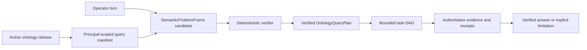

# 온톨로지 조회 커버리지 구현 계획

이 계획은 FDAI의 범위가 제한된 대화/온톨로지 기반과 운영자 질문을 위한 목표 non-keyword
경로 사이의 구현 공백을 닫습니다. 100% structural 조회 커버리지에 필요한 검증된 현재 기준선,
서비스/에이전트 소유권, 의존성 순서 작업 패키지, 전환 게이트 및 롤백 단위를 기록합니다.

> **커버리지 경계:** 100%는 하나의 활성 온톨로지 release에서 읽을 수 있는 모든 선언이
> principal 범위로 한정된 조회 서술자 또는 타입이 지정된 사용 불가 사유를 갖는다는 뜻입니다. 신원,
> 프로바이더 데이터, 이력 또는 근거가 없을 때 완전하거나 정확한 답을 보장한다는 뜻이 아닙니다.
>
> **권한 경계:** 자연어 및 임베딩 출력은 후보 전용으로 유지합니다. 읽기 계획에는
> 실행 권한이 없습니다. 명시적 변경 요청은 기존 judgment, 안전성, 사람 승인, 실행, 복구 및
> 감사 경로로 다시 들어가는 타입이 지정된 초안만 만들 수 있습니다.
>
> **무작위 보증 상태(2026-08-11):** 인증된 Console은 생성된 영어 및 한국어 턴 100/100개를
> 완료했지만 측정된 경로는 로컬 Azure 서술기만 사용했습니다. 의도 인식은 100%, 답변 성공은
> 20%였으며 카드 100개 모두 근거 0/0의 검증되지 않은 상태였습니다. Core는 이제 Azure 모델
> 후보, exact 온톨로지 release 및 온톨로지 인스턴스 저장소를 사용할 수 있을 때 의미 런타임을
> 구성합니다. 측정된 실행은 이 연결 이전의 결과입니다. Operator 서비스는 이제 의미 턴을
> publish하고 근거에 묶인 변환 결과를 consume합니다. Visible Console 경로에서 새 실제 운영 서비스 간
> 및 randomized 실행 증적을 만들 때까지 운영 완료 보고는 계속 차단됩니다.
> [온톨로지 쿼리 무작위 보증](ontology-query-randomized-assurance-ko.md)을 참조하세요.
>
> **서비스 간 계약 상태(2026-08-11):** 가산 버전 1.2 요청/변환 결과 묶음은
> 범위가 제한된 의미 턴, 인증된 principal 역할, 기한, 멱등성 신원, 최종 처리 결과 및
> exact 근거 다이제스트를 정의합니다. 이 계약만으로 운영 라우팅이 활성화되지는 않습니다.
> 의미 페이로드는 N-1 형태로 translate하지 않고 실패 시 차단합니다. Core는 이제 설정된 의미
> 요청을 consume하고 정본 결과를 저장하며 최종 변환 결과를 publish하고 시작
> 준비 상태에 exact missing-provider 사유를 보고합니다. Operator 발신함 게시, 영속 재생 및
> Console `done` 변환 결과는 이제 compose됩니다. POST 재생은 요청 기한까지 기다리고 Core 변환 결과가
> 없으면 typed hold를 영속화합니다. Operator 영속성은 JSONB text parameter의 타입을 명시하여 실제
> psycopg claim 및 변환 결과 경로를 실행 가능하게 유지합니다. Receipt-backed 실제 운영 통합 근거는
> release 게이트로 유지됩니다.
>
> **구현 상태(2026-08-10):** Exact 온톨로지 release, 의미 후보, 범위가 제한된 ObjectSet, secured 조회
> 증적, 타입이 지정된 함수 등록, 현재 인벤토리 변환 결과, 메트릭 프로바이더 및 causal-analysis
> 기본 요소가 있습니다. 운영 경로는 여전히 정규식/토큰 라우팅과 선택적인 serial 2-3 명령
> 읽기 계획을 사용합니다. 서버 측 의도 그래프, full release에서 도출한 조회 매니페스트,
> `OntologyQueryPlan`, 완전한 의미 인덱스 어댑터, historical 토폴로지 및 cross-resource temporal
> 조회 조립은 아직 제공되지 않습니다.
> 의미 problem 프레임, 조회 DAG, 의도 그래프, 작업 증적 및 structural 커버리지 증적의 OQ-01
> implementation-free SDK 모델은 이제 제공됩니다. 생산자/소비자 변환 결과 배선은 OQ-04 및
> OQ-05에 남아 있습니다.
> OQ-02에는 이제 함수를 역할/용도로 필터하고 supplied release 선언 전체를 계정하는
> 내용 기반 주소를 가진 principal 범위로 한정된 매니페스트 빌더가 포함됩니다. 모든 directed LinkType은 이제
> 결정론적 나가는/들어오는 엔드포인트 query-side 식별자를 변환 결과합니다. 운영 카탈로그는
> 검토된 `Identifiable` Interface를 부하하고 모든 현재 ObjectType의 명시적 연결을 검증하며
> polymorphic 카탈로그를 compile하고 exact 런타임 release에 선언을 포함합니다. 이 매니페스트를
> 서술기 및 범용 조회 표면에 연결하는 작업은 남아 있습니다.
> OQ-03에는 이제 범위가 제한된 의존성 wave, 동시성, 시간 초과, 취소, blocked-descendant 처리,
> 고정된 실패 사유 및 작업 증적을 갖춘 exact-release 조회 DAG 실행기가 포함됩니다. Built-in
> 핸들러는 이제 secured ObjectSet 구체화, union, intersection, subtraction, 정렬,
> 변환 결과, grouped 집계 및 exact-release 조회/derive/validate 함수 호출을 다룹니다.
> 결정론적 검증기는 I/O 전에 principal 매니페스트, readable 속성, LinkType, closed 노드 인자,
> 의존성 출력 종류, 함수 스키마 및 등록된 확장 스키마를 검사합니다. Temporal,
> metric-series 및 evidence-join 핸들러는 남아 있습니다.
> OQ-07은 이제 현재 connected VNet 피어링 기록을 관찰된 direction으로 변환 결과하고 비공개
> 엔드포인트를 exact private-link 서비스 대상에 첨부합니다. Reverse 피어링에는 여전히 독립적인
> remote-VNet 관측이 필요합니다. 또한 명시적 ARM 리소스 next-hop id에서만 `routes_to`를
> 변환 결과하며 IP, 접두사 및 hostname은 온톨로지 간선이 되지 않습니다. 스냅샷과 real-time 제약은
> 검토된 피어링/라우팅 vocabulary를 수락합니다. 프로바이더 관계 추출은 속성 경로, 허용된
> 프로바이더 타입, 엔드포인트 방향, 출처 스키마 다이제스트 및 근거 정책을 고정하는 검토된 mapping
> 카탈로그를 사용합니다. 하나의 완전한 인벤토리 세대에 두 엔드포인트가 모두 있고 독립적으로 검증된
> 링크만 active graph에 들어갑니다. 엔드포인트 누락, 모호한 방향, stale mapping, 중복 또는
> conflicting 관찰, 부분 세대는 stable dropped reason과 함께 absent 상태로 남습니다.
> 워크로드/서비스 mapping 및 운영 network-path 발급자는 남아 있습니다.
> OQ-04에는 이제 whole 범위가 제한된 턴과 후보 서술자에서 의미 프레임 및 타입이 지정된 노드 DAG를
> 제안하는 스키마로 제한한 모델 경계가 있습니다. Core는 모든 다이제스트/권한 필드를 다시 만들고
> exact principal 매니페스트를 검증하며 검증된 계획, 명확화 하나, action-draft 인계,
> 지원하지 않는 또는 사용 불가 결과를 반환합니다. 호환성 조정기는 이 경로를 shadow로
> 실행하고 처리 결과/내용 다이제스트만 기록할 수 있습니다. Azure 어댑터는 이제 워크로드 신원을
> 통해 범위가 제한된 JSON-object 호출 두 개를 실행하고 제안 스키마 두 개를 검증하며 resolved 후보를
> 순서대로 시도합니다. Core 조립은 모든 선행 조건을 사용할 수 있을 때 이 어댑터를 exact
> release, 현재 인스턴스 저장소, principal 범위로 한정된 매니페스트, 결정론적 검증기 및
> request-role-specific secured 실행기에 연결합니다. 실제 운영 서비스 간 hardening은 Core가
> 프레임 다이제스트를 다시 만들기 전에 프레임 제안의 evidence-requirement 식별자를 shared wire
> 계약과 일치시킵니다. 입력을 포함하지 않는 단계 및 검증 진단은 운영자 텍스트나 프로바이더
> 상세를 보존하지 않고 실패 attribution을 유지합니다.
> OQ-05는 이제 결정론적하게 최대 8개 목표의 의도 그래프를 만들고 실행기 증적을 해당 목표에
> 연결하며 내부 exact-plan 계약을 Console v2/v1 wire 형태로 변환 결과합니다. Console은 명시적
> 취소 증적도 수락합니다. 의미 계획 실행 및 운영 turn-completion 스트림에 이
> 변환 결과를 첨부하는 작업은 남아 있습니다.
> OQ-06은 이제 atomic 단계/activate, stale-generation, 타입이 지정된 검색 및 롤백 행동을 가진
> service-owned 구체적인 in-memory 의미 인덱스를 복원했습니다. Full 온톨로지 세대 빌더는 모든
> principal-manifest 선언과 조건을 충족한 deployment-local 객체 변환 결과를 발행하고 incremental
> 빌드에서 변경되지 않은 문서 인스턴스를 다이제스트로 재사용합니다. 커버리지와 문서 루트를
> 독립적으로 다시 계산하며 해당 검증 증적이 연결되기 전에는 activation을 거부합니다. 영속
> PostgreSQL 어댑터, scheduled 발행기 프로세스 및 운영 descriptor-selector 연결은 남아 있습니다.
> OQ-08에는 이제 retained 프로바이더 세대, 객체/링크 개정 번호 및 tombstone을 위한 추가 전용
> bitemporal 토폴로지 계약과 Core-owned 이행, 결정론적 `graph_at`/`topology_diff`, `known_at`에
> 따른 late-evidence 재생, incomplete-history 의미 규칙 및 검증기 스키마를 가진 타입이 지정된 조회 핸들러가
> 포함됩니다. PostgreSQL 읽기 담당/쓰기 담당 연결과 inventory-promotion 개정 번호 발행기는 남아 있습니다.
> OQ-09에는 문구 별칭이 없는 exact 검토된 metric-concept 레지스트리, 권위 있는 메트릭 구간,
> zero와 누락된 데이터를 구분하는 equal-duration 비교, 범위가 제한된 metric-series/evidence-join 핸들러 및
> competing explanation을 보존하는 topology-aware temporal support/refutation이 포함됩니다. 운영
> 메트릭 프로바이더 연결과 검토된 카탈로그 데이터에는 이제 검토된 alias-free 카탈로그와 구체적인
> `MetricProvider` 구간 어댑터가 포함됩니다. 이 어댑터는 관찰된 zero를 보존하고 빈 프로바이더
> 결과를 불완전한으로 보고합니다. 런타임 semantic-turn 조립은 현재 ObjectSet과 pure
> 집합/순서/project/집계 핸들러만 노출합니다. Metric-series 및 evidence-join 핸들러는
> 권위 있는 프로바이더가 명시적으로 연결될 때까지 사용 불가 상태로 남습니다.
> OQ-05에는 이제 accepted ordinary-language 턴을 답변, 명확화, 보류, 지원하지 않는, 액션 초안
> 또는 취소로 종료하는 비동기 서버 측 의미 턴 런타임도 포함됩니다. 검증된 조회
> DAG만 실행하며 exact Console 그래프/근거 변환 결과를 발행합니다.
> OQ-10은 synchronous 호환성 조정기의 기본값을 exact 정본 명령 only로 변경합니다.
> Natural-language 별칭, 키워드 서술 및 canonical-string 읽기 계획은 테스트 또는 명시적 temporary
> 호출자가 `legacy`를 선택할 때만 실행되며 ordinary 언어는 의미 런타임이 담당합니다.
> OQ-11은 모든 shipped principal 매니페스트와 bilingual competency 집단을 대상으로 executable fast 게이트를
> 추가합니다. 완전한 structural accounting, 최종 처리 결과 100%, 이전 방식 ordinary-language 경로 0,
> 지원하지 않는 점유 0 및 승인되지 않은 실행 0을 요구합니다. 답변 개수는 universal 완전한으로
> 주장하지 않고 집단별로 보고합니다.
> Committed competency 집단은 `receipt_source=deterministic_fixture`를 사용합니다. 게이트 증적은
> 로컬 structural 검증 결과를 `passed`에 유지하고 질문 하나라도 결정론적 고정본 근거를
> 사용하면 `production_ready=false`로 보고합니다. 운영 완료를 주장하는 호출자는
> `require_production_ready=True`를 설정하고 외부에서 생성된 `cross_service_e2e` 또는
> `live_assurance` 증적을 제공해야 합니다. 따라서 일반 fast 게이트는 로컬 CI에서 계속 실행할 수
> 있으며 hand-authored 고정본을 서비스 간 또는 실제 운영 증명으로 취급하지 않습니다. Catalog
> 구조가 변경되면 모든 answered fixture는 새로 계산한 release 및 principal-manifest digest를
> 고정해야 게이트를 통과하며 stale 결정론적 receipt는 compatibility로 수락하지 않습니다.
> 첫 인식 상태 완결성 구현 구획은 이제 변경할 수 없는 유한 `QuestionUniverseReceipt`, 형식이
> 지정된 `EpistemicStatus`, 증명을 포함하는 `EpistemicQuestionRecord`, 0건 임계값을 적용하는
> `EpistemicCoverageReceipt`를 제공합니다. 기존 커버리지 게이트는 외부 증적 출처가
> `production_ready=true`를 만들기 전에 일치하며 통과한 인식 상태 증적을 요구합니다. 이는
> release 게이트 기반일 뿐입니다. 생성된 질문 우주, 런타임 이해/완전성/주장 증적, 공급자 기반
> L3/L4 인증은 아직 완료되지 않았습니다.
> OKQ-01에는 이제 `resource_classified_as`의 카탈로그 선언, 결정론적 ResourceType 매핑
> 다이제스트, 안전하게 실패하는 분류 변환 결과, 단일 작성자 영속성 테스트가 있습니다. 운영
> 인벤토리 작업 주입과 리소스에서 Rule로 이어지는 질의 함수는 아직 완료되지 않았습니다.

## 설계 개요

모델은 언어를 분해하고 meaning 표현을 제안합니다. 검증기는 스키마 신원,
관계 조립, 시간 한계, 범위, 용도 및 기능 검사를 소유합니다. 구체적인 객체는
계획 검증 이후 권위 있는 읽기로만 선택합니다.

## 검증된 기준선 및 공백

| 영역 | 검증된 현재 구현 | 목표를 차단하는 공백 |
|------|------------------|---------------------|
| 대화 라우팅 | 기본값 호환성 조정기는 exact 정본 명령만 수락합니다. 구성된 의미 토픽은 ordinary 언어를 Operator 발신함, Core Azure 플래너/검증된 DAG, 영속 변환 결과 및 Console `done` 프레임으로 전달합니다. | 실제 운영 서비스 간 증적과 complete-manifest 한계를 넘는 매니페스트를 위한 서술자 인덱스가 남아 있습니다. `legacy`는 명시적 temporary 호환성 모드로만 존재합니다. |
| 서비스 간 의미 wire | 버전 1.2 요청/변환 결과 묶음은 실행 권한 없이 범위가 제한된 의미 입력과 근거에 묶인 최종 출력을 전달합니다. Operator와 Core는 Terraform-provisioned 요청/변환 결과 토픽, 영속 재생 및 범위가 제한된 재시도를 사용합니다. | 운영 준비 상태는 evidence-gated로 유지되며 의미 기록은 N-1로 downgrade하지 않습니다. |
| Console 의도 그래프 | Core는 검증된 계획에서 범위가 제한된 그래프/증적 근거를 만들고 Operator는 Console-compatible 최종 프레임으로 이를 스트림합니다. | 새 인증된 randomized 실행이 실제 운영 근거에 대해 visible 브라우저 경로를 검증해야 합니다. |
| 의미 interpretation | Azure OpenAI 어댑터는 bearer-token authentication과 resolved-candidate 대체 경로를 통해 `SemanticProblemFrame` 및 타입이 지정된 DAG를 strict 범위가 제한된 JSON 객체 두 개로 제안합니다. Core는 신원을 부여하고 Pydantic 스키마와 principal 매니페스트를 검증하며 exact 요청 역할로 실행하고 Operator는 결정론적 근거에 묶인 답변을 스트림합니다. | 서술자 한계를 넘으면 complete-manifest 선택자가 보류합니다. |
| 객체 조회 | `OntologyQueryPlan`은 이제 변경할 수 없는 내용 기반 주소를 가진 표 위에서 secured ObjectSet, 집합 algebra, 정렬, 변환 결과, grouped 집계 및 타입이 지정된 읽기 전용 함수를 구성합니다. | Temporal 스냅샷, 메트릭 series 및 근거 결합에는 등록된 확장 핸들러가 필요합니다. |
| 조회 매니페스트 | principal 범위로 한정된 내용 기반 주소를 가진 빌더가 ObjectType/filtered 속성, LinkType 양쪽 엔드포인트 side, Interface, 읽기 전용 함수 및 초안 전용 ActionType을 변환 결과합니다. | 운영 서술기는 아직 매니페스트를 사용하지 않으며 완전한 운영자/근거 가용성 서술자가 남아 있습니다. |
| Interface | 운영 카탈로그 로딩은 `Identifiable`, 출처 이력 및 모든 현재 ObjectType의 명시적 연결을 검증합니다. 런타임 조립은 이를 compile하고 exact release에 pin합니다. | 추가 기능 Interface와 운영 ObjectSet 조회 연결은 남아 있습니다. |
| 관계 | 모든 directed LinkType은 엔드포인트, cardinality, causal, transitive 및 temporal 메타데이터와 함께 결정론적 `<name>.outgoing`/`<name>.incoming` 머신 조회 id를 변환 결과합니다. | 이 side를 사용하는 범용 계획 검증기와 플래너 연결은 남아 있습니다. |
| 의미 세대 | 구체적인 service-owned atomic in-memory 인덱스와 off-path full/incremental 온톨로지 세대 발행기가 선언 및 조건을 충족한 deployment-local 객체를 독립적인 검증과 함께 다룹니다. | 영속 PostgreSQL 어댑터, scheduled 발행기 프로세스 및 운영 의미 서술자 선택자는 남아 있습니다. |
| 현재 토폴로지 | Azure 변환 결과는 containment, attachment, dependency, peering 및 exact-resource routing 후보에 검토된 관계 mapping을 사용합니다. 완전한 세대 verifier는 두 엔드포인트, 독립 verifier 신원, 변경할 수 없는 receipt 및 정본 state-fact 메타데이터를 갖춘 링크만 허용합니다. | 워크로드 및 서비스 의존성 커버리지와 운영 network-path 발급자가 아직 불완전합니다. |
| Historical 토폴로지 | Bitemporal 추가 전용 개정 번호 계약, 이행, retained 세대 참조, tombstone, `graph_at`, `topology_diff`, late-evidence 재생 및 타입이 지정된 조회 핸들러가 있습니다. | PostgreSQL 읽기 담당/쓰기 담당 조립과 inventory-promotion 발행은 남아 있습니다. |
| 메트릭 및 causality | Exact metric-concept 레지스트리, 완전한/불완전한 구간, aligned 비교 및 topology-aware temporal support/refutation 핸들러가 있습니다. | 운영 프로바이더 연결과 검토된 메트릭 카탈로그 항목은 남아 있습니다. |

## 소유권 및 서비스 경계

| Responsibility | Accountable 소유자 | 런타임 placement |
|----------------|-------------------|-------------------|
| 자연어 분해 및 명확화 | Bragi | Core 에이전트 런타임입니다. Operator 서비스는 인증된 중계 및 변환 결과 호스트입니다. |
| 온톨로지 및 query-manifest 수명 주기 | Mimir | Core mechanical 빌더 및 카탈로그 수명 주기입니다. |
| 현재/historical 맥락 구체화 | Muninn | Core 변환 결과 워커 및 owned 영속성 어댑터입니다. |
| 근거 관측 및 완전성 | Heimdall | Core 읽기 전용 프로바이더 연결 및 타입이 지정된 관측입니다. |
| Correlated 감사 및 재생 근거 | Saga | 추가 전용 감사 경로입니다. |
| 외부 조회 authentication, 범위, 스트리밍 및 display 변환 결과 | Operator 서비스 | Versioned shared 계약만 사용하는 독립 서비스입니다. |
| 조회 및 증적 wire 계약 | Shared service-contract SDK | 서비스 구현 또는 프로바이더 접근을 포함하지 않습니다. |

Authority-bearing 전이는 event-bus 메시지로 유지합니다. 읽기 전용 조회 실행은
purpose-bound 변경할 수 없는 변환 결과를 사용할 수 있지만 한 서비스가 다른 서비스 구현을 가져오기하지
않습니다. 새 에이전트를 추가하지 않습니다.

## 목표 계약

### 의미 problem 프레임

`SemanticProblemFrame`은 언어 interpretation과 객체 수집을 분리합니다. 다음을 포함합니다.

- 선택, compare, explain 변경, validate 또는 초안 액션 같은 연산 등급
- 발명된 런타임 신원이 없는 대상 제약
- measure 및 단위 개념
- trusted 시간에 고정된 temporal/비교 구간
- requested 답변 형태 및 근거 요구사항
- 해결되지 않은 개념 및 competing interpretation

프로바이더 조회, raw SQL/KQL, 객체 점유 또는 실행 권한은 포함하지 않습니다.

### 온톨로지 조회 계획

검증된 `OntologyQueryPlan`은 다음 연산으로 구성된 closed DAG입니다.

- 객체/인터페이스 선택 및 exact 맥락 기준점
- 타입이 지정된 속성 조건식/변환 결과
- 검토된 LinkType-side 탐색
- 집합 union, intersection 및 subtraction
- 정렬, 그룹화 및 범위가 제한된 집계
- 등록된 읽기 전용 조회, derive 및 validate 함수
- temporal 스냅샷, 차이, metric-window 및 evidence-join 노드

모든 노드는 활성 release, 용도, 역할, 범위, 한도, 의존성 및 예상 증적 형태를
고정합니다. 계획은 executable 프로바이더 텍스트 또는 변경 핸들러를 포함할 수 없습니다.

## 작업 패키지

| ID | 작업 패키지 | 의존성 | Exit 근거 |
|----|--------------|------------|---------------|
| OQ-00 | 현재 구현 기준선을 고정하고 상태 점유를 수정하며 모든 정규식/토큰 경로를 인벤토리합니다. Exact, 모호한, 지원하지 않는, temporal, causal 및 액션 질문의 bilingual competency 집단을 추가합니다. | 없음 | 기계가 읽는 기준선과 재생 고정본이 모든 호환성 경로를 식별합니다. |
| OQ-01 | `SemanticProblemFrame`, `OntologyQueryPlan`, 의도 목표, 명확화, 작업 증적 및 structural 커버리지 증적의 versioned shared 계약을 추가합니다. | OQ-00 | N/N-1 codec 테스트가 알 수 없음 권한, unbounded 계획, cycle 및 stale 참조를 차단합니다. |
| OQ-02 | 온톨로지 카탈로그 데이터에 LinkType 조회 side와 검토된 Interface 선언을 추가하고 exact release에서 완전한 principal 범위로 한정된 매니페스트를 생성합니다. | OQ-01 | 읽을 수 있는 모든 ObjectType, Property, LinkType side, Interface, FunctionType 및 초안 전용 ActionType에 서술자 또는 사용 불가 사유가 있습니다. |
| OQ-03 | ObjectSet, 집합 연산, 정렬, 집계, 변환 결과 및 타입이 지정된 함수 노드 위에 범용 계획 검증기/실행기를 구현합니다. | OQ-01, OQ-02 | Property 테스트가 한계, 타입 안전성, 용도 좁히기, ACL 종결, 잘림, 취소 및 고정된 증적을 입증합니다. |
| OQ-04 | String-command `ReadPlanNarrator` 계획 수립을 Bragi-owned 스키마로 제한한 decomposition, 매니페스트 검색/describe, 결정론적 검증 및 영속 명확화로 교체합니다. 호환성 경로 옆에서 shadow로 실행합니다. | OQ-02, OQ-03 | English/Korean 턴이 replay-stable 검증된 계획 또는 범위가 제한된 명확화 하나를 만들며 검증되지 않은 읽기를 호출하지 않습니다. |
| OQ-05 | 범위가 제한된 동시성, 취소, 차단된 descendant, 충돌 detection, 근거 원장 하나 및 점유 검증을 갖춘 서버 측 의도 그래프와 dependency-wave 작업 실행기를 구현합니다. | OQ-03, OQ-04 | Operator 서비스가 Console이 이미 검증하는 같은 versioned 그래프/증적을 스트림하며 부분 가지가 완전한 답변이 되지 않습니다. |
| OQ-06 | Owning 서비스에 구체적인 semantic-index 어댑터와 off-path 세대 발행기를 복원한 뒤 세대 문서를 Rule에서 선언 및 조건을 충족한 deployment-local 객체 변환 결과로 확장합니다. | OQ-02 | Full initial 세대, digest-reusing incremental 세대, 독립적인 검증, atomic activation, stale 성능 저하 및 롤백 테스트가 통과합니다. |
| OQ-07 | VNet 피어링, 경로, 비공개 엔드포인트, 네트워크 구성원, 워크로드 placement 및 서비스 의존성의 현재 Azure 토폴로지 변환 결과를 완성하고 network-path 증적 발급자를 연결합니다. | OQ-02, OQ-03 | VM-to-service 및 service-to-data-store 경로 고정본이 direction, reciprocal 피어링 근거, 완전성 및 알 수 없음 absence를 보존합니다. |
| OQ-08 | 추가 전용 토폴로지 관계 개정 번호와 retained provider-generation 참조를 추가하고 범위가 제한된 `graph_at`/`topology_diff` 함수를 구현합니다. 현재 그래프는 fast current-state 변환 결과로 유지합니다. | OQ-03, OQ-07 | Before/after 피어링 고정본이 결정을 다시 쓰지 않고 exact retained 그래프, tombstone, late 근거 및 불완전한 이력을 재구성합니다. |
| OQ-09 | 검토된 metric-semantic 레지스트리와 메트릭 series, 변경 지점, aligned 구간, cross-resource temporal 상관관계 및 causal support/refutation 함수를 추가합니다. | OQ-03, OQ-05, OQ-08 | Request-growth 및 storage-write-loss 시나리오가 zero와 누락된 데이터를 구분하고 시간 순서를 원인으로 단정하지 않으며 competing explanation을 인용합니다. |
| OQ-10 | 새 경로를 모든 호환성 경로와 shadow 재생하고 집단으로 승격한 뒤 ordinary 언어에서 정규식, 키워드 서술기, phrase-based 답변 의도 및 canonical-string 읽기 계획 수립을 제거합니다. 명시적 exact-command 표면은 별도로 유지합니다. | OQ-05, OQ-06, OQ-09 | 새 경로가 집단 quality/지연 시간을 유지하거나 개선하고 이전 방식 ordinary-language 라우팅 share는 0이며 exact technical 명령은 결정론적하게 남습니다. |
| OQ-11 | 모든 온톨로지 release/기능 변경에 연속 구조 및 인식 상태 커버리지 게이트를 적용합니다. | OQ-10 | 구조 커버리지, 유한 질문 우주 집계, 최종 인식 상태 처리 결과는 100%이고, 지원되지 않거나 근거 없는 주장, 숨겨진 범위 누출, 안전하지 않은 변이 생존, 언어 차이, 권한 없는 실행은 0이며 답변 커버리지는 집단별로 보고합니다. |

## 병렬 레인 및 병합 지점

- **레인 A - 계약 및 매니페스트:** OQ-01 -> OQ-02입니다.
- **레인 B - 조회 kernel:** OQ-01 계약 freeze 이후 OQ-03을 시작하고 release 전에 OQ-02와 결합합니다.
- **레인 C - 의미 변환 결과:** OQ-02의 서술자 신원이 고정된해지면 OQ-06을 시작합니다.
- **레인 D - operational 근거:** OQ-03 이후 OQ-04/OQ-05와 병렬로 OQ-07 -> OQ-08 -> OQ-09를 진행합니다.
- **레인 E - 대화 전환:** OQ-04 -> OQ-05 -> OQ-10이며 전환에서 OQ-06/OQ-09와 결합합니다.

각 레인은 focused 테스트만 실행합니다. OQ-10은 완전한 종단 간 행동을 비교하는 첫 통합
지점이고 OQ-11은 release 게이트입니다.

## Competency 시나리오

### 지난주 이후 요청 양 증가

예상 계획은 요청을 `explain_change`, request-volume measure, 서비스 대상 제약,
equal 기준선/현재 구간 및 causal-evidence 요구사항으로 분해합니다. 이어서 메트릭 개념을
해석하고 영향받은 서비스를 찾으며 워크로드/pod로 탐색합니다. 변경 지점 주변 변경을
조회하고 완전한 구간을 비교해 supported/refuted/해결되지 않은 가설을 순위합니다. "요청" 또는
calendar 경계를 맥락으로 해석할 수 없으면 명확화로 유지합니다.

### 네트워크 변경 이후 저장소 쓰기 중단

예상 계획은 저장소 객체와 write-success series를 기준점으로 사용하고 retained pre-change 그래프에서
업스트림 워크로드/VM 의존성을 찾습니다. 변경 전후 네트워크 경로를 비교하고 피어링 개정 번호 및
write-attempt 근거를 조회하며 DNS, 경로, firewall, 자격 증명 및 애플리케이션 대안을 테스트합니다.
현재 간선이 없다는 사실만으로 old 경로가 없었다거나 피어링 변경이 symptom 원인이라고 입증할 수
없습니다.

## 이행, 롤아웃 및 롤백

- **가산 계약 우선:** 새 필드/표는 현재 읽기 경로를 바꾸지 않고 landing합니다.
- **Shadow 비교:** 새 계획은 호환성 라우팅 옆에서 읽기 전용으로 실행되며 집단 게이트 전에는
  visible 답변을 바꾸지 않습니다.
- **Atomic 세대:** 의미 세대는 포인터 activation 전에 단계/validate하며 롤백은 retained
  compatible 세대를 다시 activate합니다.
- **Temporal 저장소 분리:** Historical 관계 개정 번호는 현재 인스턴스 저장소를 암묵적
  latest-wins bitemporal 권한으로 만들지 않습니다.
- **기능 전환:** 가용성, 활성화된 상태 및 권한은 독립적으로 유지합니다. 의미
  계획 수립을 끄면 키워드 guessing이 아니라 exact 명령과 타입이 지정된 사용 불가 결과로 돌아갑니다.
- **이전 방식 제거는 마지막:** 정규식/토큰 경로는 재생 근거와 고정된 롤백 release 이후에만
  제거합니다. 다시 활성화하는 것을 장기 롤백 방식으로 사용하지 않습니다.

## 검증 및 measure

| Measure | release expectation |
|---------|---------------------|
| Structural 스키마 커버리지 | 읽을 수 있는 활성 선언 100%가 표현되거나 타입이 지정된 사용 불가입니다. |
| 질문 처리 결과 | 수락한 턴 100%가 답변, 명확화, 보류, 지원하지 않는 또는 초안으로 끝납니다. |
| 유한 질문 우주 처리 결과 | 생성된 사례 100%가 형식이 지정된 인식 상태 또는 검토된 제외로 끝납니다. |
| 해석과 주장 증명 | 취소되지 않은 턴의 원문 범위와 의미 원자 커버리지가 100%이고 모든 답변이 주장 증명을 가집니다. |
| 빈 결과와 부정 증명 | 검증된 모든 빈 결과 또는 부정 결과가 닫힌 모집단 증명을 가집니다. |
| 지원하지 않는 operational 점유 | 정확히 0건입니다. |
| 근거 없는 주장, 해결되지 않은 충돌, 숨겨진 범위 누출, 안전하지 않은 변이 생존, 언어 차이 | 정확히 0건입니다. |
| 대화에서 승인되지 않은 실행 | 정확히 0건입니다. |
| Exact 신원 및 stale-revision 오류 | 정확히 0건입니다. |
| 답변 커버리지 | 질문, 언어, 도메인, 프로바이더 및 근거 집단별로 별도 측정합니다. |
| 명확화 quality | 실질적인 competing interpretation이 남은 경우에만 정확히 질문합니다. |
| Full/incremental 세대 동등성 | Ordered 문서 다이제스트와 수집 집단 결과가 동일합니다. |
| Historical 재생 | 같은 기준 시점이 같은 retained 그래프 및 근거 증적을 해석합니다. |

## 20-round 강화 기록

처음 landing한 세 구획을 계약 다이제스트, 한계, DAG, 동시성, 권한, 직렬화, 오류
처리, 취소, 민감정보 제거, 재생 시간, 매니페스트 accounting, stale release, ObjectSet,
증적, performance, 서비스 경계, Operator 변환 결과, 서술기 권한, 성능 저하 및
docs-code 동등성의 독립된 20개 관점으로 검토했습니다.

검증된 Medium 이상 발견 사항은 다음과 같이 해결했습니다.

- principal 범위로 한정된 매니페스트가 호출자 역할 또는 용도 밖의 속성을 제거합니다.
- Exact release에 없는 선언은 조용히 무시하지 않고 차단합니다.
- 실행이 온톨로지 release와 query-manifest 다이제스트를 모두 다시 검사합니다.
- 매니페스트 hashing은 작은 per-record JSON 상한 대신 명시적인 8 MiB 상한을 사용합니다.
- 취소를 핸들러 실행 전과 실행 중, semaphore wait 동안에도 관측합니다.
- 노드 기한이 queueing 및 핸들러 실행 전체를 포함합니다.
- 권한 확인 denial, 사용 불가 핸들러, 잘못된 핸들러 결과, 시간 초과, 취소 및 unexpected
  프로바이더 실패가 프로바이더 상세 없는 고정된 타입이 지정된 증적을 만듭니다.
- Focused 테스트가 동시 wave, 차단된 descendant, stale 권한, 취소 race, 합계 기한,
  속성 filtering, 선언 mismatch 및 다이제스트 stability를 검증합니다.

핸들러 내부 동시 확산, 계약 검증 이후 불가능한 DAG cycle, timezone-naive 증적 수락 및
candidate-limit 잘림 발견 사항은 기각했습니다. 실행기 경계 밖이거나 기존 계약이 이미
실패 시 차단하기 때문입니다. Landing한 계약, 매니페스트 및 실행기 구획에는 재현 가능한 Medium 이상
발견 사항이 남아 있지 않습니다.

잔여 Low 관측은 최종 증적 빌더 사이의 코드 duplication, 여러 번 수행되는 범위가 제한된
그래프 변환 결과 통과 및 developer-only 어댑터의 더 명확한 진단입니다. 추가 의미 Interface,
운영 플래너 연결, 의미 세대, 토폴로지 이력 및 temporal 결합은 숨겨진 강화
defect가 아니라 계획된 기능으로 남아 있습니다.

OQ-04/OQ-05 기반에는 권한, 모델 trust, 다이제스트 연결, structural 커버리지, 역할/용도,
서술자 변경, 입력 한계, 프롬프트 주입, 명확화, 액션 초안, 검증기 bypass,
그래프/증적 대응, 취소, Console 동등성, 재생, 민감정보 제거, 호환성 라우팅, 서비스 경계,
에이전트 소유권, 동시성, 테스트 및 docs를 다루는 추가 25-lens adversarial 검토를 수행했습니다.
재현 가능한 Medium 발견 사항 하나를 수정했습니다. 런타임 메타데이터가 누락된 release 선언은 더 이상
structural 커버리지에서 사라질 수 없으며 매니페스트 construction이 fail-close합니다. 제안된 서술자
변경 발견 사항은 선택자가 exact 매니페스트 subset으로 검사되고 모델 노출 전에 deep copy되며 테스트가
출처 매니페스트 불변을 입증하므로 기각했습니다. Owning bilingual design은 새 경계를 이미 문서화합니다.
이 shadow-only 구획에는 재현 가능한 Medium 이상 발견 사항이 남아 있지 않습니다.

OQ-06부터 OQ-11까지 landing한 후 전체 프로그램을 대상으로 8,500-row 세대 동등성, activation 및
롤백, 임베딩 한계, Interface ACL, LinkType side, 조회 typing, 전환 escape 경로, 합계
처리 결과, 근거 잘림, 취소, bitemporal 시간, tombstone, 이행/권한 부여,
`routes_to`, zero-vs-missing 메트릭, causal refutation, 프로바이더 신원, continuous-gate honesty,
경계, docs 및 테스트 blind spot을 다루는 추가 25-lens 검토를 수행했습니다. 재현 가능한 Medium
발견 사항 두 개를 수정했습니다. Interface 속성은 이제 ObjectType 속성과 같은 역할/용도 filtering을
받으며 목표 증적은 기존 최종 사유와 evidence-reference 잘림을 모두 보존합니다. Focused
회귀가 두 수정 사항을 입증합니다. 구현된 ontology-query 프로그램에는 재현 가능한 Medium 이상
발견 사항이 남아 있지 않습니다. 남은 운영 프로바이더/영속 어댑터 연결은 명시적인 전달 공백이며
fail-close합니다.

## 관련 문서

| 알아볼 내용 | 문서 |
|-------------|------|
| 무작위 Console 근거와 현재 릴리스 차단 항목 | [온톨로지 쿼리 무작위 보증](ontology-query-randomized-assurance-ko.md) |
| 목표 질문 계획 수립 및 커버리지 계약 | [계층형 대화 계획](hierarchical-conversation-planning-ko.md) |
| Exact release, ObjectSet 및 타입이 지정된 함수 | [FDAI 온톨로지 안전성 Infrastructure](../architecture/operating-ontology-platform-ko.md) |
| Operating 객체, 관계, 신원 및 시간 | [FDAI 운영 온톨로지](../architecture/operating-ontology-ko.md) |
| Rule-specific 의미 세대 | [Rule 의미 검색](../rules-and-detection/rule-semantic-retrieval-ko.md) |
| Causal 가설 근거 및 종결 | [인과 인시던트 그래프](../rules-and-detection/causal-incident-graph-ko.md) |
| Console 및 서술기 권한 | [FDAI Console 대화](operator-console-ko.md) |
