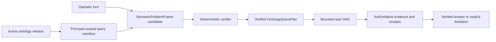

# Ontology Query Coverage Implementation Plan

This plan closes the implementation gap between FDAI's bounded conversation and ontology
foundations and the target non-keyword path for operator questions. It records the verified current
baseline, service and agent ownership, dependency-ordered work packages, cutover gates, and rollback
units for 100% structural query coverage.

> **Coverage boundary:** 100% means every readable declaration in one active ontology release has a
> principal-scoped query descriptor or a typed unavailable reason. It does not promise a complete or
> correct answer when identity, provider data, history, or evidence is missing.
>
> **Authority boundary:** Natural-language and embedding output remains candidate-only. Read plans
> have no execution authority. An explicit change request can create only a typed draft that re-enters
> the existing judgment, safety, human approval, execution, recovery, and audit path.
>
> **Implementation status (2026-08-10):** Exact ontology releases, semantic candidates, bounded
> ObjectSets, secured query receipts, typed function registration, current inventory projection,
> metric providers, and causal-analysis primitives exist. The production path still uses regex and
> token routing plus an optional serial two-to-three-command read plan. A server-side intent graph,
> full release-derived query manifest, `OntologyQueryPlan`, complete semantic index adapter,
> historical topology, and cross-resource temporal query composition have not landed.
> The OQ-01 implementation-free SDK models for the semantic problem frame, query DAG, intent graph,
> task receipt, and structural coverage receipt now ship. Producer and consumer projection wiring
> remains part of OQ-04 and OQ-05.
> OQ-02 now includes a content-addressed principal-scoped manifest builder that filters functions by
> role and purpose and accounts for every supplied release declaration. LinkTypes without reviewed
> query-side metadata remain typed unavailable, and production Interface catalog loading remains.
> OQ-03 now includes an exact-release query DAG executor with bounded dependency waves, concurrency,
> timeout, cancellation, blocked-descendant handling, stable failure reasons, and task receipts.
> ObjectSet materialization is the first built-in handler; set, aggregation, projection, temporal,
> and evidence-join handlers remain.

## Design at a glance

The model decomposes language and proposes a meaning representation. The verifier owns schema
identity, relationship composition, time bounds, scope, purpose, and capability checks. Concrete
objects are selected only by authoritative reads after plan verification.

## Verified baseline and gaps

| Area | Verified current implementation | Gap that blocks the target |
|------|---------------------------------|----------------------------|
| Conversation routing | The local independent Operator Service restores model narration from the resolved Azure candidates; Core `ConversationCoordinator` still uses `_VERB_PATTERNS`, and `ReadPlanNarrator` may propose two or three canonical command strings that `execute_read_plan` runs serially. | Local model narration has no provider-read or execution authority and does not supply a server-side semantic problem frame, intent graph producer, dependency-wave executor, or typed plan bridge. |
| Console intent graph | The Console strictly parses and renders bounded `intent_graph` and `intent_graph_evidence` payloads. | No Core or Operator Service producer was found; the current implementation is presentation-only. |
| Semantic interpretation | `SemanticInterpretationCandidate`, `VerifiedSemanticPlan`, exact release checks, and candidate-only authority exist. | The verified plan targets one typed function and is not connected to conversation routing or a generic ontology query algebra. |
| Object queries | `ObjectSetDefinition`, typed predicates, one bounded traversal, interface selection, ACL projection, purpose checks, and secured receipts exist. | Set operations, ordering, aggregation, projection, multi-stage function composition, and planner descriptors are not one `OntologyQueryPlan`. |
| Query manifest | `platform_manifest` exposes release identity plus interface, ActionType, and function names. | ObjectType properties, allowed operators, LinkType sides, evidence requirements, availability, and typed unavailable reasons are absent. |
| Interfaces | Interface compilation and interface-selected ObjectSets are tested. | Runtime catalog projection does not load reviewed Interface declarations. |
| Relationships | LinkType endpoint, cardinality, causal, transitive, and temporal metadata exist; stores support incoming/outgoing traversal. | LinkTypes do not declare two reviewed query sides, and the planner cannot select inverse meaning without raw direction knowledge. |
| Semantic generations | Rule semantic schemas, generation contracts, database migrations, and the `CatalogSemanticIndex` Protocol exist. | No concrete index adapter or generation publisher is present in the current service-owned source tree; full-ontology generations are absent. |
| Current topology | Azure projection emits resource-group and VNet containment, attachment, and a bounded dependency allowlist. | Azure adapters do not emit `peered_with` or `routes_to`; private endpoint, workload, and service dependency coverage is incomplete. |
| Historical topology | Current graph generations and immutable decision snapshots preserve replay identity. | The instance graph is not bitemporal; general `graph_at` and `topology_diff` functions do not exist. |
| Metrics and causality | Routed Prometheus, Azure Metrics, and KQL providers plus deterministic T1 causal and temporal-analysis primitives exist. | No ontology metric-concept registry compiles arbitrary question measures to providers; ad hoc cross-resource temporal joins are not available. |

## Ownership and service boundaries

| Responsibility | Accountable owner | Runtime placement |
|----------------|-------------------|-------------------|
| Natural-language decomposition and clarification | Bragi | Core agent runtime; Operator Service is the authenticated relay and projection host. |
| Ontology and query-manifest lifecycle | Mimir | Core mechanical builder and catalog lifecycle. |
| Current and historical context materialization | Muninn | Core projection workers and owned persistence adapters. |
| Evidence observation and completeness | Heimdall | Core read-only provider bindings and typed observations. |
| Correlated audit and replay evidence | Saga | Append-only audit path. |
| External query authentication, scope, streaming, and display projection | Operator Service | Independent service using versioned shared contracts only. |
| Query and receipt wire contracts | Shared service-contract SDK | No service implementation or provider access. |

Authority-bearing transitions remain event-bus messages. Read-only query execution may use a
purpose-bound immutable projection, but one service never imports another service's implementation.
No new agent is introduced.

## Target contracts

### Semantic problem frame

`SemanticProblemFrame` separates language interpretation from object retrieval. It carries:

- operation class, such as select, compare, explain change, validate, or draft action;
- subject constraints without an invented runtime identity;
- measure and unit concepts;
- temporal and comparison windows pinned to trusted time;
- requested answer shape and evidence requirements;
- unresolved concepts and competing interpretations.

It contains no provider query, raw SQL/KQL, object claim, or execution authority.

### Ontology query plan

A verified `OntologyQueryPlan` is a closed DAG over these operations:

- object or interface selection and exact context anchors;
- typed property predicates and projections;
- reviewed LinkType-side traversal;
- set union, intersection, and subtraction;
- ordering, grouping, and bounded aggregation;
- registered read-only query, derive, and validate functions;
- temporal snapshot, diff, metric-window, and evidence-join nodes.

Every node pins the active release, purpose, role, scope, limits, dependencies, and expected receipt
shape. The plan cannot contain executable provider text or a mutation handler.

## Work packages

| ID | Work package | Depends on | Exit evidence |
|----|--------------|------------|---------------|
| OQ-00 | Freeze the current implementation baseline, correct status claims, inventory every regex/token route, and add bilingual competency cohorts for exact, ambiguous, unsupported, temporal, causal, and action questions. | None | Machine-readable baseline and replay fixtures identify every compatibility path. |
| OQ-01 | Add versioned shared contracts for `SemanticProblemFrame`, `OntologyQueryPlan`, intent goals, clarification, task receipts, and structural coverage receipts. | OQ-00 | N/N-1 codec tests reject unknown authority, unbounded plans, cycles, and stale refs. |
| OQ-02 | Extend ontology catalog data with LinkType query sides and reviewed Interface declarations; generate a complete principal-scoped manifest from the exact release. | OQ-01 | Every readable ObjectType, Property, LinkType side, Interface, FunctionType, and draft-only ActionType has one descriptor or unavailable reason. |
| OQ-03 | Implement the generic plan verifier and executor over ObjectSets, set operations, ordering, aggregation, projection, and typed function nodes. | OQ-01, OQ-02 | Property tests prove bounds, type safety, purpose narrowing, ACL closure, truncation, cancellation, and stable receipts. |
| OQ-04 | Replace string-command `ReadPlanNarrator` planning with Bragi-owned schema-constrained decomposition, manifest search/describe, deterministic verification, and durable clarification. Run it in shadow beside the compatibility path. | OQ-02, OQ-03 | English/Korean turns produce replay-stable verified plans or one bounded clarification without invoking an unverified read. |
| OQ-05 | Implement the server-side intent graph and dependency-wave task executor with bounded concurrency, cancellation, blocked descendants, conflict detection, one evidence ledger, and claim verification. | OQ-03, OQ-04 | Operator Service streams the same versioned graph and receipts that the Console already validates; partial branches cannot become complete answers. |
| OQ-06 | Restore a concrete semantic-index adapter and off-path generation publisher in the owning service, then expand generation documents from Rules to declarations and eligible deployment-local object projections. | OQ-02 | Full initial generation, digest-reusing incremental generation, independent validation, atomic activation, stale degradation, and rollback tests pass. |
| OQ-07 | Complete current Azure topology projection for VNet peering, routes, private endpoints, network membership, workload placement, and service dependencies; bind the network-path receipt issuer. | OQ-02, OQ-03 | VM-to-service and service-to-data-store path fixtures preserve direction, reciprocal peering evidence, completeness, and unknown absence. |
| OQ-08 | Add append-only topology relationship revisions and retained provider-generation references, plus bounded `graph_at` and `topology_diff` functions. Keep the current graph as the fast current-state projection. | OQ-03, OQ-07 | Before/after peering fixtures reconstruct exact retained graphs, tombstones, late evidence, and incomplete history without rewriting decisions. |
| OQ-09 | Add a reviewed metric-semantic registry and bounded functions for metric series, change points, aligned windows, cross-resource temporal correlation, and causal support/refutation. | OQ-03, OQ-05, OQ-08 | Request-growth and storage-write-loss scenarios distinguish zero from missing data, correlate changes without asserting chronology as cause, and cite competing explanations. |
| OQ-10 | Shadow-replay the new path against every compatibility route, promote by measured cohort, then remove regex, keyword narrator, phrase-based answer intent, and canonical-string read planning from ordinary language. Preserve an explicit exact-command surface separately. | OQ-05, OQ-06, OQ-09 | New path meets or improves cohort quality and latency, legacy ordinary-language routing share is zero, and exact technical commands remain deterministic. |
| OQ-11 | Enforce continuous structural coverage and question disposition gates on every ontology release and capability change. | OQ-10 | Structural coverage and terminal disposition are 100%; unsupported claims and unauthorized executions are zero; answer coverage is reported by cohort, not asserted. |

## Parallel lanes and merge points

- **Lane A - contracts and manifest:** OQ-01 -> OQ-02.
- **Lane B - query kernel:** OQ-03 after the OQ-01 contract freeze; it joins OQ-02 before release.
- **Lane C - semantic projection:** OQ-06 begins after descriptor identity from OQ-02 is stable.
- **Lane D - operational evidence:** OQ-07 -> OQ-08 -> OQ-09, parallel to OQ-04/OQ-05 after OQ-03.
- **Lane E - conversation cutover:** OQ-04 -> OQ-05 -> OQ-10, joining OQ-06 and OQ-09 at cutover.

Each lane runs only focused tests. OQ-10 is the first integration point that compares complete
end-to-end behavior. OQ-11 is the release gate.

## Competency scenarios

### Request volume increased since last week

The expected plan decomposes the request into `explain_change`, a request-volume measure, service
subject constraints, equal baseline/current windows, and causal-evidence requirements. It then
resolves the metric concept, finds affected services, traverses to workloads and pods, retrieves
changes around the change point, compares complete windows, and ranks supported/refuted/unresolved
hypotheses. "Requests" or the calendar boundary remains a clarification when context cannot resolve
it.

### Storage writes stopped after a network change

The expected plan anchors the storage object and write-success series, discovers upstream workload
and VM dependencies from the retained pre-change graph, compares network paths before and after the
change, retrieves the peering revision and write-attempt evidence, and tests DNS, route, firewall,
credential, and application alternatives. A missing current edge never proves that an old path did
not exist or that the peering change caused the symptom.

## Migration, rollout, and rollback

- **Additive contracts first:** New fields and tables land without changing the current read path.
- **Shadow comparison:** New plans execute read-only beside compatibility routing and cannot alter the
  visible answer until cohort gates pass.
- **Atomic generations:** Semantic generations stage and validate before pointer activation; rollback
  reactivates a retained compatible generation.
- **Separate temporal storage:** Historical relationship revisions never turn the current instance
  store into an implicit latest-wins bitemporal authority.
- **Capability switches:** Availability, enabled state, and authority remain independent. Disabling
  semantic planning returns to exact commands and typed unavailable results, not keyword guessing.
- **Legacy removal last:** Regex and token paths are deleted only after replay evidence and one stable
  rollback release. Re-enabling them is not the long-term rollback mechanism.

## Verification and measures

| Measure | Release expectation |
|---------|---------------------|
| Structural schema coverage | 100% of readable active declarations represented or typed unavailable. |
| Question disposition | 100% of accepted turns terminate as answer, clarification, hold, unsupported, or draft. |
| Unsupported operational claims | Exactly 0. |
| Unauthorized execution from conversation | Exactly 0. |
| Exact identity and stale-revision errors | Exactly 0. |
| Answer coverage | Measured separately by question, language, domain, provider, and evidence cohort. |
| Clarification quality | Correctly asks only when material competing interpretations remain. |
| Full vs incremental generation parity | Identical ordered document digests and retrieval cohort outcomes. |
| Historical replay | Same cutoff resolves the same retained graph and evidence receipts. |

## Twenty-round hardening record

The first three landed slices were reviewed through 20 independent critique lenses covering
contract digests, bounds, DAGs, concurrency, authority, serialization, error handling, cancellation,
redaction, replay time, manifest accounting, stale releases, ObjectSets, receipts, performance,
service boundaries, Operator projection, narrator authority, degradation, and docs-code parity.

Verified Medium-or-higher findings were resolved as follows:

- principal-scoped manifests now remove properties outside the caller role or purpose;
- declarations absent from the exact release are rejected rather than silently ignored;
- execution rechecks both ontology release and query-manifest digest;
- manifest hashing has an explicit 8 MiB ceiling instead of the small per-record JSON ceiling;
- cancellation is observed before and during handler execution, including semaphore wait;
- the node deadline covers queueing and handler execution together;
- authorization denial, unavailable handlers, invalid handler results, timeout, cancellation, and
  unexpected provider failures produce stable typed receipts without provider details;
- focused tests cover concurrent waves, blocked descendants, stale authority, cancellation races,
  total deadlines, property filtering, declaration mismatch, and digest stability.

Rejected findings included handler-internal fan-out, impossible DAG cycles after contract
validation, timezone-naive receipt acceptance, and candidate-limit truncation. These were either
outside the executor boundary or already fail-closed by the existing contract. No reproducible
Medium-or-higher finding remains in the landed contract, manifest, and executor slices.

Residual Low observations are code duplication between terminal receipt builders, multiple bounded
graph projection passes, and clearer diagnostics for developer-only adapters. Missing LinkType
query sides, Interface loading, semantic generation, topology history, and temporal joins remain
planned capabilities, not hidden hardening defects.

## Related docs

| To learn about | Read |
|----------------|------|
| Target question planning and coverage contract | [Hierarchical Conversation Planning](hierarchical-conversation-planning.md) |
| Exact releases, ObjectSets, and typed functions | [FDAI Ontology Safety Infrastructure](../architecture/operating-ontology-platform.md) |
| Operating objects, relationships, identity, and time | [FDAI Operating Ontology](../architecture/operating-ontology.md) |
| Rule-specific semantic generations | [Rule Semantic Retrieval](../rules-and-detection/rule-semantic-retrieval.md) |
| Causal hypothesis evidence and closure | [Causal Incident Graph](../rules-and-detection/causal-incident-graph.md) |
| Console and narrator authority | [FDAI Console Conversations](operator-console.md) |
