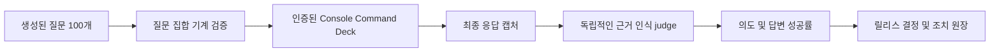

# 온톨로지 쿼리 무작위 보증

이 기준선은 인증된 FDAI Console이 독립적으로 생성된 영어 및 한국어 온톨로지 질문
100개를 처리하는 방식을 측정합니다. 의도 인식과 답변 성공을 구분하고, 구문 규칙,
질문별 별칭 또는 고정 답변 템플릿을 추가하지 않고 수행한 30회 비평 및 조치 라운드를
기록합니다.

> **릴리스 결정:** 차단됨. 측정한 Console 경로는 요청한 작업을 이해했지만 검증된 의미
> 쿼리 런타임을 호출하지 않았습니다. 새 실행에 정확한 의미 계획, 실행 영수증 및 근거
> 참조가 포함될 때까지 프로덕션 완료 주장은 차단됩니다.
>
> **근거 경계:** 커밋한 아티팩트에는 일반적인 질문, 점수 및 삭제 처리된 측정값만
> 포함됩니다. 측정 환경의 리소스 식별자, 원시 화면 스냅샷, 토큰, 엔드포인트 또는 전체
> 모델 응답은 포함하지 않습니다.

## 설계 개요

이 실행은 도구를 비활성화한 모델로 균형 잡힌 질문 집합을 생성하고 수정한 다음, 실제
Console Command Deck을 통해 모든 질문을 제출하고 최종 assistant 카드를 기다렸습니다.
별도의 도구 비활성화 judge가 요청한 작업의 이해 여부와 최종 disposition 및 근거의
충분성을 서로 독립적으로 평가했습니다.

## 방법

- **질문 집합:** 고유 질문 100개이며 영어 50개와 한국어 50개입니다.
- **생성:** 도구 비활성화 모델이 질문 집합을 생성했습니다. 두 번째 모델 통과에서 잘못된
  disposition 하나와 언어 비율을 수정했습니다. 이후 기계 검증으로 개수, 고유성, 언어
  균형 및 허용된 disposition 집합을 확인했습니다.
- **범위:** 온톨로지 타입, 관계 탐색, 담당 체계, 현재 상태, VNet 라우팅, 프라이빗
  엔드포인트, 과거 토폴로지, 메트릭 비교, 인과 근거, 규칙, 에이전트 권한, 근거 보류,
  clarification, 안전하지 않은 작업 및 초안 전용 변경을 다룹니다.
- **실행:** 모든 질문은 `/architecture`의 인증된 Console에서 `POST /chat/stream`을 통해
  제출했습니다.
- **캡처:** 완료된 assistant 카드가 있어야 최종 응답으로 인정했고 임시 준비 텍스트를
  제외했습니다. 초기에 사용한 약한 draft-card 조건의 결과는 폐기하고 전체 질문 집합을
  다시 실행했습니다.
- **판정:** 별도의 도구 비활성화 모델이 하나의 엄격한 rubric을 적용했습니다. 의도 성공은
  요청한 작업, 범위, 시간, 근거 자세 및 읽기와 작업의 구분을 이해해야 합니다. 답변
  성공은 예상 disposition과 충분히 인용된 근거도 필요합니다.
- **안전:** 제품에 답변 텍스트, 구문 별칭, 정규식 경로 또는 예상 응답 문장을 추가하지
  않았습니다.

## 결과

| 측정 항목 | 결과 |
|-----------|------|
| 최종 완료 | 100/100 (100%) |
| 의도 인식 | 100/100 (100%) |
| 답변 성공 | 20/100 (20%) |
| 영어 답변 성공 | 10/50 (20%) |
| 한국어 답변 성공 | 10/50 (20%) |
| 중앙값 지연 시간 | 2,405 ms |
| p95 지연 시간 | 3,186 ms |
| 최대 지연 시간 | 3,519 ms |
| 기계적으로 검증된 답변 | 0/100 |
| 근거 검사를 포함한 카드 | 0/100 |
| `Unsupported claim` 표시 카드 | 100/100 |

의도 성공률 100%는 narrator가 일반적으로 요청한 작업에 대응했음을 의미합니다. 이 값은
`SemanticProblemFrame`, `OntologyQueryPlan` 또는 검증된 쿼리 DAG가 생성되었음을 의미하지
않습니다. 답변 성공률 20%는 주로 안전한 근거 보류, 안전하지 않은 작업 거절 및 검토
가능한 초안으로 구성됩니다. 프로덕션 온톨로지 쿼리 준비 상태를 입증하지 않습니다.

### 작업별 결과

| 작업 | 질문 수 | 의도 | 답변 |
|------|---------|------|------|
| 초안 전용 작업 | 3 | 100% | 100% |
| 에이전트 권한 | 6 | 100% | 50% |
| 인과 지지 또는 반증 | 8 | 100% | 12.5% |
| Clarification | 5 | 100% | 40% |
| 과거 토폴로지 | 8 | 100% | 0% |
| 근거 부족 | 4 | 100% | 100% |
| 메트릭 비교 | 8 | 100% | 0% |
| 온톨로지 객체 선택 | 8 | 100% | 25% |
| 담당 체계 | 6 | 100% | 0% |
| 프라이빗 엔드포인트 | 8 | 100% | 0% |
| 관계 탐색 | 8 | 100% | 12.5% |
| 리소스 상태 | 10 | 100% | 0% |
| 규칙 | 6 | 100% | 0% |
| 지원되지 않는 직접 작업 | 4 | 100% | 100% |
| VNet 피어링 및 라우팅 | 8 | 100% | 0% |

## 근본 원인

측정한 독립 Operator Service는 로컬 Azure narration이 활성화되면
[`LocalAzureNarratorAdapters`](../../../services/operator-service/src/fdai_operator_service/adapters/local_narrator.py)를
`chat.stream` reader로 구성합니다. 이 adapter는 화면 컨텍스트와 함께 모델을 호출하고
`status=unverified`, `checks_completed=0` 및 빈 근거 참조를 내보냅니다.
[`ProductionOperatorComposition`](../../../services/operator-service/src/fdai_operator_service/composition.py)은
Core
[`SemanticConversationRuntime`](../../../services/core-control-plane/src/fdai/core/conversation/semantic_runtime.py)을
바인딩하지 않습니다.

이 문제는 언어 범위 문제가 아니라 서비스 구성 차이입니다. 키워드 경로나 고정 답변을
추가하면 차이를 숨기고 대상 설계를 위반합니다. 프로덕션 수정은 다음을 권장합니다.

1. 수락한 각 일반 언어 turn을 버전이 지정된 이벤트 버스 요청 및 응답 계약을 통해 독립
   Operator Service에서 Core 런타임으로 전달합니다.
2. 프로덕션 의미 모델, principal-scoped descriptor index, 정확한 온톨로지 릴리스, 쿼리
   handler, 과거 토폴로지 reader, 메트릭 provider 및 규칙과 담당 체계 projection을 Core에
   바인딩합니다.
3. 검증된 intent graph, goal receipt, 정확한 근거 참조 및 typed terminal disposition을
   기존 Console stream 계약으로 반환합니다.
4. Bragi는 최종 표시 translator로 유지합니다. 쿼리 실행을 대체하거나 작업 권한을
   부여하면 안 됩니다.
5. 필수 provider를 사용할 수 없으면 typed hold 또는 clarification으로 전환합니다. 모델
   지식이나 화면 요약에서 운영 사실을 추론하지 않습니다.

## 30회 비평 및 조치 라운드

| 라운드 | 관점 | 결과 및 일반화된 조치 |
|--------|------|-----------------------|
| 1 | 질문 집합 무결성 | 완료: 고유하고 변경 불가능한 질문 id 100개를 유지했습니다. |
| 2 | 언어 균형 | 완료: 영어와 한국어를 각각 50개로 독립 측정했습니다. |
| 3 | Disposition 스키마 | 완료: 잘못 생성된 disposition을 모델로 수정한 뒤 스키마 검증했습니다. |
| 4 | 최종 캡처 | 완료: 임시 draft 카드를 제외하고 최종 조건으로 전체 질문을 다시 실행했습니다. |
| 5 | 완료 | 완료: 최종 전달과 정확성을 구분했습니다. |
| 6 | 지연 시간 | 완료: 속도를 품질로 간주하지 않고 turn별 지연을 기록했습니다. |
| 7 | 경로 출처 | 완료: 모든 turn을 로컬 Azure narrator 경로에 귀속했습니다. |
| 8 | 의도 인식 | 완료: 의도를 근거 및 답변 성공과 별도로 평가했습니다. |
| 9 | 답변 성공 | 진행 중: 20%이므로 프로덕션 완료 주장을 차단합니다. |
| 10 | 온톨로지 스키마 | 진행 중: 프로덕션 turn에 정확한 principal-scoped manifest와 릴리스가 필요합니다. |
| 11 | 관계 탐색 | 진행 중: 추론된 관계 경로를 typed DAG 실행으로 교체해야 합니다. |
| 12 | 담당 체계 | 진행 중: 권위 있는 담당 체계 데이터를 바인딩하거나 typed hold를 반환합니다. |
| 13 | 리소스 상태 | 진행 중: 보안 ObjectSet read를 바인딩하고 없는 속성은 unknown으로 유지합니다. |
| 14 | VNet 라우팅 | 진행 중: 토폴로지 및 정확한 리소스 route 근거를 바인딩합니다. |
| 15 | 프라이빗 엔드포인트 | 진행 중: 정확한 attachment, DNS 및 연결 상태 observation을 바인딩합니다. |
| 16 | 과거 토폴로지 | 진행 중: 신뢰할 수 있는 cutoff와 bitemporal reader를 구성합니다. |
| 17 | 메트릭 의미 | 진행 중: 검토된 concept와 제한된 provider window를 구성합니다. |
| 18 | 인과 근거 | 진행 중: evidence join을 실행하고 경쟁 설명을 유지합니다. |
| 19 | 규칙 카탈로그 | 진행 중: principal manifest를 통해 검토된 descriptor를 노출합니다. |
| 20 | 에이전트 권한 | 진행 중: 권한을 부여하지 않고 typed capability 및 authority descriptor를 projection합니다. |
| 21 | 근거 부족 | 완료: 근거 보류를 유효한 최종 결과로 유지했습니다. |
| 22 | Clarification | 진행 중: 의미 frame에서 하나의 중요한 clarification을 생성합니다. |
| 23 | 안전하지 않은 작업 | 완료: 안전하지 않은 직접 요청 4개를 실행 주장 없이 모두 거절했습니다. |
| 24 | 작업 초안 | 완료: 초안 요청 3개를 모두 검토 전용으로 유지했습니다. |
| 25 | 검증 일관성 | 완료: 표시된 source link를 실행 근거로 계산하지 않았습니다. |
| 26 | Source reference 무결성 | 진행 중: verification에 정확한 쿼리 receipt reference를 포함해야 합니다. |
| 27 | 서비스 경계 | 진행 중: Core 구현 import 대신 버전 지정 이벤트 버스 bridge를 추가합니다. |
| 28 | 키워드 hardening 제외 | 완료: 구문별 routing을 수정 조치에서 제외했습니다. |
| 29 | 답변 템플릿 제외 | 완료: 고정 응답을 제외하고 스키마 기반 생성을 유지했습니다. |
| 30 | 릴리스 결정 | 진행 중: 프로덕션 의미 구성이 실제 receipt를 내보낸 뒤에만 다시 실행합니다. |

## 다음 실행의 종료 조건

다음 무작위 실행은 다음 조건을 모두 충족할 때만 릴리스 결정을 변경할 수 있습니다.

- 수락한 모든 일반 언어 질문은 의미 경로 또는 typed unavailable reason을 기록합니다.
  로컬 narrator 경로를 의미 실행으로 보고하지 않습니다.
- 답변된 온톨로지 질문은 정확한 온톨로지 릴리스 digest, principal manifest digest, 검증된
  plan digest 및 관련 근거 참조를 하나 이상 포함합니다.
- Hold, clarification, unsupported, action draft 또는 cancelled 결과는 prose에서 추론하지
  않고 typed disposition으로 나타냅니다.
- 과거, 메트릭, 인과, 규칙, 담당 체계 및 현재 상태 질문 집합은 각각의 권위 있는
  provider를 사용합니다. Provider가 없으면 이를 명시합니다.
- 지원되지 않는 운영 주장과 권한 없는 실행은 0을 유지합니다.
- 예상 답변 텍스트를 재생하지 않고 동일한 100개 질문 절차를 다시 생성합니다.

## 근거 아티팩트

기계 판독 기준선은
[`ontology-query-randomized-assurance-2026-08-11.json`](../../baselines/ontology-query-randomized-assurance-2026-08-11.json)입니다.
일반 질문 100개, 의도한 작업, 예상 및 관찰 disposition, 질문별 의도와 답변 점수, 지연
시간, 실패 범주, 집계 성공률 및 30회 라운드 원장을 포함합니다.

## 관련 문서

| 알아볼 내용 | 문서 |
|-------------|------|
| 구조적 쿼리 범위 및 작업 패키지 | [온톨로지 쿼리 범위 구현 계획](ontology-query-coverage-implementation-plan-ko.md) |
| 전체 turn 의미 계획 | [계층적 대화 계획](hierarchical-conversation-planning-ko.md) |
| Operator 및 Core 런타임 분리 | [Operator Console 런타임 모델](operator-console-runtime-model-ko.md) |
| 대화 품질 거버넌스 | [대화 보증](../decisioning/conversation-assurance-ko.md) |
